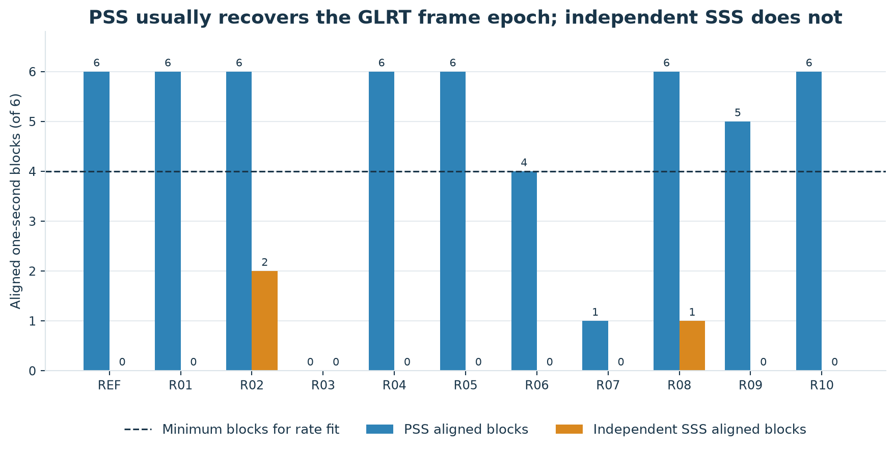
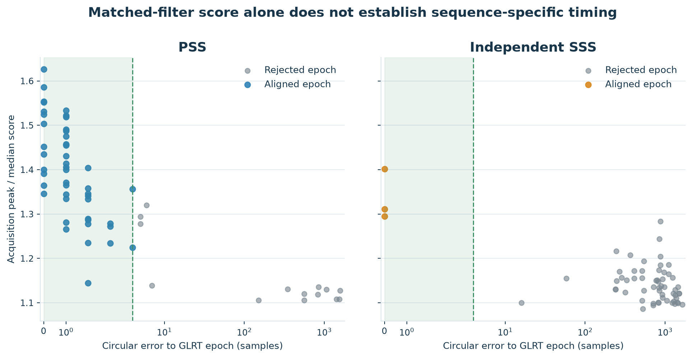
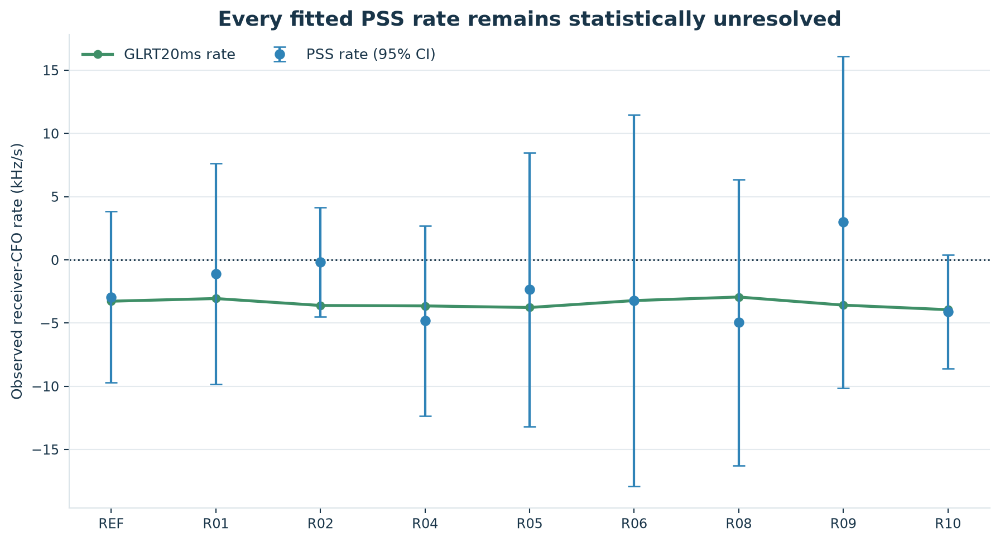
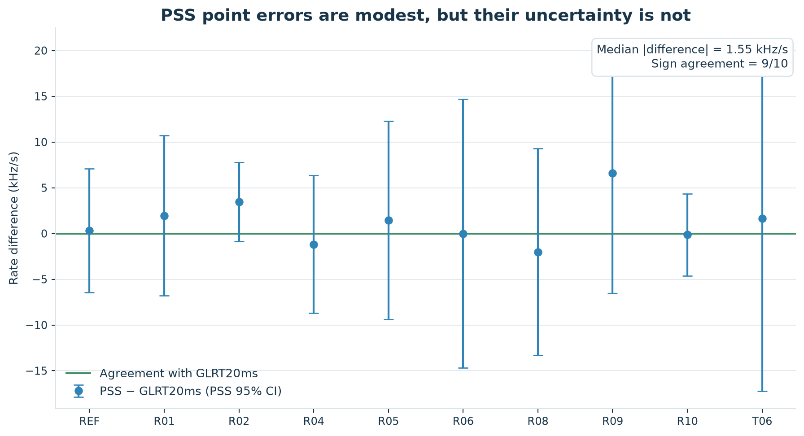
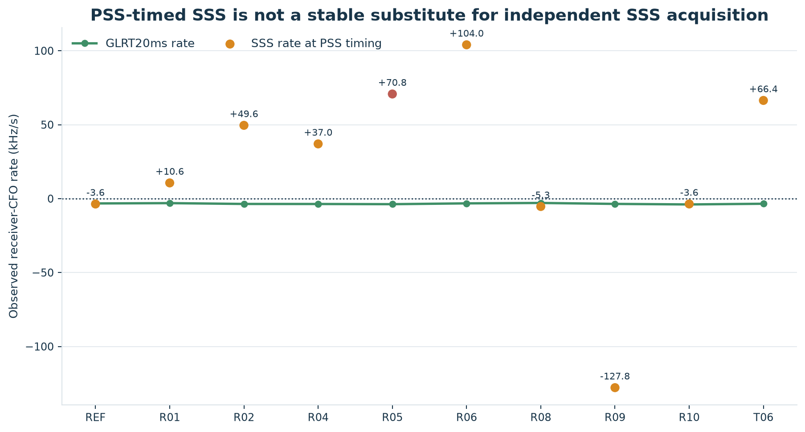

# PSS and SSS Doppler-rate evidence versus GLRT20ms across 21 dwells

## Executive summary

PSS is useful as a frame-timing observable in the strongest recent captures,
but neither PSS nor SSS provides a defensible standalone Doppler-rate estimate
at the recorded 2.5 MHz bandwidth.  GLRT20ms remains the rate reference.

The analysis covers **21 dwells**: the original August 25 reference dwell, 10
additional recent August 25 dwells selected without using PSS or SSS, and a
separate sealed 10-dwell August 21 sensitivity cohort.  In the primary recent
cohort, exact PSS recovered the GLRT frame epoch in at least four of six
one-second blocks in **8/10 dwells** (46/60 blocks).  Independent SSS reached
the same epoch gate in only 3/60 isolated blocks and in **0/10 complete
dwells**.

PSS supplied 10 rate fits across all 21 dwells, but every 95% interval includes
zero.  The PSS point estimates nevertheless have some directional information:
their median absolute difference from GLRT20ms is 1.549 kHz/s, their RMSE is
2.633 kHz/s, and 9/10 have the same sign.  These point comparisons must not be
mistaken for resolved measurements.  SSS is substantially worse: independent
SSS never supplies a dwell-level rate, while evaluating SSS at PSS-derived
timing produces a 46.9 kHz/s median absolute difference from GLRT20ms and one
spuriously resolved, wrong-sign result.

All reported rates are **observed receiver-CFO slopes**.  Oscillator, LNB, and
sample-clock drift have not been separated from spacecraft Doppler, so the
results do not constitute externally calibrated orbital Doppler measurements.

## Introduction

The synchronization sequences offer an attractive possible alternative to a
long known-pilot detector.  If PSS or SSS can be reacquired once per second,
the frequency maximizing its matched-filter response can be tracked over time;
the slope of those frequency estimates is then a candidate Doppler-rate
observable.  This report tests that idea against the existing GLRT20ms
known-pilot estimator rather than assuming that a strong synchronization peak
automatically yields a precise frequency track.

The comparison deliberately separates three questions:

1. Does the sequence search recover the same frame epoch already supported by
   GLRT?
2. Conditional on valid timing, is the sequence frequency peak stable enough
   to support a rate fit?
3. Does that rate agree with GLRT20ms in sign, magnitude, and uncertainty?

This distinction matters most for SSS.  An SSS slice evaluated at a PSS-derived
epoch may be a useful conditional statistic, but it is not independent SSS
acquisition and is not reported as such.

## Motivation

PSS/SSS processing could provide a compact, standard-defined cross-check on
known-pilot Doppler tracking.  It could also help answer whether a candidate
frame cadence is sequence-specific or merely a periodic energy feature.  The
potential benefit is therefore not limited to rate estimation: reliable PSS
timing would strengthen frame-boundary evidence even when its short waveform
cannot resolve frequency slope precisely.

The expected limitation is severe.  At 2.5 MS/s, each synchronization template
occupies only **11 complex samples per frame**.  GLRT20ms integrates a much
longer known-pilot sequence.  A short sync slice can produce a repeatable timing
maximum while leaving a broad, noisy frequency objective.  The experiment was
designed to measure that trade-off over multiple dwells and to avoid drawing a
general conclusion from the original single-dwell result.

## Data used

No new RF was collected.  The analysis reads the existing on-disk IQ corpus
and persisted Standard pilot-scan V3 products only.

### Primary recent cohort

The primary comparison contains the previously examined reference dwell
`cap-20260825T150802-473cb5bbcbd6` plus 10 additional August 25 dwells.  The
additional dwells were selected by a deterministic GLRT-only rule:

- start from the newest completed capture-lane dwells, excluding the reference;
- examine each receiver path for a whole-second-aligned six-second interval;
- require all 240 rank-0 GLRT64 probes in that interval to be positive at a
  margin of at least 0.05;
- rank candidate paths by the six-second positive count and then by the
  full-dwell positive count; and
- keep the latest 10 qualifying dwells.

PSS and SSS outcomes therefore had no role in selecting the recent cohort.  The
reference and each recent dwell contribute six independently analyzed
one-second blocks.

### Historical sensitivity cohort

The separate historical cohort is the sealed 10-dwell August 21 raw-Doppler
set.  It contributes 59 eligible one-second blocks.  Its capture generation and
GLRT selection differ from the recent cohort, so it is used as a sensitivity
check and is not pooled into the recent acquisition fraction.

### Source binding

Every recent result is bound to its recording manifest, analysis manifest,
pilot scan, scope, stream, receiver, edge, and six-second interval.  Historical
results are bound to the sealed raw-Doppler result and recording-manifest
digests.  These bindings and all per-block outputs are retained in the
[machine-readable summary](figures/2026_08_25_multi_dwell_pss_sss_doppler/summary.json).
IQ access was read-only; no path beneath `/mnt/qnap01`, Standard product, or
golden scientific fixture was modified.

## Approach

### 1. Independent sequence acquisition

For each one-second block, the exact published PSS replica was searched over
all 3,333 possible frame phases and nine coarse CFO bins from -400 to +400 kHz.
The score averages normalized matched power over the approximately 750 frame
repetitions in that block.  Independent SSS performs the analogous search for
the following 11-sample symbol and supplies its own timing estimate.

A score maximum is not accepted on magnitude alone.  The recovered phase must
be within four circular samples of the nearest frame epoch predicted by the
persisted GLRT detections.  This is the sequence-specific timing gate used for
both PSS and independent SSS.



*Figure 1. Aligned one-second blocks in the reference and 10 recent dwells. The
dashed line is the minimum block count required for a rate fit.*

### 2. Fine frequency estimation and rate fitting

Once a block passes the timing gate, matched power is evaluated on a fine
frequency bank from -1.2 to +1.2 MHz in 2 kHz steps.  The peak is refined with
three-point log-parabolic interpolation.  A linear rate is fit only when at
least four independently aligned one-second estimates span at least three
seconds.  The reported interval is the two-sided Student-t 95% interval from
ordinary least squares.

The same fine-bank statistic is also evaluated for the SSS slice at a valid
PSS epoch.  That output is labeled **PSS-timed SSS** throughout: it tests the
frequency information in the SSS samples but does not demonstrate independent
SSS acquisition.

### 3. GLRT20ms comparison

The persisted GLRT20ms rate is fit over the 240 known-pilot probes in each
recent six-second interval.  Comparisons use:

- acquisition coverage by dwell and by one-second block;
- whether a 95% rate interval excludes zero;
- absolute PSS/SSS rate difference from GLRT20ms;
- RMSE against GLRT20ms; and
- sign agreement.

### High-level code details

The implementation uses digest-verified manifest-V2 readers, vectorized complex
matched filtering, and matrix evaluation of the fine frequency bank.  The
calculation can be summarized as:

```text
for dwell in selected_dwells:
    glrt_epoch = fit_frame_epoch(persisted_glrt_probes)

    for one_second_block in dwell:
        for sequence in [PSS, SSS]:
            coarse_peak = argmax_over_phase_and_cfo(
                mean_normalized_matched_power(block, sequence)
            )
            aligned = circular_error(coarse_peak.phase, glrt_epoch) <= 4

        if PSS.aligned:
            pss_frequency = fine_bank_peak(-1.2e6, +1.2e6, step=2e3)
            pss_timed_sss_frequency = fine_bank_peak_at(PSS.phase, SSS)

    if at_least_4_aligned_blocks_spanning_3_seconds:
        rate, ci95 = student_t_ols(frequency, block_center_time)
```

Published template coefficients are treated as an offline numerical oracle;
the reference repositories are not runtime dependencies.  A vectorized
11-tap complex correlation forms the per-frame matched power, and the fine
bank reuses the accepted phase across roughly 750 frames in each one-second
block.  The JSON artifact preserves the coarse acquisition scores, epoch
errors, fine frequency estimates, fitted slopes, intervals, and source
digests needed to audit the report.

Figure 2 shows why epoch agreement is part of the acquisition definition.  PSS
often places its stronger scores at the GLRT epoch, whereas nearly all SSS
maxima are hundreds or thousands of samples away.  Score magnitude alone would
not establish sequence-specific timing.



*Figure 2. Per-block acquisition score versus circular error to the GLRT frame
epoch for the 10 recent dwells. The shaded region is the four-sample acceptance
gate.*

## Results

### PSS and SSS acquisition

In the 10 recent dwells, PSS aligns in 46/60 one-second blocks and supplies the
minimum coverage for a rate fit in 8/10 dwells.  The two failures are R03
(0/6 aligned blocks) and R07 (1/6).  Independent SSS aligns in only 3/60 blocks:
two in R02 and one in R08.  No recent dwell reaches the four-block threshold
for an independent SSS rate.

The historical sensitivity cohort is harder: PSS aligns in 6/59 blocks and
supplies a fit in only 1/10 dwells (T06); independent SSS aligns in 0/59.  With
the reference included, PSS supplies a rate fit in 10/21 dwells, while
independent SSS supplies none.

### PSS Doppler-rate comparison

The recent per-dwell results are shown below.  Rates are observed receiver-CFO
slopes in kHz/s.  At least four aligned blocks spanning at least three seconds
are required for a PSS rate fit.

| dwell | capture | path | span (s) | PSS blocks | independent SSS blocks | GLRT20ms rate | PSS rate [95%] |
|---|---|---|---:|---:|---:|---:|---:|
| R01 | `cap-20260825T150527-24e704c86c72` | stream-1/RX1 upper | 34–40 | 6/6 | 0/6 | -3.054 | -1.096 [-9.830, +7.637] |
| R02 | `cap-20260825T145100-cc48b00cfa28` | stream-1/RX1 upper | 25–31 | 6/6 | 2/6 | -3.603 | -0.165 [-4.479, +4.149] |
| R03 | `cap-20260825T144823-4a812245fce1` | stream-0/RX0 upper | 36–42 | 0/6 | 0/6 | -2.601 | insufficient PSS timing |
| R04 | `cap-20260825T142817-9949c81ca994` | stream-1/RX1 upper | 54–60 | 6/6 | 0/6 | -3.638 | -4.821 [-12.342, +2.700] |
| R05 | `cap-20260825T140801-f3fab6fb8ea7` | stream-0/RX1 lower | 45–51 | 6/6 | 0/6 | -3.764 | -2.334 [-13.165, +8.496] |
| R06 | `cap-20260825T135219-697f458d0037` | stream-1/RX1 lower | 54–60 | 4/6 | 0/6 | -3.216 | -3.228 [-17.912, +11.455] |
| R07 | `cap-20260825T134944-696938e832f4` | stream-1/RX1 lower | 2–8 | 1/6 | 0/6 | -3.105 | insufficient PSS timing |
| R08 | `cap-20260825T133307-5eaedd058cf5` | stream-1/RX1 upper | 50–56 | 6/6 | 1/6 | -2.934 | -4.955 [-16.259, +6.349] |
| R09 | `cap-20260825T133033-14e202d5ef1a` | stream-1/RX1 lower | 54–60 | 5/6 | 0/6 | -3.576 | +2.998 [-10.119, +16.114] |
| R10 | `cap-20260825T130425-1678069fefd1` | stream-1/RX1 upper | 52–58 | 6/6 | 0/6 | -3.937 | -4.081 [-8.576, +0.413] |

R06 and R10 have point estimates close to GLRT20ms, but their intervals still
include zero.  R09 has the wrong sign.  None of the eight recent PSS fits is
resolved, and the same is true of the reference and historical T06 fits.



*Figure 3. PSS rate estimates for the reference and eight recent dwells with
sufficient timing. Every PSS 95% interval crosses zero; GLRT20ms remains tightly
clustered near the expected negative slope.*

Across the eight recent fits, the median absolute PSS–GLRT20ms difference is
1.694 kHz/s, RMSE is 2.881 kHz/s, and sign agreement is 7/8.  Across all 10
available fits (reference, eight recent, and historical T06), the corresponding
values are 1.549 kHz/s, 2.633 kHz/s, and 9/10.  These summary errors describe
point estimates only; Figure 4 retains the much wider PSS intervals.



*Figure 4. PSS minus GLRT20ms rate for every available fit. The PSS confidence
intervals are shown relative to the GLRT point estimate; all overlap agreement,
but they also all overlap a zero PSS rate.*

### SSS Doppler-rate comparison

There is no independent SSS rate to compare: independent SSS fails the
dwell-level timing requirement in all 21 dwells.  The conditional PSS-timed SSS
fits are instead a diagnostic of whether the SSS slice contains stable
frequency information once timing is supplied externally.

That diagnostic fails.  Across the 10 available conditional fits, the median
absolute difference from GLRT20ms is 46.9 kHz/s and RMSE is 64.9 kHz/s; sign
agreement is only 4/10.  R05 produces a formally resolved +70.8 kHz/s slope,
opposite the -3.764 kHz/s GLRT20ms result.  This is a useful negative control:
a narrow conditional fit can exclude zero while still tracking the wrong
feature.



*Figure 5. Conditional SSS slopes evaluated at PSS timing. These are not
independent SSS acquisitions. The red R05 point is spuriously resolved and has
the wrong sign.*

### Interpretation and limitations

The multi-dwell evidence supports PSS for frame-epoch confirmation in strong
recent intervals.  It does not support PSS as a standalone rate estimator with
the present bandwidth, template length, and six one-second observations.  SSS
does not independently acquire often enough to produce a rate, and PSS-timed
SSS is unstable.

The historical sensitivity cohort also shows that PSS timing success is not
universal across the corpus.  Its lower acquisition rate is consistent with
weaker synchronization content and older refill-time-compressed recordings,
but the differing cohort construction prevents a causal comparison.

Finally, even GLRT20ms estimates receiver CFO rather than isolated spacecraft
Doppler.  Within-path comparisons are valid because the methods observe the
same samples, but no result here separates spacecraft dynamics from receiver,
oscillator, LNB, or sample-clock contributions.

## Summary

- **PSS detection:** strong frame-timing evidence in 8/10 recent dwells and
  46/60 recent blocks, but only 1/10 historical dwells.
- **PSS rate:** 10 fits across 21 dwells; 0/10 have a 95% interval excluding
  zero.  Point estimates show 1.549 kHz/s median absolute error and 9/10 sign
  agreement against GLRT20ms.
- **Independent SSS detection:** 3/60 isolated recent blocks, 0/10 recent
  dwell-level acquisitions, and 0/21 rates overall.
- **PSS-timed SSS rate:** unstable and not an SSS-only measurement; 46.9 kHz/s
  median absolute error, 64.9 kHz/s RMSE, and one spuriously resolved wrong-sign
  fit.
- **GLRT20ms:** remains the defensible Doppler-rate observable for this corpus
  because it uses the longer known-pilot sequence and produces much tighter
  fits.
- **Claim boundary:** all rates are uncalibrated observed receiver-CFO slopes,
  not isolated orbital Doppler.

The practical conclusion is to retain PSS as corroborating frame-timing
evidence, reject independent SSS as a rate source under the present conditions,
and continue using GLRT20ms for quantitative rate estimation.

## Reproducibility artifacts

- [Machine-readable 21-dwell result and source bindings](figures/2026_08_25_multi_dwell_pss_sss_doppler/summary.json)
- [Historical 10-dwell cohort definition](2026_08_24_ten_dwell_raw_doppler_pipeline.md)
