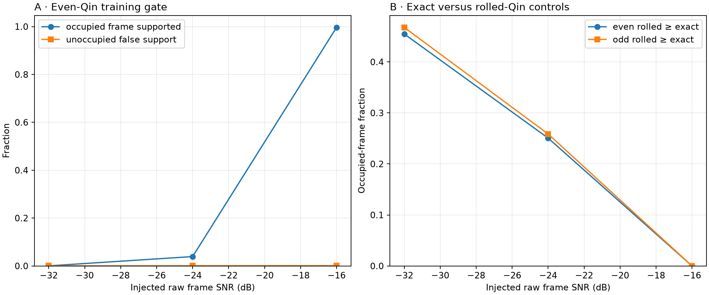
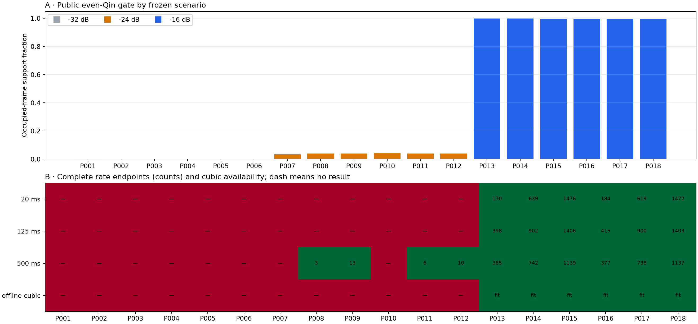
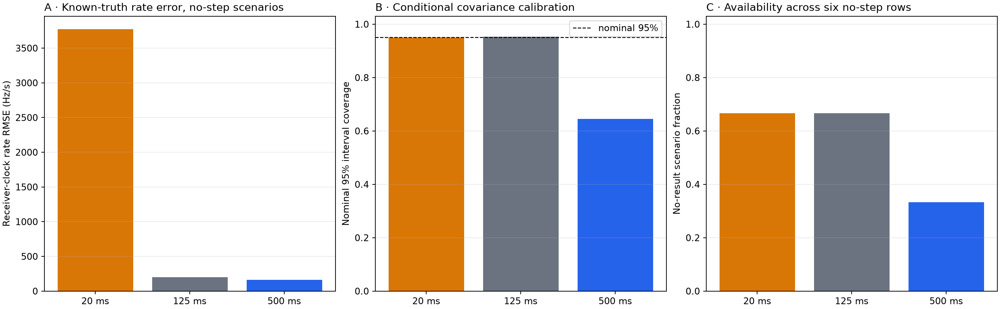
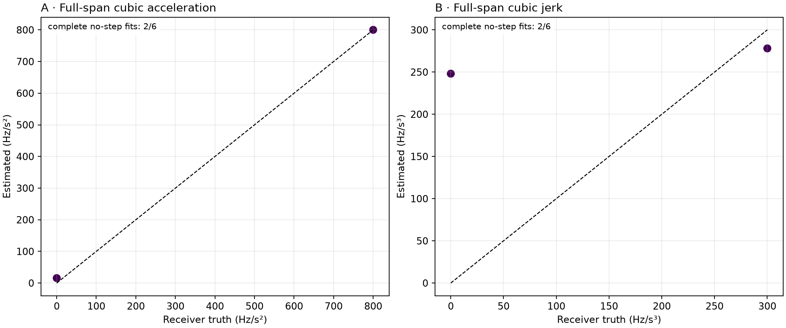
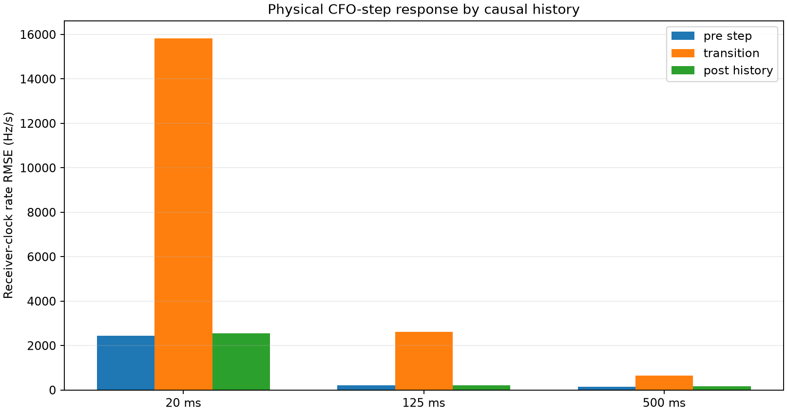

# Known polynomial-phase injection into real POST-FIX backgrounds

Date: 2026-08-25 UTC

Status: **FAIL against preregistered component gates**

This report executes the frozen exact-Qin protocol at repository commit
`5970769a34e40fde5d64ddf57b4be7fe2ac14d93`. It used only the three authorized hard-null spans,
verified every inventory/manifest/chunk digest before decoding CI16, and kept
all 18 scenario outcomes. No holdout, newer capture, dynamic discovery, or
replacement input was used.

## Bottom line

The preregistered promotion gate failed: fixed_500ms_rate_coverage_lower. The 500 ms line met the point-error limits, but its nominal 95%
interval covered only 64.5% of promotion endpoints. Its uncertainty is
overconfident and the unchanged estimator should not be promoted. This is a
conditional frame-CFO/rate calibration with exact timing and the correct
coarse 750 Hz basin supplied; it is not an acquisition-yield claim.
Receiver-clock error is primary.

## Inputs and execution

| Capture | Span samples | Canonical span SHA-256 | Power |
|---|---|---|---|
| cap-20260825T062228-886fe2dd9cde | [20000000, 25000000) | sha256:58c782fd304ba1522c303c89297985c393533ba74070774fc6cc8bc9d8ef76ed | 3.51316e-08 |
| cap-20260825T105640-facdadeffb3b | [55000000, 60000000) | sha256:b42e31056c0056d2a561e8fef089bfe8083ead688a548cdec0e8fe131d5c2dd1 | 0.000248002 |
| cap-20260825T111222-a2d4ce2afb9a | [90000000, 95000000) | sha256:ce67d61bc8ad1be591a3b27fdcfb1eb96d54a14dd39180e3cc9cc0606cc676b7 | 2.10821e-08 |

The exact lower-edge Qin template contains 3,333 samples and was placed without
overlap on `round(10000*k/3)`. The public parity-split likelihood kernel supplied
even-trained CFO points, the public robust tracker supplied fixed 20/125/500 ms
lines, the even rolled control remained a training specificity gate, and odd
exact/control values remained response-only.

The `sample_clock_offset_ppm` factor warps only the injected phase/polynomial
time coordinate. It does **not** resample Qin waveform boundaries or move the
fixed 3,333/3,334-sample lattice. It is therefore a phase-coordinate
clock-scale test, not a full sample-clock or timing-offset simulation.

## Frame recovery and controls

| SNR (dB) | Occupied support | Empty false support | Even control wins | Odd control wins |
|---|---|---|---|---|
| -32 | 0.0% | 0.03% | 2729 | 2806 |
| -24 | 3.9% | 0.06% | 1504 | 1552 |
| -16 | 99.7% | 0.08% | 0 | 0 |

The SNR transition is sharp: occupied support is effectively absent at -32 dB,
only 3.9% at -24 dB, and 99.7% at -16 dB. Rolled-control wins track the same
transition and the unoccupied false-support fraction remains below 0.1%.

## Scenario-level availability

No-result outcomes are evidence, not missing rows. Endpoint counts below are
the public tracker's complete outputs; zero means that the frozen support,
coverage, frame-count, or gap requirements never produced an estimate.

| ID | Capture UTC | SNR | Occ. | Step Hz | Clock ppm | Supported/occupied | False supports | 20 ms n | 125 ms n | 500 ms n | Cubic |
|---|---|---|---|---|---|---|---|---|---|---|---|
| P001 | 062228 | -32 | 0.35 | 0 | -25 | 1/525 | 2 | 0 | 0 | 0 | insufficient |
| P002 | 105640 | -32 | 0.65 | 0 | -25 | 0/975 | 0 | 0 | 0 | 0 | insufficient |
| P003 | 111222 | -32 | 1.00 | 300 | 0 | 1/1500 | 0 | 0 | 0 | 0 | insufficient |
| P004 | 062228 | -32 | 0.35 | 300 | 0 | 0/525 | 0 | 0 | 0 | 0 | insufficient |
| P005 | 105640 | -32 | 0.65 | -300 | 25 | 0/975 | 0 | 0 | 0 | 0 | insufficient |
| P006 | 111222 | -32 | 1.00 | -300 | 25 | 0/1500 | 0 | 0 | 0 | 0 | insufficient |
| P007 | 105640 | -24 | 0.35 | 300 | 0 | 18/525 | 0 | 0 | 0 | 0 | insufficient |
| P008 | 111222 | -24 | 0.65 | 0 | 0 | 38/975 | 0 | 0 | 0 | 3 | insufficient |
| P009 | 062228 | -24 | 1.00 | 0 | 25 | 59/1500 | 0 | 0 | 0 | 13 | insufficient |
| P010 | 105640 | -24 | 0.35 | 300 | 25 | 23/525 | 0 | 0 | 0 | 0 | insufficient |
| P011 | 111222 | -24 | 0.65 | -300 | -25 | 38/975 | 2 | 0 | 0 | 6 | insufficient |
| P012 | 062228 | -24 | 1.00 | -300 | -25 | 59/1500 | 0 | 0 | 0 | 10 | insufficient |
| P013 | 111222 | -16 | 0.35 | 0 | 25 | 524/525 | 1 | 170 | 398 | 385 | complete |
| P014 | 062228 | -16 | 0.65 | 300 | 25 | 974/975 | 1 | 639 | 902 | 742 | complete |
| P015 | 105640 | -16 | 1.00 | 0 | -25 | 1495/1500 | 0 | 1476 | 1406 | 1139 | complete |
| P016 | 111222 | -16 | 0.35 | 300 | -25 | 523/525 | 0 | 184 | 415 | 377 | complete |
| P017 | 062228 | -16 | 0.65 | -300 | 0 | 970/975 | 1 | 619 | 900 | 738 | complete |
| P018 | 105640 | -16 | 1.00 | -300 | 0 | 1493/1500 | 0 | 1472 | 1403 | 1137 | complete |

## Causal rate truth

Scenario-equal results below use the six no-step scenarios. Endpoints are
serially correlated, so coverage is descriptive rather than a binomial
confidence experiment.

| Estimator | Scenarios | No result | Receiver bias | Receiver RMSE | Median absolute error | >500 Hz/s | 95% coverage | Physical RMSE |
|---|---|---|---|---|---|---|---|---|
| Causal 20 ms | 6 | 4 | -25.11 | 3771.17 | 1690.28 | 82.9% | 95.0% | 3771.17 |
| Fixed 125 ms | 6 | 4 | -21.04 | 202.56 | 149.87 | 0.5% | 95.3% | 202.53 |
| Fixed 500 ms | 6 | 2 | -62.94 | 163.31 | 112.27 | 0.0% | 64.5% | 163.20 |

The 20 ms line is not competitive here: despite wide intervals giving about
95% coverage on its two evaluable no-step rows, its 3.77 kHz/s RMSE and 82.9%
large-error rate are unacceptable. The 125 ms line is much more stable but has
no result outside the two -16 dB no-step rows. The 500 ms line reaches all four
promotion rows and has the lowest point RMSE, but its frozen 50 Hz measurement
scale does not capture its actual endpoint error.

## Acceleration and jerk diagnostic

The full-span cubic is offline and diagnostic. It estimates all three
derivatives; the causal line baselines estimate rate only.

| Derivative | Scenarios | No result | Receiver bias | Receiver RMSE | 95% coverage | Physical RMSE |
|---|---|---|---|---|---|---|
| rate | 6 | 4 | -10.33 | 14.47 | 100.0% | 14.25 |
| acceleration | 6 | 4 | 7.87 | 11.01 | 100.0% | 11.01 |
| jerk | 6 | 4 | 113.06 | 176.12 | 100.0% | 176.12 |

Those cubic numbers are conditional on only two of the six no-step rows, both
at -16 dB. Four rows—including both -24 dB rows—were below the frozen 300-frame
minimum. The numerical acceleration and jerk thresholds passed on the two
complete fits, but this is not evidence of usable weak-signal acceleration or
jerk recovery and is not a causal result.

## Receiver-clock versus injected physical truth

The phase-coordinate clock scale is not folded into the primary estimator
error. The table below keeps it explicit for the fixed 500 ms line across the
six no-step scenarios in each frozen clock stratum.

| Clock ppm | Scenarios | No result | Receiver bias | Receiver RMSE | Physical bias | Physical RMSE |
|---|---|---|---|---|---|---|
| -25 | 3 | 2 | -5.22 | 36.73 | -5.04 | 36.70 |
| 0 | 1 | 0 | -122.82 | 158.01 | -122.82 | 158.01 |
| 25 | 2 | 0 | -61.87 | 200.46 | -61.81 | 200.28 |

Across this deliberately small ±25 ppm phase scaling, receiver-clock and
physical errors differ by less than the estimator's dominant frame-CFO error.
This does not calibrate the real receiver clock and, because no waveform
resampling occurred, says nothing about clock-driven frame-boundary drift.

## CFO steps and alias labels

Known ±750 Hz alias-label changes were canonicalized before training. They test
downstream branch handling, not blind alias discovery. Physical ±300 Hz CFO
steps remained in the signal. The transition interval for each history is kept
out of smooth calibration and shown explicitly below.

The table is endpoint-pooled within step phase (not scenario-equal) and is a
recovery diagnostic rather than smooth calibration.

| History | Phase | Endpoints | RMSE Hz/s | Median absolute error Hz/s |
|---|---|---|---|---|
| 20 ms | pre step | 1629 | 2449.97 | 1571.59 |
| 20 ms | transition | 31 | 15826.28 | 15441.44 |
| 20 ms | post history | 1254 | 2554.14 | 1751.31 |
| 125 ms | pre step | 1915 | 203.12 | 113.12 |
| 125 ms | transition | 224 | 2609.13 | 2695.41 |
| 125 ms | post history | 1481 | 213.01 | 148.88 |
| 500 ms | pre step | 1253 | 140.30 | 138.03 |
| 500 ms | transition | 984 | 640.43 | 599.81 |
| 500 ms | post history | 773 | 179.00 | 197.32 |

The fixed 500 ms line contains the step transient to 640 Hz/s RMSE and returns
to 179 Hz/s after one full history. The 125 ms line returns to 213 Hz/s but has
a 2.61 kHz/s transition. The 20 ms line is noisy before and after the step and
spikes to 15.8 kHz/s in transition.

## Promotion checks

| Check | Pass |
|---|---|
| all_three_backgrounds | True |
| fixed_500ms_rate_coverage_lower | False |
| fixed_500ms_rate_coverage_upper | True |
| fixed_500ms_rate_failure_rate | True |
| fixed_500ms_rate_rmse | True |
| offline_cubic_acceleration_rmse | True |
| offline_cubic_jerk_rmse | True |

The promotion subset contains smooth/no-step scenarios at SNR ≥ -24 dB and all
three backgrounds. The cubic point-error checks are conditional on two
complete fits; two other promotion rows are explicitly retained as no result.
A failed coverage gate does not mean point error is large;
it means the conditional covariance is not calibrated to the frozen interval
criterion. Conversely, a point-error pass cannot establish end-to-end recovery
because timing and the coarse CFO basin were supplied.

## Artifacts and limits

- `frame-evidence.csv`: every opportunity, support rejection, even/odd CFO,
  exact/rolled profile maxima, and truth.
- `rate-estimates.csv`: every warmup or complete fixed-history output and both
  truth-coordinate errors; an explicit `no_result` row is retained if a public
  tracker emits no endpoint at all.
- `cubic-estimates.csv`: every scenario including no-result rows.
- `scenario-summary.csv` and `metrics.json`: scenario-equal summaries,
  promotion checks, provenance, hashes, and runtime.

The waveform contains exact published Qin pilot content but no unknown payload.
The three real backgrounds are hard nulls rather than active-signal
interference. The test measures estimator bias, failure, and interval behavior
conditional on a correct lattice/coarse bin; it does not establish blind
acquisition yield, satellite identity, absolute LNB calibration, or clock-free
physical Doppler. The ppm factor is a phase-coordinate scale only, not a
resampled sample-clock/timing-offset experiment.
