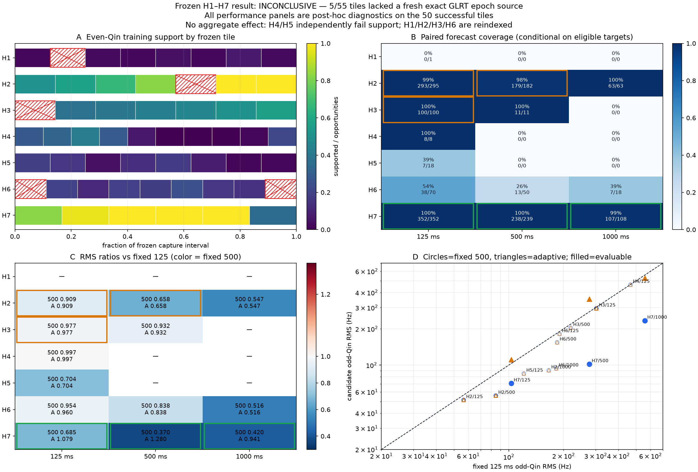
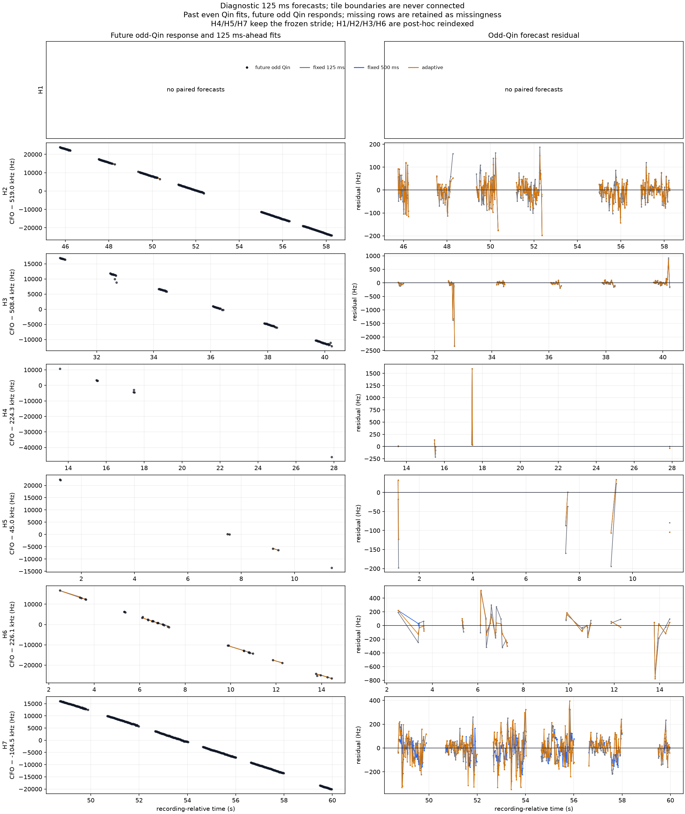

# Recent adaptive frame-CFO holdout replay

## Result

**INCONCLUSIVE.** The frozen H1–H7 advancement gate was not evaluated and no
estimator is promoted.

The one-shot replay attempted all 55 predeclared tiles. Fifty completed and
five failed the required fresh, exact branch-bound GLRT epoch/source binding.
The runner did not retry, shift, resize, or replace any failed tile.

This was not only a source-binding problem. H4 and H5 completed every planned
tile, yet neither capture supplied the preregistered minimum number of paired
forecasts at any horizon. Recovering the five failed tiles therefore could not
make this frozen protocol advance.

Green outlines mark the only cells that have both complete capture provenance
and sufficient numeric support: H7 at 125, 500, and 1,000 ms. Amber outlines
mark H2/H3 cells that meet the numeric threshold only after incomplete captures
are reindexed over their successful tiles. They are not frozen-gate results.

## Frozen execution

- Seven distinct, metadata-frozen captures were at most 12 hours old at the
  selection reference.
- All recording streams were V2, device-counter authoritative, and lossless.
  Verified contiguous application refills were not treated as gaps.
- The only decision comparison was causal `fixed_500ms` versus causal
  `fixed_125ms`; the adaptive selector remained diagnostic.
- Past even-Qin measurements trained each downstream fit. Frame-level future
  odd-Qin CFO responses did not select the downstream tracker state or method.
  The upstream GLRT source/epoch/alias selection used both Qin parities, so this
  is not an end-to-end odd-independent evaluation.
- Each at-most-two-second tile was a hard state boundary and required its own
  exact upstream source/epoch binding.
- The frozen decision required all seven captures and all three horizons to
  meet provenance, target-count, block-count, and coverage gates before any
  aggregate performance effect could be computed.

The five failed tiles were H1-T001, H2-T004, H3-T000, H6-T000, and H6-T008.
Each failed with `selected interval has no exact branch-bound GLRT epoch source`.

| Capture | Completed tiles | Supported even-Qin frames | Support on completed tiles | Numerically supported cells | Fully evaluable cells |
|---|---:|---:|---:|---:|---:|
| H1 | 7 / 8 | 331 / 9,869 | 3.4% | 0 / 3 | 0 / 3 |
| H2 | 6 / 7 | 6,597 / 8,673 | 76.1% | 2 / 3 | 0 / 3 |
| H3 | 6 / 7 | 3,789 / 8,319 | 45.5% | 1 / 3 | 0 / 3 |
| H4 | 10 / 10 | 2,350 / 14,615 | 16.1% | 0 / 3 | 0 / 3 |
| H5 | 8 / 8 | 1,154 / 11,392 | 10.1% | 0 / 3 | 0 / 3 |
| H6 | 7 / 9 | 1,680 / 9,604 | 17.5% | 0 / 3 | 0 / 3 |
| H7 | 6 / 6 | 7,617 / 8,900 | 85.6% | 3 / 3 | 3 / 3 |

Only 6 of 21 capture-by-horizon cells met the numeric support thresholds on
the available tiles; only H7's three cells also had complete capture
provenance. Consequently, there is no seven-capture aggregate RMS ratio and no
scientific pass/fail effect result.

## Successful-tile diagnostic

The following values are exploratory diagnostics from the persisted 50-tile
archive. They cannot advance, fail, tune, or promote an estimator while H1–H7
remain the claimed holdout. Captures with missing tiles (H1, H2, H3, and H6)
were necessarily reindexed for the 15-frame diagnostic stride, so their target
mask is not the unavailable full-run target mask.

The archive produced 1,416 paired targets and 4,248 method rows. In all 13 cells
with any numeric comparison, fixed 500 ms had lower block-equal odd-Qin RMS than
fixed 125 ms. Most cells were far below the support gate, however. H7 is the
only complete and numerically supported capture:

| Horizon | Paired targets | Fixed 125 ms RMS | Fixed 500 ms RMS | 500 / 125 | Adaptive RMS | Adaptive / 125 |
|---:|---:|---:|---:|---:|---:|---:|
| 125 ms | 352 | 103.15 Hz | 70.70 Hz | 0.685 | 111.29 Hz | 1.079 |
| 500 ms | 238 | 276.31 Hz | 102.10 Hz | 0.370 | 353.56 Hz | 1.280 |
| 1,000 ms | 107 | 558.06 Hz | 234.23 Hz | 0.420 | 525.38 Hz | 0.941 |

Thus fixed 500 ms reduced H7's descriptive forecast RMS by 31.5%, 63.0%, and
58.0% at the three horizons. The adaptive selector was worse at 125 and 500 ms
and only modestly better at 1,000 ms. Across all diagnostic targets it selected
500 ms 1,012 times (71.5%), 250 ms 174 times, 125 ms 169 times, and 75 ms 61
times. Outside H7 it usually collapsed to the fixed-500 result; its mixed H7
history choices were not beneficial at the two shorter horizons.

The track figure uses every successful tile at the frozen 125 ms forecast
horizon. Lines are broken at every tile boundary. H1 remains empty rather than
being replaced with a favorable interval. The gray, blue, and orange lines are
the fixed-125, fixed-500, and adaptive predictions; black points are future
odd-Qin responses.

## Interpretation

The long-history hypothesis remains promising on dense, steady episodes, but
this replay does not establish that it generalizes across recent captures.
The dominant near-term limitation is no longer frame-CFO precision alone. It is
the combination of source/epoch observability and highly intermittent qualified
pilot occupancy.

The current adaptive rule should not advance. It used 500 ms most of the time
and regressed on the only fully evaluable capture at two of three horizons.
Likewise, the 500 ms result should remain a research/shadow candidate rather
than replacing the 125 ms baseline.

Carrier phase was not connected across frames, receiver-relative timing was not
used as Doppler, and none of these values resolves oscillator/LNB/transmitter
drift or physical range acceleration.

## Next iteration

1. Retire H1–H7 as holdout data. They can now be used to diagnose and redesign
   source-bound episode construction, but any tuning consumes them.
2. Define scoring cores from counter-contiguous, upstream/even-supported source
   episodes rather than equal wall-clock tiles. The rule must be frozen on
   development captures and must never inspect future odd-Qin outcomes.
3. Preserve exact source/epoch/alias provenance and top-K hypotheses through
   weak intervals; do not bridge an unbound tile or average competing aliases.
4. Keep fixed 125 ms as the operational baseline and fixed 500 ms as the first
   shadow challenger. Drop the present adaptive selector unless a redesigned
   even-only change detector beats both on new data.
5. Freeze at least ten new, unseen capture clusters after a metadata-only
   feasibility check proves that the support gate is achievable. Repeat the
   same causal future-odd evaluation with capture-level weighting.
6. Add polynomial-phase rate injections into real backgrounds to measure rate
   bias and interval coverage, then rebenchmark the frequency-only PNT Kalman.
7. Calibrate receiver/LNB clock drift before feeding apparent CFO rate into an
   orbit or satellite-identity tracker.

## Provenance and reproducibility

The holdout was first opened by committed replay code at Git revision
`13b8dcb47df02897751eacf3b8e95e0b12d11fcd`. Its frozen hashes were:

- replay protocol: `fafc327fb7670f30835b53dbb47f3d39541a1aa04fe1100f8cc7e15718d17345`
- holdout metadata: `547655cdf6a3bee84ae6877e2990083dad60d429b673b8d75e56b28d4e060dee`
- replay tool: `0f17637fdcb4ce8dafc4be744cb8bd22cec00031652330ceacca825e6124be99`
- raw frame-CFO tool: `0799aa99864a2abf282e7b8e4b573c38c94030fb3c8bbe3878426d75b51fc826`
- pilot/profile implementation: `bcd1054c496648965fa9f8d0f055dffdc30dd7b9215dc164dd0f9e0a890a2eb6`
- adaptive tracker: `4491478b5428f7877f5e7136a58e44c8de7729c2ada7ca2a228212836ecb0696`

The four canonical incomplete-run artifacts were preserved byte-for-byte. Their
manifest is
[`figures/2026_08_25_recent_adaptive_cfo_holdout/artifact-manifest.json`](figures/2026_08_25_recent_adaptive_cfo_holdout/artifact-manifest.json).
Because the incomplete summary did not itself emit implementation hashes, the
diagnostic reporter verified all 50 external canonical checkpoint envelopes,
their payload digests, and equality with the self-contained replay archive. It
then persisted the recovered implementation hashes in the separate diagnostic
summary.

Diagnostic artifacts and their hashes are closed by
[`figures/2026_08_25_recent_adaptive_cfo_holdout_diagnostic/artifact-manifest.json`](figures/2026_08_25_recent_adaptive_cfo_holdout_diagnostic/artifact-manifest.json).
No raw IQ was reopened for the diagnostic report.
