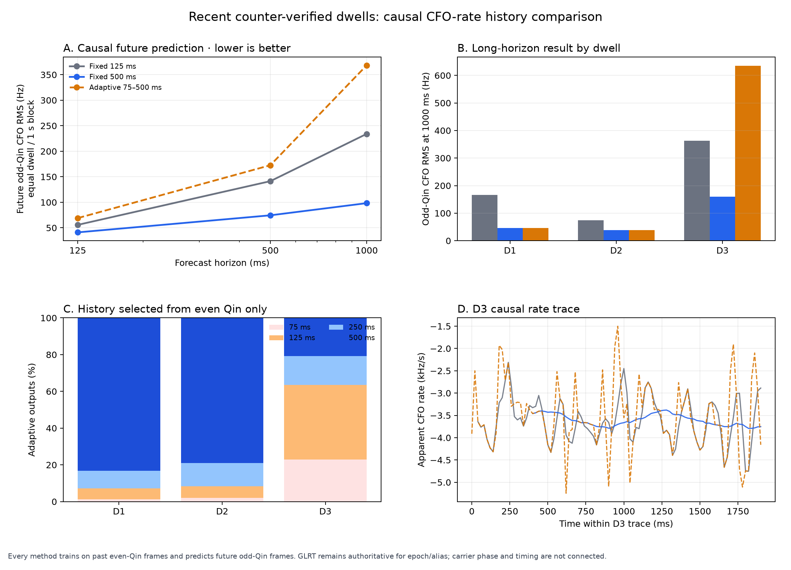
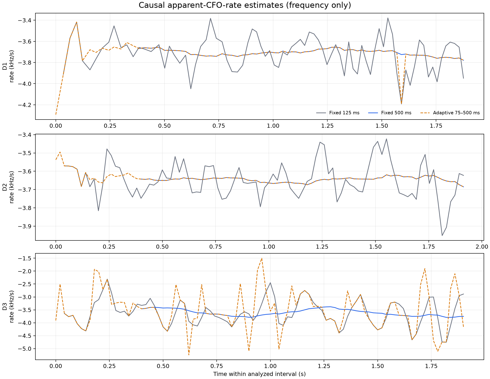

# Causal frame-CFO rate tracking on recent dwells

## Outcome

A fixed 500 ms causal robust line is the clear challenger. Relative to the same causal
125 ms line, it reduced future odd-Qin CFO RMS by 26.3% at 125 ms, 47.3% at 500 ms,
and 58.0% at 1 s. It improved every dwell at every horizon in this three-capture
development cohort.

The first adaptive 75/125/250/500 ms selector is not suitable for promotion. It reacts
to short-history disagreements on D3, produces a noisy rate state, and makes the
equal-dwell RMS 23.8%, 22.1%, and 57.4% worse than the fixed 125 ms baseline at the
three horizons. This is useful negative evidence: history adaptation needs hysteresis
and a past-only forecast criterion, not a one-step parameter-consistency gate.

## Experiment

The input was the already frozen frame-CFO artifact from three 2 s paths captured
1.59–2.25 hours before the declared selection time. All recordings are V2,
device-counter authoritative, one lossless segment, and have zero recorded sample
gaps. Each recording has 573 application refills and 572 counter-verified contiguous
joins; those joins were not treated as resets. The cohort contains 4,497 nominal frame
opportunities and 4,255 even-Qin-qualified frame measurements.

Every tracker runs causally at the supported 750 Hz frame cadence:

- `fixed_125ms`: robust line on the trailing 125 ms;
- `fixed_500ms`: robust line on the trailing 500 ms;
- `adaptive_75_500ms`: longest 75/125/250/500 ms line statistically compatible with
  every shorter line.

Only past even-Qin CFO estimates enter a fit. For a target at reference sample `u` and
horizon `H`, the latest admissible training point is at or before
`u - round(H * Fs)`. The untouched future odd-Qin CFO at `u` is the response. Target
membership uses continuity and even-Qin qualification only. Forecast targets are
sampled every 15 frames (20 ms) for reporting; all supported frames remain available
to the tracker.

The primary RMS first averages squared error within recording-anchored 1 s blocks,
then weights dwells equally. All methods use an identical paired target mask.

| Forecast horizon | Fixed 125 ms RMS | Fixed 500 ms RMS | Fixed 500 change | Adaptive RMS | Adaptive change |
|---:|---:|---:|---:|---:|---:|
| 125 ms | 55.75 Hz | 41.06 Hz | -26.3% | 69.01 Hz | +23.8% |
| 500 ms | 141.37 Hz | 74.47 Hz | -47.3% | 172.60 Hz | +22.1% |
| 1,000 ms | 233.99 Hz | 98.28 Hz | -58.0% | 368.30 Hz | +57.4% |

At 1 s, fixed 500 ms reduced RMS from 165.76 to 45.65 Hz on D1, 73.74 to
38.97 Hz on D2, and 362.42 to 159.30 Hz on D3. The corresponding candidate/baseline
ratios were 0.275, 0.528, and 0.440. Paired evaluation coverage was 97.1–100% of
even-qualified targets after the shared history burn-in. This is conditional coverage,
not end-to-end sensitivity: even-Qin qualification retained 85.5%, 98.3%, and 100% of
the nominal D1, D2, and D3 opportunities.

The adaptive failure is concentrated in D3. Among decimated causal rate outputs it
selected 500 ms only 20 times; it selected 75 or 125 ms 61 times. D1 and D2 selected
500 ms 69/83 and 75/95 times, respectively. The resulting rate traces show the D3
selector following short-window noise rather than improving future prediction.

## What this establishes

This establishes forecast skill for receiver-relative apparent CFO on three recent
captures. It does not establish physical range acceleration, satellite identity, or a
calibrated confidence interval. The constant 50 Hz frame scale and reported covariance
are provisional diagnostics.

Odd Qin is fit-withheld from all three rate trackers, but the upstream GLRT-selected
path, epoch, and alias used both Qin parities. The result is therefore a clean local
rate comparison within a frozen source hypothesis, not an end-to-end independent
detection test. Carrier phase and receiver-relative timing are never connected or fed
back.

The fixed 500 ms result passes the descriptive effect gates on this cohort, but three
captures are insufficient for promotion. The adaptive selector fails the no-dwell-
regression gate: D3 is 1.37x, 1.28x, and 1.75x the baseline RMS.

## Next gate toward satellite tracking

1. Make fixed 500 ms the frozen challenger, while retaining fixed 125 ms as the
   production-comparison baseline.
2. Replay the seven metadata-frozen, outcome-unopened H1–H7 paths. They provide
   104.55 s and 78,406 frame opportunities across distinct captures. Long paths must
   be processed in counter-contiguous tiles with a fresh upstream GLRT epoch binding;
   one fixed epoch must not be extrapolated across 10–20 s.
3. Add known polynomial-phase injections to real background IQ. This supplies direct
   paired truth for CFO rate, steps, curvature, and uncertainty coverage without new RF
   collection.
4. Replace the current adaptive rule with a conservative change detector: default to
   500 ms and shorten only after sustained, past-only forecast failures. Tune it on
   development captures and open H1–H7 once.
5. Rebenchmark the existing frequency-only PNT Kalman against the stronger 500 ms
   baseline. Phase and timing remain shadow diagnostics.
6. Only after receiver/LNB/common-clock drift is calibrated should this rate feed an
   orbit-constrained multi-hypothesis tracker. Satellite identity must still win on
   chronological whole-visit prediction, branch continuity, runner separation, and
   matched null fields.

## Reproducibility

- Prototype configuration: `config/analysis/recent-adaptive-cfo-track-v1.json`
- Frozen unopened holdout: `config/analysis/recent-adaptive-cfo-holdout-v1.json`
- Frequency-only tracker: `src/leo/analysis/research/adaptive_frame_cfo.py`
- Report tool: `tools/prototype_recent_adaptive_cfo_track.py`
- Machine-readable summary:
  `reports/figures/2026_08_25_recent_adaptive_cfo_track/summary.json`
- Per-forecast rows:
  `reports/figures/2026_08_25_recent_adaptive_cfo_track/forecast-rows.csv`
- Artifact closure:
  `reports/figures/2026_08_25_recent_adaptive_cfo_track/artifact-manifest.json`

The artifact manifest binds the plots, summary, forecasts, and rate traces. The summary
also binds the upstream frame inventory and the exact tracker/tool implementations.
