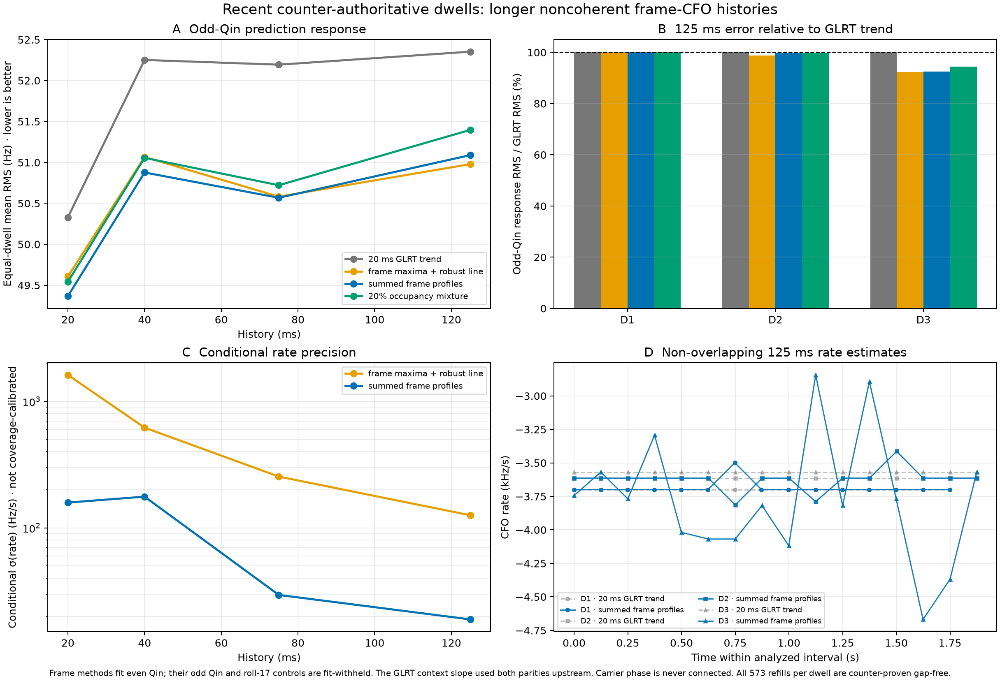

# Recent-dwell frame-CFO rate prototype

## Result

Longer, reset-safe frequency histories make the local Doppler-rate estimate
substantially less jittery, but the full summed-likelihood method did **not**
earn promotion over the simpler frame-maximum line on this three-dwell cohort.

At 125 ms, the equal-dwell odd-Qin response RMS was 52.35 Hz for the re-centered
GLRT trajectory, 50.98 Hz for robust regression of the 1.333 ms frame maxima,
51.09 Hz for the summed frame profiles, and 51.40 Hz for the occupancy mixture.
The summed profile therefore improved the GLRT-context baseline by 2.4%, but
was 0.2% worse than the cheaper frame-maximum line. The gain was not uniform:
D3 improved by 7.5%, D1 was neutral, and D2 improved by 0.3% relative to GLRT.

The useful result is the history-length scaling. From 20 to 125 ms, the median
across dwells of the empirical frame-maximum rate MAD fell from 1,444 to
123 Hz/s. For the summed profile, the median conditional curvature sigma fell
from 158 to 19 Hz/s and the median rate MAD fell from 688 Hz/s to below the
25 Hz/s search-grid resolution (the recorded median was 0). Those conditional
sigmas are not coverage-calibrated and must not be reported as physical
uncertainty yet.



## Frozen recent corpus

Selection was frozen at 2026-08-25 16:43:13 UTC with a maximum age of 12 hours.
Age alone was not accepted as continuity evidence. Every selected stream is a
V2 counter-authoritative recording with one device-time continuity segment,
zero missing samples, zero gaps, zero overflows, and zero enqueue failures.
Each stream contains 573 application refills, but all 572 joins have exact FPGA
counter and session-sample increments. Consequently, the replay uses device
sample coordinates and may cross those verified joins without reproducing the
legacy refill-compression sawtooth.

| Dwell | First sample UTC | Age | Path | Two-second interval | Opportunities | Even-supported |
|---|---:|---:|---|---:|---:|---:|
| D1 | 14:28:20.509 | 2.25 h | stream-0 / RX1 / lower | 49–51 s | 1,499 | 1,282 (85.5%) |
| D2 | 14:51:03.463 | 1.87 h | stream-1 / RX0 / upper | 22–24 s | 1,499 | 1,474 (98.3%) |
| D3 | 15:08:05.580 | 1.59 h | stream-1 / RX1 / upper | 44–46 s | 1,499 | 1,499 (100%) |

The exact recording, analysis, pilot-scan, dealiased-bank, and final-bank
digests are pinned in
`config/analysis/recent-frame-cfo-rate-v1.json`. Raw IQ is read through
`RecordingStore.open_pinned` and `read_device_span`; no QNAP path is imported or
mutated.

## Compared methods

All methods use exactly the same even-qualified frames in each non-overlapping
20, 40, 75, or 125 ms physical-time block.

1. **Re-centered GLRT trajectory.** The slope from the final trajectory built
   from 20 ms GLRT observations is frozen; only a local even-Qin intercept is
   fitted. This is a strong context baseline because its slope was estimated
   over a much longer branch, not from one isolated 20 ms observation. Its
   upstream GLRT64 statistic used both Qin parities, so odd Qin is not held out
   from this context slope.
2. **Frame maxima.** Independently maximize each 1.333 ms even-Qin frame CFO,
   then fit a Huber-weighted line.
3. **Summed profiles.** Retain the complete per-frame eight-complex-gain
   Gaussian profile and maximize its sum along one CFO/rate line. Frame carrier
   phases are nuisance parameters and are never connected.
4. **Occupancy mixture.** The same profile fit with a predeclared 20% uniform
   outlier component. It did not improve this strong-signal cohort.

For the three frame-profile methods, only even Qin fits membership, CFO, and
rate; odd Qin and the roll-17 Qin sequence are evaluated after the line is
frozen. Their odd lane is therefore fit-withheld within the selected path. The
GLRT context slope already used both parities upstream, and none of these lanes
is an end-to-end independent holdout because the upstream Standard path/alias
conditioned the population.

## Odd-Qin response comparison

Values below are equal-dwell means of the pooled odd-Qin CFO prediction RMS;
lower is better.

| History | GLRT trend | Frame maxima | Summed profile | Occupancy mixture | Summed / GLRT |
|---:|---:|---:|---:|---:|---:|
| 20 ms | 50.33 Hz | 49.61 Hz | 49.37 Hz | 49.54 Hz | 98.1% |
| 40 ms | 52.25 Hz | 51.07 Hz | 50.88 Hz | 51.06 Hz | 97.4% |
| 75 ms | 52.19 Hz | 50.58 Hz | 50.57 Hz | 50.72 Hz | 96.9% |
| 125 ms | 52.35 Hz | 50.98 Hz | 51.09 Hz | 51.40 Hz | 97.6% |

Every dwell and duration retained a strongly positive odd exact-minus-roll-17
profile margin. Search-basin boundary rates fell to zero for all three summed
profile 125 ms cohorts after distinguishing the true outer search boundary
from the deliberately overlapping local refinement grid.

## Interpretation

The experiment supports a two-timescale toolbox:

- Keep the 20 ms GLRT for detection, frame epoch, source/alias binding, and a
  wide-basin trajectory.
- Continue emitting independently qualified CFO at the 750 Hz frame cadence.
- Estimate a slow rate state over a refill-safe 75–125 ms history, with hard
  resets only at a real device-counter gap, reacquisition, or detected change.

For the current strong recent data, robust regression of frame maxima captures
nearly all of the prediction benefit at lower complexity. The summed profile is
scientifically cleaner for ambiguous or weak frames and should remain a shadow
challenger, but this cohort does not justify making it the default. A promotion
test should cover more recent paths, including weaker occupancy, and require a
predeclared aggregate fit-withheld gain (for example 10%), no dwell regression
over 5%, calibrated synthetic coverage, and stable results under block
bootstrap.

This prototype does not estimate or feed back frame epoch, receiver-relative
timing, or carrier phase. It tracks only CFO and CFO rate. There is also no
secure orbital truth association for these paths, so the results establish
internal prediction and repeatability—not absolute physical Doppler-rate
accuracy.

## Reproduction

```bash
PYTHONPATH=src .venv/bin/python tools/prototype_recent_frame_cfo_rate.py
```

The run took about 27 seconds and 482 MB peak RSS on the development host. Its
summary, per-window fits, frame inventory, plot, implementation digests, and
artifact hashes are under
`reports/figures/2026_08_25_recent_frame_cfo_rate/`.
