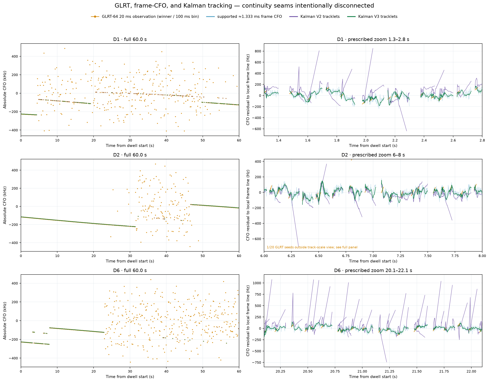

# Three-dwell GLRT, frame-CFO, and Kalman tracking comparison

## Result

The figure compares the sealed 20 ms GLRT acquisition observation, the
supported Qin frame-CFO measurement, Kalman V2, and the latest reviewed Kalman
V3 on three untouched August 24 dwells: D1, D2, and D6.



The left column preserves absolute CFO across each 60 s dwell. The right column
shows a prescribed interval after subtracting one visualization-only line fitted
to the supported frame-CFO measurements in that interval. This detrending makes
the within-tracklet behavior legible; it is not a filter input or performance
score.

## Traces

- Amber: every selected, sealed GLRT-64 20 ms observation, drawn over its actual
  20 ms source interval. Selection retains one winner per 100 ms bin.
- Blue: supported frame-CFO measurements at the approximately 1.333 ms Starlink
  frame cadence.
- Purple: Kalman V2 posterior/coast tracklets.
- Green: phase-safe, full-frame-acquired Kalman V3 posterior/coast tracklets.

All frame and Kalman lines break at replay-window boundaries, reacquisition,
non-increasing timestamps, frame-index gaps, and excluded frames. Nothing is
connected across a continuity seam.

The plots make two behaviors clear. First, the full-dwell GLRT observations
contain many acquisition aliases while the frame-CFO and accepted tracker
outputs occupy coherent local ramps. Second, V2 produces large within-window
excursions in all three zooms, especially D6, while V3 remains much closer to
the supported frame-CFO structure. Descriptively, V2/V3 reacquisition counts
are 67/19 for D1, 115/34 for D2, and 140/9 for D6; these counts are not a
same-support accuracy score because the two filters can fail closed on different
sets of windows.

## Scope and provenance

D1, D2, and D6 were chosen before rendering. D3 was excluded because it was the
development dwell; D4 was non-estimable; D5 did not provide comparable early
V3 coverage. Each filter restarts inside independently selected 100 ms replay
windows, so the colored lines are within-window tracklets rather than one
continuous 60 s state estimate.

“20 ms GLRT” here means the persisted sealed acquisition observation. It is not
the causal trailing-20-ms robust frame-CFO line used as the benchmark in the
filter review.

The machine-readable receipt records every input and output SHA-256, dwell
identity, zoom interval, source snapshot, support count, and continuity rule:
[`three-dwell-pnt-tracking-summary.json`](figures/2026_08_25_pnt_kalman_three_dwell_tracks/three-dwell-pnt-tracking-summary.json).

Reproduction command from the repository root:

```bash
uv run python tools/plot_pnt_kalman_three_dwells.py \
  --v2-root /tmp/leo-five-dwell-filter-baseline \
  --v3-root /tmp/leo-five-dwell-filter-v3-final \
  --output-root reports/figures/2026_08_25_pnt_kalman_three_dwell_tracks
```
