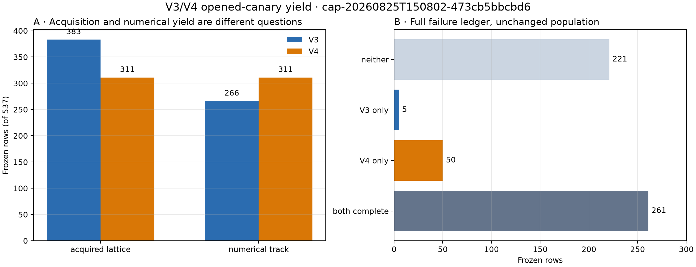
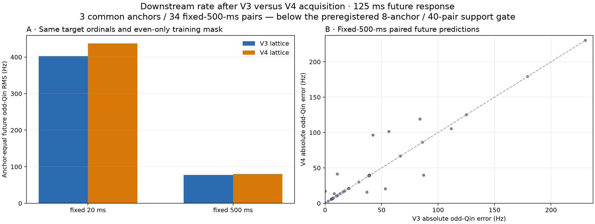
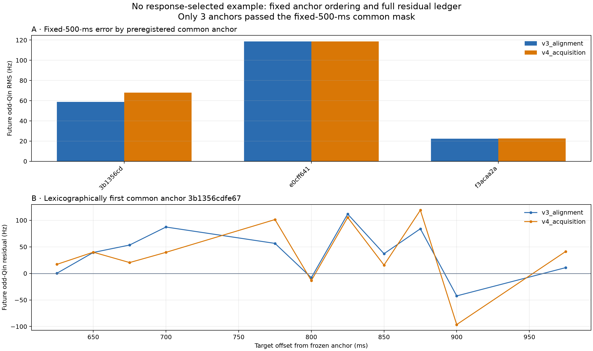

# V3/V4 acquisition yield and downstream CFO-rate benchmark

Date: 2026-08-25

## Result

V4 materially increased **numerical completion** on the frozen 537-row opened
canary, but this preregistered experiment did **not** establish a downstream
rate improvement.  V4 completed 311 rows versus 266 for V3: 50 V3 failures
became V4 completions, five V3 completions regressed, and the net gain was 45
rows (8.4 percentage points, or 16.9% relative to V3).  That is real
implementation evidence for V4's acquisition-to-tracker handoff.

The discrete-acquisition count tells a different story.  V3 returned a
complete `initial_alignment` on 383 rows, while V4 accepted a mode on 311.
V4's stricter candidate semantics therefore accepted 72 fewer lattices even
though every accepted V4 mode completed the unchanged V3 tracking core in this
receipt.  “Acquired lattice” and “numerically complete track” must not be
collapsed into one yield number.

The 1 s downstream extension was under-supported.  Only **3 of the 20**
preregistered source-branch anchors produced a common fixed-500-ms comparison,
contributing **34 paired predictions**.  The frozen adequacy gate required at
least 8 anchors and 40 pairs.  Consequently the experiment's V4-usefulness
gate failed and the rates below are descriptive, not a candidate-selection or
promotion result.

On that inadequate three-anchor subset, V4 was close to but not better than V3:

| Causal history | Common anchors / pairs | V3 anchor-equal odd-Qin RMS | V4 anchor-equal odd-Qin RMS | V4 / V3 | Frozen interpretation |
|---|---:|---:|---:|---:|---|
| fixed 20 ms | 3 / 33 | 402.26 Hz | 437.26 Hz | 1.087 | worse than the 1.05 noninferiority bound |
| fixed 500 ms | 3 / 34 | 77.56 Hz | 80.00 Hz | 1.031 | noninferior on the primary metric; not a material improvement |

The fixed-500-ms line reduced the anchor-equal future error by 80.7% for the
V3 lattice and 81.7% for the V4 lattice relative to fixed 20 ms.  This is the
strongest actionable result: where a coherent half-second history exists, the
stable long-history CFO line is dramatically better than a short local line.
It does not show that V4 improves rate estimation; V4 changes acquisition and
then delegates continuous tracking to a fresh, unchanged V3 core.

## Frozen protocol and input authority

The [preregistration](2026_08_25_v3_v4_downstream_rate_preregistration.md) was
committed as `759aa0546007b1894bbe359749394e5d71e4b75d` before any new raw-IQ
response was opened.  Its machine-readable config is bound at
`sha256:4a3adb63e2b59a4e60a983c939fcb5d41794f011133cc6416b1f1f7a47a34753`.

Only `cap-20260825T150802-473cb5bbcbd6` was authorized under policy role
`v3_v4_canary`.  It is a counter-authoritative **POST-FIX**, previously opened
development capture with recording manifest
`sha256:ab55917851a9cd37af94b6145cc719f7b8d9d0809f2202a2dcd1ac38c3e7a31e`.
No `holdout_foundation` capture, new collection, later capture, dynamic
directory result, or QNAP write was used.  The run verified the compressed and
uncompressed SHA-256 digests of all nine IQ chunks it consumed.

The all-population yield comes from the already complete, digest-verified
537-row scientific canary receipt.  The downstream set was frozen without
V3/V4 outcome or odd-Qin inspection: one exact row for each of the 20 source
branches, selected as the earliest `(source_probe_sample_start, row_key)` in
the committed population.  No failed anchor was replaced.

## What was compared

The experiment separates acquisition from downstream estimation:

1. V3 supplies its discrete `initial_alignment` epoch and CFO.
2. V4 supplies the lowest-rank accepted acquisition component.  V4's own
   continuous mode track is not treated as a new estimator because it is the
   unchanged V3 core.
3. Each lattice is extended for exactly one second with the 750 Hz
   `3333/3334`-sample progression.  The frozen upstream local rate is used only
   to keep the per-frame NCO inside the fixed ±2 kHz residual basin.
4. The public split-frame kernel estimates CFO on even and odd Qin separately.
   Even Qin alone admits frames and fits lines; odd Qin is attached only after
   a 125 ms future prediction is frozen.
5. In common mode, V3 and V4 use the same target ordinal and the exact
   intersection of their even-supported training ordinals.  V4-only and
   V3-only anchors remain separate and missing errors are never imputed.

“Same physical opportunity” means the same source anchor and 750 Hz frame
ordinal.  When the two acquisition methods choose epochs one sample apart,
their guarded IQ slices are correspondingly one sample apart; the comparison
does not pretend they are byte-identical.  The prediction ledger records each
actual target time and actual causal forecast interval (the first frame at
least 125 ms after the cutoff is normally about 125.33 ms ahead).

The primary line uses up to 500 ms of strictly past even-Qin CFO and requires
at least 300 frames spanning 450 ms.  The 20 ms line requires 10 frames over 16
ms and is diagnostic context.  Both are deterministic degree-one Huber fits;
neither connects carrier phase.

There is an important holdout limit.  The frozen Standard source trajectory
and V3/V4 acquisition used wider evidence, including odd Qin in parts of their
conditioning.  Odd Qin is fit-withheld from the downstream line, but this is
not a globally untouched odd-Qin holdout.  This is why the report says
“future odd-Qin response,” not independent truth.

## Full 537-row yield ledger

| Numerical outcome | Rows |
|---|---:|
| V3 and V4 complete | 261 |
| V4 complete, V3 no result | 50 |
| V3 complete, V4 no result | 5 |
| Neither complete | 221 |
| **Total** | **537** |

| Discrete acquisition outcome | Rows |
|---|---:|
| V3 alignment and V4 accepted mode | 268 |
| V3 alignment only | 115 |
| V4 accepted mode only | 43 |
| Neither acquired | 111 |
| **Total** | **537** |

The first contingency supports V4's numerical-yield improvement.  The second
shows that it was not a blanket acquisition-yield improvement: V4 traded many
V3 alignments for a more selective acceptance policy.  Whether those 115
V3-only alignments contain useful signal requires a separately designed test;
counting an alignment as a track would be incorrect.

## Downstream support ledger

The 20 frozen anchors divided into nine both-method acquisitions, three
V4-only acquisitions, two V3-only alignments, and six neither-acquired rows.
Every acquired anchor was attempted; 17,227 method-frame records were retained.

| Frozen row | Cohort | Even-supported frames, V3 / V4 | Fixed-500-ms own predictions, V3 / V4 | Common fixed-500-ms pairs |
|---:|---|---:|---:|---:|
| 0 | both | 749 / 749 | 15 / 15 | 15 |
| 129 | both | 205 / 205 | 0 / 0 | 0 |
| 148 | neither | — / — | 0 / 0 | 0 |
| 2 | V3 alignment only | 0 / — | 0 / 0 | 0 |
| 48 | neither | — / — | 0 / 0 | 0 |
| 80 | V4 only | — / 83 | 0 / 0 | 0 |
| 89 | V4 only | — / 104 | 0 / 0 | 0 |
| 121 | both | 147 / 147 | 0 / 0 | 0 |
| 145 | both | 191 / 191 | 0 / 0 | 0 |
| 186 | both | 159 / 144 | 0 / 0 | 0 |
| 304 | neither | — / — | 0 / 0 | 0 |
| 488 | neither | — / — | 0 / 0 | 0 |
| 250 | neither | — / — | 0 / 0 | 0 |
| 251 | V3 alignment only | 1 / — | 0 / 0 | 0 |
| 284 | neither | — / — | 0 / 0 | 0 |
| 377 | both | 240 / 240 | 0 / 0 | 0 |
| 406 | both | 218 / 218 | 0 / 0 | 0 |
| 439 | V4 only | — / 172 | 0 / 0 | 0 |
| 457 | both | 586 / 586 | 8 / 8 | 8 |
| 471 | both | 706 / 612 | 15 / 11 | 11 |

The three V4-only anchors are fully retained.  They contributed 83, 104, and
172 even-supported frames respectively, but none met the frozen 300-frame /
450-ms fixed-500-ms requirement at a target.  They also supplied no eligible
fixed-20-ms target at the predeclared 625–975 ms offsets.  Therefore there is
no truthful V4-only future-error number in this run.  Reporting zero error or
borrowing a V3 response would reward missingness; both are forbidden.

Most one-second extensions lost the fixed lattice or even-Qin support outside
the original 75 ms anchor.  That can mean limited source occupancy, lattice
motion, an upstream-rate/NCO mismatch, or a need for causal reacquisition.  It
does not by itself prove signal absence.  Because the anchor selection was
outcome-blind and frozen, the correct result is an under-supported ledger—not
a post-response switch to a stronger row.

## Common-mode future prediction

The fixed-500-ms comparison is similar across aggregation choices, but the
support caveat applies to all of them:

| Aggregation | V3 RMS | V4 RMS | V4 / V3 |
|---|---:|---:|---:|
| pooled targets | 68.23 Hz | 70.92 Hz | 1.039 |
| equal source-branch anchors | 77.56 Hz | 80.00 Hz | 1.031 |
| equal 250 ms recording-time blocks | 64.23 Hz | 67.59 Hz | 1.052 |

V4 had the lower absolute error in 15 of 34 pairs, with no exact ties.  Mean
fitted rates were −3367.86 Hz/s on the V3 lattice and −3372.37 Hz/s on the V4
lattice, a −4.50 Hz/s difference.  This is estimator agreement, not a physical
rate error: no authoritative Doppler truth, LNB drift, or receiver-clock drift
is available here.

The anchor plot uses the full three-anchor result.  Its lower panel is the
lexicographically first eligible anchor, fixed independently of response
magnitude; it is not a best-case example.

## Conclusions and next decision

- V4's strongest established benefit remains numerical recovery: 50 gains
  versus five regressions on all 537 frozen rows.
- V4 did not increase the count of accepted discrete lattices relative to V3
  alignments; it was more selective.
- On the small common subset that sustained a strong 500 ms line, V3 and V4
  downstream errors were close.  The frozen primary noninferiority threshold
  passed, while the material-improvement threshold did not.
- The preregistered support gate failed, so this cannot decide whether V4 is
  generally downstream-rate safe.
- The large 20 ms versus 500 ms difference strengthens the case for stable
  half-second dynamics whenever continuity is proven.

The next valid step is not to retune these 20 anchors.  Complete the independent
holdout feasibility/freeze, then evaluate the already frozen candidate on its
fixed masks.  If an additional opened-canary development study is desired,
preregister causal reacquisition or source-supported episode boundaries from
past/even evidence before opening responses.  Keep V4 acquisition yield,
common-mode downstream prediction, and V4-only recovered-window prediction as
three separate gates.

## Evidence and reproducibility

- [Machine-readable result](figures/2026_08_25_v3_v4_downstream_rate/benchmark-results.json)
- [Prediction ledger](figures/2026_08_25_v3_v4_downstream_rate/predictions.csv)
- [Compressed split-frame inventory](figures/2026_08_25_v3_v4_downstream_rate/frame-inventory.json.gz)
- [Artifact manifest](figures/2026_08_25_v3_v4_downstream_rate/artifact-manifest.json)
- [Frozen V4 implementation report](2026_08_25_150802_pnt_kalman_v4_experimental.md)
- [Full-dwell V3 report](2026_08_25_150802_v3_full_dwell.md)
- [Doppler-rate method review](2026_08_25_doppler_rate_and_satellite_linking_method_review.md)

The artifact manifest binds the result, 277-row prediction ledger, 17,227-frame
inventory, and three Matplotlib PNGs.  Focused protocol, leakage, common-mask,
artifact-digest, Ruff, and strict-mypy checks accompany the implementation.
The final execution ran from implementation commit
`74df7e95dee521a7f0d5b229c50af56b4506d523`; the result also binds the
benchmark tool at
`sha256:da224811e1e57a9b2d69a8ffbb1df61a7deaeb4f7713ddc1ba469ee5228e0ecd`
and the downstream-rate kernel at
`sha256:47ce1ff93d52e1c25cb5975cb896f6b75185ffecf6a7c9e36a19833782bc935c`.
