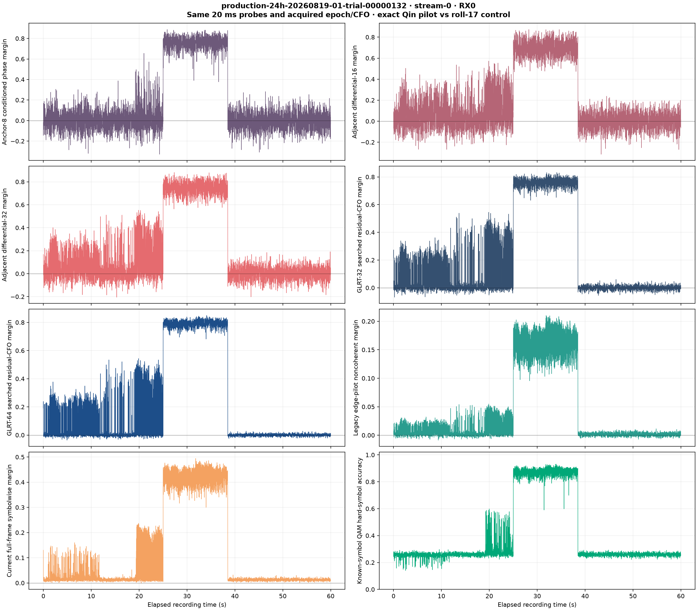
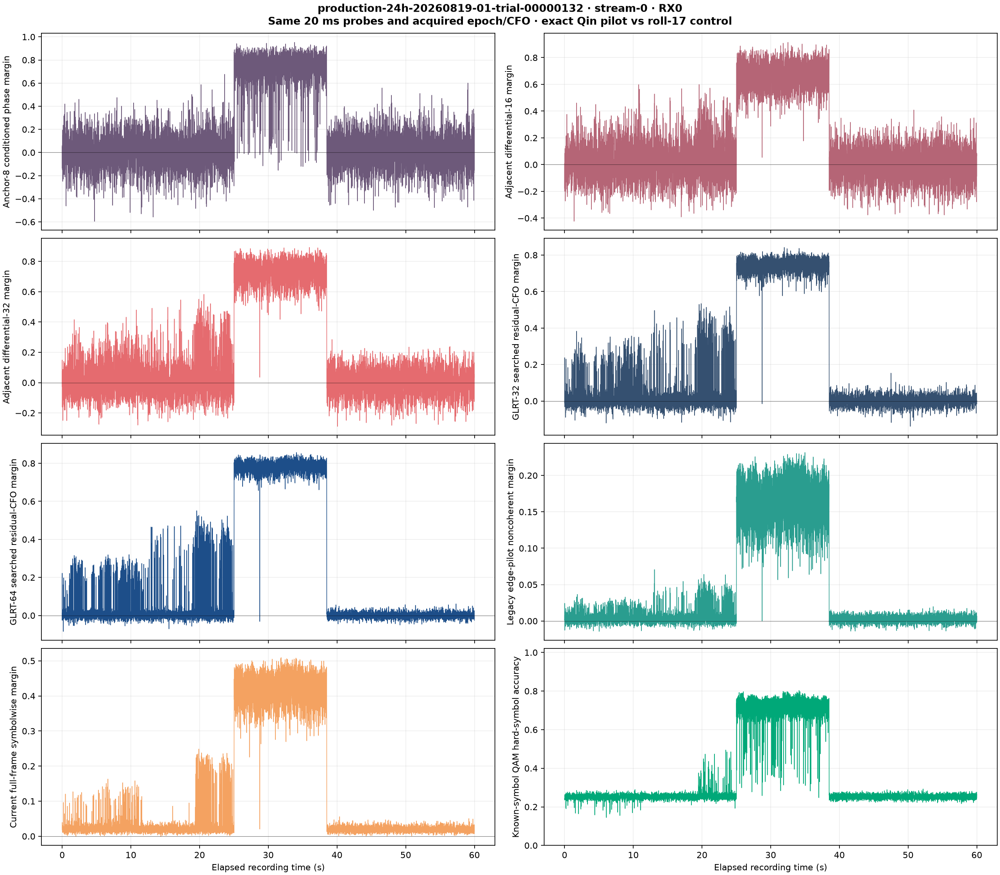
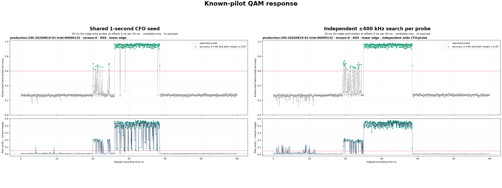
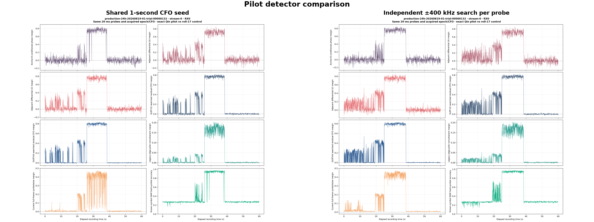
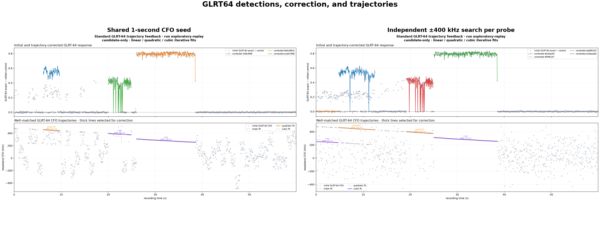

# Pilot-window geometry comparison

**Requested publication path:** `reports/2026_08_26_20ms_window_comparison.md`
**Experiment executed:** 2026-08-20
**Scientific scope:** candidate-only Qin edge-pilot evidence; no attribution or
payload decoding

## Executive summary

We replayed one reviewed, known-signal 60-second recording with six probe
geometries. Every scheduled probe performed its own full -400 to +400 kHz CFO
acquisition; no one-second seed was shared between probes:

1. one 20 ms probe at offset 0 in every 50 ms subwindow;
2. two 20 ms probes at offsets 0 and 25 ms;
3. three 20 ms probes at offsets 0, 15, and 30 ms;
4. five 10 ms probes at offsets 0, 10, 20, 30, and 40 ms;
5. ten 5 ms probes at offsets 0 through 45 ms in 5 ms steps;
6. one continuous 50 ms probe in every 50 ms subwindow.

Independent acquisition removes the visually artificial one-second CFO blocks
from every geometry. The six runs retain three to five replay representatives;
the long candidate intervals near 19--25 s and 25--38.5 s recur. The 5 x 10 ms
geometry has the lowest mean selected-fit residual (543.3 Hz) and five selected
families. The 10 x 5 ms geometry also retains five families once its true 5 ms
support is analyzed, correcting the older duration-mismatched result.

The 50 ms geometry has the highest QAM-positive rate (27.08%) but only three
selected families. It is a longer-integration experiment, not merely a denser
sampling of the 20 ms detector. More probes are not a monotonic proxy for more
useful tracks, and the selected early intervals remain candidate-only.

## Input and provenance

| Field | Value |
|---|---|
| Session | `production-24h-20260819-01-trial-00000132` |
| Stream / receiver | `stream-0` / RX0 |
| Qin edge | `lower` |
| Recording manifest digest | `sha256:1712bf...855d` |
| Authoritative source | `/mnt/qnap01/mouse9911/leo-store/test-corpus/trial-132-four-path-v1/` |
| Analysis location | isolated local copy; QNAP remained read-only |
| CFO acquisition | independent full -400 to +400 kHz search for every probe |
| Implementation commit | `36c359ef39950eaec8ef23eeef3b895d6d2f330d` |

The source recording already exists in the protected QNAP test corpus. It was
copied normally to a local temporary root for analysis. The analysis did not
write to the source corpus, contact radios, start acquisition, or mutate live
services.

## Probe geometry

| Name | Probe duration | Offsets within each 50 ms | Probes per 60 s | Raw processed support |
|---|---:|---|---:|---:|
| Former baseline, 1 x 20 | 20 ms | 0 ms | 1,200 | 24 s |
| Standard, 2 x 20 | 20 ms | 0, 25 ms | 2,400 | 48 s |
| Research candidate, 3 x 20 | 20 ms | 0, 15, 30 ms | 3,600 | 72 s, including overlap |
| Full coverage, 5 x 10 | 10 ms | 0, 10, 20, 30, 40 ms | 6,000 | 60 s |
| Full coverage, 10 x 5 | 5 ms | 0, 5, ..., 45 ms | 12,000 | 60 s |
| Full subwindow, 1 x 50 | 50 ms | 0 ms | 1,200 | 60 s |

The 3 x 20 ms geometry overlaps adjacent probes by 5 ms. Its 3,600 probes are
not 3,600 statistically independent observations. Exact support intervals must
remain part of any future persisted Research contract.

## Known-pilot QAM response


| Geometry | Probes | QAM/pilot positives | Positive rate | Maximum QAM accuracy | Maximum pilot margin |
|---|---:|---:|---:|---:|---:|
| 1 x 20 ms | 1,200 | 294 | 24.50% | 0.97542 | 0.47626 |
| 2 x 20 ms | 2,400 | 576 | 24.00% | 0.97792 | 0.47626 |
| 3 x 20 ms | 3,600 | 871 | 24.19% | 0.97792 | 0.48033 |
| 5 x 10 ms | 6,000 | 1,346 | 22.43% | 0.93125 | 0.49447 |
| 10 x 5 ms | 12,000 | 2,619 | 21.82% | 0.80333 | 0.50940 |
| 1 x 50 ms | 1,200 | 325 | 27.08% | 0.99167 | 0.45075 |

The per-probe positive rate is stable near 24% for all three 20 ms schedules.
The 50 ms detector is different: its longer integration produces a 27.08%
positive rate and higher maximum QAM accuracy, while its maximum held-out pilot
margin is slightly lower.

Shortening the probe from 20 to 10 and then 5 ms reduces QAM accuracy and the
positive rate. The maximum pilot-control margin increases slightly, showing
that a high single-probe margin alone is not sufficient evidence of robust
known-symbol recovery.

The three 20 ms schedules use the same detector and full CFO bounds, but every
scheduled probe is acquired independently. No cross-probe CFO seed or fitted
state is reused.

## Detector comparison

The standard exploratory comparison evaluated GLRT64, Symbolwise, Anchor-8,
differential-16/32, GLRT32, the legacy edge tracker, and known-pilot QAM. Only
GLRT64 observations were allowed to propose trajectory segments or feed
trajectory-conditioned replay.

### 1 x 20 ms


### 2 x 20 ms


### 3 x 20 ms


### 1 x 50 ms


### 5 x 10 ms



### 10 x 5 ms



## GLRT64 Doppler tracking and corrected replay


| Geometry | All fits | Families | Selected replay representatives | Mean selected RMS |
|---|---:|---:|---:|---:|
| 1 x 20 ms | 69 | 6 | 4 | 591.6 Hz |
| 2 x 20 ms | 81 | 8 | 4 | 629.1 Hz |
| 3 x 20 ms | 86 | 5 | 4 | 609.0 Hz |
| 5 x 10 ms | 78 | 7 | 5 | 543.3 Hz |
| 10 x 5 ms | 78 | 8 | 5 | 570.0 Hz |
| 1 x 50 ms | 69 | 5 | 3 | 688.4 Hz |

| Geometry | Selected degree and interval |
|---|---|
| 1 x 20 ms | cubic 0.15--4.65 s; quadratic 4.75--12.50 s; quadratic 19.20--24.85 s; cubic 25.05--38.50 s |
| 2 x 20 ms | cubic 0.00--13.30 s; cubic 13.725--15.525 s; cubic 17.00--24.85 s; cubic 25.025--38.50 s |
| 3 x 20 ms | cubic 0.00--15.40 s; quadratic 0.08--5.30 s; cubic 15.815--24.93 s; cubic 25.015--38.50 s |
| 5 x 10 ms | cubic 0.01--7.02 s; linear 4.48--14.30 s; linear 14.85--16.89 s; cubic 17.70--24.93 s; cubic 25.02--38.55 s |
| 10 x 5 ms | linear 0.01--3.565 s; linear 4.33--7.07 s; cubic 6.245--14.76 s; quadratic 18.965--24.85 s; linear 24.705--38.50 s |
| 1 x 50 ms | cubic 0.10--12.25 s; quadratic 18.95--24.90 s; cubic 25.00--38.45 s |

The long intervals near 19--25 s and 25--38.5 s recur in every geometry. Early
candidate organization varies substantially with probe support and density,
which is a tracker-sensitivity result rather than evidence for more physical
signals. The 5 x 10 ms and 10 x 5 ms schedules each retain five representatives.
The short-probe improvement relative to the old report is mainly caused by
fixing the comparison tool to analyze the true 10 ms and 5 ms support instead
of an accidental hard-coded 20 ms slice.

## Interpretation and recommendation

- Promote 2 x 20 ms to the automatic Standard geometry. It doubles temporal
  sampling while retaining 20 ms integration and independent CFO acquisition.
- Retain 1 x 20 ms only as a historical/runtime control.
- Carry 5 x 10 ms as the full-coverage challenger. Its tracking quality is
  promising, but runtime/RSS must be measured against 2 x 20 ms before choosing
  a Research default.
- Keep 3 x 20 ms as the proposed independent Research lane, but leave it manual
  until family grouping is tuned and repeated runtime/RSS measurements pass.
- Keep 10 x 5 ms research-only. It now preserves five representatives, but it
  increases acquisition/search work tenfold and has the lowest QAM accuracy.
- Treat 1 x 50 ms as a separate long-integration experiment, not as a drop-in
  replacement for the 20 ms Qin detector.
- Continue allowing only GLRT64 to propose Doppler tracks. Symbolwise,
  Anchor-8, and QAM remain comparison/validation evidence.

The experiment does not establish Starlink attribution, satellite identity,
payload content, or statistical independence between overlapping probes.

## Next steps

- The 0--10 s region appears to contain two simultaneously tracked candidate
  trajectories on the same radio. The present family/representative selection
  can overlap or merge these branches. Add explicit multi-target post-processing
  with branch birth/death, crossing, assignment, and duplicate-family handling
  so the two candidate satellites can be teased apart without treating one
  smooth fit as both signals.
- Repeat the six-geometry comparison on additional reviewed recordings and
  measure wall time, CPU, and RSS before changing the Research default.
- Preserve GLRT64 as the only trajectory proposer; use Symbolwise, Anchor-8,
  QAM, and same-IQ controls to validate or reject proposed branches.

## Shared-seed comparison retained as historical control

Before making independent acquisition authoritative, the Standard 1 x 20 ms
schedule was compared with the former shared one-second seed. The control is
retained here to document why shared seeding was removed.

| CFO acquisition | QAM/pilot positives | Positive rate | Fits | Families | Selected tracks | Mean selected RMS |
|---|---:|---:|---:|---:|---:|---:|
| Shared one-second seed + local search | 243 | 20.25% | 66 | 5 | 3 | 628.8 Hz |
| Independent wide search per probe | 294 | 24.50% | 69 | 6 | 4 | 591.6 Hz |







The conspicuous one-second CFO blocks largely disappear when the wide search
is independent. This confirms that their boundaries were introduced primarily
by the shared seed rather than by physical one-second Doppler changes. The
independent search also recovers 51 additional positive probes and lengthens
the selected intervals to 0.15--4.65 s, 4.75--12.50 s, 19.20--24.85 s, and
25.05--38.50 s.

The early selected intervals remain candidate-only and have weak QAM evidence;
they must not be treated as signal attribution merely because the trajectory
fitter can connect them. Production Standard and the Research plan now require
independent acquisition, with the exact bounds included in immutable
configuration identity.

## Reproduction

The production schedule is created by `build_probe_schedule`; the same ordered
offsets are carried by `TrajectoryFeedbackConfig` into acquisition, detection,
tracking, and corrected replay. For example:

```python
from leo.analysis.standard import build_probe_schedule
from leo.analysis.starlink.trajectory_feedback import TrajectoryFeedbackConfig

# Current Standard: two independent 20 ms probes per 50 ms subwindow.
standard = TrajectoryFeedbackConfig(
    subwindow_ms=50,
    probe_ms=20,
    probe_offsets_ms=(0, 25),
)
schedule = build_probe_schedule(
    sample_rate_hz=2_500_000,
    sample_count=150_000_000,
    subwindow_ms=standard.subwindow_ms,
    probe_ms=standard.probe_ms,
    probe_offsets_ms=standard.probe_offsets_ms,
    maximum_coarse_windows=standard.maximum_outer_windows,
)
assert schedule.returned_probe_count == 2_400

# Other reviewed geometries use the same functions.
two_by_twenty = (20, (0, 25))
one_by_fifty = (50, (0,))
five_by_ten = (10, (0, 10, 20, 30, 40))
ten_by_five = (5, tuple(range(0, 50, 5)))
research_three_by_twenty = (20, (0, 15, 30))
```

Offsets must be unique, ordered, integral in the sample domain, and satisfy
`offset + probe_ms <= subwindow_ms`. Invalid or implicit patterns fail closed.
`TrajectoryFeedbackConfig` always enforces independent -400/+400 kHz
acquisition per scheduled probe.

The exploratory command-line placement option is implemented in
`tools/analyze_edge_pilot_qam_timeline.py`. For each geometry, the workflow is:

```text
analyze_edge_pilot_qam_timeline.py
  -> compare_edge_pilot_methods.py
  -> run_trajectory_conditioned_redetection.py
```

The current Standard QAM command uses
`--probe-ms 20 --probe-offsets-ms 0,25`. Research uses
`--probe-ms 20 --probe-offsets-ms 0,15,30`; the other schedules use
`--probe-ms 50 --probe-offsets-ms 0`,
`--probe-ms 10 --probe-offsets-ms 0,10,20,30,40`, and
`--probe-ms 5 --probe-offsets-ms 0,5,10,15,20,25,30,35,40,45`.
Every invocation must also supply the explicit `--edge lower` used by this
fixture. Its CSV then feeds `compare_edge_pilot_methods.py --probe-ms ...`, and
that output feeds `run_trajectory_conditioned_redetection.py --probe-ms ...`.
The exact probe duration must be passed to all three commands.

Every report reproduction command must include
`--independent-wide-search-per-probe`. Shared one-second seeding is retained
only for the historical control above and is not a valid Standard or Research
mode.

Focused verification at publication time:

```text
57 focused schedule/production/graph tests: passed
171 non-real analysis tests: passed; 3 real-corpus tests deselected
2 real-PostgreSQL operational/reprocess verticals: passed
Ruff: all checks passed
mypy: passed
git diff --check: passed
```

## Archive contents

The prepared archive contains:

- this report and all published comparison and per-method figures;
- `research_pipeline.md`;
- the two analysis tools changed for the comparison;
- their focused regression tests;
- every generated PNG, CSV, and JSON artifact;
- a source-data pointer and SHA-256 manifest.

The 1.1 GB IQ corpus is not duplicated because its authoritative, protected
copy already exists at the QNAP source path listed above.
