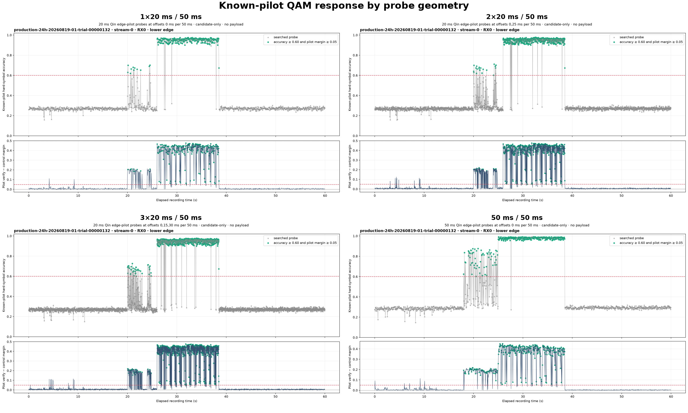
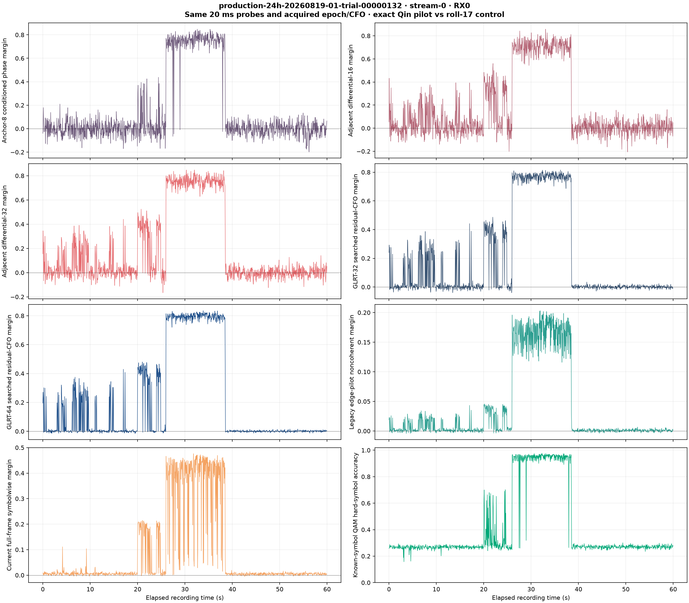
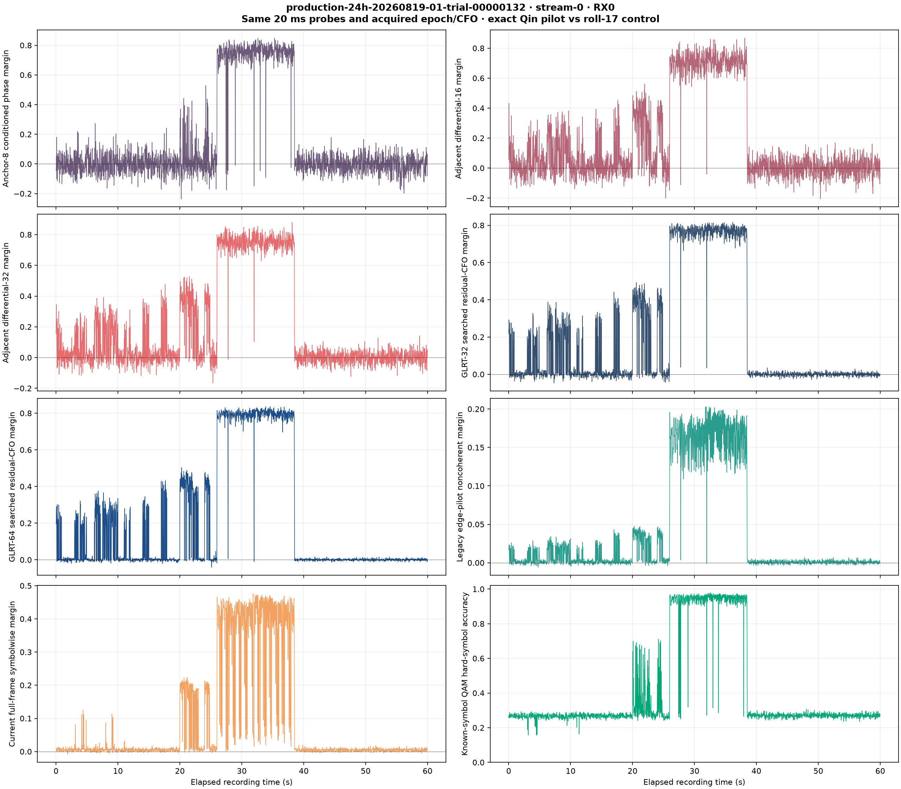
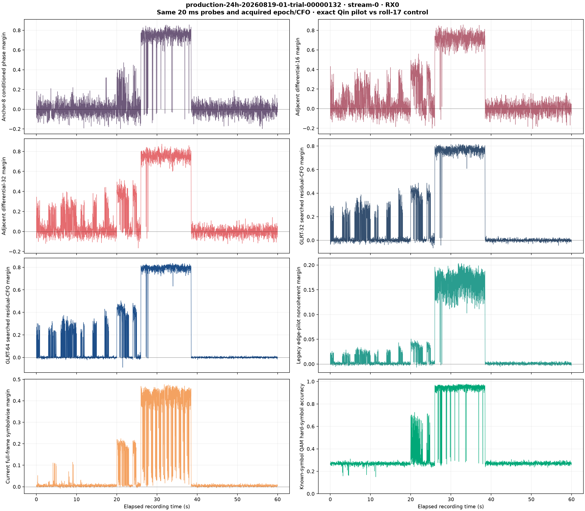
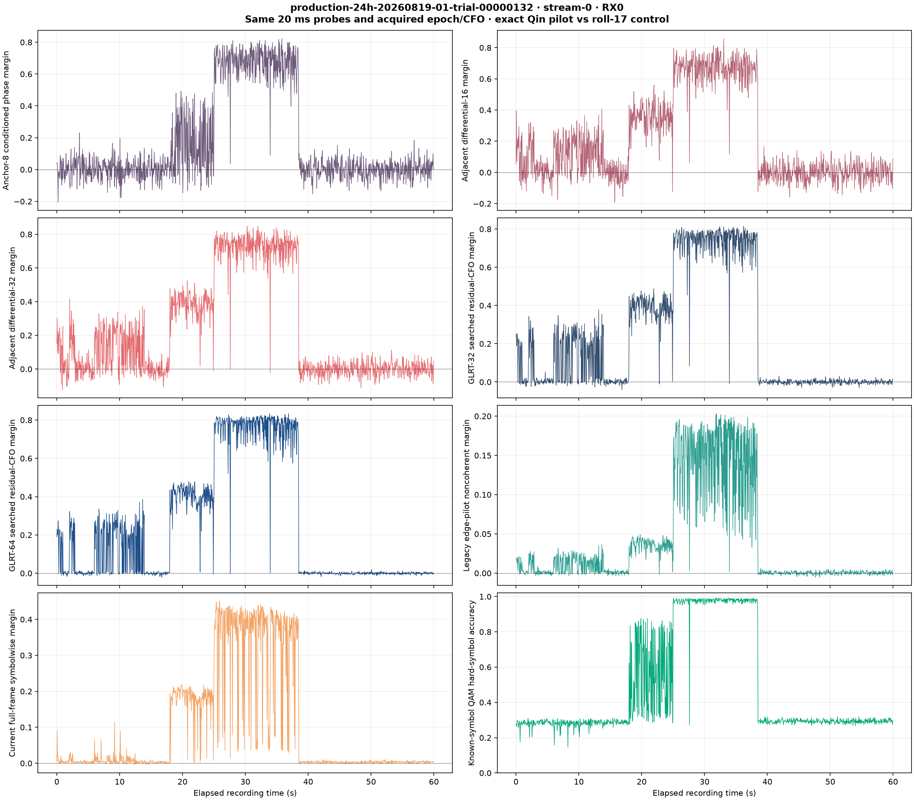
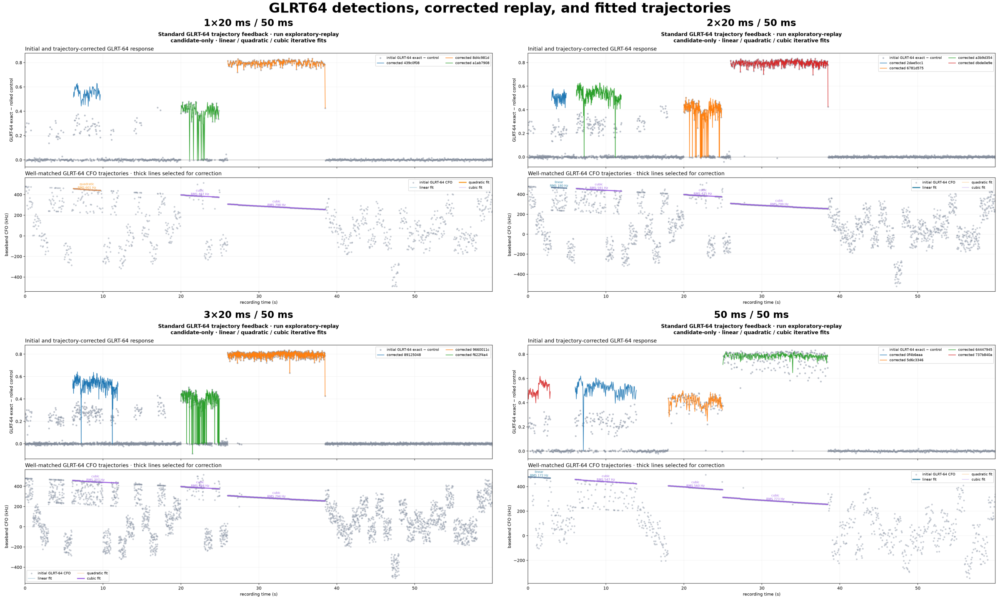

# Pilot-window geometry comparison

**Requested publication path:** `reports/2026_08_26_20ms_window_comparison.md`  
**Experiment executed:** 2026-08-20  
**Scientific scope:** candidate-only Qin edge-pilot evidence; no attribution or
payload decoding

## Executive summary

We replayed one reviewed, known-signal 60-second recording with four probe
geometries:

1. one 20 ms probe at offset 0 in every 50 ms subwindow;
2. two 20 ms probes at offsets 0 and 25 ms;
3. three 20 ms probes at offsets 0, 15, and 30 ms;
4. one continuous 50 ms probe in every 50 ms subwindow.

The 2 x 20 ms geometry is the strongest intermediate candidate. It preserved
the Standard observations exactly, selected four replayable GLRT64 tracks
instead of three, recovered an additional 3.025--4.925 s linear segment, and
had lower mean selected-fit residual than the 1 x 20 ms and 3 x 20 ms runs.

The 50 ms geometry produced the highest QAM-positive rate and longest fitted
segments, but it is not an equivalent denser sampling of the 20 ms detector:
it changes integration length and processes 2.5 times as many samples per
subwindow as Standard. The 3 x 20 ms geometry produced three times as many
observations, but the tracker merged them into fewer families. More probes are
therefore not a monotonic proxy for more useful Doppler tracks.

## Input and provenance

| Field | Value |
|---|---|
| Session | `production-24h-20260819-01-trial-00000132` |
| Stream / receiver | `stream-0` / RX0 |
| Qin edge | `lower` |
| Recording manifest digest | `sha256:1712bf...855d` |
| Authoritative source | `/mnt/qnap01/mouse9911/leo-store/test-corpus/trial-132-four-path-v1/` |
| Analysis location | isolated local copy; QNAP remained read-only |
| Implementation commit | `38515ceeacc7ac45af1442300011c748a0875908` |

The source recording already exists in the protected QNAP test corpus. It was
copied normally to a local temporary root for analysis. The analysis did not
write to the source corpus, contact radios, start acquisition, or mutate live
services.

## Probe geometry

| Name | Probe duration | Offsets within each 50 ms | Probes per 60 s | Raw processed support |
|---|---:|---|---:|---:|
| Standard, 1 x 20 | 20 ms | 0 ms | 1,200 | 24 s |
| 2 x 20 | 20 ms | 0, 25 ms | 2,400 | 48 s |
| Research candidate, 3 x 20 | 20 ms | 0, 15, 30 ms | 3,600 | 72 s, including overlap |
| Full subwindow, 1 x 50 | 50 ms | 0 ms | 1,200 | 60 s |

The 3 x 20 ms geometry overlaps adjacent probes by 5 ms. Its 3,600 probes are
not 3,600 statistically independent observations. Exact support intervals must
remain part of any future persisted Research contract.

## Known-pilot QAM response



| Geometry | Probes | QAM/pilot positives | Positive rate | Maximum QAM accuracy | Maximum pilot margin |
|---|---:|---:|---:|---:|---:|
| 1 x 20 ms | 1,200 | 243 | 20.25% | 0.97542 | 0.47620 |
| 2 x 20 ms | 2,400 | 478 | 19.92% | 0.97792 | 0.47620 |
| 3 x 20 ms | 3,600 | 712 | 19.78% | 0.97792 | 0.47620 |
| 1 x 50 ms | 1,200 | 308 | 25.67% | 0.99208 | 0.45066 |

The per-probe positive rate is essentially stable near 20% for all three
20 ms schedules. Their absolute positive counts increase in proportion to
probe count, without artificially strengthening the shared observations. The
50 ms detector is different: its longer integration produces a 25.67%
positive rate and higher maximum QAM accuracy, while its maximum held-out pilot
margin is slightly lower.

All 1,200 shared offset-0 probes were compared field by field between Standard
and the two denser 20 ms schedules. Acquisition CFO, GLRT64, Symbolwise,
Anchor-8, QAM, and every other emitted numerical field were exactly identical;
the maximum absolute difference was zero.

## Detector comparison

The standard exploratory comparison evaluated GLRT64, Symbolwise, Anchor-8,
differential-16/32, GLRT32, the legacy edge tracker, and known-pilot QAM. Only
GLRT64 observations were allowed to propose trajectory segments or feed
trajectory-conditioned replay.

### 1 x 20 ms



### 2 x 20 ms



### 3 x 20 ms



### 1 x 50 ms



## GLRT64 Doppler tracking and corrected replay



| Geometry | All fits | Families | Selected replay representatives | Mean selected RMS |
|---|---:|---:|---:|---:|
| 1 x 20 ms | 66 | 5 | 3 | 628.8 Hz |
| 2 x 20 ms | 71 | 6 | 4 | 511.4 Hz |
| 3 x 20 ms | 69 | 4 | 3 | 661.5 Hz |
| 1 x 50 ms | 72 | 6 | 4 | 512.9 Hz |

| Geometry | Selected degree and interval |
|---|---|
| 1 x 20 ms | quadratic 6.20--9.65 s; cubic 20.00--24.85 s; cubic 26.00--38.50 s |
| 2 x 20 ms | linear 3.025--4.925 s; cubic 6.20--11.975 s; cubic 20.00--24.85 s; cubic 26.00--38.50 s |
| 3 x 20 ms | cubic 6.115--11.930 s; cubic 20.00--24.930 s; cubic 26.00--38.50 s |
| 1 x 50 ms | linear 0.00--2.85 s; cubic 6.05--13.90 s; cubic 18.00--24.95 s; cubic 25.00--38.45 s |

Three principal intervals recur across all geometries: approximately 6--12 s,
20--25 s, and 26--38.5 s. This stability is stronger evidence than the raw
trajectory count. The 2 x 20 ms and 50 ms configurations also select early
linear segments. The 3 x 20 ms result demonstrates a tracker sensitivity:
denser observations can merge into fewer families under the current iterative
grouping and representative-selection policy.

## Interpretation and recommendation

- Keep 1 x 20 ms as the automatic Standard geometry. Its output is the frozen
  baseline and is cheaper than all alternatives.
- Carry 2 x 20 ms into the next bounded experiment. It currently offers the
  most promising coverage/compute compromise.
- Keep 3 x 20 ms as the proposed independent Research lane, but leave it manual
  until family grouping is tuned and repeated runtime/RSS measurements pass.
- Treat 1 x 50 ms as a separate long-integration experiment, not as a drop-in
  replacement for the 20 ms Qin detector.
- Continue allowing only GLRT64 to propose Doppler tracks. Symbolwise,
  Anchor-8, and QAM remain comparison/validation evidence.

The experiment does not establish Starlink attribution, satellite identity,
payload content, or statistical independence between overlapping probes.

## Reproduction

The explicit probe placement option is implemented in
`tools/analyze_edge_pilot_qam_timeline.py`. For each geometry, the workflow is:

```text
analyze_edge_pilot_qam_timeline.py
  -> compare_edge_pilot_methods.py
  -> run_trajectory_conditioned_redetection.py
```

Use `--probe-offsets-ms 0`, `--probe-offsets-ms 0,25`, or
`--probe-offsets-ms 0,15,30`; use `--probe-ms 50 --probe-offsets-ms 0` for the
full-subwindow variant. Every invocation must also supply the explicit
`--edge lower` used by this fixture. The complete generated PNG, CSV, and JSON
set is archived separately from this report.

Focused verification at publication time:

```text
24 passed in 1.32 s
Ruff: all checks passed
git diff --check: passed
```

## Archive contents

The prepared archive contains:

- this report and all six published figures;
- `research_pipeline.md`;
- the two analysis tools changed for the comparison;
- their focused regression tests;
- every generated PNG, CSV, and JSON artifact;
- a source-data pointer and SHA-256 manifest.

The 1.1 GB IQ corpus is not duplicated because its authoritative, protected
copy already exists at the QNAP source path listed above.
