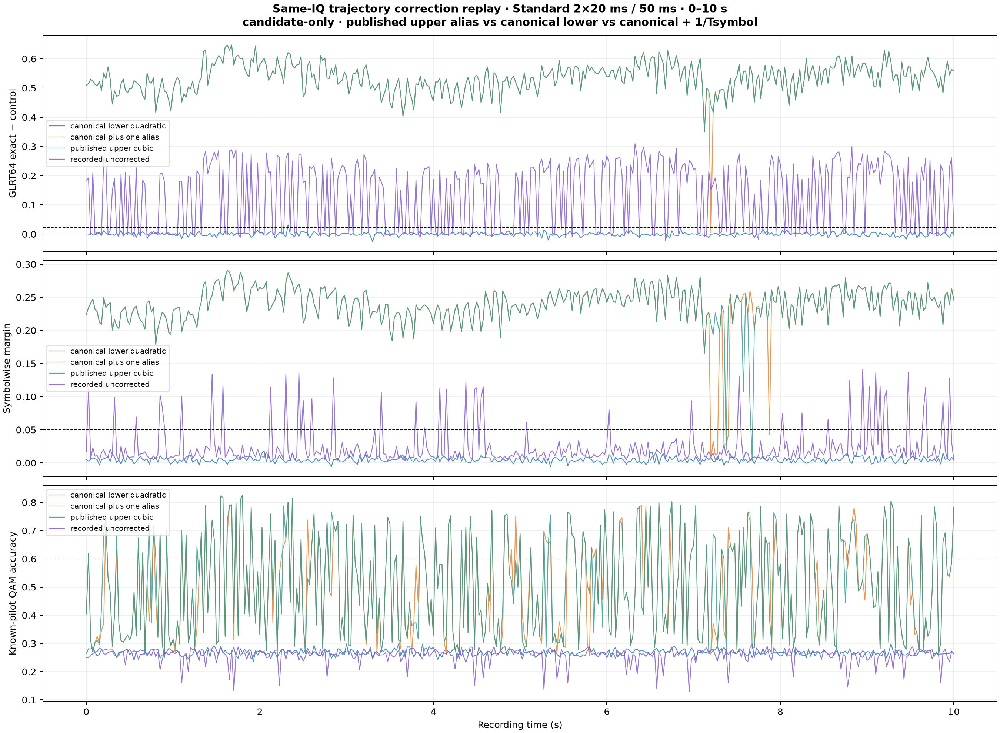
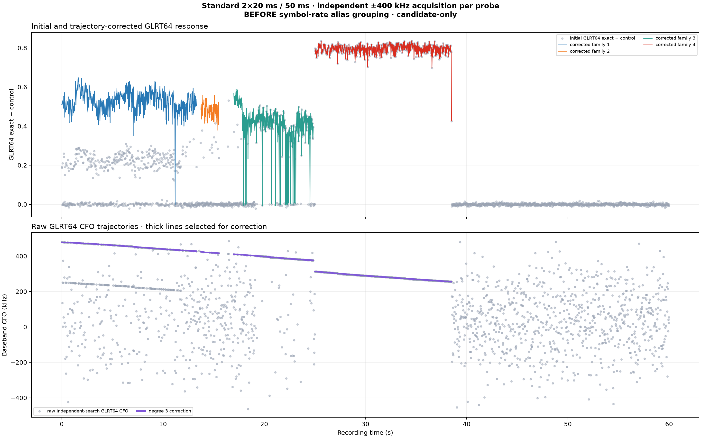
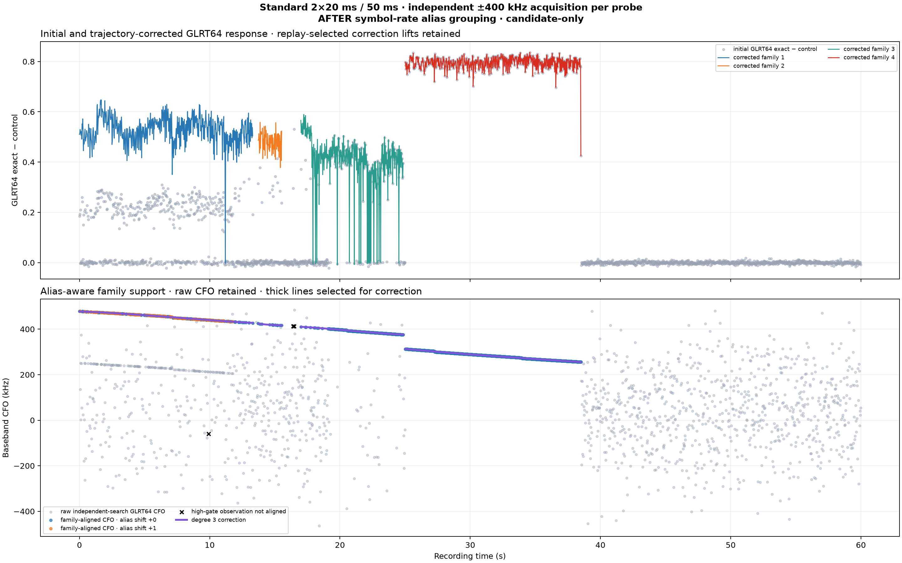

# Symbol-rate CFO alias canonicalization

**Experiment:** Standard 2 x 20 ms probes per 50 ms, 0--10 s  
**Recording:** `production-24h-20260819-01-trial-00000132`  
**Path:** `stream-0` / RX0 / lower Qin edge  
**Scope:** candidate-only; no satellite attribution or payload decoding

## Executive conclusion

The two apparent early GLRT64 CFO ridges do not behave like two independently
tracked targets. They behave like two aliases of one candidate trajectory:

- their raw separation is approximately one reciprocal OFDM symbol duration;
- subtracting that spacing collapses 235 observations onto one quadratic;
- a two-branch canonical model is penalized by 14.7 BIC points and has 6.8 Hz
  worse held-out RMS than one canonical model;
- same-IQ replay decisively selects the upper absolute-frequency lift.

Canonicalization should therefore be used to group and deduplicate trajectory
hypotheses, while corrected replay should select the absolute alias index used
for signal correction. A modulo representative alone is not a physical CFO
estimate.

## Inputs and provenance

| Field | Value |
|---|---|
| Recorded detector CSV | `2x20-independent-wide-pilot-methods.csv` |
| CSV SHA-256 | `sha256:7ee028b607f60b6e318ac9f13f04a8759b0a63b0b37f5a57abbad31faf11c6f6` |
| Recorded trajectory JSON | `2x20-independent-wide-trajectory-redetection.json` |
| Trajectory JSON SHA-256 | `sha256:d915aa8c705b4a1b3519fae4df658fdbfda54069041749fd1eb4c5e434112123` |
| Source IQ | reviewed local read-only copy of QNAP trial-132 corpus |
| Interval | inclusive 0.000--10.000 s |
| Scheduled probes | 401 |
| GLRT64 family high gate | `0.02368816028965054` |
| Symbol duration | 4.4 microseconds |
| Alias spacing | 227,272.7272727 Hz |
| Same-IQ replay runtime | 71.20 s wall |
| Maximum resident set | 726,548 KiB |
| Analysis JSON SHA-256 | `sha256:a2af55d3949cf953bd59b85125edd31d9af770b9abe555ea3a5800ec5b24c5ad` |
| Canonicalization PNG SHA-256 | `sha256:d66b0b36289e936d79f526122740bc2753696581e0932d89ca4ed83e4541c7b1` |
| Corrected-replay PNG SHA-256 | `sha256:a5be99e356c020e00efb4de81a3798316b1ac8c1330d6397c351233f41562860` |
| Full-duration before PNG SHA-256 | `sha256:0842e138f2d636a76e0a980fe5ccf3ecca114379d4ab1a4f4c512b5d36041d6a` |
| Full-duration after PNG SHA-256 | `sha256:21b1571f3d3afcb42a69a6bde7b7296acf528a55a90af2d041c8eaf17c0153d7` |

The replay used the immutable local copy at
`/tmp/leo-probe-geometry-ZdBpFs`. The QNAP corpus remained read-only. No radio,
database, service, or acquisition process was contacted or changed.

## Method

For every high-gate observation, the recorded CFO was preserved as:

\[
f_{\mathrm{raw}} = f_{\mathrm{acquired}} + f_{\mathrm{GLRT64\ residual}}.
\]

The analysis then jointly fitted a polynomial trajectory and a bounded integer
alias index:

\[
f_{\mathrm{canonical},i}
= f_{\mathrm{raw},i} - n_i\Delta f,
\qquad
\Delta f = \frac{1}{T_{\mathrm{symbol}}}.
\]

The assignment and fit steps alternated until stable:

1. choose the closest bounded integer alias for each raw CFO;
2. subtract that integer multiple of the symbol-rate spacing;
3. fit a weighted polynomial to retained canonical observations;
4. reject residuals outside 2,500 Hz;
5. repeat until aliases, support, and coefficients stop changing.

Weights were the positive GLRT64 margins. Linear, quadratic, and cubic fits
were compared by BIC and deterministic five-fold held-out prediction using
interleaved 250 ms time bins. The two-track challenger fitted separate
quadratics to the two original alias labels after canonicalization.

The initial modulo class was found with a weighted circular mean at the exact
alias spacing, then lifted nearest the lower raw-CFO quartile solely to make the
canonical plot readable. That lift is a coordinate choice, not a claim about
the physical correction frequency. The same-IQ replay below determines the
working absolute lift independently.

## CFO canonicalization result


Of 236 high-gate observations, 235 support the alias-aware trajectory and one
is rejected by the frozen residual gate. The retained alias inventory is:

| Raw alias | Observations | Canonical branch RMS |
|---:|---:|---:|
| `n = 0` | 98 | 755.6 Hz |
| `n = 1` | 137 | 803.1 Hz |

The selected canonical quadratic is:

\[
f(t) = -135.1100t^2 - 2593.7669t + 250702.5702\ \mathrm{Hz}.
\]

Its acceleration is `-270.22 Hz/s^2`, because acceleration is twice the
quadratic coefficient.

### Polynomial order

| Degree | Retained | Fit RMS | Held-out RMS | BIC |
|---:|---:|---:|---:|---:|
| Linear | 235 | 1,237.3 Hz | 1,254.9 Hz | 3,009.75 |
| Quadratic | 235 | **785.4 Hz** | **797.5 Hz** | **2,794.07** |
| Cubic | 235 | 785.4 Hz | 817.6 Hz | 2,799.27 |

The cubic reduces in-sample RMS by less than 0.1 Hz but predicts held-out bins
worse and pays an additional parameter penalty. The quadratic is the supported
order for this bounded interval.

### One canonical track versus two

| Model | Continuous parameters | Held-out RMS | BIC | Delta BIC |
|---|---:|---:|---:|---:|
| One canonical quadratic | 3 | **797.5 Hz** | **2,794.07** | 0.00 |
| Two branch-specific quadratics | 6 | 804.3 Hz | 2,808.74 | +14.67 |

The extra track does not improve held-out prediction. Its BIC is substantially
worse. After removing the exact symbol-rate ambiguity, the residuals from the
two raw branches overlap rather than forming two smooth, separable curves.

This rejects the specific two-target explanation for these two ridges. It does
not prove that only one emitter exists anywhere in the interval.

## Same-IQ correction replay

Canonical CFO is an equivalence class. It does not by itself identify which
absolute lift should dechirp the recorded samples. We therefore replayed the
same 401 IQ probes with three corrections and compared them to the recorded,
uncorrected detector output:

1. the published upper cubic representative;
2. the fitted lower canonical quadratic;
3. the same canonical quadratic plus exactly one alias spacing.



| Correction | GLRT64 median margin | GLRT64 positives | Symbolwise median | QAM median | QAM + pilot positives |
|---|---:|---:|---:|---:|---:|
| Recorded, uncorrected | 0.1873 | 236 / 401 | 0.0126 | 0.2650 | 0 / 401 |
| Lower canonical quadratic | 0.0001 | 1 / 401 | 0.0048 | 0.2683 | 0 / 401 |
| Canonical quadratic + one alias | **0.5360** | 400 / 401 | **0.2409** | 0.4817 | 144 / 401 |
| Published upper cubic | **0.5360** | **401 / 401** | 0.2402 | **0.4863** | **150 / 401** |

The lower modulo representative is not the correct correction frequency. It
removes almost all GLRT64 and Symbolwise response and produces no QAM-positive
probes. Adding one exact symbol-rate spacing restores nearly the complete
published response. The existing published upper cubic and the alias-aware
upper quadratic are scientifically consistent; the cubic retains a small
advantage in QAM-positive count over this interval.

This is the strongest evidence that the lower ridge is a symbol-rate detector
alias of the upper working CFO trajectory, rather than a second independently
correctable signal.

## Full-duration before and after

Both figures below use the exact same recorded Standard 2 x 20 ms detector
output. Every probe performed its own independent -400 to +400 kHz acquisition.
The after figure does not rerun a narrower search or hide the raw CFO cloud.

### Before alias grouping



The published representatives contain 931 observations. Other high-gate points
that are one symbol rate below a selected trajectory remain visually detached
from the thick correction lines.

### After alias grouping



For every high-gate observation occurring inside a published representative's
time interval, the after view tests bounded integer symbol-rate shifts and
retains the shift with the smallest trajectory residual. It finds:

| Full-duration result | Count |
|---|---:|
| High-gate GLRT64 observations | 1,050 |
| Already on the selected correction lift (`shift 0`) | 931 |
| Recovered one-symbol aliases (`shift +1`) | 116 |
| Not aligned within 2,500 Hz | 3 |
| Total aligned | 1,047 |

The aligned residual RMS is 739.6 Hz. The 931 shift-zero observations exactly
match the total point count of the four published representatives. Alias-aware
grouping recovers 116 additional observations without changing the four
replay-selected correction trajectories. Only three high-gate observations
remain outside the residual gate.

The response panel is intentionally unchanged between the figures: the
existing published representatives already selected the upper, replay-supported
correction lift. The fix changes how alias-equivalent CFO observations are
grouped and explained; it does not manufacture a new corrected detector score.

## Recommended pipeline behavior

Keep two separate concepts:

1. **Canonical trajectory identity** groups raw observations modulo
   `1 / T_symbol` for family formation and duplicate suppression.
2. **Correction lift** records the integer alias selected by same-IQ replay for
   dechirping and subsequent detector/QAM analysis.

Every trajectory product should retain:

| Field | Purpose |
|---|---|
| `raw_cfo_hz` | exact detector output; never overwritten |
| `alias_spacing_hz` | template-derived ambiguity authority |
| `canonical_cfo_hz` | alias-equivalent trajectory coordinate |
| `alias_index` | integer relating raw and canonical CFO |
| `correction_alias_index` | lift selected by replay |
| `correction_cfo_hz` | actual CFO trajectory applied to IQ |
| replay metrics | evidence supporting the selected lift |

Multi-target birth/death/crossing logic should operate after alias-equivalent
families are grouped. It should create separate physical-track hypotheses only
when canonical trajectories remain distinct and independent replay/QAM evidence
supports more than one correction.

## Limitations

- This is one recording, one radio stream, one receiver path, and ten seconds.
- GLRT64 observations were selected by the already-recorded family high gate.
- The two-track challenger tests the two visible raw alias branches; it is not a
  general unlimited multi-target search.
- BIC counts continuous polynomial parameters; bounded integer alias states are
  treated as latent assignments. Held-out prediction independently supports
  the same result.
- QAM and pilot evidence remain candidate-only and do not establish Starlink or
  satellite identity.

## Reproduction

```bash
PYTHONPATH=src .venv/bin/python \
  tools/analyze_cfo_alias_canonicalization.py \
  --input artifacts/probe-geometry-comparison/2x20-independent-wide-pilot-methods.csv \
  --trajectory-json artifacts/probe-geometry-comparison/2x20-independent-wide-trajectory-redetection.json \
  --output-root reports/figures/2026_08_26_cfo_alias_canonicalization \
  --bulk-root /tmp/leo-probe-geometry-ZdBpFs \
  --session-id production-24h-20260819-01-trial-00000132 \
  --stream stream-0 \
  --receiver 0 \
  --edge lower \
  --workers 4
```

The canonical JSON result is
`reports/figures/2026_08_26_cfo_alias_canonicalization/cfo-alias-analysis.json`.
Its scientific inputs are digest-pinned above; reruns must not silently refresh
them.
