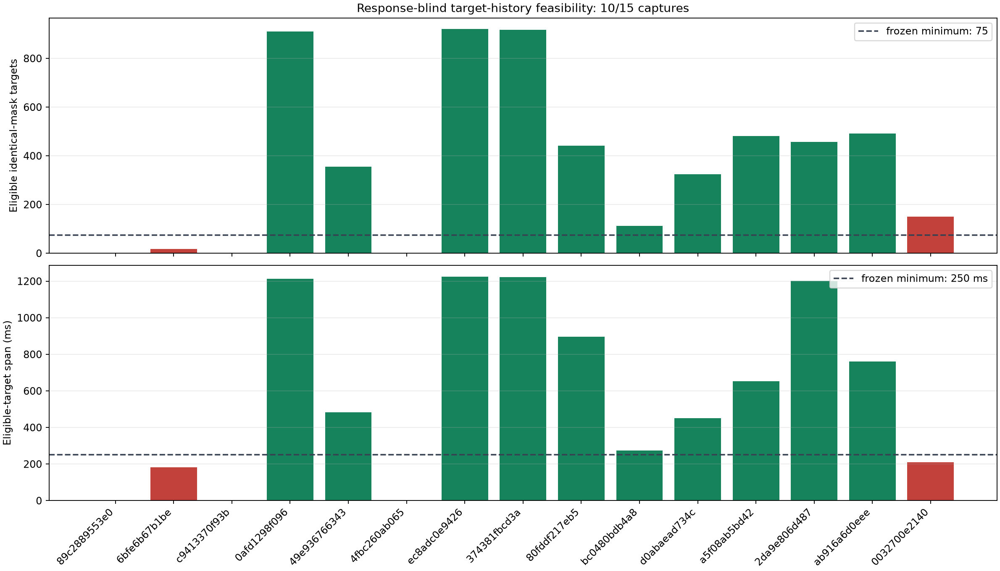
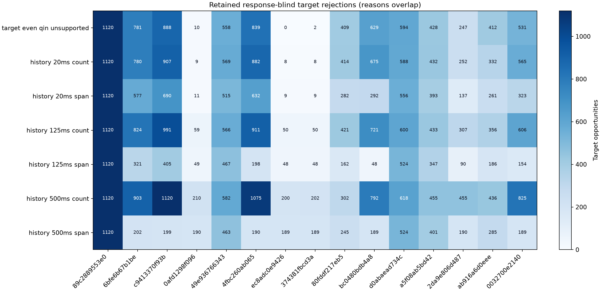

# Response-blind Doppler holdout selector v2 results

**Date:** 2026-08-26

**Dataset phase:** POST-FIX, counter-authoritative, protocol-unopened holdout

**Result:** **feasibility gate passed: 10 of 15 captures are evaluable**

## Executive result

The revised response-blind selector produced an exact ten-capture cohort with
5,413 eligible future target opportunities on the passing captures. The median
passing capture has 469.5 targets. Passing target spans range from 273.333 to
1,225.334 ms, with a median of 828.667 ms.

This is a feasibility result, not an estimator comparison. No odd-Qin response
was read, demodulated, or scored. No fixed 500 ms, fixed 125 ms, causal 20 ms,
Kalman, acceleration, or other candidate estimator was run. Passing this gate
freezes the cohort and identical target masks; it does not authorize this lane
to open the response.

An **eligible target means only that its current even fold and its strictly past
even-fold histories pass**. It does not establish that a finite odd-Qin response
will be available at that target. Missing-response incidence is deliberately
unknown until the separately frozen scoring pass; it must be reported as
response availability, not retroactively converted into target membership.

Ten captures clear both predeclared lines: at least 75 eligible targets and an
eligible-target span of at least 250 ms. `051221` illustrates why both gates
matter: it has 150 eligible targets but they span only 209.333 ms, so it remains
non-evaluable.

## What changed from v1

The [v1 feasibility pass](2026_08_25_doppler_holdout_feasibility.md) required a
globally dense 1.5 s episode: at least 600 supported frames, 65% support, and a
75-frame contiguous run. Only 4/15 captures passed. Those gates were indirect:
they did not ask whether a particular target had enough strictly past support
for all three planned estimators.

The [v2 preregistration](2026_08_26_doppler_holdout_selector_v2_preregistration.md)
therefore froze target-local gates:

| Strictly past history | Supported-frame minimum | Supported-span minimum |
|---:|---:|---:|
| 20 ms | 8 | 10 ms |
| 125 ms | 50 | 62.5 ms |
| 500 ms | 200 | 250 ms |

The counts apply one approximately 53% occupancy principle across the three
750 Hz windows. The spans require at least half-horizon temporal leverage. The
target must itself be even-Qin supported, and all history must be in the same
continuity segment and strictly earlier than the target. A capture needs at
least 75 eligible targets spanning at least 250 ms.

This revision was informed by the already published v1 **even-side**
diagnostics, which is explicitly disclosed. It was not informed by an odd-Qin
value or candidate-estimator outcome. It should be called a
feasibility-informed revision, not a pristine first protocol.

## Frozen inheritance and data boundary

V2 made no new source, path, alias, epoch, or episode choice. It consumed the
exact v1 derived manifest:

- file SHA-256:
  `sha256:860b067a154b6b5ecf3172aa2f18105d4ef753cdb5472bab44cbfe9339662c70`;
- semantic manifest digest:
  `sha256:c82a548683cbdfd026420ace9c8b6161ba5b69331682d6c68c1baafd73410b39`;
- original frozen protocol commit:
  `c6d0654aebd294745ef87416a5e5b5b503d17c01`.

Each v2 disposition embeds and digest-binds its complete v1 disposition. That
retains all 15 recording and analysis manifest identities, all inspected
Standard-product receipts and document digests, all source-window audits, the
selected source/alias/trajectory/epoch, the counter-coordinate episode, and
every supported or unsupported even-Qin frame row.

The v2 selector was frozen at
`d1aab4f65cc0bd69d9a25c025a0eca8967b49fe5` before the exact pass. Its runner is
offline-only: it has no bulk-root argument and records that `/srv`, raw IQ, odd
Qin, and candidate estimators were not accessed.

The inherited upstream Standard source, alias, and epoch products may contain
all-Qin GLRT64 evidence. Thus the eventual odd-Qin evaluation will be
fit-withheld from the downstream estimators, but it is not claimed to be
end-to-end independent of upstream acquisition and conditioning.

No newer capture, PRE-FIX capture, 3/5-MS/s capture-only row, `Research` row, or
current experimental recording was used. These are continuity-clean POST-FIX
captures and their failures are not evidence of the old refill defect.

## Capture accounting

| Capture | Eligible targets | Target span (ms) | V1 status | V2 status | Failed capture gates |
|---|---:|---:|---|---|---|
| `cap-20260825T010019-89c2889553e0` | 0 | 0.000 | non-evaluable | non-evaluable | count, span |
| `cap-20260825T015754-6bfe6b67b1be` | 18 | 181.334 | non-evaluable | non-evaluable | count, span |
| `cap-20260825T020035-c9413370f93b` | 0 | 0.000 | non-evaluable | non-evaluable | count, span |
| `cap-20260825T022235-0afd1298f096` | 911 | 1,213.334 | evaluable | **evaluable** | none |
| `cap-20260825T030000-49e936766343` | 355 | 482.667 | non-evaluable | **evaluable** | none |
| `cap-20260825T031245-4fbc260ab065` | 0 | 0.000 | non-evaluable | non-evaluable | count, span |
| `cap-20260825T031521-ec8adc0e9426` | 920 | 1,225.334 | evaluable | **evaluable** | none |
| `cap-20260825T033028-374381fbcd3a` | 918 | 1,222.667 | evaluable | **evaluable** | none |
| `cap-20260825T033302-80fddf217eb5` | 442 | 896.000 | non-evaluable | **evaluable** | none |
| `cap-20260825T034929-bc0480bdb4a8` | 112 | 273.333 | non-evaluable | **evaluable** | none |
| `cap-20260825T035201-d0abaead734c` | 324 | 450.666 | non-evaluable | **evaluable** | none |
| `cap-20260825T041207-a5f08ab5bd42` | 482 | 652.000 | non-evaluable | **evaluable** | none |
| `cap-20260825T043656-2da9e806d487` | 457 | 1,201.334 | evaluable | **evaluable** | none |
| `cap-20260825T050946-ab916a6d0eee` | 492 | 761.333 | non-evaluable | **evaluable** | none |
| `cap-20260825T051221-0032700e2140` | 150 | 209.333 | non-evaluable | non-evaluable | span |

Across all 15 captures, 5,581 of 16,802 frame opportunities are eligible. The
168 opportunities in the five failing captures remain excluded from the
frozen cohort. They are retained in the ledger rather than silently discarded.

## Why targets fail

The figure retains every opportunity and counts overlapping reasons. Across all
captures, 9,295 opportunities lack the frozen 500 ms count, 8,015 lack the 125
ms count, 7,541 lack the 20 ms count, and 7,448 targets are themselves
even-Qin-unsupported. Span failures number 4,765, 4,167, and 5,807 at 500, 125,
and 20 ms respectively. These totals overlap and must not be summed as unique
failures.

Early supported targets naturally fail until enough strict-past history has
accumulated. This is intentional: target selection models the actual causal
information available to all three estimators rather than granting future
training evidence.

## Consequence for the next experiment

The launch gate is now satisfied, so the clean next action is to freeze the
final calibrated estimator configurations and bind them to these exact ten
capture IDs and exact target-mask digests. Then, in one separately authorized
pass, evaluate fixed 500 ms, fixed 125 ms, and causal 20 ms on each identical
even-selected target mask where an odd-Qin response is available. Response
missingness must be counted separately on the complete frozen mask.

The comparison must not:

- rerank sources, aliases, epochs, episodes, captures, or masks;
- drop a capture after seeing an odd-Qin response;
- tune covariance, history, gates, or nuisance parameters on this response;
- claim physical Doppler truth from future odd-Qin CFO prediction error; or
- use the five failed captures as replacements or extra response rows.

Passing feasibility does not guarantee that the calibrated estimator will win.
It only removes the v1 support bottleneck without weakening the response seal.

## Reproducibility and audit artifacts

The offline pass completed in 2.046 s. Artifacts are:

- [Derived v2 manifest](figures/2026_08_26_doppler_holdout_selector_v2/derived-manifest-v2.json),
  26,257,467 bytes, SHA-256
  `sha256:aa1116aeb69181ec631be20500d35449457db830dccb454245a36f646763556a`,
  semantic digest
  `sha256:99a914335caa8501745325c265b67b68c22317fa399e6c6a03e27fe64400627b`;
- [Failure ledger](figures/2026_08_26_doppler_holdout_selector_v2/failure-ledger.csv),
  SHA-256
  `sha256:096b9c68c0c3d23f66d84dbe2cb55f76c57ae51dc5ea576812c7eca42f72916c`;
- [Target accounting PNG](figures/2026_08_26_doppler_holdout_selector_v2/target-accounting.png),
  plain Matplotlib, SHA-256
  `sha256:1be5f00da6379a8af720fd920d8b9ae7be472acde8030e7417ad746c90420a51`;
- [Target rejection PNG](figures/2026_08_26_doppler_holdout_selector_v2/target-rejections.png),
  plain Matplotlib, SHA-256
  `sha256:6e0ef7211081526ebc252b6944ebfcfedc355f80cba8ccd227924b839b1b35ad`;
- [Audit receipt](figures/2026_08_26_doppler_holdout_selector_v2/audit-receipt.json),
  SHA-256
  `sha256:154e74138d9509a062a68c2fa39116bdc5681e2fedb2829d87b0da5a5781d942`.

## Related reports

- [Dataset authority](2026_08_25_doppler_experiment_dataset_policy.md)
- [V1 response-blind feasibility](2026_08_25_doppler_holdout_feasibility.md)
- [Doppler experiment campaign synthesis](2026_08_26_doppler_rate_experiment_campaign.md)
