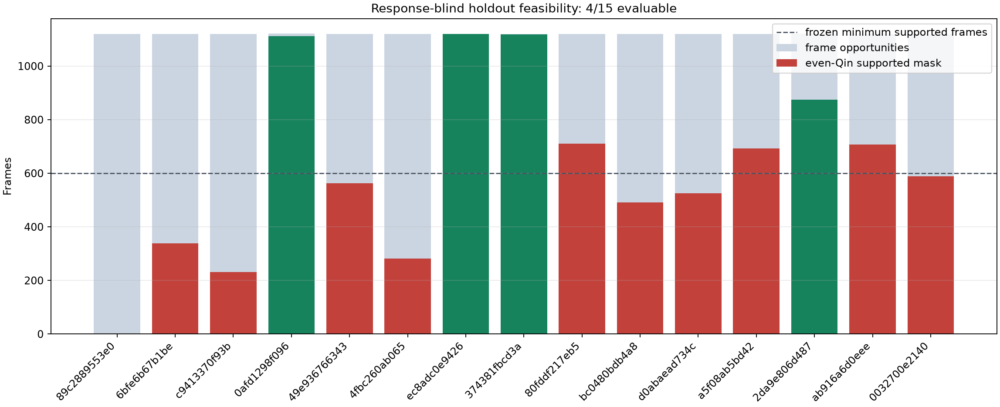
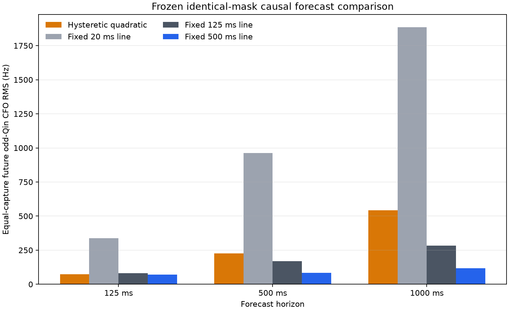
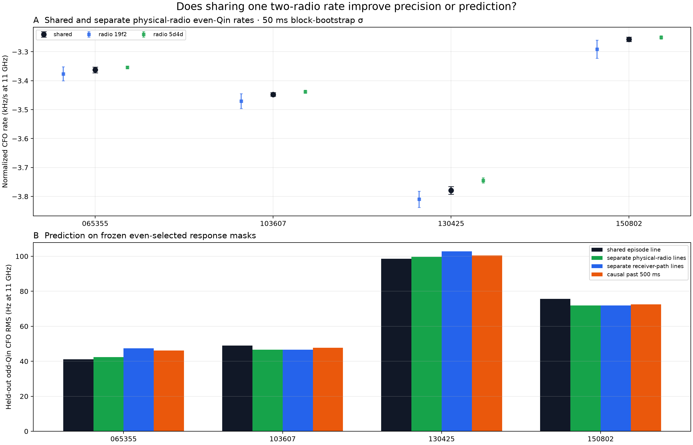

# Doppler-rate experiment campaign: frozen POST-FIX development results

## Executive result

Six prespecified work lanes were pursued under the deny-by-default
[Doppler experiment dataset policy](2026_08_25_doppler_experiment_dataset_policy.md),
with their launch and support gates preserved in the results.
No capture later than `cap-20260825T150802-473cb5bbcbd6`, no ongoing or newly
collected data, no PRE-FIX recording, and no 3/5 MS/s `CAPTURE_ONLY` recording
was used.

The campaign does not support replacing the current source-bound, robust
500 ms frame-CFO line.  It does establish several narrower results:

1. the frozen unopened cohort was not feasible for a >=10-capture comparison:
   only 4/15 captures passed the response-blind even-Qin support gate, so no
   candidate estimator and no future odd-Qin response was opened;
2. exact-Qin polynomial injection into three real POST-FIX hard-null
   backgrounds produced genuine known-truth rate errors, but the 500 ms
   estimator's scenario-equal nominal 95% coverage was only 64.5% (pooled
   endpoint coverage 44.0%) and the cubic evidence covered only two
   backgrounds;
3. the lean causal `[CFO, rate, acceleration]` candidate was under-supported
   and descriptively worse than fixed 500 ms at every horizon;
4. V4 improved numerical completion on the opened `150802` canary, but its
   downstream comparison had only 3/20 adequate common anchors and did not
   establish improvement or noninferiority;
5. in a disclosed post-freeze diagnostic, one shared rate across two physical
   radios roughly halved the median block-bootstrap slope dispersion, but
   slightly worsened future CFO RMS relative to separate physical-radio rates;
   and
6. the proposed weak-frame full-likelihood gate could not be evaluated from
   the frozen serialized development sources and remains unit-test-only.

The practical next model is therefore conservative: keep fixed 500 ms as the
primary local-rate estimator, repair its covariance calibration, and explore a
hierarchical common-rate prior that permits radio-specific deviations.  Do not
add acceleration, V4-specific rate dynamics, or full likelihood to production
until each earns a gain on a sufficiently supported response-blind cohort.

## 1. Authority and error semantics

The exact capture roles, manifest digests, inventory commit, cutoff, and
prohibited input classes are frozen in the
[dataset-policy report](2026_08_25_doppler_experiment_dataset_policy.md) and
[`doppler-experiment-dataset-policy-v1.json`](../config/analysis/doppler-experiment-dataset-policy-v1.json).
All real-data inputs below are counter-authoritative POST-FIX recordings with
one continuity segment and no recorded gaps, missing samples, overflows, or
enqueue failures.  The three injection backgrounds are the policy's exact
opened hard-null captures.

Three quantities must not be conflated:

- **known-truth rate error (Hz/s)** is available only in the injection lane;
- **future or held-out CFO RMS (Hz)** measures frequency prediction on
  fit-withheld odd Qin, not rate error; and
- **rate disagreement or bootstrap sigma (Hz/s)** measures internal
  repeatability or estimator variability, not error against orbital truth.

Upstream Standard source, alias, and epoch selection may use all Qin.  “Even
train / odd held out” below is therefore a downstream conditional split, not
an end-to-end blind acquisition claim.

## 2. Campaign accounting

| requested direction | frozen data role | execution | primary output | outcome |
|---|---|---|---|---|
| >=10-capture unopened holdout | 15 `holdout_foundation` captures | response-blind feasibility only | 4/15 evaluable; no odd response opened | **launch gate failed** |
| polynomial truth injection | 3 `polynomial_injection` hard-null captures | 18 exact-Qin scenarios, 27,000 frame opportunities | fixed-500 rate RMSE 163.3 Hz/s; scenario-equal coverage 64.5% (pooled 44.0%); cubic only 2 backgrounds | **failed coverage/background gates** |
| causal `[CFO, rate, acceleration]` | 16 `rate_development` captures | 8 yielded forecasts | candidate/fixed-500 RMS 1.054 / 2.674 / 4.636 | **inconclusive and adverse** |
| V3/V4 downstream rate | opened `150802` canary | 537 yield rows; 20 frozen extension anchors | 3 adequate common anchors; V4/V3 fixed-500 RMS 1.031 | **under-supported; no improvement** |
| multi-radio common rate | 4 `multi_radio` captures | 4/4 evaluable, 14/15 paths | shared/radio bootstrap-sigma ratio 0.527; shared/radio prediction-RMS ratio 1.011 | **useful dispersion/prediction tradeoff** |
| gated full likelihood | same rate-development sources | frozen feature audit + unit tests | required even likelihood surfaces/features absent | **real-data test unavailable** |

Every lane retains failures rather than replacing captures, branches, paths,
or windows dynamically.

## 3. Unopened holdout feasibility

The
[holdout feasibility report](2026_08_25_doppler_holdout_feasibility.md)
applied a frozen response-blind selector to all 15 protocol-unopened captures.
It inspected upstream source evidence and even-Qin frame support only.  It did
not demodulate or score future odd Qin and did not run any candidate rate
estimator.

- 15/15 captures received a disposition;
- 60 scopes and 300 digest-pinned products were checked;
- 16,802 frame opportunities yielded 9,354 even-supported frames;
- only 4 captures met all support and continuity gates, below the frozen
  minimum of 10; and
- the proposed confirmatory fixed-500/fixed-125/causal-20 comparison therefore
  did not launch.

This is a feasibility/launch-gate failure, not evidence that the four estimators would
or would not generalize.  Because no downstream response was opened, a future
response-blind protocol may justify a different source/even-support selector,
freeze it, and try again without contaminating the odd-Qin outcomes.

## 4. Known-truth exact-Qin injection

The
[polynomial Qin injection report](2026_08_25_polynomial_qin_injection_results.md)
is the only lane that supplies actual known rate, acceleration, and jerk truth.
It injected the repository's exact lower-edge Qin template into three
digest-pinned 2 s POST-FIX hard-null spans.  The frozen 18-scenario grid varied
rate, acceleration, jerk, SNR, occupancy, alias changes, CFO steps, and a
phase-coordinate clock warp.  The latter did not resample the waveform or
lattice and must not be interpreted as a full sample-clock simulation.

For the six no-step scenarios:

| estimator | rate RMSE | scenario-equal completed endpoints >500 Hz/s error | scenario no-result |
|---|---:|---:|---:|
| fixed 20 ms | 3,771 Hz/s | 82.9% | 4/6 |
| fixed 125 ms | 202.6 Hz/s | 0.5% | 4/6 |
| fixed 500 ms | **163.3 Hz/s** | **0.0%** | 2/6 |

The fixed-500 promotion subset had 0% errors above 500 Hz/s, conditional on
completed endpoints, but its scenario-equal nominal 95% coverage was only
64.5%; pooled endpoint coverage was 677/1,540 (44.0%).  The four evaluable
scenarios also contributed very unequal endpoint counts.  The preregistered
result therefore failed: the point estimate is useful at strong support, while
uncertainty calibration and trailing-linear curvature lag are unresolved.

Offline cubic fitting was complete for only 2/6 no-step scenarios, both at
-16 dB.  Conditional on those two, rate, acceleration, and jerk RMSE were
14.5 Hz/s, 11.0 Hz/s^2, and 176.1 Hz/s^3.  Those attractive rate and
acceleration numbers do not generalize to the weak-signal rows that returned no
result.

CFO steps remain difficult.  Under the common frozen 500 ms exclusion and
equal-scenario aggregation, fixed 500 ms gave pre-step, transition, and
post-exclusion rate RMSE of 171.8, 545.1, and 192.0 Hz/s.  Fixed 125 ms reacted
faster but still suffered 1,264.9 Hz/s transition RMSE.  This motivates
testing a conservative change detector, but does not establish one; the
candidate dynamics tested in the next lane performed poorly.

## 5. Lean causal acceleration state

The
[causal acceleration development report](2026_08_25_causal_cfo_acceleration_development.md)
tested a past-only local-quadratic surrogate with hysteresis against fixed
20 ms, 125 ms, and 500 ms histories on the exact serialized development inputs
available at protocol freeze.

The formal result is **inconclusive**: only 3, 2, and 2 captures met the frozen
support criterion at 125, 500, and 1,000 ms, versus seven required.  The
descriptive direction is nevertheless consistently unfavorable:

| forecast horizon | candidate RMS | fixed-500 RMS | ratio |
|---|---:|---:|---:|
| 125 ms | 74.44 Hz | 70.60 Hz | 1.054 |
| 500 ms | 225.17 Hz | 84.19 Hz | 2.674 |
| 1,000 ms | 542.92 Hz | 117.10 Hz | 4.636 |

No real state triggered the frozen change mode.  The added acceleration degree
of freedom behaved as an extrapolator, not as a reliable adaptive improvement.

This lane also froze a weak/ambiguous-frame full-likelihood gate.  The
serialized sources contained neither per-frame even-Qin likelihood surfaces
nor both required response-blind gate features, and raw rescue was forbidden.
The gate therefore has unit tests but no real-data invocation or accuracy
result.  That is the truthful outcome for requested direction 6.

## 6. V3/V4 downstream rate benchmark

The
[V3/V4 downstream report](2026_08_25_v3_v4_downstream_rate_benchmark.md)
separates acquisition yield from future rate prediction on the already-opened
`150802` canary.

Across all 537 frozen canary rows, V3 completed 266 and V4 completed 311:
50 V3 no-results became V4 completions, while five V3 completions regressed.
However, V3 had 383 complete discrete alignments and V4 accepted only 311
modes, so V4 is more selective rather than a universal acquisition-yield win.

The preregistered 1 s extension was under-supported: only 3/20 common anchors
and 34 fixed-500 target pairs met the primary requirements, versus 8 anchors
and 40 pairs required.  On that small common subset:

| predictor | V3 RMS | V4 RMS | V4/V3 |
|---|---:|---:|---:|
| fixed 20 ms | 402.26 Hz | 437.26 Hz | 1.087 |
| fixed 500 ms | 77.56 Hz | 80.00 Hz | 1.031 |

The 1.031 point ratio lies inside the numerical 1.05 bound, but support failed,
so noninferiority was not established.  It also misses the 0.95 material
improvement target.  All three V4-only extended anchors were retained, but none
had enough support for a fixed-500 prediction; no favorable error was imputed.

V4 should continue to be evaluated as acquisition and mode-selection plumbing.
There is no evidence here for changing downstream rate dynamics specifically
because V4 completed more numerical rows.

## 7. Multi-radio common-rate fit

The
[multi-radio common-rate report](2026_08_26_multi_radio_common_rate_results.md)
used four frozen 1.5 s POST-FIX episodes spanning two physical Pluto radios.
All four captures were evaluable and 14/15 exact receiver paths passed support.
Rates were normalized to nominal 11 GHz and fitted with free constant offsets
per receiver path.

| capture | shared rate at 11 GHz | physical-radio disagreement |
|---|---:|---:|
| `065355` | -3.362512 kHz/s | 22.25 Hz/s |
| `103607` | -3.447432 kHz/s | 33.00 Hz/s |
| `130425` | -3.778769 kHz/s | 65.31 Hz/s |
| `150802` | -3.256948 kHz/s | 40.79 Hz/s |

The disagreements are internal repeatability measures, not truth errors.
Sharing reduced median 50 ms block-bootstrap sigma from 16.53 to 8.70 Hz/s
relative to separate physical-radio slopes, a ratio of 0.527.  This is the
post-freeze diagnostic's numerical dispersion, not calibrated uncertainty or
a physical variance claim.  Sharing slightly worsened equal-capture future
odd-Qin RMS from 69.05 to 69.84 Hz, a ratio of 1.0114.  The locally
strict-past 500 ms path line remained competitive at 70.28 Hz, conditional on
the upstream noncausal branch/alias/frame selection.

The response-blind preregistration mistakenly froze a separate-path comparator
rather than the requested separate-physical-radio comparator.  The frozen
classification remains based on the path comparator; the radio comparison was
added after scoring as an explicitly disclosed mechanical diagnostic on
unchanged masks.  A future confirmation must freeze the radio comparator
before response access.

The result motivates testing a hierarchical prior—one common rate plus
regularized radio deviations—more strongly than it motivates an exact
common-rate constraint.  No hierarchical model was evaluated here.

## 8. Overall decision

| candidate change | evidence | decision |
|---|---|---|
| replace fixed 500 ms with causal acceleration | adverse at all horizons; insufficient capture support | **do not promote** |
| trust current fixed-500 covariance | 64.5% scenario-equal coverage (44.0% pooled) for nominal 95% intervals | **recalibrate** |
| use V4 completion as evidence of better rate | downstream support failed; point RMS slightly worse | **keep yield and rate gates separate** |
| force one slope across radios | halves post-freeze bootstrap dispersion but worsens prediction 1.14% | **test a soft hierarchy; do not force equality** |
| invoke full likelihood on weak frames | no frozen real-data features/surfaces | **untried on real data** |
| score the current unopened holdout | only 4/15 feasible under frozen selector | **not authorized** |

The clearest genuinely promising work is now measurement and uncertainty
quality, not a larger dynamic state:

1. recalibrate fixed-500 rate covariance on the known-truth injection corpus,
   with scenario-level rather than frame-iid coverage accounting;
2. expand the exact-Qin injection grid with waveform/lattice resampling for a
   real sample-clock-offset experiment and more strong-but-contaminated rows;
3. freeze a hierarchical multi-radio model on response-blind development data,
   then evaluate both rate stability and odd-Qin prediction;
4. design a revised unopened-cohort feasibility selector using only frozen
   upstream/even evidence, and do not open odd responses until >=10 captures
   pass; and
5. preserve fixed 500 ms as the benchmark for every future rate estimator.

Clock/LNB calibration remains a separate experiment.  Nothing in this campaign
claims that a receiver-CFO slope is calibrated physical satellite Doppler.
