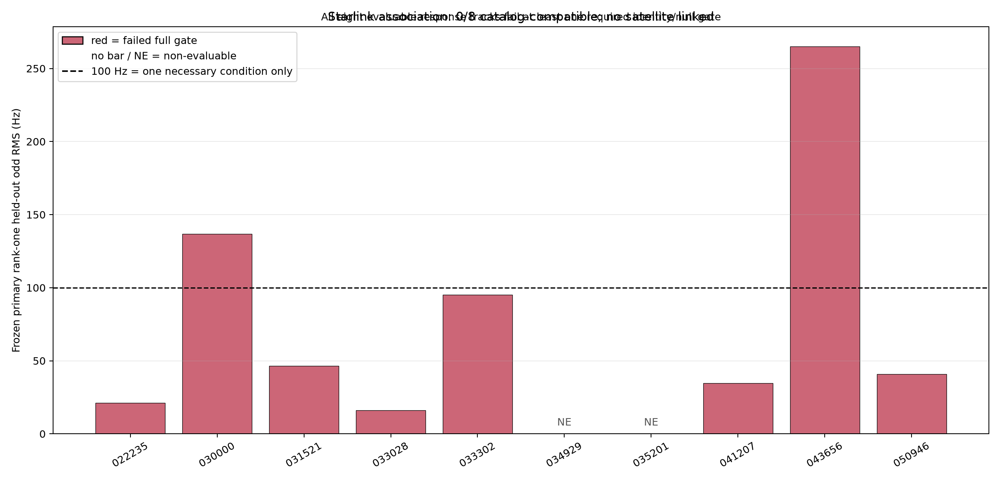
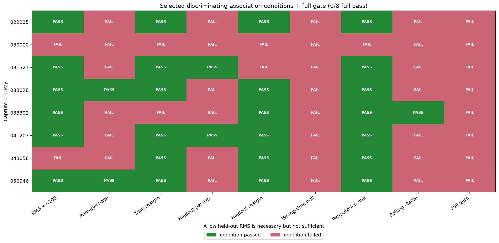

# Final POST-FIX Doppler holdout and Starlink association

## Bottom line

This strictly frozen, downstream-withheld odd-Qin experiment produced a useful
forecasting result but **did not link any capture to a Starlink catalog identity**.
The response track was recoverable in all 8 evaluable captures, yet **0/8 passed the
full catalog-compatibility gate** and 2 additional captures remained non-evaluable.
Absolute secure NORAD identification is **0**, both because no candidate passed and
because the observer site is preset-only rather than capture-bound.

For CFO prediction, fixed 125 ms linear had the lowest equal-capture RMS
(`57.754 Hz`). The strict-past 500 ms quadratic improved the fixed 500 ms linear
baseline from `60.289` to `58.170 Hz`, winning 9/10 paired captures, but its formal
promotion gate **failed**: the ratio was `0.964863` rather than at most
`0.95`, and capture `034929` had only `10` common
accuracy rows out of `112` targets
(`8.93%`), below the
frozen 50% availability floor. The quadratic remains a promising challenger, not a
promoted replacement.

## Scope and conditioning

The cohort is exactly 10 policy-classified **POST_FIX** captures and 5,413 frozen
selector-v2 targets. PRE_FIX, CAPTURE_ONLY, newer, and unlisted captures were
excluded. This separates these results from the historical continuous-recording /
refill-bug data.

The predictors are strict-past: each target uses only history in
`[target - horizon, target)`, and the target frame's numeric even-Qin CFO is never
consumed. Odd-Qin measurements were attached only after prediction and Starlink
rankings were immutable. However, upstream source, alias, trajectory, and epoch
selection may use all-Qin GLRT64 evidence. Results are therefore **conditional on
frozen upstream all-Qin acquisition and conditioning**, not an end-to-end unopened
acquisition test.

The primary error metric is equal-capture RMS on the identical 3,942-row common
eligible odd-Qin mask. Equal-capture RMS weights each capture equally; pooled RMS
weights every retained row equally. Completion is reported on all 5,413 targets.

## Forecast methods

| Method | Equal-capture RMS (Hz) | Pooled RMS (Hz) | Predictions complete | Completion | Common n |
|---|---:|---:|---:|---:|---:|
| Fixed 20 ms linear | 61.747 | 50.266 | 5,286/5,413 | 97.65% | 3,942 |
| Fixed 125 ms linear | 57.754 | 50.315 | 5,399/5,413 | 99.74% | 3,942 |
| Fixed 500 ms linear | 60.289 | 52.766 | 4,148/5,413 | 76.63% | 3,942 |
| Strict-past 500 ms quadratic | 58.170 | 50.968 | 4,136/5,413 | 76.41% | 3,942 |

### Per-capture paired errors

Every RMS below is evaluated on the same per-capture common mask.

| Capture (UTC key) | Targets | Eligible odd | Common n | 20 ms RMS | 125 ms RMS | 500 ms RMS | Quadratic RMS | Quad/500 |
|---|---:|---:|---:|---:|---:|---:|---:|---:|
| `022235` | 911 | 911 | 763 | 33.57 | 29.38 | 29.07 | 29.25 | 1.006 |
| `030000` | 355 | 342 | 225 | 62.87 | 64.09 | 74.21 | 65.21 | 0.879 |
| `031521` | 920 | 920 | 756 | 39.58 | 50.23 | 55.33 | 52.06 | 0.941 |
| `033028` | 918 | 918 | 763 | 29.11 | 26.31 | 26.00 | 25.99 | 0.999 |
| `033302` | 442 | 402 | 254 | 94.43 | 91.06 | 91.65 | 91.56 | 0.999 |
| `034929` | 112 | 54 | 10 | 82.73 | 49.48 | 47.33 | 44.68 | 0.944 |
| `035201` | 324 | 323 | 193 | 53.54 | 54.34 | 59.04 | 58.92 | 0.998 |
| `041207` | 482 | 476 | 359 | 53.84 | 50.04 | 51.62 | 48.73 | 0.944 |
| `043656` | 457 | 421 | 225 | 81.98 | 83.33 | 86.15 | 84.20 | 0.977 |
| `050946` | 492 | 478 | 394 | 48.86 | 45.05 | 45.23 | 45.05 | 0.996 |

### Frozen quadratic promotion gate

| Condition | Frozen requirement | Observed | Result |
|---|---:|---:|---|
| Equal-capture RMS ratio | quadratic / fixed500 <= 0.95 | 0.964863 | fail |
| Capture wins | >= 8 of 10 | 9 of 10 | pass |
| Capture comparisons | exactly 10 | 10 | pass |
| Worst capture ratio | <= 1.10 | 1.006281 | pass |
| Completion difference | <= 1 percentage point | 0.222 pp | pass |
| Per-capture response/common availability | >= 50% | `034929`: 10/112 common | fail |

Formal result: **FAIL / do not promote**. The two recorded failure codes are
`equal_capture_rms_ratio_above_0_95` and
`capture_response_availability_below_50pct`; the gate was not revised after seeing
responses.

## Odd-response denominator

| Capture | Targets | Eligible | Boundary | No support | Missing | Common accuracy |
|---|---:|---:|---:|---:|---:|---:|
| `cap-20260825T022235-0afd1298f096` | 911 | 911 | 0 | 0 | 0 | 763 |
| `cap-20260825T030000-49e936766343` | 355 | 342 | 0 | 13 | 0 | 225 |
| `cap-20260825T031521-ec8adc0e9426` | 920 | 920 | 0 | 0 | 0 | 756 |
| `cap-20260825T033028-374381fbcd3a` | 918 | 918 | 0 | 0 | 0 | 763 |
| `cap-20260825T033302-80fddf217eb5` | 442 | 402 | 0 | 40 | 0 | 254 |
| `cap-20260825T034929-bc0480bdb4a8` | 112 | 54 | 1 | 57 | 0 | 10 |
| `cap-20260825T035201-d0abaead734c` | 324 | 323 | 0 | 1 | 0 | 193 |
| `cap-20260825T041207-a5f08ab5bd42` | 482 | 476 | 0 | 6 | 0 | 359 |
| `cap-20260825T043656-2da9e806d487` | 457 | 421 | 0 | 36 | 0 | 225 |
| `cap-20260825T050946-ab916a6d0eee` | 492 | 478 | 0 | 14 | 0 | 394 |

Global closure: `5413` targets =
`5245` eligible + `1` boundary
+ `167` no-support + `0` missing.
All 5,413 measurements were nonmissing; 3,942 rows formed the four-method common
accuracy mask.

## Starlink association

### What was frozen and fit

The candidate set was Starlink-only and came from the exact causal pre-capture TLE
snapshot. The primary lane was the strict-past quadratic predictor and the mandatory
baseline was fixed 500 ms. The primary nuisance fit used **one constant CFO offset
per capture/path with time delay fixed at tau = 0**. It did not fit candidate-specific
rate, acceleration, sample-clock scale, or delay. Candidate populations, 60/40 time
splits, offsets, wrong-time fields, permutations, rolling origins, UTC/site/TLE
sensitivities, and training rank order were all frozen before odd-Qin access.

`recovered_track` means only that enough held-out odd-response bins existed to score
the frozen trajectory. It is **not an identity claim**. `catalog_compatible` requires
every predeclared identity and null-control gate. A low held-out RMS, including a
value below the 100 Hz ceiling, is only one necessary condition.

### Exact outcome: 8/8 recovered, 0/8 catalog-compatible

The matrix shows selected discriminating conditions plus the full gate. The omitted
conditions—minimum held-out bins, minimum held-out fraction, recovered-track
availability, required permutation scoring, minimum wrong-time scoring, and
UTC/site/predecessor stability—passed for all 8 evaluable captures.

| Aggregate association/control check | Result |
|---|---:|
| Frozen visible-candidate populations | 508, 528, 551, 535, 529, 530, 543, 520 |
| Recovered response tracks | 8/8 |
| Primary/baseline rank-one agreement | 2/8 |
| Training winner remains best held out | 2/8 |
| Wrong-time empirical-p gate passes | 0/8 |
| Permutation empirical-p gate passes | 7/8 |
| At least two rolling origins stable | 1/8 |
| Required permutation family fully scored | 8/8 |
| UTC/site/predecessor controls complete and stable | 8/8 |
| Full catalog-compatibility gate passes | 0/8 |

| Capture | Primary NORAD | Train RMS | Heldout RMS | Baseline NORAD | Base train | Base heldout | IDs agree | Heldout persists | Wrong-time p | Permutation p | Rolling stable | Verdict | Failed required gates |
|---|---:|---:|---:|---:|---:|---:|---|---|---:|---:|---|---|---|
| `022235` | `60734` | 4.04 | 21.03 | `67814` | 3.41 | 12.12 | no | no | 0.439 | 0.048 | no | **FAIL** | primary_baseline_rank_one_agreement heldout_rank_one_remains_best wrong_time_empirical_p at_least_2_rolling_origins_complete_and_stable |
| `030000` | `52618` | 5.84 | 136.83 | `68155` | 3.07 | 101.21 | no | no | 0.634 | 0.190 | no | **FAIL** | absolute_rank_one_heldout_odd_rms primary_baseline_rank_one_agreement training_runner_margin_ratio heldout_rank_one_remains_best heldout_runner_margin_ratio wrong_time_empirical_p permutation_empirical_p at_least_2_rolling_origins_complete_and_stable |
| `031521` | `69310` | 27.49 | 46.43 | `69139` | 24.12 | 201.85 | no | yes | 0.171 | 0.048 | no | **FAIL** | primary_baseline_rank_one_agreement heldout_runner_margin_ratio wrong_time_empirical_p at_least_2_rolling_origins_complete_and_stable |
| `033028` | `55669` | 5.29 | 16.21 | `55669` | 2.15 | 15.37 | yes | no | 0.268 | 0.048 | no | **FAIL** | heldout_rank_one_remains_best wrong_time_empirical_p at_least_2_rolling_origins_complete_and_stable |
| `033302` | `60934` | 20.52 | 95.08 | `68255` | 8.20 | 114.76 | no | no | 0.854 | 0.048 | yes | **FAIL** | primary_baseline_rank_one_agreement training_runner_margin_ratio heldout_rank_one_remains_best wrong_time_empirical_p |
| `041207` | `64858` | 8.76 | 34.57 | `61543` | 5.47 | 35.37 | no | yes | 0.268 | 0.048 | no | **FAIL** | primary_baseline_rank_one_agreement wrong_time_empirical_p at_least_2_rolling_origins_complete_and_stable |
| `043656` | `63556` | 15.08 | 265.20 | `65793` | 9.53 | 67.11 | no | no | 0.902 | 0.048 | no | **FAIL** | absolute_rank_one_heldout_odd_rms primary_baseline_rank_one_agreement heldout_rank_one_remains_best wrong_time_empirical_p at_least_2_rolling_origins_complete_and_stable |
| `050946` | `68276` | 8.94 | 40.94 | `68276` | 3.09 | 38.36 | yes | no | 0.366 | 0.048 | no | **FAIL** | heldout_rank_one_remains_best wrong_time_empirical_p at_least_2_rolling_origins_complete_and_stable |

The two retained non-evaluable captures were not dropped:

| Capture | Status | Frozen reason |
|---|---|---|
| `034929` | retained, not evaluable | insufficient_total_bins, insufficient_training_bins |
| `035201` | retained, not evaluable | insufficient_training_bins |

Across the 8 evaluable captures, primary and baseline selected the same rank-one
candidate in only 2/8, the training rank-one remained best on held-out odd data in
2/8, the wrong-time null passed in 0/8, and at least two rolling origins were stable
in 1/8. Those failures dominate the conclusion: **no satellite was linked**.

### Shared physical-radio rate sensitivity

This diagnostic was frozen before odd responses, fit after candidate ranking, and
was forbidden from changing candidate identity. It estimates one regularized shared
rate departure per physical receive chain plus capture-specific CFO offsets:

| Physical chain | Shared rate departure (Hz/s) |
|---|---:|
| `rx_lnb_a` | -0.1068 |
| `rx_lnb_d` | -4.0188 |
| `rx_lnb_c` | -0.2427 |
| `rx_lnb_b` | -0.3104 |

The diagnostic training RMS was `14.239 Hz` with
a `50.0 Hz/s` zero-centered prior. These small
departures—especially the `-4.0188 Hz/s` value for
`rx_lnb_d`—are repeatability clues only. They are not absolute satellite Doppler-rate
measurements and do not identify LNB, receiver-clock, or sample-clock drift.

## Why no satellite match passed

1. Most short captures admit a low-RMS TLE trajectory after a free CFO offset, but
   wrong-time trajectories often fit comparably; 0/8 passed that null.
2. Candidate identity is model-sensitive: quadratic and fixed500 agree in only 2/8.
3. Future odd-Qin data preserve the training winner in only 2/8.
4. Rolling-origin stability is weak (1/8), so the association is not causally
   persistent.
5. The reviewed site is a preset with 50 m uncertainty and no capture-bound
   boresight; LNB and sample-clock drift remain unmeasured nuisance terms.

## Next experiments most likely to improve genuine matching

1. Open a new, source-supported POST_FIX holdout with longer counter-contiguous
   episodes. Longer arcs should make wrong-time Doppler shapes more distinguishable.
2. Predeclare an association comparison using fixed125 (the best forecast here),
   quadratic, and fixed500 agreement; do not choose the lane after responses.
3. Use simultaneous physical radios/bands with a shared rate and free per-path CFO
   offsets, while keeping identity selection independent of the diagnostic fit.
4. Measure or separately calibrate LNB, receiver, and sample-clock drift. Do not make
   the satellite model absorb those effects.
5. Require recurrence of the same candidate across independent captures and retain
   full wrong-time, permutation, rolling-origin, UTC, site, and predecessor-TLE
   controls.
6. Extend the causal archive to an all-satellite catalog only under a newly frozen
   protocol; a larger catalog without stronger null controls would increase false
   matches rather than confidence.

## Limits and claim language

- This is a retrospective, conditional POST_FIX holdout, not end-to-end unopened
  acquisition.
- The 8 recovered tracks are response-available CFO curves, not satellite IDs.
- No candidate is catalog-compatible; no absolute secure NORAD claim is permitted.
- The primary association fixed delay at tau=0 and fit only constant CFO offset.
- The shared-rate sensitivity is diagnostic and cannot alter rank-one identity.
- Corrected fixed500 interval calibration remains an abstention because its point
  estimator failed the frozen RMSE gate and a finite-sample 95% group quantile was
  unavailable.

## Provenance

- Immutable score: [`2026_08_26_final_doppler_holdout_attempt2-score.json`](figures/2026_08_26_final_doppler_holdout_attempt2-score.json)
- Active v3 protocol: [`final-doppler-holdout-satellite-protocol-v3.json`](../config/analysis/final-doppler-holdout-satellite-protocol-v3.json)
- Response-freeze evidence: [`attach-attempt-2-success-evidence.json`](figures/2026_08_26_final_doppler_holdout_attempt2_odd_attachment/attach-attempt-2-success-evidence.json)
- Superseded report evidence: [`report-attempt-1-evidence.json`](figures/2026_08_26_final_doppler_holdout_attempt2_report/report-attempt-1-evidence.json)
- Superseded report [command log](figures/2026_08_26_final_doppler_holdout_attempt2-report-command-output.log)
- Score SHA-256: `sha256:490f36345fec7d494261d63f3b3cf9581a249bdca46d80c8b9e63baed3471d1f`
- Score semantic digest: `sha256:3316fb28e8bb421d8bfdec00d8598e456e4a6a1d94c61026cf8e5fc51e643c31`
- Prediction ledger digest: `sha256:b6a1db7f3785eac1dd40fa6c75a90e4ced6e36730a0adedd3e7aeeb20feeeca8`
- Odd attachment digest: `sha256:bc6335f92823847099823f0a53bc828f491cc39d14b432ed6ae7f58761b908c9`
- Active v3 protocol digest: `sha256:75b00a3be35d4b00df220062c4451f0f8f70c3f9e88180ea6e3c91908dc3ed65`
- Source score freeze commit: `34860820481487d8dcc64ff47ccbca536f8207fa`
- Publication manifest: [`publication-manifest.json`](figures/2026_08_26_final_doppler_holdout_publication/publication-manifest.json)
- Superseded terse report and ambiguous association figure remain immutable under
  their attempt-1 evidence receipt; this supplement changes presentation only.
