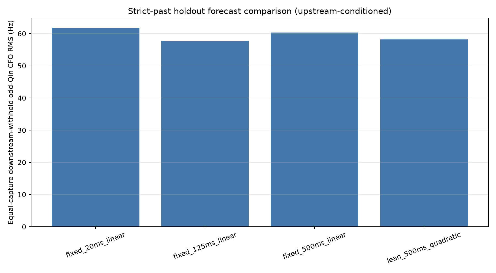
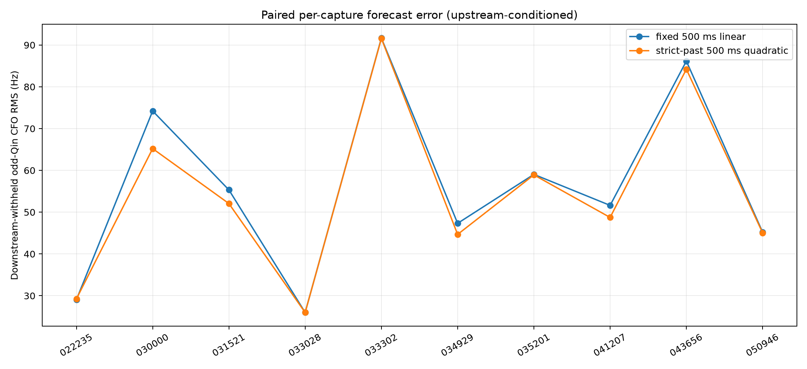
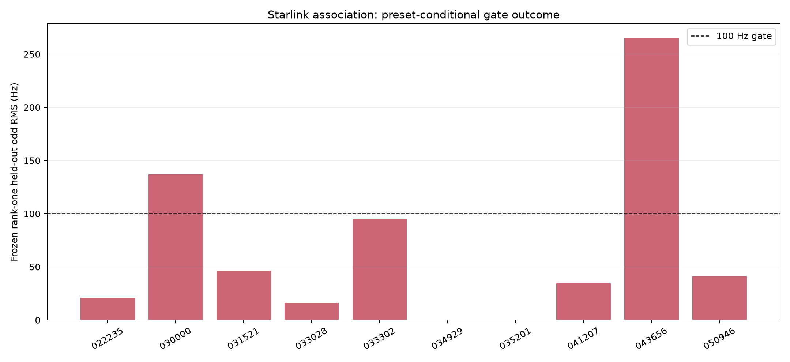

# Final POST-FIX Doppler holdout and Starlink association

This report was generated from the immutable score ledger `2026_08_26_final_doppler_holdout_attempt2-score.json` under
the prospectively frozen protocol `final-doppler-holdout-satellite-protocol-v3.json`. Every one of the 5,413
selector-v2 targets remains in the denominator.

**Conditioning boundary:** the downstream predictor fit and score withheld odd-Qin,
but the frozen upstream Standard source, alias, trajectory, and frame-epoch products
may use all-Qin GLRT64 evidence. Every result here is therefore **conditional on
frozen upstream all-Qin acquisition and conditioning**, not an end-to-end unopened
acquisition result. The primary metric is equal-capture downstream-withheld odd-Qin
CFO RMS on the one common eligible mask.

## Forecast result

- Quadratic promotion gate: **FAIL / ABSTAIN**.
- Equal-capture RMS ratio (quadratic / fixed 500 ms): `0.9648628613705983`.
- Capture wins: `9` of 10; comparisons: `10`.
- Failed conditions: `equal_capture_rms_ratio_above_0_95, capture_response_availability_below_50pct`.

## Response denominator

| Capture | Targets | Eligible | Boundary | No support | Missing | Common accuracy |
|---|---:|---:|---:|---:|---:|---:|
| cap-20260825T022235-0afd1298f096 | 911 | 911 | 0 | 0 | 0 | 763 |
| cap-20260825T030000-49e936766343 | 355 | 342 | 0 | 13 | 0 | 225 |
| cap-20260825T031521-ec8adc0e9426 | 920 | 920 | 0 | 0 | 0 | 756 |
| cap-20260825T033028-374381fbcd3a | 918 | 918 | 0 | 0 | 0 | 763 |
| cap-20260825T033302-80fddf217eb5 | 442 | 402 | 0 | 40 | 0 | 254 |
| cap-20260825T034929-bc0480bdb4a8 | 112 | 54 | 1 | 57 | 0 | 10 |
| cap-20260825T035201-d0abaead734c | 324 | 323 | 0 | 1 | 0 | 193 |
| cap-20260825T041207-a5f08ab5bd42 | 482 | 476 | 0 | 6 | 0 | 359 |
| cap-20260825T043656-2da9e806d487 | 457 | 421 | 0 | 36 | 0 | 225 |
| cap-20260825T050946-ab916a6d0eee | 492 | 478 | 0 | 14 | 0 | 394 |

Global totals: targets `5413`, measured nonmissing
`5413`, eligible `5245`,
boundary `1`, no support `167`, missing
`0`, common accuracy `3942`.

## Starlink association

All candidate identities, constant offsets, controls, and nuisance selections were
frozen before odd-Qin access. The primary lane uses the strict-past quadratic
predictor; fixed 500 ms is the mandatory agreement baseline. Wrong-time,
within-track permutation, rolling-origin, UTC-bound, site, and predecessor-TLE
controls are retained in the score ledger. The observer site is a reviewed preset,
not capture-bound, so absolute secure NORAD identification is forced **false**.

## Interval calibration

The corrected fixed-500 calibration point estimator failed its frozen point-RMSE
gate, and the requested formal 95% group quantile was unavailable. The protocol
therefore carries calibrated intervals only as a fail-closed abstention; no
post-hoc interval claim is made here.

## Provenance

- Score digest: `sha256:3316fb28e8bb421d8bfdec00d8598e456e4a6a1d94c61026cf8e5fc51e643c31`
- Prediction ledger digest: `sha256:b6a1db7f3785eac1dd40fa6c75a90e4ced6e36730a0adedd3e7aeeb20feeeca8`
- Odd attachment digest: `sha256:bc6335f92823847099823f0a53bc828f491cc39d14b432ed6ae7f58761b908c9`
- Absolute secure NORAD: `false`
