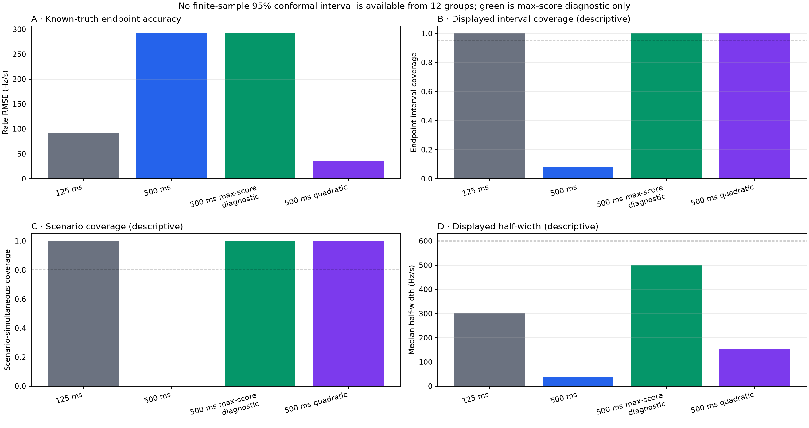
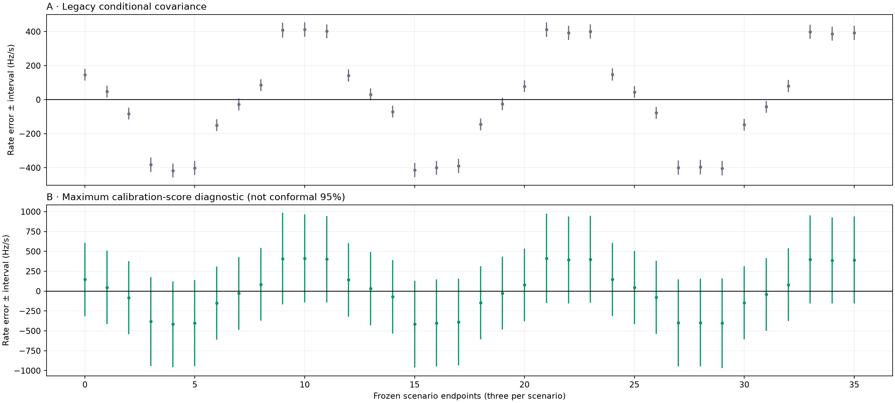
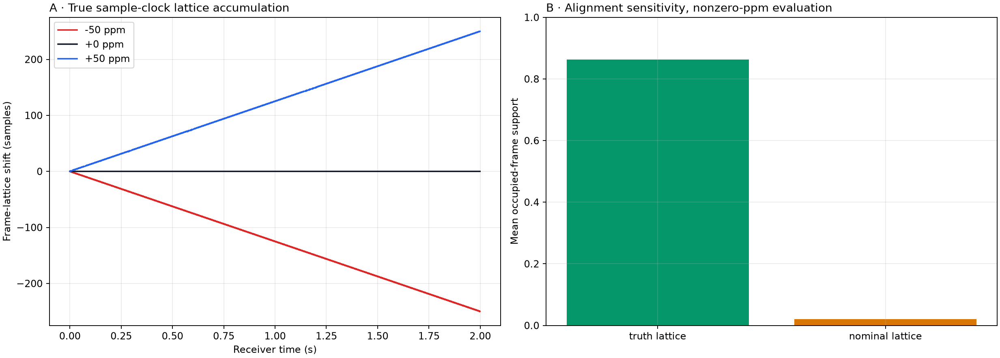
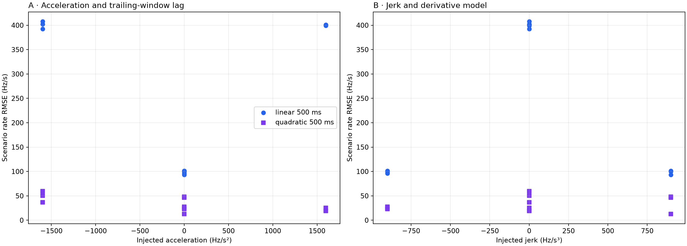

# Fixed-500-ms uncertainty calibration with true sample-clock resampling

Date: 2026-08-26 UTC

Status: **FAIL** for the fixed-500 combined gate; **ABSTAIN_INSUFFICIENT_CALIBRATION_GROUPS** for a finite 95% interval; **PASS** for the corrected strict-past quadratic component gate.

## Bottom line

The fixed-500 result remains **FAIL** (`unchanged_fixed500_point_rmse, finite_sample_95_interval_available`). Its unchanged point estimate has primary RMSE 291.59 Hz/s. A finite-sample 95% grouped interval is **not available**: 12 calibration groups provide orders 1-12, while the requested order is 13. The formal result therefore abstains rather than capping the quantile.

For continuity with the original analysis, the maximum observed calibration score 25.725 is retained only as a descriptive diagnostic. It gives 100.0% observed evaluation scenario coverage and 501.14 Hz/s median half-width. These numbers are not a conformal or distribution-free guarantee. Even under exchangeability, the maximum attainable rank fraction from 12 groups is 92.31%; this deterministic factor-balanced C/E split does not establish exchangeability.

The corrected quadratic uses only supported even-Qin frames strictly before each endpoint and evaluates its derivative at the excluded endpoint time. It has RMSE 35.80 Hz/s, ratio 0.123 to the unchanged line, and passes the original 0.95 threshold. Both newly explicit identity gates pass: identical evaluable scenario IDs and identical complete endpoint IDs.

These are component-test results conditional on truth-quantized carrier acquisition and oracle knowledge of the **resampled** frame lattice. They do not establish satellite acquisition yield or separate LNB/transmitter/sample-clock/geometric nuisances.

## Authority and provenance

The [original preregistration](2026_08_26_fixed500_calibration_preregistration.md) was committed at `8e6e98e4a3824723b04ef3c9bcb92df3080a7336` before the original IQ read. Independent audit then found three claim/implementation defects after all original outcomes were visible. The [post-outcome corrective amendment](../config/analysis/fixed500-calibration-corrective-analysis-amendment-v1.json), committed at `14b76e6be6a6511f6552eec2f44cf143d6f0ac4f`, records that knowledge and froze these repairs before this rerun. This is a transparent correction, **not** an independent preregistered confirmation or a new holdout result.

The rerun inherits the exact three-span bindings from the [original polynomial-injection protocol](../config/analysis/polynomial-phase-injection-protocol-v1.json) and the deny-by-default [dataset policy](../config/analysis/doppler-experiment-dataset-policy-v1.json). No new, newer, PRE-FIX, holdout-foundation, 3/5-MS/s, dynamically discovered, or substituted capture was read. The separate hash-bound [corrective execution authority](../config/analysis/fixed500-calibration-corrective-execution-v1.json) binds the repaired implementation.

All three recording manifests, analysis manifests, compressed chunks, uncompressed chunks, and extracted spans were digest verified before injection. The run retained all 36 scenarios and finished in 258.6 seconds, below the frozen 20-minute bound. Exact implementation, authority, input, and artifact hashes are in [`metrics.json`](figures/2026_08_26_fixed500_calibration/metrics.json). The historical polynomial-injection kernel remains byte-identical to its sealed result.

## Primary evaluation

The primary mask contains 12 smooth strong evaluation scenarios (`SNR ≥ −12 dB`, occupancy ≥0.70), four per background. Each scenario contributes three non-overlapping endpoints; a scenario counts as simultaneously covered only if all three truth rates fall in their intervals.

| Estimator | Scenarios | Bias Hz/s | RMSE Hz/s | Displayed endpoint cov. | Displayed scenario cov. | Median half-width |
|---|---|---|---|---|---|---|
| Fixed 125 ms | 12/12 | -7.85 | 92.71 | 100.0% | 100.0% | 301.42 |
| Unchanged fixed 500 ms | 12/12 | 1.17 | 291.59 | 8.3% | 0.0% | 38.18 |
| Fixed 500 ms + max-score diagnostic | 12/12 | 1.17 | 291.59 | 100.0% | 100.0% | 501.14 |
| Strict-past quadratic 500 ms | 12/12 | -1.51 | 35.80 | 100.0% | 100.0% | 154.55 |

| Background | Evaluable | Fixed500 RMSE Hz/s | Max-score diagnostic coverage |
|---|---|---|---|
| cap-20260825T062228-886fe2dd9cde | 4/4 | 294.38 | 100.0% |
| cap-20260825T105640-facdadeffb3b | 4/4 | 291.69 | 100.0% |
| cap-20260825T111222-a2d4ce2afb9a | 4/4 | 288.68 | 100.0% |

The green row and lower interval panel show the maximum-score diagnostic only. Fixed 125 ms, unchanged fixed 500 ms, and the quadratic retain descriptive legacy conditional covariance. No displayed interval in this report carries a validated 95% marginal or simultaneous coverage guarantee. Point bias and RMSE do not depend on this interval distinction.

## True sample-clock experiment

For nonzero ppm, the complex Qin waveform is interpolated on the scaled physical timebase and physical frame `k` moves to receiver sample `round(Fs × (1+ppm×10⁻⁶) × k/750)`. At ±50 ppm the final two-second frame is shifted by ±250 samples. This is not the earlier phase-coordinate-only warp.

With the true lattice supplied, mean occupied support for nonzero-ppm evaluation rows is 86.3%. Replaying the same resampled waveform on the nominal fixed lattice yields 2.1%. The nominal result is diagnostic only: it measures what a frame-aligner loses if it refuses accumulated delay; it does not enter rate promotion.

## Curvature, nuisance factors, and controls

The strict-past quadratic excludes the current endpoint even-Qin measurement. Odd-Qin CFO and rolled-control responses remain in [`frame-evidence.csv.gz`](figures/2026_08_26_fixed500_calibration/frame-evidence.csv.gz) but cannot affect support, endpoints, model choice, multiplier, or gates. Alias changes are known labels and canonicalized. Every no-result endpoint and frame rejection remains in the ledgers.

| Scope | Fixed 125 ms | Fixed 500 ms | Strict-past quadratic |
|---|---|---|---|
| Primary evaluation: strong, smooth | 12/12; 92.71 | 12/12; 291.59 | 12/12; 35.80 |
| Strong, smooth; both splits | 18/18; 96.98 | 18/18; 298.78 | 18/18; 37.02 |
| All smooth, including weak | 19/24; 270.59 | 24/24; 332.82 | 21/24; 99.17 |
| Mixed pre-step/transition diagnostic | 8/12; 217.90 | 11/12; 322.38 | 10/12; 923.51 |
| Weak -20 dB injection | 3/12; 717.92 | 11/12; 363.29 | 7/12; 789.48 |

The nonzero-step aggregate above is explicitly a **mixed pre-step/transition diagnostic**, not recovery evidence. Applying the frozen 0.5 s exclusion to the 1.1 s step classifies targets 0.5 and 1.0 s as pre-step and 1.5 s as transition/excluded. There is no endpoint after 1.6 s.

| Step stratum | Fixed 125 ms | Fixed 500 ms | Strict-past quadratic |
|---|---|---|---|
| Pre-step (two targets) | 9/12; 210.58 | 11/12; 281.21 | 10/12; 130.95 |
| Transition/excluded (one target) | 10/12; 320.58 | 12/12; 386.98 | 11/12; 1592.35 |
| Post-exclusion recovery | 0/0; — | 0/0; — | 0/0; — |

Accordingly, this experiment supports no claim about post-step recovery. The transition-only quadratic error is expectedly large because a smooth polynomial extrapolator encounters a discontinuity. Any recovery study needs prospectively frozen endpoints after the exclusion window.

This experiment makes sample-clock timing observable only because injected truth supplies the physical clock map. In retrospective satellite data, sample clock, frame epoch, receiver/LNB drift, transmitter drift, and geometric Doppler still require a downstream nuisance model. Neither the descriptive max-score interval nor the quadratic component result is a satellite identity claim.

## Evidence artifacts

- [`frame-evidence.csv.gz`](figures/2026_08_26_fixed500_calibration/frame-evidence.csv.gz): every frame opportunity, parity response, rolled-control margin, and failure reason for oracle and nominal diagnostic alignments.
- [`frame-summary.csv`](figures/2026_08_26_fixed500_calibration/frame-summary.csv): scenario/alignment support and false-support accounting.
- [`endpoint-estimates.csv`](figures/2026_08_26_fixed500_calibration/endpoint-estimates.csv): all frozen endpoints, no-results, truth, errors, intervals, and odd-Qin held-out error.
- [`scenario-metrics.csv`](figures/2026_08_26_fixed500_calibration/scenario-metrics.csv): scenario-equal point and coverage metrics.
- [`calibration-scores.csv`](figures/2026_08_26_fixed500_calibration/calibration-scores.csv): whole-scenario maximum standardized calibration scores.
- [`injection-ledger.csv`](figures/2026_08_26_fixed500_calibration/injection-ledger.csv): clock scale, waveform length, accumulated lattice shift, occupancy, and background provenance.

## Corrective verification receipt

- The corrected component, runner, sealed-result, historical injection, dataset-policy, adaptive-CFO, Qin-pilot, and template suite passed: **88 passed** in 6.34 seconds across 11 focused files.
- Ruff format and lint passed on all five changed Python source/tool/test files. Strict mypy passed on the fixed-500 component and both historical polynomial scientific components. `git diff --check` passed.
- An independent row-level recomputation reproduced primary scenario-equal RMSEs of 92.706500964123, 291.592149528210, and 35.803836678075 Hz/s for fixed 125 ms, fixed 500 ms, and strict-past quadratic. It also reproduced all 12 grouped scores, the descriptive maximum 25.725265440737, required order 13, 90,000 frame rows, 720 endpoint rows, every implementation hash, and every artifact hash.
- All four figures are plain Matplotlib PNGs and were inspected after regeneration. The result test resolves every local report link and verifies image dimensions.

## Decision

The fixed 500-ms line remains a benchmark and remains **FAIL**. The 12-group experiment formally abstains on a finite 95% interval; the max-score display is diagnostic only. The corrected strict-past quadratic passes its component RMSE and identical-ID gates, but because the correction was specified after the original outcomes were known, it remains a promising challenger requiring independently frozen retrospective validation. No result here authorizes production promotion or opening the sealed satellite holdout.
