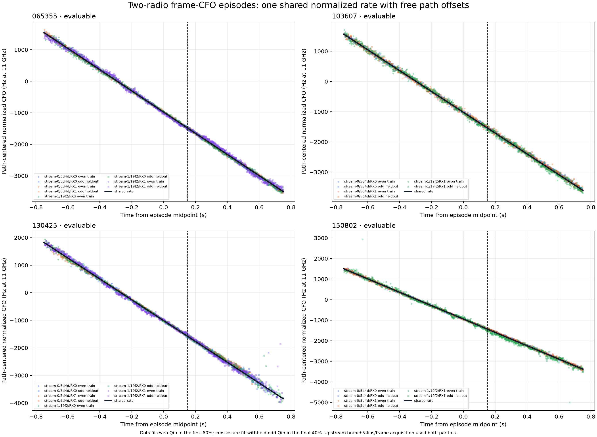
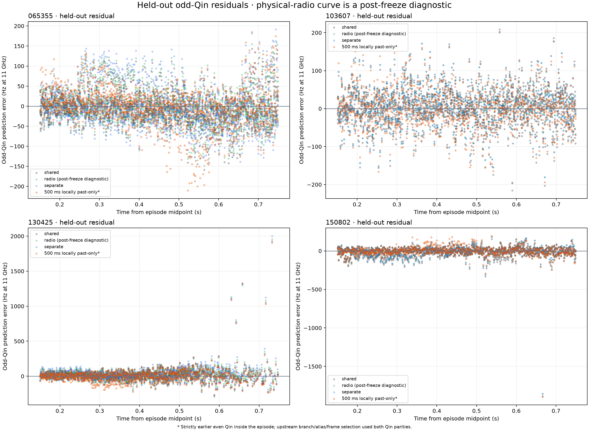

# Multi-radio common CFO-rate experiment on four POST-FIX captures

## Executive result

This bounded experiment finds real, but limited, value in pooling simultaneous
receiver paths into one normalized CFO rate.

- All four frozen captures are **POST-FIX**, device-counter-authoritative, and
  evaluable. No recording was substituted. Fourteen of 15 frozen receiver paths
  passed the response-blind support gates; the unsupported path remains in the
  ledger.
- The shared normalized rates are **-3.362512, -3.447432, -3.778769, and
  -3.256948 kHz/s at 11 GHz** for `065355`, `103607`, `130425`, and `150802`.
- Independent physical-radio rates disagree by **22.25, 33.00, 65.31, and
  40.79 Hz/s**, respectively. These are estimator disagreements, not errors
  against satellite truth.
- Against the task-mandated separate-physical-radio comparator, the post-freeze
  median 50 ms block-bootstrap dispersion is **16.53 Hz/s** for separate radios
  and **8.70 Hz/s** for the shared fit, but sharing
  slightly worsens equal-capture pooled future odd-Qin RMS from **69.05 to
  69.84 Hz**. The prediction ratio is **1.0114**: a 1.14% regression.
- Against the stronger preregistered separate-receiver-path comparator, sharing
  improves pooled RMS from **70.95 to 69.84 Hz** and median slope sigma from
  **9.37 to 8.70 Hz/s**. That meets the frozen `favorable` rule, but the gain is
  modest and capture-dependent.
- The 500 ms path line gives **70.28 Hz** equal-capture pooled RMS on the same
  5,823 targets. It is locally strict-past inside the episode, but conditional
  on noncausal upstream branch/alias/frame selection. No episode-wide model
  dominates it by a large margin.

The opened-cohort calculation gives the shared fit a smaller numerical
block-bootstrap dispersion, so a shared-rate prior remains worth testing. This
is not a material variance-reduction or cross-radio identifiability claim. The
evidence does **not** yet support forcing a single two-radio rate as the best
predictor, nor does it identify the measured slope as calibrated orbital
Doppler. LNB, radio-reference, sample-clock, transmitter, and estimator terms
remain mixed with geometric Doppler.

## Important protocol-correction disclosure

The response-blind
[preregistration](2026_08_25_multi_radio_common_rate_preregistration.md)
correctly froze captures, UTC episodes, paths, branches, aliases, source epochs,
measurement thresholds, parity split, and the primary shared-rate model before
new raw-IQ scoring. It incorrectly described the independent-rate comparator as
one line per **receiver path**. The parent experiment specification required one
line per **physical radio**, with free receiver-path intercepts.

This mismatch was found during the post-score audit. The frozen protocol was
not rewritten and its classification was not allowed to change. The runner now
reports both:

1. the preregistered separate-path result and its frozen classification; and
2. the task-mandated separate-physical-radio result, labeled a
   `post_freeze_protocol_correction_diagnostic`.

The correction changes no capture, byte, frame, alias, support decision,
threshold, train/held-out split, or response mask. It only imposes a common
slope on paths belonging to the same physical Pluto. The second comparison is
therefore useful and mechanically specified, but it is not a response-blind
classification result. A future confirmation must freeze the physical-radio
comparator explicitly before opening responses.

## Data authority: after the refill fix

The parent [dataset policy](2026_08_25_doppler_experiment_dataset_policy.md)
authorizes exactly these four already-opened captures for the `multi_radio`
development role. The
[24-hour POST-FIX retrospective](2026_08_25_post_refill_24h_retrospective/README.md)
established V2 counter authority, exact observed/device sample-span equality,
one continuity segment, and zero gaps, missing samples, overflows, enqueue
failures, or terminal rejections for every stream in this cohort. The old
refill-time-compression mechanism therefore cannot produce the slopes below.

| capture | frozen 1.5 s UTC interval (ns) | relationship | frozen paths | evaluable paths |
|---|---:|---|---:|---:|
| `065355` | `1787640863824860175–1787640865324860175` | same-band | 4 | 4 |
| `103607` | `1787654223218803122–1787654224718803122` | cross-band | 3 | 3 |
| `130425` | `1787663118549042803–1787663120049042803` | cross-band | 4 | 4 |
| `150802` | `1787670489742627359–1787670491242627359` | cross-band | 4 | 3 |

Every actual read used `RecordingStore` verification, an on-disk gap map, and
one verified continuity segment. Recording manifests, analysis manifests,
pilot scans, dealiased banks, and final trajectory banks were rehashed against
the exact SHA-256 values in
[`multi-radio-common-rate-protocol-v1.json`](../config/analysis/multi-radio-common-rate-protocol-v1.json).
A byte or identity mismatch aborts the run; it cannot create a replacement row.

## What was measured

For each exact source-bound branch and alias, the experiment projects its
committed local epoch on the fixed `round(n * 2.5e6 / 750)` frame lattice. Each
opportunity is about 1.333 ms apart. The CFO used below comes from the
split-validation kernel: a 100 Hz coarse likelihood search across the +/-2 kHz
source-bound basin, a 5 Hz fine search within +/-100 Hz of the coarse winner,
three-cell quadratic peak interpolation when the winner is interior, and two
phase-slope refinement iterations. The wrapper also computed 20 Hz likelihood
profiles, but this experiment discarded those profile values; they selected no
support and supplied no CFO used by a fit.

Only even Qin can pass the local support gate or enter a new fit. Odd Qin is a
fit-withheld response on the identical even-selected frame mask. The first 60%
of each 1.5 s absolute-UTC episode supplies even-Qin training; the final 40%
supplies late even-selected membership and, where available, odd-Qin response.
A path needs at least 100 early even-selected training frames and 50 late
even-selected membership frames, and an episode needs two physical radios.

This parity split is local, not end-to-end blind. The committed Standard GLRT64
branch, alias, source epoch, and frame lattice used both Qin parities upstream.
The result measures conditional rate repeatability and future frame-CFO
prediction after acquisition. It does not measure acquisition false alarms or
satellite identity.

Cross-band CFOs are put on one nominal coordinate by multiplying every path by
`11 GHz / nominal sky frequency`, where nominal sky frequency is applied IF
plus the nominal 9.750 GHz LNB LO. This makes geometric Doppler rates
comparable to first order, but it is not calibration. The manifests retain
`uncalibrated_prior` frequency authority.

## Models and identical masks

All robust episode fits use Huber IRLS with tuning constant 1.345, at most 50
iterations, and relative tolerance `1e-10`.

| model | rate parameters | offset parameters | training | response |
|---|---:|---:|---|---|
| shared episode line | 1 per capture | 1 per exact receiver path | first-60% even Qin | final-40% odd Qin |
| physical-radio lines | 1 per physical radio | 1 per exact receiver path | identical | identical |
| receiver-path lines | 1 per receiver path | 1 per receiver path | identical | identical |
| 500 ms local past-only | current path line fit repeatedly | current path intercept | strictly earlier 500 ms even Qin inside the episode | current odd Qin |

No model estimates per-radio acceleration, clock drift, or phase. The shared
model specifically forbids a per-radio slope. Reported bootstrap sigma is the
standard deviation of 500 deterministic 50 ms pairs-block bootstrap replicates.
Because it was calculated after responses were opened, it is a numerical
post-freeze dispersion summary, not calibrated uncertainty or proof of a
material variance reduction.

The 500 ms comparator is locally strict-past only: each target uses earlier
even-Qin frames within the episode. It is still conditional on the upstream
Standard branch, alias, source epoch, and frame lattice, which used both Qin
parities before this experiment. It must not be described as end-to-end causal.

## Support and failure ledger

Every path had 1,124 geometric opportunities. `retention` is the fraction whose
even fold passed the frozen support gate over the full episode. Train and
held-out counts apply the chronological split. Membership uses the late
even-selected count without testing odd-response availability. Every listed
late frame happened to have an odd response in this frozen run, so the count
also equals the available response count; missing responses would remain in a
separate failure ledger rather than remove path membership.

| capture | path | nominal sky (GHz) | retention | even train | odd held out | disposition |
|---|---|---:|---:|---:|---:|---|
| `065355` | `5d4d/RX0` | 11.690313 | 100.0% | 674 | 450 | eligible |
| `065355` | `5d4d/RX1` | 11.690313 | 100.0% | 674 | 450 | eligible |
| `065355` | `19f2/RX0` | 11.690313 | 95.4% | 622 | 450 | eligible |
| `065355` | `19f2/RX1` | 11.690313 | 99.5% | 668 | 450 | eligible |
| `103607` | `5d4d/RX0` | 11.459688 | 100.0% | 675 | 449 | eligible |
| `103607` | `5d4d/RX1` | 11.459688 | 99.4% | 668 | 449 | eligible |
| `103607` | `19f2/RX1` | 11.690313 | 96.8% | 659 | 429 | eligible |
| `130425` | `5d4d/RX0` | 10.959687 | 74.9% | 527 | 315 | eligible |
| `130425` | `5d4d/RX1` | 10.959687 | 79.9% | 625 | 273 | eligible |
| `130425` | `19f2/RX0` | 11.190313 | 94.2% | 651 | 408 | eligible |
| `130425` | `19f2/RX1` | 11.190313 | 96.1% | 674 | 406 | eligible |
| `150802` | `5d4d/RX0` | 10.959687 | 100.0% | 674 | 450 | eligible |
| `150802` | `5d4d/RX1` | 10.959687 | 100.0% | 674 | 450 | eligible |
| `150802` | `19f2/RX1` | 11.440312 | 88.6% | 602 | 394 | eligible |
| `150802` | `19f2/RX0` | 11.440312 | 27.0% | 276 | 28 | **retained, ineligible** |

The rejected `150802/19f2/RX0` path had only 28 late even-selected frames and
missed the frozen 50-frame membership minimum; it was not replaced with another
branch or interval. Across all paths, rejections were only the prespecified
even-coherence, margin, or search-boundary outcomes. There were no device-gap
or missing-odd-response failures.

## Rate estimates

### Shared and physical-radio rates

All values are normalized kHz/s at nominal 11 GHz. `+/-` is one 50 ms
block-bootstrap standard deviation, not a calibrated confidence interval. The
last column is the absolute difference between the two physical-radio slopes.

| capture | shared rate +/- sigma | `19f2` rate +/- sigma | `5d4d` rate +/- sigma | radio disagreement (Hz/s) |
|---|---:|---:|---:|---:|
| `065355` | -3.362512 +/- 0.009767 | -3.376046 +/- 0.023946 | -3.353801 +/- 0.004298 | 22.25 |
| `103607` | -3.447432 +/- 0.006059 | -3.470749 +/- 0.025747 | -3.437753 +/- 0.004894 | 33.00 |
| `130425` | -3.778769 +/- 0.013180 | -3.809829 +/- 0.027749 | -3.744517 +/- 0.009106 | 65.31 |
| `150802` | -3.256948 +/- 0.007639 | -3.290694 +/- 0.031430 | -3.249902 +/- 0.005623 | 40.79 |

The radio disagreements are 0.66%, 0.96%, 1.73%, and 1.25% of the corresponding
shared-rate magnitudes. They are small compared with the approximately
3.3-3.8 kHz/s common slope, but much larger than a few-hertz-per-second
calibration target. The weaker `19f2` fits also have consistently larger
bootstrap sigmas.


The upper panel shows post-freeze block-bootstrap dispersion. Physical-radio
markers and bars are explicitly labeled as post-freeze diagnostics. The lower
panel applies every model to the same fit-withheld odd-Qin masks. The shared
line is not uniformly best: `065355` and `130425` favor it, while `103607` and
`150802` favor separate radio rates.

### Receiver-path diagnostic

The preregistered stronger comparator gives each receiver path its own rate.
It is useful for locating disagreement, although it spends more parameters than
the task-mandated radio comparator.

| capture | path | path rate +/- sigma (kHz/s) | path minus shared (Hz/s) |
|---|---|---:|---:|
| `065355` | `5d4d/RX0` | -3.349782 +/- 0.006363 | +12.73 |
| `065355` | `5d4d/RX1` | -3.357867 +/- 0.004176 | +4.65 |
| `065355` | `19f2/RX0` | -3.342354 +/- 0.011495 | +20.16 |
| `065355` | `19f2/RX1` | -3.404556 +/- 0.047621 | -42.04 |
| `103607` | `5d4d/RX0` | -3.436188 +/- 0.006723 | +11.24 |
| `103607` | `5d4d/RX1` | -3.439769 +/- 0.006764 | +7.66 |
| `103607` | `19f2/RX1` | -3.470749 +/- 0.024541 | -23.32 |
| `130425` | `5d4d/RX0` | -3.764871 +/- 0.013327 | +13.90 |
| `130425` | `5d4d/RX1` | -3.734204 +/- 0.008762 | +44.57 |
| `130425` | `19f2/RX0` | -3.768711 +/- 0.009976 | +10.06 |
| `130425` | `19f2/RX1` | -3.850580 +/- 0.052320 | -71.81 |
| `150802` | `5d4d/RX0` | -3.250139 +/- 0.005168 | +6.81 |
| `150802` | `5d4d/RX1` | -3.249452 +/- 0.008246 | +7.50 |
| `150802` | `19f2/RX1` | -3.290694 +/- 0.029944 | -33.75 |

The maximum path-rate spreads are 62.20, 34.56, 116.38, and 41.24 Hz/s. The
largest disagreements in `065355` and `130425` come from `19f2/RX1`, which also
has the largest uncertainty. This argues against interpreting every individual
path-rate separation as a resolved physical drift.



The constant path offsets have been removed only for display. Dots are even-Qin
training measurements in the first 60%; crosses are odd-Qin responses in the
final 40%. The dashed vertical line is the frozen chronological split. All
panels show the same broad linear motion, with path-dependent scatter and a few
late outliers.

## Future odd-Qin prediction

The table reports RMS in normalized Hz at 11 GHz. All four values within a row
use the same target frames. `path` means the preregistered independent
receiver-path line; `500 ms` is locally strict-past within the episode but
conditional on noncausal upstream selection.

| capture | targets | shared | physical radio | path | 500 ms local past-only* | best |
|---|---:|---:|---:|---:|---:|---|
| `065355` | 1,800 | **41.19** | 42.32 | 47.36 | 46.17 | shared |
| `103607` | 1,327 | 48.91 | 46.58 | **46.55** | 47.69 | path |
| `130425` | 1,402 | **98.50** | 99.72 | 102.75 | 100.45 | shared |
| `150802` | 1,294 | 75.63 | 71.90 | **71.90** | 72.52 | path |
| equal-capture pooled | 5,823 | 69.84 | **69.05** | 70.95 | 70.28 | physical radio |

The pooled ordering is close: only 1.90 Hz separates all four models. Sharing
beats the radio comparator in two captures and loses in two. The shared/radio
pooled ratio is 1.0114, while the shared/path ratio is 0.9843. The result is
therefore a post-freeze block-dispersion/prediction tradeoff, not a clear
model-selection win.

Median absolute errors are much lower than RMS: across captures they are
22.67-35.93 Hz for the shared model and 24.32-36.00 Hz for the physical-radio
model. Rare response outliers inflate RMS, especially in `130425` and `150802`.
For the shared model, `130425` has 14 of 1,402 errors above 200 Hz and five above
500 Hz; `150802` has eight of 1,294 above 200 Hz and one above 500 Hz. The full
residual plot retains rather than clips them.



## What the experiment establishes

1. **A common rate is numerically estimable in all four frozen episodes.** Each
   opened episode yields one robust shared slope after free constant path
   offsets; this is not a physical identifiability claim.
2. **The shared fit has smaller post-freeze block-bootstrap dispersion.** Median
   shared sigma is 8.70 Hz/s versus 16.53 Hz/s for radio-specific slopes, a
   descriptive ratio of 0.527 rather than a material variance claim.
3. **The common-rate approximation is close, not exact.** Radio rates differ by
   22-65 Hz/s inside only 0.9 s of training support.
4. **Prediction does not justify a hard equality constraint.** The radio model
   is 1.14% better in pooled RMS even though the shared fit has smaller
   post-freeze block-bootstrap dispersion.
5. **The 500 ms locally past-only line remains competitive.** Its 70.28 Hz
   pooled RMS lies between the episode models, reinforcing the broader
   [Doppler-method review](2026_08_25_doppler_rate_and_satellite_linking_method_review.md):
   complexity must earn its place on future data.

The practical implication is to test the shared rate as a shrinkage prior or
common-mode state with explicit tolerance, not yet to claim variance reduction
or impose an exact physical constraint. A hierarchical model could estimate one
common rate plus regularized radio deviations; its regularization and
evaluation must be frozen on a new response-blind cohort.

## What it does not establish

- There is no satellite-truth rate, injected truth, or catalogue association in
  this experiment. Every quoted disagreement is internal.
- The source branches were selected as same-emitter evidence by the committed
  retrospective screen. This run does not independently re-prove emitter or
  spacecraft identity.
- Static path intercepts remove only constant CFO. Time-varying LNB or receiver
  drift remains in the slope. The
  [dual-LNB bench report](2026_08_22_dual_lnb_drift_reference.md) shows that
  consumer LNB wander is nonstationary and capture-bound calibration is still
  missing.
- A physical Pluto can expose multiple receiver/RF paths. Sharing its rate does
  not prove those paths share every front-end oscillator term.
- A 1.5 s episode tests a locally linear approximation. It cannot decide when
  Doppler acceleration should enter a longer-arc model.
- Block-bootstrap sigmas are post-freeze numerical dispersion summaries under
  this frozen resampling scheme. They are not full uncertainty intervals or
  material variance claims and do not include acquisition conditioning or
  hardware calibration uncertainty.

## Recommended next experiment

Freeze the exact physical-radio comparator from the outset on a new authorized
cohort, retaining the same parity separation and failure ledger. Compare three
prespecified models: exact shared rate, independent radio rates, and a
hierarchical common rate with one regularized deviation per radio. Report both
response-blind block-bootstrap dispersion and future odd-Qin prediction,
because this experiment shows they can move in opposite directions. If
hardware calibration becomes available, add measured radio/LNB common-mode
covariates without changing the satellite-rate state after responses are
opened.

## Evidence and reproduction

Machine-readable outputs are in
[`reports/figures/2026_08_25_multi_radio_common_rate/`](figures/2026_08_25_multi_radio_common_rate/):

- [`artifact-manifest.json`](figures/2026_08_25_multi_radio_common_rate/artifact-manifest.json)
  contains byte sizes and SHA-256 for every result artifact;
- [`multi-radio-common-rate-evidence.json`](figures/2026_08_25_multi_radio_common_rate/multi-radio-common-rate-evidence.json)
  contains fits, predictions, support/read ledgers, protocol correction, and
  implementation hashes;
- [`frame-measurements.jsonl.gz`](figures/2026_08_25_multi_radio_common_rate/frame-measurements.jsonl.gz)
  preserves every supported and rejected frame opportunity;
- [`rate-summary.csv`](figures/2026_08_25_multi_radio_common_rate/rate-summary.csv)
  is the compact per-path result table.

The response-blind protocol was committed separately as
`a7cc5e755b236c30347aa0765db0a2ade3df27a1`. Reproduce the validated run from
the repository root with:

```bash
PYTHONPATH=src .venv/bin/python tools/experiment_multi_radio_common_rate.py
PYTHONPATH=src .venv/bin/pytest -q \
  tests/analysis/test_multi_radio_common_rate_protocol.py \
  tests/analysis/test_multi_radio_common_rate.py \
  tests/analysis/test_multi_radio_common_rate_tool.py
PYTHONPATH=src .venv/bin/ruff check \
  src/leo/analysis/research/multi_radio_common_rate.py \
  src/leo/analysis/research/multi_radio_common_rate_protocol.py \
  tools/experiment_multi_radio_common_rate.py \
  tests/analysis/test_multi_radio_common_rate.py \
  tests/analysis/test_multi_radio_common_rate_protocol.py \
  tests/analysis/test_multi_radio_common_rate_tool.py
PYTHONPATH=src .venv/bin/mypy \
  src/leo/analysis/research/multi_radio_common_rate.py \
  src/leo/analysis/research/multi_radio_common_rate_protocol.py \
  tools/experiment_multi_radio_common_rate.py
```

The experiment is read-only with respect to `/srv/bulk/leo` and QNAP. It
collects no RF and writes only repository report artifacts.
