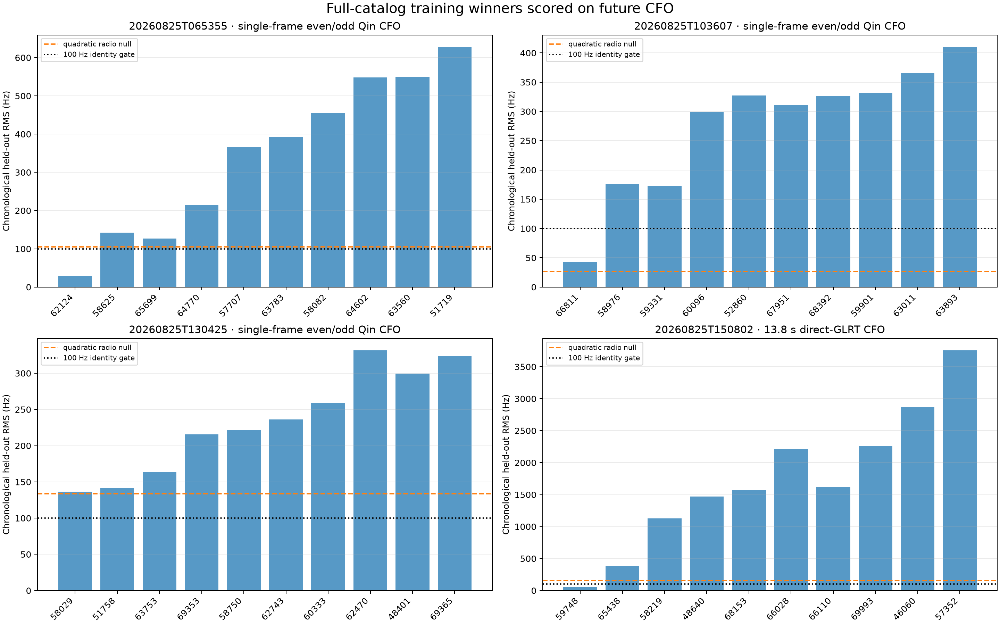
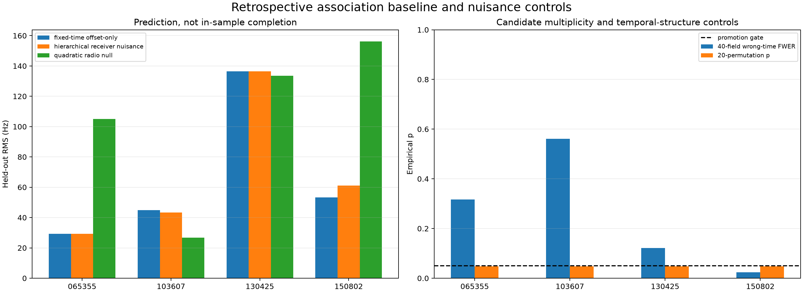

# Retrospective Starlink association with bounded receiver nuisance

Date: 2026-08-26 UTC

## Outcome

The bounded receiver model **did not recover more tracks and did not securely
identify a satellite**. Both the fixed-time/free-offset baseline and the new
hierarchical model produced a finite full-catalog ranking for all four primary
captures. The result remained `4 -> 4` recovered tracks, `0` complete
candidate-evidence passes, and **0 secure NORAD identities**.

The extra receiver-rate terms were small and did not absorb arbitrary orbital
shape, but they did not improve future prediction overall. Equal-capture future
RMS changed from `78.02 Hz` for the baseline to `79.18 Hz` for the hierarchy, a
ratio of `1.0148` (1.48% worse). The hierarchy won two captures by only `1.73`
and `0.07 Hz`, lost one by `0.09 Hz`, and lost the long 150802 arc by `7.81 Hz`.

The useful result is diagnostic rather than identificatory:

- the three frame-local tracks and the long direct-CFO arc all contain smooth,
  catalog-rankable Doppler structure;
- the conditional 150802 winner remains STARLINK-31640 / NORAD 59748 and is the
  only track to pass the full wrong-time matched-field control;
- short 1.5 s arcs remain strongly degenerate across neighboring Starlinks;
- every bounded clock-time sensitivity ended at `+/-0.25 s`; and
- none of the four training winners cleared the preregistered 100 Hz catalog
  runner margin.

These results do not justify attaching a satellite name to any radio track.


## Frozen authority and execution boundary

The experiment was frozen before candidate evaluation in the
[preregistration](2026_08_26_retrospective_satellite_nuisance_preregistration.md)
and its exact
[protocol](../config/analysis/retrospective-satellite-nuisance-protocol-v1.json),
SHA-256
`fb94236e16a638a058aac2a18c4328a6a4ab481514b4bba546de82722893402f`.
It follows the reviewed
[Doppler dataset policy](2026_08_25_doppler_experiment_dataset_policy.md).

Only these previously opened, counter-authoritative POST-FIX captures entered
the primary evaluation:

- `cap-20260825T065355-ba3e4fb8857b`;
- `cap-20260825T103607-9bd90a1a50e4`;
- `cap-20260825T130425-1678069fefd1`; and
- `cap-20260825T150802-473cb5bbcbd6`.

No new RF was collected. No `holdout_foundation` odd-Qin response was opened.
No PRE-FIX, 3/5-MS/s capture-only, newer, unlisted, dynamically discovered, or
in-progress capture was read. The polynomial-injection hard-null backgrounds
were not used as signal data.

This is a mixed-estimator cohort. The first three primaries use 20 ms medians
of single-frame CFO on an even-Qin-selected mask, with future odd-Qin providing
the response. The 150802 primary is the existing 550-row, 13.8 s direct-GLRT
arc; it is not a primary evaluation of the single-frame estimator. All source
branches had already been selected upstream, so even the chronological scores
are development evidence rather than blind acquisition yield.

The preregistered 150802 multi-radio frame bundle remained diagnostic-only. Its
`radio_pluto_19f2/RX0` path had only 21 training and 7 future bins, below the
unchanged 30/20 minima. The first bounded runner attempt stopped at that gate
before publishing artifacts. The corrected runner retained the bundle as
non-evaluable; it did not drop or replace the path, relax a threshold, change a
primary input, or alter an identity gate.

## Exact model and scoring

For each exact receive UTC, the experiment propagated every usable,
altitude-plausible Starlink from the capture-bound pre-measurement TLE snapshot.
Every object above the geometric horizon at any actual measurement time entered
the population: 479, 441, 492, and 561 candidates respectively. “Visible” is
conditional on the reviewed `spinnaker-sausalito` site preset and does not mean
inside the unknown antenna beam. The payload contains Starlinks only, so this
is not an all-satellite search.

The baseline was

\[
y_p(t)=D_j(t)+b_p+\epsilon,
\]

with exact UTC and one training-only constant CFO offset per path. The primary
model was

\[
y_p(t)=D_j(t)+b_p+\delta_{r(p)}(t-t_0)+\epsilon,
\]

where one rate departure was shared by all paths on a physical radio. The rate
prior was `50 Hz/s`, its hard boundary was `+/-150 Hz/s`, and the MAP penalty
used a frozen `50 Hz` measurement scale. No candidate received a free scale,
unregularized slope, curvature term, or primary time shift.

Identity and nuisance terms used only the first 60% of UTC bins. The final 40%
was scored once. Equal-path MSE prevented a dense path from dominating. Three
additional rolling origins tested winner stability. Radio-only linear and
quadratic models tested whether an orbit added information beyond local
curvature. A common `+/-0.25 s` grid was sensitivity-only. Forty full-catalog
wrong-time fields controlled candidate multiplicity (`p_min=1/41`), while 20
within-path permutations tested whether smooth temporal order mattered
(`p_min=1/21`).

## Capture-level results



| Capture | Primary ranked candidate | Candidates | Baseline future RMS | Hierarchy future RMS | Quadratic-null RMS | Hierarchy rates by radio | Wrong-time p | Candidate evidence |
|---|---|---:|---:|---:|---:|---|---:|---|
| 065355 | STARLINK-32608 / 62124 | 479 | 29.19 Hz | 29.28 Hz | 105.03 Hz | +1.23, +0.68 Hz/s | 0.3171 | Fail |
| 103607 | STARLINK-36045 / 66811 | 441 | 44.98 | 43.24 | 26.70 | -2.37, -3.07 | 0.5610 | Fail |
| 130425 | STARLINK-30518 / 58029 | 492 | 136.51 | 136.44 | 133.54 | -2.45, +1.14 | 0.1220 | Fail |
| 150802 | STARLINK-31640 / 59748 | 561 | **53.29** | 61.09 | 156.08 | +3.81 | **0.0244** | Fail |

The baseline and hierarchy selected the same candidate in all four captures.
This is nuisance stability, not identity recurrence: all four winners were
different NORAD objects. The fitted rate departures were only `-3.07` to
`+3.81 Hz/s`, far inside the 150 Hz/s boundary. Thus the hierarchy remained
lean, but its additional freedom was not predictively useful at cohort level.

The 150802 baseline number is the one-way first-60% to final-40% score after the
frozen reduction. It is not numerically identical to the earlier bidirectional
`54.45 Hz` fixed-time score in the
[single-arc TLE report](2026_08_25_150802_visible_starlink_tle_fit.md), although
both select 59748 and support the same conditional-candidate interpretation.



## Why every identity gate failed

| Gate | Captures failing | Interpretation |
|---|---:|---|
| Training runner margin at least 100 Hz | 4/4 | Full-catalog winners were not separated enough on selection data |
| Bounded time interior | 4/4 | Every best sensitivity point was at `+/-0.25 s`; time remained unidentified |
| Wrong-time family-wise p at most 0.05 | 3/4 | Similar or better catalog matches occurred at deliberately wrong fields |
| Beats quadratic null by at least 20 Hz | 2/4 | Short-arc orbital shape often added no information beyond curvature |
| Future RMS at most 100 Hz | 1/4 | 130425 was too noisy/incompatible at 136.44 Hz |
| Future runner margin at least 50 Hz | 1/4 | 130425's future runner gap was only 4.98 Hz |
| Same winner in all rolling origins | 1/4 | 130425 first selected 63753 before settling on 58029 |

All four tracks passed the within-path permutation control at its minimum
`1/21` value. That says chronological CFO structure is real and smooth; it does
not establish which orbit produced it. Three tracks retained one candidate in
all rolling fits, but neither fact repairs catalog/time multiplicity.

Runner margins were `26.52`, `39.04`, `0.30`, and `34.43 Hz`, all far below the
100 Hz gate. The first three wrong-time p-values were `0.317`, `0.561`, and
`0.122`. NORAD 59748 alone reached `1/41`, but its best bounded-time point was
the `-0.25 s` edge and its runner margin still failed. It remains the leading
conditional 150802 candidate, consistent with the earlier
[identity recovery audit](2026_08_25_satellite_identity_recovery_v2.md), not a
secure association.

## Mandatory 150802 TLE-source sensitivity

The durable 13:37 QNAP snapshot `ac79e846...` was the frozen primary source,
but it was not the latest causal source. The mandatory sensitivity used the
14:02 `9bb59fcf...` snapshot established on main. The two catalogs changed only
NORAD 47657, which was outside the 561-object visible population.

The exact visible population, all 561 candidate rankings, every penalized
training RMS, every held-out RMS, and the 59748 winner were byte-numerically
identical: both reported maximum metric difference `0.0 Hz`. The source gate
therefore passed without describing the older snapshot as latest.

## What improved Doppler did and did not buy

Compared with older multi-kHz trajectory association, the frame-local evidence
now gives tens-of-Hz future errors for 065355 and 103607 and cleanly rejects
many catalog neighbors. That is a real improvement in track precision. It is
also why all four fixed-time rankings were recoverable.

It did not create new secure identities because precision is only one part of
association:

1. A 1.5 s LEO arc is almost affine. Hundreds of 750 Hz frames reduce noise but
   do not create enough independent curvature to separate a crowded Starlink
   field.
2. Receiver-rate freedom was not the main blocker. The fitted departures were
   tiny, and the hierarchy's equal-capture future RMS was slightly worse.
3. Exact UTC still leaves a catalog/time degeneracy. All bounded sensitivity
   profiles wanted more time range, which correctly fails closed instead of
   being interpreted as a clock estimate.
4. The four leading catalog numbers did not recur across captures.
5. Smoothness controls validate a moving signal, not a unique satellite name.

The new model should therefore remain a diagnostic option rather than replace
the fixed-time/free-offset association baseline.

## Next experiments most likely to improve matching

The evidence points away from adding more nuisance parameters. The useful next
steps are:

1. Feed the calibrated fixed-500 estimator into the same runner through its
   measurement adapter, preserving every identity gate, and compare only on
   longer already-opened arcs.
2. Build counter-contiguous tracks of at least 10–20 s across multiple physical
   radios. Duration creates orbital curvature; denser frames alone do not.
3. Treat the small per-radio rate term as a soft prior learned across captures,
   not a candidate-specific escape parameter.
4. Add capture-bound observer position, antenna pointing, and clock/frequency
   telemetry when available; these remove nuisance freedom without fitting it
   against each candidate.
5. Require recurrence across separated passes before promoting a NORAD. The
   present result has four distinct winners and therefore provides no recurrence
   evidence.
6. Preserve the catalog-wide wrong-time field test. It is the control that most
   clearly separates a smooth CFO curve from a time-specific orbital identity.

This conclusion agrees with the broader
[Doppler campaign synthesis](2026_08_26_doppler_rate_experiment_campaign.md):
better rate estimation is necessary, but longer independent geometry and
measured receiver authority are still required for secure satellite naming.

## Reproduction and artifacts

The bounded runner is
[`experiment_retrospective_satellite_nuisance.py`](../tools/experiment_retrospective_satellite_nuisance.py),
with pure nuisance fitting in
[`satellite_nuisance_association.py`](../src/leo/analysis/research/satellite_nuisance_association.py).
Run from the repository root with the exact frozen local TLE paths available:

```bash
uv run python tools/experiment_retrospective_satellite_nuisance.py
```

Machine evidence is in
[`retrospective-satellite-nuisance-evidence.json`](figures/2026_08_26_retrospective_satellite_nuisance/retrospective-satellite-nuisance-evidence.json),
and byte receipts are in the
[`artifact manifest`](figures/2026_08_26_retrospective_satellite_nuisance/artifact-manifest.json).
All visualizations are static Matplotlib PNGs.
