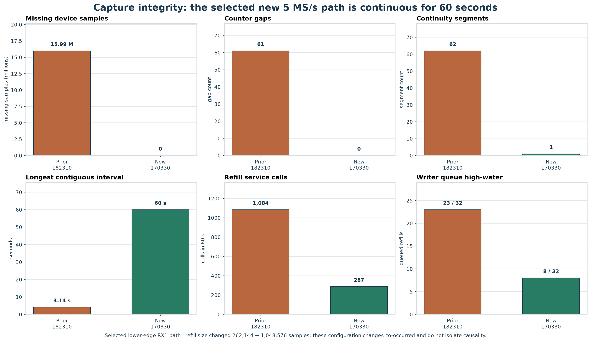
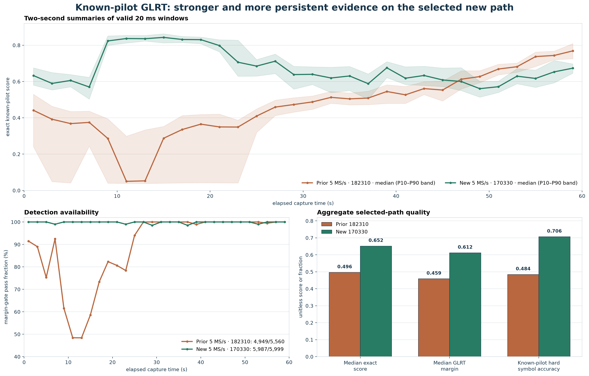
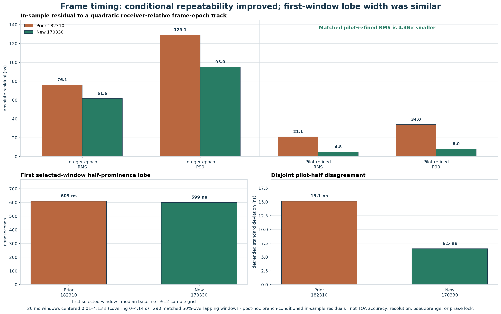
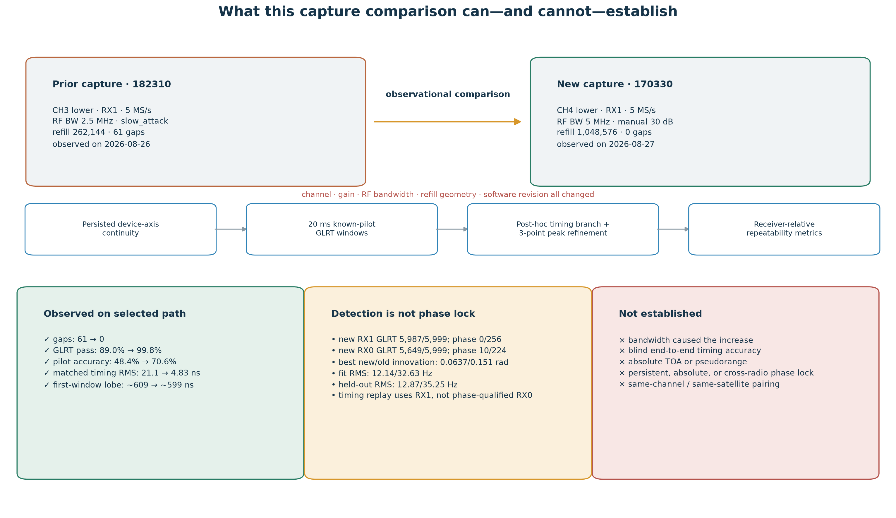

# Capture quality and receiver-relative frame timing in `cap-20260827T170330-a555a5cf5306`

**Report date:** 2026-08-27<br>
**Capture:** `cap-20260827T170330-a555a5cf5306`<br>
**Standard run:** `native-capture-a3a6f5f2e91a4f9597eb5d8b9efb276c`<br>
**Pipeline release:** `5400c930059c0aa1a8aeb409593220b5801ca107`<br>
**Timing comparator:** `cap-20260826T182310-f2c5b2a92b71`<br>
**Disposition:** the transport result is unambiguously better, and the CH4-lower/RX1 signal supports a much more repeatable conditional timing lock. The experiment does not isolate the cause of the RF improvement and does not measure absolute TOA.

## Executive result

The new dual-radio, dual-receiver 5 MS/s recording is complete: each radio delivered all 300,000,000 requested samples as one 60-second continuity segment with no missing samples, zero fills, overflows, manifest-declared clipping, constant-IQ refills, or enqueue failures. The previous lower-edge 5 MS/s comparator lost 15,990,784 samples in 61 gaps and was split into 62 segments. With the refill increased from 262,144 to 1,048,576 samples, four kernel buffers, and a 32-refill host queue, the compared stream used 287 refill calls instead of 1,084 and reached a queue high-water of 8 instead of 23. Continuity is the clearest engineering gain.

Signal quality improved strongly on `stream-1/RX1`, the CH4-lower path. Its 20 ms exact-Qin GLRT passed 5,987 of 5,999 windows (99.80%), its median passing exact score was 0.652, and its known-pilot hard-symbol accuracy was 70.65%. The previous CH3-lower/RX1 path passed 4,949 of 5,560 valid windows (89.01%), with median passing exact score 0.496 and 48.44% hard-symbol accuracy.

The timing replay also found materially better **receiver-relative repeatability**. On 290 matched, post-hoc branch-conditioned opportunities in the first 4.14 seconds, all 300 known pilot symbols gave 4.83 ns RMS and 8.03 ns 90th-percentile residual after a quadratic trend, versus 21.07 ns and 33.98 ns for the older capture. This is a 4.36-fold reduction in RMS residual. It is not a 4.83 ns absolute TOA measurement: no transmitted frame timestamp, calibrated receiver delay, blind branch decision, satellite identity, or pseudorange truth was available.

Carrier-phase qualification selected a different path. The strong lower/RX1 GLRT and timing path produced no phase-qualified 75 ms segment, while lower/RX0 produced 10. Its best local segment had 0.0637 rad phase-innovation RMS and 12.14/12.87 Hz fit/held-out frequency RMS. A good timing likelihood is therefore not automatically a good carrier-phase track.

The improvement is not uniform across the capture. Both CH2-upper paths were weak, passing only 5.50% and 9.03% of their GLRT windows. In addition, the new lower path changed channel, analog bandwidth, gain mode, and observation time relative to the comparator. The data therefore support “this CH4-lower observation was cleaner,” but not “5 MHz analog bandwidth caused the improvement.”

## Introduction and motivation

The practical question is whether a continuous 5 MS/s edge recording can lock Starlink frame timing more reliably and move toward the maximum-likelihood time-of-arrival (TOA) processing described by Wenkai Qin, Zacharias M. Komodromos, Samuel C. Morgan, and Todd E. Humphreys in *Maximum Likelihood Time of Arrival and Doppler Estimation for Precise Starlink-Based PNT*.

Qin et al., in a preprint of 2025 IEEE/ION PLANS, captured at 250 MS/s with roughly 200 MHz usable bandwidth, resampled to 240 MHz, and modeled 1,024 subcarriers across the 240 MHz Starlink channel. Their Table II reports post-fit timing RMSE of 2.090 ns for pilot CAF, 1.629 ns for pilot-only ML, and 1.626 ns for full-frame ML. The full-frame payload treatment therefore adds almost no timing gain over pilot-only ML in that experiment; its dramatic gain is Doppler, from 752.43 Hz to 6.34 Hz.

This repository observes eight known edge-pilot subcarriers: seven intervals at 234.375 kHz span only 1.640625 MHz. Sampling those pilots at 5 MS/s provides a 200 ns sample grid and enables fractional peak interpolation, but it does not create the paper's wide physical timing bandwidth. The immediate goal is therefore narrower:

1. preserve an uninterrupted FPGA device-sample axis;
2. obtain an unambiguous known-pilot frame branch often enough to track it;
3. refine the integer frame epoch below one sample; and
4. quantify conditional receiver-relative timing repeatability without calling it absolute TOA.

This distinction matters for engineering decisions. A cleaner narrowband lock is useful for frame scheduling, coherent integration inside a frame, CFO/Doppler estimation, and future retune experiments. Absolute navigation TOA additionally requires a known transmit-time convention, calibrated RF/baseband group delay, a suitable clock model, and enough waveform bandwidth to resolve delay sharply.

## Capture design and settings

The recording contains two independently tuned Pluto+ radios. Both sampled two receivers at 5 MS/s for 60 seconds with a 5 MHz analog bandwidth, but they did **not** observe the two edges of one channel.

| Stream | Radio | Tuning | Applied IF | Gain | Samples | Continuity |
|---|---|---|---:|---|---:|---|
| `stream-0` | `radio_pluto_5d4d` | CH2 upper | 1,440,312,500 Hz | slow attack | 300,000,000 | one segment, no loss |
| `stream-1` | `radio_pluto_19f2` | CH4 lower | 1,709,687,500 Hz | manual 30 dB on RX0/RX1 | 300,000,000 | one segment, no loss |

Common capture parameters were:

| Parameter | Value |
|---|---:|
| Sample rate | 5,000,000 complex samples/s |
| Analog RF bandwidth | 5,000,000 Hz |
| Duration | 60 s |
| Receivers per radio | 2 |
| Refill size | 1,048,576 samples |
| Kernel buffers | 4 |
| Host queue | 32 refills |
| Storage | CI16, Zstandard level 3, device-axis layout |
| Synchronization mode | best effort |
| Estimated radio start skew | 171.055 ms |
| Start-skew uncertainty | 2.041 ms |
| Guaranteed overlap | 59.828 s |
| Cross-radio phase coherent | no |

The Standard analysis completed successfully as 12 jobs and 98 products. All four receiver paths were analyzed over their complete 60-second device axes.

## Methods and frozen hyperparameters

### Continuity audit

The capture manifest is authoritative for logical, observed, missing, and zero-filled sample counts. A stream is called lossless here only when the device-counter span, logical count, and observed count are all 300,000,000; the gap count is zero; the segment count is one; and no terminal or refill fault is declared.

### Exact-pilot GLRT and known-pilot QAM

The production GLRT evaluates 20 ms raw-IQ windows every 10 ms. It jointly acquires frame epoch and CFO using the known Qin edge-pilot structure. An identically processed symbol-rolled template is the control; a window passes when

```text
exact known-pilot score - rolled-control score >= 0.025.
```

There are 5,999 scheduled windows in a lossless 60-second stream. Median scores below are calculated over passing windows. The QAM statistic is also restricted to known edge-pilot states and symbols: it reports hard decisions over those known pilots, not PSS/SSS or decoded payload data.

### Exploratory Qin-like timing replay

The timing replay deliberately uses the strongest lower-edge RX1 path from each capture. To make the old gapped recording comparable, the interval is restricted to 20 ms windows centered from 0.01 through 4.13 seconds; windows advance by 10 ms and therefore overlap by 50%. Its normalized score noncoherently averages per-frame correlation magnitudes against a template containing only the eight published edge pilots in symbols 2 through 301. It does not process the 240 MHz payload, apply Qin's unknown-data full-frame ML likelihood, use PSS/SSS ML, or preserve carrier phase between windows.

For every GLRT-passing window on a selected folded-frame branch, the replay:

1. takes the persisted integer epoch and acquired CFO;
2. scores offsets from -3 through +3 samples with the exact lower-edge pilot template;
3. refines the largest score with a three-point parabola, limited to one-half sample around that discrete maximum;
4. repeats the estimate with the even acquisition symbols, odd verification symbols, and all 300 known symbols on eight tones; and
5. folds the epoch modulo the 750 Hz frame period and fits a degree-two timing trajectory versus elapsed receiver time.

If \(\tilde{\tau}_i\) is the locally refined epoch, the reported value is the residual from

\[
\tilde{\tau}_i = a + b t_i + c t_i^2 + \epsilon_i.
\]

The RMS, median, and P90 statistics describe \(\epsilon_i\), not error from a known transmitted frame time. Branch intervals were selected post hoc (`1500–2500` folded samples for the old capture and `2100–2500` for the new capture), and two branch windows per case that crossed compressed-chunk boundaries were excluded. The same pilot-score evidence contributes to GLRT passing, branch retention, and timing refinement, so the matched ratio is outcome-conditioned rather than an independent validation score. Raw compressed and decompressed bytes used by the replay are checked against the capture manifest's SHA-256 digests.

The reported lobe width is also local and conditional: it is the interpolated half-prominence width in the first selected window, relative to the median score on a ±12-sample offset grid. It is not a calibrated, capture-wide delay-resolution measurement.

## Results

### Transport and continuity



*Figure 1. Both new 5 MS/s streams are gap-free. The comparison shown for the old recording is its lower-edge `stream-1`, the path used in the timing replay.*

| Lower-edge stream metric | Previous 5 MS/s | New 5 MS/s |
|---|---:|---:|
| Logical samples | 300,000,000 | 300,000,000 |
| Observed samples | 284,009,216 | **300,000,000** |
| Missing samples | 15,990,784 | **0** |
| Gaps | 61 | **0** |
| Continuity segments | 62 | **1** |
| Refill samples | 262,144 | 1,048,576 |
| Refill calls | 1,084 | **287** |
| Queue high-water | 23/32 | **8/32** |
| Longest initial continuous interval | 4.142 s | **60.000 s** |

The new recording removes every gap-driven reacquisition boundary. The result is consistent with the larger refill materially reducing host/refill pressure for this 5 MS/s load. It is not a randomized buffer-size experiment and does not establish that the refill change alone caused the improvement or that the exact configuration will remain lossless under every host workload. Continuity counters must remain part of every capture's acceptance test.

### RF, GLRT, and known-pilot QAM quality



*Figure 2. The selected CH4-lower/RX1 path has stronger and more persistent exact-pilot evidence than the selected older comparator. This is an observational comparison across changed channel, gain, bandwidth, and software conditions.*

| New path | GLRT passes | Pass rate | Median passing exact score | Median passing margin | Known-pilot hard accuracy | Known-pilot RMS EVM |
|---|---:|---:|---:|---:|---:|---:|
| CH4 lower RX1 | 5,987/5,999 | **99.80%** | **0.652** | **0.612** | **70.65%** | **4.54** |
| CH4 lower RX0 | 5,649/5,999 | 94.17% | 0.401 | 0.359 | 35.39% | 26.66 |
| CH2 upper RX1 | 542/5,999 | 9.03% | 0.247 | 0.208 | 27.76% | 35.29 |
| CH2 upper RX0 | 330/5,999 | 5.50% | 0.222 | 0.185 | 27.35% | 32.64 |

For the strongest lower/RX1 path, the old-to-new comparison is:

| Metric | Previous CH3 lower | New CH4 lower | Change |
|---|---:|---:|---:|
| Valid GLRT pass rate | 89.01% | **99.80%** | +10.79 percentage points |
| Median passing exact score | 0.496 | **0.652** | +31% |
| Median passing margin | 0.459 | **0.612** | +33% |
| Known-pilot hard accuracy | 48.44% | **70.65%** | +22.21 percentage points |
| Known-pilot RMS EVM | 13.79 | **4.54** | 67% lower |

The old GLRT scheduled the same 5,999 windows, but 439 were gap-excluded, leaving 5,560 valid windows. Its known-pilot QAM aggregate contains 2,221 valid results and 179 gap-excluded opportunities, versus all 2,400 valid results in the new capture. These full-capture QAM aggregates are not matched-support statistics.

The metrics agree that the new lower/RX1 signal is easier to recognize and demodulate. They cannot assign causality to analog bandwidth: the comparison changes CH3 to CH4, slow-attack AGC to manual 30 dB, observation epoch, signal geometry, and potentially the serving beam/satellite.

### Receiver-relative frame-timing repeatability



*Figure 3. Residuals are measured after a post-hoc branch choice and quadratic receiver-time fit. The matched result uses the same 290 opportunity indexes and elapsed-time support in both captures.*

| Timing statistic | Previous lower/RX1 | New lower/RX1 | Interpretation |
|---|---:|---:|---|
| Integer epoch RMS | 76.14 ns | **61.63 ns** | persisted sample-grid epoch consistency |
| Integer epoch P90 absolute | 129.14 ns | **95.02 ns** | persisted sample-grid epoch consistency |
| Matched all-pilot refined RMS | 21.07 ns | **4.83 ns** | conditional trend residual; 4.36x smaller |
| Matched all-pilot refined median absolute | 16.77 ns | **3.16 ns** | conditional trend residual |
| Matched all-pilot refined P90 absolute | 33.98 ns | **8.03 ns** | conditional trend residual |
| Even/odd pilot-half difference, standard deviation | 15.12 ns | **6.51 ns** | internal split-pilot agreement |
| Even/odd pilot-half difference, P90 absolute | 25.18 ns | **11.03 ns** | internal split-pilot agreement |
| First-window correlation-lobe width | 608.95 ns | 598.94 ns | essentially unchanged broad delay peak |
| First-window best/far epoch score ratio | 1.107 | 1.122 | only modest blind epoch specificity |

The most encouraging result is the agreement of the two disjoint pilot halves and the much smaller all-pilot residual. The caution is equally important: the approximately 600 ns first-selected-window lobe can have a repeatably interpolated center at a few nanoseconds when SNR is high. That repeatability does not prove that the center is unbiased or tied to absolute transmit time. Its nearly unchanged local width is consistent with the estimator still using only the same 1.640625 MHz pilot span after the Pluto analog bandwidth changed from 2.5 to 5 MHz.

### Persisted local carrier-phase qualification

The Standard pipeline independently tests 75 ms known-pilot carrier segments with piecewise modulo-\(\pi\) phase and independent phase reacquisition. A segment must retain at least 75% of its expected frames, avoid a supported-frame gap above 4.1 ms, and satisfy the persisted frequency fit and held-out gates. The product explicitly declares `absolute_carrier_phase_resolved=false`; qualification means a useful **local** phase/frequency track, not a global carrier-phase reference.

Phase availability differs from GLRT and timing quality:

| Capture path | Phase-qualified / analyzed 75 ms segments | Meaning |
|---|---:|---|
| New CH4 lower RX1 | **0/256** | strongest GLRT and timing path, but no qualified local phase segment |
| New CH4 lower RX0 | **10/224** | companion receiver supplies the qualified local phase evidence |
| Previous CH3 lower RX1 | **0/246** | direct timing-comparator path also has no qualified phase segment |
| Previous best across all paths, CH3 upper RX1 | 12/747 | different edge, radio, and path; descriptive reference only |

The strongest zero-ambiguity-transition segment in the new lower/RX0 path is better than the best such segment across the older capture's four paths:

| Local phase metric | Previous best, CH3 upper RX1 | New best, CH4 lower RX0 |
|---|---:|---:|
| Segment interval | 2.950–3.025 s | 41.750–41.825 s |
| Supported / lattice frames | 55/55 | 55/55 |
| Phase updates | 48 | 44 |
| Phase-ambiguity transitions | 0 | 0 |
| Phase-innovation RMS | 0.1511 rad | **0.0637 rad** |
| Frequency-line fit RMS | 32.63 Hz | **12.14 Hz** |
| Held-out frequency RMS | 35.25 Hz | **12.87 Hz** |

This is encouraging local carrier evidence, but it is an across-path, across-channel, post-selected comparison. The important system result is the path split: lower/RX1 maximizes detection and timing repeatability, while lower/RX0 supplies the best phase segment. Frame timing, GLRT strength, hard-symbol accuracy, and phase tracking must remain separate quality axes.

## Phase lock, frame lock, and absolute TOA are different claims



*Figure 4. The experiment reaches a receiver-local frame timing track, while local phase qualification selects a different receiver. Neither result crosses the calibration and synchronization boundary required for absolute TOA, persistent absolute phase, or coherent upper/lower synthesis.*

The FPGA device-sample counter solves an important bookkeeping problem: inside one radio, every received IQ sample has a monotonic position, and a loss event can be represented explicitly rather than silently shortening time. It does not preserve RF carrier phase through a retune, synchronize two independent radios, or reveal when the satellite transmitted a frame.

This recording's radios began approximately 171 ms apart and the manifest explicitly declares `phase_coherent=false`. More fundamentally, `stream-0` observed CH2 upper while `stream-1` observed CH4 lower. Subtracting, correlating, or coherently combining these streams would therefore mix different channels, radio clocks, local oscillators, gain modes, and unknown signal sources. This capture is not an upper/lower synthetic-bandwidth experiment.

The supported timing claim is:

> Given a GLRT-passing lower-edge window, an acquired CFO, a post-hoc selected frame branch, and a quadratic receiver-time trajectory, the new CH4-lower/RX1 pilot peak is substantially more repeatable than the chosen older CH3-lower/RX1 comparator.

The following are not measured:

- blind probability of choosing the correct frame branch;
- absolute TOA bias or accuracy;
- Starlink transmit time or pseudorange;
- calibrated antenna, LNB, RF filter, ADC, and DSP group delay;
- absolute carrier phase or continuity across independently reacquired 75 ms segments, radios, or retunes;
- same-satellite or same-beam identity; and
- coherent delay information spanning the full Starlink channel.

## Limitations and claim boundary

1. **The comparison is observational, not controlled.** Channel, edge epoch, gain mode, analog bandwidth, software revision, and propagation conditions changed together.
2. **The best path was selected after inspecting quality.** CH4-lower/RX1 is not a preregistered random sample of future captures.
3. **Timing branch selection is post hoc.** The folded-epoch intervals differ between captures, and the replay does not score blind branch error.
4. **Matched opportunities are outcome-conditioned.** The 290 indexes are the intersection that survived both captures' pass, branch, and chunk-support filters; the comparison is descriptive rather than a causal or population estimate.
5. **Windows overlap by 50%.** The 290 matched residuals are not 290 independent trials.
6. **The trajectory is fit and scored on the same interval.** Residuals quantify in-sample smoothness; they are not held-out prediction errors.
7. **Subsample interpolation is model dependent.** A three-point parabola can locate a broad peak consistently while retaining unknown waveform, multipath, filtering, and hardware biases.
8. **Only known edge pilots are used.** This is not Qin's wideband full-frame payload ML estimator, despite borrowing its joint timing/CFO motivation.
9. **The upper stream is neither matched nor strong.** CH2 upper and CH4 lower cannot be fused into a same-channel edge-difference result.

## Conclusions

`cap-20260827T170330-a555a5cf5306` is a major transport-quality improvement over the earlier degraded 5 MS/s attempt: both radios delivered complete 60-second device axes without a single missing sample. It also contains an excellent CH4-lower/RX1 observation, with nearly universal exact-pilot GLRT support and substantially better known-pilot decisions.

The capture supports a useful receiver-local timing result. Conditional fractional timing residuals fall from 21.07 ns to 4.83 ns RMS on matched opportunities, and the disjoint pilot halves agree more closely. This makes the data promising for frame scheduling and narrowband tracking experiments.

Carrier tracking gives a complementary result rather than a universal improvement: lower/RX1 has the best GLRT/timing evidence but no phase-qualified segment, whereas lower/RX0 has 10 qualified local segments and one especially clean zero-transition interval. Future capture scoring should retain separate detection, timing, symbol, and phase metrics instead of selecting one receiver by a single aggregate score.

It does not yet demonstrate Qin-level absolute TOA. The evaluated first-window half-prominence lobe remains about 600 ns wide, blind epoch specificity is modest, and every few-nanosecond number in this report is a trend residual after post-hoc conditioning. The correct summary is **better lock repeatability, not measured navigation-grade TOA accuracy**.

## Next controlled experiment

The next capture pair should change one variable at a time:

1. hold sample rate at 5 MS/s, refill at 1,048,576 samples, kernel buffers at four, queue at 32, duration at 60 seconds, and receiver/path fixed;
2. use the same known-active Starlink channel and the same edge on the same radio and receiver;
3. settle AGC, then freeze a recorded manual gain for both trials;
4. alternate only the analog bandwidth between 2.5 and 5 MHz in a randomized or interleaved order;
5. preregister continuity, GLRT pass rate, passing exact/control margin, pilot accuracy, lobe width, blind branch success, held-out timing prediction, and even/odd pilot agreement; and
6. reserve the last part of each continuous arc as a genuine held-out interval rather than fitting and scoring the same samples.

A separate upper/lower experiment should tune both observations to the two edges of the **same** active channel. A single-radio Fast Lock hopper with one FPGA sample counter would remove differential-radio clock drift, but each retune must still declare settling/invalid samples and reacquire carrier phase unless hardware measurements prove deterministic phase transfer. Simultaneous dual-radio collection remains useful for discovery, but it requires shared timing and phase calibration before any coherent synthetic-bandwidth TOA claim.

## Reproduction and artifacts

Reproduce the raw-IQ timing replay from the immutable manifests and persisted Standard GLRT products:

```bash
PYTHONPATH=src .venv/bin/python tools/evaluate_170330_capture_timing.py
```

The evaluator verifies both compressed and uncompressed chunk digests before scoring. Its frozen output is [timing-evaluation-results.json](figures/2026_08_27_170330_capture_quality/timing-evaluation-results.json). The combined capture, GLRT, QAM, and plotting inputs are [capture-quality-results.json](figures/2026_08_27_170330_capture_quality/capture-quality-results.json). Reproduction requires read access to the frozen `/srv/bulk/leo` corpus named by those artifacts.

Persisted source evidence:

- [new capture manifest](/srv/bulk/leo/recordings/2026/08/27/cap-20260827T170330-a555a5cf5306/manifest.json)
- [new Standard run manifest](/srv/bulk/leo/analysis/cap-20260827T170330-a555a5cf5306/native-capture-a3a6f5f2e91a4f9597eb5d8b9efb276c/manifest.json)
- [new CH4-lower/RX1 GLRT product](/srv/bulk/leo/analysis/cap-20260827T170330-a555a5cf5306/native-capture-a3a6f5f2e91a4f9597eb5d8b9efb276c/scientific/path-standard-native/sha256:2d560b89049f4fffea0dc8c836ac26ad854f04a10c77a0c1146f9d9fc05d6e52/standard.full-capture-glrt20ms.v1.json)
- [new CH4-lower/RX1 path report](/srv/bulk/leo/analysis/cap-20260827T170330-a555a5cf5306/native-capture-a3a6f5f2e91a4f9597eb5d8b9efb276c/scientific/path-standard-native/sha256:2d560b89049f4fffea0dc8c836ac26ad854f04a10c77a0c1146f9d9fc05d6e52/standard.path-report.v3.json)
- [new CH4-lower/RX0 stateful phase product](/srv/bulk/leo/analysis/cap-20260827T170330-a555a5cf5306/native-capture-a3a6f5f2e91a4f9597eb5d8b9efb276c/scientific/path-standard-native/sha256:339d860a3d64757d93d22d4ea74a2edda84d714277e44234948a2a09211b7d15/standard.native-stateful-path.v2.json)
- [old comparator manifest](/srv/bulk/leo/recordings/2026/08/26/cap-20260826T182310-f2c5b2a92b71/manifest.json)
- [old CH3-lower/RX1 GLRT product](/srv/bulk/leo/analysis/cap-20260826T182310-f2c5b2a92b71/native-capture-70d0bbb837f9482f99a31aabaa079609/scientific/path-standard-native/sha256:996dc2ec2cedb8cfc1c741be310969da0d53b9e2aa7a397145f8fccf506ce3e9/standard.full-capture-glrt20ms.v1.json)
- [old CH3-upper/RX1 stateful phase product](/srv/bulk/leo/analysis/cap-20260826T182310-f2c5b2a92b71/native-capture-70d0bbb837f9482f99a31aabaa079609/scientific/path-standard-native/sha256:1307f26a61c88f160c513f5aee60631ef3e402a5ba722cfe916800d2428c361b/standard.native-stateful-path.v2.json)

Scientific reference: W. Qin, Z. M. Komodromos, S. C. Morgan, and T. E. Humphreys, “Maximum Likelihood Time of Arrival and Doppler Estimation for Precise Starlink-Based PNT,” preprint of the 2025 IEEE/ION Position, Location, and Navigation Symposium.
