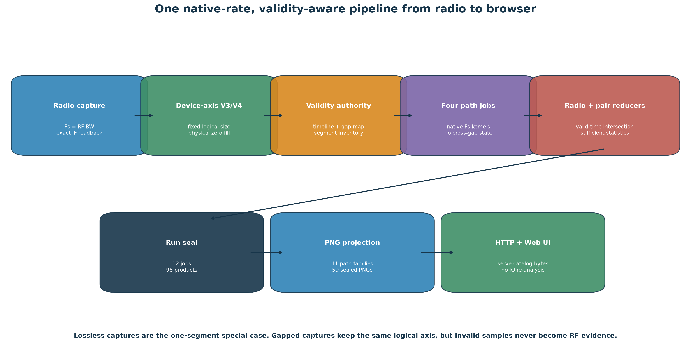
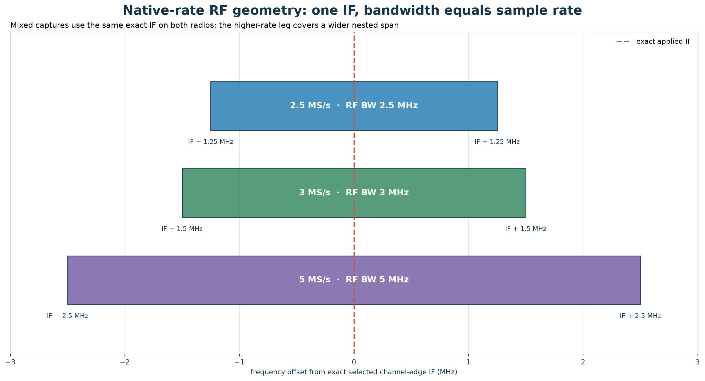
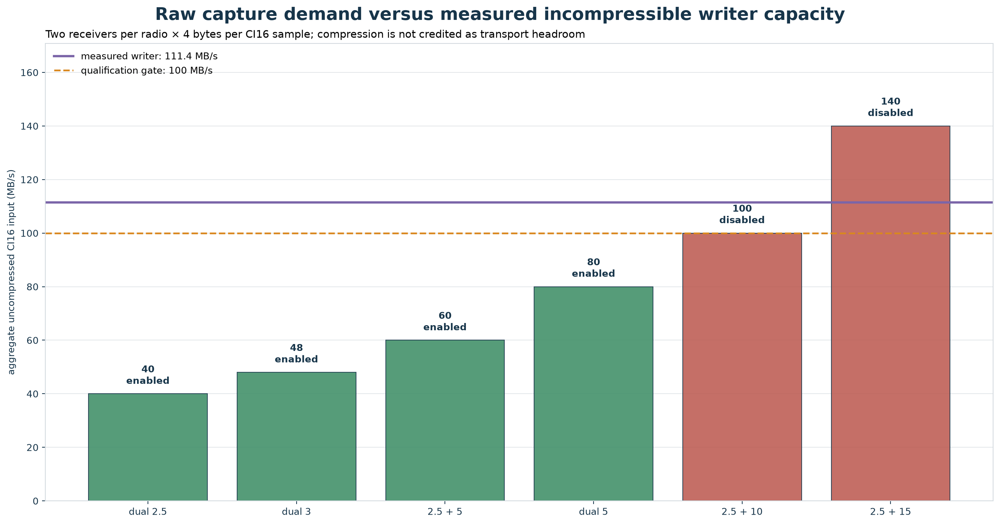
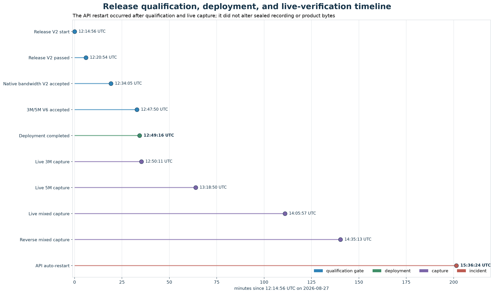
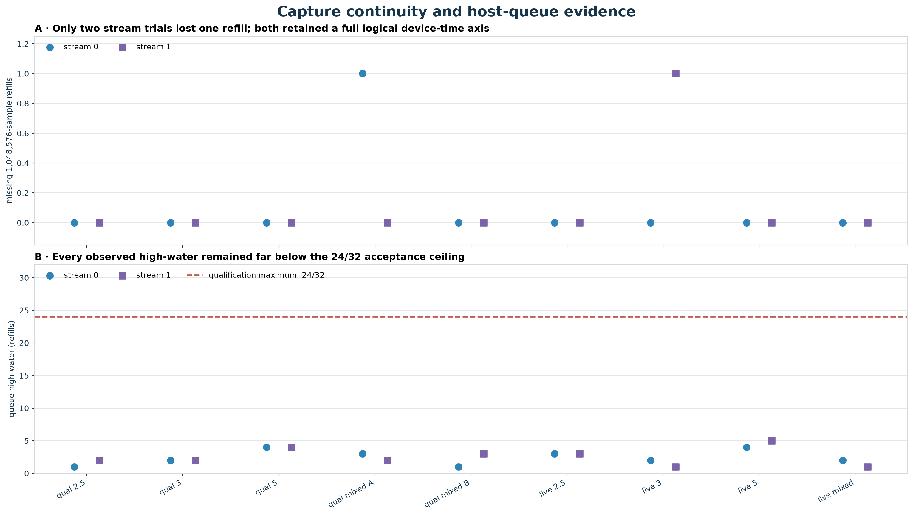
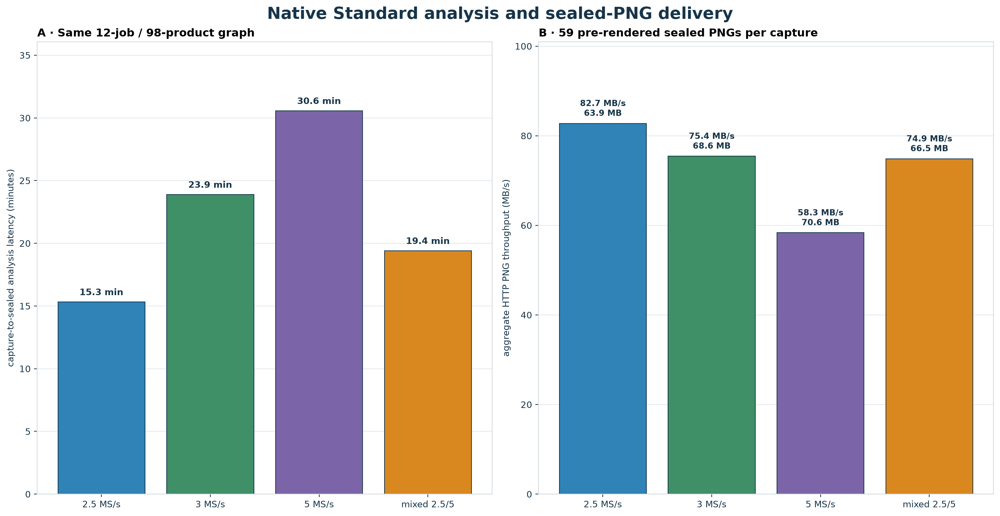

# Native 2.5/3/5 MS/s production deployment report

**Report date:** 2026-08-27<br>
**Evidence cutoff:** 2026-08-27 15:38 UTC<br>
**Production Leo revision:** `5400c930059c0aa1a8aeb409593220b5801ca107`<br>
**Production pluto-plus-utils revision:** `c955bca13250800bc707ee9f3a6b29bb8bc7c570`<br>
**Production host:** `gauss`<br>
**Radios:** `192.168.1.20` and `192.168.1.21` only<br>
**Overall result:** 2.5, 3, and 5 MS/s native capture and the common Standard analysis pipeline are deployed and live-verified. Mixed 2.5/5 MS/s dwells are enabled. Mixed 2.5/10 and 2.5/15 MS/s dwells remain disabled because their capture margins have not met the production gate.

## Executive summary

The production system now uses one native-rate pipeline for 2.5, 3, and 5 MS/s. It does not resample IQ to make the analyzers work. Each radio is configured with RF analog bandwidth equal to its sample rate, and mixed-rate radios share the same exact selected channel-edge IF so the higher-rate leg observes a wider, nested span of the same channel geometry.

Capture preserves a fixed device-time axis. A 60-second recording therefore always contains exactly `sample_rate × 60` logical samples per receiver. When hardware delivery loses a refill, capture physically writes zeros over the missing interval and publishes the interval as invalid. The analysis graph treats validity as an authority: no FFT, pilot, frame, GLRT, QAM, CFO, Doppler, trajectory, or Kalman operation may cross a continuity boundary; state resets at each boundary; power and quality use valid samples; paired-radio work uses the intersection of valid time; and reducers combine sufficient statistics.

The release passed the existing protected corpus, native scientific and PostgreSQL suites, the web build and Chromium browser tests. Hardware qualification then closed exact bandwidth and IF readback, 2.5/3/5 MS/s contiguous capture, both 2.5/5 radio assignments, the largest passing refill size with at least four kernel buffers, and the complete capture-to-browser path. Live 2.5, 3, 5, and mixed 2.5/5 recordings each sealed the same 12-job, 98-product Standard graph and exposed all 59 expected PNGs over HTTP.

Two qualifications are deliberately not claimed:

- 2.5/10 MS/s requires 100 MB/s of sustained uncompressed raw ingress, leaving only 1.11× margin against the measured 111.4 MB/s writer result.
- 2.5/15 MS/s requires 140 MB/s, which exceeds that measured writer result.

One operational incident remains open: `leo-api` exited once with `SIGSEGV` during report-time HTTP evidence collection. systemd restarted it in six seconds, sealed product bytes remained intact, and a bounded retry verified all 59 PNGs. The temporal overlap does not establish that the request caused the crash. Root-cause diagnostics are a P0 follow-up.

## Success criteria and disposition

| Criterion | Evidence | Disposition |
|---|---|---|
| No resampling at 2.5, 3, or 5 MS/s | All live manifests retain native `sample_rate_hz`; the common graph dispatches native-rate kernels | Passed |
| Maximize captured channel bandwidth | `rf_bandwidth_hz == sample_rate_hz` for every qualified and live leg | Passed |
| Exact channel-edge tuning | Applied LO/IF readback is exact after the pluto-plus-utils retry fix | Passed |
| Same geometry for mixed radios | Both mixed legs use the same exact IF and upper/lower choice | Passed |
| Fixed IQ size across gapped and non-gapped captures | Logical samples are `Fs × duration`; missing refills are physically zero-filled | Passed |
| No scientific operation crosses a gap | Segment-owned path work, reset boundaries, valid-time intersections, sufficient-statistic reducers | Passed |
| Same Standard graph at every supported rate | Each live canary sealed 12 jobs and 98 products | Passed |
| All expected browser PNGs | Seven subjects and 59 PNGs verified for 2.5, 3, 5, and mixed | Passed |
| Largest safe host buffer with at least four kernel buffers | 1,048,576-sample refill passed the qualification ladder; larger candidates gapped | Passed |
| Production-safe mixed cadence | 6 of 16 slots are mixed 2.5/5; remaining 10 draw from 2.5/3/5 ordinary modes | Passed |
| Mixed 2.5/10 and 2.5/15 | Insufficient/negative measured writer margin | Intentionally disabled |

## System and release identities

The release is pinned by immutable revision and receipt identity:

| Layer | Identity |
|---|---|
| Leo source and deployed target | `5400c930059c0aa1a8aeb409593220b5801ca107` |
| pluto-plus-utils | `c955bca13250800bc707ee9f3a6b29bb8bc7c570` |
| Capture policy | `mixed-native-rates-16-safe-v1` |
| Capture-control generation | `58`, running at the evidence cutoff |
| Acquisition workers | 20 |
| Heavy-analysis concurrency | 2 |
| BLAS/OpenMP/MKL threads per heavy worker | 4 |
| Refill size | 1,048,576 samples |
| Kernel buffers | 4 |
| Host queue capacity | 32 refills |
| Capture source | `192.168.1.142` on `enp132s0` |
| Radio 0 | `192.168.1.20`, serial `1040005e0b100007100010000bf33a5d4d` |
| Radio 1 | `192.168.1.21`, serial `10400056f695001322002d0010ad1719f2` |

No reboot was performed. No local radio was touched. The QNAP read-only boundary was respected.

## Architecture: one native pipeline



The supported modes differ only in manifest values and the amount of native IQ. They do not fork into separate scientific pipelines:

1. The selected channel and upper/lower edge determine the requested IF.
2. Capture applies native sample rate and matching RF analog bandwidth, then verifies exact readback.
3. V3 manifests describe homogeneous recordings; V4 manifests describe per-radio mixed rates. Both preserve a full logical device-time axis.
4. Continuity metadata partitions that axis into valid segments. Zero-filled missing intervals are storage placeholders, never RF evidence.
5. Four path jobs execute the same Standard product graph at the manifest sample rate.
6. Radio and paired-radio reducers combine valid sufficient statistics; paired processing operates only on shared valid time.
7. A sealed run contains 12 jobs and 98 catalog products. The PNG projection writes 59 immutable views, which the API serves without rerunning IQ analysis.

This design also makes a lossless recording the simple one-segment case rather than a separate implementation.

## RF bandwidth and IF geometry



The production invariant is:

`RF analog bandwidth = native sample rate`

| Native rate | RF analog bandwidth | 60-second logical samples per receiver | 60-second dual-RX bytes per radio |
|---:|---:|---:|---:|
| 2.5 MS/s | 2.5 MHz | 150,000,000 | 1.20 GB |
| 3 MS/s | 3 MHz | 180,000,000 | 1.44 GB |
| 5 MS/s | 5 MHz | 300,000,000 | 2.40 GB |

For mixed 2.5/5 captures, both radios receive the same exact applied IF and the same upper/lower selection. The 5 MHz analog and sampled passband is centered on that same IF, so it contains the 2.5 MHz observation and extends 1.25 MHz farther on each side. This directly serves the key criterion: capture as much of the selected channel as the native sample rate allows without synthesizing bandwidth by resampling.

An initial 3 MS/s attempt exposed a two-hertz LO readback difference. pluto-plus-utils revision `c955bca` added deterministic exact-setting retries. Leo pins that revision, and subsequent qualification demonstrated exact requested/applied readback on both specified radios. The upstream record is [pluto-plus-utils issue 42](https://github.com/misko/pluto-plus-utils/issues/42#issuecomment-5438847478).

## Fixed-size capture and gap semantics

For duration `T` and native rate `Fs`, each receiver has exactly `Fs × T` logical sample positions. A missing refill does not shorten or shift later data. Capture writes CI16 zeros over the missing positions and records the interval in the authoritative validity metadata.

The following rules are part of correctness, not optional UI behavior:

- FFT, pilot, frame, GLRT, QAM, CFO, Doppler, trajectory, and Kalman work is split at every continuity boundary.
- Stateful algorithms restart at each boundary; they do not carry estimates across invalid time.
- Power and quality use only valid samples and publish their contributing counts.
- Waterfalls keep a fixed global time coordinate internally. Invalid cells are excluded evidence; the UI does not need a separate “cell validity” visualization.
- Paired-radio products use intersections of the two validity interval sets.
- Reducers combine counts, sums, moments, likelihood terms, or other sufficient statistics. They do not average already-averaged segment results.

This keeps gapped and non-gapped recordings at the same rate and duration byte-compatible while preventing written zeros from being interpreted as received RF.

## Capture transport analysis



CI16 dual-receiver demand is calculated without crediting compression:

`aggregate bytes/s = sum(radios)(sample rate × 2 receivers × 4 bytes/CI16 sample)`

| Mode | Raw ingress | Margin vs 111.4 MB/s measured writer | Production state |
|---|---:|---:|---|
| Dual 2.5 MS/s | 40 MB/s | 2.78× | Enabled |
| Dual 3 MS/s | 48 MB/s | 2.32× | Enabled |
| Mixed 2.5/5 MS/s | 60 MB/s | 1.86× | Enabled |
| Dual 5 MS/s | 80 MB/s | 1.39× | Enabled |
| Mixed 2.5/10 MS/s | 100 MB/s | 1.11× | Disabled |
| Mixed 2.5/15 MS/s | 140 MB/s | 0.80× | Disabled |

The incompressible writer probe sustained 111,394,524 B/s over 369,098,752 bytes. The 100 MB/s qualification floor passed, but 10 MS/s has too little disturbance margin and 15 MS/s exceeds measured capacity. The server’s upgraded 2.5 GbE path is useful, especially when both radios transmit concurrently, but it does not prove the independent radio-link, USB/IIO, queue, memory-copy, filesystem, or analysis-scheduling margins. Those modes remain fail-closed.

The buffer ladder also produced a concrete result. Refills of 4,194,304 and 2,097,152 samples gapped. The 1,048,576-sample candidate was the largest passing size on both radios at 2.5, 3, and 5 MS/s, with 524,288 as a smaller passing control. Production therefore uses 1,048,576 samples and four kernel buffers.

## Qualification and deployment



### Release V2

Release V2 passed six gates in 357.109 seconds:

| Gate | Duration |
|---|---:|
| Protected real corpus | 127.858 s |
| Native scientific suites | 54.198 s |
| Native PostgreSQL suites | 111.316 s |
| Native real-corpus suites | 22.444 s |
| Web build | 5.265 s |
| Chromium browser suite | 35.531 s |

### Native bandwidth V2

The hardware receipt used only `192.168.1.20` and `192.168.1.21`. It verified exact rate, bandwidth, center-frequency readback, four kernel buffers, and the passing refill size for ordinary 2.5, 3, and 5 MS/s plus both radio assignments of mixed 2.5/5 MS/s. Four of five captures were lossless. The high-first mixed qualification lost exactly one 1,048,576-sample refill on its 5 MS/s leg and sealed as degraded with a complete logical timeline.

### 3M/5M V6

The strict 3 MS/s campaign completed ten trials and twenty streams: 3.6 billion logical samples, 3.6 billion observed samples, and zero missing samples. The 5 MS/s characterization captured 300 million samples on each radio losslessly with a queue high-water of 4/32. The writer probe passed, RAID `md127` remained `UUUU`, available memory was approximately 89 GB during the gate, and no OOM or swap delta occurred.

### Deployment receipt

The production deployment advanced from `9c53…` to `5400c930…` in 19.445 seconds and completed healthy. The report itself does not change runtime code and requires no redeployment or service restart.

## Live capture and Standard analysis verification

| Mode | Recording | Capture | Queue HWM | Standard run | Analysis | Closure |
|---|---|---|---:|---|---:|---|
| 2.5/2.5 | `cap-20260827T114600-2p5-native-canary` | 150M + 150M, lossless | 3/32, 3/32 | `native-capture-936bbf85eb714c89ac3b5e870ef508f7` | 15.3 min | 12 jobs, 98 products |
| 3/3 | `cap-20260827T125003-0b28a3a23a4d` | one lossless leg; one 1,048,576-sample gap | 2/32, 1/32 | `native-capture-f3b7dd57d1df4d448567e8c90769411e` | 23.9 min | 12 jobs, 98 products |
| 5/5 | `cap-20260827T131841-ff07c4208a8f` | 300M + 300M, lossless | 4/32, 5/32 | `native-capture-4982871869794d0e82180d516ed972d1` | 30.6 min | 12 jobs, 98 products |
| 5/2.5 | `cap-20260827T140554-a5bfc026cfde` | 300M + 150M, lossless, common IF | 2/32, 1/32 | `native-capture-b0e7699128924767ac7e901dd41beec8` | 19.4 min | 12 jobs, 98 products |
| 2.5/5 reverse | `cap-20260827T143509-51b7bc0515e3` | 150M + 300M, lossless, common IF | 1/32, 5/32 | `native-capture-86eafcbc621e4a8aac6252ddc60e7c6e` | Running at cutoff | Expected 12/98; not used as sealed evidence |

The degraded 3 MS/s canary is positive evidence for both sides of the contract: capture preserved exactly 180 million logical positions on each radio, and Standard analysis completed using partial-coverage semantics. It is not presented as lossless transport evidence; the strict V6 receipt supplies that evidence.



Across the five qualification captures and the first four sealed live canaries, two stream legs lost one refill each. Every other leg was lossless. All queue high-water observations were at most 5/32, well below the 24/32 qualification ceiling. A low queue high-water does not itself prove an absence of device-side loss, which is why logical/observed counts and gap maps remain authoritative.

## PNG inventory and browser behavior

The Standard graph produces seven subjects: four paths, two radio reducers, and one paired-radio reducer. Path-only products therefore appear four times; subject-wide products appear seven times.

| PNG artifact family | Subjects | PNGs per sealed run | 2.5 MS/s | 3 MS/s | 5 MS/s | Mixed 2.5/5 |
|---|---|---:|---|---|---|---|
| `waterfall` | 4 paths + 2 radios + pair | 7 | Yes | Yes | Yes | Yes |
| `pilot-methods` | 4 paths + 2 radios + pair | 7 | Yes | Yes | Yes | Yes |
| `cfo-raw` | 4 paths + 2 radios + pair | 7 | Yes | Yes | Yes | Yes |
| `cfo-dealiased` | 4 paths + 2 radios + pair | 7 | Yes | Yes | Yes | Yes |
| `cfo-final` | 4 paths + 2 radios + pair | 7 | Yes | Yes | Yes | Yes |
| `cfo-alternate` | 4 paths | 4 | Yes | Yes | Yes | Yes |
| `trajectory-accounting` | 4 paths | 4 | Yes | Yes | Yes | Yes |
| `full-capture-glrt20ms` | 4 paths | 4 | Yes | Yes | Yes | Yes |
| `pilot-doppler` | 4 paths | 4 | Yes | Yes | Yes | Yes |
| `pilot-carrier-tracking` | 4 paths | 4 | Yes | Yes | Yes | Yes |
| `pilot-segment-rates` | 4 paths | 4 | Yes | Yes | Yes | Yes |
| **Total** | **7 subjects** | **59** | **59/59** | **59/59** | **59/59** | **59/59** |

These PNGs are generated before the analysis run seals. Browser requests serve the sealed catalog bytes over HTTP; they do not regenerate plots or rerun Standard analysis on demand. A combined four-path tab should request the views selected for that subject/tab, not all views for every subject. There is no requirement to render a separate waterfall-cell-validity plot in the UI.

The live recording browser is [http://gauss:8090/](http://gauss:8090/). The mixed canary `cap-20260827T140554-a5bfc026cfde` is the clearest sealed example of the common-IF mixed pipeline.

## Analysis latency and HTTP delivery



| Mode | Standard analysis | PNG payload | Full 59-PNG download | Aggregate throughput | Client concurrency |
|---|---:|---:|---:|---:|---:|
| 2.5 MS/s | 918.944 s | 63,886,629 B | 0.772 s | 82.75 MB/s | 4 |
| 3 MS/s | 1,432.982 s | 68,558,739 B | 0.909 s | 75.43 MB/s | 16 |
| 5 MS/s | 1,833.656 s | 70,570,606 B | 1.210 s | 58.34 MB/s | 16 |
| Mixed 2.5/5 | 1,163.970 s | 66,490,061 B | 0.888 s | 74.85 MB/s | 16 |

All returned signatures, sizes, and SHA-256 values matched their sealed artifacts. These are operational observations, not a controlled benchmark: the 2.5 MS/s retry used concurrency four after the API restart, while the other checks used concurrency sixteen, and the host carried live capture/analysis work. The valid conclusion is that sealed delivery is sub-1.3-second at the measured host state and that apparent browser slowness is not caused by on-demand plot generation. Front-end request fan-out, image decode/layout, cache headers, and API stability should be profiled separately.

## Production cadence

The safe policy has a 16-dwell deterministic cycle:

- 6/16 dwells (37.5%) are mixed 2.5/5 MS/s.
- Both radios use the same randomly selected Starlink channel and the same randomly selected upper/lower edge.
- The high-rate radio assignment is balanced so each physical radio exercises the 5 MS/s leg.
- The other 10/16 dwells select ordinary 2.5, 3, or 5 MS/s operation.
- Analysis backpressure can supersede pending RF work rather than allowing captures to outrun the Standard queue.

The original requested composition was 25% mixed 2.5/5 plus another 12.5% mixed 2.5/5 and 12.5% mixed 2.5/15. The two 2.5/5 portions combine to 37.5%, represented exactly by 6/16 slots. The unqualified 2.5/15 portion is not silently substituted with risky RF; under the safe production policy those slots remain in the qualified ordinary pool.

## Operational events and retrospective

### What went well

- The implementation stayed small: native rate and per-radio manifest metadata flow through the existing Standard graph instead of creating separate 3M and 5M analyzers.
- The user’s bandwidth criterion became an enforced, receipt-backed invariant rather than a convention.
- Gaps are represented twice in the correct domains: zeros preserve physical layout, while explicit validity preserves scientific truth.
- Both mixed radio assignments were qualified, which prevents a hardware identity from becoming an untested hidden variable.
- Refill sizing was selected from an empirical ladder. The result favors the largest passing buffer while retaining four kernel buffers, exactly matching the operational requirement.
- Capture backpressure behaved safely during a long 3 MS/s analysis: two path attempts hit the 35-minute lease ceiling, expired fail-closed, retried successfully in about eleven minutes, and the run eventually sealed 12/12 jobs and 98 products. Pending RF was canceled or superseded while the analysis queue was high.
- Deployment required no reboot and left RAID, memory, and swap healthy at qualification time.

### What could be improved

1. **API crash diagnostics.** At 15:36:24 UTC, `leo-api` exited once with `SIGSEGV` after roughly 27 minutes of uptime while the report was collecting 2.5 MS/s HTTP evidence. systemd restarted it in six seconds. `coredumpctl` was unavailable, so there is no stack trace and no defensible root cause. A bounded concurrency-four retry fetched and verified all 59 PNGs in 0.772 seconds, and `NRestarts` remained one. This is recovery evidence, not closure.
2. **Path-job lease behavior.** The two 35-minute first attempts followed by much faster retries indicate a tail-latency or resource-contention problem. The lease protected correctness, but a production run should not spend more than an hour recovering from work that later completes in minutes.
3. **Benchmark discipline.** HTTP timings were collected under different concurrency and background-load conditions. Future reports should use fixed concurrency, warm/cold cache labels, per-request percentiles, browser timing, and server CPU/memory profiles.
4. **Transport margin telemetry.** Queue high-water is useful but incomplete. Per-radio device overrun counters, refill age, writer latency distributions, socket/IIO counters, filesystem latency, and host scheduling delays should be correlated on the same timeline.
5. **Crash containment.** The API recovered independently, which is good. It should also emit durable crash metadata so an automatic restart cannot erase the diagnostic context.

### Incident ledger

| Event | Impact | Resolution/status |
|---|---|---|
| Initial exact-LO readback differed by 2 Hz | Exact IF gate failed; no production acceptance | Fixed in pluto-plus-utils `c955bca`; requalified exact |
| One refill missing in high-first mixed qualification | Capture sealed degraded, not lossless | Gap/zero-fill contract behaved correctly; reverse assignment was lossless |
| One refill missing in live 3 MS/s canary | Partial valid coverage on one radio | Standard graph sealed correctly; strict 3M V6 separately proved lossless transport |
| Two production 3M path attempts reached 35-minute lease | Delayed run closure | Fail-closed expiry, successful retries, backpressure prevented pile-up |
| One `leo-api` `SIGSEGV` | Six-second API interruption | Auto-recovered; sealed bytes verified; root cause open |

## Follow-up plan

### P0 — production reliability

1. Enable durable API crash capture: core dumps or an equivalent minidump/backtrace path, build identity, recent request IDs, and resource snapshot.
2. Repeat the 59-PNG HTTP exercise with a bounded matrix of concurrency 1/4/8/16, cold and warm cache states, and no live RF campaign. Record restart count before and after. Stop immediately on another crash and preserve the dump.
3. Instrument path jobs with stage timings, native input counts, peak RSS, BLAS thread counts, lease heartbeat age, and retry reason. Compare the two expired attempts with the successful retries.
4. Add alerts for API restart count, Standard lease expiration, analysis queue age, capture gaps, and queue high-water.

### P1 — qualify, do not assume, 10 and 15 MS/s

Keep both modes disabled until each independently closes:

1. Establish a reviewed transport-margin policy. A provisional 1.35× floor would require at least 135 MB/s for mixed 2.5/10 and 189 MB/s for mixed 2.5/15, sustained with incompressible data.
2. Run the pluto-plus-utils refill ladder on both radios with at least four kernel buffers; use the largest candidate that repeatedly passes.
3. Verify native RF bandwidth equals 10 or 15 MHz and exact common-IF readback for upper and lower channel edges.
4. Capture both high-radio assignments for bounded 60-second trials and verify logical size, observed counts, physical zero fill, gap maps, and host/device telemetry.
5. Run the unchanged Standard graph at native rate, including deliberately gapped fixtures, and verify 12 jobs, 98 products, seven subjects, and all 59 PNGs.
6. Repeat sealed HTTP and browser verification, then publish signed qualification and deployment receipts before adding cadence slots.

### P2 — performance and scientific follow-through

1. Profile 5 MS/s kernels before raising heavy-analysis concurrency. Four BLAS/OpenMP/MKL threads are already oversubscribed per heavy worker; more concurrency should be driven by measured CPU, memory bandwidth, and tail latency.
2. Reduce browser time-to-first-useful-view through catalog batching, cache validation, lazy tab loading, and decode/layout measurements while preserving immutable sealed PNG semantics.
3. Continue lean re-analysis over the existing radio corpus for truthful Starlink candidate, pilot, QAM, CFO, and Doppler evidence. Any new RF campaign remains explicitly authorized and bounded to 30 minutes.

## Evidence ledger

| Evidence | Immutable path | SHA-256 |
|---|---|---|
| Release V2 | `/srv/bulk/leo/qualification/release/release-5400c93-exact-lo-v1/receipt.json` | `42d298c49b95880c5b92868505a1d23e5d35d169ec5af4787cc7ff3e534674fb` |
| Native bandwidth V2 | `/srv/bulk/leo/qualification/native-bandwidth/accepted/5400c930059c0aa1a8aeb409593220b5801ca107/native-bandwidth-qualification-receipt-v2.json` | `e5e88bb4a4019a9fe26369caca56efa0f3888a6991f5c956c5d8368916211a3e` |
| 3M/5M V6 | `/srv/bulk/leo/qualification/sample-rate-3m/accepted/5400c930059c0aa1a8aeb409593220b5801ca107/contiguous-rate-qualification-receipt-v6.json` | `51d0a7d82a09a8b9cf7c5be6c832dcc5bf4211637877edf2d137d95390d79534` |
| Deployment | `/srv/bulk/leo/qualification/deployment/deploy-20260827T124857Z-5400c930059c0aa1a8aeb409593220b5801ca107.json` | `7e34be57b8fb4f6e3733bd4378b134c926ab25d931c03da5eb764580e1794506` |
| Standard cutover root | `/srv/bulk/leo/qualification/standard-cutover/5400c930059c0aa1a8aeb409593220b5801ca107` | Per-recording seals and artifact hashes |

The checked-in machine-readable report source is [`deployment-retrospective-data.json`](figures/2026_08_27_native_sample_rate_production_retrospective/deployment-retrospective-data.json). It is intentionally a compact summary of the immutable receipts and live checks, not a replacement for them.

## Reproduction and validation

From the repository root:

```bash
uv run python tools/report_native_sample_rate_production_retrospective.py
uv run pytest -q tests/analysis/test_native_sample_rate_production_retrospective_figures_tool.py
uv run ruff check tools/report_native_sample_rate_production_retrospective.py tests/analysis/test_native_sample_rate_production_retrospective_figures_tool.py
git diff --check
```

The renderer validates the report schema, exact rate/bandwidth equality, and 7-subject/59-PNG closure before producing the six figures. Its test verifies the checked-in invariants, rejection of corrupted data, PNG signatures, and minimum dimensions.

## Final disposition

2.5, 3, and 5 MS/s are accepted as native production sample rates for capture and Standard analysis. Mixed 2.5/5 operation is accepted in both radio assignments and is active in the 16-dwell cadence. Gapped recordings are accepted only under the fixed-axis, physical-zero-fill, explicit-validity contract. The browser serves the complete sealed PNG set for every accepted mode.

The deployment is successful with one open production-reliability item: diagnose the isolated API `SIGSEGV`. Mixed 2.5/10 and 2.5/15 remain outside the accepted production envelope until their measured end-to-end margins and full native Standard/browser closure are independently demonstrated.
