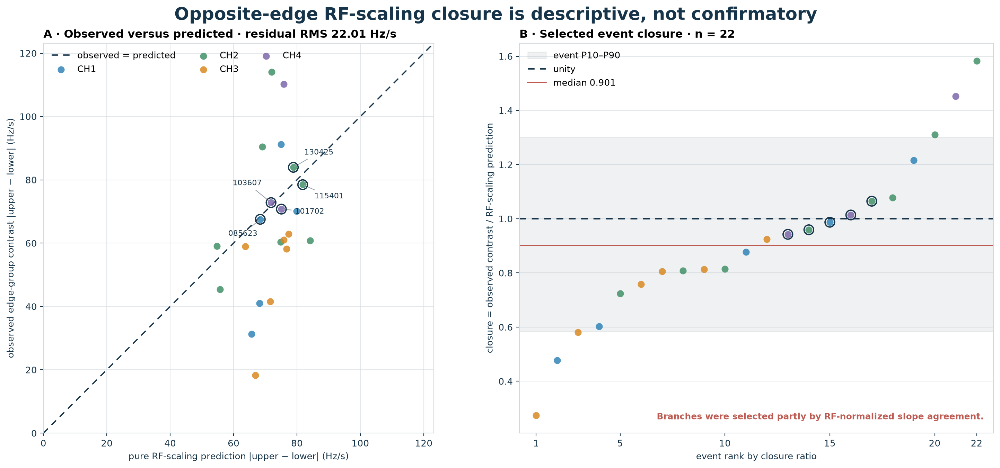
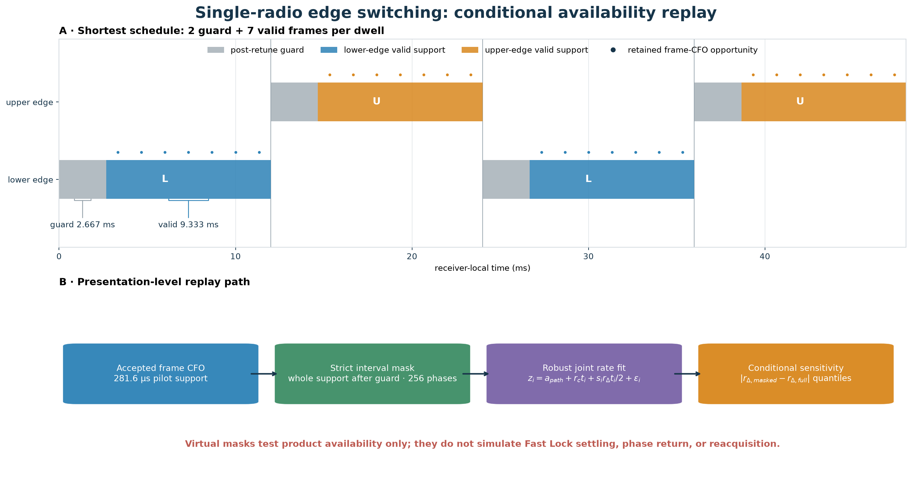
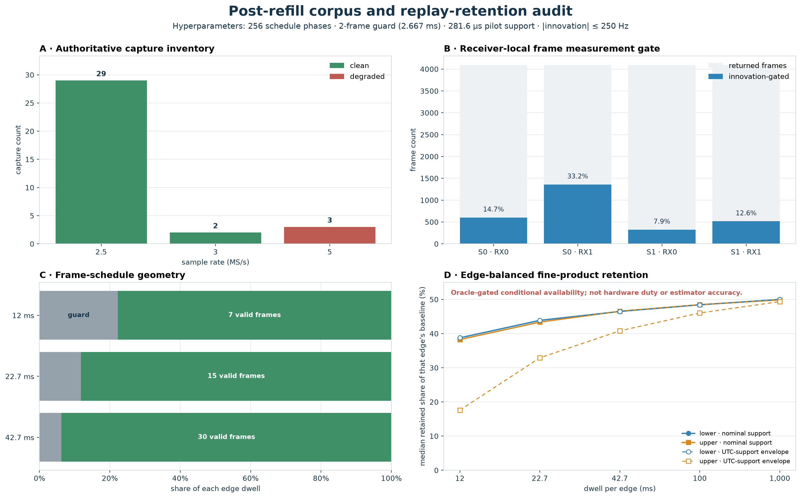
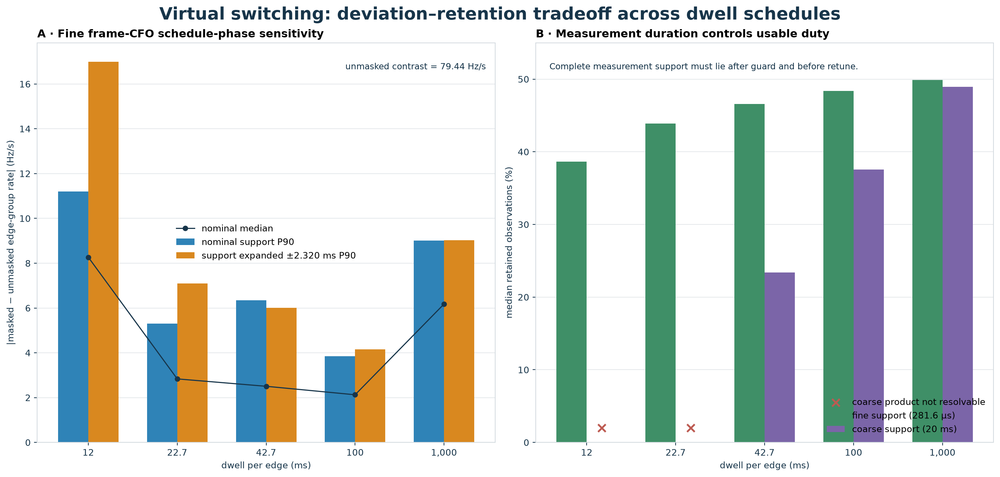

# Post-refill upper/lower synchronization and switching replay

## Outcome

The corpus contains **34** authoritative same-channel opposite-edge captures after the refill correction. **31** are gap-free and counter-complete; the three 5 MS/s attempts are degraded and are excluded from the replay. None is phase coherent.

The clean captures provide continuous per-radio counters and enough overlapping duration for receiver-local multi-second slope comparisons: their median guaranteed overlap is 59.868214 s. They are not sample-aligned across radios. Each FPGA counter is authoritative only inside its own radio, and the manifest UTC anchors carry millisecond uncertainty.

A conditional product-availability replay is encouraging. On `115401`, a 12 ms virtual dwell applied to receiver-local frame CFO measurements has a 90th-percentile masked-minus-unmasked edge-group slope deviation of 11.20 Hz/s across the 256 prespecified uniformly spaced phase offsets. Retaining only upper-edge measurements whose support remains valid throughout the declared relative-UTC interval raises it to 16.99 Hz/s. This is not estimator accuracy, uncertainty, or a Fast Lock hardware result.

## Capture inventory

| Rate | Clean | Degraded | Use |
|---:|---:|---:|---|
| 2.5 MS/s | 29 | 0 | primary analyzed corpus |
| 3 MS/s | 2 | 0 | clean follow-up; one native analyzed capture |
| 5 MS/s | 0 | 3 | exclude: large missing-sample gaps |

All clean streams have continuity schema v2, observable loss, one segment, zero reported gaps/overflows, and a device-counter span exactly equal to the captured sample count. `phase_coherent=false` for all 34 pairs.

## Existing same-event candidates

The frozen retrospective contains 22 deliberate opposite-edge captures with a selected cross-edge branch set. These are post-selected concurrent candidate tracks consistent with RF scaling under the same-satellite working assumption; they do not prove spacecraft identity.

| Capture | CH | Paths / overlap | Lower rate | Upper rate | U−L | Pure RF scaling | Closure |
|---|---:|---:|---:|---:|---:|---:|---:|
| `085623` | CH1 | 4 / 4.475 s | -3177.37 | -3244.90 | -67.53 | -68.41 | 0.987 |
| `103607` | CH4 | 3 / 8.700 s | -3567.85 | -3640.66 | -72.81 | -71.81 | 1.014 |
| `115401` | CH2 | 4 / 11.825 s | -3888.96 | -3967.43 | -78.47 | -81.80 | 0.959 |
| `130425` | CH2 | 4 / 9.825 s | -3744.25 | -3828.19 | -83.95 | -78.84 | 1.065 |
| `101702` | CH4 | 2 / 5.875 s | -3732.29 | -3803.03 | -70.75 | -75.07 | 0.942 |

The closure calculation is descriptive: the retrospective chose branch sets partly by RF-normalized slope agreement. A confirmatory result must freeze identity on a training interval and score upper/lower scaling on held-out time.



*The 22 points are post-selected by an RF-normalized slope-agreement screen; the identity line is a descriptive reference, not independent validation.*

The 28 post-selected same-frequency controls show the scale of the two-radio nuisance distribution. Their stream-1-minus-stream-0 rate difference has 30.78 Hz/s RMS, 19.78 Hz/s median absolute magnitude, and 51.18 Hz/s 90th percentile. Existing dual-radio captures therefore cannot demonstrate the common-chain drift cancellation expected from a real single-radio hopper. This is not a calibrated hardware nuisance floor.

## Prototype model

For every retained CFO measurement, the replay jointly fits

```text
z = path_intercept + common_rate*t + edge_sign*differential_rate*t/2 + error
edge_sign = -1 lower, +1 upper
```

so `differential_rate = upper_rate - lower_rate`. In these fixed-radio data, this is an edge-group slope contrast: physical RF scaling is confounded with differential radio/LNB drift and path bias. All 256 prespecified uniformly spaced phase offsets are evaluated. A measurement is retained only when its complete time interval lies after the two-frame guard and before the next retune boundary.

The estimand is the best linear projection over the selected interval. Masking changes temporal weighting, so the reported deviation can include real Doppler curvature as well as information loss.



*Simultaneous fixed-edge products are conditionally masked onto a hypothetical single-radio schedule; actual retuning, settling, and reacquisition are absent.*



*The replay uses a two-frame guard, exact pilot-symbol support, 256 schedule phases, and a relative-UTC support envelope for the two-radio timing uncertainty.*

### Coarse 20 ms GLRT observations

| Dwell per edge | 103607 P90 deviation | 115401 P90 deviation | Interpretation |
|---:|---:|---:|---|
| 12.000 ms | — | — | not resolvable: the measurement itself is too long |
| 22.667 ms | — | — | not resolvable: the measurement itself is too long |
| 42.667 ms | 3.74 Hz/s | 3.57 Hz/s | conditional product-availability replay |
| 100.000 ms | 2.63 Hz/s | 3.93 Hz/s | conditional product-availability replay |
| 1000.000 ms | 3.11 Hz/s | 12.35 Hz/s | conditional product-availability replay |

A 20 ms CFO probe cannot fit inside 12 ms. With a 2.667 ms guard, the 22.667 ms schedule has zero start-time slack and is likewise not a meaningful coarse-product replay. The 42.667 ms schedule is the first nominal dwell that can contain the 20 ms product after the guard.

The coarse replay is also oracle-conditioned: its branch and dealiased identity were selected using the complete recording before the schedule mask was applied.



*P90 is the quantile over 256 prespecified phase offsets of masked-minus-unmasked edge-group slope deviation for one selected event, not estimator accuracy or uncertainty.*

### Fine receiver-local frame measurements (`115401`)

The unmasked selected support is imbalanced: 1878 lower-edge and 784 upper-edge observations. Per-edge retained fractions are therefore reported alongside the total.

| Dwell per edge | Median retained | Lower / upper retained | Median absolute deviation | Nominal P90 deviation | P90 with relative-UTC support envelope |
|---:|---:|---:|---:|---:|---:|
| 12.000 ms | 1029 (38.7%) | 38.8% / 38.3% | 8.27 Hz/s | 11.20 Hz/s | 16.99 Hz/s |
| 22.667 ms | 1168 (43.9%) | 43.9% / 43.4% | 2.84 Hz/s | 5.30 Hz/s | 7.09 Hz/s |
| 42.667 ms | 1240 (46.6%) | 46.5% / 46.6% | 2.51 Hz/s | 6.34 Hz/s | 6.01 Hz/s |
| 100.000 ms | 1288 (48.4%) | 48.4% / 48.5% | 2.13 Hz/s | 3.85 Hz/s | 4.15 Hz/s |
| 1000.000 ms | 1328 (49.9%) | 50.0% / 49.9% | 6.18 Hz/s | 9.01 Hz/s | 9.03 Hz/s |

The unmasked fine-product differential is -79.44 Hz/s. Its residual RMS is 231.9 Hz and robust scale is 182.1 Hz. The replay uses raw per-frame `measurement_doppler_hz`, but only when the persisted tracker accepted it and its absolute innovation is at most 250 Hz. Because that gate and the trajectory were derived from the complete simultaneous recording, this is deliberately labeled an oracle-conditioned feasibility result.

Each fine measurement is masked using the actual pilot support encoded by its frame sample index and Kalman pilot count (about 281.6 microseconds here), while the fit uses the persisted amplitude-weighted pilot-center timestamp.

The final column expands every upper-edge support interval by ±2.320 ms, the manifest's declared cross-radio start-skew uncertainty, and then repeats the complete 256-point phase sweep. A separate five-point relative timestamp shift is also summarized in the machine-readable results. Neither substitutes for a real shared counter.

## What is and is not supported

Supported now:

- multi-second receiver/path-conditional edge-group slope fitting;
- conditional time-multiplexing sensitivity estimates;
- a preliminary 12 ms frame-product availability replay;
- same-frequency controls for differential receiver drift.

Not supported by these captures:

- cross-radio sample or carrier-phase coherence;
- decoded absolute Starlink frame identity or satellite identity;
- actual Fast Lock settling/reacquisition behavior;
- coherent 230.625 MHz synthetic-bandwidth TOA.

The clean 3 MS/s `231207` capture is the best modern follow-up: it has complete device-axis native products and an exploratory four-path scaling event, but its sealed paired report explicitly disallows cross-radio association. The three 5 MS/s captures must remain failed continuity evidence, not be silently repaired.

## Next confirmatory step

Freeze a branch/event using only a training interval, run the 12/22.667/42.667 ms masks on held-out frame measurements, and preregister an acceptable masked-minus-unmasked deviation. Then repeat on same-frequency controls. A bounded raw-IQ replay should then use the published V2/V3 recording reader to repeat branch selection, dealiasing, and measurement acceptance using retained samples only.

## Reproduction

```bash
PYTHONPATH=src .venv/bin/python tools/evaluate_post_refill_edge_switching.py
PYTHONPATH=src .venv/bin/python tools/report_post_refill_edge_switching_figures.py
```

Machine-readable results: [edge-switching-results.json](figures/2026_08_27_post_refill_edge_switching/edge-switching-results.json)
