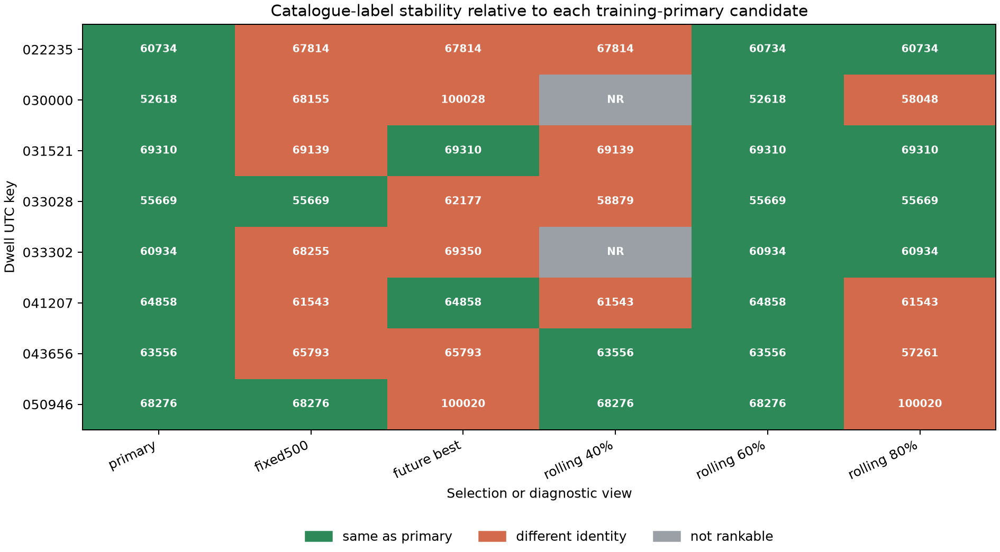
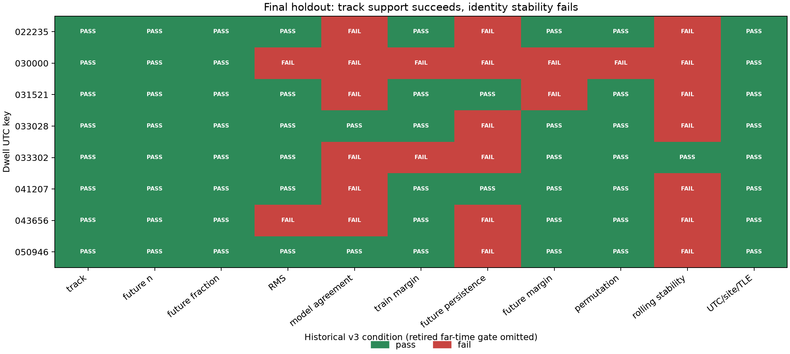
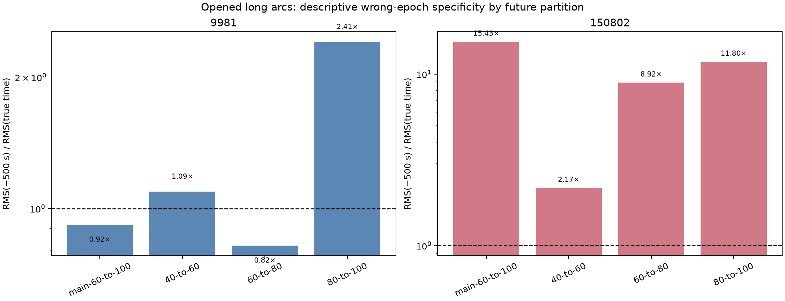
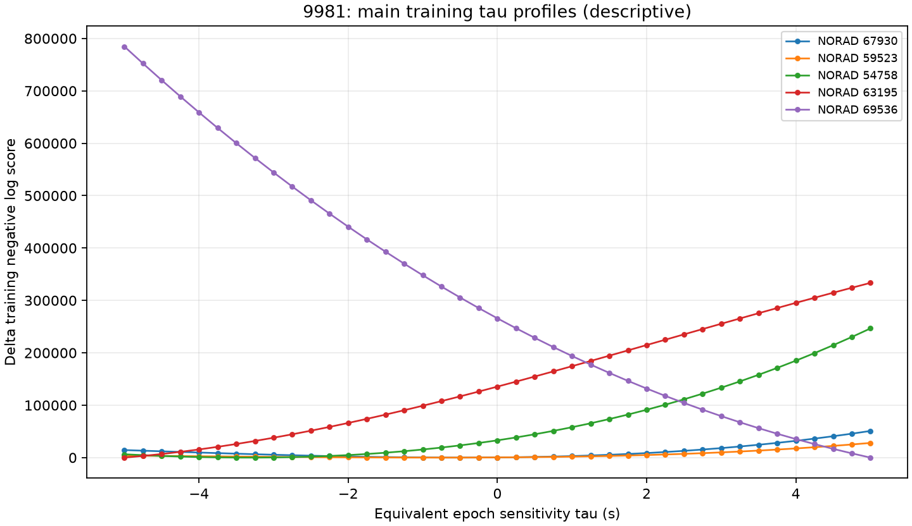
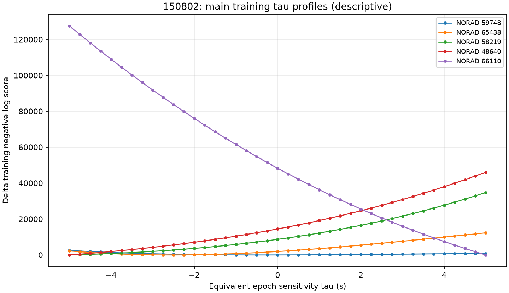

# Satellite tracking, Starlink association, and Doppler-PNT synthesis

Date: 2026-08-27 UTC

Status: **complete evidence synthesis; no secure NORAD identity or real-data
positioning claim**

This report joins the final ten-dwell POST-FIX holdout, the four-dwell nuisance
study, the two registered long arcs, the legacy 13-dwell/37-track audit, and the
implemented satellite-association/PNT development plan. It reads only sealed
evidence; the accompanying summary renderer does not reopen IQ, rerank a
catalogue, refit a nuisance parameter, or alter an experimental verdict.

## Abstract

The receiver now recovers coherent, Starlink-format carrier-frequency-offset
(CFO) trajectories reliably enough to predict withheld future measurements.
That success has not yet translated into trustworthy spacecraft identity. In
the final ten-capture holdout, eight captures were association-evaluable and all
eight recovered a future response track, but none passed the complete frozen
catalogue-compatibility gate. The main failures were candidate disagreement
between reasonable CFO predictors, failure of the training winner to remain
best on future response, and rolling-origin identity instability. Each short
dwell admitted 508--551 geometrically visible Starlink alternatives after a
free receiver-relative frequency offset.

Two exact, counter-contiguous POST-FIX arcs provide better development data. A
30.000 s arc (`9981`) retains conditional NORAD 67930 at all rolling origins but
is not true-time-specific in every predeclared `-500 s` comparison. A 13.825 s
arc (`150802`) selects conditional NORAD 59748, has much stronger wrong-epoch
specificity, and predicts its main future block to 55.1 Hz, but its earliest
rolling origin selects NORAD 65438. Both arcs contain genuine receiver-relative
curvature and both are useful research datasets; neither is an independent
confirmation or secure identity.

The evidence therefore separates cleanly into two conclusions: **signal
tracking is working**, while **catalogue identity remains unresolved**. The
recommended path to Doppler positioning is a causal multi-dwell, multi-hypothesis
association filter with bounded shared nuisance states, explicit null and
handoff modes, long-arc curvature tests, and eventual capture-bound geometry and
independent recurrence. Synthetic contracts and solvers for much of this path
now exist, but no real-data global-position result is claimed.

## 1. Introduction and motivation

Starlink downlink signals are attractive signals of opportunity for positioning:
the constellation is dense, spacecraft motion produces a strong time-varying
Doppler signature, and known waveform structure permits receiver-side timing
and carrier measurements without cooperation from the operator. A practical
receiver, however, observes more than orbital Doppler. Its CFO also includes an
unknown transmitter carrier term, LNB and local-oscillator error, sample-clock
error, path-specific acquisition gauge, and tracking noise. On a short arc,
hundreds of similar LEO trajectories can become nearly indistinguishable after
one free frequency offset.

The immediate scientific question is consequently not “which TLE draws the
closest curve?” It is whether a training-selected candidate predicts genuinely
future measurements, remains stable under reasonable signal models and causal
origins, beats satellite-free descriptions of the same data, and survives
time/catalogue and provenance sensitivities. The longer-term engineering goal is
to carry the resulting identity uncertainty and calibrated satellite-frequency
uncertainty into a position solver rather than silently committing to one
plausible object.

This project also has a specific continuity history. PRE-FIX captures omitted
elapsed RF time at Pluto application-refill handoffs, biasing stored-time
multi-second slopes. Current identity development therefore prioritizes
RecordingManifestV2 POST-FIX data with device counters, observed samples equal
to device span, one continuity segment, and zero recorded gaps, missing samples,
overflows, or enqueue failures. The two registered long arcs meet that stronger
definition.

## 2. Existing reports and what this report adds

Several substantial reports already cover parts of this subject:

| Existing report | Scope | Remaining gap |
|---|---|---|
| [Final Doppler holdout and Starlink association](2026_08_26_final_doppler_holdout_and_starlink_association_v2.md) | Detailed ten-capture forecast and frozen v3 association verdict, with publication figures | Does not integrate later long-arc development or the forward PNT architecture |
| [Retrospective satellite nuisance results](2026_08_26_retrospective_satellite_nuisance_results.md) | Four primary bundles; shared physical-radio-rate sensitivity and controls | Opened retrospective evidence only |
| [Opened long-arc attempt-2 results](2026_08_27_satellite_pnt_long_arc_development_results_attempt2.md) and [audit](2026_08_27_satellite_pnt_long_arc_development_audit.md) | Exact `9981` and `150802` candidate, tau, wrong-epoch, rolling, and polynomial-null comparisons | Deliberately narrow execution reports, not a whole-program narrative |
| [Refill-aware method review](2026_08_25_doppler_rate_and_satellite_linking_method_review.md) | Broad historical review of Doppler-rate and satellite-linking methods | Predates the final holdout and current long-arc protocol |
| [Satellite association and PNT plan](../plans/satellite-association-and-pnt.md) | Implemented contracts, synthetic qualification, remaining work packages | A plan and implementation ledger rather than a results synthesis |

The present report supplies the missing paper-style overview: background,
measurement model, cohorts, methods, per-dwell candidates and gates, long-arc
results, nuisance findings, implications for positioning, and a single
claim boundary.

## 3. Background and measurement model

For candidate satellite `j`, a receiver-relative CFO measurement can be written
schematically as

```text
y_i = D_j(t_i + delta + tau; TLE, site, RF) + b_path
      + d_radio(t_i) + q_satellite(t_i) + epsilon_i
```

where:

- `D_j` is the geometric Doppler prediction from a causal TLE snapshot;
- `delta` selects the catalogue-time field (`0`, `-500`, or `+500 s` in the
  current observational design);
- `tau` is a bounded local orbit-time/along-track sensitivity;
- `b_path` is an unconstrained constant CFO offset for a receiver path;
- `d_radio` represents LNB, LO, sample-clock, and hardware-epoch behavior;
- `q_satellite` represents satellite carrier bias/drift not captured by the
  nominal geometry; and
- `epsilon_i` contains measurement error and residual model mismatch.

A constant CFO offset is essential because the receiver has no calibrated
absolute carrier reference. It also removes much of the immediate separation
between nearby Starlink objects. Allowing every candidate an arbitrary slope,
acceleration, or wide time shift would make the model even less identifiable by
absorbing the orbital curvature that should distinguish candidates. The primary
association models are therefore deliberately lean; richer receiver/LNB terms
are regularized diagnostics or shared multi-dwell states.

### 3.1 What the evidence labels mean

| Label | Meaning |
|---|---|
| Recovered track | Enough withheld response exists to score a frozen CFO trajectory; no identity implication |
| Conditional candidate | Rank one under a specific source, model, site, TLE, nuisance family, and split |
| Catalogue compatible | Candidate passes every gate of the protocol that produced the result |
| Secure NORAD | Catalogue-compatible identity plus adequate capture-bound authority and independent recurrence |

No result in this report reaches the last category.

### 3.2 Window sizes

The 20, 125, and 500 ms values are **history horizons**, not inferred Starlink
transmission-slot durations. On the final ten-capture forecast comparison,
fixed 125 ms had the best descriptive equal-capture future-CFO RMS at 57.754 Hz.
The strict-past 500 ms quadratic won 9/10 captures relative to fixed 500 ms but
missed its frozen aggregate promotion target: quadratic/fixed500 RMS was
0.964863 rather than at most 0.95. Consequently fixed125 is the leading
short-history direction, while fixed500 and quadratic remain required
sensitivity lanes; no production estimator was promoted from that comparison.


## 4. Data cohorts

| Cohort | Inputs | Role | Identity authority |
|---|---|---|---|
| Final POST-FIX holdout | Ten captures; eight association-evaluable | Historical frozen gate audit and forecast comparison | Opened; reviewed site preset; no secure identity |
| Registered long arcs | `9981` 30.000 s and `150802` 13.825 s, exact paths/spans | Primary opened development cohort for curvature and catalogue discrimination | POST-FIX and exact-input bound, but not independent confirmation |
| Retrospective nuisance study | `065355`, `103607`, `130425`, and long-direct `150802` | Shared physical-radio-rate and candidate sensitivity | Opened diagnostic evidence |
| Legacy degree-1 association | 37 tracks in 13 Aug-21 dwells | Historical failure-mode comparison | PRE-FIX for multi-second elapsed-time use; no current promotion role |

The registered long-arc authority is
[`post-fix-long-arc-research-cohort-v1.json`](../config/analysis/post-fix-long-arc-research-cohort-v1.json).
It permits only the exact capture, radio, stream, receiver, edge, and half-open
sample span listed in the [cohort report](2026_08_26_post_fix_long_arc_research_cohort.md).

## 5. Methods

### 5.1 Physical track recovery

The final holdout froze Standard sources, aliases, trajectories, and frame
epochs upstream. Downstream predictors used chronological history and withheld
odd-Qin CFO response. Association grouped the supported response into time bins
and required both the primary and fixed500 prediction lanes, at least ten total
bins, six training bins, and four evaluation bins. A recovered track then
required at least four finite future bins, at least 50% future availability, at
least two visible candidates, and finite candidate scores.

This is conditional downstream withholding: upstream acquisition may use
all-Qin evidence. It is not an end-to-end untouched waveform trial.

### 5.2 Catalogue population and ranking

Candidate populations were Starlink-only, came from an exact causal TLE
snapshot, and were selected by response-free visibility geometry. No response
ranking truncated the catalogue. For each candidate, training data fit one
constant CFO offset per capture/path. The primary final-holdout time sensitivity
was fixed at `tau=0`; candidate-specific rate, acceleration, clock scale, and
delay were forbidden.

The candidate with the lowest training RMS was frozen. Held-out response then
answered three separate questions:

1. Is its absolute future error acceptable?
2. Does the training winner remain the lowest-error candidate?
3. Is it sufficiently separated from the future runner-up?

The diagnostic “future-best” identity shown below uses response to explain a
failure; it is never allowed to replace the training-frozen identity.

### 5.3 Nuisance parameters across paths and dwells

The retrospective hierarchy compared a fixed physical-radio-rate baseline with
one regularized shared rate departure per physical receive chain plus free
path/capture offsets. The final holdout likewise evaluated shared physical-chain
rate departures only after candidate ranking and forbade them from changing the
candidate identity.

The implemented forward architecture goes further on synthetic-qualified
contracts. Conditional on a retained discrete identity history, it can jointly
fit one bias/drift state per active satellite, continuity-component offsets,
and hardware-epoch receiver drift, marginalize receiver-local columns, and
retain cross-satellite frequency covariance. An optional time-local model uses
dwell-specific slopes coupled by a calibrated random walk. These continuous
states do not retroactively relabel the discrete association posterior.

### 5.4 Candidate and control gates

The historical v3 gate stack included track support, minimum future support,
absolute RMS, primary/fixed500 agreement, training and future runner separation,
future-winner persistence, permutations, rolling origins, wrong-time fields,
and UTC/site/predecessor-TLE sensitivities. Complete catalogue compatibility was
the logical AND of every frozen condition.

The current forward policy changes the treatment of orbital time:

- primary orbit time is `tau=0`;
- `tau in [-5,+5] s` is a hard search-support bound and diagnostic sensitivity,
  not a universal PNT-derived clock bound;
- full-catalogue fields at `delta=-500 s` and `+500 s` are always reported; and
- those two fields are **observe-only**, with no p-value, threshold, or veto.

The old 40-field far-time empirical gate remains immutable historical evidence
but is superseded prospectively. Removing it does not rescue any final-holdout
dwell because every dwell failed at least one other identity condition.

### 5.5 Long-arc development

All three response-free populations (`delta=-500,0,+500 s`) were built before
response scoring. For each field, training data alone selected the candidate,
local tau, and constant offset. The winner was frozen and evaluated on one main
60/40 future split plus three rolling partitions. Line, quadratic, and cubic
radio-only descriptions were trained and scored on the same calendar blocks.
Numerical identity thresholds were deliberately unset; the execution is opened
development evidence.

### 5.6 Positioning architecture

The implemented synthetic development path preserves uncertainty rather than
forcing a single label:

```text
TLE-blind physical episodes
  -> complete response-free candidate banks
  -> bounded K=0,1,2 causal association histories
  -> retained-history smoothing
  -> known-position satellite frequency calibration
  -> solver-safe correction modes with covariance
  -> truth-isolated Doppler position solver
```

The causal filter includes a `NULL` state, permits handoffs, retains at most two
distinct NORADs in its current bounded history, scores before assimilating each
dwell, and can apply retrospective fixed-interval smoothing only after causal
receipts exist. Simultaneous-emitter and navigation lanes remain conditional or
synthetic; they are not a real-data position result.

## 6. Results

### 6.1 Final ten-dwell holdout

Eight of ten captures were association-evaluable. `034929` retained only two
training and five evaluation bins; `035201` retained five training and ten
evaluation bins. They remain in the denominator but were not assigned a
catalogue verdict.

Each evaluable row below represents one aggregate recovered CFO trajectory.
The 508--551 visible objects are alternative catalogue explanations, not that
many observed RF tracks.

| Dwell | Train/eval bins | Visible | Primary / fixed500 / future-best NORAD | Primary future RMS | Rolling training winners | Non-far-time failures |
|---|---:|---:|---|---:|---|---|
| `022235` | 27/24 | 508 | 60734 / 67814 / 67814 | 21.03 Hz | 67814 -> 60734 -> 60734 | model agreement; future persistence; rolling |
| `030000` | 8/10 | 528 | 52618 / 68155 / 100028 | 136.83 Hz | NR -> 52618 -> 58048 | RMS; model agreement; train margin; future persistence; future margin; permutation; rolling |
| `031521` | 27/25 | 551 | 69310 / 69139 / 69310 | 46.43 Hz | 69139 -> 69310 -> 69310 | model agreement; future margin; rolling |
| `033028` | 27/25 | 535 | 55669 / 55669 / 62177 | 16.21 Hz | 58879 -> 55669 -> 55669 | future persistence; rolling |
| `033302` | 8/19 | 529 | 60934 / 68255 / 69350 | 95.08 Hz | NR -> 60934 -> 60934 | model agreement; train margin; future persistence |
| `034929` | 2/5 | -- | not evaluable | -- | -- | insufficient total and training bins |
| `035201` | 5/10 | -- | not evaluable | -- | -- | insufficient training bins |
| `041207` | 12/14 | 530 | 64858 / 61543 / 64858 | 34.57 Hz | 61543 -> 64858 -> 61543 | model agreement; rolling |
| `043656` | 11/12 | 543 | 63556 / 65793 / 65793 | 265.20 Hz | 63556 -> 63556 -> 57261 | RMS; model agreement; future persistence; rolling |
| `050946` | 20/16 | 520 | 68276 / 68276 / 100020 | 40.94 Hz | 68276 -> 68276 -> 100020 | future persistence; rolling |

`NR` means the early origin lacked six training bins. “Future-best” is a
diagnostic response reranking and not an admissible identity update.



The frozen gate totals were:

| Condition | Passed |
|---|---:|
| Association evaluability | 8/10 |
| Recovered track | 8/8 |
| Minimum future bins | 8/8 |
| Minimum future fraction | 8/8 |
| Primary future RMS at most 100 Hz | 6/8 |
| Primary/fixed500 identity agreement | 2/8 |
| Training runner ratio at least 1.10 | 6/8 |
| Training winner remains future-best | 2/8 |
| Future runner ratio at least 1.10 | 6/8 |
| Temporal-permutation empirical rank | 7/8 |
| At least two stable rolling origins | 1/8 |
| UTC/site/predecessor-TLE controls | 8/8 |
| Historical far-time empirical rank | 0/8; prospectively superseded |
| Complete historical catalogue compatibility | **0/8** |
| Secure NORAD | **0** |



The figure makes the failure boundary explicit. Support columns are uniformly
green; the discriminating identity columns are not. Low RMS alone is therefore
not a satellite match.

### 6.2 Registered POST-FIX long arcs

Both exact arcs are after the refill fix and satisfy the registry's strongest
continuity requirements.

| Arc | Support | True-time population | Main candidate | Selected tau | Equal-block future RMS | Rolling training winners | Main interpretation |
|---|---:|---:|---:|---:|---:|---|---|
| `9981`, 30.000 s | 881 points; 529/352 train/future | 488 | **67930** | -0.50 s | 170.59 Hz | 67930 -> 67930 -> 67930 | Stable label, incomplete true-time specificity |
| `150802`, 13.825 s | 550 points; 330/220 train/future | 573 | **59748** | -0.25 s | 55.06 Hz | 65438 -> 59748 -> 59748 | Strong true-time specificity, one early label flip |

For `9981`, the `-500 s` field's future RMS ratio relative to true time was
0.918, 1.094, 0.822, and 2.411 across the main and three rolling partitions.
Thus the deliberately wrong field was better in two of four comparisons. For
`150802`, the corresponding ratios were 15.434, 2.167, 8.923, and 11.796; true
time was decisively better in every comparison. These are descriptive ratios,
not null p-values.



The tau profiles and equal-mask model comparisons remain useful diagnostics:





Both main selected tau values are interior to the current `[-5,+5] s` support.
The principal limitations are now identity specificity and independent
authority, not a refill discontinuity or forced time-bound hit.

### 6.3 Retrospective shared-nuisance study

| Dwell | Primary bundle | Paths/radios | Conditional candidate | Future RMS | Rolling winners | Failed historical candidate gates |
|---|---|---:|---|---:|---|---|
| `065355` | multi-radio frames | 4/2 | 62124, STARLINK-32608 | 29.28 Hz | 62124 -> 62124 -> 62124 | old tau interior; training gap; old wrong-time |
| `103607` | multi-radio frames | 3/2 | 66811, STARLINK-36045 | 43.24 Hz | 66811 -> 66811 -> 66811 | old tau interior; quadratic advantage; training gap; old wrong-time |
| `130425` | multi-radio frames | 4/2 | 58029, STARLINK-30518 | 136.44 Hz | 63753 -> 58029 -> 58029 | RMS; old tau interior; both runner gaps; quadratic advantage; rolling; old wrong-time |
| `150802` | long direct GLRT | 1/1 | 59748, STARLINK-31640 | 61.09 Hz | 59748 -> 59748 -> 59748 | old tau interior; training gap |

All four primary tracks were recovered, but candidate evidence passed on 0/4
and secure identity on 0/4. The shared physical-radio hierarchy was 1.48% worse
than the fixed-rate baseline: 79.18 versus 78.02 Hz equal-capture future RMS.
Training runner gaps were only 26.52, 39.04, 0.30, and 34.43 Hz. The data do not
support using a shared nuisance-rate fit to collapse the candidate population
yet.

The old tau-interior entries refer to that study's narrow `+-0.25 s` diagnostic,
not the current `[-5,+5] s` support. The `150802` row reuses the registered long
arc and is not independent recurrence.


### 6.4 Legacy 13-dwell, 37-track audit

The strict degree-1 legacy audit contained 37 tracks lasting 6.95--31.83 s.
Its multi-second elapsed time is PRE-FIX and must not be pooled with the current
POST-FIX long arcs. It remains valuable because it demonstrates how convincing
same-dwell catalogue labels can arise while predictive orbital tests fail.

| Dwell | Track-primary NORAD labels | Orbit beats line | Wrong-time passes | Secure |
|---|---|---:|---:|---:|
| `201522` | T1/T2/T3 63062 | 0/3 | 0/3 | 0 |
| `193701` | T1 59424; T2 52704; T3 68052 | 1/3 | 0/3 | 0 |
| `193440` | T1/T2/T3 66484 | 0/3 | 0/3 | 0 |
| `190912` | T1 60399; T2 64209; T3 60399 | 0/3 | 2/3 | 0 |
| `190701` | T1/T2/T3 63670 | 0/3 | 0/3 | 0 |
| `183005` | T1 63457 | 0/1 | 0/1 | 0 |
| `162727` | T1/T2/T3 69722 | 0/3 | 0/3 | 0 |
| `162517` | T1/T2/T3 68781 | 0/3 | 0/3 | 0 |
| `162303` | T1 63195; T2/T3 100151 | 0/3 | 0/3 | 0 |
| `161404` | T1/T3 100303; T2 100154 | 0/3 | 1/3 | 0 |
| `161151` | T1/T2/T3 100308 | 0/3 | 0/3 | 0 |
| `160941` | T1/T2/T3 100309 | 0/3 | 0/3 | 0 |
| `160027` | T1/T2/T3 100159 | 0/3 | 0/3 | 0 |

The bounded orbit beat a radio-only line on 1/37 tracks and 0/13 dwell
aggregates. No track met the 500 Hz absolute orbital RMS condition; three passed
the scalar wrong-time screen, six were stable across nuisance models, and none
was secure. The sole predictive near miss was `193701/T2`, NORAD 52704: 724 Hz
future RMS versus 938 Hz for the line, but wrong-time `p=0.634` and the absolute
RMS condition failed.

## 7. Discussion

### 7.1 Where tracking succeeds

The final holdout recovered all eight evaluable response trajectories and met
its basic future-support conditions. Several candidates predicted future CFO
to 16--47 Hz RMS, and seven of eight tracks preserved real temporal ordering
under the permutation control. The POST-FIX long arcs show curvature across
hundreds of counter-contiguous measurements. These are substantive signal and
tracking results.

### 7.2 Where satellite association fails

The short-dwell failures are dominated by identifiability:

1. The quadratic and fixed500 lanes choose the same NORAD in only 2/8 captures.
2. The training winner remains the future-best candidate in only 2/8.
3. Only one capture retains one candidate across at least two complete rolling
   origins.
4. Hundreds of Starlinks have similar short-arc Doppler shapes after a free
   CFO offset.
5. Receiver/LNB/sample-clock and transmitter terms remain only partly
   calibrated.

The long arcs improve the picture because curvature accumulates. `150802` is
the strongest current single-arc candidate: it has good future error, strong
`-500 s` separation, and two later stable origins. Its early 65438/59748 flip is
exactly why a conditional candidate must remain a hypothesis rather than a
label. `9981` shows the complementary failure: the NORAD is stable, yet a
wrong-epoch full catalogue sometimes predicts better.

### 7.3 Why more nuisance freedom is not automatically better

Shared nuisance parameters across paths and dwells are physically motivated,
but they can remove the curvature needed for identity. The retrospective
hierarchy did not improve equal-capture prediction, and its training runners
remained close. A monolithic EM fit could therefore converge to a locally
consistent but wrong identity.

The safer design is bounded hypothesis tracking:

- keep discrete identity, handoff, simultaneous-emitter, and null alternatives;
- marginalize regularized continuous nuisance states inside each alternative;
- score future data before updating;
- retain multiple modes when they are close; and
- smooth retrospectively without rewriting causal receipts.

This is closer to multiple-hypothesis tracking or a switching state-space model
than to one greedy per-dwell nearest-neighbour assignment.

### 7.4 Implications for Doppler PNT

A global-position solver needs both adequate geometry and honest measurement
covariance. A wrong but low-RMS satellite identity can produce a precise-looking
incorrect solution. The current real data do not yet provide four securely
associated simultaneous satellites with calibrated frequency corrections.
Therefore a real-data global position claim would be premature.

The implemented synthetic lanes demonstrate useful pieces: exact bounded
`K=0,1,2` association, multi-dwell histories, shared satellite-frequency
calibration, covariance-preserving correction products, local-ECEF MAP,
particle positioning, and native-joint two-satellite time-diverse positioning.
They establish software and numerical feasibility, not real-world validation.

## 8. Recommended next steps

1. **Use the registered long arcs as the primary opened development cohort.**
   Preserve the exact paths and spans; do not substitute dynamically discovered
   data.
2. **Finish TLE-blind physical-episode construction.** Canonicalize aliases,
   collapse contained fragments, preserve incompatible simultaneous tracks,
   group same-emitter paths, and enforce one-to-one assignments before any TLE
   ranking.
3. **Run bounded multi-hypothesis association on the long arcs.** Include
   `K=0,1,2`, candidate timelines, tau profiles, switch points, radio-polynomial
   nulls, rolling future blocks, and explicit abstention/equivalence sets.
4. **Calibrate thresholds on known truth.** Use frozen polynomial/orbit
   injections into authorized POST-FIX backgrounds. Set RMS, runner,
   polynomial-advantage, permutation, and rolling requirements before another
   observational cohort.
5. **Estimate nuisance states across sequential dwells without feeding them
   back into identity prematurely.** Compare one hardware-epoch drift with a
   calibrated dwell-local random walk; retain gauge and covariance diagnostics.
6. **Acquire independent identity authority only under a reviewed policy.** A
   later bounded capture should bind observer position, antenna/boresight, UTC,
   RF path, and fresh causal TLE bytes. Recurrence at another time or site is
   more valuable than widening the nuisance family on the same arc.
7. **Attempt real-data positioning only after association closure.** Carry the
   full retained identity/frequency mixture into the solver and leave null or
   unevaluable posterior mass unresolved.

No new RF campaign is authorized by this report.

## 9. Conclusions

The project has moved beyond the question of whether a coherent Starlink-format
CFO track can be measured. It can: 8/8 evaluable final-holdout tracks were
recovered, and the two registered POST-FIX long arcs contain reproducible
curvature. The unresolved problem is catalogue discrimination.

Short arcs are insufficiently specific after a free CFO offset: model agreement
and future identity persistence are each only 2/8, rolling stability is 1/8,
and complete catalogue compatibility is 0/8. Long arcs are better but expose
different residual ambiguities. NORAD 67930 on `9981` is rolling-stable but not
consistently true-time-specific; NORAD 59748 on `150802` is strongly
wrong-epoch-specific but flips at the earliest rolling origin.

The correct present claim is therefore:

> Receiver-relative Starlink-format CFO tracking and long-arc orbital
> curvature are supported. NORAD 67930 and 59748 are useful conditional
> development candidates. No tested dwell provides a secure satellite
> identity, and no real-data global position has been validated.

## 10. Reproducibility and claim boundary

The derived synthesis evidence is
[`satellite-tracking-synthesis-evidence.json`](figures/2026_08_27_satellite_tracking_synthesis/satellite-tracking-synthesis-evidence.json).
It records the SHA-256 digest of every source artifact and the values used by
the new figures. Regenerate it with:

```bash
uv run python tools/report_satellite_tracking_synthesis.py
```

Authoritative source artifacts include:

- [`final-doppler-holdout-satellite-protocol-v3.json`](../config/analysis/final-doppler-holdout-satellite-protocol-v3.json)
- [`2026_08_26_final_doppler_holdout_attempt2-score.json`](figures/2026_08_26_final_doppler_holdout_attempt2-score.json)
- [`retrospective-satellite-nuisance-evidence.json`](figures/2026_08_26_retrospective_satellite_nuisance/retrospective-satellite-nuisance-evidence.json)
- [`satellite-pnt-long-arc-development-protocol-v1.json`](../config/analysis/satellite-pnt-long-arc-development-protocol-v1.json)
- [`audit-evidence.json`](figures/2026_08_27_satellite_pnt_long_arc_development_attempt2/audit-evidence.json)
- [`multi-dwell-track-summary.csv`](figures/2026_08_23_thirteen_dwell_starlink_association_fresh/multi-dwell-track-summary.csv)

This synthesis does not revise the frozen historical verdicts. It explicitly
denies secure NORAD identity, independent confirmation, payload decoding,
absolute range, and real-data positioning validation.
