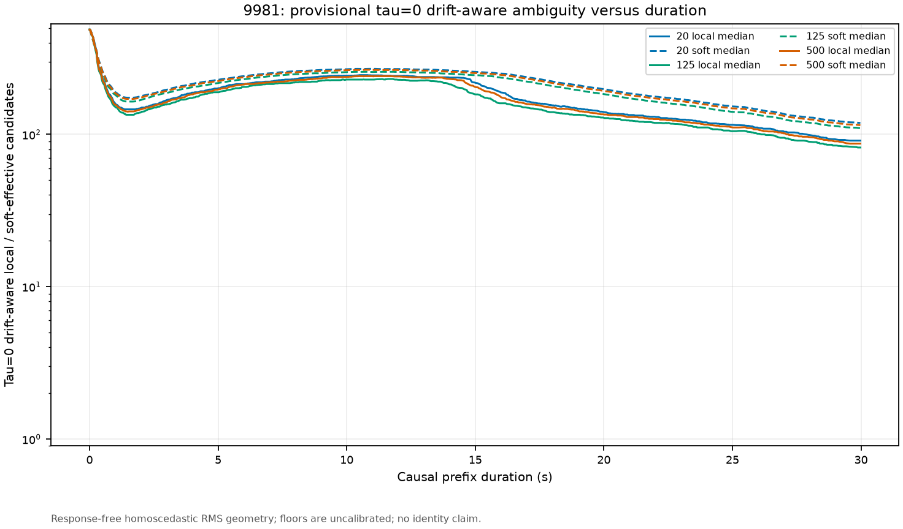
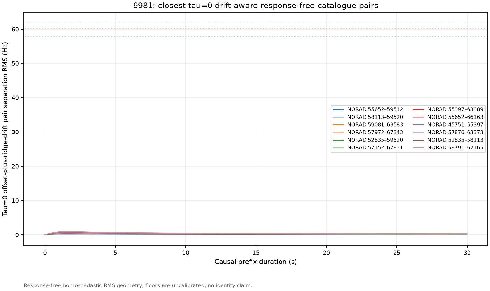
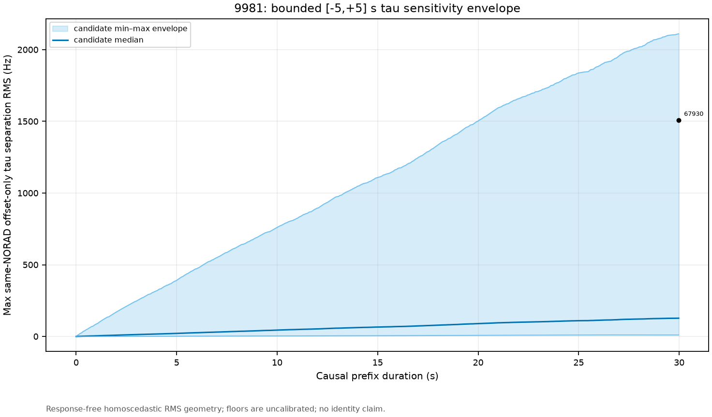
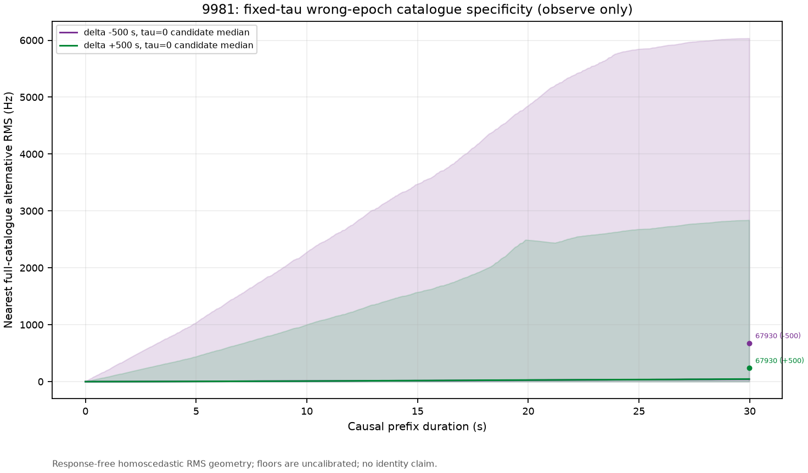
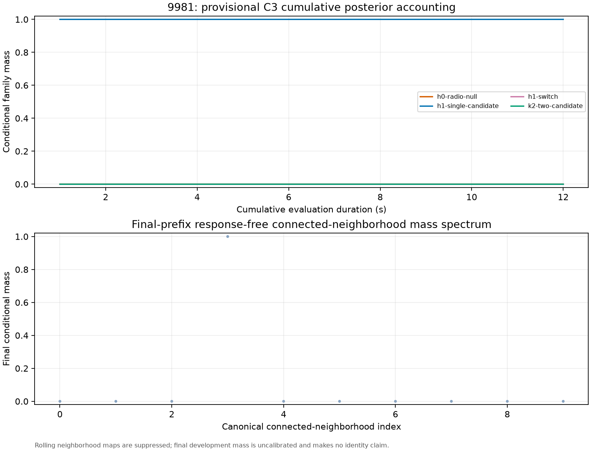
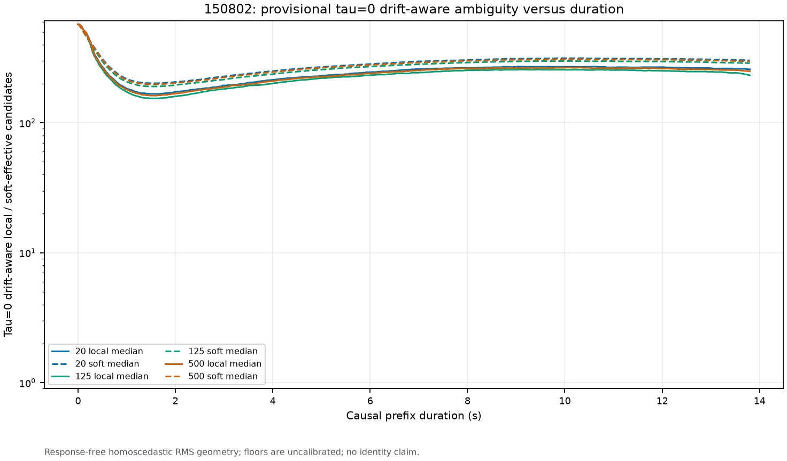
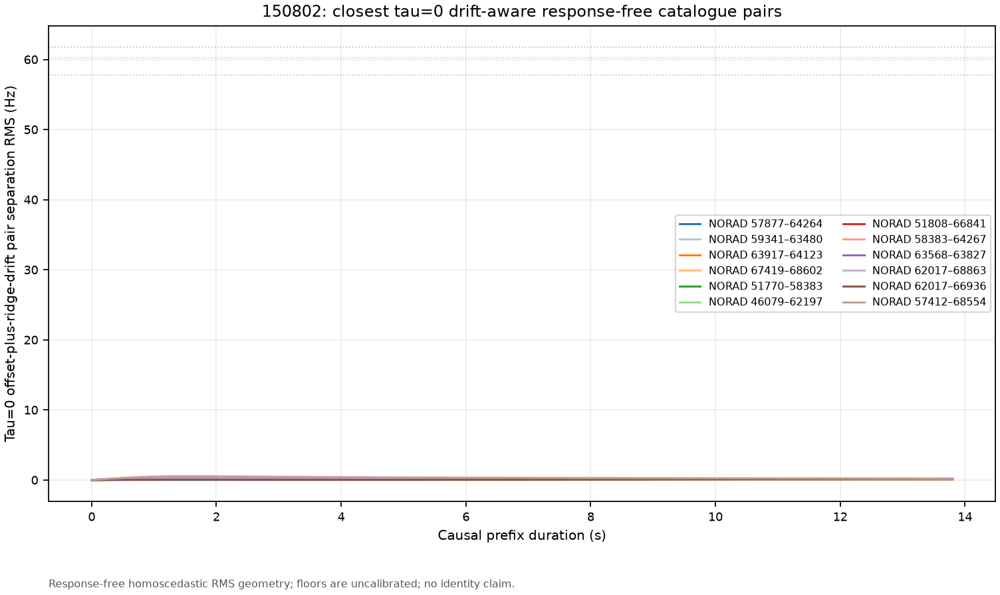
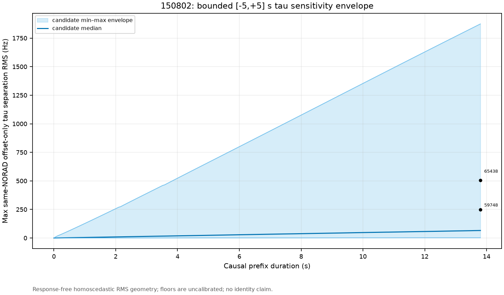
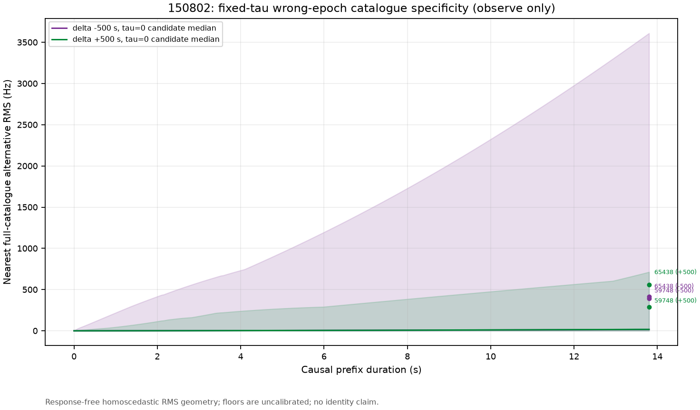
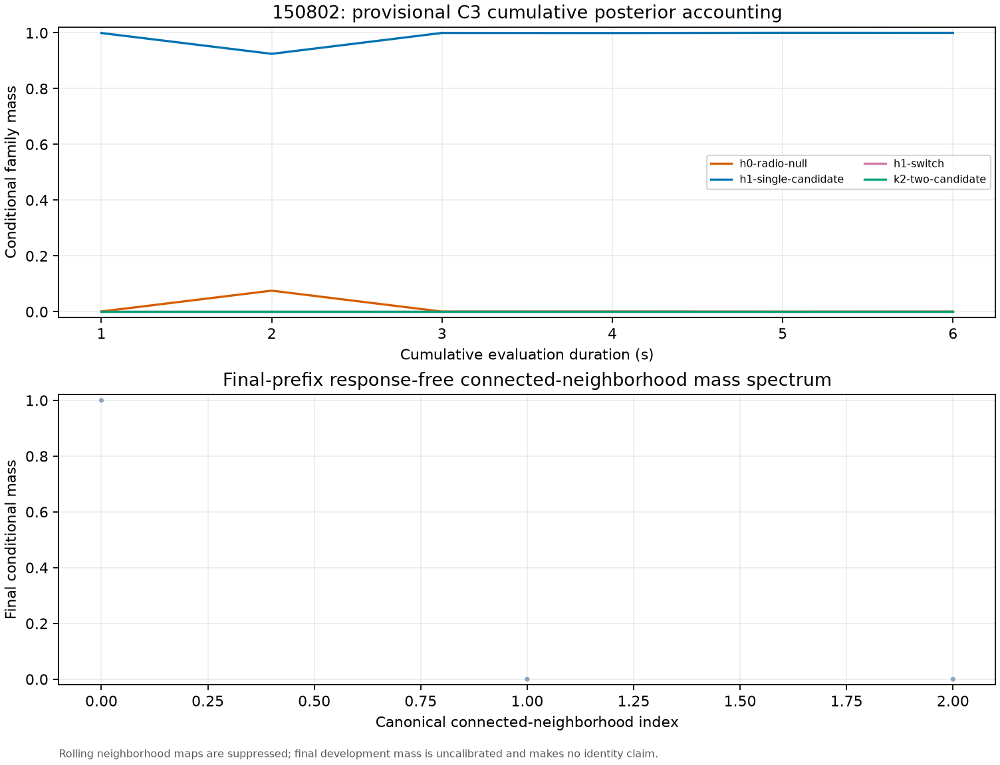

# Satellite Tracking C1/C2/C3 Opened-Arc Checkpoints

## Introduction and motivation

This hash-authorized run asks whether the two registered POST-FIX long arcs contain enough response-free catalogue geometry and common-block predictive evidence to narrow satellite hypotheses. It is opened-development evidence, not independent confirmation.

## Background

Earlier opened-arc work recovered repeatable curvature, but short and similar Starlink Doppler arcs left multiple catalogue candidates close after a CFO offset was removed. C1 therefore measures catalogue geometry without response selection; C2 places orbit, radio-polynomial, and null states on common future blocks; C3 retains response-free connected neighborhoods rather than turning optimizer convergence into identity. These single-linkage neighborhoods are not cliques.

## Authority and claim boundary

Execution amendment: `2026-08-27-satellite-tracking-checkpoints-opened-arcs-attempt1` (`sha256:a3efbcd49a44a0b60fdcd41fc930cad9d7c771ec6c7f667f3af6a22657c3c25f`).

The exact base protocol, operational roadmap, implementation commit/tree/files, two sealed result archives, two causal TLE snapshots, and all numerical controls were authenticated before analysis. No new RF was collected and no IQ was read.

C2 remains incomplete: its authority has only 3 independent background pairs against the formal 19-pair rank floor. The covariance and all posterior masses remain explicitly uncalibrated. The registered graph does not provide a complete detector-opportunity universe, so coverage is conditioned on observed rows and C2 is forced to abstain. The +/-500 s fields are fixed at tau=0 in both fields, observe-only, and neither a null distribution nor an identity gate.

## Methods

For each arc, the tool parsed only the sealed leading response-free field-bank receipts, rebuilt digest-identical -500/0/+500 catalogue banks, computed causal C1 observability in an offset-only sensitivity lane and a receiver-basis-aligned offset-plus-ridge-drift principal lane, and overlaid the hash-bound 20/125/500 ms descriptive floors. It then scored the complete true-time catalogue-tau inventory and radio/null families on common chronological blocks. The final 125 ms C1 candidate-identity graph minimizes the offset-plus-ridge-drift separation over the complete cross-product of independently allowed tau states. Its response-free component label is then propagated across that candidate's bounded tau states before the C3 descriptive closure reducer was called. Rolling C3 neighborhood maps are deliberately suppressed; only the final-prefix map is summarized.

The 20/125/500 ms overlays are detached holdout forecast-RMS sensitivity scales (61.747293, 57.753810, and 60.288854 Hz). They are not actual 20/125/500 ms reprocessing of either long arc and are not calibrated covariance estimates.
The receiver and transmitter prior scales are frozen provisional development assumptions, not empirically calibrated nuisance distributions.

## Results

### Arc 9981

- Observations: 881; true-time candidates: 488; tau states per candidate: 41.
- C1 125 ms fully tau-profiled drift-aware connected neighborhoods: 10; largest / singleton neighborhoods: 466 / 5; candidate-identity edges: 18461; median local candidate count: 99.000.
- C1 exact tau-profile work: 861 distance matrices / 180641987904 pair-observation evaluations. The separately plotted tau=0 drift lane has median local / soft-effective candidate counts 82.000 / 109.905.
- C1 -500 s nearest-curve final minimum/median RMS: 0.962599 / 41.243652 Hz (true tau=0 versus delta -500 s tau=0; observe only).
- C1 +500 s nearest-curve final minimum/median RMS: 0.409417 / 45.495329 Hz (true tau=0 versus delta +500 s tau=0; observe only).
- Highlighted NORAD 67930: 125 ms C1 connected-neighborhood size 4, membership {54758, 59523, 64746, 67930}.
- C2 opportunity coverage: incomplete universe; coverage is conditioned on observed rows; forced abstention diagnostics: `["incomplete-opportunity-inventory"]`.
- C2 final conditional family mass: `{"catalogue-orbit": 0.9999999382681111, "null": 0.0, "radio-polynomial": 6.173165905388766e-08}`. These are not calibrated probabilities.
- C3 descriptive outcome: **unresolved** (`incomplete-opportunity-inventory`); conditional candidate / H0 radio-or-unassigned mass: 1.000000 / 0.000000; effective candidate connected-neighborhood count: 1.000.
- Top provisional C3 candidate states (not calibrated identity):
  - NORAD 67930, tau -1 s, conditional mass 0.62090568, connected neighborhood `sha256:29f517cb1cac3872384b0ea5b246bb07549238ddb6d174f5d98e2e5ba338f211`.
  - NORAD 67930, tau -1.25 s, conditional mass 0.21211179, connected neighborhood `sha256:29f517cb1cac3872384b0ea5b246bb07549238ddb6d174f5d98e2e5ba338f211`.
  - NORAD 67930, tau -0.75 s, conditional mass 0.15741751, connected neighborhood `sha256:29f517cb1cac3872384b0ea5b246bb07549238ddb6d174f5d98e2e5ba338f211`.
  - NORAD 67930, tau -1.5 s, conditional mass 0.00577395, connected neighborhood `sha256:29f517cb1cac3872384b0ea5b246bb07549238ddb6d174f5d98e2e5ba338f211`.
  - NORAD 67930, tau -0.5 s, conditional mass 0.00375567, connected neighborhood `sha256:29f517cb1cac3872384b0ea5b246bb07549238ddb6d174f5d98e2e5ba338f211`.
- Top provisional C3 connected neighborhoods (single-linkage, not calibrated identity):
  - NORAD set 54758/59523/64746/67930, conditional total/within-candidate mass 0.99999994 / 1.00000000, connected neighborhood `sha256:29f517cb1cac3872384b0ea5b246bb07549238ddb6d174f5d98e2e5ba338f211`.
  - NORAD set 47767, conditional total/within-candidate mass 0.00000000 / 0.00000000, connected neighborhood `sha256:07c76414d0fef13342a809dc1c4914c852d8ed58c69641c214e8387a05a0b7df`.
  - NORAD set 57342/63195/69536, conditional total/within-candidate mass 0.00000000 / 0.00000000, connected neighborhood `sha256:080230717ed00c0b043f9e808125a03a9e27bdd2385ea003d260178a27eefc39`.
  - NORAD set 44714/45367/45368/45374/45379/45383/45542/45676/45693/45751/46033/46064/46674/47385/47386/47388/47628/47742/47747/47752/48095/48100/48117/48119/48133/48295/48310/48314/48319/48334/48437/48453/48568/48575/48578/48582/48593/48656/48670/48671/48691/48694/49736/49740/49741/49752/50812/50814/50837/51857/51869/51871/51994/52094/52270/52273/52282/52287/52455/52469/52476/52486/52503/52540/52548/52560/52561/52566/52569/52586/52664/52673/52684/52835/52844/52849/52852/52860/52866/53004/53009/53155/53178/53182/53214/53221/53229/53275/53388/53416/53418/53439/53532/53536/53540/53551/53555/53561/53572/53575/53577/54157/54162/54165/54770/54788/54797/55274/55277/55355/55357/55361/55364/55375/55397/55400/55405/55453/55457/55465/55469/55478/55481/55486/55495/55497/55500/55597/55615/55639/55650/55652/55664/55668/55782/55783/55785/56505/56524/56535/56537/56544/56555/56703/57113/57114/57125/57127/57130/57138/57143/57152/57291/57334/57339/57355/57361/57372/57377/57380/57462/57815/57816/57875/57876/57893/57902/57923/57965/57972/57977/57984/58040/58041/58103/58109/58113/58245/58247/58248/58249/58371/58372/58547/58736/58738/58742/58834/58853/58855/58866/58871/58872/58873/59005/59008/59081/59089/59203/59215/59263/59270/59306/59317/59340/59353/59367/59423/59491/59506/59512/59520/59539/59554/59572/59791/59794/59842/59853/59863/59867/59930/59938/59958/59963/60019/60060/60061/60096/60108/60114/60115/60191/60262/60277/60281/60297/60302/60334/60335/60340/60345/60346/60398/60722/60907/61065/61205/61259/61262/61531/61700/61705/61713/61727/61848/61849/61863/61891/61892/61921/61952/61956/62024/62033/62049/62050/62054/62094/62165/62176/62194/62205/62206/62227/62229/62269/62309/62310/62429/62494/62497/62526/62531/62571/62606/62839/62854/62871/62872/62875/62893/62908/62919/62988/63025/63279/63280/63367/63372/63373/63389/63435/63465/63468/63481/63483/63487/63505/63561/63570/63582/63583/63591/63665/63752/63759/63763/64008/64101/64118/64123/64132/64171/64181/64193/64206/64220/64226/64258/64260/64261/64278/64281/64303/64318/64358/64362/64366/64367/64419/64436/64441/64451/64460/64481/64673/64726/64740/65056/65058/65214/65218/65225/65529/65531/65541/65597/65604/65610/65842/65848/65922/65923/65927/66012/66023/66029/66093/66105/66108/66127/66135/66152/66158/66161/66163/66173/66269/66271/66283/66332/66338/66433/66434/66436/66444/66457/66465/66480/66505/66523/66526/66528/66539/66567/66582/66583/66617/66628/66637/66641/66849/66850/66869/66870/67075/67083/67086/67174/67175/67177/67194/67199/67202/67216/67312/67320/67326/67343/67345/67407/67417/67420/67424/67447/67464/67503/67516/67549/67572/67573/67598/67600/67726/67821/67824/67841/67842/67881/67896/67916/67917/67931/68047/68050/68059/68068/68072/68084/68090/68510/68514/68704/68705/68707/69519/69521/69522/69821/69823/69841/69947/69965/100055/100299, conditional total/within-candidate mass 0.00000000 / 0.00000000, connected neighborhood `sha256:092395c7b86c00fd09b2b45e13b77ef06d5217c50846874f0ef88096cd7e3a47`.
  - NORAD set 52679/52838/59755/62025/62042/63064/67521, conditional total/within-candidate mass 0.00000000 / 0.00000000, connected neighborhood `sha256:4f8f905eb89779e932d3196b00cf35fb3a9a2b84eae9892d7c707dd61e6525c8`.
- Full streamed result: `9981-checkpoint-result.json.zst` (`sha256:e558c458edac86b9a98511226ab3af99c80814fe35b4f50ff3dc45e894b264da`).

Figures:

### Arc 150802

- Observations: 550; true-time candidates: 573; tau states per candidate: 41.
- C1 125 ms fully tau-profiled drift-aware connected neighborhoods: 3; largest / singleton neighborhoods: 571 / 2; candidate-identity edges: 58886; median local candidate count: 252.000.
- C1 exact tau-profile work: 861 distance matrices / 155480197950 pair-observation evaluations. The separately plotted tau=0 drift lane has median local / soft-effective candidate counts 232.000 / 287.995.
- C1 -500 s nearest-curve final minimum/median RMS: 0.320054 / 15.487749 Hz (true tau=0 versus delta -500 s tau=0; observe only).
- C1 +500 s nearest-curve final minimum/median RMS: 0.156187 / 16.975546 Hz (true tau=0 versus delta +500 s tau=0; observe only).
- Highlighted NORAD 59748: 125 ms C1 connected-neighborhood size 571, membership {44752, 45189, 45230, 45367, 45564, 45671, 45710, 46045, 46060, 46074, 46076, 46079, 46080, 47356, 47373, 47377, 47621, 47652, 47723, 48294, 48304, 48311, 48321, 48325, 48362, 48364, 48370, 48397, 48553, 48564, 48640, 48643, 48663, 48668, 48687, 51716, 51719, 51745, 51770, 51776, 51780, 51807, 51808, 51810, 51814, 51862, 51863, 51864, 51881, 51882, 51883, 51887, 51896, 51956, 51995, 52001, 52123, 52132, 52276, 52281, 52298, 52312, 52471, 52478, 52482, 52483, 52485, 52501, 52584, 52833, 52839, 52867, 52871, 52988, 53002, 53014, 53015, 53018, 53019, 53031, 53408, 53429, 53529, 53531, 53683, 53825, 53826, 53833, 53893, 53908, 53920, 54083, 54088, 54176, 54179, 54773, 54783, 54798, 54800, 55313, 55337, 55346, 55432, 55435, 55677, 56126, 56141, 56292, 56301, 56328, 56338, 56349, 56357, 56358, 56385, 56393, 56395, 56406, 56410, 56413, 56423, 56459, 56466, 56475, 56478, 56490, 56506, 56517, 56520, 56541, 56548, 56550, 56688, 56699, 56702, 56708, 56767, 56783, 56786, 56810, 57109, 57126, 57129, 57137, 57149, 57155, 57300, 57302, 57330, 57331, 57345, 57349, 57352, 57354, 57359, 57368, 57407, 57410, 57412, 57416, 57741, 57748, 57750, 57753, 57782, 57784, 57788, 57811, 57812, 57867, 57868, 57870, 57877, 57914, 57937, 57943, 58007, 58038, 58184, 58219, 58383, 58393, 58422, 58515, 58536, 58552, 58608, 58609, 58729, 58769, 58778, 58787, 58807, 58868, 59010, 59017, 59326, 59341, 59352, 59354, 59370, 59424, 59724, 59734, 59737, 59738, 59748, 59786, 59789, 59845, 59849, 59850, 59855, 59862, 59964, 60022, 60024, 60035, 60053, 60091, 60104, 60127, 60190, 60257, 60265, 60266, 60274, 60287, 60291, 60300, 60301, 60332, 60349, 60408, 60721, 60906, 60907, 60937, 61066, 61205, 61252, 61509, 61520, 61522, 61590, 61635, 61666, 61680, 61693, 61707, 61711, 61714, 61726, 61847, 61851, 61857, 61858, 61918, 61924, 61926, 61966, 61975, 61976, 62014, 62017, 62052, 62061, 62104, 62148, 62149, 62158, 62159, 62162, 62197, 62213, 62227, 62281, 62432, 62433, 62436, 62462, 62493, 62499, 62527, 62572, 62605, 62737, 62741, 62748, 62750, 62831, 62908, 62984, 62990, 63001, 63065, 63082, 63083, 63086, 63089, 63114, 63186, 63283, 63314, 63370, 63387, 63438, 63447, 63451, 63469, 63474, 63477, 63480, 63484, 63486, 63507, 63563, 63568, 63664, 63665, 63752, 63804, 63809, 63817, 63827, 63903, 63914, 63917, 63967, 63968, 64023, 64036, 64040, 64044, 64081, 64112, 64119, 64123, 64132, 64135, 64172, 64179, 64204, 64208, 64214, 64215, 64216, 64217, 64257, 64259, 64264, 64265, 64267, 64271, 64274, 64440, 64450, 64463, 64495, 64602, 64619, 64620, 64666, 64676, 64681, 64696, 64707, 64791, 64800, 64814, 64844, 64860, 64861, 64908, 64919, 64929, 64933, 64936, 64950, 65083, 65093, 65099, 65184, 65185, 65243, 65381, 65392, 65438, 65441, 65452, 65652, 65655, 65676, 65690, 65699, 65703, 65738, 65753, 65797, 65812, 65813, 65823, 65827, 65835, 65840, 65845, 65896, 66018, 66022, 66028, 66109, 66110, 66320, 66324, 66333, 66337, 66344, 66445, 66448, 66449, 66471, 66531, 66542, 66619, 66624, 66634, 66643, 66821, 66830, 66837, 66841, 66847, 66888, 66891, 66896, 66897, 66931, 66936, 66938, 66952, 67017, 67079, 67094, 67106, 67108, 67127, 67128, 67352, 67353, 67359, 67408, 67414, 67419, 67429, 67445, 67454, 67460, 67467, 67469, 67648, 67662, 67671, 67812, 67816, 67825, 67834, 67905, 67906, 67920, 67921, 67938, 67939, 67954, 67967, 67968, 67970, 68045, 68145, 68148, 68153, 68209, 68322, 68324, 68331, 68334, 68336, 68348, 68517, 68521, 68526, 68533, 68534, 68535, 68554, 68556, 68557, 68558, 68602, 68621, 68622, 68663, 68664, 68712, 68713, 68714, 68734, 68735, 68747, 68768, 68771, 68814, 68815, 68816, 68860, 68862, 68863, 68908, 68909, 69030, 69042, 69141, 69142, 69143, 69225, 69226, 69229, 69247, 69248, 69249, 69250, 69302, 69303, 69304, 69347, 69348, 69366, 69458, 69460, 69461, 69464, 69500, 69501, 69527, 69528, 69560, 69561, 69562, 69677, 69678, 69700, 69711, 69712, 69741, 69743, 69753, 69986, 69989, 69991, 69993, 69998, 100002, 100017, 100019, 100111, 100114, 100194, 100294, 100295, 100296, 100297, 100298}.
- Highlighted NORAD 65438: 125 ms C1 connected-neighborhood size 571, membership {44752, 45189, 45230, 45367, 45564, 45671, 45710, 46045, 46060, 46074, 46076, 46079, 46080, 47356, 47373, 47377, 47621, 47652, 47723, 48294, 48304, 48311, 48321, 48325, 48362, 48364, 48370, 48397, 48553, 48564, 48640, 48643, 48663, 48668, 48687, 51716, 51719, 51745, 51770, 51776, 51780, 51807, 51808, 51810, 51814, 51862, 51863, 51864, 51881, 51882, 51883, 51887, 51896, 51956, 51995, 52001, 52123, 52132, 52276, 52281, 52298, 52312, 52471, 52478, 52482, 52483, 52485, 52501, 52584, 52833, 52839, 52867, 52871, 52988, 53002, 53014, 53015, 53018, 53019, 53031, 53408, 53429, 53529, 53531, 53683, 53825, 53826, 53833, 53893, 53908, 53920, 54083, 54088, 54176, 54179, 54773, 54783, 54798, 54800, 55313, 55337, 55346, 55432, 55435, 55677, 56126, 56141, 56292, 56301, 56328, 56338, 56349, 56357, 56358, 56385, 56393, 56395, 56406, 56410, 56413, 56423, 56459, 56466, 56475, 56478, 56490, 56506, 56517, 56520, 56541, 56548, 56550, 56688, 56699, 56702, 56708, 56767, 56783, 56786, 56810, 57109, 57126, 57129, 57137, 57149, 57155, 57300, 57302, 57330, 57331, 57345, 57349, 57352, 57354, 57359, 57368, 57407, 57410, 57412, 57416, 57741, 57748, 57750, 57753, 57782, 57784, 57788, 57811, 57812, 57867, 57868, 57870, 57877, 57914, 57937, 57943, 58007, 58038, 58184, 58219, 58383, 58393, 58422, 58515, 58536, 58552, 58608, 58609, 58729, 58769, 58778, 58787, 58807, 58868, 59010, 59017, 59326, 59341, 59352, 59354, 59370, 59424, 59724, 59734, 59737, 59738, 59748, 59786, 59789, 59845, 59849, 59850, 59855, 59862, 59964, 60022, 60024, 60035, 60053, 60091, 60104, 60127, 60190, 60257, 60265, 60266, 60274, 60287, 60291, 60300, 60301, 60332, 60349, 60408, 60721, 60906, 60907, 60937, 61066, 61205, 61252, 61509, 61520, 61522, 61590, 61635, 61666, 61680, 61693, 61707, 61711, 61714, 61726, 61847, 61851, 61857, 61858, 61918, 61924, 61926, 61966, 61975, 61976, 62014, 62017, 62052, 62061, 62104, 62148, 62149, 62158, 62159, 62162, 62197, 62213, 62227, 62281, 62432, 62433, 62436, 62462, 62493, 62499, 62527, 62572, 62605, 62737, 62741, 62748, 62750, 62831, 62908, 62984, 62990, 63001, 63065, 63082, 63083, 63086, 63089, 63114, 63186, 63283, 63314, 63370, 63387, 63438, 63447, 63451, 63469, 63474, 63477, 63480, 63484, 63486, 63507, 63563, 63568, 63664, 63665, 63752, 63804, 63809, 63817, 63827, 63903, 63914, 63917, 63967, 63968, 64023, 64036, 64040, 64044, 64081, 64112, 64119, 64123, 64132, 64135, 64172, 64179, 64204, 64208, 64214, 64215, 64216, 64217, 64257, 64259, 64264, 64265, 64267, 64271, 64274, 64440, 64450, 64463, 64495, 64602, 64619, 64620, 64666, 64676, 64681, 64696, 64707, 64791, 64800, 64814, 64844, 64860, 64861, 64908, 64919, 64929, 64933, 64936, 64950, 65083, 65093, 65099, 65184, 65185, 65243, 65381, 65392, 65438, 65441, 65452, 65652, 65655, 65676, 65690, 65699, 65703, 65738, 65753, 65797, 65812, 65813, 65823, 65827, 65835, 65840, 65845, 65896, 66018, 66022, 66028, 66109, 66110, 66320, 66324, 66333, 66337, 66344, 66445, 66448, 66449, 66471, 66531, 66542, 66619, 66624, 66634, 66643, 66821, 66830, 66837, 66841, 66847, 66888, 66891, 66896, 66897, 66931, 66936, 66938, 66952, 67017, 67079, 67094, 67106, 67108, 67127, 67128, 67352, 67353, 67359, 67408, 67414, 67419, 67429, 67445, 67454, 67460, 67467, 67469, 67648, 67662, 67671, 67812, 67816, 67825, 67834, 67905, 67906, 67920, 67921, 67938, 67939, 67954, 67967, 67968, 67970, 68045, 68145, 68148, 68153, 68209, 68322, 68324, 68331, 68334, 68336, 68348, 68517, 68521, 68526, 68533, 68534, 68535, 68554, 68556, 68557, 68558, 68602, 68621, 68622, 68663, 68664, 68712, 68713, 68714, 68734, 68735, 68747, 68768, 68771, 68814, 68815, 68816, 68860, 68862, 68863, 68908, 68909, 69030, 69042, 69141, 69142, 69143, 69225, 69226, 69229, 69247, 69248, 69249, 69250, 69302, 69303, 69304, 69347, 69348, 69366, 69458, 69460, 69461, 69464, 69500, 69501, 69527, 69528, 69560, 69561, 69562, 69677, 69678, 69700, 69711, 69712, 69741, 69743, 69753, 69986, 69989, 69991, 69993, 69998, 100002, 100017, 100019, 100111, 100114, 100194, 100294, 100295, 100296, 100297, 100298}.
- C2 opportunity coverage: incomplete universe; coverage is conditioned on observed rows; forced abstention diagnostics: `["incomplete-opportunity-inventory"]`.
- C2 final conditional family mass: `{"catalogue-orbit": 0.9997299598542139, "null": 0.0, "radio-polynomial": 0.00027004014569859315}`. These are not calibrated probabilities.
- C3 descriptive outcome: **unresolved** (`incomplete-opportunity-inventory`); conditional candidate / H0 radio-or-unassigned mass: 0.999730 / 0.000270; effective candidate connected-neighborhood count: 1.000.
- Top provisional C3 candidate states (not calibrated identity):
  - NORAD 59748, tau -0.25 s, conditional mass 0.14308668, connected neighborhood `sha256:35de8979ca8028df5cc2d8c9bb928a2ffcb56d9abd99516a13b3b052762451ca`.
  - NORAD 59748, tau -0.5 s, conditional mass 0.14195701, connected neighborhood `sha256:35de8979ca8028df5cc2d8c9bb928a2ffcb56d9abd99516a13b3b052762451ca`.
  - NORAD 59748, tau 0 s, conditional mass 0.12642810, connected neighborhood `sha256:35de8979ca8028df5cc2d8c9bb928a2ffcb56d9abd99516a13b3b052762451ca`.
  - NORAD 59748, tau -0.75 s, conditional mass 0.12336674, connected neighborhood `sha256:35de8979ca8028df5cc2d8c9bb928a2ffcb56d9abd99516a13b3b052762451ca`.
  - NORAD 59748, tau 0.25 s, conditional mass 0.09799358, connected neighborhood `sha256:35de8979ca8028df5cc2d8c9bb928a2ffcb56d9abd99516a13b3b052762451ca`.
- Top provisional C3 connected neighborhoods (single-linkage, not calibrated identity):
  - NORAD set 44752/45189/45230/45367/45564/45671/45710/46045/46060/46074/46076/46079/46080/47356/47373/47377/47621/47652/47723/48294/48304/48311/48321/48325/48362/48364/48370/48397/48553/48564/48640/48643/48663/48668/48687/51716/51719/51745/51770/51776/51780/51807/51808/51810/51814/51862/51863/51864/51881/51882/51883/51887/51896/51956/51995/52001/52123/52132/52276/52281/52298/52312/52471/52478/52482/52483/52485/52501/52584/52833/52839/52867/52871/52988/53002/53014/53015/53018/53019/53031/53408/53429/53529/53531/53683/53825/53826/53833/53893/53908/53920/54083/54088/54176/54179/54773/54783/54798/54800/55313/55337/55346/55432/55435/55677/56126/56141/56292/56301/56328/56338/56349/56357/56358/56385/56393/56395/56406/56410/56413/56423/56459/56466/56475/56478/56490/56506/56517/56520/56541/56548/56550/56688/56699/56702/56708/56767/56783/56786/56810/57109/57126/57129/57137/57149/57155/57300/57302/57330/57331/57345/57349/57352/57354/57359/57368/57407/57410/57412/57416/57741/57748/57750/57753/57782/57784/57788/57811/57812/57867/57868/57870/57877/57914/57937/57943/58007/58038/58184/58219/58383/58393/58422/58515/58536/58552/58608/58609/58729/58769/58778/58787/58807/58868/59010/59017/59326/59341/59352/59354/59370/59424/59724/59734/59737/59738/59748/59786/59789/59845/59849/59850/59855/59862/59964/60022/60024/60035/60053/60091/60104/60127/60190/60257/60265/60266/60274/60287/60291/60300/60301/60332/60349/60408/60721/60906/60907/60937/61066/61205/61252/61509/61520/61522/61590/61635/61666/61680/61693/61707/61711/61714/61726/61847/61851/61857/61858/61918/61924/61926/61966/61975/61976/62014/62017/62052/62061/62104/62148/62149/62158/62159/62162/62197/62213/62227/62281/62432/62433/62436/62462/62493/62499/62527/62572/62605/62737/62741/62748/62750/62831/62908/62984/62990/63001/63065/63082/63083/63086/63089/63114/63186/63283/63314/63370/63387/63438/63447/63451/63469/63474/63477/63480/63484/63486/63507/63563/63568/63664/63665/63752/63804/63809/63817/63827/63903/63914/63917/63967/63968/64023/64036/64040/64044/64081/64112/64119/64123/64132/64135/64172/64179/64204/64208/64214/64215/64216/64217/64257/64259/64264/64265/64267/64271/64274/64440/64450/64463/64495/64602/64619/64620/64666/64676/64681/64696/64707/64791/64800/64814/64844/64860/64861/64908/64919/64929/64933/64936/64950/65083/65093/65099/65184/65185/65243/65381/65392/65438/65441/65452/65652/65655/65676/65690/65699/65703/65738/65753/65797/65812/65813/65823/65827/65835/65840/65845/65896/66018/66022/66028/66109/66110/66320/66324/66333/66337/66344/66445/66448/66449/66471/66531/66542/66619/66624/66634/66643/66821/66830/66837/66841/66847/66888/66891/66896/66897/66931/66936/66938/66952/67017/67079/67094/67106/67108/67127/67128/67352/67353/67359/67408/67414/67419/67429/67445/67454/67460/67467/67469/67648/67662/67671/67812/67816/67825/67834/67905/67906/67920/67921/67938/67939/67954/67967/67968/67970/68045/68145/68148/68153/68209/68322/68324/68331/68334/68336/68348/68517/68521/68526/68533/68534/68535/68554/68556/68557/68558/68602/68621/68622/68663/68664/68712/68713/68714/68734/68735/68747/68768/68771/68814/68815/68816/68860/68862/68863/68908/68909/69030/69042/69141/69142/69143/69225/69226/69229/69247/69248/69249/69250/69302/69303/69304/69347/69348/69366/69458/69460/69461/69464/69500/69501/69527/69528/69560/69561/69562/69677/69678/69700/69711/69712/69741/69743/69753/69986/69989/69991/69993/69998/100002/100017/100019/100111/100114/100194/100294/100295/100296/100297/100298, conditional total/within-candidate mass 0.99972996 / 1.00000000, connected neighborhood `sha256:35de8979ca8028df5cc2d8c9bb928a2ffcb56d9abd99516a13b3b052762451ca`.
  - NORAD set 100103, conditional total/within-candidate mass 0.00000000 / 0.00000000, connected neighborhood `sha256:54c47f4421c1970538cf86b166ed1b0566f490fd84d22461564a083f1ffa5041`.
  - NORAD set 63142, conditional total/within-candidate mass 0.00000000 / 0.00000000, connected neighborhood `sha256:b744de12b1fc9b9a4b6ba56a8292f5b011befceded78e294a9570688a4aeb835`.
- Full streamed result: `150802-checkpoint-result.json.zst` (`sha256:710e2e78cd8215a39daa9e3e535e5b0c7ab8717bff48cc8f4338d1e42b37cf6a`).

Figures:

## C0-C7 checkpoint decision table

| Checkpoint | Decision after this run |
|---|---|
| C0 — evidence authority | **Green.** Exact registered graphs, sealed archives, causal TLE bytes, and response-free bank digests were authenticated. |
| C1 — observability atlas | **Executed, provisional.** Prefix tau=0 geometry, fully tau-profiled drift-aware 125 ms candidate neighborhoods, tau sensitivity, and observe-only +/-500 s alternatives are reported; the detached floors are uncalibrated. |
| C2 — common evidence scale | **Incomplete (3/19).** Common-block development scores exist, but the independent-pair rank floor is not met and covariance is not calibrated; the incomplete opportunity inventory forces abstention. |
| C3 — long-arc closure | **Descriptive; unresolved overall.** Reducer outcomes are conditional on an evaluated, uncalibrated inventory and cannot promote identity. |
| C4 — causal multi-dwell | **Not run on real downstream evidence.** V2 staging mechanics are implemented, but no real causal multi-dwell filter/evidence execution is established here. |
| C5 — frozen correction replay | **Blocked.** No independent same-NORAD recurrence is available for no-refit replay. |
| C6 — blinded positioning | **Held behind C5.** No real-data positioning validation is authorized by these checkpoint outputs. |
| C7 — untouched confirmation | **Not authorized.** No new RF collection is authorized. |

## Limitations

The candidate and tau inventories are complete for the sealed fields, but the measurement overlays and C2 covariance are not calibrated for identity-set coverage, and the detector-opportunity universe is incomplete. H1-switch and K=2 are reported as structurally inapplicable when the frozen one-episode inventory contains no explicit states. The two arcs are opened development data, and wrong-epoch comparisons are not exchangeable nulls.
The candidate-count and closest-pair figures are causal tau=0 sensitivity views. The C3 handoff instead uses the complete final-duration tau-profiled candidate graph; a prefix-by-prefix tau-profiled atlas remains future work.
C3 `rolling_summaries` are cumulative prefixes of one fixed chronological training/evaluation partition. This run does not execute distinct rolling-origin refits or future scores, so that roadmap deliverable remains open.

## Interpretation and next steps

Every outcome is provisional and conditioned on the evaluated model inventory. A concentrated optimizer or posterior does not establish NORAD identity. The next decision is whether C1 indicates geometry-, measurement-, or calibration-limited ambiguity; C2 must reach its independent calibration floor before any C3 mass can support a gate. No positioning, transferable correction, or secure identity claim is made.
