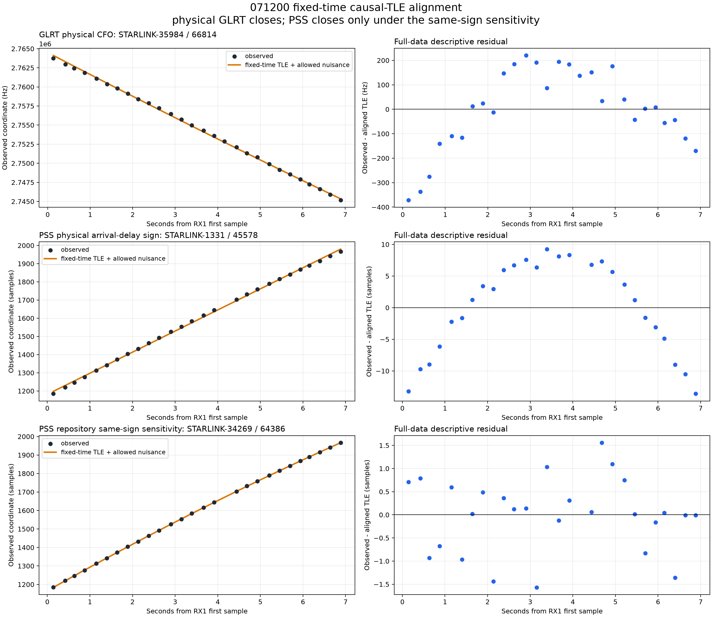
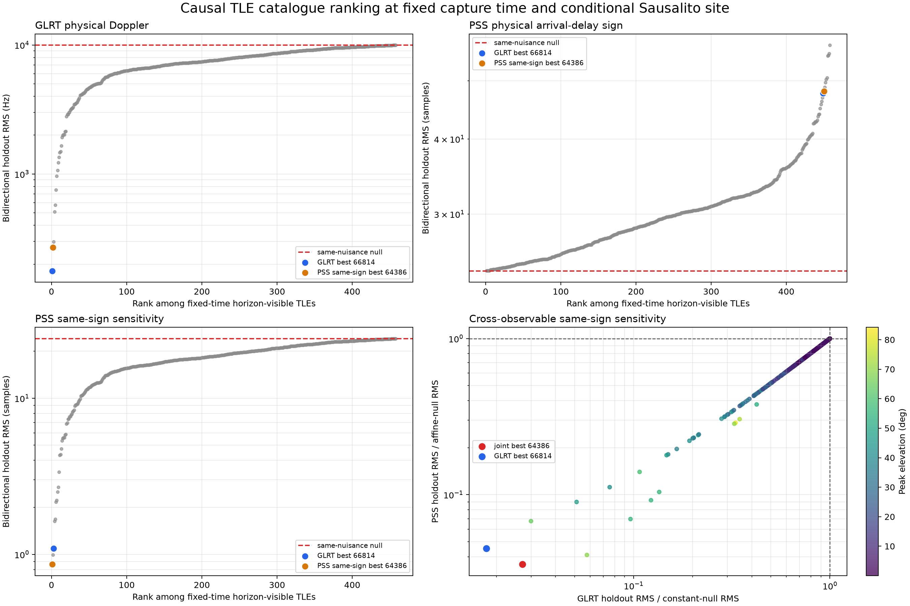

# Fixed-time causal-TLE alignment for `071200` PSS and GLRT

Capture: `cap-20260831T071200-9184cf0ad6cc`

Scope: the 27 qualified 15 MS/s PSS timing block medians and 28 classic GLRT continuity-segment
medians over the first 6.89 seconds

Status: **candidate-only conditional orbit compatibility; no satellite identity, decoded
synchronization, calibrated propagation delay, or calibrated clock claim**

## Conclusion

GLRT provides the better physically interpretable TLE lock in this capture. At the recorded UTC
and the conditional Spinnaker/Sausalito observer position, its best fixed-time TLE candidate
reduces bidirectional holdout RMS from a 9,973.8 Hz constant-CFO null to **177.1 Hz**. The fitted
curve uses one constant CFO offset and no time shift, Doppler scale, slope, or curvature nuisance.

PSS frame timing does not close under the conventional observed-minus-nominal arrival-delay sign.
Its best physical-sign catalogue candidate has 24.144 samples of holdout RMS, fractionally worse
than the 24.122-sample affine timing null. It is a grazing-horizon object with essentially zero
Doppler curvature and ranks last in the GLRT comparison.

The PSS result changes sharply under the repository same-sign sensitivity used in the preceding
PSS/GLRT report. With that sign, its best TLE candidate has **0.862 samples** of holdout RMS and is
GLRT rank 2; the GLRT winner is PSS same-sign rank 3. This confirms that both measurements contain
the same dominant orbital-shaped family, but it does not validate the PSS frame epoch as physical
arrival delay. The epoch remains template/channel-relative and clock-confounded.

## Frozen inputs

| Input | Value |
|---|---|
| RX1 first sample estimate | 2026-08-31 07:12:04.963802026 UTC |
| First-sample timing bracket | +/-0.562572 ms |
| TLE source | Space-Track GP 3LE legacy raw snapshot |
| TLE SHA-256 | `22b3616a4fc239761afedeaf7f12c62abc9dbb3808c620c0796a770e84f44b4b` |
| TLE collection-time authority | source filesystem mtime |
| TLE collection time | 2026-08-31 05:37:02.467628182 UTC |
| Collection age at first sample | 5,702.496 seconds |
| Catalogue elements | 11,043; no element epoch is after the capture |
| Conditional observer | 37.858988 N, 122.478103 W, -29 m ellipsoidal |
| Position authority | reviewed Spinnaker/Sausalito preset; not capture-bound GPS |
| PSS RF reference | 10.8251171875 GHz |
| GLRT RF reference | 10.9403125 GHz upper edge |

The best candidates' element epochs are 19 to 26 hours before the capture even though the
catalogue snapshot itself is only 95 minutes old. The antenna boresight and gain pattern are
unknown, so the candidate set is the geometric-horizon union rather than a beam association.

## Fair alignment model

The causal catalogue is propagated with SGP4 at the persisted receiver UTC and conditional site.
Of 11,043 elements, 458 are propagation-valid, plausibly orbital, and above the geometric horizon
at some point in the measured interval; 185 reach at least 10 degrees elevation.

No TLE is shifted in time. No frequency scale, linear drift, or curvature is fitted. The only
nuisances are those required by the observable:

```text
GLRT(t) = physical TLE Doppler(t) + constant CFO offset

PSS physical-delay model(t)
  = -integral(physical TLE Doppler)/(fRF/fs)
    + constant epoch + constant epoch rate * t
```

The PSS constant epoch is the unobservable integration constant. Constant epoch rate is equivalent
to one constant frequency/clock offset, matching the single constant CFO offset allowed to GLRT.
Neither can change TLE curvature.

Candidates are ranked by bidirectional temporal holdout. The first 60% fits only the allowed
nuisance and predicts the last 40%; then the last 60% predicts the first 40%. The ranking metric is
the quadratic mean of the two held-out RMS values.

## Physical-sign results

| Observable | Best catalogue label | Peak elevation | TLE Doppler rate near midpoint | Full RMS | Holdout RMS | Same-nuisance null |
|---|---|---:|---:|---:|---:|---:|
| GLRT CFO | STARLINK-35984 / NORAD 66814 | 58.93 deg | -2.781 kHz/s | 160.3 Hz | **177.1 Hz** | 9,973.8 Hz |
| PSS arrival delay | STARLINK-1331 / NORAD 45578 | 0.40 deg | -0.003 kHz/s | 7.144 samples | **24.144 samples** | 24.122 samples |

The GLRT candidate improves held-out mean squared error by 99.968%. Its forward and reverse
holdouts are 98.6 and 230.2 Hz. The TLE-constrained full RMS remains above the 51.1 Hz residual of
the free Huber quadratic in the preceding report, so the TLE explains the dominant trajectory
without outperforming a flexible descriptive polynomial.

The physical PSS model improves held-out mean squared error by -0.179%: it is slightly worse than
ignoring every TLE and fitting an affine timing line. The GLRT winner is PSS physical rank 449 of
458; the PSS physical winner is GLRT rank 458. No single physical-sign TLE closes both observables.



## PSS same-sign sensitivity

The diagnostic sensitivity reverses only the PSS timing-to-Doppler sign:

```text
PSS same-sign sensitivity(t)
  = +integral(physical TLE Doppler)/(fRF/fs)
    + constant epoch + constant epoch rate * t
```

| Result | Value |
|---|---:|
| Best PSS catalogue label | STARLINK-34269 / NORAD 64386 |
| Peak elevation | 63.19 deg |
| Midpoint TLE Doppler rate | -2.826 kHz/s |
| PSS full RMS | 0.785 samples |
| PSS bidirectional holdout RMS | 0.862 samples |
| MSE improvement over affine null | 99.872% |
| Rank in independent GLRT ordering | 2 of 458 |
| GLRT winner's PSS same-sign rank | 3 of 458 |

This is strong shape agreement and explains why the earlier repository-same-sign PSS and GLRT
rates looked mutually consistent. It is explicitly not a physical arrival-delay fit. Positive PSS
frame epoch means a later observed template start; conventional received-minus-transmitted
propagation Doppler carries the opposite sign. A known signed time-warp injection is required
before promoting either mapping.



## Interpretation

The supported result is:

- GLRT is strongly compatible with a physical orbit-Doppler curve at fixed capture time.
- PSS is strongly compatible with the same top catalogue family only in the internal same-sign
  timing coordinate.
- PSS remains a good frame-boundary lock, but it is not yet a calibrated propagation-delay lock.

The result does not identify NORAD 66814, NORAD 64386, or any other object. A 6.89-second arc,
458 visible candidates, a conditional site, unknown boresight, TLE element age, and shared IQ make
the labels hypotheses only. Secure identity requires longer or repeated arcs, independent
geometry, and a frozen prospective protocol.

## Artifacts and reproduction

- [Complete 458-candidate ledger](figures/2026_08_31_mixed_rate_pss_timing/cap-20260831T071200-9184cf0ad6cc/071200-pss-glrt-tle-alignment.json)
- [Alignment figure](figures/2026_08_31_mixed_rate_pss_timing/cap-20260831T071200-9184cf0ad6cc/071200-pss-glrt-tle-alignment.png)
- [Candidate-ranking figure](figures/2026_08_31_mixed_rate_pss_timing/cap-20260831T071200-9184cf0ad6cc/071200-tle-candidate-ranking.png)
- [Executed report producer](figures/2026_08_31_mixed_rate_pss_timing/cap-20260831T071200-9184cf0ad6cc/source/make_pss_glrt_causal_tle_alignment.py)

The capture, Standard artifact, and TLE archive were read only.
