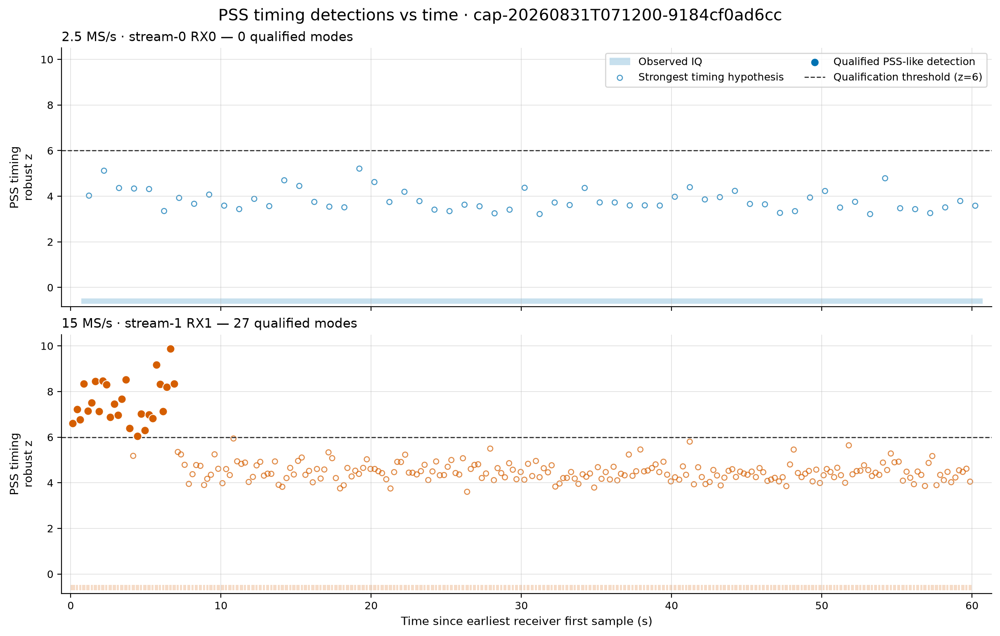
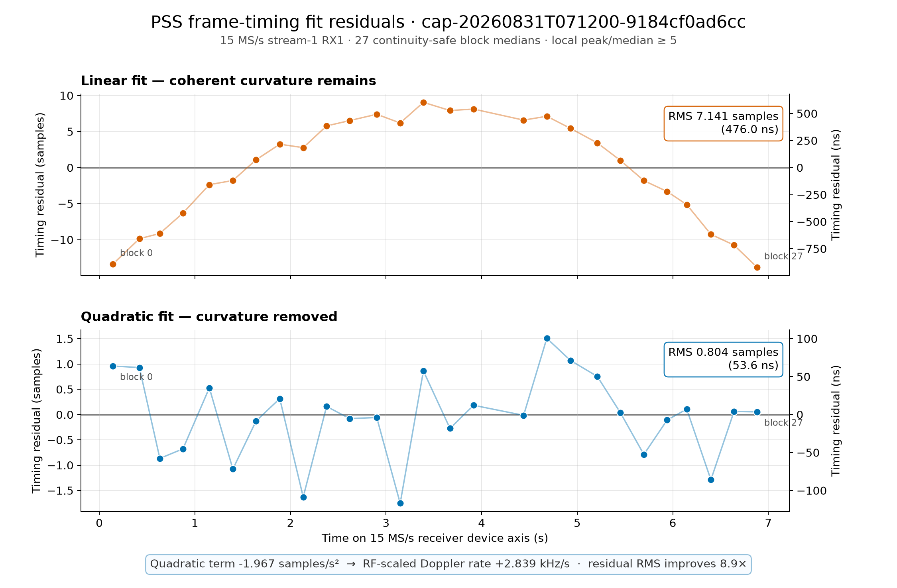
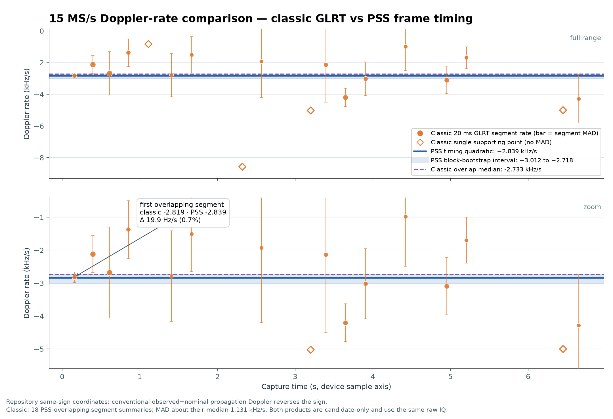
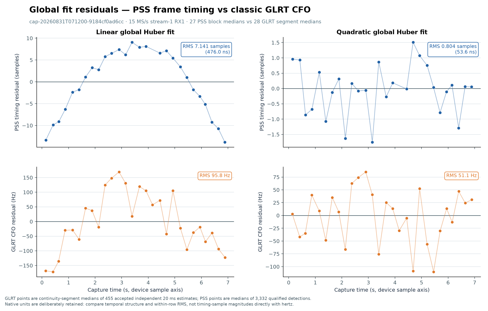
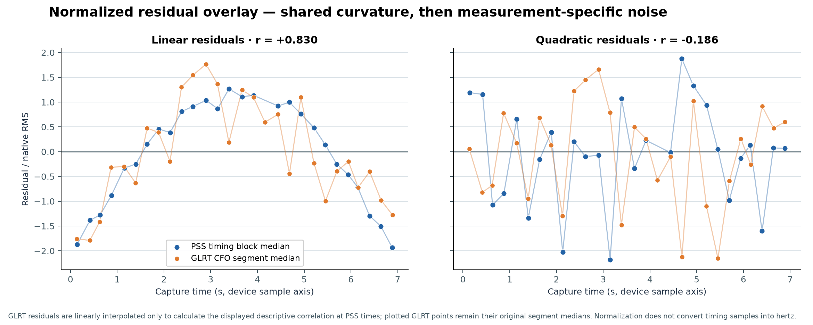
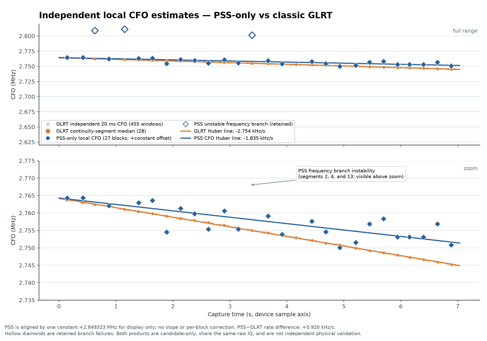
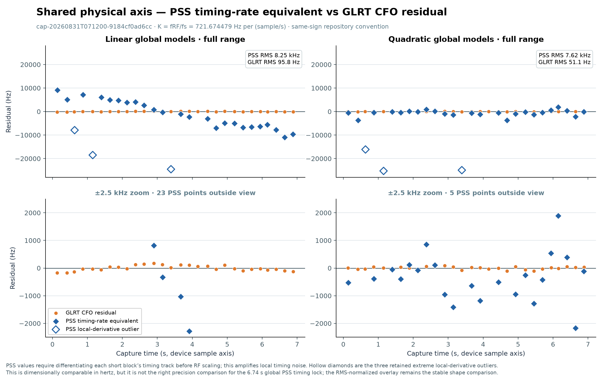

# PSS frame timing and GLRT Doppler comparison for `071200`

Capture: `cap-20260831T071200-9184cf0ad6cc`

Recorded: 2026-08-31 07:12:00 UTC

Scope: 15 MS/s upper-edge RX1 PSS timing, classic 20 ms GLRT CFO, and the simultaneous
2.5 MS/s RX0 control path

Status: **candidate-only scientific evidence; not a decoded synchronization, satellite identity,
or calibrated physical-Doppler result**

## Executive conclusion

The 15 MS/s path contains one convincing **PSS-like frame-timing episode** over the first 6.9
seconds of the receiver device axis. Twenty-seven continuity segments independently recover the
same smoothly moving 750 Hz frame epoch. The search qualifies 3,665 frame windows, of which 3,332
(90.9%) pass the stricter local peak-to-median gate used for the timing fit. The simultaneous
2.5 MS/s path produces no qualified PSS timing mode.

A global Huber quadratic reduces the 15 MS/s block-median timing residual from 7.141 samples
(476.0 ns) under a line to 0.804 samples (53.6 ns), an 8.88x RMS reduction. Its timing acceleration
maps to a repository-same-sign Doppler rate of **-2.839 kHz/s** at the assumed 10.8251171875 GHz RF
reference. Conventional observed-minus-nominal propagation Doppler reverses that sign to
**+2.839 kHz/s**.

The classic standard GLRT product provides a strong cross-observable consistency check:

- the first overlapping classic constant-rate segment is -2.819 kHz/s, only 19.9 Hz/s (0.7%) from
  the PSS timing rate;
- the median of the 18 overlapping classic segment-rate summaries is -2.733 kHz/s, 106 Hz/s
  (3.9%) from the PSS timing rate;
- both lie inside the descriptive PSS block-bootstrap interval of -3.012 to -2.718 kHz/s;
- linear-fit residuals from PSS timing and GLRT CFO have normalized correlation `+0.830`, showing
  that both observables expose the same broad curvature;
- after independent quadratic fits, residual correlation falls to `-0.186`, consistent with the
  shared smooth component having been removed.

This agreement is meaningful but not independent physical validation. Both analyses use the same
IQ, both are candidate-only, and receiver sample clock, receiver/LNB drift, transmitter clock, and
propagation remain confounded. The exploratory direct PSS carrier-CFO estimator is materially less
stable than the frame-timing result and is not ready to replace known-pilot GLRT CFO.

### Causal-TLE sign follow-up

The subsequent [fixed-time causal-TLE comparison](2026_08_31_071200_pss_glrt_causal_tle_alignment.md)
resolves an important limitation of the same-sign diagnostic. GLRT closes strongly to physical
received-minus-transmitted TLE Doppler. PSS closes to the same top catalogue family only when its
frame-epoch curvature retains the repository same-sign mapping. Under conventional
observed-minus-nominal arrival delay, its sign is opposite the visible TLE field and it does not
improve over an affine timing null. The PSS timing lock remains valid, but its conversion to
physical propagation Doppler is not calibrated.

## Provenance and immutable inputs

| Item | Value |
|---|---|
| Recording manifest | `sha256:be6a196eaf0894667b835a73afe3aa83ff3200eadc0349b4a45cc5420f7b6f09` |
| PSS replay generated | 2026-08-31 19:49:50.546256 UTC |
| Standard reprocessing run | `reprocess-e36d5f3996ad4d88ac908948c690abc2` |
| Standard release | `202a9cecc857ce2fdb9213b9eccfc98e41a7c3c9` |
| Classic scientific artifact | `standard.full-capture-glrt20ms.v2.json` |
| Classic artifact path digest | `sha256:58f1c0b2c9c31c43d63035195eb1c42d5c516a8cd9eef4f0ade229b01d246016` |
| PSS implementation | [`pss_timing.py`](../src/leo/analysis/starlink/pss_timing.py) |
| PSS replay | [`pss-frame-timing-replay.json`](figures/2026_08_31_mixed_rate_pss_timing/cap-20260831T071200-9184cf0ad6cc/pss-frame-timing-replay.json) |

The PSS replay is not registered as a Standard pipeline product. The classic artifact is native
Standard evidence, but it is also candidate-only: `current_eligible=false`, `payload_decoded=false`,
and `specificity_claimed=false`.

## Capture and continuity

The mixed-rate dwell is 60 seconds on the receiver device axis.

| Path | Rate | Logical samples | Observed samples | Missing samples | Continuity |
|---|---:|---:|---:|---:|---:|
| stream-0 RX0 | 2.5 MS/s | 150,000,000 | 150,000,000 | 0 | one continuous segment |
| stream-1 RX1 | 15 MS/s | 900,000,000 | 652,214,272 | 247,785,728 | 238 segments / 237 gaps |

The 15 MS/s observed fraction is 72.468%; 16.519 seconds are missing. Every PSS and GLRT local
measurement respects these persisted boundaries. No correlation window, frame lattice, or local
fit crosses missing IQ. The global fits use zero-based device sample time, so gaps retain their true
duration without inventing samples.

The 15 MS/s receiver was tuned to 1,187,500,000 Hz. The PSS channel reference is
1,075,117,187.5 Hz, placing the captured slice center 112,382,812.5 Hz above the channel reference.
The capture therefore contains an upper-edge projection of the PSS, not the full PSS/SSS/full-OFDM
synchronization region.

## How the PSS timing lock was obtained

### Rate-generic subband template

The analyzer reconstructs the exact published 1,056-sample PSS at 240 MS/s, translates it to the
recorded slice, and band-limited-resamples the visible projection at the native capture rate. It
does not assume that the full 240 MHz channel is present. This is why the 15 MHz upper-edge slice
can support PSS timing even though it cannot validate full-band synchronization or decode SSS.

### Blind epoch search and qualification

Each continuity-safe block is searched independently:

1. Compute normalized matched-filter power using the native-rate subband template.
2. Fold match power at the 750 Hz Starlink frame period.
3. Retain separated epoch modes only when folded peak/median is at least 1.15 and robust z is at
   least 6.0.
4. Refine each accepted frame locally inside a +/-2 microsecond timing window.
5. Preserve candidate status, correlation strength, fractional timing, device sample, and
   continuity segment for every window.

The coarse -400 to +400 kHz bank in 100 kHz steps is used only after blind timing acquisition. Its
selected bin is not a publishable CFO estimate.

### Observed qualification strength

| Quantity | Result |
|---|---:|
| Searched 15 MS/s blocks | 237 |
| Qualified / no-result blocks | 27 / 210 |
| Qualified episode | device time 0.000 through 6.990 s; block medians span 6.740 s |
| Folded robust z | 6.047 minimum, 7.227 median, 9.876 maximum |
| Folded peak/median | 1.451 minimum, 1.666 median, 1.970 maximum |
| Repeated-frame support per block | 104 minimum, 157 median, 210 maximum |
| Locally refined windows | 3,665 |
| Windows with local peak/median >=5 | 3,332 (90.9%) |
| Local peak/median among retained windows | 5.004 minimum, 9.195 median, 41.953 maximum |
| Qualified 2.5 MS/s modes | 0 / 60 blocks |

The full-capture qualification plot makes the bounded episode and the 2.5 MS/s control explicit.



### Why this constitutes a good frame-timing lock

The global trajectory is not used to seed or qualify the 27 block detections. Nevertheless, the
independently recovered block-median frame phase moves smoothly from 1,184.928 to 1,966.295 samples
modulo the 20,000-sample frame period. A wrong timing mode or a one-frame cycle slip would be
grossly larger than the observed post-fit residuals.

The lock is therefore supported by three distinct facts:

- repeated PSS evidence inside each block is strong and supported by 104--210 frames;
- the same timing branch is recovered independently after each hard capture gap;
- the recovered branch follows one low-residual global curve across 6.74 seconds.

It remains a **timing** lock. Absolute carrier phase is unresolved, no SSS or payload is decoded,
and the episode does not extend through the remaining 53 seconds of the capture.

## Global PSS timing model

The primary fit uses one median `frame_phase_samples` value per qualified block after applying
`peak_to_local_median >= 5` to individual windows. Huber IRLS uses tuning 1.345. With
`tau = t - 3.390772734820904 s`, coefficients are in ascending order:

| Model | Timing model in samples | RMS residual | Maximum absolute residual |
|---|---|---:|---:|
| Linear | `1575.062326 + 115.997535 tau` | 7.140556 samples / 476.0 ns | 13.8335 samples |
| Quadratic | `1583.253824 + 116.543027 tau - 1.966861 tau^2` | 0.804401 samples / 53.6 ns | 1.75347 samples / 116.9 ns |



The linear residual is a coherent parabola, not unstructured jitter. The quadratic removes that
curvature and improves RMS by 8.88x. Because the polynomial coefficient is half the second
derivative, timing acceleration is

```text
d2(frame phase)/dt2 = 2 * -1.966860956 = -3.933721912 samples/s^2.
```

For the diagnostic RF reference
`fRF = 1.0751171875 GHz + 9.75 GHz = 10.8251171875 GHz` and `fs = 15 MHz`,

```text
K = fRF / fs = 721.674479167 Hz per (sample/s)
same-sign Doppler rate = K * timing acceleration = -2,838.867 Hz/s.
```

This conversion is conditional on the RF reference and the repository timing sign convention. It
does not separate propagation Doppler from sample-clock, transmitter-clock, receiver-LO, or LNB
terms. Conventional observed-minus-nominal propagation Doppler uses the opposite sign.

## Comparison with classic Standard GLRT

The classic 15 MS/s product scheduled 5,999 overlapping 20 ms opportunities at a 10 ms stride:

| Accounting | Count |
|---|---:|
| Scheduled | 5,999 |
| Valid / analyzed | 3,874 |
| Passing | 1,436 |
| Gap excluded | 2,125 |

The product published no full-capture Hough track, and the associated pilot-Doppler product had no
V2-selected locklet. Therefore the most honest classic comparison is its per-continuity-segment
constant-rate summaries and accepted local CFO estimates, not a nonexistent global classic track.

### Constant Doppler-rate comparison

The first classic segment overlaps the start of the PSS episode and summarizes three supporting
20 ms estimates over 0.10--0.21 seconds:

| Estimate in repository same-sign coordinates | Rate |
|---|---:|
| PSS global timing curvature | -2.838867 kHz/s |
| Classic first overlapping segment | -2.818987 kHz/s |
| Absolute difference | 19.880 Hz/s (0.705%) |
| Median of 18 overlapping classic segment summaries | -2.732550 kHz/s |
| PSS minus classic-overlap median | -106.317 Hz/s (3.89%) |

Across those 18 classic summaries, the segment-to-segment MAD is 1.131 kHz/s. Most summaries have
only one to five supporting 20 ms windows because every persisted gap is a hard boundary. The PSS
timing fit obtains its precision from the longer device-time baseline while still refusing to cross
any gap with IQ.



### Global linear and quadratic residuals

For a comparable block-scale residual view, 455 accepted independent GLRT 20 ms CFO estimates are
condensed into 28 continuity-segment medians. PSS uses its 27 timing block medians. Each observable
then receives its own Huber line and quadratic; there is no cross-update.

| Global model | PSS timing RMS | GLRT CFO RMS | Normalized residual correlation |
|---|---:|---:|---:|
| Linear | 7.141 samples / 476.0 ns | 95.8 Hz | +0.830 |
| Quadratic | 0.804 samples / 53.6 ns | 51.1 Hz | -0.186 |



Timing samples and hertz cannot be compared by magnitude. The normalized overlay divides each
series by its own RMS only to compare temporal shape. GLRT residuals are linearly interpolated onto
PSS times solely for the displayed descriptive correlation; the plotted GLRT values remain the
original segment medians.



The `+0.830` linear-residual correlation is the clearest cross-observable consistency result in
this report: both methods see the same omitted curvature. The near-zero quadratic-residual
correlation shows that after independent curved fits the remaining errors are measurement-specific.
Neither number is a formal confidence interval or an independence claim.

## Direct PSS CFO is a different and weaker observable

An exploratory PSS-only CFO diagnostic was constructed without using GLRT values:

1. Fractionally align each qualified PSS window.
2. Average its normalized within-PSS matched-frequency likelihood inside each continuity block.
3. Refine the nearest 750 Hz alias using inter-frame correlation phase.
4. Fit a descriptive Huber line across the 27 local block estimates.

The PSS and GLRT frequency zeros differ, so the figure adds one constant +2.849323 MHz PSS offset
for display. It applies no slope, time, curvature, or per-block correction.

| Descriptive direct-CFO result | Rate | Robust residual scale |
|---|---:|---:|
| GLRT accepted 20 ms CFO | -2.754 kHz/s | 120 Hz |
| Exploratory PSS-only local CFO | -1.835 kHz/s | 2.392 kHz |
| PSS minus GLRT | +0.920 kHz/s | -- |

PSS segments 2, 4, and 13 select a visibly different local frequency-likelihood branch. They are
retained as hollow diamonds rather than silently excluded.



This is not a contradiction with the strong PSS timing fit. Frame epoch is a repeated correlation-
power observable; direct carrier CFO depends on short-window phase/frequency detail and unresolved
alias selection. The present evidence supports the former much more strongly than the latter.

## Can timing and CFO residuals share one physical y-axis?

Not by simply relabeling timing samples as hertz. Frequency corresponds to the **time derivative**
of timing phase. A dimensionally correct PSS CFO-equivalent residual is

```text
r_PSS,CFO(t_i) = (fRF / fs)
                 * (local within-block timing slope
                    - derivative of the global timing model at t_i).
```

This produces the requested shared-Hz comparison, but differentiation amplifies local timing
noise. The PSS blocks are only approximately 0.14--0.28 seconds long, whereas the precise rate
comes from 6.74 seconds of global curvature.

| Quadratic shared-Hz diagnostic | Result |
|---|---:|
| GLRT residual RMS | 51.1 Hz |
| PSS timing-rate-equivalent robust scale | 924 Hz |
| PSS raw RMS with three retained derivative outliers | 7.62 kHz |
| PSS RMS after excluding only those three diagnostic outliers | 1.39 kHz |



The shared-Hz plot is dimensionally honest but is not the correct precision comparison for the
global frame-timing lock. The normalized residual plot is the stable comparison of fit shape; the
native-unit plot is the stable comparison of measurement residuals.

## What is supported, and what is not

### Supported by this capture

- A persistent PSS-like 750 Hz frame-timing lattice is present in the 15 MS/s upper-edge slice for
  the first approximately 6.9 seconds.
- Independent gap-bounded detections land on one smooth receiver-device-axis timing trajectory.
- A quadratic timing model is materially better than a line over this episode.
- PSS timing curvature and classic GLRT segment rates agree in sign and magnitude.
- PSS and GLRT linear residuals expose a common curved component.
- The 15 MS/s slice contains substantially stronger PSS timing evidence than the simultaneous
  2.5 MS/s slice in this capture.

### Not supported by this capture

- Decoded PSS/SSS, payload, satellite identity, or a full OFDM synchronization lock.
- Absolute carrier phase or a carrier-phase-continuous trajectory across gaps.
- A calibrated separation of propagation Doppler from transmitter, receiver, LNB, and sample-clock
  nuisance terms.
- Treating the coarse PSS search bin as CFO.
- Replacing known-pilot GLRT CFO with the exploratory direct PSS CFO estimator.
- Extrapolating the first 6.9-second PSS episode across the remaining no-result blocks.
- Treating agreement between products sharing the same IQ as statistically independent validation.

## Recommended next steps

1. Preserve PSS timing as a separate candidate-only observable and retain hard continuity
   boundaries.
2. Add the global timing fit only after freezing qualification and block-median rules; do not let a
   global fit rescue failed local detections.
3. Validate the timing-curvature-to-CFO-rate mapping prospectively on additional captures and RF
   references, carrying sample-clock and LNB/LO nuisance terms explicitly.
4. Improve direct PSS CFO only through a channel-aware frequency likelihood and explicit 750 Hz
   alias ledger. Keep branch failures in published accounting.
5. Compare PSS and known-pilot trajectories on independently frozen captures before considering
   Standard pipeline registration.
6. Do not claim SSS or full-band synchronization until a capture actually contains and validates
   the required bandwidth.

## Reproducibility and artifact inventory

All committed derived evidence lives under
[`cap-20260831T071200-9184cf0ad6cc/`](figures/2026_08_31_mixed_rate_pss_timing/cap-20260831T071200-9184cf0ad6cc/).

| Artifact | Purpose |
|---|---|
| `pss-frame-timing-replay.json` | Complete candidate, block, and frame-window PSS replay |
| `pss-detection-vs-time.png` | Full-dwell qualification and control-path view |
| `pss-frame-phase-vs-time.png` | Original replay frame-phase visualization |
| `pss-timing-linear-quadratic-residuals.png` | Global PSS timing residual comparison |
| `pss-vs-classic-doppler-rate.png` | PSS timing rate versus classic segment-rate summaries |
| `pss-vs-glrt-global-fit-residuals.json` | Native residual cohorts, coefficients, metrics, and limitations |
| `pss-vs-glrt-global-fit-residuals.png` | Native-unit PSS and GLRT residual panels |
| `pss-vs-glrt-normalized-residual-overlay.png` | Dimensionless temporal-shape comparison |
| `pss-vs-glrt-independent-cfo.json` | Exploratory PSS-only CFO and GLRT comparison ledger |
| `pss-vs-glrt-independent-cfo.png` | Direct local CFO comparison with branch failures visible |
| `pss-timing-rate-vs-glrt-cfo-residuals.json` | Shared-Hz conversion inputs, results, and limitations |
| `pss-timing-rate-vs-glrt-cfo-residuals.png` | Full-range and zoomed shared-Hz residual comparison |

The JSON comparison artifacts contain the exact selected rows, fit coefficients, residual arrays,
accounting, method descriptions, and limitations used by the figures. No QNAP path was modified;
the recording and Standard analysis products were read only.
