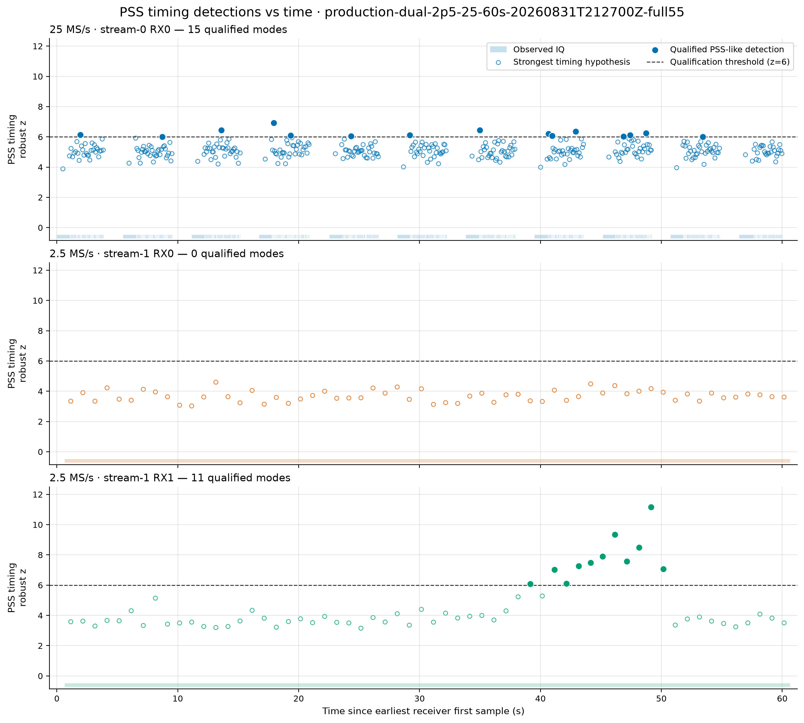
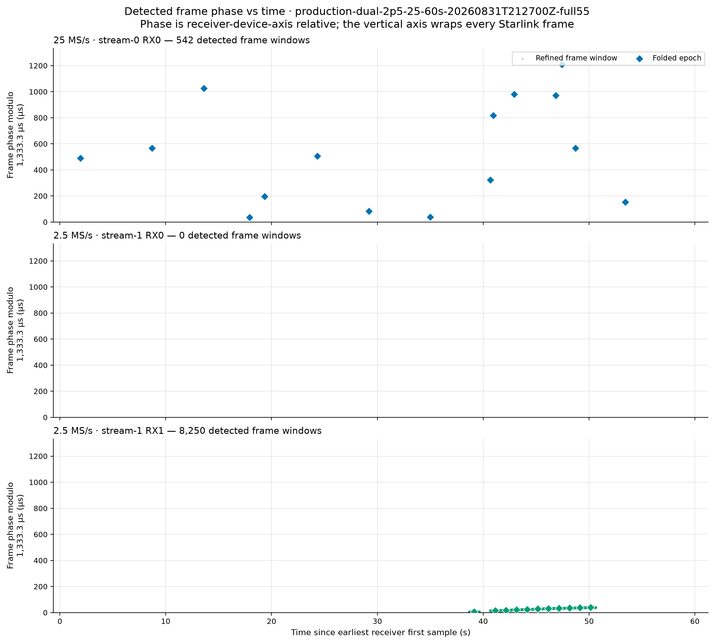
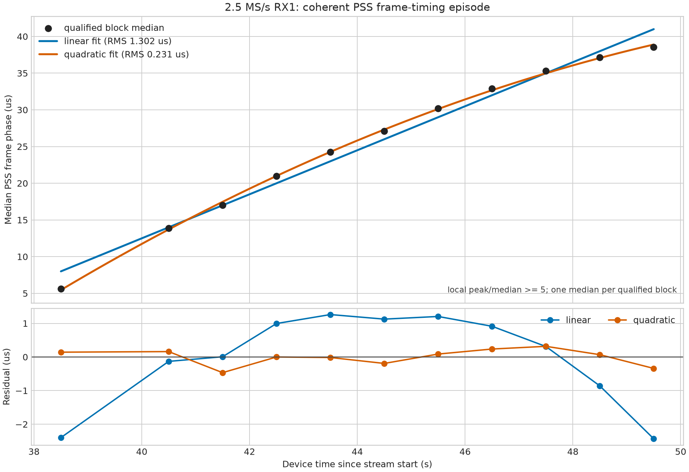

# PSS replay for the production dual 2.5/25 MS/s capture

Capture: `production-dual-2p5-25-60s-20260831T212700Z-full55`

Session label time: 2026-08-31 21:27:00 UTC

First persisted sample estimate: 2026-08-31 21:32:36.916475036 UTC (25 MS/s stream)

Status: **replay complete; one coherent candidate-only PSS timing episode on 2.5 MS/s RX1**

## Executive conclusion

The rate-generic PSS replay ran over every available continuity-safe block on all three receiver
paths. The complete 2.5 MS/s RX1 path contains a coherent 11-block timing episode from 38.5 through
49.5 seconds on its device axis. Each accepted block has 750 repeated-frame supports. The
independently recovered block medians trace a smooth quadratic with **0.231 microsecond RMS**
(0.576 sample) and 0.466 microsecond maximum residual.

The 2.5 MS/s RX0 path produces no qualified timing mode. The partial 25 MS/s RX0 path produces 15
threshold-qualified local modes, but they are sparse across the dwell and occupy unrelated frame
phases. They do **not** constitute a global 25 MS/s timing lock. This distinction is visible in the
full-dwell figures and is not inferred from detection count alone.

The result is candidate-only scientific evidence. It does not claim decoded PSS/SSS, payload,
satellite identity, absolute carrier phase, or calibrated physical Doppler.

## Immutable inputs and replay configuration

| Item | Value |
|---|---|
| Recording manifest | `sha256:6719d945757bb760cdc8245d2347f4e30aded16e9f06046a02c0aed69a04c53c` |
| PSS replay | `sha256:b736016964122d91bc56178c754c12e20a30f99b55564c0c6eeda8bb59205121` |
| Replay generated | 2026-08-31 23:04:04.607751 UTC |
| Channel reference | 1,824,882,812.5 Hz (channel 55 lower half-bin) |
| Block duration | 1 second, independently qualified |
| Folded-mode gates | robust z >= 6.0, peak/median >= 1.15, support >= 4 |
| CFO search bank | -400 through +400 kHz in 100 kHz steps |
| Local timing refinement | +/-2 microseconds |

The replay is the full machine-readable evidence:
[`pss-frame-timing-replay.json`](figures/2026_08_31_mixed_rate_pss_timing/production-dual-2p5-25-60s-20260831T212700Z-full55/pss-frame-timing-replay.json).
It preserves every searched block, no-result reason, candidate, refined window, and device-sample
coordinate. It is not registered as a Standard pipeline product.

## Capture integrity and synchronization

Both radios reported firmware `v0.46-plutoplus-spf-iq-direct-async-ring-v1`. The 2.5 MS/s stream is
complete. The 25 MS/s stream is explicitly partial:

| Path | State | Logical samples | Observed | Missing / zero-filled | Continuity |
|---|---|---:|---:|---:|---:|
| 25 MS/s stream-0 RX0 | partial | 1,500,000,000 | 732,333,764 | 767,666,236 | 356 segments / 355 gaps |
| 2.5 MS/s stream-1 RX0/RX1 | complete | 150,000,000 | 150,000,000 | 0 | one segment |

The 25 MS/s observed fraction is 48.822%, or 29.293 seconds of samples on the 60-second device
axis. The replay reads only observed intervals and never correlates across a persisted gap.

The radios were released in best-effort mode. The manifest reports a 0.652411765-second estimated
start skew, `phase_coherent=false`, synchronization grade `degraded`, and zero guaranteed overlap.
Accordingly, this report uses each stream's own zero-based device time and does not compare frame or
carrier phase across radios.

## Full-dwell qualification

| Path | Searched blocks | Qualified / no-result | Refined windows | Interpretation |
|---|---:|---:|---:|---|
| 25 MS/s stream-0 RX0 | 367 | 15 / 352 | 542 | sparse local modes; no global timing branch |
| 2.5 MS/s stream-1 RX0 | 60 | 0 / 60 | 0 | negative control path |
| 2.5 MS/s stream-1 RX1 | 60 | 11 / 49 | 8,250 | coherent episode at 38.5--49.5 s |





### 25 MS/s RX0

The 15 qualified blocks have folded robust z 6.007--6.934 (median 6.124), folded peak/median
1.771--2.206 (median 2.083), and 31--63 frame supports. Of 542 locally refined windows, 480 pass
the descriptive local peak/median >=5 filter.

Those numbers show that the local matcher found repeatable modes inside individual observed
segments. They do not show that the same mode persists globally. Detection times are scattered
from 1.95 through 53.43 seconds, and their block-median frame phases jump around the 1.333 ms frame
cycle. A global fit would join unrelated branches and is therefore intentionally omitted. The heavy
capture loss also limits the available evidence, but loss alone does not explain or excuse the
phase incoherence.

### 2.5 MS/s RX0

All 60 blocks return `no_result`. This is useful contemporaneous negative evidence: qualification
is not a dwell-wide artifact affecting both receiver inputs.

### 2.5 MS/s RX1

The 11 qualified blocks have folded robust z 6.087--11.170 (median 7.488), folded peak/median
1.238--1.581 (median 1.317), and exactly 750 repeated-frame supports apiece. The replay refines
8,250 windows. A stricter descriptive filter, local peak/median >=5, retains 1,488 windows for the
per-block phase medians used below.

The block medians move smoothly from 5.598 to 38.561 microseconds without a frame-cycle wrap or
branch jump. This global trajectory was not used to seed or qualify the individual blocks, so it is
an independent coherence check on the local detections.

## Coherent-episode timing fit

Ordinary least squares fits one median per qualified block, with time centered at
44.409090909 seconds on the RX1 device axis. Residuals are expressed in time so the result remains
comparable across sample rates.

| Model | RMS residual | Maximum absolute residual |
|---|---:|---:|
| Linear | 1.3023897 us / 3.256 samples | 2.432560 us |
| Quadratic | **0.2305493 us / 0.576 samples** | **0.465989 us / 1.165 samples** |



The quadratic timing model in microseconds, with `tau = t - 44.409090909 s`, is

```text
frame_phase_us = 27.0461783 + 2.9419283 tau - 0.12048344 tau^2
```

Its timing curvature is -0.24096688 microsecond/s^2. If the 1.8248828125 GHz IF reference is
translated through the assumed 9.75 GHz LNB LO, the conditional RF reference is
11.5748828125 GHz. Under conventional observed-minus-nominal propagation-delay sign, the curvature
maps to approximately **+2.789 kHz/s**. This is a timing-derived diagnostic, not a calibrated
physical-Doppler result: receiver and transmitter clocks, sample-clock error, LO/LNB drift, path
delay, RF reference, and analyzer sign convention remain confounded.

Exact fit points, coefficients, predictions, residuals, and coordinate semantics are retained in
[`pss-qualified-episode-fit.json`](figures/2026_08_31_mixed_rate_pss_timing/production-dual-2p5-25-60s-20260831T212700Z-full55/pss-qualified-episode-fit.json).

## Reproduction

The replay was produced with the existing rate-generic command:

```bash
.venv/bin/python tools/replay_pss_frame_timing.py \
  production-dual-2p5-25-60s-20260831T212700Z-full55 \
  --target stream-0:0 --target stream-1:0 --target stream-1:1 \
  --channel-reference-hz 1824882812.5 \
  --bulk-root /srv/bulk/leo \
  --output reports/figures/2026_08_31_mixed_rate_pss_timing/production-dual-2p5-25-60s-20260831T212700Z-full55/pss-frame-timing-replay.json
```

The committed
[`source/summarize_pss_replay.py`](figures/2026_08_31_mixed_rate_pss_timing/production-dual-2p5-25-60s-20260831T212700Z-full55/source/summarize_pss_replay.py)
recreates the fit ledger and figure from the replay without rereading radio IQ.
