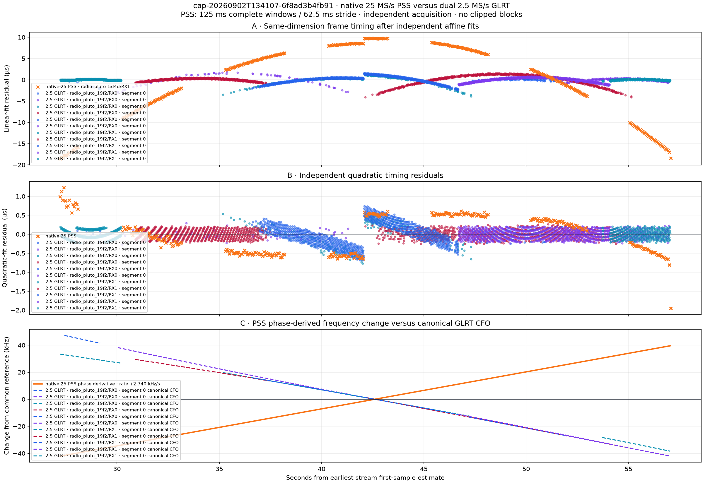
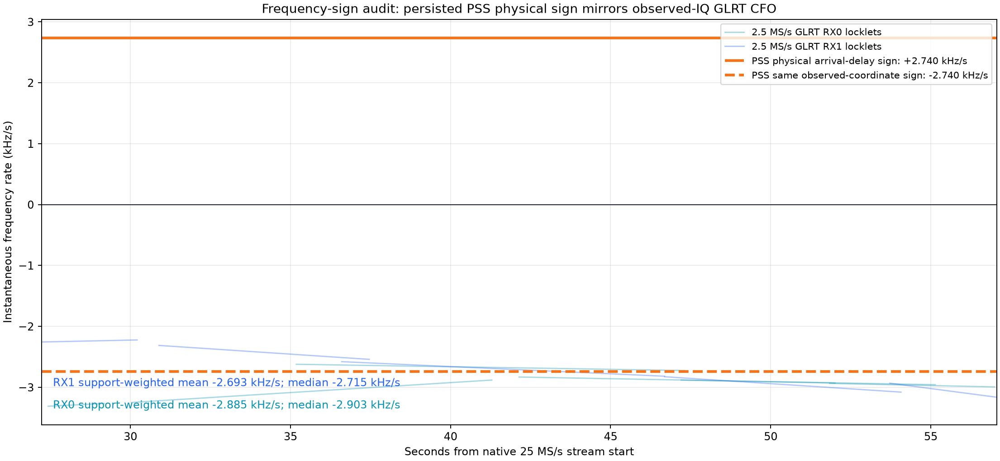
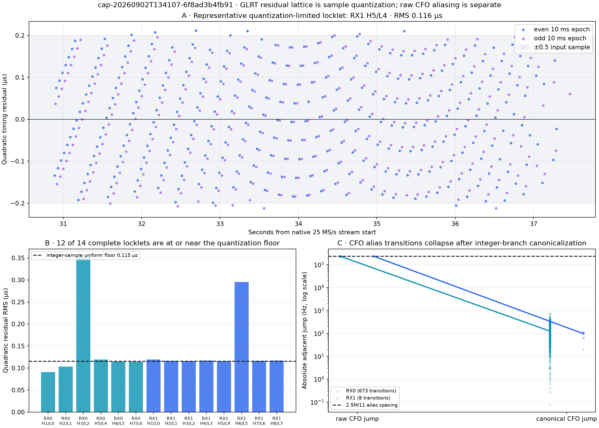
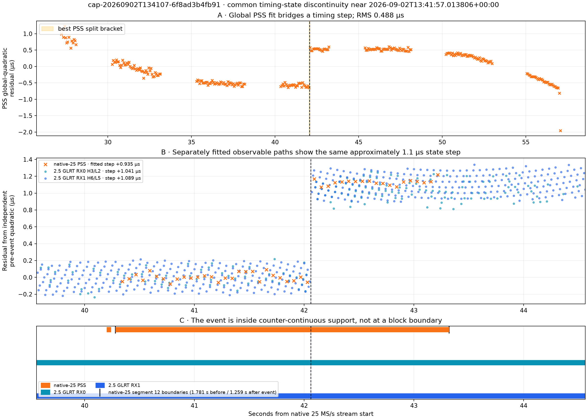
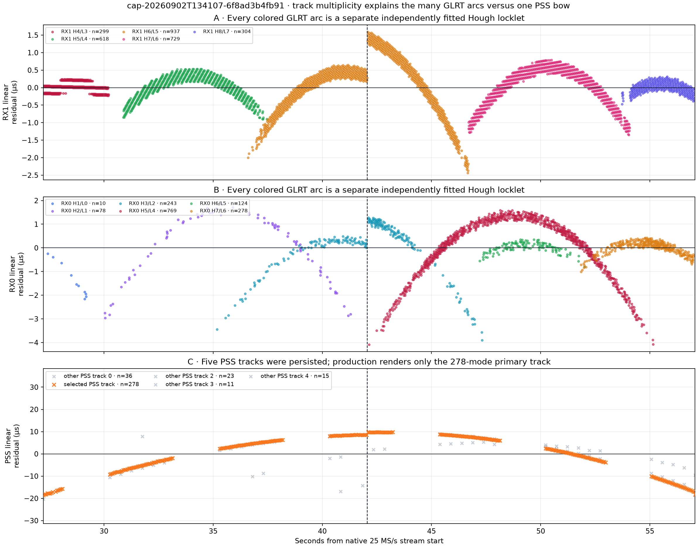

# Native 25 MS/s PSS versus dual 2.5 MS/s GLRT residual deep dive

Date: 2 September 2026

Capture: `cap-20260902T134107-6f8ad3b4fb91`

Standard-analysis run: `reprocess-31d8aeb5a7f547b9a29aa04949c9d88c`

## Executive result

The figure that motivated this investigation contains three visually striking effects, but they
do not have one common cause.

1. **The PSS and GLRT frequency changes have opposite plotted signs because they use different
   coordinate conventions.** The persisted PSS diagnostic converts arrival-time curvature to a
   physical Doppler convention with a minus sign. GLRT reports CFO in the receiver's observed-IQ
   coordinate. In this capture, the physical-sign PSS rate is **+2.740 kHz/s**, while the same PSS
   curvature expressed in the GLRT observed coordinate is **−2.740 kHz/s**. The latter agrees with
   the supported GLRT means of **−2.885 kHz/s on RX0** and **−2.693 kHz/s on RX1**. This is strong
   evidence for an unresolved IQ/template/mixer sign convention, not for opposite physical
   motion. It is not yet an absolute RF sign calibration.

2. **The fine radial, scalloped, or fan-like GLRT residual pattern is primarily integer-sample
   epoch quantization, not a whole-frame alias.** A 2.5 MS/s epoch is stored on a 0.4 µs sample
   grid. Uniform rounding on that grid has an expected RMS of 0.115 µs; 12 of 14 complete GLRT
   locklets have quadratic RMS near that floor. The 750 Hz frame period contains
   3,333⅓ samples, and the 10 ms GLRT stride advances 7.5 frames. Those two non-integer relations
   create interleaved residual lattices after a smooth polynomial is subtracted.

3. **There is also a real common timing-state discontinuity near 13:41:57.014 UTC.** Native-25
   PSS and both 2.5 MS/s receiver paths all move by approximately +1.0 to +1.1 µs. The
   event lies inside continuous sample-counter support; neither GLRT receiver changes CFO alias
   index; canonical CFO remains smooth; and PSS remains on the same +200 kHz search hypothesis.
   A global quadratic therefore overstates the underlying noise by bridging a state change.

4. **The multiple broad GLRT arcs are separate independently fitted Hough locklets.** The GLRT
   products contain eight complete RX1 locklets and six complete RX0 locklets. Five RX1 and all
   six RX0 locklets overlap the selected PSS interval and are rendered, while only the largest of
   five persisted PSS tracks is shown. Subtracting a line from each locally curved locklet produces
   one parabola-like residual arc per locklet; subtracting one line from the selected 29.84 s PSS
   track produces one large PSS bow.

The most defensible interpretation is therefore: **sample-grid structure plus tracker
segmentation, superimposed on one externally common timing-state step, with an uncalibrated sign
mapping between PSS arrival phase and receiver IQ CFO.**

## Scope and independence

This analysis is read-only over persisted Standard-analysis products. It does not reread IQ,
rerun acquisition, use GLRT to select PSS, use PSS to select GLRT, or fit a TLE. The inputs are:

| Observable | Source | Search geometry | Persisted evidence |
|---|---|---:|---|
| PSS timing | `radio_pluto_5d4d/RX1`, native 25 MS/s | 125 ms complete windows, 62.5 ms stride, decimation 1 | 890 modes, 5 associated tracks |
| GLRT epoch | `radio_pluto_19f2/RX0`, 2.5 MS/s | 20 ms windows, 10 ms stride | 6 complete epoch locklets |
| GLRT epoch | `radio_pluto_19f2/RX1`, 2.5 MS/s | 20 ms windows, 10 ms stride | 8 complete epoch locklets |

The low-rate stream first-sample estimate is 240.333 ms later than the native-25 estimate. All
cross-stream plots transform sample-relative times through the persisted first-sample estimates.
Their half-width timing uncertainties are 1.336 ms for native-25 and 0.527 ms for each low-rate
receiver. Those uncertainties are far smaller than the 62.5 ms PSS split bracket, though they do
limit claims about sub-millisecond simultaneity.

PSS and GLRT are independent acquisition observables, but they are not automatically the same
transmitter or beam. Agreement is evidence of a common received timing state; it is not by itself
satellite or payload identification.

## The production figure



**Figure 1.** Exact persisted PNG shown by the Standard-analysis UI. Panel A independently removes
an affine timing fit from each plotted track; panel B shows each track's independent quadratic
residual; panel C maps PSS arrival-time curvature to a physical-sign frequency change while GLRT
remains in canonical receiver-IQ CFO coordinates. The original legend identifies receiver and
continuity segment but omits Hough label and locklet index, making distinct GLRT arcs look like
duplicate samples from one fit.

## 1. Why the frequency-change signs oppose

The selected native-25 PSS track contains 278 modes from 27.2225 to 57.0625 s. Its stored timing
model is

```text
tau(t) = a * dt^2 + b * dt + c
dt     = t - 42.602715827 s
a      = -1.221975677269e-7 s/s^2
b      = +8.264940901900e-6 s/s
c      = +1.240026611323e-3 s
```

Its timing curvature is therefore

```text
d²tau/dt² = 2a = -2.443951354539e-7 s/s²
```

For the common comparison scale `f_RF = 11.2096875 GHz`, the current PSS diagnostic applies the
physical arrival-delay convention

```text
frequency rate = -f_RF * d²tau/dt² = +2.739593 kHz/s
```

Removing that physical minus sign and expressing the same curvature in the observed-coordinate
direction gives

```text
same-coordinate rate = +f_RF * d²tau/dt² = -2.739593 kHz/s
```

GLRT's positive CFO hypothesis is the observed baseband frequency removed by a negative complex
derotation. Its sign can depend on IQ ordering, spectral orientation, mixer sideband, and complex
template convention. It is not automatically the physical received-RF Doppler sign.



**Figure 2.** Instantaneous GLRT CFO rates from every complete locklet over common PSS support,
without using PSS values to select a GLRT branch. The physical-sign PSS line is mirrored about
zero. In the shared observed coordinate, the PSS curvature falls between the two GLRT receivers.

| Rate over selected PSS support | Mean | Median | Support points |
|---|---:|---:|---:|
| PSS, physical arrival-delay sign | +2.740 kHz/s | +2.740 kHz/s | 278 modes |
| PSS, same observed-coordinate sign | −2.740 kHz/s | −2.740 kHz/s | 278 modes |
| GLRT RX0 canonical CFO derivative | −2.885 kHz/s | −2.903 kHz/s | 1,502 |
| GLRT RX1 canonical CFO derivative | −2.693 kHz/s | −2.715 kHz/s | 2,887 |

Relative to the same-coordinate PSS magnitude, the GLRT mean differs by 5.3% on RX0 and 1.7% on
RX1. Those are support-weighted descriptive values: overlapping 20 ms windows are correlated and
must not be treated as thousands of independent measurements.

### Sign conclusion

The calculation is internally consistent on both sides. What is missing is a calibration that
maps the native-PSS template phase and the Pluto/LNB IQ chain onto an absolute received-RF sign.
The current evidence supports plotting both explicitly labelled conventions. Silently changing
the physical sign would turn a useful control into an undocumented assumption.

A deterministic synthetic complex chirp with known positive sample-domain CFO, followed by a
known-sideband RF injection through both receiver paths, is the shortest conclusive calibration.

## 2. The radial GLRT residual lattice and actual CFO aliases

### Integer epoch quantization

The GLRT epoch product stores `global_epoch_device_sample` as an integer. At 2.5 MS/s:

```text
one sample                         = 0.400000 µs
uniform rounding RMS               = 0.4 / sqrt(12)
                                   = 0.115470 µs
samples per 750 Hz frame           = 2,500,000 / 750
                                   = 3,333⅓ samples
frames advanced per 10 ms stride   = 0.010 * 750
                                   = 7.5 frames
```

The fractional one-third sample per frame and half-frame stride parity create several repeating
sample lattices. A quadratic is smooth while the selected epoch is a staircase; subtracting the
smooth model exposes diagonal teeth and scallops. Missed opportunities and overlapping Hough
memberships make several teeth visible at the same time.

The circular frame-phase seam is half a frame away, approximately ±666.7 µs. The plotted GLRT
residuals are predominantly within ±0.2 µs and even the state-change locklets remain below a few
microseconds. This is not a one-frame wrap or 750 Hz timing alias.



**Figure 3.** Panel A isolates one normal RX1 locklet and colors the two 10 ms stride parities. The
fan is already present in a single good locklet and is bounded by roughly half an input sample.
Panel B compares all complete-locklet RMS values with the integer-sample quantization floor. Only
RX0 H3/L2 and RX1 H6/L5 are materially above it; both span the common timing event. Panel C shows
that genuine raw-CFO alias jumps collapse after canonicalization.

Complete-locklet quadratic RMS values are:

| Receiver | Locklets at 0.090–0.119 µs | Event-spanning locklet | Event locklet RMS |
|---|---:|---|---:|
| RX0 | 5 of 6 | H3/L2 | 0.353 µs |
| RX1 | 7 of 8 | H6/L5 | 0.295 µs |

### CFO alias canonicalization

The GLRT bank's CFO ambiguity spacing is

```text
2,500,000 / 11 = 227,272.727 Hz.
```

The epoch tracker canonicalizes each observation as

```text
canonical CFO = raw CFO - alias_index * 227,272.727 Hz.
```

| Receiver | Alias-index transitions | Median raw jump | Median canonical jump | Median timing-residual jump at transition | Median steady timing-residual jump |
|---|---:|---:|---:|---:|---:|
| RX0 | 673 | 227.235 kHz | 125.2 Hz | 0.193 µs | 0.096 µs |
| RX1 | 8 | 227.335 kHz | 96.7 Hz | 0.172 µs | 0.168 µs |

Thus, **raw CFO aliasing is real and common**, especially on RX0, but the integer alias removal is
working: a roughly 227 kHz raw jump becomes a roughly 0.1 kHz canonical change. The epoch timing
does not make a comparable discontinuity at those branch changes.

This separates two uses of “aliasing”:

- the coarse CFO bank has an explicit 227.273 kHz branch ambiguity, which is canonicalized;
- the epoch residual has a sub-sample lattice, which is quantization structure rather than a
  wrong CFO branch or whole-frame wrap.

## 3. A common approximately 1.1 µs timing-state change

The best unconstrained split of the selected PSS track lies between consecutive 62.5 ms-spaced
modes at 42.0300 and 42.0925 s from the native-25 stream start:

```text
UTC bracket   2026-09-02 13:41:56.982556 to 13:41:57.045056
midpoint      2026-09-02 13:41:57.013806
```

The PSS split is selected from PSS alone. That fixed UTC boundary is then applied to whichever
complete GLRT locklet independently spans it on each receiver.



**Figure 4.** Panel A shows why one global quadratic leaves structured PSS residual bands. Panel B
fits only pre-event data for display and exposes the common step in all three observables. Panel C
places the event on persisted sample-counter continuity. The small earlier native-25 orange stub
is the preceding observed segment; the event is well inside segment 12, not at either boundary.

| Observable | Global quadratic RMS | Two-quadratic RMS | Fitted step |
|---|---:|---:|---:|
| Native-25 PSS, selected track | 0.488 µs | 0.101 µs | +0.935 µs |
| 2.5 MS/s GLRT RX0 H3/L2 | 0.353 µs | 0.104 µs | +1.041 µs |
| 2.5 MS/s GLRT RX1 H6/L5 | 0.295 µs | 0.116 µs | +1.089 µs |

The piecewise PSS RMS is 4.84 times lower than its global quadratic RMS. The GLRT event locklets
return to their normal quantization floor after the fixed-boundary split. This is why “PSS lock is
better despite higher global RMS” can be true: the detector remains coherent, but a single global
model is misspecified across a timing-state change.

### Negative controls at the event

| Check | Immediately before | Immediately after | Result |
|---|---:|---:|---|
| PSS selected CFO hypothesis | +200.000 kHz | +200.000 kHz | no hypothesis switch |
| PSS robust z | 13.856 | 14.068 | strong on both sides |
| PSS strong windows | 91/94 | 91/94 | no loss of support |
| GLRT RX0 alias index | 2 | 2 | no alias transition |
| GLRT RX0 canonical CFO | — | −287.3 Hz adjacent change | smooth relative to 227 kHz alias |
| GLRT RX1 alias index | 0 | 0 | no alias transition |
| GLRT RX1 canonical CFO | — | −55.2 Hz adjacent change | smooth relative to 227 kHz alias |

The adjacent timing-residual changes are +1.027 µs on RX0 and +1.056 µs on RX1 even though the
alias indexes do not change.

The native-25 event lies in counter-continuity segment 12, which runs from 40.28 to 43.32 s. It is
1.781 s after the segment start and 1.259 s before its stop. Both low-rate paths are one continuous
0–60 s segment. All analyzed PSS input blocks are complete 125 ms windows; the 62.5 ms overlap
means the event is bracketed rather than aligned to a clipping edge.

### Timing-event conclusion

The common event is inconsistent with:

- a native-25 DMA/counter gap;
- the start or end of a clipped PSS block;
- a PSS frequency-search mode switch;
- a GLRT CFO alias transition;
- a 750 Hz whole-frame unwrap error; or
- ordinary 0.4 µs integer-sample quantization alone.

It is consistent with a common received timing-state change, such as a transmitter/beam timing
transition or a change in the dominant propagation component. These products cannot assign the
event to a specific transmitter, beam, payload action, or propagation mechanism.

## 4. Why there are many GLRT arcs but one large PSS arc



**Figure 5.** GLRT is separated by receiver, Hough label, and locklet index. Each colored sequence
has its own affine fit, so remaining curvature appears as one local parabola-like arc. PSS did not
produce only one track: five were persisted with 36, 278, 23, 11, and 15 modes. The production
comparison intentionally chooses the 278-mode primary track and renders it as one orange series.

The apparent asymmetry is therefore a presentation and association asymmetry:

| Stage | PSS | GLRT |
|---|---|---|
| Acquisition output | many blockwise PSS modes | many 20 ms window hypotheses |
| Association output | 5 PSS timing tracks | 8 RX1 + 6 RX0 complete locklets |
| Production comparison selection | one track, ranked first by mode count | 5 RX1 + 6 RX0 complete locklets overlapping PSS support |
| Affine residual appearance | one long curved bow | one local arc per locklet |

The GLRT locklets overlap in time because the Hough stage can preserve competing local
trajectories, and because one curved trajectory may be represented by successive locally linear
Hough tracks. Multiple locklets are not automatically multiple emitters. Conversely, the single
displayed PSS bow is not proof that PSS observed only one candidate.

The current UI legend says only receiver and continuity segment. Since all low-rate data are in
segment 0, several different locklets receive identical legend text. Adding `H#` and `L#` to the
label would remove most of the visual ambiguity without changing any scientific contract.

## What is established, inferred, and unresolved

### Established directly by persisted products

- Native-25 PSS ran without decimation, using 125 ms complete windows and a 62.5 ms stride.
- The selected PSS track has 278 modes across 29.84 s; four other tracks also exist.
- Twelve of fourteen complete GLRT locklets are quantization-limited near 0.115 µs RMS.
- Raw GLRT CFO branch transitions occur at the expected 227.273 kHz spacing and canonicalize to
  small adjacent changes.
- PSS and both GLRT receivers show an approximately 1.1 µs timing step at the same capture epoch.
- The event is not colocated with a persisted counter discontinuity, PSS mode switch, or GLRT
  alias-index switch.

### Strong inference

- The fine GLRT fan/scallop is produced by integer-sample epoch quantization and stride/frame
  lattice geometry.
- The frequency sign mismatch is a coordinate calibration issue because the same-coordinate PSS
  rate agrees closely with both receiver-IQ GLRT rates.
- The two elevated-RMS GLRT locklets and elevated global PSS RMS are dominated by one common
  timing-state transition rather than generally poor lock.

### Not established

- absolute physical received-RF Doppler sign;
- which observable, if either, belongs to a specific Starlink satellite or beam;
- whether all GLRT locklets are fragments of one emitter;
- whether the approximately 1.1 µs step originates in the transmitter, propagation, or shared
  receive geometry; or
- independent-sample confidence intervals, because both PSS and GLRT windows overlap.

## Recommended engineering follow-up

1. **Calibrate the sign.** Add a deterministic positive/negative complex chirp fixture through
   PSS and GLRT, then a known-sideband RF injection through the Pluto/LNB chain. Persist the
   resulting sample-domain-to-RF sign mapping.

2. **Make discontinuities first-class diagnostics.** Keep the global fit for comparability, but
   report change-point candidates and pre/post quadratic fits. A global Doppler rate should be
   flagged as non-stationary when a common state step improves RMS this dramatically.

3. **Refine epoch timing below one 2.5 MS/s sample.** Fit the GLRT correlation peak locally or use
   a fractional-delay refinement. Until then, show a ±0.2 µs sample-quantization band and do not
   interpret the fine fan as physical microstructure.

4. **Clarify the comparison renderer.** Label GLRT curves by receiver, Hough track, and locklet;
   render secondary locklets faintly; and optionally show one independently stitched dominant
   family per receiver. Preserve all locklets in a separate diagnostic panel.

5. **Replay a narrow interval around the event.** Use the existing IQ only, preserve native sample
   rates, and sweep window/stride and sub-sample timing refinement over approximately 39–45 s.
   No new radio capture is required.

6. **Do not use the single global PSS curvature as one stationary Doppler estimate across this
   event.** Report pre-event and post-event rates, or explicitly model the step, before comparing
   to a TLE.

## Reproducibility

Machine-readable results are in
[`analysis-summary.json`](figures/2026_09_02_6f8_pss_glrt_deep_dive/analysis-summary.json).
The plotting and analysis source is
[`tools/report_6f8_pss_glrt_deep_dive.py`](../tools/report_6f8_pss_glrt_deep_dive.py),
with focused tests in
[`tests/analysis/test_6f8_pss_glrt_deep_dive_tool.py`](../tests/analysis/test_6f8_pss_glrt_deep_dive_tool.py).

From a host retaining the analysis run under `/srv/bulk/leo/analysis`:

```bash
BASE=/srv/bulk/leo/analysis/cap-20260902T134107-6f8ad3b4fb91/\
reprocess-31d8aeb5a7f547b9a29aa04949c9d88c

uv run python tools/report_6f8_pss_glrt_deep_dive.py \
  --pss "$BASE/scientific/path-pss-native/sha256:454a286ef9466a372d7be3366a6b96e86a2f685958cdcad95af55a04dce468e4/standard.pss-frame-timing.v1.json" \
  --glrt-epoch "$BASE/scientific/path-alternate-tracks-native/sha256:512b5f7ccf833f16388959e1b1ed7539a2fd8870f1f360a970a8e36a6c2bcbb7/standard.glrt-epoch-tracking.v1.json" \
  --glrt-epoch "$BASE/scientific/path-alternate-tracks-native/sha256:3b59ce5609cb78c85cd5c4d1eb74b303e088be3694bdcc6dbb2d44801a004e69/standard.glrt-epoch-tracking.v1.json" \
  --output-dir reports/figures/2026_09_02_6f8_pss_glrt_deep_dive
```

The exact production PNG copied into this evidence bundle has SHA-256
`58574a037ff93a2d011c79e2014ffca04cf7e75a90a7d7ae49d01cf0e31233e7`.
