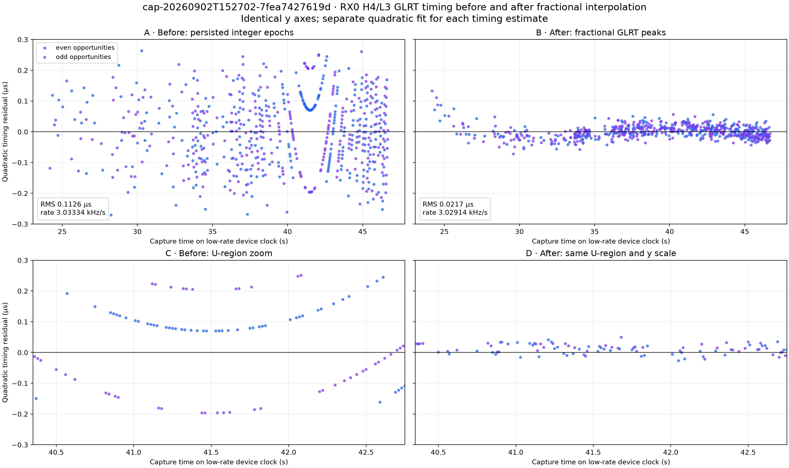
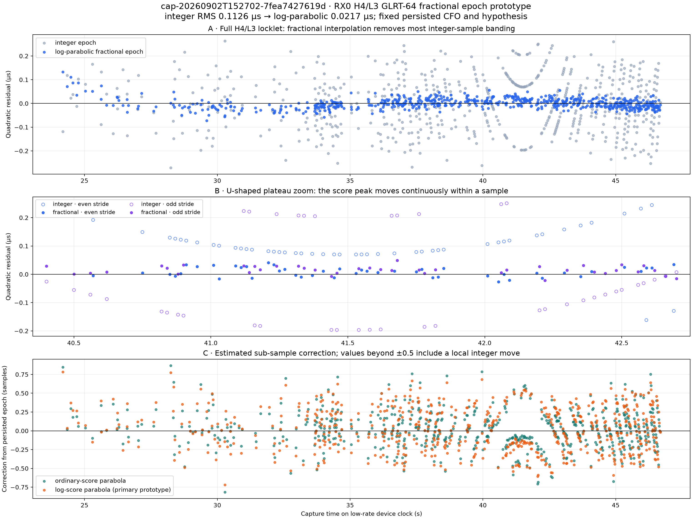
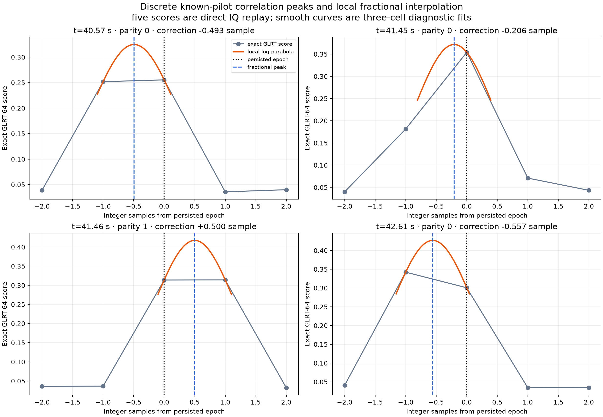

# Fractional-sample GLRT epoch prototype: `7fea7427619d`

Date: 2 September 2026

Capture: `cap-20260902T152702-7fea7427619d`

Scope: `radio_pluto_5d4d / stream-0 / RX0 / H4/L3`, 2.5 MS/s lower-edge GLRT-64

## Result

Fractional interpolation of the local GLRT correlation peak removes most of the visible timing
fan and the U-shaped plateau without materially changing the inferred Doppler rate. This strongly
supports the earlier diagnosis: the fine structure is predominantly the display of a smooth
arrival-time trajectory on a 0.4 µs integer-sample grid, not a physical timing wave or frame
alias.

The prototype replayed all **652** accepted H4/L3 epochs against the original IQ. For every 20 ms
window it held the persisted acquired CFO and lower-edge hypothesis fixed, evaluated exact GLRT-64
at integer offsets `[-2, -1, 0, +1, +2]`, then fitted a three-cell parabola around the local score
maximum. A parabola in log exact-score is the primary diagnostic; ordinary exact-score and
exact-minus-control margin fits are retained as sensitivity checks.

| Timing estimate | Full-locklet RMS | U-region RMS | U peak-to-peak | Rate magnitude |
|---|---:|---:|---:|---:|
| Persisted integer epoch | 0.11265 µs | 0.13915 µs | 0.44756 µs | 3.03334 kHz/s |
| Log-parabolic fractional epoch | **0.02174 µs** | **0.01951 µs** | **0.07605 µs** | **3.02914 kHz/s** |
| Ordinary-score parabola | 0.03235 µs | 0.03439 µs | 0.14369 µs | 3.02953 kHz/s |
| Margin parabola | 0.03253 µs | 0.03499 µs | 0.14650 µs | 3.02959 kHz/s |

The primary interpolation reduces full-locklet RMS by **80.7%** and U-region RMS by **86.0%**.
The rate moves by only −4.19 Hz/s, or **−0.138%**. It remains an approximately 3.0 kHz/s result
and stays close to the independent native-25 PSS timing rate (2.99891 kHz/s) and low-rate GLRT CFO
rate magnitude (3.00827 kHz/s).

## Standard-pipeline resolution

The reviewed estimator is now integrated into the existing Standard-native analysis path without
changing the published full-capture GLRT V2 contract or its detection decisions:

- `standard.full-capture-glrt20ms` V2 remains the integer acquisition, score, CFO, Hough, and
  margin-gate authority.
- The same raw-IQ stage emits additive `standard.glrt-fractional-epoch` V1 evidence for every
  margin-passing window. Each row seals the fixed acquired CFO, integer epoch, center score, five
  exact-score cells at offsets `[-2,-1,0,+1,+2]`, and the resulting fractional offset.
- Boundary maxima and non-concave local surfaces are explicitly marked unbracketed; they are not
  silently promoted to fractional observations.
- `standard.glrt-epoch-tracking` V2 consumes the full-capture and companion digests, retains the
  existing CFO/Hough branch selection, and fits only bracketed fractional peaks within each
  continuity-local locklet.
- Epoch timing/rate PNG V2 and paired PSS/GLRT PNG V2 are the new default UI artifacts. Additive UI
  inventories V12/V13 describe those semantics, while V10/V11 continue to serve older sealed runs.

This is deliberately an estimator refinement, not a new analysis pathway: window geometry remains
20 ms at a 10 ms stride, detection thresholds are unchanged, and neither the PSS result nor a
global timing fit influences the local GLRT peak. The implementation is sample-rate aware and is
tested at 2.5, 3, 5, 10, 15, 20, and 25 MS/s. A regression over all 652 recorded `7fea` score grids
reproduces the prototype fractional offsets to better than `1e-12` sample.



**Figure 1.** Direct before/after comparison on identical time and residual axes. The bottom row
uses the same y limits while expanding 40.35–42.75 s around the U-shaped structure. Each column
uses its own quadratic timing fit; no global model is used to derive the per-window correction.



**Figure 2.** Panel A compares all persisted integer epochs with independently interpolated local
score peaks after separate global quadratic fits. Panel B expands the U region and distinguishes
the 10 ms stride parities. Panel C shows the correction applied to each persisted epoch. A
correction beyond ±0.5 sample means that the exact GLRT score preferred an adjacent integer cell
before interpolation.

## What happens at the U

The raw window sequence alternates between two 50%-overlapped stride parities. Around the timing
vertex, one parity often places the true peak between persisted epoch samples −1 and 0; the other
places it between samples 0 and +1. Integer output must choose one cell, making each parity form a
constant phase plateau. Subtracting a curved global model from that plateau draws a U or inverted
arc.

The replay exposes the missing coordinate directly. For example:

- At 40.57 s, the neighboring exact scores are nearly tied and the fitted peak is −0.493 sample
  from the persisted epoch.
- At 41.45 s, the fitted peak is −0.206 sample.
- At 41.46 s, the next parity straddles samples 0 and +1 and fits at +0.500 sample.
- At 42.61 s, the adjacent −1 cell wins and the combined correction is −0.557 sample.



**Figure 3.** Markers are direct exact GLRT-64 evaluations from the recorded IQ. Each orange curve
uses only the three cells surrounding its discrete maximum. It illustrates the interpolation; it
is not a direct evaluation of a fractionally shifted template.

## Overlap and robustness checks

Adjacent 20 ms windows overlap by 10 ms, so treating all 652 points as statistically independent
would overstate precision. Splitting by opportunity parity removes that overlap within each fit:

| Mutually non-overlapping family | Points | Integer RMS | Fractional RMS | Integer rate | Fractional rate |
|---|---:|---:|---:|---:|---:|
| Even opportunities | 325 | 0.11124 µs | 0.02053 µs | 3.03225 kHz/s | **3.02913 kHz/s** |
| Odd opportunities | 327 | 0.11373 µs | 0.02287 µs | 3.03450 kHz/s | **3.02917 kHz/s** |

The independently fitted fractional parity rates differ by only **0.037 Hz/s**. Both retain the
large reduction in residual RMS, so the result is not created by counting overlapped windows as
independent measurements.

The IQ replay also reproduces every persisted center score to numerical precision: maximum exact
score error is `3.89e-16` and maximum control-score error is `2.78e-17`. This proves the prototype
is measuring the same GLRT surface used by the Standard analyzer. It does not substitute a new
detector.

In 35/652 windows (5.37%), the exact GLRT score prefers an adjacent integer epoch. That is expected
from the current division of labor: symbolwise acquisition supplies an integer epoch, while
GLRT-64 ranks the candidate basin but does not re-optimize its epoch on the GLRT score itself.

## What this proves—and what it does not

The result is strong evidence that fractional epoch information exists in the local known-pilot
score surface and that extracting it materially improves timing precision. The correction is
computed independently in each window and does not use the global quadratic trajectory, so the
global fit is not forcing points onto itself.

It does not yet establish population-level accuracy or promotion eligibility:

- This is an in-sample measurement replay of one already selected locklet, not a detection or
  false-alarm study.
- The acquired CFO and edge hypothesis are fixed to their persisted values.
- A three-cell parabola approximates the sampled score surface. It does not directly correlate a
  continuous-time, fractionally shifted known-pilot template.
- Ordinary-score and log-score interpolators differ by a median 0.070 sample (28 ns) and a 95th
  percentile 0.110 sample (44 ns). That is a useful estimate of interpolation-model sensitivity,
  not calibrated uncertainty.
- Formal least-squares uncertainties remain optimistic unless overlap and selection are included
  in the statistical model.

The additive Standard product therefore remains candidate-only and ineligible for scientific
promotion. The next scientifically clean step is a bounded injected-signal study with known
fractional delay, SNR, CFO, and Doppler rate, followed by replay on several independent captures.
A direct analytic or band-limited fractionally shifted template should also be compared with this
inexpensive log-peak approximation before using the result as promoted physical evidence.

## Reproduction

Machine-readable per-window score grids and fits are in
[`fractional-glrt-epoch-prototype.json`](figures/2026_09_02_7fea_glrt_fractional_epoch/fractional-glrt-epoch-prototype.json).
The capture-local tool and focused tests are
[`prototype_7fea_glrt_fractional_epoch.py`](../tools/prototype_7fea_glrt_fractional_epoch.py) and
[`test_7fea_glrt_fractional_epoch_tool.py`](../tests/analysis/test_7fea_glrt_fractional_epoch_tool.py).
The JSON's `production_behavior_changed: false` field records the state of that original prototype
execution; the integration described above was performed afterward through new versioned products.

```bash
BASE=/srv/bulk/leo/analysis/cap-20260902T152702-7fea7427619d/\
native-capture-71829dc4471b474c9a9322e26c5c6f26

uv run python tools/prototype_7fea_glrt_fractional_epoch.py \
  --epoch-product "$BASE/scientific/path-alternate-tracks-native/sha256:72205ce929913763348a401cb7312764bf770db92134e2f84f88025a12f3c1d1/standard.glrt-epoch-tracking.v1.json" \
  --full-product "$BASE/scientific/path-standard-native/sha256:72205ce929913763348a401cb7312764bf770db92134e2f84f88025a12f3c1d1/standard.full-capture-glrt20ms.v2.json" \
  --output-dir reports/figures/2026_09_02_7fea_glrt_fractional_epoch \
  --workers 12
```
