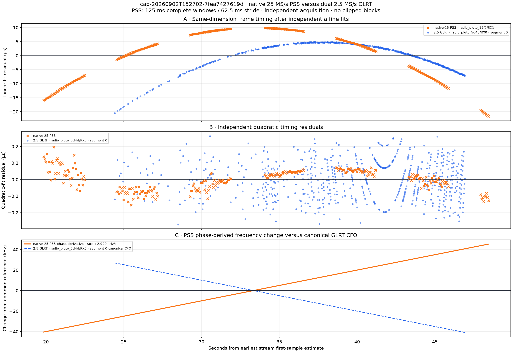
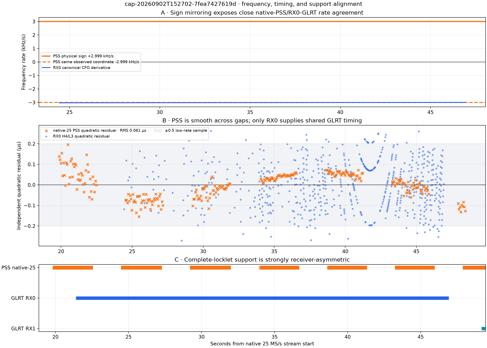
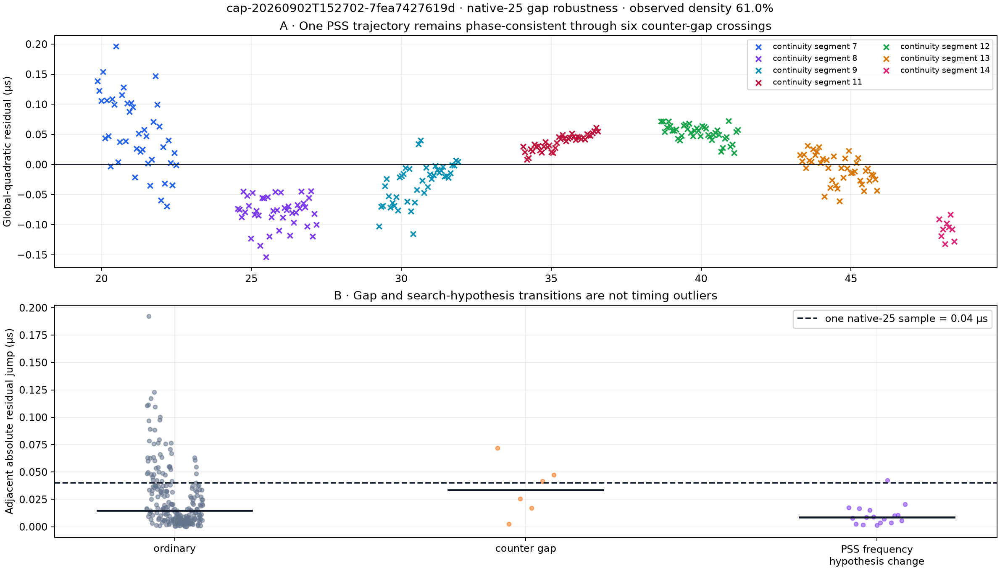
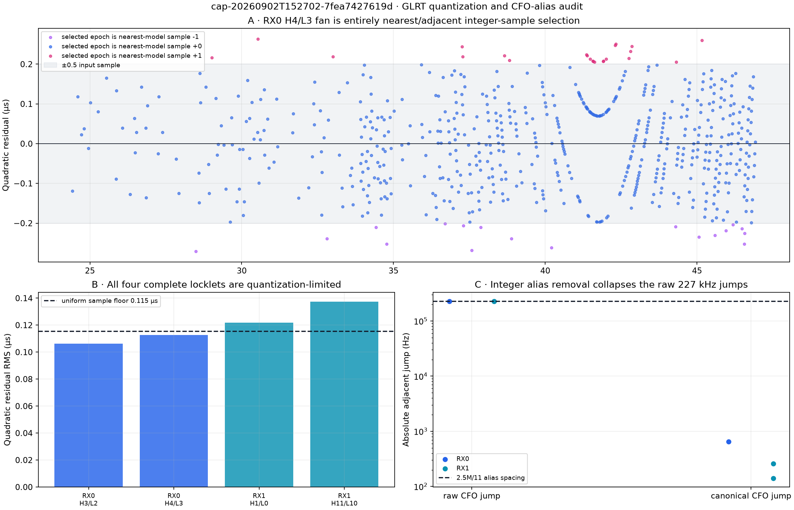
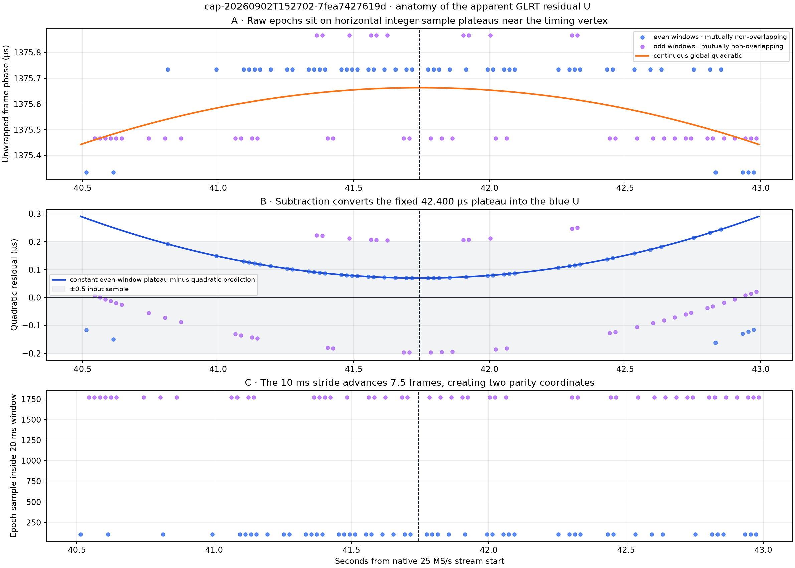
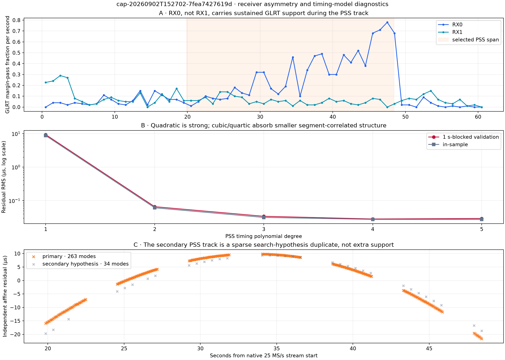

# Native 25 MS/s PSS versus dual 2.5 MS/s GLRT deep dive: `7fea7427619d`

Date: 2 September 2026

Capture: `cap-20260902T152702-7fea7427619d`

Standard-analysis run: `native-capture-71829dc4471b474c9a9322e26c5c6f26`

## Executive result

This is a strong cross-rate agreement case, despite substantial missing data in the native
25 MS/s stream.

1. **The native-25 PSS trajectory is exceptionally coherent.** Its primary track contains 263
   modes over 28.58 s, with a global-quadratic residual RMS of **0.0613 µs** and maximum absolute
   residual of **0.1963 µs**. It crosses six counter-proven gaps and seven continuity segments.
   A mode is retained in **263 of 263 unique complete 125 ms windows** available within the track
   span. The lower 57.4% nominal wall-stride coverage is caused by capture gaps, not missed PSS
   detections.

2. **PSS and the overlapping RX0 GLRT agree closely on Doppler-rate magnitude.** At the common
   10.7096875 GHz reference, native-PSS timing curvature gives **+2.999 kHz/s** in physical
   arrival-delay sign, or **−2.999 kHz/s** in GLRT's observed-IQ coordinate. RX0 canonical CFO
   changes at a mean **−3.008 kHz/s**, only **0.31%** different in magnitude. The independent
   RX0 epoch-timing curvature gives **+3.033 kHz/s**, 1.15% above PSS.

3. **The apparent sign conflict is coordinate mirroring, not opposing motion.** Both timing
   observables produce the same physical-sign rate. Canonical GLRT CFO uses the receiver-IQ
   correction coordinate and is sign-reversed. The data do not yet establish the absolute RF
   sign through the Pluto, mixer, LNB, and template chain.

4. **The GLRT fan is integer-sample structure, not a hidden timing wave or whole-frame alias.**
   RX0 H4/L3 has 611 of 652 selected epochs on the nearest integer sample predicted by its smooth
   fit; the remaining 41 are exactly one sample above or below it. All 652 are nearest or
   adjacent. Its 0.1126 µs RMS is almost exactly the 0.1155 µs RMS expected from uniform rounding
   on the 2.5 MS/s, 0.4 µs grid.

5. **Receiver asymmetry explains the missing second GLRT comparison.** During the PSS wall
   interval, RX0 passes the GLRT margin threshold in 869/2,858 windows (30.41%); RX1 passes only
   160/2,858 (5.60%). RX0 H4/L3 overlaps the PSS track, while RX1 has no complete locklet there.
   This is an evidence/SNR/polarization asymmetry, not a contradiction between sample rates.

6. **There is no fb91-like common timing-state step.** An unconstrained two-quadratic PSS split
   reduces RMS to 0.0272 µs, but the fitted discontinuity is only −0.0215 µs—less than one 25 MS/s
   sample—and there is no overlapping RX1 locklet with which to establish a common event. The
   residual structure is better described as smooth higher-order/model error plus segment
   correlation.

The defensible conclusion is: **7fea provides independent native-PSS and low-rate GLRT evidence
for an approximately 3.0 kHz/s Doppler-rate magnitude. PSS is not degraded by the native-stream
gaps; GLRT timing precision is presently limited by its 2.5 MS/s integer epoch representation.**

## Scope and provenance

This analysis is read-only over persisted Standard-analysis products. It does not reread IQ,
rerun PSS or GLRT acquisition, use GLRT to seed PSS, use PSS to choose a GLRT family, or use a TLE.
The two estimators remain independently selected and are placed on one time axis only through
their persisted first-sample timestamp estimates.

| Observable | Source | Geometry | Persisted result |
|---|---|---:|---|
| PSS timing | `radio_pluto_19f2/RX1`, stream 1 | native 25 MS/s, 967.5 MHz center, 25 MHz bandwidth | 2 tracks; primary has 263 modes |
| GLRT epoch and CFO | `radio_pluto_5d4d/RX0`, stream 0 | 2.5 MS/s, 959.6875 MHz center | 2 complete, 4 insufficient locklets |
| GLRT epoch and CFO | `radio_pluto_5d4d/RX1`, stream 0 | 2.5 MS/s, 959.6875 MHz center | 2 complete, 9 insufficient locklets |

Native PSS ran at **decimation factor 1**: it searched the 25 MS/s samples without first projecting
them to 2.5 MS/s. Its 125 ms input windows contain 3,125,000 native samples and use a 62.5 ms
stride. All reported PSS modes come from complete windows; clipped windows are not included.

The nominal native band is 955–980 MHz. The low-rate band is 958.4375–960.9375 MHz, fully inside
the native capture and centered 7.8125 MHz below the native center. This makes the cross-rate
comparison spectrally valid without claiming that both estimators necessarily selected the same
transmitter or beam.

The low-rate stream's first-sample estimate is 243.495 ms later than the native-25 estimate. The
first-timestamp half-widths are 1.047 ms for native-25 and 0.543 ms for low rate. Those absolute
time uncertainties matter for sub-millisecond simultaneity claims, but they do not materially
affect either stream's internally estimated curvature or frequency rate.

The analysis manifest reports `processing_status: succeeded`. PSS and the paired presentation are
correctly marked `partial_coverage` because the capture contains missing native samples; this is
not an analysis failure.

## The production comparison



**Figure 1.** Exact persisted PNG from the Standard-analysis presentation stage. The visible
orange chunks are separated by counter-proven gaps in the native stream. RX0 supplies the dense
blue GLRT locklet during the PSS interval; RX1's complete locklets lie before and after it. The
opposing signs in panel C are the arrival-delay versus observed-IQ convention described below.

## 1. Cross-rate timing and frequency agreement



**Figure 2.** Panel A explicitly renders both PSS sign conventions and the independent RX0
canonical-CFO derivative. Panel B compares same-dimension quadratic timing residuals. Panel C
shows native counter-continuity support and complete GLRT locklets on the native stream clock.

The selected PSS timing model is

```text
tau(t) = a * dt^2 + b * dt + c
dt     = t - 33.341121673 s
a      = -1.400090831271e-7 s/s^2
b      = +9.370486151166e-7 s/s
c      = +7.745167628724e-4 s
```

Therefore,

```text
d²tau/dt²                         = 2a
                                  = -2.800181662541e-7 s/s²
physical arrival-delay rate       = -f_RF * d²tau/dt²
                                  = +2.998907 kHz/s
same observed-coordinate rate     = +f_RF * d²tau/dt²
                                  = -2.998907 kHz/s
```

RX0 H4/L3 has candidate support from 21.4035–46.9235 s on the native clock. Its 652 accepted epoch
inliers span 24.4235–46.9235 s. Its canonical CFO polynomial has a mean derivative of
−3.008273 kHz/s over the PSS support; its own epoch-timing quadratic gives +3.033336 kHz/s in
physical arrival-delay sign.

| Rate estimate over common support | Value | Difference from native PSS magnitude |
|---|---:|---:|
| Native-25 PSS timing, physical sign | +2.998907 kHz/s | reference |
| Native-25 PSS timing, observed-IQ coordinate | −2.998907 kHz/s | reference |
| RX0 canonical GLRT CFO derivative, mean | −3.008273 kHz/s | 0.31% |
| RX0 GLRT epoch-timing curvature, physical sign | +3.033336 kHz/s | 1.15% |

The GLRT CFO polynomial varies only from −3.0275 to −2.9989 kHz/s over its 652 supported points.
The rows are overlapping-window observations, so they must not be treated as 652 statistically
independent measurements.

### Sign interpretation

Arrival delay and received frequency are related by a minus sign: increasing path delay lowers
received frequency. The persisted timing diagnostics use that physical relation. GLRT CFO instead
stores the baseband frequency correction in the observed complex-IQ coordinate. Its direction can
be mirrored by IQ ordering, mixer sideband, spectral orientation, and template/derotation sign.

The strongest internal control is that **RX0's own timing-derived rate is positive while its own
canonical-CFO derivative is negative**, even before PSS enters the comparison. PSS timing then
agrees with the GLRT timing sign and magnitude. Thus the plot is not showing two objects moving in
opposite ways; it is showing one derivative in two coordinate systems.

An absolute sign still requires a known positive and negative complex chirp fixture, followed by a
known-sideband RF injection through the actual Pluto/LNB chain. Until that calibration exists, the
UI should label both conventions rather than silently flipping either one.

## 2. PSS coverage through native-stream gaps

The 25 MS/s stream retains 915 million of 1.5 billion logical samples: **61.0% source-timeline
density**, with 17 counter gaps and 18 continuity segments over the full capture. The selected PSS
track occupies segments 7, 8, 9, 11, 12, 13, and 14, crossing six gaps.



**Figure 3.** Panel A colors one global PSS quadratic residual by continuity segment. Panel B
compares adjacent residual changes at ordinary positions, counter-gap crossings, and changes of
the selected PSS frequency-search hypothesis. The categories involving gaps and frequency changes
may overlap; “ordinary” excludes both.

| Adjacent PSS transition | Count | Median absolute jump | 95th percentile | Maximum |
|---|---:|---:|---:|---:|
| Ordinary | 239 | 0.0147 µs | 0.0785 µs | 0.1925 µs |
| Crossing a counter gap | 6 | 0.0336 µs | 0.0659 µs | 0.0721 µs |
| Search-frequency hypothesis changes | 17 | 0.0087 µs | 0.0250 µs | 0.0425 µs |

Counter-gap crossings do not create the largest jumps, and frequency-hypothesis changes are
cleaner than ordinary transitions. This rules out the two most obvious bookkeeping explanations
for the remaining structure.

### Two different coverage denominators

The PSS product contains an initial broad frequency pass and targeted refinement passes at 38 of
the same source-time windows. Raw block-record counting therefore double-counts those times. After
deduplication:

| Coverage definition | Numerator / denominator | Fraction |
|---|---:|---:|
| Retained primary mode per available unique complete window | 263 / 263 | **100.0%** |
| Retained primary mode per nominal 62.5 ms wall-clock stride position | 263 / 458 | **57.4%** |
| Native samples retained over the complete capture | 915M / 1,500M | **61.0%** |

The first number measures detector success where complete data exist. The second and third expose
capture availability. Reporting only one of them would conflate RF detection with missing source
samples.

The selected modes also have median robust z = 17.99, minimum robust z = 6.36, and a median 95.74%
strong-window fraction inside each retained mode. These are strong acquisition statistics.

### Secondary PSS track

The second persisted track has 34 modes, all from the 0 Hz frequency hypothesis. Every one of its
34 timestamps is also present in the 263-mode primary track, and the circular phase difference at
those shared timestamps has only 0.0813 µs RMS. It is best treated as a sparse alternative
frequency-search association over the same temporal support, not 34 additional independent time
epochs or evidence of a second long-lived timing trajectory.

## 3. GLRT fan structure and actual CFO aliases



**Figure 4.** Panel A reconstructs the legal integer-sample choice relative to the smooth RX0
H4/L3 quadratic. Panel B compares every complete locklet's RMS with the 2.5 MS/s uniform-rounding
floor. Panel C separately measures genuine CFO alias-index transitions before and after
canonicalization.

At 2.5 MS/s:

```text
one epoch sample                    = 0.400000 µs
uniform-rounding RMS                = 0.4 / sqrt(12)
                                    = 0.115470 µs
samples per 750 Hz frame            = 3,333⅓
frames advanced per 10 ms stride    = 7.5
```

The non-integer samples per frame and half-frame stride produce repeating integer-sample lattices
as a smooth quadratic moves through the grid. For each complete locklet, the selected epoch can be
compared with the nearest legal sample predicted by that locklet's own quadratic:

| Locklet | Points | On nearest sample | Within nearest or ±1 sample | Quadratic RMS |
|---|---:|---:|---:|---:|
| RX0 H3/L2 | 62 | 58 (93.55%) | 62 (100%) | 0.1062 µs |
| RX0 H4/L3 | 652 | 611 (93.71%) | 652 (100%) | 0.1126 µs |
| RX1 H1/L0 | 82 | 74 (90.24%) | 82 (100%) | 0.1218 µs |
| RX1 H11/L10 | 47 | 39 (82.98%) | 47 (100%) | 0.1374 µs |

For RX0 H4/L3 specifically, 18 epochs are one sample below the nearest fitted-model sample, 611
are on it, and 23 are one sample above it. No point requires a larger displacement. This directly
accounts for the visual fans as integer-sample selection around a smooth trajectory. A whole-frame
unwrap error would be about 1,333 µs, not the observed roughly ±0.27 µs residual range.

### Why one branch forms a clean U around the center point

The conspicuous U deserves a more exact explanation than “the data are quantized.” It is not a
recursive tracker drifting away from a center. The full-GLRT stage reacquires every 20 ms window
independently, and the epoch fit is retrospective.



**Figure 5.** Panel A exposes the raw integer-valued phase plateaus underneath the residual plot.
Panel B evaluates one plateau minus the global quadratic; the resulting curve lies directly on the
blue U. Panel C shows the two local epoch coordinates created by the 10 ms window-stride parity.

The highlighted branch consists of **45 even-stride windows** from 40.57–42.61 s on the low-rate
clock. Every one selects local epoch sample **106** and exactly the same modulo-frame phase,
**42.400000 µs**. The 10 ms stride is 25,000 samples, or exactly 7.5 Starlink frames. Therefore:

```text
adjacent windows              overlap by 10 ms and alternate parity
even-to-even window advance   20 ms = 50,000 samples = exactly 15 frames
odd-to-odd window advance     20 ms = 50,000 samples = exactly 15 frames
```

Within either parity, windows do not overlap and retain the same local frame coordinate until the
integer winner changes by a sample. Near the fit's timing vertex, the even windows remain on sample
106 for about two seconds.

The global quadratic reaches its phase vertex at 41.49915 s on the low-rate clock, or 41.74264 s
on the native-25 clock. Its curvature is −0.283233 µs/s². For a fixed measured phase bin,

```text
residual(t) = fixed phase bin - quadratic prediction(t)
```

so the residual necessarily has the opposite, positive curvature, +0.283233 µs/s². Its rise away
from the vertex is approximately `0.141616 * delta_t²` µs. That analytic curve overlays the blue U
in Figure 5. The apparently “accumulating” residual is the distance from a fixed integer bin to a
curved continuous model; it resets when acquisition selects an adjacent bin.

This does expose a real limitation: **GLRT reports only an integer epoch sample and ordinary least
squares treats those bin centers as exact timestamps.** The U is therefore a quantization artifact
in the residual presentation. It is not evidence that the fitted Doppler curvature is being
accumulated incorrectly.

The rate is insensitive to removing the U or separating stride parity:

| RX0 H4/L3 timing fit | Points | Physical-sign rate | Change from all points |
|---|---:|---:|---:|
| All accepted epochs | 652 | 3.033336 kHz/s | reference |
| Excluding 2.3 s around the vertex | 565 | 3.031092 kHz/s | −0.074% |
| Even, mutually non-overlapping windows only | 325 | 3.032247 kHz/s | −0.036% |
| Odd, mutually non-overlapping windows only | 327 | 3.034496 kHz/s | +0.038% |

This stability, plus the independent 2.999 kHz/s PSS and 3.008 kHz/s CFO magnitudes, is strong
evidence that the approximately 3.0 kHz/s rate is real even though the fine GLRT residual shape is
not an analog timing measurement.

### CFO alias canonicalization is a separate mechanism

The GLRT CFO ambiguity spacing is `2,500,000 / 11 = 227,272.727 Hz`. RX0 has one alias-index
transition across its complete locklets:

| Quantity at RX0 alias transition | Absolute change |
|---|---:|
| Raw CFO | 226.625 kHz |
| Canonical CFO | 0.647 kHz |
| Quadratic timing residual | 0.237 µs |

RX1 has two transitions outside common PSS support; their median raw and canonical changes are
227.214 kHz and 0.200 kHz. Canonicalization therefore removes the expected integer branch jump.
The residual fan remains because epoch quantization and CFO alias choice are different effects.

The stateful replay products are also clean in this capture:

| Receiver | De-aliased branches | Replay candidates | Final candidates | Branches expanded to multiple aliases |
|---|---:|---:|---:|---:|
| RX0 | 4 | 4 | 4 | 0 |
| RX1 | 2 | 2 | 2 | 0 |

Thus 7fea does **not** exhibit the one-branch-to-many-alias replay duplication discussed for some
earlier captures. Final trajectories remain replay-classified candidates, but candidate
multiplicity is not causing this figure's structure.

## 4. Receiver asymmetry and timing-model selection



**Figure 6.** Panel A measures full-GLRT margin-pass density per second. Panel B compares PSS
polynomial complexity with one-second blocked validation rather than training error alone. Panel C
shows the two PSS associations after separate affine fits.

### Why RX1 does not overlap PSS

| Receiver | Complete locklets | Complete support on native clock | Margin passes during PSS wall span |
|---|---:|---|---:|
| RX0 | H3/L2, H4/L3 | candidate support 10.933–18.793 s; **21.403–46.923 s** | 869/2,858 (30.41%) |
| RX1 | H1/L0, H11/L10 | 0.373–3.823 s; 49.163–57.593 s | 160/2,858 (5.60%) |

RX1's pass density is only 18.4% of RX0's during the selected PSS interval. Its two final replay
candidates also have very weak median corrected margins, 0.00034 and 0.00273. The correct
interpretation is “RX1 lacks enough evidence for a complete locklet here,” not “RX1 measures a
different Doppler rate.”

### Is one quadratic enough?

| PSS polynomial degree | In-sample RMS | 1 s-blocked validation RMS |
|---:|---:|---:|
| 1 | 8.718 µs | 9.331 µs |
| 2 | 0.0613 µs | 0.0660 µs |
| 3 | 0.0316 µs | 0.0342 µs |
| 4 | 0.0276 µs | **0.0284 µs** |
| 5 | 0.0276 µs | 0.0294 µs |

A quadratic removes 99.3% of the affine-fit RMS and is an excellent compact mean-rate model. A
quartic predicts held-out one-second blocks best, while degree five slightly worsens. This is
evidence for smooth higher-order curvature or segment-correlated clock/model structure, not a
license to interpret every higher derivative as orbital dynamics.

The best unconstrained two-quadratic split lies between 31.3875 and 31.4500 s (midpoint
2026-09-02 15:27:39.576491 UTC). It reduces RMS from 0.0613 to 0.0272 µs, but its fitted step is
−0.0215 µs—less than one native sample (0.0400 µs). Unlike `6f8ad3b4fb91`, there is no
approximately 1 µs discontinuity shared by PSS and both GLRT receivers. The split is acting as a
flexible smooth model, not identifying a convincing state transition.

## Comparison with `6f8ad3b4fb91`

| Property | `6f8ad3b4fb91` | `7fea7427619d` |
|---|---:|---:|
| Selected PSS global-quadratic RMS | 0.488 µs | **0.061 µs** |
| Common PSS/GLRT timing step | about +1.0 to +1.1 µs on PSS, RX0, RX1 | none established; best PSS step −0.022 µs |
| Complete GLRT locklets | 14 total | 4 total |
| Complete GLRT receivers during PSS | RX0 and RX1 | RX0 only |
| Same-coordinate PSS/closest GLRT rate agreement | within 1.7% on RX1 | **within 0.31% on RX0 CFO** |
| Dominant fine GLRT residual structure | integer-sample lattice plus one common state step | integer-sample lattice |

The two captures therefore reinforce the sign and quantization diagnoses while separating them
from fb91's real timing discontinuity.

## What is established, inferred, and unresolved

### Established directly by persisted products

- Native PSS used 25 MS/s samples with decimation factor 1 and only complete 125 ms windows.
- The selected PSS track supplies a mode at every unique complete window available over its span.
- It remains globally coherent across six measured counter gaps.
- RX0 GLRT and native PSS agree to 0.31% in same-coordinate Doppler-rate magnitude.
- All four complete GLRT locklets lie close to the 2.5 MS/s sample-quantization RMS.
- Every complete-locklet epoch is on the nearest or one-adjacent sample predicted by its own fit.
- Stateful replay creates no multiple-alias candidates from one de-aliased branch in this capture.

### Strong inference

- The GLRT fan/scallop is integer-sample epoch selection, not a physical radial timing wave.
- The PSS/GLRT frequency sign difference is a coordinate convention, because timing-derived PSS
  and GLRT rates agree in both sign and magnitude while observed-IQ CFO is mirrored.
- RX1's lack of a shared locklet is driven by weak evidence rather than cross-rate inconsistency.
- Remaining sub-0.1 µs PSS bands are smooth model/clock structure, not gap discontinuities.

### Not established

- absolute physical received-RF Doppler sign through the complete analog and complex-IQ chain;
- a satellite, beam, or emitter identity;
- why RX0 is much stronger than RX1 in this interval;
- independent statistical confidence intervals from overlapping windows; or
- whether the quartic component is propagation dynamics, oscillator behavior, or another smooth
  instrument term.

## Recommended engineering follow-up

1. **Calibrate the sign once, end to end.** Use deterministic complex chirps for software
   convention, then a known-sideband RF injection through both receiver chains. Persist the sign
   mapping with the analysis metadata.

2. **Add fractional-sample GLRT epoch refinement.** The existing integer epoch is already stable,
   but 0.4 µs quantization dominates its residual. A local interpolation of the correlation peak
   would make GLRT timing commensurate with native-PSS precision.

3. **Publish both PSS coverage fractions.** “100% of available complete windows” and “57.4% of
   nominal wall-stride positions” answer different questions. The UI should not collapse detector
   availability and capture density into one number.

4. **Keep the global quadratic as the comparable Doppler summary, with a model-warning field.**
   Also report blocked-validation scores and optional cubic/quartic diagnostics. Do not silently
   substitute a high-order derivative as the physical rate.

5. **Expose receiver evidence and locklet identity in the comparison UI.** Label `RX#/H#/L#`,
   show margin-pass density, and state explicitly when a receiver has no complete locklet on PSS
   support.

No new capture and no IQ replay are required for these conclusions.

## Reproducibility

Machine-readable measurements are in
[`analysis-summary.json`](figures/2026_09_02_7fea_pss_glrt_deep_dive/analysis-summary.json).
The capture-specific analyzer and its focused tests are
[`tools/report_7fea_pss_glrt_deep_dive.py`](../tools/report_7fea_pss_glrt_deep_dive.py) and
[`tests/analysis/test_7fea_pss_glrt_deep_dive_tool.py`](../tests/analysis/test_7fea_pss_glrt_deep_dive_tool.py).

From a host retaining the persisted analysis run:

```bash
BASE=/srv/bulk/leo/analysis/cap-20260902T152702-7fea7427619d/\
native-capture-71829dc4471b474c9a9322e26c5c6f26

uv run python tools/report_7fea_pss_glrt_deep_dive.py \
  --pss "$BASE/scientific/path-pss-native/sha256:28fd54f1305decea859f5b0351d51296dbd3dd1ecd1d76d43b97d5ccc71f260b/standard.pss-frame-timing.v1.json" \
  --glrt-epoch "$BASE/scientific/path-alternate-tracks-native/sha256:72205ce929913763348a401cb7312764bf770db92134e2f84f88025a12f3c1d1/standard.glrt-epoch-tracking.v1.json" \
  --glrt-epoch "$BASE/scientific/path-alternate-tracks-native/sha256:5a3810d41610bc42787de74273b91e4a5f1e74bebd695b5a8510653ffba1bb02/standard.glrt-epoch-tracking.v1.json" \
  --glrt-full "$BASE/scientific/path-standard-native/sha256:72205ce929913763348a401cb7312764bf770db92134e2f84f88025a12f3c1d1/standard.full-capture-glrt20ms.v2.json" \
  --glrt-full "$BASE/scientific/path-standard-native/sha256:5a3810d41610bc42787de74273b91e4a5f1e74bebd695b5a8510653ffba1bb02/standard.full-capture-glrt20ms.v2.json" \
  --stateful "$BASE/scientific/path-standard-native/sha256:72205ce929913763348a401cb7312764bf770db92134e2f84f88025a12f3c1d1/standard.native-stateful-path.v3.json" \
  --stateful "$BASE/scientific/path-standard-native/sha256:5a3810d41610bc42787de74273b91e4a5f1e74bebd695b5a8510653ffba1bb02/standard.native-stateful-path.v3.json" \
  --production-png "$BASE/presentation/paired-pss-glrt-presentation-native/sha256:31d896c1057106f88f4756d29f57bc5f5a15e178b0727291d0d5ed29edd2f617/standard.pss-glrt-frame-comparison-png.v1.png" \
  --output-dir reports/figures/2026_09_02_7fea_pss_glrt_deep_dive
```

The exact production PNG in this evidence bundle has SHA-256
`04fcc255d299de4530e7decbb9ab02a17894e49dd814f9d779386346482f4268`.
