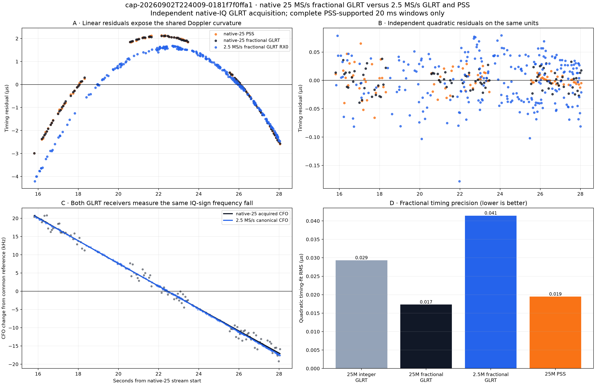
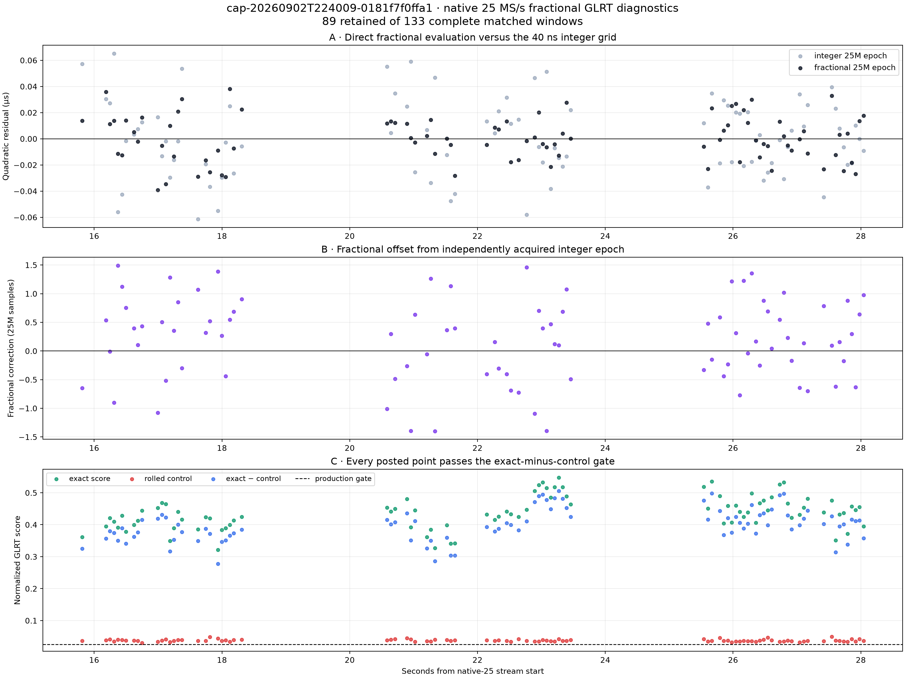

# Native 25 MS/s fractional GLRT comparison for `0181f7f0ffa1`

Capture: `cap-20260902T224009-0181f7f0ffa1`  
Analysis date: 2026-09-03 UTC  
Signal: Starlink channel 4 upper edge  
High-rate path: `radio_pluto_5d4d` / stream 0 / RX0 / 25 MS/s  
Paired low-rate path: `radio_pluto_19f2` / stream 1 / RX0 / 2.5 MS/s

## Conclusion

The native 25 MS/s fractional GLRT produces a real, high-quality frame-timing
lock on this capture. It uses the stored 25 MS/s IQ directly: there is no
decimation, subband projection, or 2.5 MS/s GLRT seed.

On the common high-quality track, native-25 fractional GLRT has a quadratic
timing-fit RMS of **0.0173 µs (17.3 ns)**. That is:

- 40.9% lower than the same native-25 GLRT epochs left on their 40 ns integer
  sample grid (0.0293 µs);
- 2.39 times lower than paired 2.5 MS/s fractional GLRT RX0 (0.0414 µs); and
- close to native-25 PSS (0.0195 µs). The GLRT value is 11.1% lower on this
  selected support, but that small difference is not a general detector ranking.

The timing-derived Doppler-rate estimates close exceptionally well:

| Observable | Points | Quadratic RMS | Equivalent Doppler rate | Formal sigma |
|---|---:|---:|---:|---:|
| Native-25 integer GLRT | 89 | 0.0293 µs | +3,075.88 Hz/s | 6.09 Hz/s |
| **Native-25 fractional GLRT** | **89** | **0.0173 µs** | **+3,067.76 Hz/s** | **3.60 Hz/s** |
| Native-25 PSS, same retained epochs | 89 | 0.0195 µs | +3,066.84 Hz/s | 4.04 Hz/s |
| 2.5 MS/s fractional GLRT RX0, common interval | 242 | 0.0414 µs | +3,071.08 Hz/s | 5.52 Hz/s |

Native-25 GLRT differs from PSS by only **+0.91 Hz/s (0.030%)** and from the
paired 2.5 MS/s GLRT by **−3.32 Hz/s (0.108%)**. The formal sigmas overlap.
They do not include the effective loss of degrees of freedom caused by temporal
correlation, so the agreement is more informative than the nominal precision.

## What was run

The independent-blind PSS result contains one long, precise track with 133 mode
epochs from 15.6225 to 28.0425 seconds on the native-25 device axis. Each mode
center defines a complete 20 ms native-IQ test window. Within every window the
standard GLRT performs its normal independent wide CFO/epoch acquisition, ranks
the candidates, applies the exact-minus-rolled-control margin gate, and refines
the winning integer epoch.

The fractional refinement is the current sample-rate-independent path:

1. Evaluate the circular five-cell integer GLRT surface around the acquired
   frame epoch.
2. Require a bracketed, concave peak in log-score space.
3. Evaluate the exact and control GLRT directly at that continuous coordinate
   using normalized 16-tap Lanczos IQ interpolation.

PSS selects only the time support for this bounded high-rate experiment. It
does not supply the native-25 GLRT epoch, CFO, frequency slope, or candidate.
This distinction matters: the result is an independent acquisition on a
PSS-selected observation schedule, not a PSS-conditioned correlation replay.

All 133 requested windows were verified complete, belonged to exactly one
continuity segment, and avoided the capture's counter-proven gaps. Of them:

- 89 (66.9%) passed the production margin gate and had a complete fractional
  peak;
- 19 (14.3%) did not pass the exact-minus-control margin gate; and
- 25 (18.8%) passed the integer decision but had an unbracketed or non-concave
  local fractional surface, so the fractional result failed closed.

An unbracketed refinement is not an integer-GLRT acquisition failure. It means
the local five-cell surface cannot support a truthful sub-sample interpolation.
Only the 89 complete fractional results are plotted or fitted.

## Timing comparison

The top-left panel of the comparison figure removes an independent affine fit
from each timing series. Its arcs are the shared Doppler curvature. Native-25
PSS and native-25 GLRT overlay closely even though their detection methods are
independent. The 2.5 MS/s curve has the same curvature but a different affine
position because it uses another radio, clock, tuner, and observation support.

The top-right panel removes an independent quadratic fit. Native-25 fractional
GLRT is no longer quantized to 40 ns steps and has 17.3 ns RMS. Its
affine-removed pointwise difference from PSS is 26.2 ns RMS. This is consistent
with two independent estimators having roughly 17–19 ns individual scatter;
it is not evidence that they share one numerical result.

Fractional refinement also improves the inferred rate. The integer native-25
estimate is 9.04 Hz/s away from PSS; the fractional estimate is only 0.91 Hz/s
away. Thus fractional timing is doing more than cosmetically smoothing the
plot—it materially reduces the sampling-grid contribution to curvature.

## CFO comparison and sign

The fitted direct GLRT CFO slopes are:

| GLRT path | CFO slope at 22.450 s | CFO-fit RMS |
|---|---:|---:|
| Native 25 MS/s | −3,086.17 Hz/s | 1,214 Hz |
| Paired 2.5 MS/s RX0 | −3,118.23 Hz/s | 105 Hz |

The absolute CFO intercepts are intentionally not compared. The radios have
independent oscillators and different tuner/baseband centers: the native-25
intercept is about 8.186 MHz while the canonical low-rate intercept is about
59.9 kHz. Those are different coordinates, not different satellites.

Both direct GLRT CFO trajectories fall with time. Their negative slopes are the
receiver-IQ/mixer sign. The timing-derived equivalent physical Doppler rate uses
`−f_RF × timing_curvature`, so it is positive. The apparent sign disagreement is
therefore the already identified coordinate convention, and the native-25
result reproduces it within the same receiver: falling direct CFO accompanies
positive timing-derived Doppler rate.

The noisier native-25 independent CFO values do not contradict the better
native-25 epoch lock. CFO and timing are different fit coordinates. This run
uses a fixed 20 ms observation, and the high-rate CFO winner still has visible
per-window acquisition scatter. The frame epoch uses a wideband correlation
peak and then continuous interpolation, which is the quantity improved here.

## Limits

- This is a targeted matched-support experiment, not the full 5,999-window
  standard 60-second GLRT scan.
- The native-25 PSS track determines which complete windows are evaluated, so
  the 66.9% retained fraction must not be presented as capture-wide detection
  probability.
- The 25 MS/s source has only 61.2% source-timeline density and 15
  counter-proven gaps. No result is interpolated across those gaps.
- The PSS and native-25 GLRT comparison uses identical retained times, while the
  2.5 MS/s precision row uses its 242 accepted observations over the common
  interval. Its sampling pattern is not identical.
- These are candidate signal measurements; no payload is decoded and this test
  does not establish Starlink or satellite identity.

## Reproduction and evidence

The capture-local runner is
[analyze_0181_native25_fractional_glrt.py](../tools/analyze_0181_native25_fractional_glrt.py).
It completed in 52.47 seconds with four workers. The machine-readable ledger is
[analysis-summary.json](figures/2026_09_03_0181_native25_fractional_glrt/analysis-summary.json).

Artifact SHA-256 digests:

| Artifact | SHA-256 |
|---|---|
| Evidence JSON | `5cddebaf8a77f2b4f9ca990e44c00293a79668c438e1d69ae1ae853d964b1cc9` |
| Comparison PNG | `f29aeccfc890802b3dfe8b1aac1ab0ca99f309b15f0652add2e62cd00dcb6f2f` |
| Detail PNG | `1bef15c38c19b1475c9dd127f5188600c3612f6a365db18e97727c44984aa23a` |

Input product digests, the selected PSS track ID, the selected low-rate locklet
digest, every retained native-25 GLRT row, configuration, accounting, and stated
limitations are sealed in the evidence JSON.
