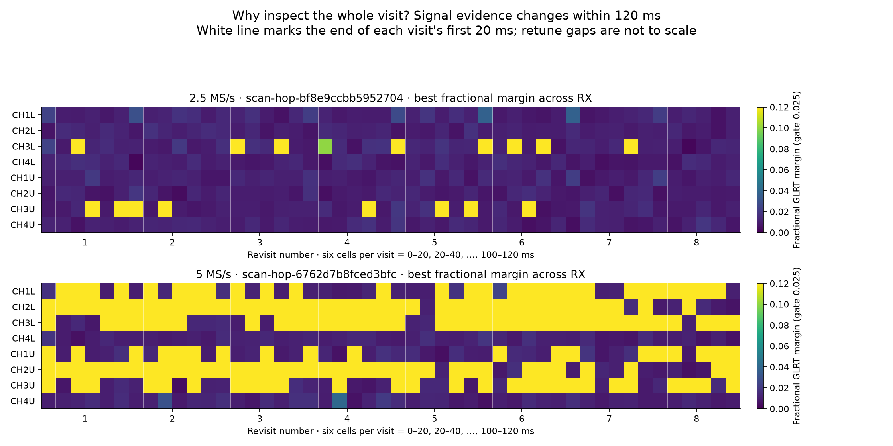
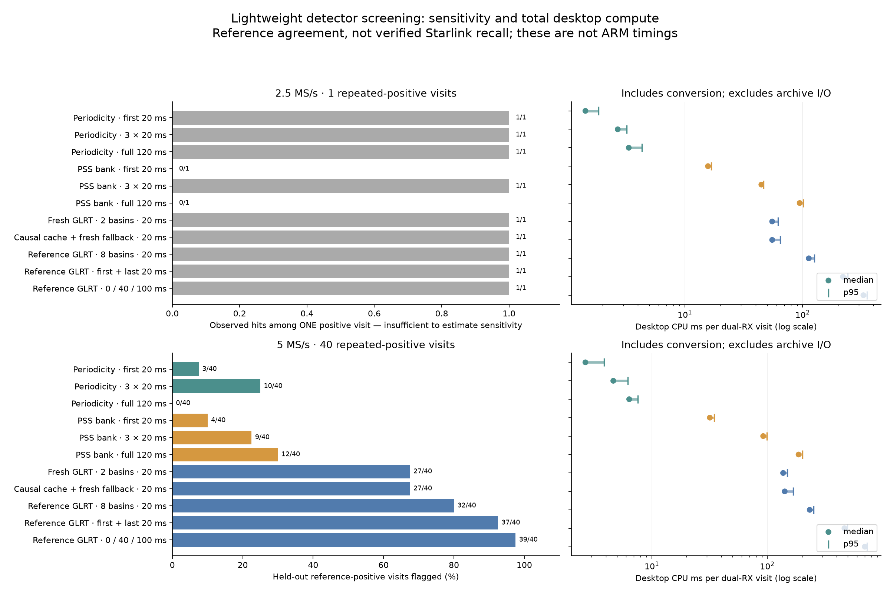
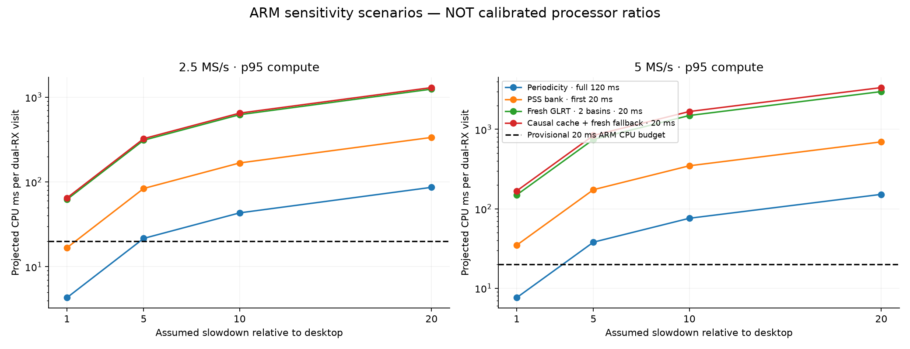
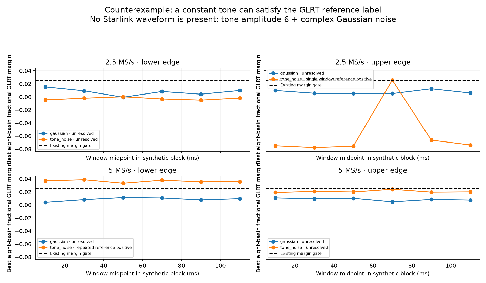
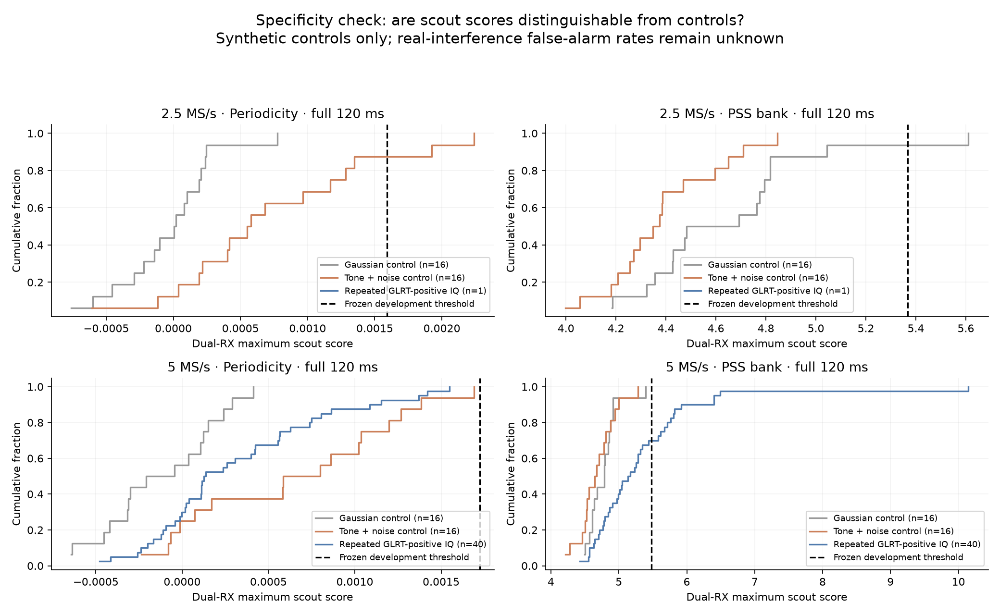

# Can a lightweight detector screen a 120 ms scanner visit on the radio ARM?

Date: 2026-09-07. Status: **desktop screening completed; no candidate qualified for deployment**.

## Executive result

We implemented and ran a small, causal desktop comparison on archived dual-receiver IQ.
There is a useful cheap-scout direction, but this experiment does **not** establish a
reliable, real-time ARM Starlink-presence detector.

The important findings are:

1. Sparse periodicity checks are inexpensive: roughly **1.4–6.4 ms median desktop CPU**
   per dual-RX visit, depending on rate and coverage. Their held-out sensitivity and
   synthetic-control specificity are inadequate for deciding that a visit contains no signal.
2. Blind PSS correlation is not automatically inexpensive. A five-frequency bank over
   all 120 ms costs **94.6 ms at 2.5 MS/s and 187.1 ms at 5 MS/s** on this desktop.
3. The simple causal cache usually failed to avoid fresh acquisition. At 5 MS/s, it
   fell back to or scheduled a fresh search on **126/128 receiver probes**. It needs a
   better timing-drift predictor, not merely a remembered epoch.
4. The most important scientific control failed: the two-basin GLRT flagged **16/16
   lower-edge 5 MS/s tone-plus-noise controls**. A separate eight-basin, six-window
   reference check also called that non-Starlink signal repeatedly positive.
5. Checking later parts of the visit matters. Of 49 held-out 5 MS/s visits with any
   fractional-reference hit, **16 had no hit in their first 20 ms**.

These are reference-agreement results, **not measured Starlink detection probabilities**.
The tone counterexample prevents treating even repeated GLRT support as independent truth.
Nothing was deployed, no RF was collected, and no radio, firmware, FPGA, or scanner
configuration was changed.

## 1. Scope and protocol

The question was intentionally narrow: can a userspace detector flag likely Starlink
presence during a 120 ms visit without delaying acquisition? Precise Doppler, trajectories,
positioning, satellite identity, and FPGA processing are outside this experiment.

We chose four already-completed, qualified 300 s scans by rate and chronology, before
scoring their IQ. We replayed **visits 1200–1263, sweeps 150–157**, from each: one short,
approximately eight-second chronological excerpt per scan. This is **not a complete
300 s detector replay** and does not characterize a whole scan's signal population.

| Split | Session | Capture UTC | Rate | Dual-RX visits |
|---|---|---|---:|---:|
| Development | `scan-hop-a5018b64a98f25e7` | 21:40:04 | 5 MS/s | 64 |
| Development | `scan-hop-0cff88ddaeec79f2` | 22:00:04 | 2.5 MS/s | 64 |
| Held out | `scan-hop-6762d7b8fced3bfc` | 22:20:04 | 5 MS/s | 64 |
| Held out | `scan-hop-bf8e9ccbb5952704` | 22:40:03 | 2.5 MS/s | 64 |

Each excerpt includes CH1L, CH2L, CH3L, CH4L, CH1U, CH2U, CH3U, CH4U and both receivers.
The study contains **256 real dual-RX visits, 512 receiver visits, and 3,072 dense
reference receiver/windows**. Rate cohorts are different recordings at different times:
their sensitivity differences must not be interpreted as a controlled sample-rate gain.

We also generated 32 dual-RX synthetic controls per rate and split: 16 complex Gaussian
noise and 16 constant-tone-plus-noise examples. They are **known synthetic negatives**,
not RF recordings labeled negative because the existing detector missed them. The main
control calibration uses the lower-edge projection. Upper-edge field false-alarm rates
are not established; a subsequent counterexample check explicitly covers both edges.

The immutable [protocol](figures/2026_09_07_arm_presence_screen_v2/protocol.json) records
input-manifest hashes, exact selections, source hashes, and algorithm settings. Scout
thresholds were frozen from development controls before opening held-out IQ. We did
not retune thresholds after viewing held-out results.

### PSS geometry correction during development

An initial preflight used the channel midpoint for PSS. Review against the existing
Standard PSS implementation identified its edge-dependent 117,187.5 Hz half-bin reference.
The corrected slice offsets are **−115,195,312.5 Hz lower and +115,195,312.5 Hz upper**
at these scanner centers, not ±115,312,500 Hz.

We reran the development scouts with that existing reviewed reference, then froze the
corrected thresholds. The GLRT, cache, and reference measurements were unaffected and
retained verbatim, with digest-bound provenance. Every reused receiver record, excluding
its newly computed scouts, was checked for exact equality. No held-out results informed
this correction. Initial scout outputs are retained separately as superseded preflight
evidence, not mixed into the final results.

## 2. Algorithms tested

### Sparse periodicity scout

Measure normalized lag correlation around the exact 750 Hz frame period and compare
against two off-period controls, at 0.93 and 1.07 times that period. Sample at most 8,192
pairs and combine eight time groups noncoherently. Use fractional-lag linear interpolation.
This is a deliberately approximate activity/periodicity scout, not the scientific GLRT
interpolator and not a Starlink-specific verdict. Pure tones are intended to cancel in
the lag-minus-control score; more general interference need not cancel.

### Blind PSS scout

Use the existing band-limited PSS template and exact fractional-period power folding.
Blindly search five CFOs: −400, −200, 0, +200, +400 kHz. Each CFO gets its own blind epoch
search. Supplying a CFO list only to the timing kernel's local refinement would not be
equivalent. This screen deliberately omits per-frame timing refinements and uses the
strongest folded robust-z score. A five-bin bank is a bounded prototype, not an exhaustive
timing/frequency/rate-error search.

Both scouts were tested over first 20 ms, three distributed windows at 0/50/100 ms,
and the whole 120 ms. Thresholds are rate- and schedule-specific, strictly above the
largest development dual-RX synthetic-control score. This small empirical calibration
does not imply a specified false-alarm probability.

### Fresh and cached fractional GLRT

The reduced baseline actually acquires **two basins**, then fractionally refines and
scores them with the existing GLRT64 implementation. It does not truncate an eight-basin
result after paying for that search. GLRT64 uses 64 OFDM symbols, not 64 frames.

The cache is isolated by session, channel/edge, and receiver. It transports device-time
and frequency hypotheses, **never carrier phase across a retune**. It subtracts elapsed
integer device counters before fractional-period arithmetic, then searches ±2.4 μs
around the predicted frame phase and fractionally scores the selected cell.

The hybrid uses a fresh two-basin search when there is no usable seed, confirmation fails,
or the four-revisit reacquisition schedule fires. It updates state only from its own
accepted results. The full reference is computed after that visit's causal decision.
A regression test makes reference-positive/cold-negative visits fail if they ever seed
the cache. Current-visit cold branches are timed independently; hybrid cost is reconstructed
from only its selected branches, not from all benchmark work executed alongside them.

The cache prototype assumes a constant physical frame period between visits. It does
**not** learn clock/propagation-induced timing drift, maintain multiple associated tracks,
or implement a sophisticated signal-arrival policy. Its poor result does not rule out
predictive tracking as an architecture.

## 3. Reference evidence is not ground truth

Every selected real visit gets six nonoverlapping 20 ms, eight-basin fractional GLRT
checks, retaining all completely refined basins. The existing margin gate is 0.025.

- **Repeated-reference-positive:** two distinct windows on the same receiver have
  passing candidates whose tracking CFOs differ by at most 8 kHz.
- **Single-window-reference-positive:** some passing evidence, but no such repeated pair.
- **Unresolved:** neither. This is not a confirmed negative.

Dual-RX visit-level detection uses an OR across receivers. We do not count the two
receivers as independent visit trials, nor join their CFOs to manufacture repeat support.

| Held-out cohort | Repeated positive | Single-only | Unresolved | Any-hit visits absent from first 20 ms |
|---|---:|---:|---:|---:|
| 2.5 MS/s, 64 visits | 1 | 14 | 49 | 8/15 |
| 5 MS/s, 64 visits | 40 | 9 | 15 | 16/49 |

The 2.5 MS/s held-out excerpt contains only **one repeated-positive visit**. A 1/1 result
is not evidence of 100% sensitivity. Development had 14 repeated-positive 2.5 MS/s visits,
illustrating the substantial time variation. More signal-rich and weak-signal holdouts
are required before sensitivity can be estimated reliably.



The plot preserves six distinct checks inside each visit. White lines separate the
first 20 ms from the remainder; retune gaps are intentionally not represented to scale.
Color saturates at margin 0.12 for readability.

## 4. Held-out sensitivity and runtime

The following 5 MS/s results use 40 repeated-reference-positive visits as the denominator.
They measure agreement with that operational reference, not verified satellite presence.
CPU figures are median/p95 **per dual-RX visit**, including CI16-to-complex conversion
and detector search/scoring, but excluding archive reading/decompression.

| Method | Repeated-reference visits flagged | Desktop CPU median / p95 | Synthetic alarms / 32 |
|---|---:|---:|---:|
| Periodicity, first 20 ms | 3/40 | 2.66 / 3.85 ms | 3 |
| Periodicity, 3 × 20 ms | 10/40 | 4.64 / 6.19 ms | 7 |
| Periodicity, full 120 ms | 0/40 | 6.38 / 7.59 ms | 0 |
| PSS bank, first 20 ms | 4/40 | 31.87 / 34.77 ms | 1 |
| PSS bank, 3 × 20 ms | 9/40 | 92.35 / 99.44 ms | 2 |
| PSS bank, full 120 ms | 12/40 | 187.05 / 201.56 ms | 0 |
| Fresh two-basin GLRT, first 20 ms | 27/40 | 137.49 / 149.45 ms | 16 |
| Causal cache + fresh fallback, first 20 ms | 27/40 | 141.82 / 167.79 ms | Not measured as a stateful control replay |
| Eight-basin GLRT, first 20 ms | 32/40 | 233.74 / 252.53 ms | Separate specificity check below |
| Eight-basin GLRT, first + last 20 ms | 37/40 | 467.03 / 494.49 ms | Not calibrated |
| Eight-basin GLRT, 0/40/100 ms | 39/40 | 700.53 / 732.65 ms | Not calibrated |

For all 49 5 MS/s visits with any reference hit, the corresponding fresh eight-basin
counts are 33, 42, and 48. More temporal coverage recovers evidence, but its brute-force
cost is unsuitable for the proposed ARM budget.

At 2.5 MS/s, reduced fresh GLRT costs **55.24/62.11 ms**; first-window PSS costs
**15.74/16.74 ms**. Their agreement with the 15 any-hit visits is only 3/15 and 1/15,
respectively. Single-window evidence itself needs independent adjudication.



### Cache behavior

The held-out 5 MS/s cache had seeds on 39 receiver probes. Among 27 seeded probes whose
first window was reference-positive, it confirmed only **2/27**. The corresponding
conditional confirmation cost was **12.77 ms median, 13.86 ms p95 per seeded receiver**.
The hybrid used fresh acquisition on 126/128 receiver probes and was slightly slower than
always running the reduced fresh search. At 2.5 MS/s it used fresh acquisition on 127/128.

A plausible next improvement is to learn frame-phase drift from earlier associated
detections. Merely advancing the nominal 750 Hz lattice cannot account for sample-clock
error and changing propagation delay. This is a hypothesis for the next experiment,
not a demonstrated explanation of every miss; wrong-basin seeds and intermittent signals
can also cause failure.

### Runtime accounting and ARM limits

Measurements used one pinned x86 desktop P-core, CPU 2, low process priority, NumPy 2.5.2,
and the existing AVX2/FMA acquisition extension. No ARM processor was benchmarked.
Process CPU and wall time are recorded separately. Results include library-cache effects
of sequential benchmarking; they are not isolated cold-start WCET measurements.

The full held-out process peaked near **285 MiB RSS**, including references, archive
decompression, and numerical caches. That is not the minimum memory of a deployed scout.
Median conversion CPU was 0.58/1.47 ms at 2.5/5 MS/s. Archive I/O is sweep-cached: median
read latency was 0.28/0.57 ms, but p95 was 22.6/61.2 ms when a sweep was decompressed.
Those archive costs are kept separate from an on-radio live-buffer detector.

The complete baseline development replay took 189.8 s; corrected scout-only development
took 51.6 s; held-out replay took 199.0 s. These are desktop experiment durations, not RF
collection times. Per-method CPU statistics exclude unrelated benchmark work.

At the measured visit cadence, even the 5 MS/s reduced fresh search builds about **788 ms
of simulated queue wait** by the end of this short excerpt at desktop speed. The hybrid
builds about **1,117 ms**. These single-worker simulations use actual device-counter
arrivals and measured CPU demand; they are not observations of the production scanner.



Five-, ten-, and twenty-fold slowdown curves are **sensitivity scenarios only**, not
calibrated x86-to-ARM ratios. The 10–20 ms per dual-RX visit goal remains provisional.
Python scout timing is also not a lower bound on an optimized C implementation.

## 5. Specificity: the decisive failed control

The held-out reduced GLRT produced no alarms on either rate's 16 Gaussian-noise controls.
At 2.5 MS/s it also rejected all 16 lower-edge tone controls. At **5 MS/s it accepted all
16 lower-edge tone controls**, with median fractional margin approximately 0.0353.

The synthetic signal is simply a 173,123 Hz complex sinusoid of amplitude 6 plus unit
standard-deviation Gaussian noise in each quadrature. It has no Starlink pilots, PSS,
OFDM frames, or satellite waveform.

A follow-up with a new fixed noise seed and the **full eight-basin fractional reference**
confirmed that the 5 MS/s lower-edge tone passes the gate in all six windows and satisfies
the repeated/CFO-consistent label. The upper-edge 2.5 MS/s case produced one passing
window; the other tone cases did not satisfy the repeated label.



This is a counterexample to using this GLRT margin and repeated-CFO check alone as a
Starlink-presence verdict. It does **not** establish that the corresponding archived RF
detections are tones or false satellite tracks. It does require better independent
adjudication before those detections become truth labels for detector training.



Development-max scout thresholds did not generalize cleanly to held-out controls. For
example, the 5 MS/s distributed periodicity scout alarms on 7/32 controls while flagging
only 10/40 repeated-reference visits. A score that is both cheap and frequently positive
is not necessarily a useful presence detector.

Even **0/32** synthetic alarms would permit an approximately **8.9% one-sided 95% upper
bound** under independent identical trials. Demonstrating an approximately 0.1% rate
with zero alarms would require about 3,000 such trials, plus realistic interference
coverage. The current experiment does not support that false-alarm claim or scan-cluster
confidence intervals; each held-out rate has only one short scan excerpt.

## 6. What to do next

**First: improve evidence specificity and label quality.** Test disjoint known-pilot
verification, additional wrong-template controls, and a narrowband-tone nuisance model.
Check gates across both edges, rates, CFOs, tone powers, colored noise, and real RF
interference. Do not simply raise the GLRT threshold on this one counterexample: that
could hide weak genuine signals without generalizing.

**Second: test a drift-aware causal cache.** Associate earlier detections by bounded CFO
and wrapped timing; learn a small timing slope from at least two earlier hits. Predict
the next visit, retain fractional confirmation, and use explicit expiry and reacquisition
limits. Separate reacquisition failures from confirmatory kernel cost. No TLE, known
position, firmware, or cross-retune carrier-phase assumption is needed.

**Third: revisit the cheapest cold-start search.** Profile a sparse known-pilot search
and a short/distributed scout before spending on full acquisition. Measure both weak
signal loss and tone/interference rejection. A filtered 5→2.5 MS/s paired-IQ comparison
and candidate budgets beyond the present 2-versus-8 screen remain untested.

Use cheap scouts initially to **prioritize follow-up**, not to discard IQ or suppress
analysis. Any cascade must account for scout false negatives and periodic blind
reacquisition so newly arriving signals are not permanently missed.

**Only then run a bounded ARM replay of existing IQ.** Measure actual userspace CPU,
memory, worst-tail latency, backlog, and impact on acquisition. No tested candidate
currently clears both the quality and compute requirements, so no radio-host installation
or ARM load experiment was started in this turn.

## 7. Implementation, tests, and reproduction

New research-only numerical code:
[arm_presence.py](../src/leo/analysis/research/arm_presence.py).
No existing analyzer, public persisted contract, runtime acquisition component, or
golden scientific fixture was changed.

Tools:

- [evaluate_arm_presence.py](../tools/evaluate_arm_presence.py): frozen selection,
  read-only archive adapters, causal replay, controls, threshold freeze, raw timing.
- [report_arm_presence.py](../tools/report_arm_presence.py): paired-visit aggregation,
  descriptive queue scenarios, and five PNGs.
- [verify_arm_presence_tone.py](../tools/verify_arm_presence_tone.py): bounded synthetic
  counterexample reproduction.

**55 tests passed**, covering new detector and report logic plus existing PSS, GLRT
benchmark, and persistent-hop analysis regressions. New tests cover fractional physical
periods, large integer counters, causality/no-reference leakage, candidate-budget placement,
blind PSS-bank execution, half-bin projection, disjoint scan splits, threshold freeze,
dual-RX CPU accounting, and queue accumulation. Lint checks passed for all new files.

From a checkout with dependencies and its local numerical extension available, using an
account with read access to the archive, choose a **new output directory outside the
archive** and run:

```bash
PYTHONPATH=src OPENBLAS_NUM_THREADS=1 python tools/evaluate_arm_presence.py freeze --root /srv/bulk/leo --output /path/to/new-output
PYTHONPATH=src OPENBLAS_NUM_THREADS=1 python tools/evaluate_arm_presence.py develop --root /srv/bulk/leo --output /path/to/new-output
PYTHONPATH=src OPENBLAS_NUM_THREADS=1 python tools/evaluate_arm_presence.py heldout --root /srv/bulk/leo --output /path/to/new-output
PYTHONPATH=src OPENBLAS_NUM_THREADS=1 python tools/verify_arm_presence_tone.py /path/to/new-output/tone-reference-check.json
python tools/report_arm_presence.py /path/to/new-output
```

The normal reproduction path needs no reused preflight. `--reuse-development` exists
only to retain unchanged, hash-bound GLRT measurements while correcting the PSS projection.
Pinning one core and recording its identity is recommended for comparable timing.

Artifacts: [summary](figures/2026_09_07_arm_presence_screen_v2/summary.json),
[thresholds](figures/2026_09_07_arm_presence_screen_v2/thresholds.json),
[held-out receiver evidence](figures/2026_09_07_arm_presence_screen_v2/heldout-visits.jsonl),
[held-out controls](figures/2026_09_07_arm_presence_screen_v2/heldout-controls.jsonl),
[tone reference check](figures/2026_09_07_arm_presence_screen_v2/tone-reference-check.json),
[execution metadata](figures/2026_09_07_arm_presence_screen_v2/heldout-execution.json).

The acquisition service was checked after the replay: still active with the same PID
3852299 and start time 2026-09-07 20:44:53 UTC. The deployed release remained
`39146ee83d00523fbd37ba02179c87a5c241a017`. No deployment or remote-main changes were made.
