# From continental uncertainty to regional positioning with Starlink Doppler

Date: 2026-09-07. Corpus/research base: remote `main`,
`12d687e00a8fb1fea722ceae89ad7ec2fd9bb5e9`. Publication also incorporates the
subsequent `be33620f` main update; it does not change this study's RF inputs.

## Results at a glance

Starting from the new **5,000 × 5,000 km** region centred at
**43.6914344°, −106.8991205°**, the nominal-TLE, unknown-height estimate finishes
**1,805 m horizontally from the evaluation coordinate**, with **285.0 Hz
held-out CFO RMS**. Its inferred location is **37.853649440°, −122.465961367°**.
The estimator did not use the true coordinate or an earlier Oakland solution
to seed the search. This is useful continental-to-regional localization, not
a validated precision-positioning service.

The four independent Oakland-centred squares of side 100, 500, 1,000 and
2,000 km remain in the same analysis. Across all five starts, nominal-TLE fits
with unknown height finish **1.54–1.81 km** from the evaluation coordinate.

Small shared orbit-time corrections improve held-out CFO residuals but worsen
horizontal position in all five experiments. Incorrect-time controls also
produce sharp, wrong geographic peaks. Consequently neither low residuals nor
a sharply peaked composite score is a sufficient integrity test.

The original four searches ran independently in parallel; the continental
extension used an independent starting grid. No estimate was transferred
between regions. There are **22 complete grid replays**, each processing
the same **24 scans and 502 RF episodes**, plus **20 continuous local fits**:
five regions × fixed/unknown height × nominal/bounded orbit time. No new RF collection,
scanner deployment, firmware change, FPGA change, or database mutation occurred.

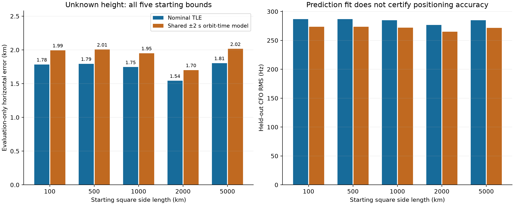

The largest search also exposes a major failure mode: 250 and 125 km global
sampling select locations **1,744 and 3,499 km away**. Refining the 125 km
branch still misses by 2,927 km. An independent 50 km **whole-region** check
finds the much stronger mode that local physical fitting can use.

## Introduction

Can a stationary receiver determine where it is from archived satellite radio
observations without being given its location or the satellites' identities?
This study jointly searches geographic location and causal Starlink catalogue
hypotheses, accumulating evidence from short Doppler tracks across eight hours.
It does not assume that an individual short arc uniquely identifies a satellite.

The expanded experiment starts with a **5,000 × 5,000 km square centred at
43.6914344°, −106.8991205°**, as requested. Its 25 million square-kilometre map
area is 25 times the original 1,000 km square's map area. This is a continental
cold-start test: the earlier Oakland-centred position estimates are not passed
to the new search. The centre defines the permitted region only.


*Introduction figure.* The actual curved boundaries of the declared map squares
are shown in latitude/longitude, not drawn as approximate longitude rectangles.
The backdrop is public-domain [Natural Earth land data](https://www.naturalearthdata.com/downloads/110m-physical-vectors/110m-land/),
with its [source and digest retained](figures/2026_09_07_blind_regional_pnt/map-source.json).
No true receiver marker is used in this figure.

The new case changes both the centre and the size of the starting region. It is
therefore a more demanding independent start, **not a controlled size-only
ablation**. All five cases reuse the same radio corpus and are not five
independent real-world accuracy trials.

## Motivation: why more Doppler tracks can help—and mislead

A short CFO arc contains a strong trend but also unknown transmitter/receiver
frequency offsets. Once an independent constant is allowed for each segment,
many satellites seen from many Earth locations can explain a similar local
slope. Curvature and additional orbital viewing geometries can distinguish
these explanations. The aim is to accumulate that distinguishing information
without granting the estimator the answer through a known observer position.

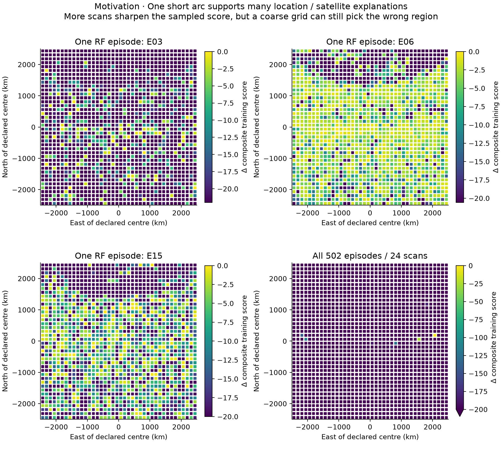

*Motivation figure.* Three individual RF episodes from the first scan are
compared with the complete 24-scan training score on the 125 km continental
grid. Brighter means better relative fit on the sampled cells, not calibrated
probability. The combined map is sharper, but that branch still misses the
good geographic region. Accumulation cannot recover a narrow mode that the
grid never adequately samples.

The combined panel clips colours below 200 score units from its maximum to
expose the competing peaks; its scale differs from the single-episode panels.

This is why the experiment compares spatial resolutions, retains failed
branches, reserves later CFO samples for prediction tests, and evaluates
position separately. Lower frequency residuals alone are not sufficient
evidence of a more accurate receiver location.

## Approaches: independent starts, retained alternatives, separate evaluation

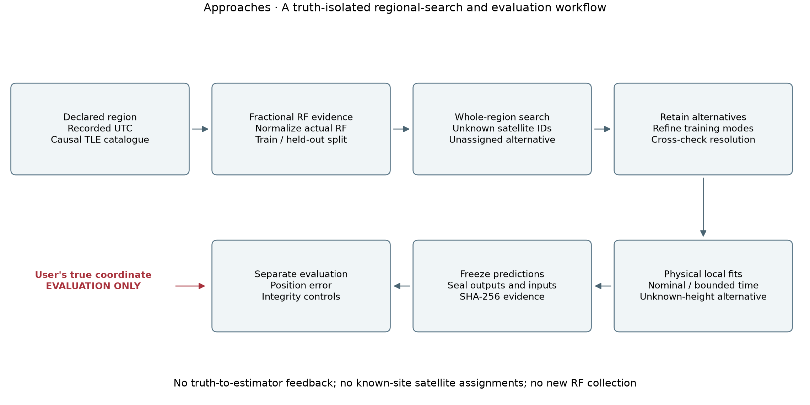

*Approaches figure.* The answer coordinate enters only the reporting/evaluation
side after inference files are sealed. The regional search has unknown satellite
identities and an explicit unassigned alternative; continuous fits then freeze
the training-selected identity hypotheses.

We compare four complementary approaches:

1. **Independent coarse-to-fine regional searches.** These establish whether
   a good region can be found from each declared prior without a transferred seed.
2. **Whole-region resolution checks.** Additional grids test whether local
   refinement is trapped around a poor coarse candidate. The 5,000 km case
   specifically compares 250, 125 and 50 km global spacing.
3. **Physical continuous refinement.** Nominal-TLE fits are compared with a
   small shared orbit-time correction, at fixed and unknown height.
4. **Integrity controls.** Incorrect recording times test whether a sharp,
   apparently supported location can nevertheless be wrong.

No new radio data, surveyed-site calibration, receiver truth or prior
known-site satellite winner is supplied to these inference paths.

## Methods: what was and was not supplied to the estimator

For the first four cases, the user specified Oakland as the geographical centre. We declared the centre
as 37.8044° N, 122.2712° W, with uniform coarse sampling over each square. The
centre is a boundary-definition input, not a receiver observation or preferred
optimizer starting point. Coarse cells are centred between grid boundaries;
the centre itself is not given special treatment.

The later user-provided answer, **37.8490428024417, −122.48567437412359**, was
stored in a separate [evaluation-only file](evaluation/2026_09_07_regional_position_truth.json).
It was not read by the inference tools. All inference output files were sealed
with SHA-256 digests before the evaluator opened this answer. The coordinate
was available to the human-facing conversation during development, so this is
**algorithmically truth-isolated retrospective research**, not a claim of a
personally blinded or preregistered prospective experiment.

Inputs to inference were:

- The user-defined region and a stationary-receiver assumption.
- Fractional RF-only CFO observations, timestamps, source identities, and RF metadata.
- Archived TLE snapshots collected before each scan with a five-second guard.
- Only Starlink element epochs preceding each recording reference.
- Recorded UTC timestamps, held fixed in the primary experiments.
- A declared near-Earth height model, not the surveyed site altitude.

Excluded inputs were the earlier report's observer configuration, NORAD match
results, known-site horizon lists, fitted orbit corrections, candidate registry,
and the receiver's true latitude/longitude. The new adapter does not import the
old scorer, which contains the known observer. It whitelists RF fields and
rejects reused candidate observations across episodes.

The [PNT paper, §8.1](https://people.engineering.osu.edu/media/document/2025-08-06/kassas_unveiling_starlink_for_pnt.pdf)
explicitly corrected temporal/orbital errors using knowledge of receiver
position. That calibration is not used here. Its metre-level results are not
an accuracy expectation for this uncalibrated, unknown-identity experiment.

### Corpus and holdout definition

We reuse the sealed [eight-hour corpus](2026_09_07_eight_hour_scan_tracking_and_positioning.md):
24 completed 300 s scans, alternating 2.5 and 5 MS/s, containing 502 consolidated
RF channel episodes. Median episode duration is 17.34 s; the individual tracks
are not 300 s continuous satellite passes. The receiver is treated as stationary
throughout the eight-hour window.

The regional stage evaluates every episode, not just the 176 candidates that
passed the previous known-site catalogue screen. For each source segment:

1. The first 60% of observations are training.
2. The last 40% are held out.
3. At most six observations per partition are deterministically retained for
   the regional search, evenly spread through that partition.
4. Continuous local fits restore every observation in the selected episodes.

The source RF tracklets and upper/lower associations were previously built
using their complete within-scan RF support. Holdout claims are therefore
conditional on retrospective RF extraction, not end-to-end prospective detection.

The coarse full-region histories incorporate training data chronologically.
Adaptive grids, however, are selected using the parent run's complete training
history. Their early-scan histories must **not** be described as prospective
cold-start performance. The final 40% CFO values never choose a regional cell,
identity, offset, refinement centre, or continuous-fit parameter.

### Physical measurement model


*Methods figure.* An RF-associated lower/upper pair is shown before and after
frequency normalization, followed by its chronological train/test partition.
Offsets are removed independently using each segment's training mean for this
illustration; the lines are not forced to overlay. In the estimator, offsets
are instead estimated relative to each satellite's physical prediction.

The existing RF export normalizes each source to 11.2 GHz using its actual RF
frequency. We retain that convention:

$$
\widetilde f_i(t)=f_i(t)\frac{11.2\,\mathrm{GHz}}{f_{\mathrm{RF},i}}.
$$

For a trial Earth-fixed receiver position \(x\), the satellite prediction is

$$
D_s(t;x)=-\frac{11.2\,\mathrm{GHz}}{c}
\frac{(r_s(t)-x)^T v_s(t)}{\|r_s(t)-x\|}.
$$

Each continuous source segment gets an independent constant frequency offset,
estimated from training samples only. No segment gets a freely fitted slope,
quadratic, or cubic to erase geometric differences. Upper and lower edges retain
the differential Doppler correction through RF normalization. No carrier-phase
continuity is assumed across hops.

Satellite states use SGP4 and the existing TEME-to-ECEF transform, including the
Earth-rotation velocity term. The region uses an explicitly declared spherical
azimuthal-equidistant coordinate square; Doppler positions lie on WGS84 rather
than on a flat 1,000–5,000 km tangent plane. Region side lengths are map distances,
not a surveyed geodesic boundary.

An orbit-time correction advances the satellite's inertial orbital state while
keeping Earth rotation at the observation's receive time. It is therefore
different from changing the recording's UTC timestamp. Full SGP4 predictions,
not a permanently frozen first-order Doppler tangent, are evaluated during the
local correction fit.

### Regional search and ambiguity handling

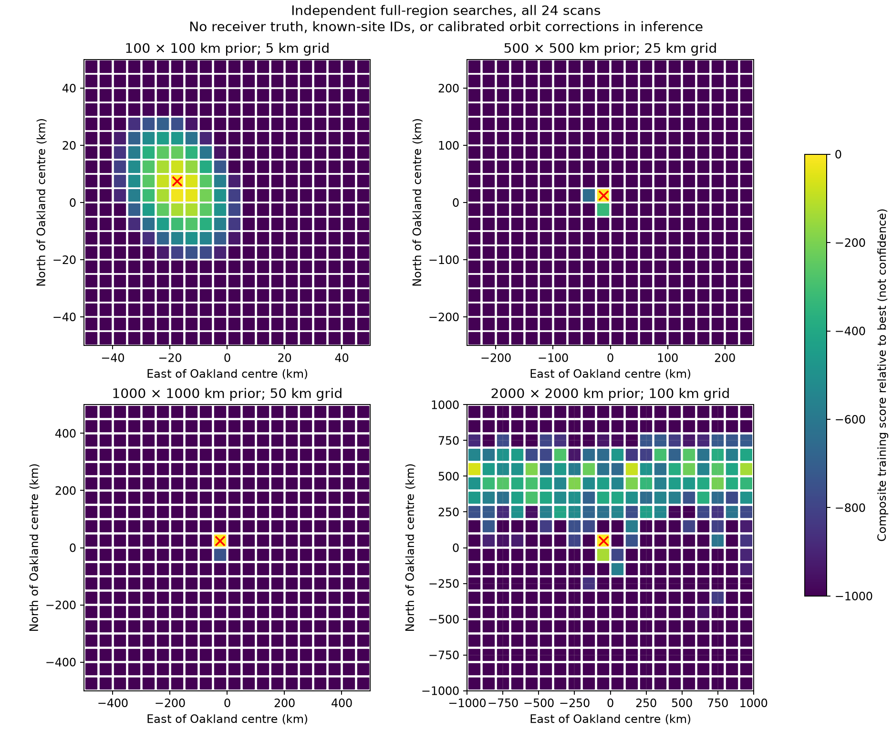

The first stage uses 400 cell centres for each region, equalizing initial grid
work while exposing resolution sensitivity:

| Square side | Initial cell spacing | First refinement spacing | Second refinement spacing |
|---:|---:|---:|---:|
| 100 km | 5 km | 1 km | 0.2 km |
| 500 km | 25 km | 5 km | 1 km |
| 1,000 km | 50 km | 10 km | 2 km |
| 2,000 km | 100 km | 20 km | 4 km |

Three separated training-score neighbourhoods are retained at each refinement.
No evaluation coordinate or held-out value enters this choice. Refinement is
bounded, not an exhaustive proof that no unsampled geographic mode exists.

Two additional independent whole-region runs check spatial sampling: a 25 km
grid over the 1,000 km square (1,600 cells), and a 50 km grid over the 2,000 km
square (1,600 cells). The latter selected the same final 50 km cell as the
1,000 km coarse search. It was a check, not a warm start for the 2,000 km branch.

For each cell and episode, the score marginalizes over all admitted causal
satellites and an unassigned model. The satellite prior is divided by the full
causal catalogue count, not by the locally visible count. This prevents a
location gaining an artificial advantage simply by having fewer candidates.
A conservative region-wide horizon envelope reduces computation; actual
template visibility is checked on training observations at each location.

Source-balanced training residuals use a 250 Hz signal scale, a 30 kHz broad
unassigned scale, a 0.5 signal mixture prior, and six effective observations per
episode/partition. These are **composite scores** with profiled frequency offsets,
not calibrated log probabilities. Offset uncertainty, temporal correlations,
receiver correlations, and all satellite-state errors are not fully marginalized.

The held-out score uses the training-conditioned identity mixture and frozen
offsets. It does not choose whichever satellite happens to fit the test data.
The model factorizes episode assignments: it does not yet enforce a persistent
multi-scan satellite-state graph or a global one-channel-at-a-time constraint.

## Results: what accumulated scans accomplish

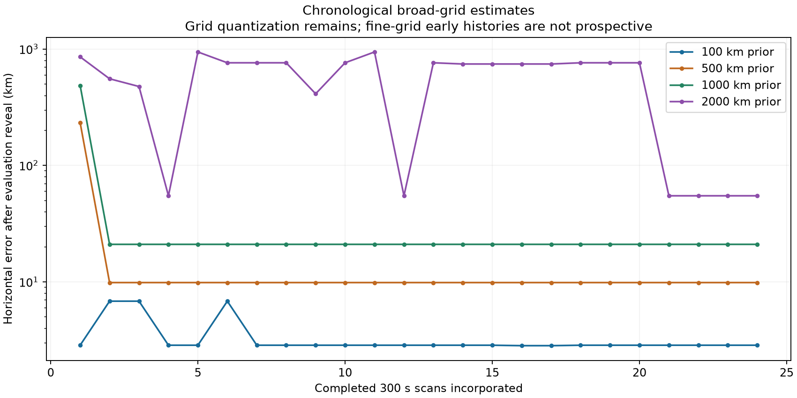

The original 2,000 km, 100 km-spacing search initially favours geographically distant
alternatives and changes its leading region repeatedly. By its final scans it
selects a cell near Oakland. This supports accumulating diverse orbital geometry
rather than treating one short Doppler arc as a unique satellite/location match.

Coarse-grid horizontal errors after evaluation reveal are 2.85, 9.83, 20.94, and
54.75 km for the 100, 500, 1,000, and 2,000 km regions. Those are not the final
position estimates: much of the difference is spatial quantization. The second
refinement grids finish at 2.44, 2.39, 1.83, and 1.31 km respectively. Continuous
fits then remove cell quantization but can expose measurement/model bias.

The fact that the 2,000 km branch ends slightly closer than the 100 km branch
does not establish a benefit from a larger prior. The branches use different
grid resolutions and freeze slightly different candidate assignments and
training-selected episode subsets.

### Continental cold start: global coverage matters more than local polish

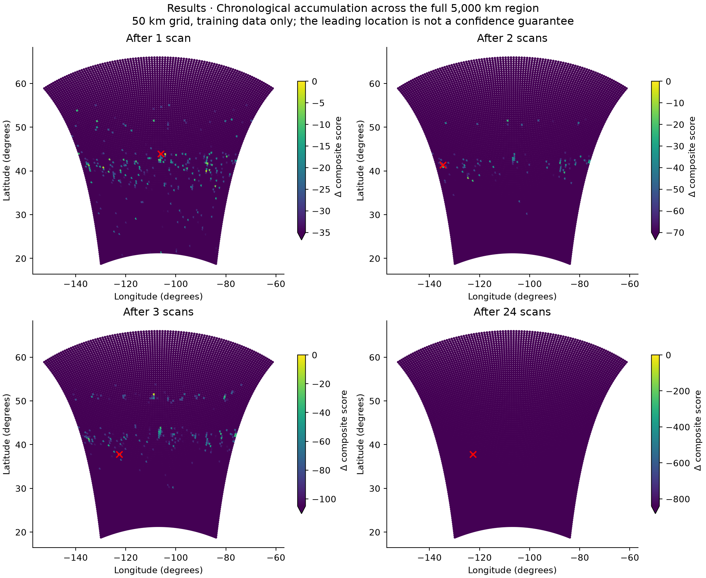

*Results figure.* Training evidence accumulates chronologically on the complete
10,000-cell, 50 km continental grid. The red cross is the best sampled location
at that stage—not the evaluator's answer. Unlike a retrospectively selected
fine-grid history, this coarse grid was defined before inspecting these scans.
The same leading cell persists from scan three through scan 24. This is an
offline conditional history, not a validated time-to-first-fix result.

The 250 km and 125 km grids disagree strongly on the leading region. Refining
eight separated 125 km-grid neighbourhoods at 25 km spacing does not recover
the high-support western mode. We therefore retain that entire branch and
compare it with an independent **whole-region** 50 km grid—not a small patch
around an earlier Oakland estimate.

The full 50 km grid scores **9,279.9 training / 12,899.1 held out**, compared
with **7,734.5 / 6,041.3** for the full 125 km grid and **7,761.8 / 6,739.6** for
that grid's local refinement. These within-continental-run score comparisons
use the same causal catalogue prior and observation model. Model settings were
not adjusted to minimize revealed coordinate error.

The next local grid samples eight training-selected neighbourhoods at 10 km
spacing. A second local refinement retains three neighbourhoods at 2 km
spacing before continuous physical fitting. Local grids remain conditional on
the retained modes; they are not full continental searches at those spacings.

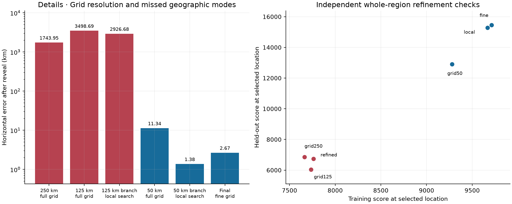

*Resolution figure.* Both the geographic misses and the score comparisons are
retained. Red denotes the coarse branch that failed; blue denotes the
independent 50 km branch and its descendants. The horizontal-error axis is
logarithmic, so thousands of kilometres and kilometre-scale results can be
shown honestly in the same figure.

| Continental stage | Sampled cells | Spacing | Training score | Held-out score | Horizontal error after reveal | Replay wall time |
|---|---:|---:|---:|---:|---:|---:|
| Full 250 km grid | 400 | 250 km | 7,664.2 | 6,850.1 | 1,743.95 km | 106.0 s |
| Full 125 km grid | 1,600 | 125 km | 7,734.5 | 6,041.3 | 3,498.69 km | 304.3 s |
| Eight patches from 125 km grid | 935 | 25 km | 7,761.8 | 6,739.6 | 2,926.68 km | 151.5 s |
| Independent full 50 km grid | 10,000 | 50 km | 9,279.9 | 12,899.1 | 11.34 km | 1,477.7 s |
| Eight patches from 50 km grid | 935 | 10 km | 9,667.7 | 15,278.8 | 1.38 km | 135.4 s |
| Three final local patches | 351 | 2 km | 9,711.5 | 15,449.2 | 2.67 km | 60.8 s |

Counts are unique sampled points after overlaps/boundary clipping. Wall times
are recorded replay elapsed times, not a controlled multi-machine benchmark.
The full 50 km check takes approximately 24.6 minutes; the later local grid
passes together take about 3.3 minutes. This is archived-data CPU work, not an
additional radio recording or a real-time operational performance claim.

The 10 km grid happens to land closer to truth than the 2 km grid, although
its training score is lower. We retain the training-selected refinement and
all reported alternatives rather than selecting the apparently lucky cell
after reveal. Finer sampling better optimizes this model; it cannot remove
model bias, questionable identities, or correlated RF errors by itself.

### Continuous physical fits and orbit corrections

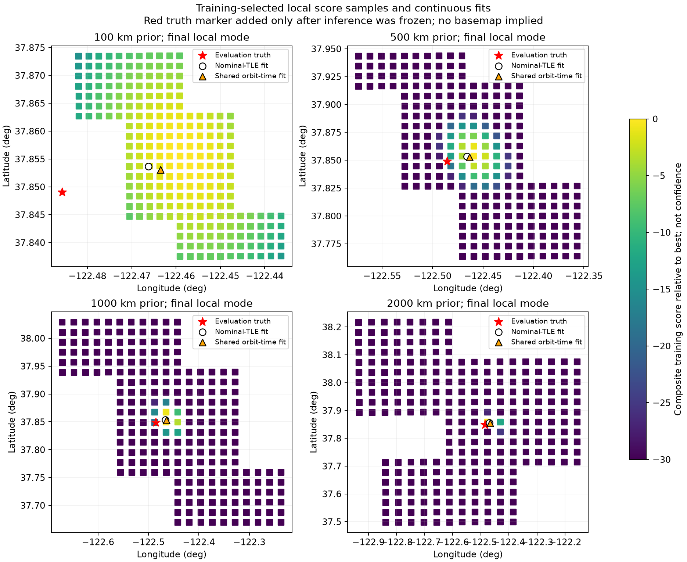

The local stage freezes the identities selected at each final blind regional
mode. It admits episodes with training signal-mixture weight at least 0.95 and
training RMS no greater than 500 Hz; these permissive research gates are not
satellite identity certification. The original four branches retain 493, 493, 492, and
490 episodes, respectively, and restore 22,416–22,694 individual observations.
The 1,000 km branch contains 273 provisional NORAD numbers grouped into 282
NORAD/TLE-snapshot correction groups. These are not 273 independently verified
satellite identities.

We run four alternatives per region:

- Nominal TLE, fixed zero ellipsoidal height: a conditional baseline, not use of
  the known site altitude.
- Nominal TLE, unknown height: estimate height with a zero-centred 1 km prior
  and hard bounds −500 to +5,000 m.
- Each of these with a shared orbit-phase correction per NORAD/TLE snapshot,
  zero-centred 0.5 s prior and hard bounds **−2 to +2 s**.

All same-group observations, including different channels/scans, share the
correction. The fit cannot reset the correction independently for every short
source segment. A robust objective and Schur elimination keep this small;
all 20 fits converge numerically. Numerical convergence does not certify the
correct identity, location, height, or uncertainty.

### Unknown-height results

**Horizontal error** is the ground-surface separation between the inferred
latitude/longitude and the evaluation-only coordinate. This evaluator uses
great-circle distance with radius 6,371,008.8 m, excluding altitude. It is not
the size of the starting box, a Doppler residual, a confidence radius, or an
estimated uncertainty available to the receiver.

| Prior side | Nominal-TLE horizontal error | Bounded-time horizontal error | Nominal held-out RMS | Bounded-time held-out RMS |
|---:|---:|---:|---:|---:|
| 100 km | 1,784 m | 1,995 m | 287.0 Hz | 273.7 Hz |
| 500 km | 1,795 m | 2,006 m | 286.8 Hz | 273.4 Hz |
| 1,000 km | 1,745 m | 1,952 m | 284.9 Hz | 272.1 Hz |
| 2,000 km | 1,543 m | 1,701 m | 276.6 Hz | 265.2 Hz |
| 5,000 km, new centre | 1,805 m | 2,016 m | 285.0 Hz | 271.5 Hz |

The continental local stage retains **493 episodes**, **1,069 source segments**
and **22,694 observations**, with **269 provisional NORAD identities** across
**279 NORAD/TLE-snapshot groups**. All four new local fits converge in seven
iterations. These are conditional satellite hypotheses, not independently
confirmed identities or resolved cross-scan handoff histories.

| Continental local model | Horizontal error | Training RMS | Held-out RMS | Fitted height |
|---|---:|---:|---:|---:|
| Nominal TLE, fixed height | 2,179 m | 124.9 Hz | 283.4 Hz | 0 m, assumed baseline |
| Bounded orbit time, fixed height | 2,356 m | 115.7 Hz | 270.1 Hz | 0 m, assumed baseline |
| Nominal TLE, unknown height | 1,805 m | 124.7 Hz | 285.0 Hz | −265 m |
| Bounded orbit time, unknown height | 2,016 m | 115.5 Hz | 271.5 Hz | −249 m |

The unknown-height bounded-time coordinate is **37.853036270°, −122.463278369°**.
Its largest fitted orbit-time correction is **0.533 s**, within the same ±2 s
bound used for the other regions. No correction reaches that bound. Its lower
held-out RMS is accompanied by about **211 m worse horizontal error**.
There is no supplied truth altitude, so neither fitted height has an accuracy
interpretation.

For example, the 1,000 km nominal-TLE, unknown-height solution is
**37.853493545, −122.466609746**. Its error is calculated only by the separate
evaluator. The shared-time alternative is **37.852825124, −122.463968595**.

For the original four regions, fixed-height nominal errors are 2,164, 2,166, 2,121, and 1,905 m; the
fixed-height bounded-time errors are 2,339, 2,344, 2,294, and 2,027 m. Reporting
all variants avoids choosing a preferred model because its revealed position
error happens to be smaller.

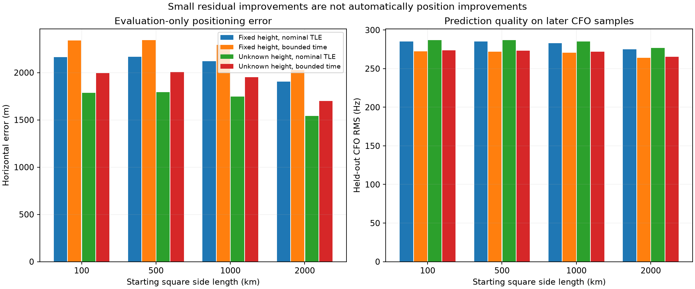

Unknown-height estimates are approximately −218 to −269 m relative to WGS84.
The true altitude was not supplied, so there is no altitude accuracy result.
Height can absorb orbit/model errors; it should not be interpreted as an
independently reliable elevation estimate.

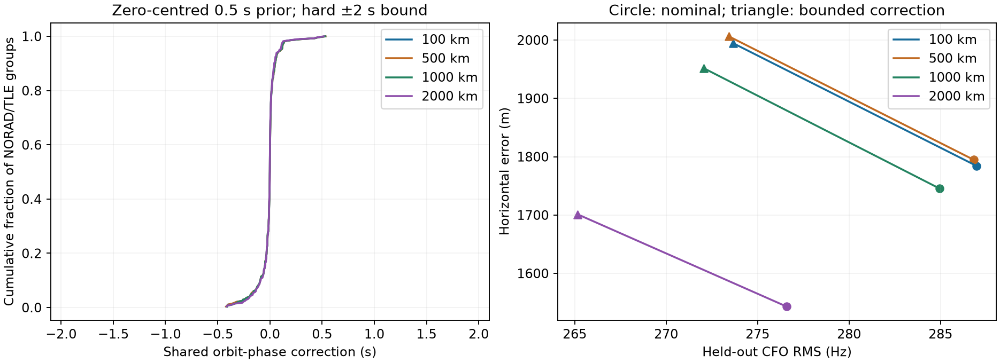

No unknown-height correction reaches its ±2 s bound. Maximum absolute fitted
corrections are about 0.51–0.53 s. Nevertheless, adding corrections moves the
estimated receiver farther from the answer. Held-out waveform prediction and
receiver-position accuracy are demonstrably different objectives in this data.

## Controls: why we cannot yet issue a trustworthy fix

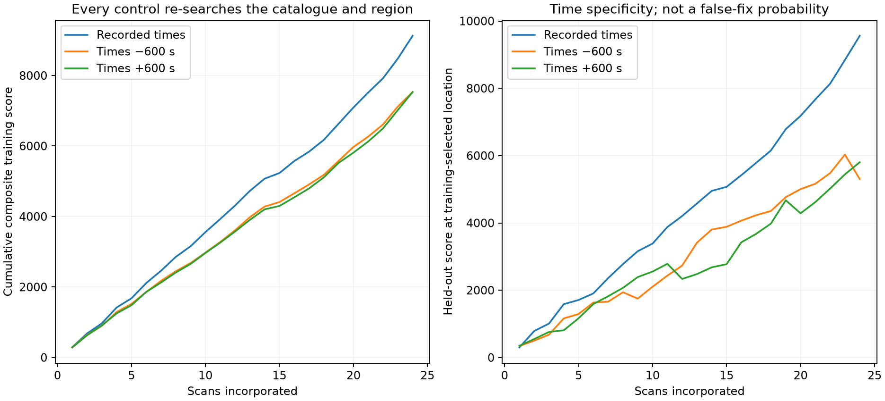

Two controls shift recording UTC by −600 and +600 s, retain the original
pre-recording TLE eligibility, and re-search the whole 1,000 km region and
catalogue at 50 km spacing. They use the same RF observations, not a preselected
known-site winner. Both finish, as do the primary searches.

| Times | Best-cell training score | Held-out score at training-selected cell | Revealed horizontal error |
|---|---:|---:|---:|
| Recorded UTC | 9,127 | 9,561 | 20.94 km, coarse grid |
| UTC −600 s | 7,531 | 5,304 | 654.98 km |
| UTC +600 s | 7,531 | 5,803 | 417.71 km |

The correct-time run has substantially stronger predictive support. But both
controls still produce positive scores and a sharp leading cell: two cells
within ten score units for −600 s, one for +600 s. The corresponding primary
coarse result also has one. Therefore:

**A narrow score peak is not a calibrated confidence region, and a positive
composite score is not a safe fix/no-fix threshold.** These controls test time
specificity, not a measured false-fix probability. Dedicated null calibration,
independent geometry checks, and unseen-pass prediction are necessary.

## Details: limitations and what remains unimplemented

1. **Retrospective corpus.** The archive was already studied. Adaptive fine
   grids use the full training cohort, and RF segmentation uses complete local
   tracks. A prospective implementation must update both using earlier-only data.
2. **Clock uncertainty.** Primary UTC is held fixed. The ±600 s controls are not
   an estimated clock state or proof of robustness to small absolute clock error.
3. **Ephemeris uncertainty.** A bounded phase correction is not a complete orbit
   error model. Along-track, cross-track, radial, clock, and receiver drift
   contributions remain partially confounded.
4. **Identity persistence.** The regional likelihood is an episode-factorized
   catalogue mixture. The local fit freezes its training-selected identities.
   Persistent birth/death/handoff hypotheses and cross-channel conflicts are
   not yet globally adjudicated.
5. **Uncertainty/integrity.** Composite weights and formal matrix conditioning
   do not establish a calibrated 95% region. Wrong-time controls show why the
   system must not claim an operationally trustworthy fix yet.
6. **Numerical Earth model.** The reused frame transform approximates UT1 by UTC
   and neglects polar motion. It does not model all light-time and propagation
   effects. These limitations matter before precision claims.
7. **Selection and correlation.** Upper/lower and receiver replicas share
   information. Segment balancing and effective counts only approximate their
   covariance. Permissive local gates admit uncertain satellite assignments.
8. **Scope.** This is an offline research prototype. No live recursive tracker,
   automatic scanner-to-PNT service, new public contract, or deployment is claimed.

The next experiments should prioritize a frozen earlier-only scan replay and
calibrated wrong-location/wrong-time rejection, then shared receiver-clock and
oscillator-drift modelling with explicit gauge constraints. These should be
evaluated on untouched later data. Do not tune the present settings toward the
revealed coordinate or widen orbit freedom merely to lower residuals.

## Implementation, tests and reproduction

The numerical core is [regional_doppler.py](../src/leo/analysis/research/regional_doppler.py).
The RF/TLE adapter is [replay_regional_doppler.py](../tools/replay_regional_doppler.py).
[refine_regional_grid.py](../tools/refine_regional_grid.py) reads only training
maps; [polish_regional_doppler.py](../tools/polish_regional_doppler.py) performs
physical local fits; [evaluate_regional_doppler.py](../tools/evaluate_regional_doppler.py)
alone reads the answer; [plot_regional_doppler.py](../tools/plot_regional_doppler.py)
preserves the six original comparison PNGs and
[plot_continental_doppler.py](../tools/plot_continental_doppler.py) adds seven
section-specific scientific PNGs. Figures are rendered from the numerical
evidence, not generated illustrations.

Tests cover synthetic unknown-position/unknown-identity recovery, RF scaling,
per-segment offsets, held-out perturbation invariance, equal competing modes,
invisible/missing-candidate prior mass, WGS84 surface geometry, duplicate RF
observations, forbidden known-site imports, invalid inputs, continuous synthetic
position recovery, bounded/shared orbit corrections, and objective descent.
The continental extension additionally tests 5,000 km Earth-surface geometry
and equivalence of its optimized projection to direct range-vector geometry.
The optimization replaces large receiver × satellite × time × Cartesian
temporary arrays with exact dot products; it changes neither the measurement
model nor the uncertainty assumptions. A test verifies that publication-mode
checks must explicitly disclose omitted intermediate arrays and still fail on
missing summaries or changed data. The verification receipt records the final
test command and outcome.

Fine local proposals construct only their requested points, rather than first
allocating an unused continent-wide fine grid. A regression test exercises
this case and verifies rejection of a noncausal catalogue snapshot before any
satellite propagation.

All runs use fresh output directories; completed experiments are never silently
overwritten or resumed with changed settings. The first example is the 1,000 km
coarse run; the other regions use the table's sizes and spacings and were
dispatched as independent processes:

```bash
PYTHONPATH=src OPENBLAS_NUM_THREADS=1 python tools/replay_regional_doppler.py \
  --evidence reports/figures/2026_09_07_eight_hour_scan_pnt \
  --output /tmp/leo-regional-example-1000 \
  --center-lat 37.8044 --center-lon=-122.2712 \
  --region-size-km 1000 --spacing-km 50 --max-per-partition 6

python tools/refine_regional_grid.py \
  --run /tmp/leo-regional-example-1000 \
  --output /tmp/leo-regional-example-1000-points.json --divisions 5 --modes 3
```

Run the replay again with the proposal's `--points` file and a fresh output;
repeat once for the second refinement. Then run `polish_regional_doppler.py`
on that final output, with and without `--fit-height`. The evaluator seals the
finished runs and local fits before reading its separate `--truth` input.

The continental whole-region check is reproduced with:

```bash
PYTHONPATH=src OPENBLAS_NUM_THREADS=1 python tools/replay_regional_doppler.py \
  --evidence reports/figures/2026_09_07_eight_hour_scan_pnt \
  --output /tmp/leo-regional-example-5000 \
  --center-lat 43.6914344 --center-lon=-106.8991205 \
  --region-size-km 5000 --spacing-km 50 --max-per-partition 6
```

Use a fresh output directory for every run. The 250 and 125 km resolution
checks use the same centre and size with their respective `--spacing-km`.
Refinement proposals record their parent training-map digest and actual
sample spacing, so a local patch cannot be mistaken for a complete grid.

The [evidence directory](figures/2026_09_07_blind_regional_pnt/) publishes compact
outputs: each run's configuration, geographic grid, accumulated scores,
chronological history, final result and evaluation seal, plus refinement
proposals, local-fit documents and all 13 PNGs. The
[original four-region evaluation](figures/2026_09_07_blind_regional_pnt/evaluation.json)
is preserved alongside the expanded evaluation. Original RF and TLE inputs
remain in the previously published eight-hour corpus rather than being duplicated.

The [expanded evaluation](figures/2026_09_07_blind_regional_pnt/evaluation-expanded.json)
contains all 22 replays and 20 local models. All inference files were frozen
before this new evaluation read the answer. The original sixteen replay seals
remain unchanged. There are eleven retained refinement proposals and ten
local-fit JSON documents, each containing the two orbit-time alternatives.

Qualification passes **151 tests** covering the new regional core/adapter and
the existing scan-PNT, blinded-positioning and sky components. The
[full verification receipt](figures/2026_09_07_blind_regional_pnt/verification.json)
records source/figure hashes, input provenance, seals and the test output.

All per-scan, per-cell satellite-search arrays remain intact locally and are
included in the seals; these large reproducible intermediates are intentionally
excluded from Git. Regenerate a run to inspect them or re-render figures that
use per-episode maps. This publication choice does not remove any RF input or
change the sealed results. `tools/verify_regional_doppler.py` verifies the full
local evidence; a compact checkout must explicitly use `--published-only`,
which reports every omitted intermediate and still verifies all other hashes,
report links and numerical tests.
