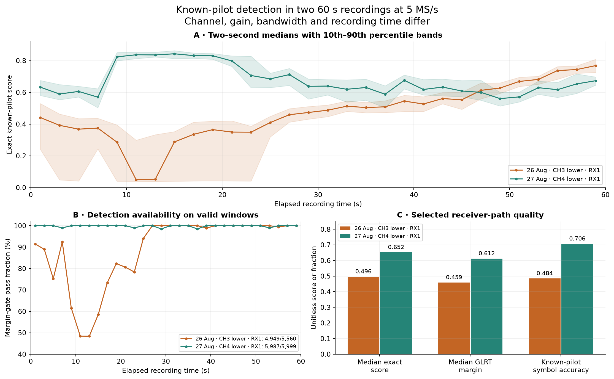

# Starlink positioning: 1.8 km continental localization / 1.2 km conditional benchmark

**From received radio samples to an absolute position, and what limits resolution**

Date: 7 September 2026. Evidence snapshot: remote `main` at
`39146ee83d00523fbd37ba02179c87a5c241a017`.

**Headline result.** Our offline package locates a stationary receiver to **1.805 km
horizontal error** from a **5,000 × 5,000 km starting region**, using archived
Starlink-compatible signals without supplying the receiver coordinate or satellite
identities to the estimator.

A second experiment combines **three five-minute scans** and produces **1.184 km
horizontal error**. In this experiment, a supplied receiver coordinate is used to
select candidate satellite identities before fitting position. The fitted position
is then compared with that supplied coordinate. We call this a **conditional
benchmark** because satellite selection has access to location information.
**The two experiments use different assumptions and reference coordinates; they
do not measure the same continental accuracy.**

| Experiment | Reference latitude / longitude | How the reference is used |
|---|---|---|
| Continental localization | 37.8490428024417°, −122.48567437412359° | Used only to evaluate the completed estimate; no reference altitude supplied |
| Location-assisted association benchmark | 37.858988°, −122.478103° | Used to select satellite candidates and evaluate position, with assumed altitude −29 m |

These coordinates are **1,290.27 m apart**. The benchmark's horizontal error is a
displacement in a local tangent plane about its supplied coordinate; the continental
error is great-circle separation from its evaluation coordinate. The reference
difference and location-assisted satellite selection prevent a direct accuracy
comparison. [Association scorer](../tools/evaluate_scan_pnt_cohort.py),
[benchmark position evaluator](../src/leo/analysis/research/scan_pnt_experiment.py),
[continental evaluation coordinate](evaluation/2026_09_07_regional_position_truth.json).

### Reading the results

The package is this repository's radio-analysis
software together with its offline research position solver. It takes recorded
radio samples and satellite orbit catalogues and estimates latitude and longitude.
Here, **continental** describes the size of the initial search area. **Absolute
position** means Earth-referenced coordinates, rather than movement relative to a
previous fix; it does not imply that a worldwide search has been demonstrated.

The following terms appear in the first figure and table:

| Term | Meaning in this report |
|---|---|
| TLE / nominal TLE | A **two-line element set** describes a satellite's orbit. A nominal fit uses that orbit without fitting a correction to its timing. |
| Causal catalogue | Orbit records available before the recording, excluding later information. |
| Bounded orbit time | An experimental model that allows a small, limited shift in each satellite's predicted orbital timeline. |
| Known-site association / conditional benchmark | A receiver coordinate was used to choose candidate satellite identities before fitting position. The resulting error is conditional on that assistance. |
| Pooled fit | One position estimate using observations accumulated from several scans. |
| Prior | An explicit assumption that favors some parameter values, such as heights near Earth's surface. It is additional information supplied to the fit. |
| RF / UTC | **Radio frequency** / **Coordinated Universal Time**, the time reference used to align measurements with predicted satellite motion. |
| RMS residual | **Root-mean-square** difference between observations and a fitted or predicted curve, in the observation's units. It measures agreement with that model, not necessarily error against physical truth. |

The kilometre values below are distances from estimated locations to the stated
evaluation coordinates. By contrast, timing residuals in nanoseconds and frequency
residuals in hertz describe intermediate measurements. A smaller intermediate
residual does not by itself establish a more accurate receiver position.


*Figure 1 — Measured position errors in the continental-search and location-assisted
association experiments. Panel A estimates unknown position and identities; panel B uses
known-site associations and a different reference coordinate. Every starting region
in A reuses the same radio dataset. Lower bars or points mean smaller horizontal
error. Blue uses nominal orbits; orange allows orbit-time fitting, with panel B
also using the known site for that calibration. The green curve in B reduces the
influence of observations with large residuals. Lines in B connect accumulated-data
fits, not independent accuracy trials. Neither panel supplies a confidence radius.*

| Result | Reported horizontal error | What was supplied or assumed | Supported interpretation |
|---|---:|---|---|
| Continental nominal-TLE fit, unknown height | **1,805 m** | Broad geographic bounds, recorded UTC, causal TLEs, stationary receiver, near-Earth height prior | Absolute localization in this archived experiment |
| Four other regional starts, nominal TLE, unknown height | **1,543–1,795 m** | Different bounds; same RF dataset and evaluation coordinate | Starting-region sensitivity |
| Location-assisted three-scan pooled fit | **1,184 m** | Satellite candidates selected using the benchmark reference coordinate; local height fixed at the −29 m reference | Conditional benchmark, not a continental cold start |
| Location-assisted nineteen-scan pooled fit | **669 m** | Same location-assisted selection and benchmark reference | Conditional accumulation result |
| Location-calibrated nineteen-scan fit | **292 m** | Also fits satellite timing using the benchmark reference coordinate | Calibration consistency, not independent localization |

Sources: [continental study](2026_09_07_blind_regional_doppler_positioning.md) and
[eight-hour study](2026_09_07_eight_hour_scan_tracking_and_positioning.md).
The demonstrated result is horizontal position on one dataset. Worldwide coverage,
altitude accuracy, a 95% containment radius, and an operational fix service have not
been established.

## 1. Introduction

The scientific question is whether ordinary communications transmissions can reveal
where a receiver is, even when it does not know which satellites it hears. Our
experiment tests the following approach: accumulate the time variation of several
received frequency tracks, compare those variations against predicted satellite
motion across a large geographic region, and refine the supported receiver location.
The receiver does not need to decode user traffic for this experiment.

This report follows that chain from emitted waveform through the receiving
electronics and radio, sample timing, known-signal detection,
carrier-frequency-offset (CFO) tracking, orbital association, geographic acquisition,
and continuous position fitting. It
also separates research on the **primary synchronization sequence (PSS)**, a known
repeating part of the transmitted waveform, from the CFO observations actually used
in the continental solution. CFO is the received signal's frequency difference
from a nominal reference; it includes Doppler and oscillator offsets. PSS processing
estimates when the repeating pattern arrives. **PSS timing from recordings at
25 million complex samples per second (25 MS/s) was not an input to the 1.805 km
position estimate.** It is an additional observable and a target for future
acceleration. We call processing at the recorded sample rate **native-rate**
processing; “native-25” in the figures means 25 MS/s.

### Which experiments supply the evidence

The **corpus** is the collection of recordings; a **cohort** is a specified subset
analyzed together. A scan repeatedly tunes through selected frequency slices. Each
short stay on a slice is a **visit** or **dwell**. Signal detections linked through
time form a **tracklet**. Compatible tracklets can be grouped into a longer
**episode**, representing a candidate signal trajectory within one RF channel.
An episode can contain several **source segments**, each retaining its own receiver,
frequency slice, and local frequency offset. These processing objects are not
confirmed satellite identities.

| Evidence used here | Recording or experiment | Role in this report |
|---|---|---|
| Continental localization | 24 scans on 7 September, spanning eight hours at 2.5 and 5 MS/s | Supplies the 1.805 km result and the geographic-search tests |
| Location-assisted association benchmark | Same scan collection; 19 scans eligible for its pooled fits | Supplies the 1.184 km three-scan result with location-assisted satellite selection and a different reference coordinate |
| Detector and receiver quality | Two 60 s, 5 MS/s recordings on 26 and 27 August | Shows why detection, timing, and carrier-phase quality need separate checks |
| Fractional timing | Selected track in the 2 September recording ending in `7fea7427619d`, at 2.5 MS/s | Same-sample comparison of integer and fractional timing |
| Higher-rate timing | Five pairs of 60 s recordings, plus a detailed comparison on recording pair `0181f7f0ffa1` | Compares PSS and pilot timing at 25 MS/s with a separate 2.5 MS/s radio |

Short strings such as `7fea` and `0181` are recording identifiers for audit, not
methods or satellite names. The timing datasets are separate from the continental
dataset. For the location-assisted benchmark, each scan contributes the longest
passing episode for each distinct satellite candidate, after excluding conflicting
assignments of one candidate to simultaneous channels. Requiring at least three
candidates leaves 19 of the 24 scans eligible for that benchmark.

The review screened all **148 pre-existing top-level reports** in this snapshot;
the [source inventory](figures/2026_09_07_continental_positioning_synthesis/source-report-index.md)
records their names and file fingerprints (hashes). Section 11 provides the source
index. Each experiment's conditions, measurement definitions, and limitations are
stated alongside its results in this report.

**Resolution bottleneck.** Empirically, five regional starts give similar kilometre
scale errors, but they are five runs of one dataset. Theoretically, repeatability
under changed initialization does not establish bias, geographic generalization, or
a calibrated error distribution. Those require disjoint observations and reference
locations.

## 2. Motivation: frequency change contains geographic information

A moving transmitter changes the received carrier frequency through Doppler. The
shape of that change depends on the satellite orbit and receiver location. A single
short, approximately straight track is ambiguous: different satellites and locations
can share a similar slope, while transmitter and receiver oscillators add unknown
frequency offsets. Curvature and observations at different orbital viewing geometries
can distinguish these possibilities.

The positioning dataset contains 24 scans of nominally 300 seconds, collected across an
eight-hour calendar window. It contains 502 RF channel episodes with median duration
17.34 s and maximum 53.82 s. These are interrupted observations of different candidate
signals, not 24 uninterrupted five-minute passes of identified satellites.


*Figure 2 — The actual 15:40:04 UTC scan on 7 September, the final scan in the
eight-hour corpus: 5 MS/s and 36 consolidated episodes. Each row is one of the four
RF channels, CH1–CH4. The horizontal axis is elapsed receiver time; the vertical
axis is CFO rescaled to a common 11.2 GHz reference so tracks from different
frequencies can be compared. Blue/orange distinguish lower/upper channel edges;
dots/crosses distinguish receiver inputs RX0/RX1. Sloping groups of points show
frequency evolution; source-local offsets and multiple paths remain visible.
Connected support is not proof of a spacecraft identity or carrier-phase continuity.
The complete 24-scan
atlas is linked in the [scan observation record](2026_09_07_eight_hour_scan_tracking_and_positioning.md).*

**Resolution bottleneck.** In the location-assisted association benchmark, pooled
fits using nominal orbits give 1,184 m error at three scans, 304 m at six, 1,324 m
at twelve, and 669 m at nineteen, against the benchmark reference coordinate.
More data do not monotonically reduce error.
Theoretically, independent geometry can improve observability, while correlated
measurement or orbit biases persist under averaging. A short-arc fit with a free
frequency offset discards absolute-frequency information by design.

## 3. End-to-end approach

The receiving chain first moves the satellite signal into frequencies the radio
can sample. A **low-noise block downconverter (LNB)** amplifies the received signal
and shifts it to an **intermediate frequency (IF)**. The radio records **IQ**:
in-phase and quadrature sample pairs that preserve amplitude and phase in a narrow
band. The package detects predictable transmitted symbols with a **generalized
likelihood ratio test (GLRT)** and measures their timing and CFO. An **epoch** here
is an estimated frame alignment in the receiver's sample timeline; it is not a
known satellite transmit timestamp.

The orbital stage uses **SGP4 (Simplified General Perturbations 4)**, the propagation
model for TLEs, to predict satellite motion. **NORAD identifiers** are catalogue
numbers for space objects; assigning one to a measured track is a hypothesis.
Geographic **acquisition** searches broadly for plausible positions. **Refinement**
then adjusts coordinates continuously near a promising search result. The complete
positioning, navigation, and timing field is often abbreviated **PNT**, although the
demonstrated output here is a stationary horizontal position.


*Architecture diagram — Explanatory schematic. The solid path summarizes the
reported offline positioning workflow; the dotted PSS path is proposed future
integration. “Standard” is the repository's name for its RF-analysis pipeline;
those analyzers and the research positioning tools are separate stages. This
diagram does not assert a deployed scanner-to-PNT service.*

The key information boundary is before orbital fitting. RF extraction uses signal
measurements; the geographic search receives no location-assisted satellite selections,
list of satellites visible from the known site, or fitted orbit correction.
Later CFO values cannot
choose the geographic cell, identity mixture, source offsets, or local-fit
parameters. These later observations are the **held-out** last 40% of each source,
reserved for prediction checks after fitting on the first 60%. The evaluation
coordinate is opened only after inference outputs are saved and hashed, so later
edits would be detectable. “Truth-isolated” means that inference code does not read
the reference answer. The user-supplied coordinate was nevertheless available in
the development conversation: this is a retrospective analysis of existing data,
not a trial in which developers remained unaware of the answer and fixed all
choices before collecting new observations.

**Resolution bottleneck.** Empirically, RF segmentation and associations were built
with complete within-scan support before the 60/40 split. The held-out result is
therefore conditional on retrospective extraction. Theoretically, stage-local
holdout cannot prove end-to-end independence if an earlier stage used future data.
A complete **causal replay**, in which every stage can use only data available
up to the simulated decision time, is the next test of this architecture.

## 4. Emission, propagation, and reception on the radio

### The useful transmitted structure

The published Starlink waveform contains approximately 240 MHz channels using
**orthogonal frequency-division multiplexing (OFDM)**: many closely spaced tones,
or subcarriers, carry symbols in parallel. A frame is a repeating transmission
unit containing synchronization structure and data. **Pilots** are symbols whose
values are known to the receiver, providing a reference for detection. The local
edge template uses eight subcarriers near a channel boundary and 300 known
**4QAM** symbols per frame; quadrature amplitude modulation with four states encodes
each symbol as one of four complex values. These predictable patterns provide a
matched reference; their reuse across satellites
means the pattern itself is not an identity code.
[Qin et al., predictable waveform elements](https://arxiv.org/html/2602.02627v1).

| Quantity | Value used in the package | Consequence |
|---|---:|---|
| Frame rate / period | 750 Hz / 1.333333 ms | Many repeated observations; frame-cycle ambiguity remains |
| OFDM symbol duration | 4.4 µs | 11 samples at 2.5 MS/s; about 110 at 25 MS/s |
| Subcarrier spacing | 234.375 kHz | Distinct from the CFO alias period |
| Edge pilot | 300 symbols × 8 tones | Known symbols only; no payload decoding required |
| Outermost tone separation | 1.640625 MHz | A narrow spectral aperture inside the full channel |
| Tone offsets from edge-band centre | ±117.1875, ±351.5625, ±585.9375, ±820.3125 kHz | A centre at digital zero frequency (DC) does not put a pilot tone at DC |

Authority: [template implementation](../src/leo/analysis/starlink/templates.py) and
[IF/DC centering review](2026_08_21_edge_pilot_if_dc_centering.md).
[Edge-pilot signal description](../docs/concepts/starlink-transmissions.md).

### From Ku-band Doppler to recorded IQ

The receiver chain used for these recordings has an LNB local oscillator of
9.75 GHz. For example,
CH3 lower-edge RF at 11.2096875 GHz becomes IF at 1.4596875 GHz by subtracting
the oscillator frequency. The Pluto software-defined radio then places the selected
slice in complex baseband, a representation centred near zero frequency. The
scanner visits lower and upper edges of CH1–CH4. Its 2.5 or 5 MHz instantaneous
bandwidth is not a full-channel 240 MHz capture.

For a stationary receiver at Earth-fixed position \(x\), the model is

\[
 D_s(t;x)=-\frac{f_0}{c}\frac{(r_s(t)-x)^T v_s(t)}{\|r_s(t)-x\|},\qquad
 \widetilde f_i(t)=f_i(t)\frac{f_0}{f_{\mathrm{RF},i}},\quad f_0=11.2\ \mathrm{GHz}.
\]

Here \(t\) is observation time, \(r_s(t)\) and \(v_s(t)\) are the candidate satellite's
position and velocity, \(c\) is the speed of light, and \(D_s\) is predicted Doppler.
The vector fraction is range rate: positive when the satellite is moving away,
giving negative Doppler in this convention. For observation source \(i\), \(f_i\)
is measured CFO, \(f_{\mathrm{RF},i}\) its actual received RF centre, and
\(\widetilde f_i\) the CFO rescaled to reference frequency \(f_0\).

The prediction uses satellite position and velocity in the same Earth-fixed frame,
including the rotation contribution to velocity. Normalization permits comparison
of tracks recorded at different RF frequencies. A source-local constant absorbs
unresolved oscillator and transmitter frequency offsets. Frequency drift, channel
effects, and transmitter steering can still contaminate the Doppler shape.

**Empirical resolution limits.** Across the five regional searches, nominal-orbit
fits with unknown height have
276.6–287.0 Hz held-out CFO RMS. At 11.2 GHz, 1 Hz corresponds to approximately
0.02677 m/s of line-of-sight velocity; 285 Hz corresponds to 7.63 m/s **if interpreted
entirely as Doppler**. This is a units conversion, not a measured velocity error or
position-error bound. A two-LNB comparison measured short-term frequency wander
without establishing a calibration that could transfer between observations.
[LNB frequency comparison](2026_08_22_dual_lnb_drift_reference.md).

**Theoretical resolution limits.** Timing information depends on the known signal's
effective RMS bandwidth, integration energy, and channel response. For the same
eight-tone observable, increasing the analog-to-digital converter (ADC) rate alone
does not create more frequency aperture. Under an ideal known-waveform,
additive-white-noise model, timing standard
deviation scales as \(1/(\beta\sqrt{E/N_0})\), where \(\beta\) is centred RMS bandwidth,
\(E\) is integrated known-signal energy, and \(N_0\) is noise spectral density.
Unknown channel phase and oscillator terms reduce usable information. The full RF
centre must not be substituted for \(\beta\) when carrier phase is unknown.
[Qin et al., time-of-arrival precision discussion](https://arxiv.org/html/2602.02627v1#S2).

## 5. Sample timing, capture continuity, and transport

The ADC produces complex IQ, which is stored as CI16: signed 16-bit I and Q fields,
four bytes per complex sample per receiver. This storage width is not a claim of
16 effective analog bits. Device sample counters establish observed adjacency;
manifests preserve gaps, tuning boundaries, sample rates, and first-sample UTC
brackets. Digest verification establishes which samples were analyzed.

A **refill** transfers a block of samples from the radio into host memory. A
**gap** records missing samples and their elapsed time; the logical timeline
includes those missing intervals. **Duty** is the fraction of a stated interval
with usable samples. A first-sample UTC **bracket** is the recorded earliest/latest
time interval for that sample, rather than a perfectly known timestamp.

| Eight-hour positioning dataset quantity | Measured value |
|---|---:|
| Complete 300 s scans | 24: twelve at 2.5 MS/s and twelve at 5 MS/s |
| Valid visits | 57,288, each 120 ms |
| Total retained dwell time | 6,874.56 s, approximately 1.91 h |
| Median valid duty inside scans | 95.4444% |
| Valid dwell time / eight-hour calendar window | 23.87% |
| Median / maximum first-sample UTC bracket width | 1.334 / 1.924 ms |
| Median / maximum RF episode duration | 17.34 / 53.82 s |

An audit of recordings with gaps found a concrete timing failure: plotting received
buffers back-to-back omitted the elapsed time of missing samples. The compressed
time axis made multi-second CFO slopes appear too steep and produced roughly
100 ms sawtooth patterns without requiring transmitter resets. Measurements wholly
inside a verified buffer can remain useful, but orbital fitting across buffers
requires the elapsed gaps to be restored.
[Refill mechanism](2026_08_24_refill_time_compression_sawtooth.md),
[counter-authoritative implementation](2026_08_24_continuity_buffer_implementation.md).

**Empirical resolution limits.** Native-25 recordings in the September 2 paired
cohort retain only **60.47–61.07%** of their logical timelines, with **16–21 gaps**
per 60 s recording. That is a different acquisition cohort from the September 7
scanner; it is not a universal ceiling for 25 MS/s. Gap-safe processing
excludes every block crossing absent samples.
[Five-pair report](2026_09_02_five_paired_native25_pss_vs_2p5_glrt.md).

**Theoretical resolution limits.** Exact sample adjacency does not calibrate the
sample oscillator, absolute UTC, RF phase across a retune, or a second radio's clock.
At an illustrative 3 kHz/s CFO slope, 1 ms time displacement produces approximately
3 Hz frequency displacement. A reported UTC bracket width is not a Gaussian timing
standard deviation and must not be inserted into a variance budget as one. No
interpolation can recover unrecorded IQ or justify carrier-phase continuity through
a tune change.

## 6. Radio processing: acquisition, GLRT, and fractional timing

### Finding the known signal

Each complete **probe**, a short window of recorded IQ, is searched for a frame
epoch and CFO. GLRT compares how well a known pilot hypothesis explains the samples
after fitting nuisance parameters, such as unknown signal amplitude and phase,
which affect the measurement but are not the desired output. It also scores a
**rolled control**: the known-symbol sequence deliberately shifted by 17 symbols.
The **margin** is the correct-template score minus that control score; a margin
gate accepts a window only when this difference exceeds a threshold. A correct
template outperforming the control is stronger waveform evidence than a power
peak alone.

The detector variant called **GLRT64** uses 64 known symbol positions per frame,
combines their information in bounded groups, and combines frame powers without assuming uninterrupted carrier phase
across all frames. In other words, it can accumulate evidence even when phase is
not stable over the full window. The scanner/full-capture evidence here uses 20 ms
probes, with a **stride**, or spacing between window starts, of 10 ms where source
continuity permits. Adjacent probes therefore share half their samples.

Known-pilot QAM demodulation is a complementary quality check. It measures recovery
of known 4QAM symbols, not decoded user traffic. Strong GLRT, good timing, and stable
carrier phase can occur on different receiver paths, so one quality score cannot
stand in for the others.



*Figure 3 — Two selected 60 s receiver paths at 5 MS/s: CH3 lower edge on
26 August at 18:23:10 UTC and CH4 lower edge on 27 August at 17:03:30 UTC
(capture `a555a5cf5306`). Both use receiver input RX1. The upper panel shows
detector-score medians in two-second bins,
with 10th–90th percentile bands. Lower left shows the fraction passing the margin
gate; lower right compares scores and the fraction of known pilot symbols recovered
correctly. Channel, gain, bandwidth, and observation time also changed, so the
comparison does not isolate one engineering change. This is detector evidence,
not continental-solver input or a population detection rate. In the 27 August capture,
the strongest timing/GLRT path had zero 75 ms segments passing the carrier-phase
stability checks; another receiver input provided ten.
[Capture-quality report](2026_08_27_170330_capture_quality.md).*

### Removing a numerical timing limit

At 2.5 MS/s, an integer epoch advances in 400 ns steps, where a nanosecond (ns)
is one billionth of a second. A smoothly moving peak rounded onto that grid creates
visible plateaus and fans. Fractional GLRT evaluates
the local score surface, requires a bracketed concave peak, and estimates a
continuous epoch. “Bracketed” means that evaluated points surround a local maximum;
“concave” means the fitted peak curves downward. The Standard implementation can directly rescore
the fractional coordinate with band-limited IQ interpolation, estimating the signal
between recorded samples. A peak at the search boundary cannot be safely refined
by this rule and remains an explicit failure.


*Figure 4 — Reprocessing the same recorded IQ for 652 epochs in one selected timing
track, called a **locklet**, from the 2 September `7fea7427619d` capture at 2.5 MS/s.
“RX0 H4/L3” in the original title identifies its receiver input and internal track
labels. Left/right panels show integer/fractional timing after subtracting a
separate quadratic curve from each; the lower row enlarges the U-shaped feature
near 41 s. Blue/purple alternate between even/odd window indices on the 10 ms stride.
Log-parabolic interpolation, fitting a parabola to the logarithm of the local
score, reduced whole-track timing-fit RMS from **112.65 ns to 21.74 ns**, an **80.7%**
reduction. The timing-derived frequency-change rate changed only 0.138%. This
comparison held acquired CFO fixed and interpolated the sampled score surface;
it did not directly evaluate the waveform at the fractional coordinate. The
Standard implementation's direct fractional rescoring is an additional validation
step, not a measurement included in these plotted results.
[Fractional-epoch report](2026_09_02_7fea_glrt_fractional_epoch_prototype.md).*

**Empirical resolution limits.** The integer grid was a demonstrated dominant error
source on that selected timing track. It is not the remaining physical limit:
different peak interpolators differed by a median approximately 28 ns and a 95th percentile
approximately 44 ns. In the separate `0181` comparison at 25 MS/s, PSS detections
selected 133 window times, but GLRT independently searched timing and CFO within
each window. Only 89 produced retained fractional results; 19 failed the margin
gate and 25 had an unsuitable local fractional surface. Section 10 compares the
measurements on that selected support.

**Theoretical resolution limits.** Uniform integer rounding gives
\(\sigma_q=1/(\sqrt{12}f_s)\): 115.47 ns at 2.5 MS/s and 11.55 ns at 25 MS/s.
Here \(f_s\) is complex sample rate and \(\sigma_q\) is rounding standard deviation.
This is a quantization model, not a Cramér–Rao bound (a statistical lower bound
under a specified measurement model), and fractional estimation can beat it.
For a coherent, stable tone observed over duration \(T\), frequency precision scales as
\(1/(T\sqrt{E/N_0})\); at fixed power/noise density this becomes \(T^{-3/2}\).
Our grouped, noncoherent, channel-dependent GLRT does not inherit that ideal bound
over the whole 20 ms window. A fast Fourier transform (FFT) bin width of \(1/T\)
is also not a hard frequency-estimation floor.

## 7. Post-processing: from CFO detections to useful orbital episodes

Independent detections become time-frequency tracklets. The pipeline retains raw
CFO and alias information, groups compatible observations, and uses a residual-Hough
search and local polynomial models to describe their evolution. The Hough method
looks for line-like agreement among detections in time and frequency; working on
residuals helps find additional tracks after a dominant trend is removed. Linear,
quadratic, and cubic fits add successively more curvature to the description.
Where observations are reprocessed using a fitted trajectory, that conditioned
result is recorded separately from the original acquisition. A smooth line is
evidence of a signal component; it is not automatically a unique transmitter.

An **alias** here is a different frequency hypothesis that the repeated-symbol
measurement cannot readily distinguish. The edge-symbol ambiguity is

\[
\Delta f_{\rm alias}=1/(4.4\ \mu\mathrm{s})=227,272.727\ldots\ \mathrm{Hz}.
\]

It differs from the 234.375 kHz subcarrier spacing and is independent of ADC sample
rate. Treating alias switches as physical jumps can fabricate dynamics. Removing
them by adding or subtracting integer multiples of this period (a **frequency
lift**) is a coordinate correction, not additional Doppler information.
[Alias report](2026_08_26_cfo_alias_canonicalization.md).

Upper/lower observations are normalized by actual RF, and replicas are consolidated
without silently counting the same sample as two episodes. Compatible edges can
share trajectory shape while retaining independent offsets. Among 387 accepted
upper/lower links in the positioning dataset, **338** predict held-out observations better with a shared
cubic than independent cubics; the median shared/separate RMS ratio is **0.582**.
The formal precision gain for the fitted frequency-change rate is **1.43×**,
calculated from the fit's assumed error model. These are conditional predictive
and formal gains, not proof of two independent measurements per radio.


*Figure 5 — An actual lower/upper channel-edge pair from the position-search corpus.
The horizontal axis is time within the scan; the vertical axis is CFO after removing
each source's constant training offset. Left: tracks at their actual RF centres.
Middle: frequency rescaling to 11.2 GHz makes their Doppler slopes comparable.
Right: filled points are the earlier training observations and hollow points the
later prediction checks; vertical lines mark the split for each source. Independent
source offsets are retained. The approximately 230 MHz separation between edges
has not been combined with known relative phase, so it does not yield the delay
resolution of one coherent receiver spanning that bandwidth.*

**Empirical resolution limits.** Model selection over the 502 episodes selected
80 linear, 212 quadratic, and 210 cubic descriptions. A separate 300 s scan reviewed
on 7 September, identifier `09970e`, shows channel-level descriptive RMS of
68–112 Hz for cubics versus 577–796 Hz for lines; this does not justify using a
cubic everywhere. Another scan, `a340`, contains **38.716 s of simultaneous channel
overlap**, ruling out an interpretation of those records as a sequential channel
switch. These examples show why a fitted trajectory needs continuity and channel
checks before it becomes an orbital observation.
[Polynomial trajectory comparison](2026_09_07_scan_09970e_fractional_glrt_trajectory_tle_review.md),
[cross-channel overlap analysis](2026_09_07_scan_a340_fractional_glrt_trajectory_review.md).

**Theoretical resolution limits.** For \(N\) independent, equally noisy frequency
measurements with frequency standard deviation \(\sigma_f\), approximately uniformly
distributed over duration \(T\), a fitted linear rate has standard error approximately
\(\sqrt{12}\sigma_f/(\sqrt{N}T)\). Overlapping probes, shared oscillators, receiver
replicas, and selected membership violate independence. Extending actual temporal
support can help more than densely resampling the same interval. Local polynomials
must not be extrapolated across hours. For candidate tracks observed about five
hours apart in the eight-hour dataset, linear extrapolation gives 516–4,444 Hz
residuals. Propagating each candidate orbit while retaining its first-pass fitted
orbit-time correction gives 81.8–224.2 Hz held-out residuals across four recurrence
candidates. This comparison uses location-assisted identities and allows a fresh
constant frequency offset on each pass; it tests prediction, not independent
confirmation of satellite identity.

## 8. TLE and model-based geographic acquisition

A two-line element set (TLE) supplies a model of satellite orbital motion, not a
received identity label or exact orbit truth. The package admits archived Starlink
catalogues collected before each scan with a five-second guard and element epochs
preceding the recording. The guard requires catalogue collection at least five
seconds before the scan; an element's **epoch** is the reference date of its orbit
description, distinct from a received frame epoch. SGP4 predicts motion in the
**True Equator, Mean Equinox (TEME)** coordinate frame. Transforming it into a frame
rotating with Earth makes the satellite state comparable with a stationary
receiver's latitude and longitude.

For each geographic cell and RF episode, the search compares normalized CFO shape
with every admitted visible satellite and an explicit **unassigned alternative**,
which allows an episode to remain unexplained by the admitted catalogue.
Each source segment receives a constant frequency offset learned on training
samples. It receives no freely fitted slope or curvature that could erase
geographic differences. The catalogue prior uses the full causal catalogue count
so locations with fewer visible objects do not get an artificial advantage.

The first 60% of each source is training and the last 40% is held out. Regional
search retains at most six observations from each partition. Local refinement
restores the full sampling density within both partitions, fitting parameters only
on training observations and evaluating predictions on held-out observations.
The primary geographic selection uses training scores only. These are composite
scores, not calibrated log probabilities.
They combine evidence across episodes to rank candidate locations; their numerical
values do not directly state the probability that a location is correct. A
geographic **mode** is a local peak in that score surface. The search keeps several
competing peaks and samples smaller patches around them before continuous fitting.


*Figure 6 — Declared search bounds. Four starts use squares of side 100, 500, 1,000,
and 2,000 km centred on Oakland, California. The continental start uses a 5,000 km
square centred at 43.6914344°, −106.8991205°, changing both centre and size. Each
square is an allowed search area, not an uncertainty region around the final fix.
The map uses a Natural Earth land backdrop with
[recorded provenance](figures/2026_09_07_blind_regional_pnt/map-source.json).*

| Continental stage | Sampled locations | Revealed horizontal error | Recorded replay time |
|---|---:|---:|---:|
| Whole region, 250 km spacing | 400 | 1,743.95 km | 106.0 s |
| Whole region, 125 km spacing | 1,600 | 3,498.69 km | 304.3 s |
| Eight local patches from the 125 km branch | 935 | 2,926.68 km | 151.5 s |
| Independent whole region, 50 km spacing | 10,000 | 11.34 km | 1,477.7 s |
| Eight 10 km patches from the 50 km branch | 935 | 1.38 km | 135.4 s |
| Three final 2 km patches | 351 | 2.67 km | 60.8 s |
| Continuous nominal-TLE, unknown-height fit | Continuous local fit | **1.805 km** | Seven fit iterations |

“Spacing” is the distance between tested positions, and “patches” are smaller
search areas around promising parent-grid positions. “Revealed error” is computed
after selection using the withheld evaluation coordinate. The rows show two
branches: local refinement of the 125 km grid remained far from the reference;
an independent 50 km search across the whole area found the successful branch.

These are measured CPU processing times for replaying archived observations.
They exclude signal-collection time and do not establish operational time to first
fix or a controlled performance comparison. The 10 km cell
happens to be closer to truth than the finer-grid winner. Keeping the
training-selected refinement avoids selecting the lucky cell after reveal.


*Figure 7 — Data from all retained continental branches and all five unknown-height
local fits. A: horizontal error on a logarithmic axis, so equal distances on the
axis represent equal multiplicative changes. Coarse searches can select the wrong
part of the continent, and local refinement can preserve that failure. B: each arrow
joins a nominal-orbit result to its result with bounded orbit-time corrections.
Moving left means better frequency prediction; moving up means worse position.
All five corrections move in both directions.*

**Empirical resolution limits.** Sparse continental sampling misses a high-scoring
mode completely; a finer whole-region check succeeds. Small orbit-time adjustments
do not fix position bias. As a specificity check, two control runs deliberately
shifted the recording UTC by −600 s and +600 s and searched the full 1,000 km region.
They produced sharply supported locations **655 km and 418 km** from the reference
despite using the same radio observations. Thus a strong score peak alone cannot
establish that the clock, identity, and position combination is correct.

**Theoretical resolution limits.** Geographic likelihood can be multimodal and
narrower than the coarse grid. A local optimizer cannot recover an unsampled distant
mode. A square grid with spacing \(h\) has a worst nearest-cell-centre distance
\(h/\sqrt2\) in its map coordinates, but that is only quantization geometry under
correct cell selection—not a localization guarantee. Unknown identity, a poorly
calibrated unassigned model, and clock error can produce errors many orders larger.

## 9. Final position and an honest resolution budget

The local fit freezes training-selected identity hypotheses and estimates one
shared stationary receiver location, with source-local frequency offsets. The
continental fit retains **493 episodes, 1,069 source segments, and 22,694 observations**,
with **269 provisional NORAD identities** across **279 NORAD/TLE snapshot groups**.
One satellite catalogue number can occur under more than one archived orbit
snapshot, explaining why the group count exceeds the identity count. Those counts
are not independent satellites confirmed by the receiver.

The unknown-height model has a zero-centred 1 km height prior and bounds −500 to
+5,000 m. The nominal solution is **37.853649440°, −122.465961367°**, with fitted
ellipsoidal height approximately **−265 m**. Horizontal separation from the continental
evaluation coordinate is **1,805.014 m**. No altitude truth was supplied, so the
height has no validated accuracy interpretation. Ellipsoidal height is measured
relative to the model's smooth reference surface for Earth, rather than local
ground level. Allowing height to vary changes the fitted horizontal coordinates,
which is why fixed-height and unknown-height results are listed separately.

| Continental local model | Horizontal error | Training CFO RMS | Held-out CFO RMS |
|---|---:|---:|---:|
| Nominal TLE, height fixed to zero | 2,179 m | 124.9 Hz | 283.4 Hz |
| Nominal TLE, unknown height | **1,805 m** | 124.7 Hz | 285.0 Hz |
| Shared bounded orbit time, fixed height | 2,356 m | 115.7 Hz | 270.1 Hz |
| Shared bounded orbit time, unknown height | 2,016 m | 115.5 Hz | 271.5 Hz |

The correction model shares one orbit-time parameter per NORAD/TLE snapshot,
with a 0.5 s prior and ±2 s bound. Its largest fitted correction is 0.533 s.
Conceptually, it asks whether a satellite is slightly ahead of or behind its
predicted orbital schedule. Both that shift and moving the receiver can change
the predicted Doppler curve, creating an ambiguity between the two adjustments.
It improves held-out frequency prediction by about 13.5 Hz but worsens horizontal
error by approximately 211 m. Therefore a better RF residual is not sufficient
evidence of better positioning.

### Why nanoseconds and hertz do not directly specify position accuracy

Linearize the observation model around a candidate position:

\[
\delta z = J_x\delta x + J_b\delta b + J_o\delta o + \epsilon.
\]

Here \(\delta z\) is observed frequency minus the candidate model's prediction,
\(\delta x\) receiver displacement, \(\delta b\) changes in source offsets and clock
terms, \(\delta o\) orbit corrections, and \(\epsilon\) measurement/model error.
The **Jacobians** \(J_x\), \(J_b\), and \(J_o\) are sensitivity matrices: they say
how much each observation changes when a parameter changes. Position
information survives only in directions that cannot be explained by the nuisance
parameters. Under a correct local linear model with weight matrix \(W\), profiling
nuisance columns \(J_n\) gives the information matrix

\[
 I_x=J_x^T WJ_x-J_x^TWJ_n(J_n^TWJ_n)^{-1}J_n^TWJ_x.
\]

Here \(J_n\) collects the nuisance-parameter sensitivities, and \(W\) weights the
observations according to an assumed error covariance. The first matrix term
measures information if nuisance parameters were fixed; the subtracted term removes
information that those parameters can also explain. This is why extra orbit or
clock freedom can improve residuals while weakening the position estimate.

An inverse, when identifiable, is a **conditional** covariance describing local
position uncertainty under those assumptions; singular directions
need explicit constraints, priors, or abstention. This calculation assumes the
chosen identities, linearization, error distribution, and covariance model are
correct. It does not include distant geographic modes or an unknown model bias.

A separate simulation isolates measurement noise using the satellite geometry of
one recorded scan, with satellite identities and orbits treated as exact. Twenty
trials add independent 100 Hz frequency noise; twenty hold each noise value constant
across five consecutive samples. Their median horizontal errors are 925 m and
1,528 m, respectively. These are simulated errors, not measurements of real-world
accuracy; the comparison shows how correlated noise can degrade position even
under ideal identity and orbit assumptions.

| Stage / source of error | Empirical evidence | Theoretical constraint / unresolved measurement |
|---|---|---|
| Integer timing | Selected 2.5 MS/s timing track: 112.65 → 21.74 ns after fractional estimation | Grid quantization was removable; peak/channel bias remains |
| Timing versus CFO | Selected 25 MS/s GLRT windows: 17.3 ns timing RMS with 1,214 Hz CFO RMS | Separate parameter sensitivities; one cannot substitute for the other |
| Continuity and UTC | Counter-attested scans; UTC brackets up to 1.924 ms | Sample adjacency is not external clock calibration |
| Episode geometry | Median 17.34 s; model order varies | Short support weakens curvature and confounds nuisance parameters |
| Measurement correlation | 100 Hz-noise simulation: 925 m median with independent noise; 1,528 m with five-sample correlation | One real geometry with synthetic noise and exact identities/orbits; not a real-data accuracy trial |
| Catalogue/geographic sampling | 250/125 km grids fail by thousands of km | A missed mode defeats local fitting |
| Orbit/receiver ambiguity | Orbit correction lowers residuals and worsens all five locations | Nuisance directions remove position information |
| Earth frame model | Earth-rotation time (UT1) approximated by civil time (UTC); small shifts of Earth's rotation axis (polar motion) neglected | Frame transform, signal travel time, and propagation approximations need improvement before precision claims |
| Integrity and reference truth | Sharp wrong-time peaks; continental and location-assisted benchmark references differ by 1.290 km | No calibrated 95% region or demonstrated false-fix rate |

This is a **bottleneck ledger, not an additive error budget**. The terms are
correlated, incompletely calibrated, and measured under different conditions. A
root-sum-square total would be unjustified. The synthetic noise experiment
isolates one mechanism; it does not identify what fraction of the real 1.805 km
error comes from noise, TLE error, clocks, or incorrect identities.

**Resolution bottleneck.** Empirically, the continental position fit converges
numerically but retains kilometre-scale horizontal error. The timing comparisons
in sections 6 and 10 do not measure how much a timing improvement changes that
position error. Theoretically, reducing measurement noise cannot
remove systematic bias or restore information absorbed by nuisance parameters.
Independent clock/orbit calibration, geometry diversity, and an honest no-fix
decision are required alongside better RF estimation.

## 10. Sample rate, PSS tracking, FPGA acceleration, and next steps

### Measured timing and CFO at 2.5 and 25 MS/s

PSS processing uses the primary synchronization sequence to measure repeated frame
timing. The native-rate implementation first constructs the part of the published
waveform that lies within the recorded band. It correlates that template with
complete blocks containing no gaps, testing a **CFO bank**, or set of candidate
frequency offsets. Folding combines observations at the same position within the
1.333 ms frame period. Local peak refinement and association then follow a timing
track modulo that period: the end of one cycle wraps back to its beginning.

The result is **template-relative frame phase**, the observed alignment with the
template within a frame. It does not establish which numbered frame was sent,
its transmit time, payload content, or interpretation of the separate **secondary
synchronization sequence (SSS)**. Without those additional facts and clock/delay
calibration, precise repeated timing is not yet an absolute range measurement.

Five preselected recording pairs use separate radios for 25 MS/s PSS and 2.5 MS/s
edge pilots. PSS processing acquired a track independently of GLRT in three of
the five pairs, with quadratic block-median
RMS **0.217–0.378 µs**. This statistic measures scatter of per-block median timing
after subtracting a quadratic trend; a microsecond (µs) is one millionth of a second.
The other two pairs produced no primary PSS track. A separate detailed comparison
uses recording `0181f7f0ffa1` and evaluates the methods at selected times, as described
below.


*Figure 8 — Real data from a recording pair whose 25 MS/s capture is
`0181f7f0ffa1`, recorded on 2 September.
Left: scatter around separately fitted quadratic timing curves; right: scatter
around fitted CFO curves, with a different unit and scale. Fractional native-25
GLRT has 17.3 ns timing RMS, PSS 19.5 ns, and paired low-rate fractional GLRT
41.4 ns. The direct CFO measurement is noisier at 25 MS/s.
Separate radios, unequal observation counts,
PSS-selected scheduling, and retained-support gates prevent this from being a
controlled sample-rate-only ranking.*

| Observable in the selected recording interval | Points | Quadratic timing RMS | Timing-derived rate magnitude |
|---|---:|---:|---:|
| 2.5 MS/s fractional GLRT, common interval | 242 | 41.4 ns | 3,071.08 Hz/s |
| 25 MS/s integer GLRT | 89 | 29.3 ns | 3,075.88 Hz/s |
| 25 MS/s fractional GLRT | 89 | **17.3 ns** | **3,067.76 Hz/s** |
| 25 MS/s PSS, same retained times | 89 | 19.5 ns | 3,066.84 Hz/s |

The fractional GLRT/PSS rate difference is **0.91 Hz/s**, while direct CFO-fit RMS
is **1,214 Hz at 25 MS/s versus 105 Hz at 2.5 MS/s**. Precision of a fitted timing
curve and scatter of independently acquired CFO are different measurements.
[Native-25 report](2026_09_03_0181_native25_fractional_glrt.md).

The table's **timing-derived rate** converts curvature in frame timing into an
equivalent frequency-change rate: in a physical-delay convention,
\(\dot f=-f_{\mathrm{RF}}\,d^2\tau/dt^2\), where \(\tau\) is observed timing drift.
Clock drift can also contribute to \(\tau\); the conversion alone does not isolate
satellite Doppler. The table reports magnitudes because timing and recorded-IQ
mixing conventions can reverse the displayed sign. The implementation in the
reviewed snapshot labels its aligned timing-derived comparison a **template-phase
CFO proxy**: a frequency representation of template timing for comparison, without
claiming calibrated physical Doppler sign. Curves using opposite conventions
can have opposite signs without indicating opposite satellite motion.
[Timing/CFO comparison implementation](../src/leo/analysis/standard/native_pss_glrt_comparison.py),
[sign/quantization diagnosis](2026_09_02_6f8_pss_glrt_residual_deep_dive.md).

### Bandwidth, cadence, and transport are separate choices


*Figure 9 — Theoretical arithmetic, deliberately separate from the measured
Figure 8. CI16 payload demand excludes framing, metadata, buffering, compression,
and persistence overhead. These curves are not measured throughput or accuracy.*

| Complex rate | Sample interval | Uniform integer-rounding RMS | CI16, one RX | CI16, two RX |
|---:|---:|---:|---:|---:|
| 2.5 MS/s | 400 ns | 115.47 ns | 10 MB/s | 20 MB/s |
| 5 MS/s | 200 ns | 57.74 ns | 20 MB/s | 40 MB/s |
| 10 MS/s | 100 ns | 28.87 ns | 40 MB/s | 80 MB/s |
| 25 MS/s | 40 ns | 11.55 ns | 100 MB/s | 200 MB/s |

The 10 MS/s row is design arithmetic, not a new positioning experiment. At
25 MS/s, retaining 300 s of CI16 requires 30 GB per receiver before compression.
The 40 ns sample interval corresponds to 12.0 m of light travel, but neither that
number nor \(c\times17.3\ \mathrm{ns}\approx5.2\ \mathrm{m}\) is a pseudorange or
position-accuracy claim. A **pseudorange** is a distance inferred from signal travel
time that still contains clock and other biases. A usable absolute range needs transmit timing,
frame-cycle resolution, and calibrated receiver/channel delays. Published timing
research documents transmitter timing behavior that complicates purely opportunistic
pseudorange. [Qin et al., timing properties](https://rnl.ae.utexas.edu/wp-content/uploads/qin_starlink_timing_properties.pdf).

Increasing sample rate helps when it admits more **useful known-signal bandwidth**,
reduces avoidable quantization, or supports a more faithful local interpolation.
Oversampling the same analog-filtered band does not multiply independent information.
Widening the analog filter can also admit more noise and interference. The recorded
25 MHz slice is still about one tenth of a 240 MHz channel; it must not be described
as full-channel PSS capture. AD9361-class hardware supports a maximum 56 MHz tunable
channel bandwidth, so a full-channel receiver is a different RF design, not a simple
change to the sample-rate setting. Board/firmware/transport qualification can impose
tighter limits. [Analog Devices AD9361](https://www.analog.com/en/products/ad9361.html).

Integration duration also matters. At 750 frames/s, 250 ms contains approximately
187.5 frame opportunities; 62.5 ms contains 46.9. A recording in the five-pair study,
`5dc618208b54`, was used to compare those window lengths. Unconstrained short-block
search produced candidate timing/frequency peaks but no final track: the limited
list of starting candidates concentrated in one part of the recording, leaving
insufficient temporal coverage. Restricting refinement to a narrow timing corridor
around an already acquired PSS track recovered **503/568** complete short blocks
and improved cubic block-median
RMS from **0.295 to 0.203 µs**, while quadratic RMS barely changed. Acquisition and
tracking therefore deserve different integration/cadence choices.
[Window comparison](2026_09_02_five_paired_native25_pss_vs_2p5_glrt.md).

For \(N\) independent timing observations, each with timing standard deviation
\(\sigma_\tau\), distributed over duration \(T\), uncertainty
in timing curvature scales approximately as
\(\sqrt{720}\sigma_\tau/(\sqrt{N}T^2)\) for a quadratic least-squares fit.
Differentiating a noisy timing sequence twice is expensive in precision; longer
stable support helps, whereas jumps, gaps, clock drift, and overlapping windows
invalidate the simple independence assumption.

### What FPGA-accelerated PSS tracking could contribute

A **field-programmable gate array (FPGA)** is programmable digital hardware in the
radio that can perform many signal operations in parallel as samples arrive.
The concrete opportunity is to process the known signal before the high-rate IQ
stream overloads the transport or host, preserving counter-aligned observations
and selected raw windows for audit. The FPGA provides the device sample counter
in the capture system. **The experiments do not demonstrate an FPGA PSS
accelerator, its resource fit, or a positioning improvement from one.**

| Proposed division of work | Purpose | Measurement required before adopting it |
|---|---|---|
| FPGA channelizer / decimator with declared delay | Select frequency bands and filter before reducing sample rate, lowering output volume | Passband response, alias rejection, fractional delay and counter alignment |
| Bounded blind PSS correlation bank or FFT acquisition | Discover phase/CFO modes without known position | Detection/false-alarm curves on recorded signal and null windows; miss accounting |
| Predicted-window PSS tracking around a previously acquired mode | Reduce search work and maintain timing cadence | Holdout epoch/CFO error, slip rate, reacquisition after gaps and competing signals |
| Fractional peak / early-prompt-late statistics | Compare correlation just before, at, and after the predicted epoch to retain sub-sample timing information | Fixed-point bias and saturation versus the floating-point reference |
| Device-counter-labelled compact output plus retained IQ snippets | Reduce transport pressure while preserving reproducibility | Bytes/s, queue occupancy, losses, latency, and replay agreement |
| CPU multi-hypothesis association and orbit/position fitting | Keep changing catalogue logic and integrity checks reviewable | Causal-replay position errors, rejection rates, and geometry stability |

A rough workload calculation illustrates why tracking should be separated from
blind acquisition. A 110-tap direct PSS correlator at 25 MS/s costs approximately
**2.75 billion complex multiply-accumulates/s per CFO hypothesis and receiver** if
evaluated at every sample. A nominal ±2 µs tracking corridor has approximately
101 candidate shifts; evaluating those at 750 frame epochs costs approximately
**8.33 million complex multiply-accumulates/s per hypothesis**. These are naive
operation counts, not synthesized FPGA timing or resource estimates. FFT banks,
shared arithmetic, sample-rate conversion, fractional interpolation, multi-mode
retention, and reacquisition change the costs. A **tap** is one template coefficient;
a multiply-accumulate multiplies a sample by its coefficient and adds the result
to a running correlation. Hardware resource fit and **clock closure** mean that
the implementation fits the available logic/memory and meets its required clock
speed; neither follows from an operation count alone.

The selected-window GLRT experiment on recording `0181` provides a measured
processing baseline: 133
20 ms windows took **52.47 s with four workers**; summed verified-read time was
**39.66 worker-seconds**, which overlaps across workers and is not a wall-time
percentage. This is selected GLRT work, not a continuous FPGA-PSS benchmark.
Profiling should distinguish IQ read/verification, correlation, tracking,
association, and geographic search before choosing an acceleration target.

**Empirical bottleneck.** High-rate timing is promising, but the demonstrated
high-rate captures had substantial absent source time and the continental solver
still used low-rate CFO. **Theoretical bottleneck.** FPGA arithmetic can increase
availability and reduce latency; it cannot remove TLE bias, clock ambiguity, an
incorrect satellite assignment, or a geographic search miss. Faster computation
must be judged by retained independent information and final position validation.

### Next steps, in order

1. **Run a causal replay on recordings held out from method development.** Reveal
   observations in timestamp order; every processing stage must use only data
   available at the simulated decision time. Freeze source
   selection, RF association, geographic search, model settings, and fix/no-fix
   rules before opening evaluation coordinates. Retain every failed start and
   report elapsed observation time, accepted RF time, compute time, and miss rate.
   Use one explicit evaluation reference with independently documented uncertainty.
2. **Calibrate integrity and geometric stability.** Integrity means deciding whether
   a position is trustworthy enough to report or whether to return no fix.
   Run matched wrong-location,
   wrong-time, and null controls; leave out satellites, scans, and receivers. A
   sharp score peak alone must not authorize a fix. Report empirical containment
   and false-fix rates only when sample size and independence support them.
3. **Separate clocks, orbits, and receiver position.** Test constrained shared
   oscillator/clock states and calibration transferred from a known reference
   receiver to an unknown-location receiver on disjoint data. Keep
   nominal TLE as the baseline: extra orbit freedom worsens position in all five
   regional comparisons in Figure 7.
   Improve the Earth-frame model and assess sensitivity to causal catalogue age.
4. **Measure sample-rate effects on the same recorded signal.** Use archived
   native IQ with anti-alias-filtered decimations, identical time support, declared
   filter delay, and measured known-signal bandwidth. Separately compare native
   RF chains. Report detection retention, timing bias/scatter, CFO/rate error,
   gap behavior, and downstream position; a cross-radio pair alone cannot isolate
   sample rate.
5. **Prototype FPGA PSS tracking against a frozen software reference.** Start with
   counter-indexed recorded windows and calibrated synthetic delays/CFOs, then
   inject gaps and saturation. Measure fixed-point error, resource use, clock
   closure, power, output volume, and loss/reacquisition. Integrate only after a
   measured compute or transport bottleneck justifies it.
6. **Add PSS to positioning only after sign and clock validation.** Preserve
   template-relative timing, resolve convention and cycle ambiguities explicitly,
   and account for covariance with GLRT when both use the same IQ. Require an
   improvement on untouched position evaluation, not merely a cleaner timing PNG.

These steps begin with archived recordings and short numerical replays.

## 11. Supporting evidence, reproduction, and conclusion

The supporting records below document the observations and limitations discussed
in this report. Each row states the relevant finding directly.

| Supporting records | Observation | Limitation |
|---|---|---|
| [Signal/tracking guide](2026_08_24_starlink_signal_and_tracking_guide.md), [IF centering](2026_08_21_edge_pilot_if_dc_centering.md) | Known edge-pilot evidence and exact RF geometry | Template compatibility does not decode an identity |
| [Line finding](2026_08_20_line_finder.md), [residual Hough](2026_08_22_residual_hough_segmentation.md), [alias canonicalization](2026_08_26_cfo_alias_canonicalization.md), [window geometry](2026_08_26_20ms_window_comparison.md) | Retain real trajectories and distinguish aliases | Detector density and geometry are not physical transmitter counts |
| [Subsecond pilot structure](2026_08_22_subsecond_pilot_structure.md), [phase qualification](2026_08_23_five_dwell_modulo_pi_qualification.md), [capture quality](2026_08_27_170330_capture_quality.md) | Local phase can be useful but intermittent | Timing, phase, QAM and CFO require separate quality gates |
| [Refill mechanism](2026_08_24_refill_time_compression_sawtooth.md), [controlled loopback](2026_08_24_refill_continuity_loopback.md), [refill-aware review](2026_08_25_doppler_rate_and_satellite_linking_method_review.md) | Omitting missing sample time distorts CFO slopes | A recording-timeline artifact cannot establish transmitter resets |
| [Kalman tracking analysis](2026_08_25_pnt_kalman_v3_comprehensive_review.md), [tracking variant](2026_08_25_150802_pnt_kalman_v4_experimental.md), [rate benchmark](2026_08_25_v3_v4_downstream_rate_benchmark.md) | Filter settings change candidate acquisition and conditional tracking | Tracking frequency is distinct from estimating receiver position |
| [Doppler holdout](2026_08_26_final_doppler_holdout_and_starlink_association_v2.md), [wrong-time controls](2026_08_26_wrong_time_specificity_and_orbital_time_shift.md), [long-arc audit](2026_08_27_satellite_pnt_long_arc_development_audit.md), [tracking and association](2026_08_27_satellite_tracking_association_and_pnt_synthesis.md) | Curvature and repeat observations help discriminate candidate tracks | A high catalogue score alone does not confirm a satellite identity |
| [Multi-radio rate experiment](2026_08_26_multi_radio_common_rate_results.md), [fixed-window calibration](2026_08_26_fixed500_calibration_results.md), [nuisance study](2026_08_26_retrospective_satellite_nuisance_results.md) | Shared noise and model freedom change apparent precision | Correlation and nuisance models require independent calibration |
| [Counter-continuous delay](2026_08_25_counter_continuous_frame_timing_and_delay.md), [21-dwell PSS/SSS](2026_08_25_multi_dwell_pss_sss_doppler.md), [mixed-rate replay](2026_08_31_production_dual_2p5_25_pss_replay.md) | Some synchronization tests have limited usable timing support and gaps | A successful selected recording does not establish a general detection yield |
| [Five paired PSS/GLRT captures](2026_09_02_five_paired_native25_pss_vs_2p5_glrt.md), [timing-sign diagnosis](2026_09_02_6f8_pss_glrt_residual_deep_dive.md), [fractional GLRT comparison](2026_09_02_7fea_glrt_fractional_epoch_prototype.md), [25 MS/s GLRT/PSS comparison](2026_09_03_0181_native25_fractional_glrt.md) | Sub-sample timing is real; sample rate, sign and continuity matter | High timing precision remains distinct from absolute ranging |
| [Native-rate capture measurements](2026_08_27_native_sample_rate_production_deployment_retrospective.md), [scanner duty measurements](2026_09_03_scanner_no_firmware_duty_prototype.md), [eight-hour scan dataset](2026_09_07_eight_hour_scan_tracking_and_positioning.md) | Capture and queue measurements establish usable duty for specific configurations | Each rate, receiver count, and transport configuration needs its own measured qualification |
| [Cross-channel overlap analysis](2026_09_07_scan_a340_fractional_glrt_trajectory_review.md), [trajectory curvature analysis](2026_09_07_scan_09970e_fractional_glrt_trajectory_tle_review.md), [eight-hour positioning](2026_09_07_eight_hour_scan_tracking_and_positioning.md) | Episode consolidation, prediction, and conditional pooling | Known-site selection and channel conflicts remain explicit |
| [Continental search](2026_09_07_blind_regional_doppler_positioning.md) | Unknown-position/unknown-identity localization at 1.805 km | One retrospective continental result; integrity and generalization remain open |

The headline, five figures, and design-arithmetic table are generated from committed
numerical artifacts by
[report_continental_positioning_synthesis.py](../tools/report_continental_positioning_synthesis.py).
The [metrics](figures/2026_09_07_continental_positioning_synthesis/metrics.json)
retain source values, both reference coordinates, the recomputed reference
separation, every failed continental branch, and all local-model alternatives.
The [manifest](figures/2026_09_07_continental_positioning_synthesis/manifest.json)
hashes the numeric inputs, reused PNGs, source-report inventory, rendered figures, and
report generator. No AI-generated imagery is used. Figures 1–8 contain measured
or reported experimental evidence; Figure 9 is explicitly theoretical arithmetic.

For reproduction, run the following from the repository root in its configured
Python environment, with the analysis and test dependencies installed. The first
command rebuilds the figures and publication manifest from committed summaries;
the second checks this report's evidence; the third checks the published regional
study. These commands analyze existing artifacts and do not operate a radio.

```bash
PYTHONPATH=src OPENBLAS_NUM_THREADS=1 python tools/report_continental_positioning_synthesis.py
PYTHONPATH=src OPENBLAS_NUM_THREADS=1 python -m pytest -q \
  tests/analysis/test_continental_positioning_synthesis.py
PYTHONPATH=src OPENBLAS_NUM_THREADS=1 python tools/verify_regional_doppler.py --published-only
```

Publication verification checks the committed summaries, hashes, links, and
numerical regression suite. The continental study intentionally omits 528 large
per-scan/per-cell intermediate arrays from Git. `--published-only` declares that
omission; these checks do not rerun the full RF extraction or continental search.

The validation suite contains **156 tests**: five report/evidence checks and
151 regional, scan-positioning, blinded-evaluation, and sky regressions. The saved
published-only verification covers **22 sealed replays, 20 local fits, and
13 continental-study figures**. The
[regional verification receipt](figures/2026_09_07_continental_positioning_synthesis/regional-verification.json)
records that scope and the explicitly omitted intermediate arrays. For this
edition, the five report/evidence checks passed, all nine embedded PNGs were decoded,
and the two plots rendered with revised labels were visually reviewed. Numerical
position and timing results are unchanged.

The supported conclusion is **1.8 km continental localization from archived
Starlink-compatible Doppler observations**, with a separately labelled **1.2 km
conditional benchmark with location-assisted satellite selection**: a supplied
receiver coordinate selects candidate satellites before the position fit, and a
different reference coordinate is used from the continental experiment. Fractional
timing and native-rate PSS show measured precision on separate recordings. The next improvement in
position must demonstrate that better measurements, clocks, satellite hypotheses,
and coverage produce a more accurate and trustworthy location on disjoint data.
Sample rate and FPGA acceleration are means to that measured outcome.
