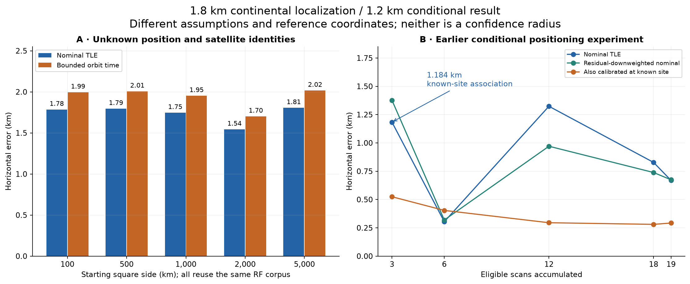
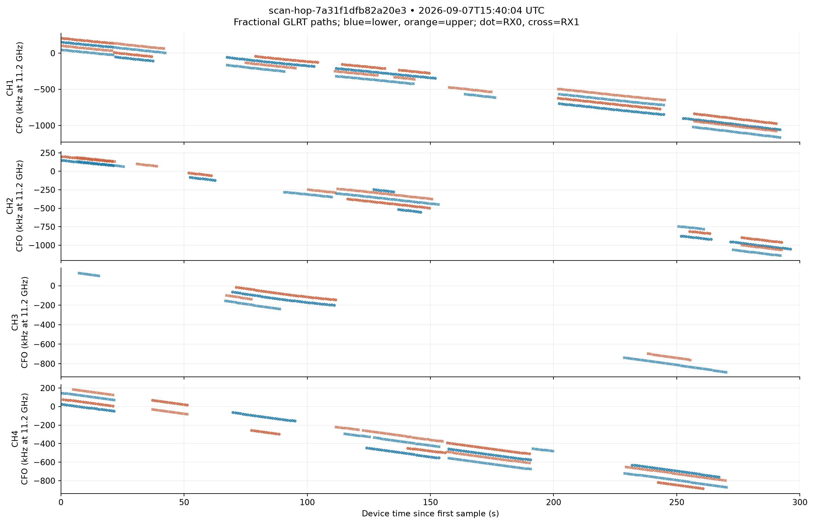
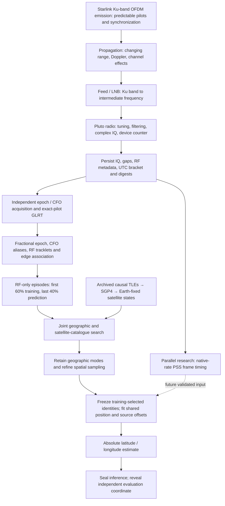
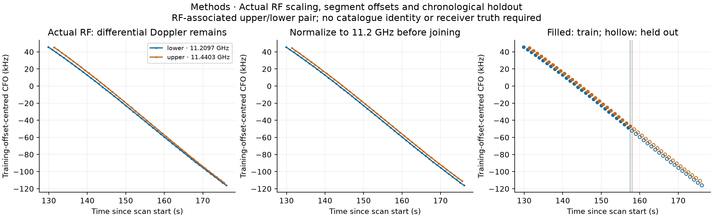
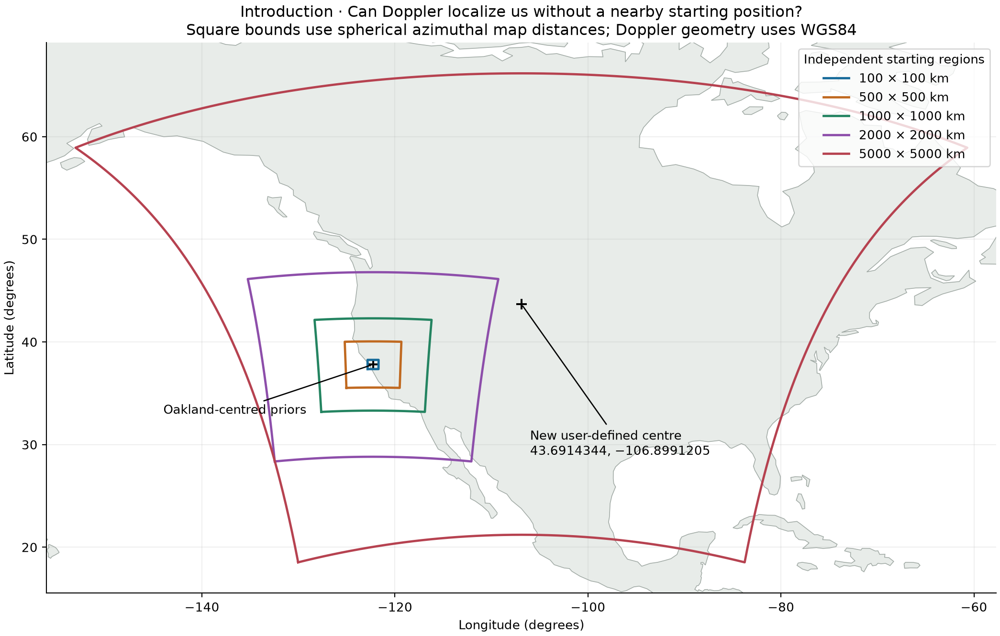
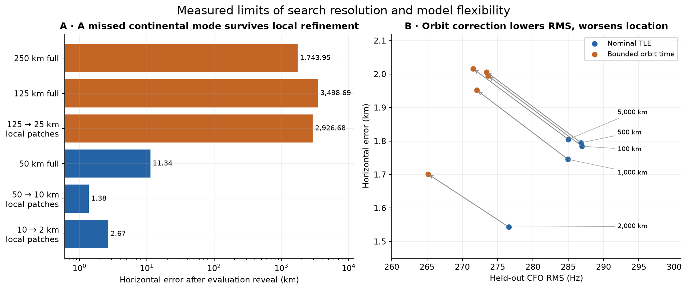
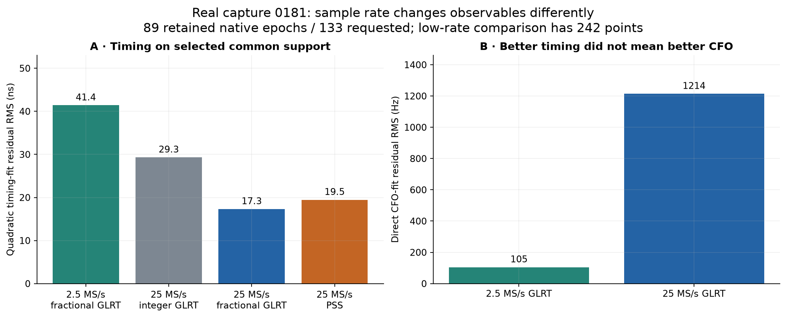
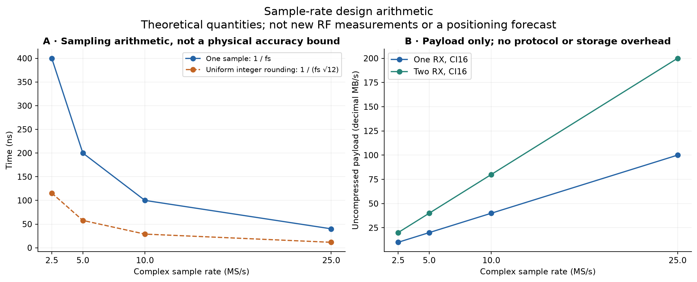

# Starlink positioning: 1.8 km continental localization / 1.2 km conditional benchmark

**From received radio samples to an absolute position, and what currently limits resolution**

Date: 7 September 2026. Evidence snapshot: remote `main` at
`39146ee83d00523fbd37ba02179c87a5c241a017`.

**Headline result.** Our offline package locates a stationary receiver to **1.805 km
horizontal error** from a **5,000 × 5,000 km starting region**, using archived
Starlink-compatible signals without supplying the receiver coordinate or satellite
identities to the estimator. The **1.184 km** result is an earlier **conditional
three-scan benchmark**: satellite associations used a known-site preset, and its error
was measured against that preset. **These are different experiments with different
reference coordinates, not two estimates of the same continental accuracy.**

The earlier reference is **37.858988°, −122.478103°**, with assumed altitude −29 m.
The later evaluation-only coordinate is **37.8490428024417°, −122.48567437412359°**,
with no supplied altitude. They are **1,290.27 m apart**. The earlier number is the
horizontal displacement in a local tangent plane about its preset; the continental
number is great-circle separation from the later coordinate. The reference difference,
as well as the use of known-site associations, prevents a direct accuracy comparison.
[Earlier scorer](../tools/evaluate_scan_pnt_cohort.py),
[earlier position evaluator](../src/leo/analysis/research/scan_pnt_experiment.py),
[later evaluation coordinate](evaluation/2026_09_07_regional_position_truth.json).



*Figure 1 — Real archived results, replotted from the two published numerical
summaries. Panel A estimates unknown position and identities; panel B uses
known-site associations and a different reference coordinate. Every starting region
in A reuses the same radio corpus. Lines in B connect accumulated-data fits, not
independent accuracy trials. Neither panel supplies a confidence radius.*

| Result | Reported horizontal error | What was supplied or assumed | Supported interpretation |
|---|---:|---|---|
| Continental nominal-TLE fit, unknown height | **1,805 m** | Broad geographic bounds, recorded UTC, causal TLEs, stationary receiver, near-Earth height prior | Absolute localization in this archived experiment |
| Four other regional starts, nominal TLE, unknown height | **1,543–1,795 m** | Different bounds; same RF dataset and evaluation coordinate | Starting-region sensitivity |
| Earlier three-scan pooled fit | **1,184 m** | Satellite associations selected at the earlier site preset; fixed local height | Conditional benchmark, not a continental cold start |
| Earlier nineteen-scan pooled fit | **669 m** | Same known-site association dependency and reference | Conditional accumulation result |
| Earlier nineteen-scan calibrated fit | **292 m** | Also fits satellite timing using the site preset | Calibration consistency, not independent localization |

Sources: [continental study](2026_09_07_blind_regional_doppler_positioning.md) and
[eight-hour study](2026_09_07_eight_hour_scan_tracking_and_positioning.md).
The demonstrated result is horizontal position on one dataset. Worldwide coverage,
altitude accuracy, a 95% containment radius, and an operational fix service have not
been established.

## 1. Introduction

The scientific question is whether ordinary communications transmissions can reveal
where a receiver is, even when it does not know which satellites it hears. Our
evidence now supports a useful answer: accumulate the time variation of several
received frequency tracks, compare those variations against predicted satellite
motion across a large geographic region, and refine the supported receiver location.
The receiver does not need to decode user traffic for this experiment.

This report follows that chain from emitted waveform through the LNB and radio,
sample timing, known-signal detection, carrier-frequency-offset (CFO) tracking,
orbital association, geographic acquisition, and continuous position fitting. It
also separates the additional PSS timing research from the CFO observations actually
used in the continental solution. **Native-25 PSS was not an input to the 1.805 km
position estimate.** It is a promising independent timing observable and a target
for future acceleration.

The review screened all **148 pre-existing top-level reports** in this snapshot;
the [source inventory](figures/2026_09_07_continental_positioning_synthesis/source-report-index.md)
records their names and hashes. The detailed scientific lineage appears in section
11. Historical plots remain evidence of their original experiments. Later timing,
alias, and sign corrections determine how they may be interpreted today.

**Resolution bottleneck.** Empirically, five regional starts give similar kilometre
scale errors, but they are five runs of one dataset. Theoretically, repeatability
under changed initialization does not establish bias, geographic generalization, or
a calibrated error distribution. Those require disjoint observations and reference
locations.

## 2. Motivation: frequency change contains geographic information

A moving transmitter changes the received carrier frequency through Doppler. The
shape of that change depends on the satellite orbit and receiver location. A single
short, approximately straight track is ambiguous: different satellites and locations
can share a similar slope, while transmitter and receiver oscillators add unknown
frequency offsets. Curvature and observations at different orbital viewing geometries
can distinguish these possibilities.

The latest corpus provides 24 scans of nominally 300 seconds, collected across an
eight-hour calendar window. It contains 502 RF channel episodes with median duration
17.34 s and maximum 53.82 s. These are interrupted observations of different candidate
signals, not 24 uninterrupted five-minute passes of identified satellites.



*Figure 2 — The actual 15:40:04 UTC scan, the final scan in the eight-hour corpus:
5 MS/s and 36 consolidated episodes. Frequency is RF-normalized to 11.2 GHz;
source-local offsets and multiple paths remain visible. Connected support is not
proof of a spacecraft identity or carrier-phase continuity. The complete 24-scan
atlas is linked in the [cohort report](2026_09_07_eight_hour_scan_tracking_and_positioning.md).*

**Resolution bottleneck.** Empirically, the earlier 19 eligible nominal-TLE pooled
fits go from 1,184 m at three scans to 304 m at six, 1,324 m at twelve, and 669 m at
nineteen, against the earlier preset. More data do not monotonically reduce error.
Theoretically, independent geometry can improve observability, while correlated
measurement or orbit biases persist under averaging. A short-arc fit with a free
frequency offset discards absolute-frequency information by design.

## 3. End-to-end approach



*Architecture diagram — Explanatory schematic. The solid path summarizes the
reported offline positioning workflow; the dotted PSS path is proposed future
integration. The Standard RF analyzers and the research positioning tools are
separate stages. This diagram does not assert a deployed scanner-to-PNT service.*

The key information boundary is before orbital fitting. RF extraction uses signal
measurements; the geographic search receives no earlier known-site NORAD winners,
site-specific horizon list, or fitted orbit correction. Later CFO values cannot
choose the geographic cell, identity mixture, source offsets, or local-fit
parameters. The evaluation coordinate is opened only after inference outputs are
sealed. The coordinate was nevertheless available in the development conversation:
this is algorithmically truth-isolated retrospective research, not a personally
blinded prospective trial.

**Resolution bottleneck.** Empirically, RF segmentation and associations were built
with complete within-scan support before the 60/40 split. The held-out result is
therefore conditional on retrospective extraction. Theoretically, stage-local
holdout cannot prove end-to-end independence if an earlier stage used future data.
A complete earlier-only replay is the next test of this architecture.

## 4. Emission, propagation, and reception on the radio

### The useful transmitted structure

The published Starlink waveform contains approximately 240 MHz OFDM channels,
repeated synchronization structure, and predictable edge-pilot symbols. The local
edge template uses eight subcarriers and 300 known 4QAM symbols per frame. These
predictable patterns provide a matched reference; their reuse across satellites
means the pattern itself is not an identity code.
[Qin et al., predictable waveform elements](https://arxiv.org/html/2602.02627v1).

| Quantity | Value used in the package | Consequence |
|---|---:|---|
| Frame rate / period | 750 Hz / 1.333333 ms | Many repeated observations; frame-cycle ambiguity remains |
| OFDM symbol duration | 4.4 µs | 11 samples at 2.5 MS/s; about 110 at 25 MS/s |
| Subcarrier spacing | 234.375 kHz | Distinct from the CFO alias period |
| Edge pilot | 300 symbols × 8 tones | Known symbols only; no payload decoding required |
| Outermost tone separation | 1.640625 MHz | A narrow spectral aperture inside the full channel |
| Tone offsets from edge-band centre | ±117.1875, ±351.5625, ±585.9375, ±820.3125 kHz | A centre at digital DC does not put a pilot tone at DC |

Authority: [template implementation](../src/leo/analysis/starlink/templates.py) and
[IF/DC centering review](2026_08_21_edge_pilot_if_dc_centering.md). The older
[transmission concept document](../docs/concepts/starlink-transmissions.md) describes
the edge-pilot path accurately but predates the newer PSS implementation.

### From Ku-band Doppler to recorded IQ

The reviewed low-band chain uses an LNB local oscillator of 9.75 GHz. For example,
CH3 lower-edge RF at 11.2096875 GHz becomes IF at 1.4596875 GHz; the radio then
places the selected slice in complex baseband. The scanner visits lower and upper
edges of CH1–CH4. Its 2.5 or 5 MHz instantaneous bandwidth is not a full-channel
240 MHz capture.

For a stationary receiver at Earth-fixed position \(x\), the model is

\[
 D_s(t;x)=-\frac{f_0}{c}\frac{(r_s(t)-x)^T v_s(t)}{\|r_s(t)-x\|},\qquad
 \widetilde f_i(t)=f_i(t)\frac{f_0}{f_{\mathrm{RF},i}},\quad f_0=11.2\ \mathrm{GHz}.
\]

The prediction uses satellite position and velocity in the same Earth-fixed frame,
including the rotation contribution to velocity. Normalization permits comparison
of tracks recorded at different RF frequencies. A source-local constant absorbs
unresolved oscillator and transmitter frequency offsets. Frequency drift, channel
effects, and transmitter steering can still contaminate the Doppler shape.

**Empirical resolution limits.** The cohort's nominal unknown-height fits have
276.6–287.0 Hz held-out CFO RMS. At 11.2 GHz, 1 Hz corresponds to approximately
0.02677 m/s of line-of-sight velocity; 285 Hz corresponds to 7.63 m/s **if interpreted
entirely as Doppler**. This is a units conversion, not a measured velocity error or
position-error bound. The historical
[dual-LNB study](2026_08_22_dual_lnb_drift_reference.md) observed short-term wander
and did not establish a transferable clock calibration.

**Theoretical resolution limits.** Timing information depends on the known signal's
effective RMS bandwidth, integration energy, and channel response. For the same
eight-tone observable, increasing ADC rate alone does not create more frequency
aperture. Under an ideal known-waveform, additive-white-noise model, timing standard
deviation scales as \(1/(\beta\sqrt{E/N_0})\), where \(\beta\) is centred RMS bandwidth.
Unknown channel phase and oscillator terms reduce usable information. The full RF
centre must not be substituted for \(\beta\) when carrier phase is unknown.
[Qin et al., TOA precision discussion](https://arxiv.org/html/2602.02627v1#S2).

## 5. Sample timing, capture continuity, and transport

The ADC produces complex IQ, which is stored as CI16: signed 16-bit I and Q fields,
four bytes per complex sample per receiver. This storage width is not a claim of
16 effective analog bits. Device sample counters establish observed adjacency;
manifests preserve gaps, tuning boundaries, sample rates, and first-sample UTC
brackets. Digest verification establishes which samples were analyzed.

| Latest eight-hour corpus quantity | Measured value |
|---|---:|
| Complete 300 s scans | 24: twelve at 2.5 MS/s and twelve at 5 MS/s |
| Valid visits | 57,288, each 120 ms |
| Total retained dwell time | 6,874.56 s, approximately 1.91 h |
| Median valid duty inside scans | 95.4444% |
| Valid dwell time / eight-hour calendar window | 23.87% |
| Median / maximum first-sample UTC bracket width | 1.334 / 1.924 ms |
| Median / maximum RF episode duration | 17.34 / 53.82 s |

The distinction between device time and UTC was decisive in earlier work. Missing
time at refill boundaries had compressed historical time axes and made apparent
multi-second CFO slopes too steep. That mechanism supersedes earlier explanations
of roughly 100 ms sawteeth as transmitter resets. Those recordings remain useful
for qualified within-refill measurements, not as uncorrected long-baseline orbital
evidence. [Refill mechanism](2026_08_24_refill_time_compression_sawtooth.md),
[counter-authoritative implementation](2026_08_24_continuity_buffer_implementation.md).

**Empirical resolution limits.** Native-25 recordings in the September 2 paired
cohort retain only **60.47–61.07%** of their logical timelines, with **16–21 gaps**
per 60 s recording. That is a different acquisition cohort from the September 7
scanner; it is not a current universal ceiling for 25 MS/s. Gap-safe processing
excludes every block crossing absent samples.
[Five-pair report](2026_09_02_five_paired_native25_pss_vs_2p5_glrt.md).

**Theoretical resolution limits.** Exact sample adjacency does not calibrate the
sample oscillator, absolute UTC, RF phase across a retune, or a second radio's clock.
At an illustrative 3 kHz/s CFO slope, 1 ms time displacement produces approximately
3 Hz frequency displacement. A reported UTC bracket width is not a Gaussian timing
standard deviation and must not be inserted into a variance budget as one. No
interpolation can recover unrecorded IQ or justify carrier-phase continuity through
a tune change.

## 6. Radio processing: acquisition, GLRT, and fractional timing

### Finding the known signal

Each complete probe is searched for a frame epoch and CFO. The GLRT—generalized
likelihood ratio test—compares how well a known pilot hypothesis explains the samples
after accounting for nuisance signal parameters. The implementation also scores a
17-symbol-rolled control. Exact-template superiority is stronger waveform evidence
than a power peak alone. GLRT64 combines known-symbol information within bounded
groups and combines frame powers without assuming uninterrupted carrier phase across
all frames. The scanner/full-capture evidence here uses 20 ms probes, with a dense
10 ms stride where source continuity permits.

Known-pilot QAM demodulation is a complementary quality check. It measures recovery
of known 4QAM symbols, not decoded user traffic. Strong GLRT, good timing, and stable
carrier phase can occur on different receiver paths, so one quality score cannot
stand in for the others.


*Figure 3 — Actual GLRT persistence and known-pilot quality for the historical
`a555a5cf5306` capture. It illustrates detector evidence, not an input to the
continental solver or a population detection rate. The strongest timing/GLRT path
in this report had zero qualified 75 ms carrier-phase segments; a companion receiver
provided ten. [Capture-quality report](2026_08_27_170330_capture_quality.md).*

### Removing a numerical timing limit

At 2.5 MS/s, an integer epoch advances in 400 ns steps. A smoothly moving peak
rounded onto that grid creates visible plateaus and fans. Fractional GLRT evaluates
the local score surface, requires a bracketed concave peak, and estimates a
continuous epoch. The newer path can directly rescore the fractional coordinate with
band-limited IQ interpolation; unbracketed peaks remain explicit failures.


*Figure 4 — Same-IQ replay of 652 epochs in the selected `7fea7427619d` locklet.
Log-parabolic interpolation reduced full-locklet timing-fit RMS from **112.65 ns to
21.74 ns**, an **80.7%** reduction. The rate changed only 0.138%. This historical
prototype held acquired CFO fixed and did not directly rescore the continuous
coordinate; later Standard integration adds stronger fractional validation.
[Fractional-epoch report](2026_09_02_7fea_glrt_fractional_epoch_prototype.md).*

**Empirical resolution limits.** The integer grid was a demonstrated dominant error
source on that locklet. It is not the remaining physical limit: different peak
interpolators differed by a median approximately 28 ns and a 95th percentile
approximately 44 ns. In the native-25 `0181` experiment, 89 of 133 PSS-scheduled
windows produced retained fractional results; 19 failed the margin gate and 25 had
an unsuitable local fractional surface.

**Theoretical resolution limits.** Uniform integer rounding gives
\(\sigma_q=1/(\sqrt{12}f_s)\): 115.47 ns at 2.5 MS/s and 11.55 ns at 25 MS/s.
This is a quantization model, not a Cramér–Rao bound, and fractional estimation can
beat it. For a coherent, stable tone, frequency precision scales as
\(1/(T\sqrt{E/N_0})\); at fixed power/noise density this becomes \(T^{-3/2}\).
Our grouped, noncoherent, channel-dependent GLRT does not inherit that ideal bound
over the whole 20 ms window. An FFT bin width of \(1/T\) is also not a hard
frequency-estimation floor.

## 7. Post-processing: from CFO detections to useful orbital episodes

Independent detections become time-frequency tracklets. The pipeline retains raw
CFO and alias information, groups compatible observations, and uses bounded
residual-Hough and local polynomial models to describe their evolution. Where
correction replay is used, its evidence and chosen frequency lift remain distinct
from the original acquisition. A smooth line is evidence of a signal component;
it is not automatically a unique transmitter.

The edge-symbol ambiguity is

\[
\Delta f_{\rm alias}=1/(4.4\ \mu\mathrm{s})=227,272.727\ldots\ \mathrm{Hz}.
\]

It differs from the 234.375 kHz subcarrier spacing and is independent of ADC sample
rate. Treating alias switches as physical jumps can fabricate dynamics. Removing
them is a coordinate correction, not additional Doppler information.
[Alias report](2026_08_26_cfo_alias_canonicalization.md).

Upper/lower observations are normalized by actual RF, and replicas are consolidated
without silently counting the same sample as two episodes. Compatible edges can
share trajectory shape while retaining independent offsets. The eight-hour result
finds **338/387** accepted links predict later observations better with a shared
cubic than independent cubics; the median shared/separate RMS ratio is **0.582**.
The formal derivative-precision gain is **1.43×**. These are conditional predictive
and formal gains, not proof of two independent measurements per radio.



*Figure 5 — An actual paired episode from the position-search corpus before and
after RF normalization, including its training/prediction split. Independent
source offsets are retained. This is frequency-shape combination, not coherent
synthesis of a 230 MHz-wide delay observable.*

**Empirical resolution limits.** Model selection over the 502 episodes selected
80 linear, 212 quadratic, and 210 cubic descriptions. The earlier `09970e` scan
shows channel-level descriptive RMS of 68–112 Hz for cubics versus 577–796 Hz for
lines; this does not justify using a cubic everywhere. The `a340` review also
invalidated an attractive channel-switch hypothesis after discovering **38.716 s
of simultaneous channel overlap**.
[09970e review](2026_09_07_scan_09970e_fractional_glrt_trajectory_tle_review.md),
[a340 correction](2026_09_07_scan_a340_fractional_glrt_trajectory_review.md).

**Theoretical resolution limits.** For \(N\) independent, equally noisy frequency
measurements approximately uniformly distributed over duration \(T\), a fitted
linear rate has standard error approximately
\(\sqrt{12}\sigma_f/(\sqrt{N}T)\). Overlapping probes, shared oscillators, receiver
replicas, and selected membership violate independence. Extending actual temporal
support can help more than densely resampling the same interval. Local polynomials
must not be extrapolated across hours: in the recurrence experiment even linear
extrapolations gave roughly 516–4,444 Hz residuals; propagated orbital models were
far more useful.

## 8. TLE and model-based geographic acquisition

A two-line element set (TLE) supplies a model of satellite orbital motion, not a
received identity label or exact orbit truth. The package admits archived Starlink
catalogues collected before each scan with a five-second guard and element epochs
preceding the recording. SGP4 propagation and the TEME-to-Earth-fixed transform
produce candidate positions and velocities at the observation times.

For each geographic cell and RF episode, the search compares normalized CFO shape
with every admitted visible satellite and an explicit unassigned alternative.
Each source segment receives a constant frequency offset learned on training
samples. It receives no freely fitted slope or curvature that could erase
geographic differences. The catalogue prior uses the full causal catalogue count
so locations with fewer visible objects do not get an artificial advantage.

The first 60% of each source is training and the last 40% is held out. Regional
search retains at most six samples per partition; local physical fitting restores
all samples in the selected episodes. The primary geographic selection uses training
scores only. These are composite scores, not calibrated log probabilities.



*Figure 6 — Declared search bounds, including the 5,000 km square centred at
43.6914344°, −106.8991205°. This changes both centre and size from the Oakland-centred
experiments. The original scientific PNG uses a Natural Earth land backdrop with
[recorded provenance](figures/2026_09_07_blind_regional_pnt/map-source.json).*

| Continental stage | Sampled locations | Revealed horizontal error | Recorded replay time |
|---|---:|---:|---:|
| Whole region, 250 km spacing | 400 | 1,743.95 km | 106.0 s |
| Whole region, 125 km spacing | 1,600 | 3,498.69 km | 304.3 s |
| Eight local patches from the 125 km branch | 935 | 2,926.68 km | 151.5 s |
| Independent whole region, 50 km spacing | 10,000 | 11.34 km | 1,477.7 s |
| Eight 10 km patches from the 50 km branch | 935 | 1.38 km | 135.4 s |
| Three final 2 km patches | 351 | 2.67 km | 60.8 s |
| Continuous nominal-TLE, unknown-height fit | Continuous local fit | **1.805 km** | Seven fit iterations |

These elapsed times are previously recorded archived-data CPU runs, not new
collection, a controlled benchmark, or a time-to-first-fix claim. The 10 km cell
happens to be closer to truth than the finer-grid winner. Keeping the
training-selected refinement avoids selecting the lucky cell after reveal.



*Figure 7 — Data from all retained continental branches and all five unknown-height
local fits. A: coarse searches can select the wrong part of the continent, and local
refinement can preserve that failure. B: arrows add bounded orbit-time corrections;
prediction RMS improves while position moves farther from the evaluation coordinate.*

**Empirical resolution limits.** Sparse continental sampling misses a high-scoring
mode completely; a finer whole-region check succeeds. Small orbit-time adjustments
do not fix position bias. Wrong recording-time controls, searched over the full
1,000 km region, produce sharply supported locations **655 km and 418 km** from
the reference despite using the same radio observations.

**Theoretical resolution limits.** Geographic likelihood can be multimodal and
narrower than the coarse grid. A local optimizer cannot recover an unsampled distant
mode. A square grid with spacing \(h\) has a worst nearest-cell-centre distance
\(h/\sqrt2\) in its map coordinates, but that is only quantization geometry under
correct cell selection—not a localization guarantee. Unknown identity, null-model
miscalibration, and clock error can produce errors many orders larger.

## 9. Final position and an honest resolution budget

The local fit freezes training-selected identity hypotheses and estimates one
shared stationary receiver location, with source-local frequency offsets. The
continental fit retains **493 episodes, 1,069 source segments, and 22,694 observations**,
with **269 provisional NORAD identities** across **279 NORAD/TLE snapshot groups**.
Those counts are not independent satellites confirmed by the receiver.

The unknown-height model has a zero-centred 1 km height prior and bounds −500 to
+5,000 m. The nominal solution is **37.853649440°, −122.465961367°**, with fitted
ellipsoidal height approximately **−265 m**. Horizontal separation from the later
evaluation coordinate is **1,805.014 m**. No altitude truth was supplied, so the
height has no validated accuracy interpretation.

| Continental local model | Horizontal error | Training CFO RMS | Held-out CFO RMS |
|---|---:|---:|---:|
| Nominal TLE, height fixed to zero | 2,179 m | 124.9 Hz | 283.4 Hz |
| Nominal TLE, unknown height | **1,805 m** | 124.7 Hz | 285.0 Hz |
| Shared bounded orbit time, fixed height | 2,356 m | 115.7 Hz | 270.1 Hz |
| Shared bounded orbit time, unknown height | 2,016 m | 115.5 Hz | 271.5 Hz |

The correction model shares one orbit-time parameter per NORAD/TLE snapshot,
with a 0.5 s prior and ±2 s bound. Its largest fitted correction is 0.533 s.
It improves held-out frequency prediction by about 13.5 Hz but worsens horizontal
error by approximately 211 m. Therefore a better RF residual is not sufficient
evidence of better positioning.

### Why nanoseconds and hertz do not directly specify position accuracy

Linearize the observation model around a candidate position:

\[
\delta z = J_x\delta x + J_b\delta b + J_o\delta o + \epsilon.
\]

Here \(J_x\) maps receiver displacement into frequency change, \(J_b\) describes
source offsets and clock terms, and \(J_o\) describes orbit corrections. Position
information survives only in directions that cannot be explained by the nuisance
parameters. Under a correct local linear model with weight matrix \(W\), profiling
nuisance columns \(J_n\) gives the information matrix

\[
 I_x=J_x^T WJ_x-J_x^TWJ_n(J_n^TWJ_n)^{-1}J_n^TWJ_x.
\]

An inverse, when identifiable, is a **conditional** covariance; singular directions
need explicit constraints, priors, or abstention. This calculation assumes the
chosen identities, linearization, error distribution, and covariance model are
correct. It does not include distant geographic modes or an unknown model bias.

| Stage / source of error | Empirical evidence | Theoretical constraint / unresolved measurement |
|---|---|---|
| Integer timing | `7fea`: 112.65 → 21.74 ns after fractional estimation | Grid quantization was removable; peak/channel bias remains |
| Timing versus CFO | `0181`: 17.3 ns timing RMS with 1,214 Hz CFO RMS at native 25 MS/s | Separate parameter sensitivities; one cannot substitute for the other |
| Continuity and UTC | Counter-attested scans; UTC brackets up to 1.924 ms | Sample adjacency is not external clock calibration |
| Episode geometry | Median 17.34 s; model order varies | Short support weakens curvature and confounds nuisance parameters |
| Measurement correlation | Existing 100 Hz-noise simulation: 925 m median with independent noise; 1,528 m with five-sample correlation | One real geometry with synthetic noise and exact identities/orbits; not a real-data accuracy trial |
| Catalogue/geographic sampling | 250/125 km grids fail by thousands of km | A missed mode defeats local fitting |
| Orbit/receiver ambiguity | Orbit correction lowers residuals and worsens all five locations | Nuisance directions remove position information |
| Earth frame model | UT1 approximated by UTC; polar motion neglected | Frame transform, light-time, and propagation approximations need improvement before precision claims |
| Integrity and reference truth | Sharp wrong-time peaks; earlier/later references differ by 1.290 km | No calibrated 95% region or demonstrated false-fix rate |

This is a **bottleneck ledger, not an additive error budget**. The terms are
correlated, incompletely calibrated, and measured under different conditions. A
root-sum-square total would be unjustified. The existing synthetic noise experiment
isolates one mechanism; it does not identify what fraction of the real 1.805 km
error comes from noise, TLE error, clocks, or incorrect identities.

**Resolution bottleneck.** Empirically, the remaining error survives improved timing
and numerically converged fits. Theoretically, reducing measurement noise cannot
remove systematic bias or restore information absorbed by nuisance parameters.
Independent clock/orbit calibration, geometry diversity, and an honest no-fix
decision are required alongside better RF estimation.

## 10. Sample rate, PSS tracking, FPGA acceleration, and next steps

### What increasing the sample rate has actually achieved

PSS is the primary synchronization sequence. The native-rate implementation
projects the published waveform onto the recorded band, correlates complete
continuity-safe blocks over a CFO bank, folds repeated evidence on the 750 Hz frame
lattice, refines local epochs, and associates a consistent circular timing track.
It measures **template-relative frame phase**. SSS/payload interpretation, transmit
time, and the integer frame cycle are not established by that operation alone.

The September 2 five-pair study found three independent native-25 PSS tracks out
of five preselected captures, with quadratic block-median RMS **0.217–0.378 µs**.
The other two primary no-track outcomes remain in the evidence. The targeted
September 3 `0181` comparison gives the sharper results below on selected support.



*Figure 8 — Real `0181f7f0ffa1` data. Fractional native-25 GLRT has 17.3 ns timing
RMS, PSS 19.5 ns, and paired low-rate fractional GLRT 41.4 ns. The direct CFO
measurement is noisier at 25 MS/s. Separate radios, unequal observation counts,
PSS-selected scheduling, and retained-support gates prevent this from being a
controlled sample-rate-only ranking.*

| Observable on `0181` | Points | Quadratic timing RMS | Timing-derived rate magnitude |
|---|---:|---:|---:|
| 2.5 MS/s fractional GLRT, common interval | 242 | 41.4 ns | 3,071.08 Hz/s |
| 25 MS/s integer GLRT | 89 | 29.3 ns | 3,075.88 Hz/s |
| 25 MS/s fractional GLRT | 89 | **17.3 ns** | **3,067.76 Hz/s** |
| 25 MS/s PSS, same retained times | 89 | 19.5 ns | 3,066.84 Hz/s |

The fractional GLRT/PSS rate difference is **0.91 Hz/s**, while direct CFO-fit RMS
is **1,214 Hz at 25 MS/s versus 105 Hz at 2.5 MS/s**. Precision of a fitted timing
curve and scatter of independently acquired CFO are different measurements.
[Native-25 report](2026_09_03_0181_native25_fractional_glrt.md).

The historical timing-derived rate uses a physical-delay sign that opposes recorded
IQ CFO. Current `main` aligns the comparison through an explicitly labelled
**template-phase CFO proxy**, without claiming absolute physical sign calibration.
Older opposite-sign PNGs must be interpreted in that context.
[Current presentation implementation](../src/leo/analysis/standard/native_pss_glrt_comparison.py),
[sign/quantization diagnosis](2026_09_02_6f8_pss_glrt_residual_deep_dive.md).

### Bandwidth, cadence, and transport are separate choices



*Figure 9 — Theoretical arithmetic, deliberately separate from the measured
Figure 8. CI16 payload demand excludes framing, metadata, buffering, compression,
and persistence overhead. These curves are not measured throughput or accuracy.*

| Complex rate | Sample interval | Uniform integer-rounding RMS | CI16, one RX | CI16, two RX |
|---:|---:|---:|---:|---:|
| 2.5 MS/s | 400 ns | 115.47 ns | 10 MB/s | 20 MB/s |
| 5 MS/s | 200 ns | 57.74 ns | 20 MB/s | 40 MB/s |
| 10 MS/s | 100 ns | 28.87 ns | 40 MB/s | 80 MB/s |
| 25 MS/s | 40 ns | 11.55 ns | 100 MB/s | 200 MB/s |

The 10 MS/s row is design arithmetic, not a new positioning experiment. At
25 MS/s, retaining 300 s of CI16 requires 30 GB per receiver before compression.
The 40 ns sample interval corresponds to 12.0 m of light travel, but neither that
number nor \(c\times17.3\ \mathrm{ns}\approx5.2\ \mathrm{m}\) is a pseudorange or
position-accuracy claim. A usable absolute range also needs transmit timing,
frame-cycle resolution, and calibrated receiver/channel delays. Published timing
research documents transmitter timing behavior that complicates purely opportunistic
pseudorange. [Qin et al., timing properties](https://rnl.ae.utexas.edu/wp-content/uploads/qin_starlink_timing_properties.pdf).

Increasing sample rate helps when it admits more **useful known-signal bandwidth**,
reduces avoidable quantization, or supports a more faithful local interpolation.
Oversampling the same analog-filtered band does not multiply independent information.
Widening the analog filter can also admit more noise and interference. The current
25 MHz slice is still about one tenth of a 240 MHz channel; it must not be described
as full-channel PSS capture. AD9361-class hardware supports a maximum 56 MHz tunable
channel bandwidth, so a full-channel receiver is a different RF design, not a simple
change to the sample-rate setting. Board/firmware/transport qualification can impose
tighter limits. [Analog Devices AD9361](https://www.analog.com/en/products/ad9361.html).

Integration duration also matters. At 750 frames/s, 250 ms contains approximately
187.5 frame opportunities; 62.5 ms contains 46.9. On the earlier `5dc618208b54`
control, unconstrained short-block search produced modes but no final track because
the seed list crowded one portion of time. Refinement in a corridor obtained from
PSS alone recovered **503/568** complete short blocks and improved cubic block-median
RMS from **0.295 to 0.203 µs**, while quadratic RMS barely changed. Acquisition and
tracking therefore deserve different integration/cadence choices.
[Window comparison](2026_09_02_five_paired_native25_pss_vs_2p5_glrt.md).

For independent timing observations distributed over duration \(T\), uncertainty
in timing curvature scales approximately as
\(\sqrt{720}\sigma_\tau/(\sqrt{N}T^2)\) for a quadratic least-squares fit.
Differentiating a noisy timing sequence twice is expensive in precision; longer
stable support helps, whereas jumps, gaps, clock drift, and overlapping windows
invalidate the simple independence assumption.

### What FPGA-accelerated PSS tracking could contribute

The concrete opportunity is to process the known signal before the high-rate IQ
stream overloads the transport or host, preserving counter-aligned observations
and selected raw windows for audit. The FPGA already provides sample-counter
authority in the capture system. **These reports do not demonstrate an FPGA PSS
accelerator, its resource fit, or a positioning improvement from one.**

| Proposed division of work | Purpose | Measurement required before adopting it |
|---|---|---|
| FPGA channelizer / decimator with declared delay | Preserve useful bands while lowering output volume | Passband response, alias rejection, fractional delay and counter alignment |
| Bounded blind PSS correlation bank or FFT acquisition | Discover phase/CFO modes without known position | Detection/false-alarm curves on recorded signal and null windows; miss accounting |
| Predicted-window PSS tracking around a previously acquired mode | Reduce search work and maintain timing cadence | Holdout epoch/CFO error, slip rate, reacquisition after gaps and competing signals |
| Fractional peak / early-prompt-late statistics | Retain sub-sample timing information | Fixed-point bias and saturation versus the floating-point reference |
| Device-counter-labelled compact output plus retained IQ snippets | Reduce transport pressure while preserving reproducibility | Bytes/s, queue occupancy, losses, latency, and replay agreement |
| CPU multi-hypothesis association and orbit/position fitting | Keep changing catalogue logic and integrity checks reviewable | Earlier-only position errors, rejection rates, and geometry stability |

A rough workload calculation illustrates why tracking should be separated from
blind acquisition. A 110-tap direct PSS correlator at 25 MS/s costs approximately
**2.75 billion complex multiply-accumulates/s per CFO hypothesis and receiver** if
evaluated at every sample. A nominal ±2 µs tracking corridor has approximately
101 candidate shifts; evaluating those at 750 frame epochs costs approximately
**8.33 million complex multiply-accumulates/s per hypothesis**. These are naive
operation counts, not synthesized FPGA timing or resource estimates. FFT banks,
shared arithmetic, sample-rate conversion, fractional interpolation, multi-mode
retention, and reacquisition change the costs.

The existing `0181` CPU experiment provides a limited measured baseline: 133
20 ms windows took **52.47 s with four workers**; summed verified-read time was
**39.66 worker-seconds**, which overlaps across workers and is not a wall-time
percentage. This is selected GLRT work, not a continuous FPGA-PSS benchmark.
Profiling should distinguish IQ read/verification, correlation, tracking,
association, and geographic search before choosing an acceleration target.

**Empirical bottleneck.** High-rate timing is promising, but the demonstrated
high-rate captures had substantial absent source time and the continental solver
still used low-rate CFO. **Theoretical bottleneck.** FPGA arithmetic can increase
availability and reduce latency; it cannot remove TLE bias, clock ambiguity, an
incorrect satellite assignment, or a geographic search miss. Faster computation
must be judged by retained independent information and final position validation.

### Next steps, in order

1. **Freeze an earlier-only replay on existing later scans.** Freeze source
   selection, RF association, geographic search, model settings, and fix/no-fix
   rules before opening evaluation coordinates. Retain every failed start and
   report elapsed observation time, accepted RF time, compute time, and miss rate.
   Use one explicit evaluation reference with independently documented uncertainty.
2. **Calibrate integrity and geometric stability.** Run matched wrong-location,
   wrong-time, and null controls; leave out satellites, scans, and receivers. A
   sharp score peak alone must not authorize a fix. Report empirical containment
   and false-fix rates only when sample size and independence support them.
3. **Separate clocks, orbits, and receiver position.** Test constrained shared
   oscillator/clock states and reference/rover calibration on disjoint data. Keep
   nominal TLE as the baseline: extra orbit freedom has already worsened position.
   Improve the Earth-frame model and assess sensitivity to causal catalogue age.
4. **Measure sample-rate effects on the same recorded signal.** Use archived
   native IQ with anti-alias-filtered decimations, identical time support, declared
   filter delay, and measured known-signal bandwidth. Separately compare native
   RF chains. Report detection retention, timing bias/scatter, CFO/rate error,
   gap behavior, and downstream position; a cross-radio pair alone cannot isolate
   sample rate.
5. **Prototype FPGA PSS tracking against a frozen software reference.** Start with
   counter-indexed recorded windows and calibrated synthetic delays/CFOs, then
   inject gaps and saturation. Measure fixed-point error, resource use, clock
   closure, power, output volume, and loss/reacquisition. Integrate only after a
   measured compute or transport bottleneck justifies it.
6. **Add PSS to positioning only after sign and clock validation.** Preserve
   template-relative timing, resolve convention and cycle ambiguities explicitly,
   and account for covariance with GLRT when both use the same IQ. Require an
   improvement on untouched position evaluation, not merely a cleaner timing PNG.

These steps prioritize the existing corpus and short numerical replays. This report
performs no new RF collection, firmware change, deployment, or database mutation.
Any future collection needs explicit authorization and a duration of at most
30 minutes under repository policy.

## 11. Evidence lineage, reproduction, and conclusion

The related reports tell a consistent progression when their revisions and claim
boundaries are preserved:

| Report family | Finding carried into this synthesis | Interpretation today |
|---|---|---|
| [Signal/tracking guide](2026_08_24_starlink_signal_and_tracking_guide.md), [IF centering](2026_08_21_edge_pilot_if_dc_centering.md) | Known edge-pilot evidence and exact RF geometry | Template compatibility does not decode an identity |
| [Line finding](2026_08_20_line_finder.md), [residual Hough](2026_08_22_residual_hough_segmentation.md), [alias canonicalization](2026_08_26_cfo_alias_canonicalization.md), [window geometry](2026_08_26_20ms_window_comparison.md) | Retain real trajectories and distinguish aliases | Detector density and geometry are not physical transmitter counts |
| [Subsecond pilot structure](2026_08_22_subsecond_pilot_structure.md), [phase qualification](2026_08_23_five_dwell_modulo_pi_qualification.md), [capture quality](2026_08_27_170330_capture_quality.md) | Local phase can be useful but intermittent | Timing, phase, QAM and CFO require separate quality gates |
| [Refill mechanism](2026_08_24_refill_time_compression_sawtooth.md), [controlled loopback](2026_08_24_refill_continuity_loopback.md), [refill-aware review](2026_08_25_doppler_rate_and_satellite_linking_method_review.md) | Missing elapsed time explained historical slope distortions | Supersedes transmitter-reset interpretations for affected data |
| [V3 review](2026_08_25_pnt_kalman_v3_comprehensive_review.md), [V4 experiment](2026_08_25_150802_pnt_kalman_v4_experimental.md), [downstream benchmark](2026_08_25_v3_v4_downstream_rate_benchmark.md) | Acquisition yield and conditional tracking improved in some settings | A filter named PNT is not itself a demonstrated position solver |
| [Final Doppler holdout](2026_08_26_final_doppler_holdout_and_starlink_association_v2.md), [wrong-time interpretation](2026_08_26_wrong_time_specificity_and_orbital_time_shift.md), [long-arc audit](2026_08_27_satellite_pnt_long_arc_development_audit.md), [tracking synthesis](2026_08_27_satellite_tracking_association_and_pnt_synthesis.md) | Curvature and recurrence help; attractive ranks can fail identity gates | Later regional results do not retroactively promote old candidates |
| [Multi-radio rate experiment](2026_08_26_multi_radio_common_rate_results.md), [fixed-window calibration](2026_08_26_fixed500_calibration_results.md), [nuisance study](2026_08_26_retrospective_satellite_nuisance_results.md) | Shared noise and model freedom change apparent precision | Correlation and nuisance models require independent calibration |
| [Counter-continuous delay](2026_08_25_counter_continuous_frame_timing_and_delay.md), [21-dwell PSS/SSS](2026_08_25_multi_dwell_pss_sss_doppler.md), [early mixed-rate replay](2026_08_31_production_dual_2p5_25_pss_replay.md) | Early timing support was limited and gap-dependent | Stronger later PSS evidence does not erase those negative outcomes |
| [Five paired PSS/GLRT captures](2026_09_02_five_paired_native25_pss_vs_2p5_glrt.md), [6f8 diagnosis](2026_09_02_6f8_pss_glrt_residual_deep_dive.md), [7fea refinement](2026_09_02_7fea_glrt_fractional_epoch_prototype.md), [0181 comparison](2026_09_03_0181_native25_fractional_glrt.md) | Sub-sample timing is real; sample rate, sign and continuity matter | High timing precision remains distinct from absolute ranging |
| [Native-rate deployment retrospective](2026_08_27_native_sample_rate_production_deployment_retrospective.md), [scanner duty prototype](2026_09_03_scanner_no_firmware_duty_prototype.md), [latest scan corpus](2026_09_07_eight_hour_scan_tracking_and_positioning.md) | Measured transport/queue work enabled high scan duty | Historical canary limits are superseded only by their later measured qualifications |
| [a340 review](2026_09_07_scan_a340_fractional_glrt_trajectory_review.md), [09970e review](2026_09_07_scan_09970e_fractional_glrt_trajectory_tle_review.md), [eight-hour positioning](2026_09_07_eight_hour_scan_tracking_and_positioning.md) | Episode consolidation, prediction, and conditional pooling | Known-site selection and channel conflicts remain explicit |
| [Continental search](2026_09_07_blind_regional_doppler_positioning.md) | Unknown-position/unknown-identity localization at 1.805 km | One retrospective continental result; integrity and generalization remain open |

The headline, new figures, and design-arithmetic table are generated from committed
numerical artifacts by
[report_continental_positioning_synthesis.py](../tools/report_continental_positioning_synthesis.py).
The [metrics](figures/2026_09_07_continental_positioning_synthesis/metrics.json)
retain source values, both reference coordinates, the recomputed reference
separation, every failed continental branch, and all local-model alternatives.
The [manifest](figures/2026_09_07_continental_positioning_synthesis/manifest.json)
hashes the numeric inputs, reused PNGs, source-report inventory, new figures, and
report generator. No AI-generated imagery is used. Figures 1–8 contain measured
or reported experimental evidence; Figure 9 is explicitly theoretical arithmetic.

```bash
PYTHONPATH=src OPENBLAS_NUM_THREADS=1 python tools/report_continental_positioning_synthesis.py
PYTHONPATH=src OPENBLAS_NUM_THREADS=1 python -m pytest -q \
  tests/analysis/test_continental_positioning_synthesis.py
PYTHONPATH=src OPENBLAS_NUM_THREADS=1 python tools/verify_regional_doppler.py --published-only
```

Publication verification checks the committed summaries, hashes, links, and
numerical regression suite. The continental study intentionally omits 528 large
per-scan/per-cell intermediate arrays from Git. `--published-only` declares that
omission; these checks do not rerun the full RF extraction or continental search.

Validation for this synthesis passed **156 tests**: five report/evidence checks and
151 regional, scan-positioning, blinded-evaluation, and sky regressions. The
published-only verifier also validated **22 sealed replays, 20 local fits, and
13 original continental figures**. The fresh
[regional verification receipt](figures/2026_09_07_continental_positioning_synthesis/regional-verification.json)
records that scope and the explicitly omitted intermediate arrays. All nine PNGs
embedded here were decoded successfully; the new figures were visually reviewed.

The supported conclusion is **1.8 km continental localization from archived
Starlink-compatible Doppler observations**, with a separately labelled **1.2 km
conditional benchmark against an earlier site preset**. Fractional timing and
native-rate PSS are real advances in observable precision. The next improvement in
position must demonstrate that better measurements, clocks, satellite hypotheses,
and coverage produce a more accurate and trustworthy location on disjoint data.
Sample rate and FPGA acceleration are means to that measured outcome.
