# Eight hours of Starlink scan tracking and positioning experiments

Date: 2026-09-07 UTC

Frozen review window: 07:49:15–15:49:15 UTC

Repository base: `e4c3f732c4b0e889620f7d536ee3714abc8a30c4`

Scope: 24 archived 300 s captures; fractional CFO analysis, satellite association,
repeat-pass prediction, and conditional positioning

Scientific status: exploratory candidate evidence; no independently verified
satellite identity or autonomous positioning accuracy is claimed

## Findings that determine the next design

The scanner contains useful orbital information. Across the eight-hour window,
502 consolidated channel episodes produced 176 provisional satellite matches,
representing 125 NORAD candidates. Their median held-out CFO residual was
110.3 Hz. Four candidates recur after approximately five hours, and propagating
their **earlier** catalogue element and frozen timing correction predicts the
later pass at 81.8–224.2 Hz held-out RMS. This is substantially stronger evidence
than connecting similar slopes within one recording.

Combining upper and lower evidence also works across this larger dataset. Of
387 accepted edge links, 338 (87.3%) predict later observations better with a
shared cubic than with independent cubics. The median shared/separate held-out
RMS ratio is 0.582: approximately 42% lower predictive RMS. The median formal
Doppler-rate standard-error gain is 1.43× when derivatives are evaluated at the
same overlap epoch and the polynomial design is numerically scaled. These are
conditional results on previously selected RF tracklets and links; they are not
a prospective edge-association error rate.

Positioning remains the limiting step. Nineteen scans contain at least three
distinct, channel-consistent NORAD candidates suitable for the conditional
positioning experiment. Fixed-TLE, fixed-height solutions have a median
horizontal error of 3.87 km against the known receiver site. Pooling those 19
scans reduces the error to 669 m. Calibrating each orbit's timing at the known
site reduces pooled error to 292 m, but that uses the answer during calibration
and is **not an independent positioning demonstration**. Jointly estimating
position and bounded orbit-time errors from one scan is poorly constrained and
performs worse than fixed TLEs.

The recommended architecture is therefore a candidate registry driven by
physical orbit predictions, with separate RF association, ephemeris calibration,
and position-estimation stages. Long polynomial extrapolation and unconstrained
joint position/orbit fitting are not suitable ways to bridge scanner gaps.

## 1. Dataset and timing authority

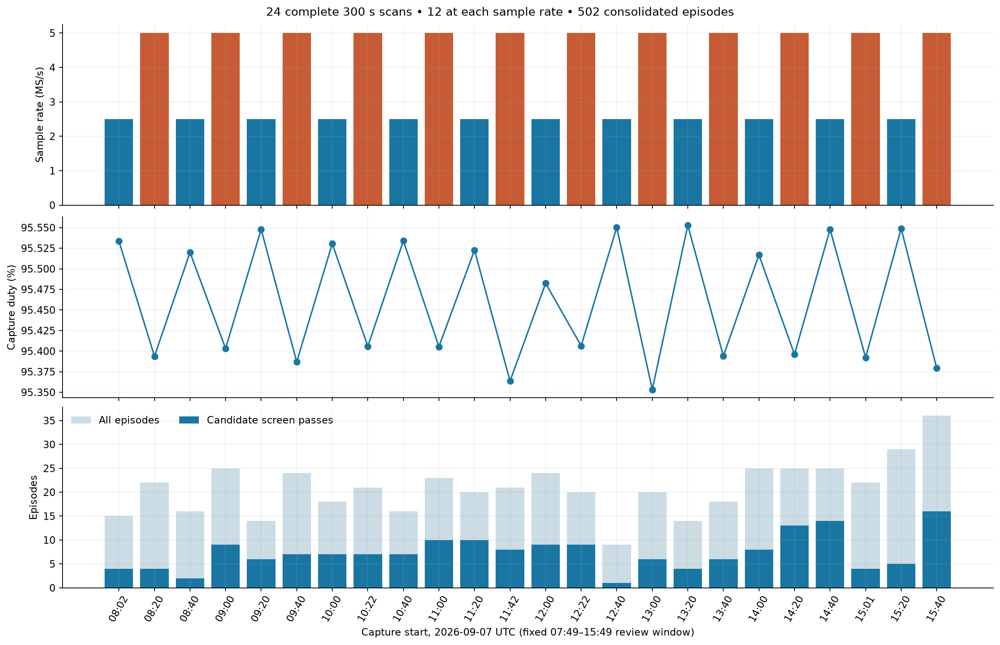

| Quantity | Result |
|---|---:|
| Completed, qualified 300 s scans | 24 |
| Rate allocation | 12 at 2.5 MS/s; 12 at 5 MS/s |
| RF bandwidth | Equal to sample rate on every scan |
| Visit duration / count | 120 ms / 57,288 visits |
| Total retained dwell time | 6,874.56 s, about 1.91 h |
| Median within-capture duty | 95.4444% |
| Within-capture duty range | 95.3533–95.5528% |
| Valid dwell time / eight-hour calendar window | 23.87% |
| Source-disjoint primary tracklets | 1,083 |
| Accepted lower/upper links | 387 |
| Consolidated channel episodes | 502 |
| Episode duration, median / maximum | 17.34 s / 53.82 s |
| Host/device UTC bracket, median / maximum width | 1.33 ms / 1.92 ms |

The distinction between capture duty and calendar duty matters. A 300 s scan
every 20 minutes leaves roughly 15 minutes between captures. High acquisition
duty inside a scan does not imply continuously observed satellites across eight
hours. The oldest selected capture starts at 08:02:59 UTC and the newest at
15:40:04 UTC. The last capture's analysis completed while the retrospective
evidence was being collected; all 24 are complete in the frozen export.

Every input came through the repository's read-only capture and fractional
analysis adapters. Capture digests, device/UTC timing authority, selected source
candidate IDs, tracklet IDs, actual RF frequencies, and catalogue digests are
preserved in the [evidence directory](figures/2026_09_07_eight_hour_scan_pnt/evidence/).
The study reads previously published CFO products rather than rerunning the
entire raw-IQ detector. No new RF collection was performed.

The host/device bracket constrains the internal timestamp association; it does
not certify the host clock's absolute error relative to UTC. Absolute clock
calibration remains a positioning requirement.

## 2. What was implemented and tested

| Approach | Purpose | Observed outcome |
|---|---|---|
| Fractional GLRT and alias-aware local paths | Preserve sub-sample CFO evidence | 1,083 retained primary tracklets |
| RF-normalized upper/lower consolidation | Combine one physical channel's two edges | 87.3% of selected links improve held-out cubic RMS |
| Receiver-replica consolidation | Avoid treating two receiver paths as separate satellites | Produces 502 channel episodes after edge consolidation |
| Linear, quadratic, cubic local models | Measure curvature without catalogue guidance | Adaptive order improves median prediction over fixed linear; short arcs remain fragile |
| Full causal-catalogue search, no time correction | Baseline orbit prediction | Median held-out RMS 134.7 Hz |
| Shared bounded orbit-time correction, ±2 s | Absorb small ephemeris timing error | Median held-out RMS 110.6 Hz |
| Wider ±5 s sensitivity | Test whether extra timing freedom helps | Median RMS 112.9 Hz; no aggregate improvement |
| Rate-only catalogue comparison | Cheap identity shortlist | Typically a small shortlist, but no full curvature consistency |
| Curvature-only comparison | Test information beyond slope | Often weak on these short arcs; full shape is most useful |
| Full catalogue at ±10 min wrong times | Test time specificity and accidental matching | 8/1,004 negative-control searches pass the candidate screen |
| Channel-exclusive shared polynomials | Propose satellite channel switches | 162 temporal hypotheses; 7 RF-supported |
| Frozen left-to-right orbital handoff | Predict a later channel from an earlier one | One exploratory handoff passes the declared comparison |
| Frozen older TLE across later passes | Test tracking over hours | Four recurrences; three below 200 Hz, fourth 224 Hz |
| Fixed-TLE 2D positioning | Estimate horizontal location with height fixed locally | Median single-scan error 3.87 km |
| Fixed-TLE 3D positioning | Add unknown height | Median horizontal error 4.03 km; less stable geometry |
| Known-site timing calibration then positioning | Estimate benefit of ephemeris calibration | Median error 753 m; optimistic because known location informs calibration |
| Joint position and bounded timing | Test self-calibration from one scan | Median error 6.16 km; ambiguity and initialization sensitivity |
| Pooled stationary-position fit | Accumulate satellite geometry over scans | 669 m at 19 usable scans, conditional on associations |
| Residual downweighting | Test robustness of pooled fixed-TLE fitting | 674 m at 19 scans; no final improvement |
| Exact-orbit synthetic trials on observed geometry | Separate noise and geometry from orbit error | Median 925 m with independent 100 Hz noise; 1,528 m with correlated noise |

The pure numerical implementation is
[scan_pnt_experiment.py](../src/leo/analysis/research/scan_pnt_experiment.py).
The storage, catalogue, plotting, and command-line responsibilities are in
separate research tools. Existing production contracts and scanner behavior were
not changed.

## 3. Measurement model and upper/lower joining

Each fractional CFO observation uses its actual lower or upper RF center:

\[
\widetilde f_i(t)=f_i(t)\frac{11.2\ \mathrm{GHz}}{f_{\mathrm{RF},i}}.
\]

A shared local model then uses

\[
\widetilde f_i(t)=b_i+g(t)+\epsilon_i(t),
\]

where `b_i` is a fixed nuisance offset for each source tracklet and `g(t)` is the
shared Doppler trajectory. The offsets permit different receiver, LNB,
acquisition, and alias-reference biases. Frequency normalization handles the
time-varying differential Doppler between RF edges; a fixed offset alone would
not do this. A synthetic test verifies that a shared cubic exactly recovers the
normalized shape while fitting unnormalized lower/upper frequencies leaves a
substantial residual.

The inherited exploratory association gates require overlapping support,
compatible normalized rates, and a shared fit that does not incur excessive RMS
or BIC cost. Same-edge overlapping alternatives cannot silently collapse into
one physical track. Compatible receiver paths are consolidated after edge
merging. All source identities remain in the export.

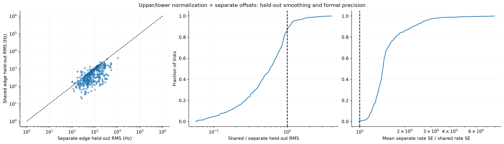

The new comparison fits shared and separate cubics using the first 60% of each
source tracklet and scores the last 40%. It reports equal weight per source
segment. Across the 387 accepted links:

- 338 have lower shared held-out RMS;
- the median shared/separate RMS ratio is 0.582;
- the 90th-percentile ratio is 1.065, so not every join helps; and
- the worst selected link has nearly four times the independent prediction RMS.

This resolves the earlier RMS discussion. A constrained shared model generally
cannot improve the least-squares training optimum over two independent models
on identical data and weights. It can improve prediction substantially by
reducing unstable extrapolation and sharing temporal support. Robust fits can
also show small reversals in unweighted training RMS because they optimize a
different, reweighted objective.

For the uncertainty diagnostic, this implementation scales time before fitting,
uses the design pseudoinverse to avoid squaring its condition number, and
evaluates both individual rates and the shared rate at the same overlap
midpoint. The median formal standard-error gain is 1.43×. This is a different
cohort and estimator from the earlier single-scan 2.61× result; the earlier
number should not be treated as a guaranteed operational gain. These formal
errors assume the fitted residual model and do not account for all temporal,
receiver, or edge correlations.

Association itself used complete RF tracklets and their full support. Therefore
these held-out residuals test prediction conditional on the discovered RF
structure. A fully prospective validation must construct and accept the RF
paths using only the data available at each update time.

## 4. Local model order and catalogue matching

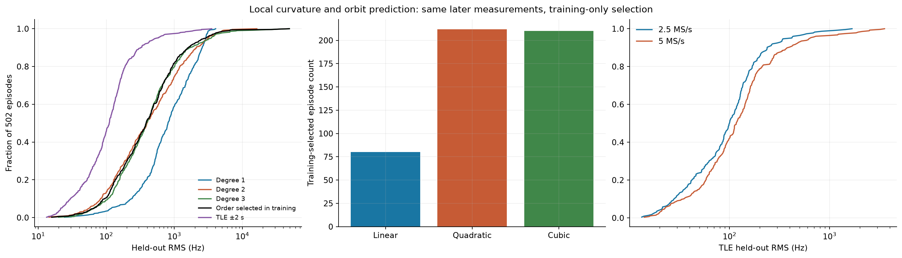

Polynomial order is chosen inside the training partition: an earlier training
subset predicts a later validation subset. For 127 very short episodes, the
inner cubic has insufficient degrees of freedom, so the code explicitly falls
back to training BIC. The held-out partition does not select the order.

| Model | Median held-out RMS over 502 episodes |
|---|---:|
| Linear | 806.9 Hz |
| Quadratic | 397.6 Hz |
| Cubic | 386.6 Hz |
| Training-selected polynomial | 385.2 Hz |
| Nominal-time TLE | 134.7 Hz |
| TLE with ±2 s timing search | 110.6 Hz |
| TLE with ±5 s timing search | 112.9 Hz |

The selected orders are 80 linear, 212 quadratic, and 210 cubic. A nearly equal
quadratic/cubic split supports an adaptive local model rather than a universal
cubic. A cubic over a short noisy arc can extrapolate very badly: the largest
cubic held-out residual exceeds 49 kHz.

The 2.5 MS/s scans yield 225 episodes and 77 screen passes; 5 MS/s yields 277
episodes and 99 passes. Median TLE held-out RMS is 100.1 Hz and 116.8 Hz,
respectively. These are different capture times and satellite geometries, not
paired simultaneous observations; the result does not establish a causal
sample-rate advantage.

### Causal orbit search

For each scan the tool loads the latest archived Space-Track snapshot collected
strictly before its first-sample reference, with a five-second guard, and admits
only Starlink TLE epochs preceding that reference. It propagates the catalogue
with SGP4, screens the geometric horizon conservatively, and evaluates retained
orbits on a 0.25 s grid. Candidate visibility is admitted using training times.
The observer is the existing Spinnaker/Sausalito site at 37.858988° N,
122.478103° W, −29 m altitude.

For every candidate, satellite identity, `τ`, and per-source constant offsets are
selected using the first 60% of each source tracklet. The same choices are then
scored on the final 40%. No arbitrary fitted Doppler slope, acceleration, or
jerk is added to the orbital model. The primary search is `τ ∈ [−2,+2] s` in
0.25 s steps; ±5 s is a separate sensitivity result.

This split is chronological **within each source tracklet**, not necessarily one
global time cut across a merged episode. It avoids fitting an unseen tracklet's
frequency offset from its evaluation samples, but it must not be described as
an entirely online global forecast.

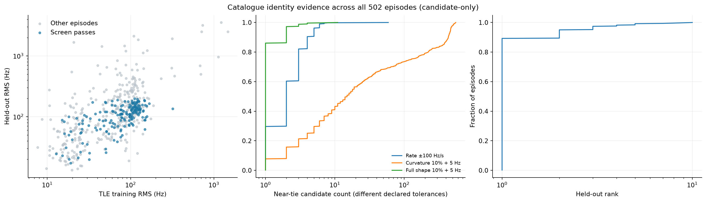

The training winner remains rank one on held-out data in 448/502 episodes.
Full-shape training comparison has a median of one near-tied catalogue object.
Rate-only has a median of two under a 100 Hz/s additive tolerance; curvature-only
has a median of 15 after projecting away a common slope. The curvature and full
shape tolerances are 10% plus 5 Hz. These tolerances are different, so the counts
are diagnostic shortlists rather than comparable probabilities.

The short median arc length explains why removing the slope often discards the
most useful discriminator. Curvature can be decisive on a long, well-resolved
arc, but rate and curvature together are more reliable across this cohort.

### Frozen candidate screen

A provisional match requires all of the following:

1. at least 15 s episode support;
2. training winner remains held-out rank one;
3. held-out RMS no greater than 200 Hz;
4. training winner-to-runner RMS gap at least 50 Hz;
5. exactly one candidate within 10% plus 5 Hz of the training winner;
6. timing adjustment is interior to ±2 s; and
7. TLE held-out RMS is no worse than the training-selected polynomial.

The thresholds were fixed before the cohort score pass. They are exploratory
engineering gates, not a registered or statistically calibrated detector. The
screen passes 176/502 episodes (35.1%), representing 125 distinct NORAD
candidates. Passing does not set `identity_claimed=true`.

## 5. Orbital timing correction and negative controls

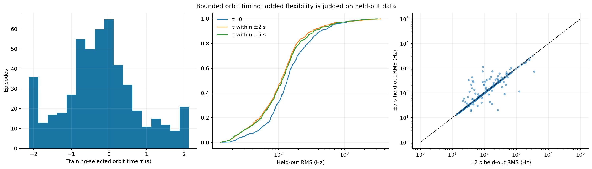

The ±2 s correction reduces median held-out RMS from 134.7 to 110.6 Hz. Extending
the bound to ±5 s raises the median to 112.9 Hz. The primary and wider searches
choose the same identity in 461/502 episodes; only 29 episodes improve held-out
RMS with the wider search. Fifty-seven primary fits land on a ±2 s boundary and
are excluded from the candidate screen. Extra freedom is useful selectively,
not a general route to better identity.

The literature supports explicitly handling ephemeris timing error. Hayek and
Kassas's [timing and spatial ephemeris error study](https://people.engineering.osu.edu/media/document/2024-12-05/kassas_modeling_and_compensation_of_timing_and_spatial_ephemeris_errors_of_non_cooperative_leo_satellites_with_application_to_pnt.pdf)
uses a known-position stationary receiver to refine uncertain satellite
ephemerides, then applies that refinement to positioning. This separation is
essential: calibration at a known site and autonomous position estimation solve
different problems. Our scalar `τ` search is a limited approximation to their
more complete ephemeris treatment.

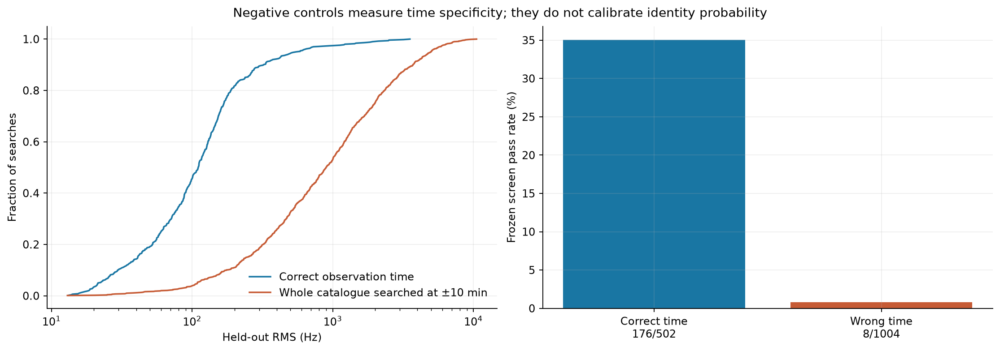

For each of the 502 episodes, the experiment also searches the full admissible
catalogue at observation times shifted by −600 s and +600 s. Every control
reselects its own identity and bounded `τ`; it does not merely evaluate the
correct-time winner at the wrong time. This allows chance catalogue matches to
compete fairly.

Eight of 1,004 wrong-time searches pass the screen (0.80%), versus 176/502
correct-time searches (35.1%). There is substantial observation-time
specificity, and also a nonzero accidental-match rate. The control rate is not
an identity error probability or a calibrated false-discovery rate: neighbouring
Starlink orbits, correlated episodes, and the counterfactual sky distribution
still matter.

## 6. Channel changes and incompatible assignments

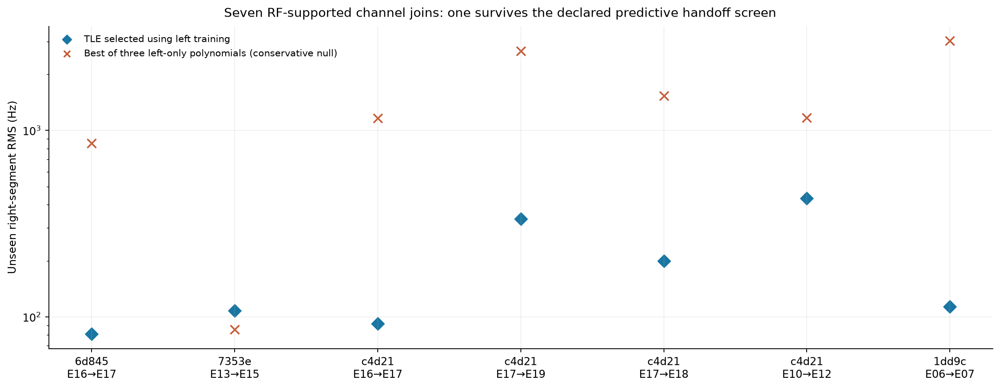

The inherited one-channel-at-a-time hypothesis accepts potential joins with at
most 4 s gap and 1.05 s boundary overlap. The two channel episodes have separate
frequency offsets while sharing normalized dynamics. Of 162 temporal
hypotheses, seven meet the RF support gates: shared-minus-independent BIC at or
below −10 and shared/independent RMS at or below 1.25.

The stricter test selects an orbit and `τ` from the left episode's training
measurements. The first 40% of each right source tracklet calibrates only its
constant frequency offset; the final 60% tests the prediction. The left orbit
must agree with the independent right training winner, pass the left candidate
screen, predict the right at no more than 200 Hz, and beat even the best held-out
result among three left-only polynomials. Comparing against the best of all
three polynomials is deliberately conservative for the handoff candidate.

One exploratory handoff meets these conditions:

| Quantity | Result |
|---|---|
| Scan | `scan-hop-8a67fa6d0e7c4d21`, capture start 12:22:48 UTC |
| Left | E16, CH4LU RX0+1, 206.652–231.794 s |
| Right | E17, CH1LU RX0+1, 231.920–247.015 s |
| Gap | 0.127 s |
| Candidate | STARLINK-36479, NORAD 67352 |
| Frozen left `τ` | −0.5 s |
| TLE right held-out RMS | 91.8 Hz |
| Best left-polynomial right held-out RMS | 1,164.7 Hz |

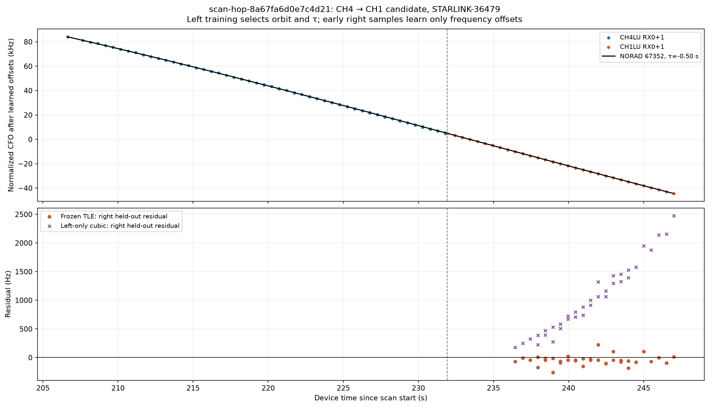

This is evidence worth following, not a confirmed switch. The right episode on
its own fails the standalone screen because its independent timing fit reaches
the −2 s bound. The frozen left-orbit prediction is the stronger evidence here.
Six other RF-supported joins fail one or more predictive conditions; an
attractive shared polynomial alone is not enough.

Separately, the standalone candidate list contains 39 overlapping
cross-channel pairs involving 23 NORAD candidates. Those pairs conflict with
the one-channel-at-a-time model. They could represent identity ambiguity,
similar orbital geometry, duplicated or systematic RF structure, or a failure
of the transmitter-occupancy assumption. This study cannot decide among those
explanations. Conflicted candidates are flagged in the registry and excluded
from each affected scan's positioning subset.

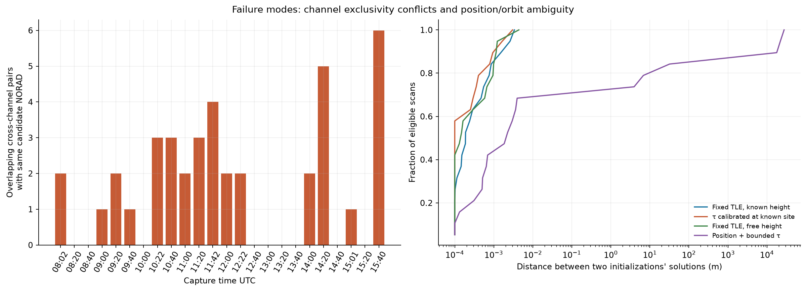

## 7. Tracking across separate passes

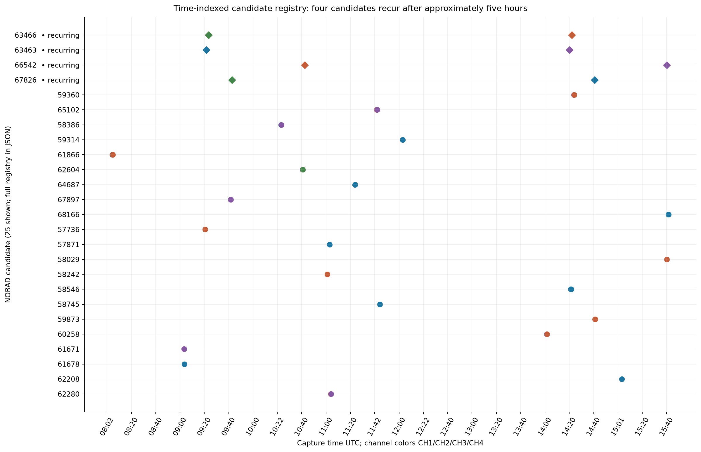

Four NORAD candidates pass the screen in two different scans, separated by
approximately five hours. The repeat test freezes the earlier catalogue element
and the earlier training-selected `τ`, propagates that element to the later
recording, learns only fresh frequency offsets from the later training samples,
and predicts the later held-out samples.

| Candidate | Earlier → later capture | Old TLE, `τ=0` | Old TLE, frozen `τ` | Updated causal TLE, refit `τ` |
|---|---|---:|---:|---:|
| STARLINK-33696 / 63463 | 09:20 → 14:20 | 141.2 Hz | 198.4 Hz | 119.4 Hz |
| STARLINK-33654 / 63466 | 09:20 → 14:20 | 81.8 Hz | 81.8 Hz | 78.5 Hz |
| STARLINK-35865 / 67826 | 09:40 → 14:40 | 564.1 Hz | 224.2 Hz | 126.3 Hz |
| STARLINK-35833 / 66542 | 10:40 → 15:40 | 118.2 Hz | 118.2 Hz | 107.1 Hz |

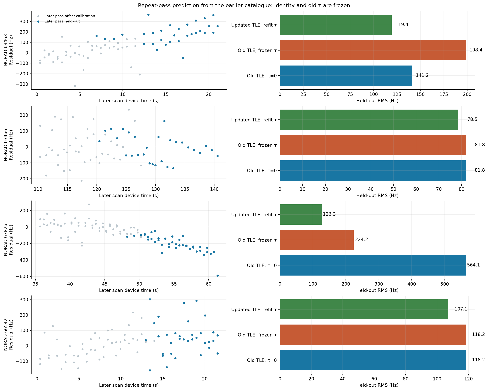

Three frozen predictions remain below 200 Hz; the fourth is 224 Hz. The older
timing correction helps NORAD 67826 but worsens NORAD 63463. A correction is
therefore associated with an element set, uncertainty, and age; it should not
be carried indefinitely as an exact satellite constant. All four updated
catalogue snapshots differ from the earlier snapshots.

The repeated 63466 association also has an earlier simultaneous CH2/CH3
conflict. Its good repeat prediction does not erase that inconsistency. The
registry retains the conflict status instead of promoting it automatically.

These repeats were found retrospectively by agreement of independently searched
episodes. The frozen-earlier-element calculation is a useful additional check,
but a prospective recurrence detector must predict and score every later
opportunity, including missed or ambiguous detections, before seeing which
later episodes independently match.

Extrapolating the earlier local polynomials across five hours fails. Even the
linear predictions give roughly 516–4,444 Hz later residuals. Quadratics give
millions of Hz and cubics hundreds of millions to billions. Such extrapolations
are outside their valid local support. Orbital state propagation is the model
that can bridge these gaps.

## 8. Positioning experiments and their limits

The stationary-receiver model is

\[
z_i=b_i-\frac{f_0}{c}
\frac{(r_s(t_i)-r)\cdot v_s(t_i)}{\|r_s(t_i)-r\|}+\epsilon_i.
\]

Satellite positions and velocities are expressed in Earth-fixed coordinates;
the conversion includes Earth rotation in the velocity. The receiver location
`r` is shared across observations, while each source tracklet has its own
constant offset. The local 2D experiment fixes the tangent-plane up coordinate;
the 3D experiment also estimates it.

For each scan, the positioning subset uses the longest passing episode for each
distinct NORAD candidate, excludes same-NORAD cross-channel conflicts, and
requires at least three candidates. This leaves 19 of the 24 scans. Two starts
at opposite horizontal displacements of approximately 14 km check initialization
sensitivity. Parameter fitting uses only training observations; later
observations test the resulting residual.

**All these position results are conditional on satellite associations selected
using the known receiver site.** The known-site timing variant additionally
uses that site to estimate `τ` on the same data. Neither condition is available
to an autonomous receiver without a location prior or external calibration.
The experiment measures model consistency and identifiability, not certified
autonomous accuracy.

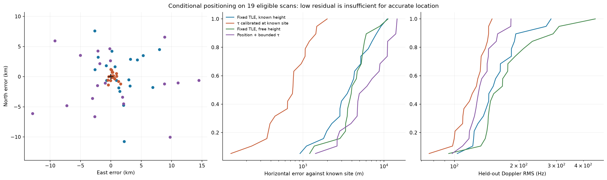

| Variant | Median horizontal error | Median held-out CFO RMS | Numerically converged first starts |
|---|---:|---:|---:|
| Nominal TLE, local height fixed | 3,868 m | 151.8 Hz | 19/19 |
| Nominal TLE, free height | 4,025 m | 167.5 Hz | 18/19 |
| Timing calibrated at known site, height fixed | 753 m | 126.7 Hz | 18/19 |
| Joint position + bounded timing, height fixed | 6,155 m | 131.2 Hz | 16/19 |

The joint timing experiment profiles a first-order Doppler tangent for each
satellite, bounded to ±2 s, while estimating position. It is an identifiability
probe, not full orbital-state refinement. Some starts fail to converge within
the iteration limit and different starts can give substantially different
positions. Those outcomes remain in the evidence and are not silently dropped.

The important failure is physical as well as numerical: orbit-time changes and
receiver displacement can produce similar changes in Doppler on a short arc.
The joint model can lower frequency residuals while moving the receiver farther
from the known site. A successful optimizer and low RMS do not resolve that
ambiguity.

### Accumulating scans at a stationary receiver

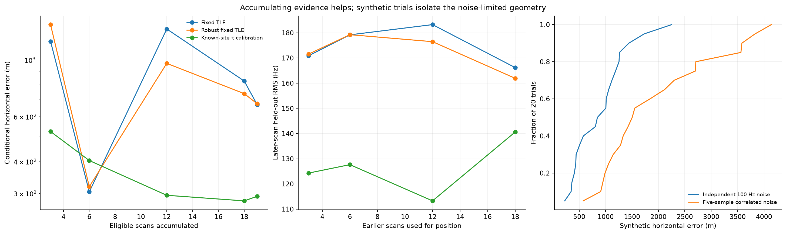

| Eligible scans accumulated | Nominal TLE | Residual-downweighted nominal TLE | Known-site timing calibration |
|---:|---:|---:|---:|
| 3 | 1,184 m | 1,377 m | 525 m |
| 6 | 304 m | 319 m | 404 m |
| 12 | 1,324 m | 971 m | 295 m |
| 18 | 828 m | 739 m | 281 m |
| 19 | 669 m | 674 m | 292 m |

Errors do not fall monotonically as scans are added. Correlated orbit error,
imperfect associations, and changing satellite geometry produce systematic
shifts. The particularly small six-scan error should not be cherry-picked as
the achieved accuracy. Downweighting large residuals helps some prefixes and
does not improve the final fixed-TLE result.

Position estimates from earlier prefixes also predict later scans, with fresh
per-source offsets calibrated using only each later tracklet's early samples.
For example, the 12-scan nominal estimate gives 183.3 Hz on later held-out
measurements; the downweighted estimate gives 176.5 Hz. Later-scan candidate
identities still come from known-site association, so this remains a
conditional temporal prediction test. The known-site timing variant also uses
later-site calibration and cannot establish autonomous transfer accuracy.

### Noise and geometry control

Forty synthetic runs use one eligible scan's actual satellite geometry with
exact catalogue identities and ephemerides: 20 independent 100 Hz noise trials
and 20 trials with noise held constant within five consecutive source samples.
Median horizontal errors are 925 m and 1,528 m, respectively. These controls
show that short support and noise correlation alone can produce kilometre-scale
errors, even before adding ephemeris bias or mistaken identities. They are one
geometry experiment, not a constellation-wide accuracy forecast.

The current TEME/Earth-fixed conversion approximates UT1 by UTC and neglects
polar motion. Its existing implementation documents potential spatial effects
up to hundreds of metres for the former and metres for the latter. Those
approximations, independent clock calibration, receiver oscillator drift,
ephemeris error, and correlation modelling all require attention before
metre-level claims would be meaningful.

## 9. A tracking method suitable for continued development

The implemented [candidate registry](figures/2026_09_07_eight_hour_scan_pnt/candidate-registry.json)
stores NORAD candidate, source scans and episodes, channel support, catalogue
digest, selected `τ`, residual score, recurrence status, and channel-conflict
status. It preserves `identity_claimed=false` and supports deterministic replay
from archived evidence.

A production version should evolve this into the following sequence:

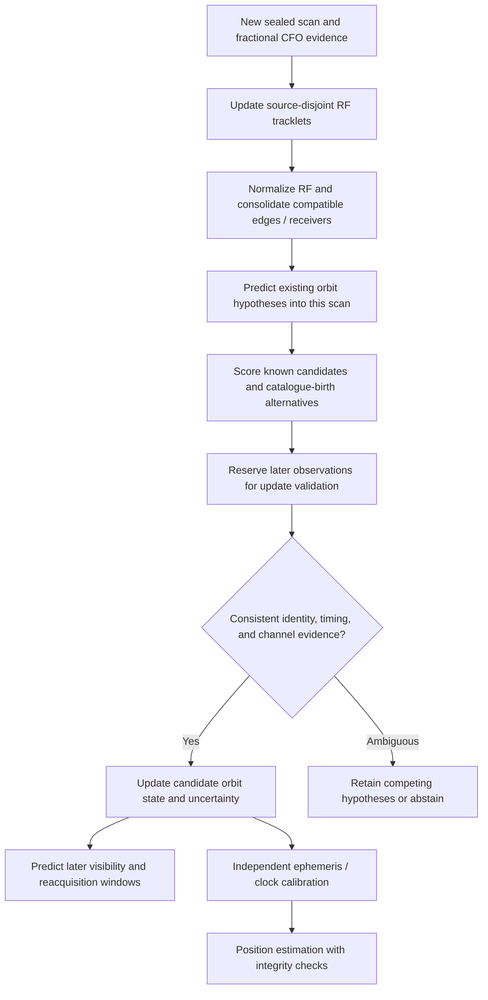

The design choices supported by these experiments are:

1. Keep local polynomial segments for RF extraction and short-term interpolation;
   propagate orbit hypotheses over scanner gaps.
2. Treat frequency intercepts as source-local nuisance parameters, while
   preserving RF-normalized derivatives and their uncertainty.
3. Keep multiple catalogue candidates until later observations discriminate
   them. A single rank-one score is not a satellite identity.
4. Bind orbit-time corrections to the specific element set and its age. Use a
   bounded, uncertainty-aware update rather than an exact permanent offset.
5. Separate possible transmitter channel behavior from satellite identity.
   Channel conflicts are evidence to investigate, not edges to force into a
   switch graph.
6. For positioning, first use an independently calibrated stationary reference
   site or independently known identities/ephemerides. Estimate position on
   disjoint observations without borrowing the test site's true location.
7. Require geometry and initialization checks, leave-one-satellite stability,
   held-out residuals, and explicit abstention before emitting a position fix.

This turn implements the offline numerical experiments and registry. A live
recursive orbit filter, prospective acquisition gate, reference/rover data
transfer, oscillator-state model, and operational position-fix service remain
proposed work; they are not represented as deployed capabilities.

## 10. Priority experiments after this cohort

| Priority | Experiment | Measurement that determines success |
|---:|---|---|
| 1 | Prospective recurrence replay on an unseen time window | Earlier-only hypotheses predict later detections and missed opportunities; no later catalogue ranking used to choose successes |
| 2 | Independent calibration and localization split | Freeze ephemeris corrections on separate reference data, then measure position error at withheld locations or passes |
| 3 | Clock and ephemeris error separation | Stable estimates across initial positions, satellite subsets, and catalogue updates; residual improvement accompanies location improvement |
| 4 | Correlation-aware CFO fitting | Empirical prediction intervals match observed errors across receiver, edge, and temporal blocks |
| 5 | Investigate the CH4→CH1 candidate and conflicting simultaneous channels | Repeatable occupancy and independent waveform/receiver evidence support or reject the one-channel-at-a-time model |
| 6 | Improve observation continuity through archived longer arcs first | More independent geometric support lowers position error, rather than only fitting residuals more closely |
| 7 | Recursive state filter with calibrated process noise | Demonstrated out-of-sample benefit over the present bounded-time, fixed-TLE baseline |

The evidence favours better calibration, validation, and temporal coverage before
introducing a larger unconstrained filter. No claim is made that an EKF, UKF,
factor graph, or more flexible orbit model has already solved the observed
identifiability problem.

## 11. Reproduction, verification, and full scan atlas

The report is accompanied by 13 cohort figures, 24 individual four-channel scan
PNGs, every exported source array, six causal catalogue snapshots, all 24
per-scan score documents, the candidate registry, and aggregate results.

The tools can be rerun in an environment with the repository dependencies:

```bash
export PYTHONPATH=src
export OPENBLAS_NUM_THREADS=1
python tools/report_eight_hour_scan_pnt.py \
  --start 2026-09-07T07:49:15Z --end 2026-09-07T15:49:15Z \
  --output /tmp/leo-eight-hour-replay
python tools/evaluate_scan_pnt_cohort.py --output /tmp/leo-eight-hour-replay
python tools/evaluate_scan_pnt_longitudinal.py --output /tmp/leo-eight-hour-replay
python tools/plot_scan_pnt_cohort.py --output /tmp/leo-eight-hour-replay
python tools/plot_scan_pnt_handoff.py --output /tmp/leo-eight-hour-replay
python -m pytest -q tests/analysis/test_scan_pnt_experiment.py
```

Only the export step needs permission to read the local capture/TLE stores.
Subsequent stages can run entirely from the committed evidence. Use a fresh
output directory when changing experimental settings, because completed
per-scan exports and catalogue score documents are cached.

The tests cover differential RF scaling, independent frequency offsets,
training/evaluation leakage, polynomial-order selection, bounded catalogue-time
selection, interpolation support, numerical covariance stability, synthetic
position recovery, and explicit handling of insufficient inner-fit support.
The exact test command and environment are recorded with the evidence seal.

Core machine-readable results:

- [Capture inventory](figures/2026_09_07_eight_hour_scan_pnt/inventory.json)
- [Numeric summary](figures/2026_09_07_eight_hour_scan_pnt/summary.json)
- [Per-scan catalogue scores](figures/2026_09_07_eight_hour_scan_pnt/results/)
- [Recurrence, edge validation, handoffs, positioning, and synthetic results](figures/2026_09_07_eight_hour_scan_pnt/longitudinal.json)
- [Candidate registry](figures/2026_09_07_eight_hour_scan_pnt/candidate-registry.json)
- [Evidence integrity and execution environment](figures/2026_09_07_eight_hour_scan_pnt/evidence-seal.json)

Each atlas plot shows RF-normalized fractional CFO versus effective device time,
with lower/upper distinguished by colour and RX0/RX1 by marker. Markers do not
encode signal strength.

| Capture UTC | Rate (MS/s) | Episodes | Full scan PNG |
|---|---:|---:|---|
| 08:02:59 | 2.5 | 15 | [66cae29c39756be7](figures/2026_09_07_eight_hour_scan_pnt/scan-atlas/scan-hop-66cae29c39756be7.png) |
| 08:20:04 | 5 | 22 | [7884b1ce6fede7f8](figures/2026_09_07_eight_hour_scan_pnt/scan-atlas/scan-hop-7884b1ce6fede7f8.png) |
| 08:40:03 | 2.5 | 16 | [9ab159ed70a6797d](figures/2026_09_07_eight_hour_scan_pnt/scan-atlas/scan-hop-9ab159ed70a6797d.png) |
| 09:00:04 | 5 | 25 | [1de0e88e6d9453ba](figures/2026_09_07_eight_hour_scan_pnt/scan-atlas/scan-hop-1de0e88e6d9453ba.png) |
| 09:20:49 | 2.5 | 14 | [fa8b9ec97ff14b97](figures/2026_09_07_eight_hour_scan_pnt/scan-atlas/scan-hop-fa8b9ec97ff14b97.png) |
| 09:40:03 | 5 | 24 | [740375254f7d3eb3](figures/2026_09_07_eight_hour_scan_pnt/scan-atlas/scan-hop-740375254f7d3eb3.png) |
| 10:00:03 | 2.5 | 18 | [ed5f119bec16d845](figures/2026_09_07_eight_hour_scan_pnt/scan-atlas/scan-hop-ed5f119bec16d845.png) |
| 10:22:59 | 5 | 21 | [04f15d400cc34fd7](figures/2026_09_07_eight_hour_scan_pnt/scan-atlas/scan-hop-04f15d400cc34fd7.png) |
| 10:40:04 | 2.5 | 16 | [fc2894f68f081fdb](figures/2026_09_07_eight_hour_scan_pnt/scan-atlas/scan-hop-fc2894f68f081fdb.png) |
| 11:00:04 | 5 | 23 | [6c9417eeec67a616](figures/2026_09_07_eight_hour_scan_pnt/scan-atlas/scan-hop-6c9417eeec67a616.png) |
| 11:20:03 | 2.5 | 20 | [9727ae34eed5fe0e](figures/2026_09_07_eight_hour_scan_pnt/scan-atlas/scan-hop-9727ae34eed5fe0e.png) |
| 11:42:55 | 5 | 21 | [17cd3d70f957353e](figures/2026_09_07_eight_hour_scan_pnt/scan-atlas/scan-hop-17cd3d70f957353e.png) |
| 12:00:04 | 2.5 | 24 | [5ce35ea0172e21d4](figures/2026_09_07_eight_hour_scan_pnt/scan-atlas/scan-hop-5ce35ea0172e21d4.png) |
| 12:22:48 | 5 | 20 | [8a67fa6d0e7c4d21](figures/2026_09_07_eight_hour_scan_pnt/scan-atlas/scan-hop-8a67fa6d0e7c4d21.png) |
| 12:40:03 | 2.5 | 9 | [163ca5acea5cce6b](figures/2026_09_07_eight_hour_scan_pnt/scan-atlas/scan-hop-163ca5acea5cce6b.png) |
| 13:00:03 | 5 | 20 | [4bbb02e1f0dda66b](figures/2026_09_07_eight_hour_scan_pnt/scan-atlas/scan-hop-4bbb02e1f0dda66b.png) |
| 13:20:04 | 2.5 | 14 | [4c70b4f8bb61dd9c](figures/2026_09_07_eight_hour_scan_pnt/scan-atlas/scan-hop-4c70b4f8bb61dd9c.png) |
| 13:40:03 | 5 | 18 | [92528c5e4fdebe62](figures/2026_09_07_eight_hour_scan_pnt/scan-atlas/scan-hop-92528c5e4fdebe62.png) |
| 14:00:03 | 2.5 | 25 | [3a957b05cd511170](figures/2026_09_07_eight_hour_scan_pnt/scan-atlas/scan-hop-3a957b05cd511170.png) |
| 14:20:03 | 5 | 25 | [d04702aa7553ee39](figures/2026_09_07_eight_hour_scan_pnt/scan-atlas/scan-hop-d04702aa7553ee39.png) |
| 14:40:03 | 2.5 | 25 | [6852fe2076fb7caf](figures/2026_09_07_eight_hour_scan_pnt/scan-atlas/scan-hop-6852fe2076fb7caf.png) |
| 15:01:29 | 5 | 22 | [5187ef22966d304c](figures/2026_09_07_eight_hour_scan_pnt/scan-atlas/scan-hop-5187ef22966d304c.png) |
| 15:20:03 | 2.5 | 29 | [327e2a741379baec](figures/2026_09_07_eight_hour_scan_pnt/scan-atlas/scan-hop-327e2a741379baec.png) |
| 15:40:04 | 5 | 36 | [7a31f1dfb82a20e3](figures/2026_09_07_eight_hour_scan_pnt/scan-atlas/scan-hop-7a31f1dfb82a20e3.png) |

The preceding single-scan work is preserved in the
[09970e trajectory and TLE review](2026_09_07_scan_09970e_fractional_glrt_trajectory_tle_review.md)
and [a340 trajectory review](2026_09_07_scan_a340_fractional_glrt_trajectory_review.md).
This cohort report broadens those experiments and changes the strength of some
conclusions: upper/lower joining has measurable conditional predictive value,
curvature alone is often weak on short arcs, repeated orbital predictions are
useful over hours, and the current data do not yet demonstrate autonomous
high-accuracy positioning.
