# Scan 09970e fractional-GLRT trajectory and causal-TLE review

**Date:** 2026-09-07 UTC

**Session:** `scan-hop-09970e41439adea3`

**Report base:** `origin/main` at `2ca6eda7de6dcdd2d75463fe91ee0246c59d8d05`

**Claim boundary:** candidate-only research analysis; no satellite identity or
channel switch is claimed

## Executive conclusion

This 300 s scan is a strong trajectory dataset. It contains 2,389 visits at
2.5 MS/s and 2.5 MHz RF bandwidth, with 95.5594% valid capture duty. The
analysis uses fractional GLRT64 timing throughout; integer-only epochs are not
used. After RF-frequency normalization, receiver-replica consolidation, and
lower/upper-edge consolidation, 48 production tracklets reduce to 33 physical
tracks and then to 24 channel episodes.

The observed CFO paths contain real curvature. Cubic descriptive residuals are
68–112 Hz by channel, compared with 577–796 Hz for linear fits. This does not
mean every local arc should be cubic: linear or quadratic fits remain preferable
where the support is short or curvature is weak, and model choice must be made
per episode with a complexity penalty or held-out prediction.

There is one RF-supported cross-channel hypothesis:

- CH1LU RX0+1 at 140.656–171.797 s;
- CH2U RX0+1 at 171.421–183.478 s;
- 0.376 s of tolerated boundary overlap;
- 111.4 Hz shared-cubic RMS versus 110.5 Hz for independent fits; and
- shared-minus-independent BIC of −12.6.

A causal, pre-recording TLE search selects STARLINK-34856 / NORAD 65687 with a
−0.75 s epoch-time adjustment. It is the rank-one training, held-out,
full-shape, and curvature-only match, and its 138.4 Hz held-out residual is
better than the 153.2 Hz held-out local cubic. That is compelling candidate
evidence, but the strict handoff test still abstains: a cubic learned only from
the left CH1 segment predicts the right CH2 segment at 92.9 Hz, better than the
TLE's 112.8 Hz. The correct published conclusion is therefore **promising
candidate, not a confirmed satellite identity or channel switch**.

Across all 24 single-channel episodes, 12 pass the provisional TLE screen and
collapse to seven NORAD candidates. Twenty-two training winners remain rank one
on held-out data, and 22 TLE fits beat their corresponding local cubic, but
short arcs, catalogue density, and multiple testing make these a discovery list
rather than detections. Curvature is most useful for narrowing identity in the
STARLINK-34856 and STARLINK-36254 episodes.

## Capture and evidence authority

| Quantity | Value |
|---|---:|
| Nominal duration | 300 s |
| Recording support | 2026-09-07 02:00:12.881–02:05:04.497 UTC |
| Sample rate / RF bandwidth | 2.5 MS/s / 2.5 MHz |
| RF targets | CH1L, CH2L, CH3L, CH4L, CH1U, CH2U, CH3U, CH4U |
| Visits | 2,389 |
| Valid duty | 95.5594% |
| Passing projected fractional candidates | 3,454 |
| Production tracklets | 48 |
| Physical tracks after consolidation | 33 |
| Receiver-replica merges | 9 |
| Accepted lower/upper merges | 13 |
| Strong lower/upper merges | 2 |
| Channel episodes | 24 |
| Cross-channel hypotheses tested | 11 |
| RF-supported cross-channel hypotheses | 1 |

The machine-readable RF result explicitly declares
`fractional_epoch_required=true`, `candidate_only=true`, and
`identity_claimed=false`. Its method is fractional GLRT64, normalization by the
actual RF center to 11.2 GHz, and robust shared-polynomial fitting with one fixed
frequency offset per source tracklet.

The causal catalogue snapshot was collected at
2026-09-07 01:04:51.807 UTC—before all recording support—and has digest
`sha256:b4e951d174f7134bc62ad92807ba7d6c74fa5017ef2b0bb09d67680023e9fe9d`.
It contains 11,087 causal Starlink element records. TLEs newer than the
recording were not admitted.

## Analysis sequence

```mermaid
flowchart LR
    A[Sealed 300 s scan] --> B[Fractional GLRT64 CFO windows]
    B --> C[Alias-aware path-local tracklets]
    C --> D[Normalize CFO to 11.2 GHz]
    D --> E[Fit linear / quadratic / cubic models]
    E --> F[Consolidate receiver replicas]
    F --> G[Merge compatible lower + upper evidence]
    G --> H[Construct non-overlapping channel episodes]
    H --> I[Freeze RF-only join hypotheses]
    I --> J[Screen causal pre-recording TLEs]
    J --> K[Stratified holdout and handoff tests]
    K --> L[Candidate list or abstention]
```

The ordering matters. Catalogue information is introduced only after the RF
hypotheses are frozen, and lower/upper evidence is merged before cross-channel
switches are evaluated.

## Approaches tried and results

| Approach | Purpose | Result | Disposition |
|---|---|---|---|
| Fractional GLRT64 epochs | Remove quantized integer-epoch CFO structure | Required for all 3,454 projected candidates | Keep |
| Linear, quadratic, and cubic fits | Resolve local Doppler rate, acceleration, and jerk | Cubic greatly improves aggregate descriptive RMS | Select per episode; do not force cubic |
| Actual-RF normalization | Compare edges/channels at a common 11.2 GHz reference | Accounts for differential Doppler scale | Keep |
| Receiver-replica consolidation | Avoid counting RX0/RX1 copies as independent satellites | 9 accepted merges | Keep |
| Lower/upper-edge consolidation | Treat the two pilot edges as evidence for one physical channel path | 13 accepted merges; median rate-precision gain 2.61× | Keep |
| Fixed offset per segment | Compare trajectory derivatives without requiring equal CFO intercepts | Enables physically appropriate shared fits | Keep as a nuisance parameter |
| One-channel-at-a-time joins | Search for sequential, not simultaneous, channel occupancy | 11 temporal candidates; 1 RF-supported | Keep as a working hypothesis |
| Causal TLE search | Test frozen RF candidates against visible satellites | Strong STARLINK-34856 cross-channel candidate | Candidate only |
| Stratified 60/40 holdout | Check temporal generalization | 22/24 single-channel winners retain rank one | Encouraging, not sufficient alone |
| Strict left-to-right handoff | Ask whether the TLE predicts the next channel better than a local RF model | Cross-channel candidate loses to left-only cubic | Decisive abstention |

## 1. Fractional CFO and polynomial model order

Each channel's retained paths were fit with linear, quadratic, and cubic models
over identical fractional-GLRT support. The panels show residuals versus device
time rather than the large arbitrary CFO intercepts.

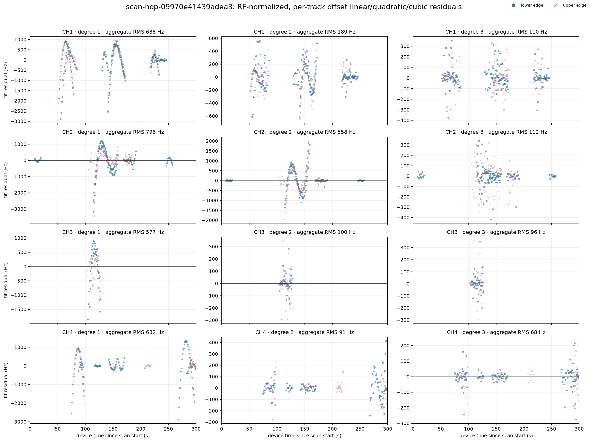

Aggregate descriptive residual RMS is:

| Channel | Linear | Quadratic | Cubic |
|---:|---:|---:|---:|
| CH1 | 687.6 Hz | 189.5 Hz | 109.6 Hz |
| CH2 | 796.0 Hz | 557.7 Hz | 111.7 Hz |
| CH3 | 576.7 Hz | 99.6 Hz | 95.7 Hz |
| CH4 | 681.9 Hz | 90.7 Hz | 67.6 Hz |

The large linear residuals show that one constant Doppler rate is insufficient
over many supports. CH1 and especially CH2 retain material cubic structure
beyond a quadratic; CH3 and CH4 are already described well by quadratics on
much of this scan. The appropriate interpretation is local: a low-curvature arc
can belong to a longer curved trajectory even when its own BIC prefers a line or
quadratic.

The plotted marker opacity does **not** encode signal strength. Lower-channel
markers that appear fainter are a rendering distinction among edge/receiver
series, not evidence of a worse RF link. Signal-quality comparisons should use
GLRT margin, retained-window count, residual RMS, and receiver corroboration.

## 2. Consolidating receiver and lower/upper evidence

Propagation Doppler scales with carrier frequency. Every observation is first
placed in a common coordinate:

\[
\widetilde f_i(t)=f_i(t)\frac{11.2\ \mathrm{GHz}}{f_{\mathrm{RF},i}}.
\]

The shared model then learns one fixed nuisance offset per source segment:

\[
\widetilde f_i(t)=b_i+g(t)+\epsilon_i(t).
\]

The offset absorbs receiver/LNB bias, acquisition gauge, and alias-lift choices;
the derivative terms in `g(t)` carry the comparable Doppler shape. This is the
same treatment used when merging upper and lower evidence and when testing a
cross-channel join.

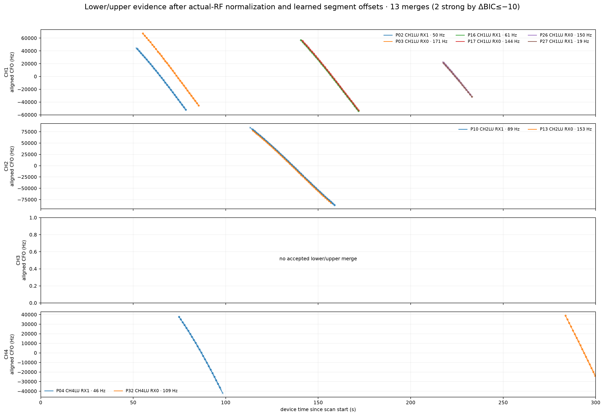

Thirteen lower/upper relationships pass the exploratory gates, including two
with shared-minus-independent BIC at or below −10. No CH3 lower/upper merge is
accepted. This is evidence-dependent, not a claim that CH3 has no shared
physical path.

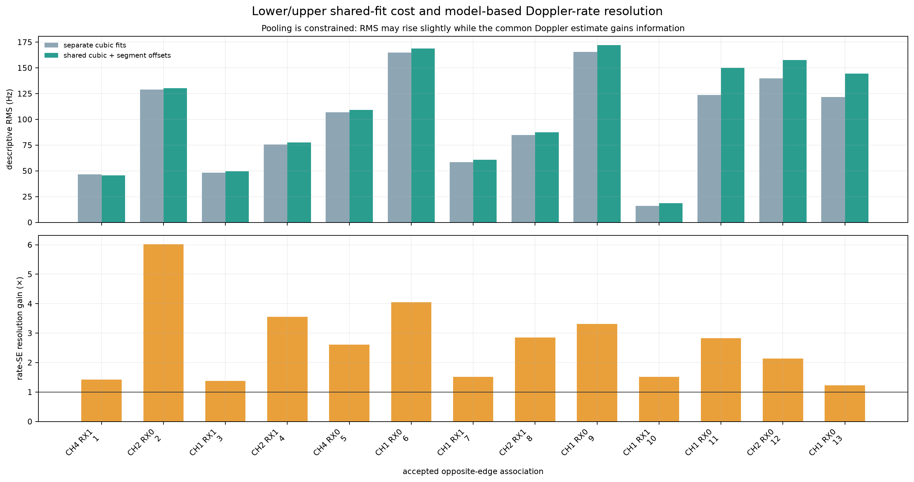

The accepted merges improve median Doppler-rate standard error by 2.61×. That
is the principal resolution benefit of combining the two RF edges: more support
constrains the derivative without pretending that their absolute CFO offsets
must match.

The exploratory merge gates were:

- at least 5 s overlapping support;
- no more than 100 Hz/s instantaneous normalized-rate disagreement;
- shared RMS no greater than 450 Hz;
- shared RMS no greater than twice independent RMS; and
- shared-minus-independent BIC no greater than 60.

These gates were selected during exploration and should be preregistered on a
future validation corpus before detection-rate claims are made.

## 3. Cross-channel association

The one-channel-at-a-time working model permits a join only when channel
episodes are sequential: at most 4 s apart, with no more than 1.05 s boundary
overlap. The absolute CFO intercept is free for each episode; only the
RF-normalized time-dependent shape is shared.

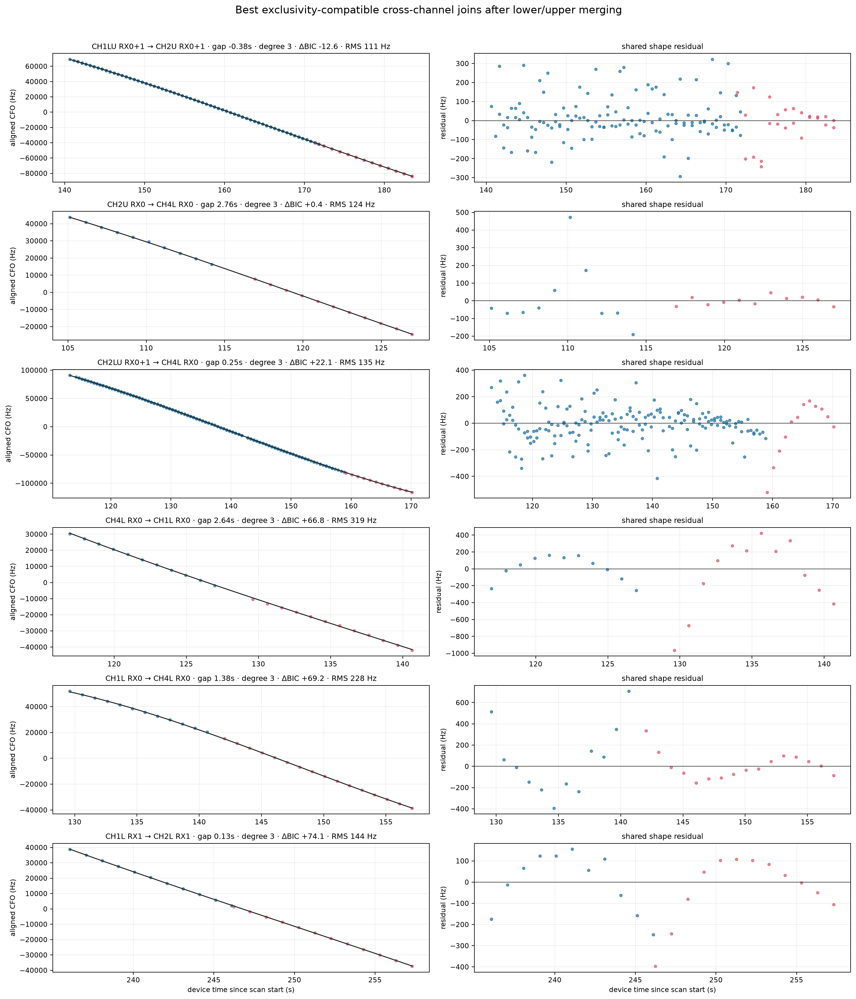

Of 11 exclusivity-compatible hypotheses, only one meets both RF support gates:
shared-minus-independent BIC at or below −10 and shared-to-independent RMS ratio
at or below 1.25.

| Segment | Channel / receivers | Support |
|---|---|---:|
| Left | CH1LU RX0+1 | 140.656–171.797 s |
| Right | CH2U RX0+1 | 171.421–183.478 s |
| Combined | CH1 → CH2 | 140.656–183.478 s |

| Model | Shared RMS | Separate RMS | Shared − separate BIC |
|---|---:|---:|---:|
| Linear | 723.2 Hz | 716.9 Hz | −2.4 |
| Quadratic | 545.0 Hz | 211.8 Hz | +271.7 |
| Cubic | 111.4 Hz | 110.5 Hz | **−12.6** |

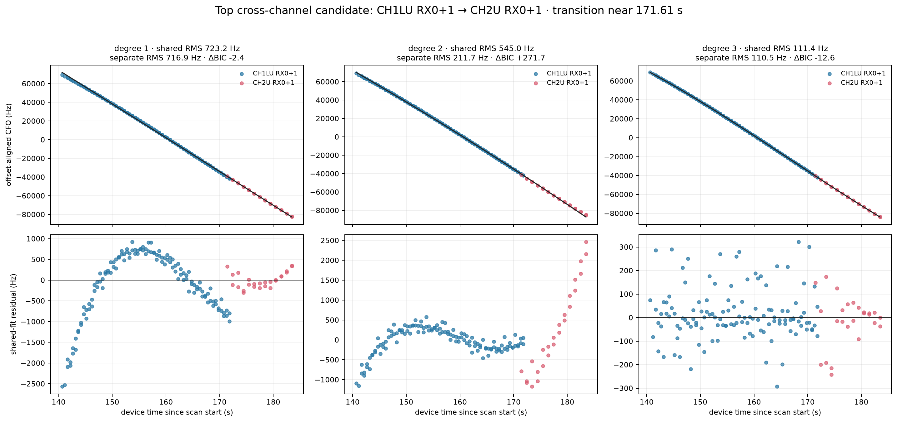

The cubic is not merely smoothing a frequency step: each segment retains its
own fixed offset, and the shared rate, acceleration, and jerk explain the
combined shape almost as well as independent cubics with fewer parameters. Both
receivers corroborate both sides. This is strong RF association evidence, but
it is still compatible with two satellites on similar local trajectories.

## 4. Causal TLE method

The RF shortlist was compared with SGP4 line-of-sight range-rate predictions at
11.2 GHz for the Spinnaker/Sausalito observer at latitude 37.858988°, longitude
−122.478103°, altitude −29 m.

The search protocol was:

1. admit only Starlink elements whose TLE epoch precedes recording support;
2. use the pre-recording 11,087-element snapshot;
3. use a coarse horizon screen, leaving about 493–504 plausible objects per
   cross-channel join and 796 across the scan;
4. allow one fixed frequency offset per RF tracklet, but no fitted Doppler
   scale, slope, acceleration, or jerk correction;
5. search one shared epoch-time adjustment `τ` from −5 to +5 s in 0.25 s
   increments; and
6. select using the first 60% of each source tracklet, reserving the final 40%
   for held-out scoring.

The epoch adjustment is deliberately small and bounded. It absorbs the dominant
along-track timing manifestation of TLE error without giving the orbit model a
free polynomial that could mimic the measurement. A boundary-selected `τ`
would be a warning sign; the leading candidates here are generally interior.

## 5. Cross-channel causal-TLE result

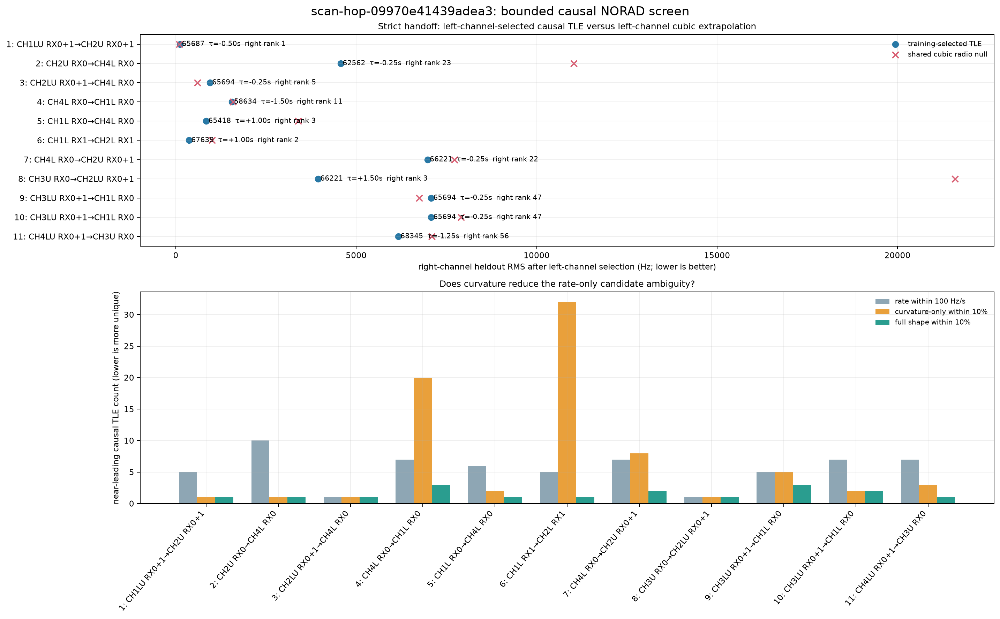

For the RF-supported CH1→CH2 hypothesis, the training winner is
STARLINK-34856 / NORAD 65687:

| Diagnostic | Result |
|---|---:|
| TLE element epoch | 2026-09-06 07:02:44.567 UTC |
| Element age at observation | 68,381 s (about 19.0 h) |
| Best `τ` | −0.75 s; not at bound |
| Training RMS | 109.4 Hz |
| Training runner-up gap | 259.2 Hz |
| Held-out RMS / rank | 138.4 Hz / 1 |
| Full-shape RMS / near-tie count | 112.6 Hz / 1 |
| Curvature-only RMS / near-tie count | 107.7 Hz / 1 |
| Rate error / near-tie count | 1.39 Hz/s / 5 |
| Held-out linear / quadratic / cubic | 2248.3 / 1307.6 / 153.2 Hz |

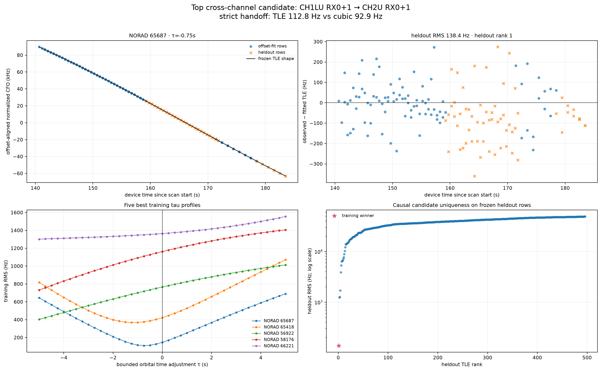

Curvature materially helps here: rate alone leaves five near ties, while the
full derivative shape leaves one. The same object wins training, held-out,
full-shape, and curvature-only rankings. The TLE also narrowly improves over the
held-out cubic when both channel segments participate.

The stricter handoff test prevents an identity claim. It fits the object and
offset using only CH1, then predicts the final 60% of CH2:

| Right-segment predictor | RMS |
|---|---:|
| STARLINK-34856 TLE learned from left segment | 112.8 Hz |
| Cubic learned from left segment | **92.9 Hz** |

The TLE remains rank one on the right, but it does not beat the RF-only cubic.
The cross-channel non-abstaining count is therefore zero.

## 6. All single-channel candidates

The same causal protocol was applied to all 24 independent channel episodes,
not only the cross-channel shortlist.

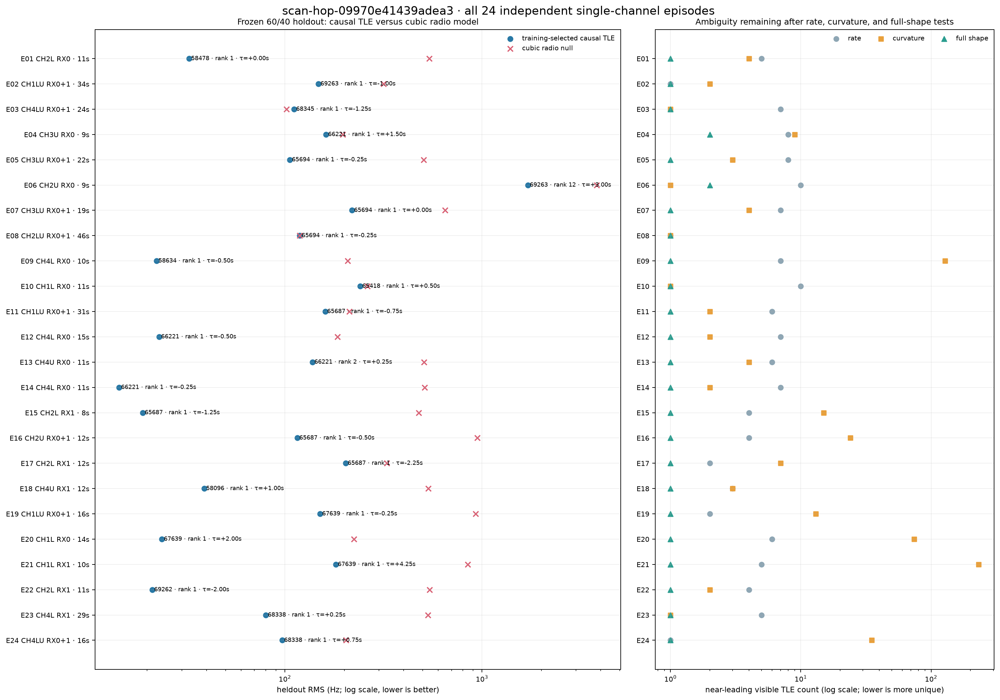

Twelve episodes pass the provisional screen and collapse to seven catalogue
families:

| NORAD | Satellite | Episodes | Approximate support | Interpretation |
|---:|---|---|---:|---|
| 58478 | STARLINK-30990 | E01 | 8.17–19.21 s | Provisional short-arc candidate |
| 69263 | STARLINK-37502 | E02 | 51.73–85.41 s | Cubic arc; curvature near-tie count 2 |
| 65687 | STARLINK-34856 | E11, E15, E16, E17 | 140.66–191.00 s | Repeated strongest family; includes cross-channel candidate |
| 58096 | STARLINK-30581 | E18 | 206.82–218.87 s | Provisional short-arc candidate |
| 67639 | STARLINK-36595 | E19, E20 | 217.49–242.09 s | Mostly rate-driven; curvature remains ambiguous |
| 69262 | STARLINK-37503 | E22 | 246.24–257.30 s | Curvature near-tie count 2 |
| 68338 | STARLINK-36254 | E23, E24 | 267.59–299.77 s | E23 is highly curvature-specific |

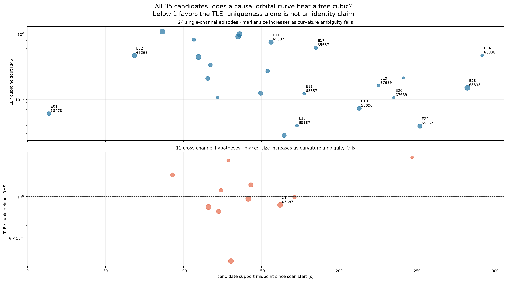

Across the 24 single-channel episodes:

- 22 training winners retain held-out rank one;
- 22 TLE models beat the corresponding held-out cubic;
- the median number of near ties is 5.5 by rate, 3.5 by curvature, and 1 by
  full shape; and
- curvature leaves exactly one near-tie candidate for 5 episodes and no more
  than two for 10 episodes.

These rates are discovery diagnostics, not calibrated false-alarm
probabilities. The 12 provisional passes were selected from 24 episodes against
a dense catalogue, and several episodes from the same time neighborhood are
not independent.

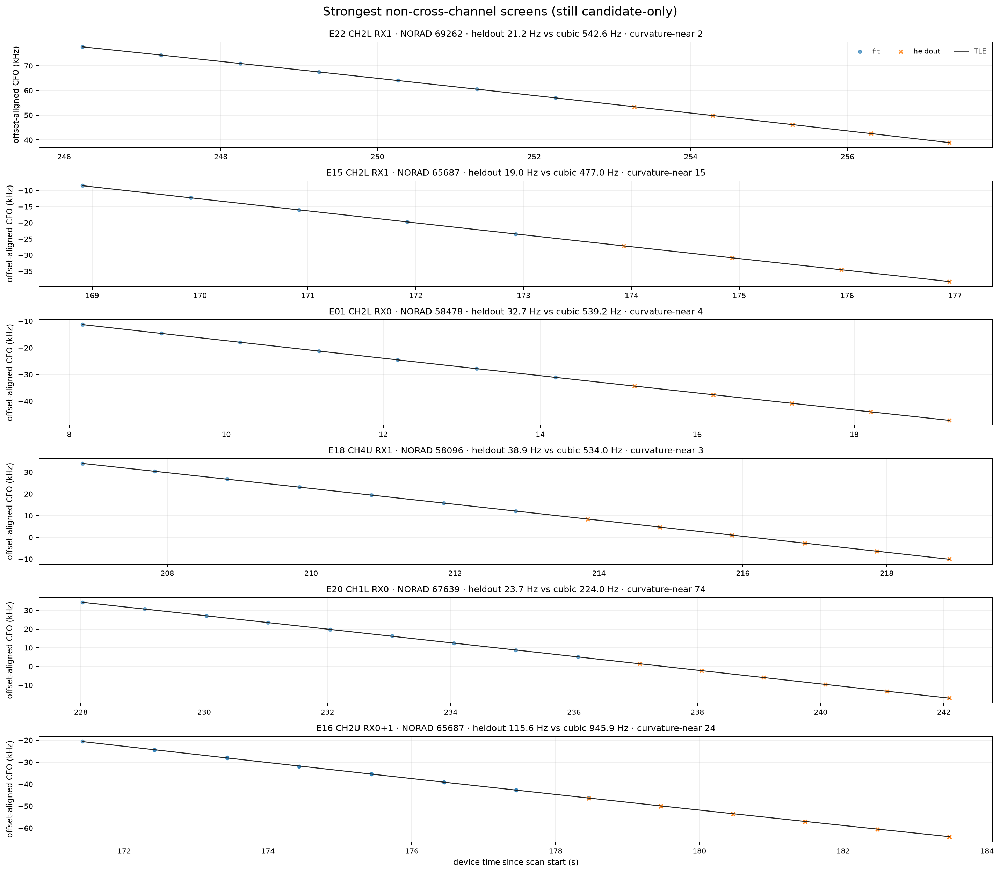

## 7. When cubic curvature helps identification

Six of the 24 episode holdouts are best predicted by a local cubic rather than a
linear or quadratic:

| Episode | TLE candidate | Linear | Quadratic | Cubic | TLE | Curvature effect |
|---|---|---:|---:|---:|---:|---|
| E02 | STARLINK-37502 | 2517.8 | 803.9 | **315.9** | 148.0 | Rate already unique; curvature leaves 2 near ties |
| E03 | STARLINK-37214 | 2876.2 | 164.0 | **101.7** | 111.4 | Cubic slightly beats TLE; no catalogue claim |
| E08 | STARLINK-35204 | 2158.4 | 2536.8 | **118.7** | 118.8 | Effective tie; no catalogue claim |
| E11 | STARLINK-34856 | 2772.9 | 1403.7 | **212.6** | 160.1 | Rate leaves 6; curvature leaves 2 |
| E17 | STARLINK-34856 | 932.3 | 486.5 | **329.1** | 203.4 | Curvature increases catalogue ambiguity |
| E23 | STARLINK-36254 | 4317.4 | 844.3 | **532.1** | 80.0 | Rate leaves 5; curvature isolates 1 |

All residuals are Hz. The most useful curvature evidence is E11 and E23. E23 is
the clearest example: over a 29.15 s arc, the TLE predicts held-out data at
80.0 Hz versus 532.1 Hz for the cubic, and curvature reduces five rate-near-ties
to one. E03 looks orbital but the empirical cubic slightly outpredicts the TLE.
E08 is a statistical tie. E17's cubic improvement is weaker under full-data BIC
and does not make catalogue identity more unique.

Thus, an extra cubic term helps identity only when it is held out, physically
consistent, and catalogue-specific. Lower residual alone is not enough.

## 8. Epoch-time adjustment and the local PNT literature

The local *Unveiling Starlink for PNT* paper describes correcting temporal and
orbital TLE/SGP4 errors but does not prescribe a numerical bound for a scalar
epoch-time search. The related 2024 ephemeris-correction work estimates orbital
state and clock terms rather than using a bounded `τ` grid, and evaluates TLE
ages of 2, 10, and 20 hours.

The follow-up paper, *Modeling and Compensation of Timing and Spatial Ephemeris
Errors of Non-Cooperative LEO Satellites with Application to PNT*, gives the
closest numerical analogue: an equivalent epoch-time adjustment studied over
0–5 s. Its reported experimental estimates are approximately 0.94–1.74 s for
three Starlink spacecraft and 4.01–4.23 s for two OneWeb spacecraft, with
carrier- and Doppler-derived estimates differing by about 9.6–26.3 ms.

Our symmetric ±5 s search therefore uses the same maximum magnitude while
allowing either sign because the direction of the catalogue timing error is not
known a priori. For future preregistered Starlink analysis, ±2 s is a sensible
primary range and ±5 s a declared sensitivity range. The current leading
STARLINK-34856 value of −0.75 s is comfortably interior to either range.

Primary references:

- Joe Khalife et al., [Ephemeris Error Correction for Tracking Non-Cooperative
  LEO Satellites with Pseudorange Measurements](https://people.engineering.osu.edu/media/document/2024-03-13/kassas_ephemeris_error_correction_for_tracking_non_cooperative_leo_satellites_with_pseudorange_measurements.pdf).
- Joe Khalife et al., [Modeling and Compensation of Timing and Spatial
  Ephemeris Errors of Non-Cooperative LEO Satellites with Application to
  PNT](https://people.engineering.osu.edu/media/document/2024-12-05/kassas_modeling_and_compensation_of_timing_and_spatial_ephemeris_errors_of_non_cooperative_leo_satellites_with_application_to_pnt.pdf).

## Limitations and claim boundary

- Thresholds and merge gates were developed during exploration on this scan;
  they are not a preregistered detector.
- TLE scoring searches many visible objects, track episodes, and time shifts;
  rank one is not itself a calibrated probability of identity.
- Short CFO arcs can be locally similar for multiple satellites in the same
  constellation shell.
- A per-tracklet fixed offset is physically necessary but removes absolute CFO
  as an identity constraint.
- The one-channel-at-a-time assumption is a working RF model, not established
  transmitter doctrine. Simultaneous same-satellite multi-channel transmission
  would require a different association graph.
- SGP4/TLE error is represented here by one shared scalar time adjustment; no
  orbit-state refinement is performed.
- The strict cross-channel handoff fails, so neither STARLINK-34856 identity nor
  the CH1→CH2 switch is confirmed.

## Recommended next work

1. Freeze the current RF gates, candidate protocol, and ±2 s primary / ±5 s
   sensitivity time ranges before examining an independent scan.
2. Repeat causal TLE holdout and strict left-to-right handoff on many archived
   300 s scans; report candidate-level false discovery rather than selected
   examples.
3. Require repeat observations of the same NORAD object at its predicted pass
   times, with receiver and lower/upper corroboration.
4. Add uncertainty propagation from fractional CFO windows through rate,
   acceleration, jerk, and TLE scores.
5. Test the one-channel-at-a-time assumption separately from trajectory fitting;
   do not force simultaneous channel evidence into a switch model.
6. Consider orbit-state refinement only after the bounded-time model is
   independently validated, and keep those added degrees of freedom out of the
   RF discovery stage.

## Reproducibility artifacts

The report directory contains every figure and the complete machine-readable
results used here:

- [RF trajectory analysis](figures/2026_09_07_scan_09970e_trajectory_tle_review/analysis.json)
- [Cross-channel TLE analysis](figures/2026_09_07_scan_09970e_trajectory_tle_review/tle-match.json)
- [All-candidate TLE analysis](figures/2026_09_07_scan_09970e_trajectory_tle_review/tle-match-all-candidates.json)
- [Figure 1](figures/2026_09_07_scan_09970e_trajectory_tle_review/01-linear-quadratic-cubic-residuals.png)
- [Figure 2](figures/2026_09_07_scan_09970e_trajectory_tle_review/02-upper-lower-merged-tracks.png)
- [Figure 3](figures/2026_09_07_scan_09970e_trajectory_tle_review/03-upper-lower-rms-resolution.png)
- [Figure 4](figures/2026_09_07_scan_09970e_trajectory_tle_review/04-cross-channel-join-candidates.png)
- [Figure 5](figures/2026_09_07_scan_09970e_trajectory_tle_review/05-top-candidate-model-orders.png)
- [Figure 6](figures/2026_09_07_scan_09970e_trajectory_tle_review/06-all-cross-channel-tle-checks.png)
- [Figure 7](figures/2026_09_07_scan_09970e_trajectory_tle_review/07-top-cross-channel-tle-detail.png)
- [Figure 8](figures/2026_09_07_scan_09970e_trajectory_tle_review/08-all-single-channel-tle-checks.png)
- [Figure 9](figures/2026_09_07_scan_09970e_trajectory_tle_review/09-all-candidate-tle-summary.png)
- [Figure 10](figures/2026_09_07_scan_09970e_trajectory_tle_review/10-best-single-channel-tle-details.png)

This publication changes no scanner, analyzer, service, FPGA, or firmware code.
It adds only this report and its evidence artifacts.
