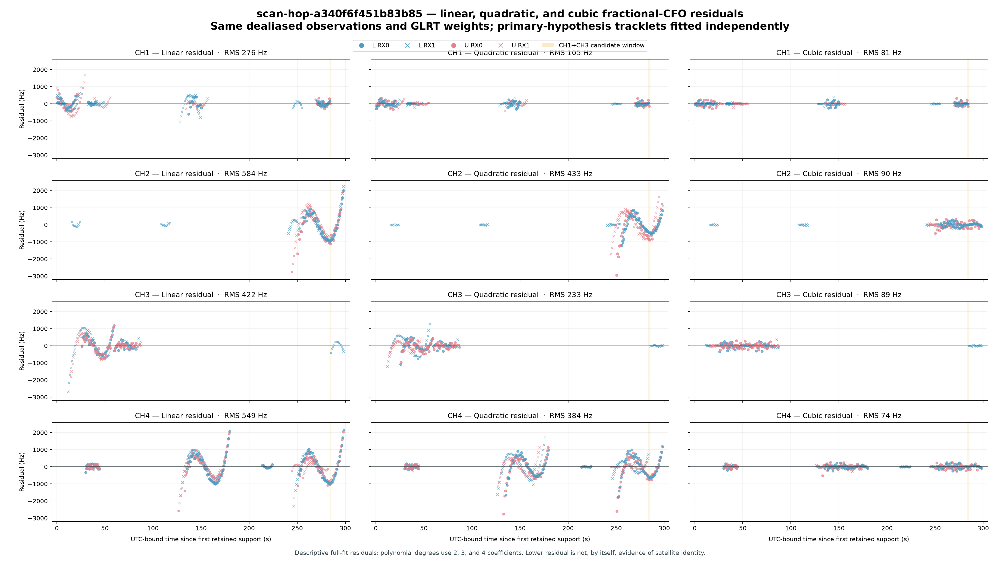
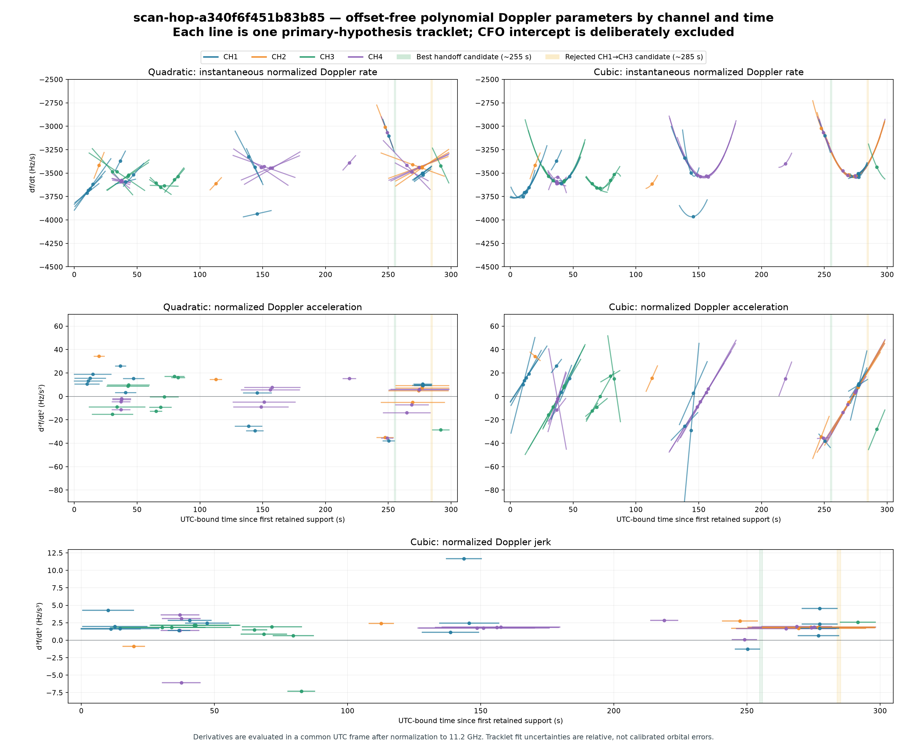
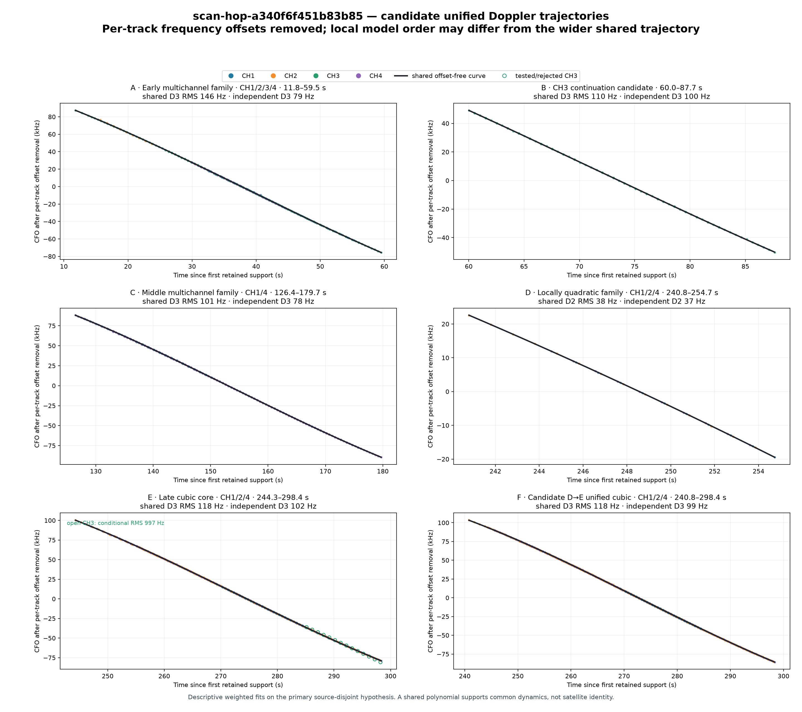
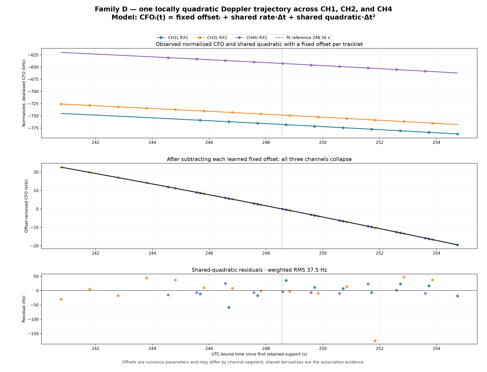
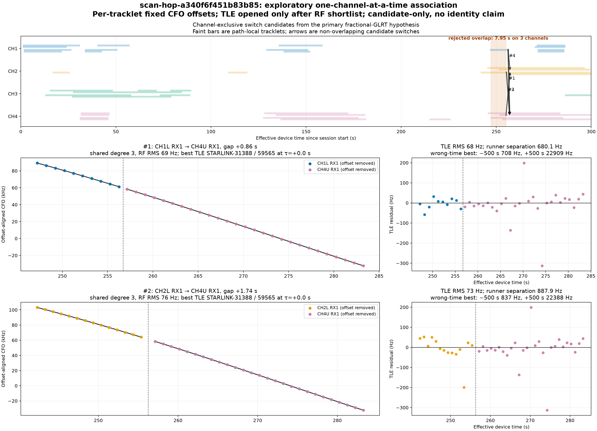
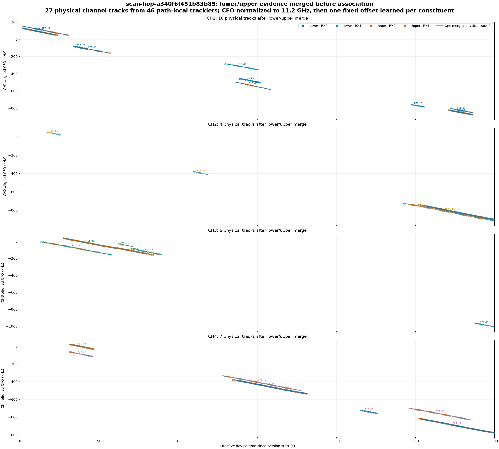
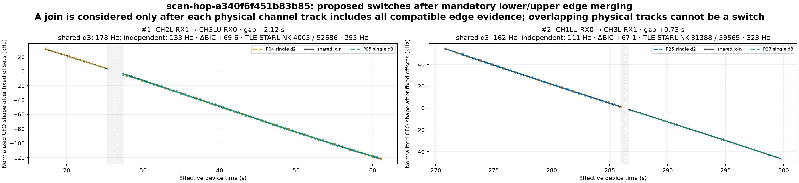

# Long-scan fractional-GLRT trajectory and TLE review

**Date:** 2026-09-07 UTC

**Session:** `scan-hop-a340f6f451b83b85`

**Report base:** `origin/main` at `34aceeeb997ae67fe785dd97157b1f471c35291f`

**Claim boundary:** candidate-only research analysis; no satellite identity or
channel switch is claimed

## Executive conclusion

The 300 s scan is a strong acquisition and trajectory dataset: it is complete,
continuous, 95.5279% valid-duty, and all 2,389 visits have complete fractional
GLRT/CFO analysis. Cubic local models describe many retained CFO paths to roughly
74–90 Hz aggregate RMS by channel, substantially better than a single linear or
quadratic model over the same path-local support.

The scan does **not** provide compelling evidence that one satellite switched
Starlink channels. An early analysis found attractive shared Doppler shapes and
four apparently strong late transitions, all matching STARLINK-31388 / NORAD
59565 at 68–78 Hz descriptive RMS. That interpretation was invalidated when the
lower and upper pilot-edge evidence of each physical channel was correctly
merged before cross-channel association.

After RF-frequency normalization and lower/upper merging:

- 46 primary path-local tracklets reduce to 27 physical channel tracks through
  19 accepted edge merges;
- the late CH2 track spans 242.309–299.624 s;
- the late CH4 track spans 246.071–284.788 s;
- those CH2 and CH4 tracks overlap for 38.716 s and therefore cannot form a
  sequential channel switch under the one-channel-at-a-time working model; and
- only two temporal joins remain, both strongly disfavored relative to separate
  fits (shared-minus-independent BIC of +69.6 and +67.1) and with much weaker
  descriptive TLE residuals of 295 Hz and 323 Hz.

The scientifically defensible outcome is therefore **abstain**: the scan contains
real, smooth, repeatable receiver-relative Doppler structure, but no secure
channel-switch event and no secure Starlink identity.

## Capture and evidence authority

| Quantity | Value |
|---|---:|
| Capture start | 2026-09-06 22:00:08.207544 UTC |
| Finalized | 2026-09-06 22:05:13.715861 UTC |
| Radio | `radio_pluto_5d4d` |
| Nominal duration | 300 s |
| Sample rate / RF bandwidth | 2.5 MS/s / 2.5 MHz |
| Valid dwell per visit | 120 ms |
| RF targets | CH1L, CH2L, CH3L, CH4L, CH1U, CH2U, CH3U, CH4U |
| Visits | 2,389 |
| Valid duty | 95.5279% |
| Continuity | attested; capture qualified |
| Fractional GLRT/CFO analysis | complete, 2,389 / 2,389 visits |
| Source probes | 4,778; all non-overlapping |
| Passing fractional candidates | 4,337 |
| Production trajectory tracklets | 50 |
| Production trajectory hypotheses | 5 |
| Primary source-disjoint tracklets used here | 46 |

The sealed production tracking manifest has content digest
`sha256:2a3c8f0cea6c98623d1859496c1681113453f93ac608d4b0f4ab8bf7477e99d5`.
It requires fractional epochs, declares `candidate_only=true` and
`identity_claimed=false`, and published no TLE candidate.

The causal catalogue snapshot contains 10,721 objects and has digest
`sha256:3731f8400c38676251fc726cee5863b425b948213538114541f4724ceca6c9d0`.
Catalogue contents were not used to construct the RF tracklets or the RF-only
transition shortlist.

## Analysis sequence

```mermaid
flowchart LR
    A[Sealed 300 s scan] --> B[Fractional GLRT64 CFO candidates]
    B --> C[Alias-aware path-local tracklets]
    C --> D[Normalize each CFO to 11.2 GHz]
    D --> E[Fit linear / quadratic / cubic local shapes]
    E --> F[Merge compatible lower + upper edge evidence]
    F --> G[Enforce non-overlapping cross-channel switches]
    G --> H[Freeze RF shortlist]
    H --> I[Screen causal TLE snapshot]
    I --> J[Identity or switch abstention]
```

The essential ordering is that lower/upper evidence is merged **before** a
cross-channel transition can be proposed. Reversing those operations produced
the false late-scan transition candidates documented below.

## Approaches tried

| Approach | Purpose | Result | Disposition |
|---|---|---|---|
| Fractional GLRT64 epochs | Remove integer-epoch CFO bumps and retain sub-sample timing | 4,337 passing candidates from 4,778 probes | Keep; required input |
| Alias-aware path-local lines | Separate smooth CFO paths without naming satellites | 50 production tracklets; 46 in the primary source-disjoint hypothesis | Keep as local evidence |
| Independent degree 1/2/3 fits | Determine whether local Doppler curvature is resolved | Cubic strongly lowers descriptive residuals on this scan | Keep, with complexity control |
| Offset-free derivative comparison | Compare rate, acceleration, and jerk across channels without requiring equal CFO intercepts | Several channels show similar local dynamics | Useful shortlist evidence, not identity |
| Shared polynomial with fixed per-segment offsets | Test whether disjoint segments can share one Doppler shape | Family D reaches 37.5 Hz weighted RMS | Mathematically strong but physically ambiguous |
| One-channel-at-a-time temporal joins | Reject simultaneous channels as a single switching satellite | Initially produced four strong late alternatives | Necessary, but initially applied too early |
| Causal TLE shape screening | Compare frozen RF hypotheses with visible catalogue objects | Initial four alternatives chose NORAD 59565 | Descriptive only; not unique identity evidence |
| RF-normalized lower/upper merge | Treat both pilot edges as one physical-channel observation | 46 tracklets become 27 physical tracks | Mandatory correction |
| Exclusivity after edge merge | Re-evaluate channel switches using complete channel support | Initial late candidates disappear; two weak joins remain | Correct current result: abstain |

## 1. Polynomial model order

Each primary path-local tracklet was robustly fit independently with linear,
quadratic, and cubic CFO models using the same dealiased fractional observations
and bounded GLRT-margin weights.

Aggregate descriptive residual RMS by channel was:

| Channel | Linear | Quadratic | Cubic |
|---:|---:|---:|---:|
| CH1 | 276 Hz | 105 Hz | 81 Hz |
| CH2 | 584 Hz | 433 Hz | 90 Hz |
| CH3 | 422 Hz | 233 Hz | 89 Hz |
| CH4 | 549 Hz | 384 Hz | 74 Hz |

This shows that curvature is resolved over many local supports. It does not mean
that every track should always be cubic: a shorter or low-curvature interval may
prefer a linear or quadratic model under BIC. Nor are these held-out identity
scores; they are descriptive fits to retained track-local support.

## 2. Comparing trajectories without their CFO intercepts

The same satellite need not have the same receiver-relative CFO intercept after a
retune or channel change. The useful comparison quantities are the time
derivatives of the normalized trajectory: rate for a linear model, rate and
acceleration for a quadratic model, and rate, acceleration, and jerk for a cubic
model.

The parameter comparison exposed several plausible dynamic neighborhoods. It
also showed why rate agreement alone is insufficient: different paths can cross
the same rate while having incompatible acceleration or temporal support.

## 3. Shared multi-channel trajectory families

We next allowed every tracklet to learn a fixed CFO offset while sharing one
linear, quadratic, or cubic time-dependent shape:

\[
y_i(t)=b_i+g(t)+\epsilon_i(t),
\]

where `b_i` is a nuisance offset for segment `i` and `g(t)` is the shared
Doppler-like polynomial. This produced several visually persuasive families.

Family D was the clearest local example. CH1, CH2, and CH4 collapsed onto a
shared quadratic after separate offsets were removed, with 37.5 Hz weighted RMS.

The fit establishes common local dynamics, not common satellite identity. All
three segments occupy the same 240.8–254.7 s interval. Under the working model
that one satellite occupies one downlink channel at a time, Family D cannot be a
single satellite switching among CH1, CH2, and CH4. It may instead reflect
multiple satellites with similar geometry, a receiver/LNB systematic, duplicated
or aliased evidence, or a limitation of the one-channel-at-a-time model.

## 4. First exclusivity and TLE attempt

The first channel-exclusive prototype rejected cross-channel overlaps larger than
1.05 s, allowed transition gaps up to 4 s, learned a fixed CFO offset per
tracklet, froze an RF-only shortlist, and only then screened visible objects from
the causal TLE snapshot. It produced four strong-looking late alternatives:

| Rank | Proposed transition | Gap | Shared RF RMS | Best descriptive TLE RMS |
|---:|---|---:|---:|---:|
| 1 | CH1L RX1 → CH4U RX1 | 0.861 s | 69 Hz | 68 Hz |
| 2 | CH2L RX1 → CH4U RX1 | 1.740 s | 76 Hz | 73 Hz |
| 3 | CH4U RX1 → CH2L RX1 | 2.240 s | 72 Hz | 77 Hz |
| 4 | CH1L RX1 → CH2L RX1 | 1.112 s | 72 Hz | 78 Hz |

All four selected STARLINK-31388 / NORAD 59565 at nominal catalogue time. They
were mutually incompatible alternatives, not four detected switches. The first
prototype also showed strong wrong-time degradation for these late alternatives,
which established time specificity but still did not establish which RF segment,
if any, belonged to the object.

This approach contained a structural error: lower and upper pilot-edge
tracklets were permitted to act as separate physical tracks. A lower-edge
fragment could therefore appear to end just before an upper-edge fragment began,
even when both were evidence for one continuing channel-level track.

## 5. Differential-Doppler correction and edge merging

For propagation Doppler, frequency shift is proportional to RF carrier
frequency. The deployed trajectory input already normalizes each observation to
the declared 11.2 GHz reference:

\[
\widetilde f_i(t)=f_i(t)\frac{11.2\ \mathrm{GHz}}{f_{\mathrm{RF},i}}.
\]

Equivalently, in the unnormalized coordinate a shared physical trajectory has
the form

\[
f_i(t)=b_i+\frac{f_{\mathrm{RF},i}}{11.2\ \mathrm{GHz}}g(t)+\epsilon_i(t).
\]

The correction uses the actual lower or upper RF center for every observation.
Because RF normalization does not remove receiver, LNB, acquisition-gauge, or
alias-lift biases, the merged fit still learns one fixed nuisance offset per
constituent path-local tracklet.

The exploratory edge merge required:

- the same Starlink channel and receiver;
- opposite lower/upper edges;
- at least 5 s overlapping support;
- no more than 100 Hz/s instantaneous normalized-rate disagreement;
- shared-fit RMS no greater than 450 Hz or twice the independent RMS; and
- shared-minus-independent BIC no greater than 60.

It also prohibited a merged physical track from containing two substantially
overlapping paths from the same edge. These are exploratory gates selected after
inspection, not preregistered discovery thresholds.

The correction merges 19 edge relationships and reduces 46 primary tracklets to
27 physical channel tracks. The most important late tracks are:

| Physical track | Support | Constituents | Shared model | RMS |
|---|---:|---:|---:|---:|
| CH2LU RX1 | 242.309–299.624 s | lower + upper + lower | cubic | 85.3 Hz |
| CH4LU RX1 | 246.071–284.788 s | upper + lower + upper | cubic | 52.8 Hz |
| CH2LU RX0 | 251.853–299.624 s | upper + lower | cubic | 177.1 Hz |
| CH4LU RX0 | 252.103–299.876 s | upper + lower | cubic | 138.3 Hz |
| CH1LU RX1 | 271.826–285.930 s | upper + lower | cubic | 24.2 Hz |

This continuous CH2/CH4 support eliminates all four initial late switch
alternatives. In particular, CH2LU RX1 and CH4LU RX1 overlap by 38.716 s; CH1L
RX1 at 247.198–256.272 s also overlaps the already-active CH4 physical track.

## 6. Corrected channel-switch result

Only two exclusivity-compatible temporal joins survive after mandatory edge
merging:

| Rank | Proposed transition | Gap | Shared RMS | Independent RMS | ΔBIC | Descriptive TLE |
|---:|---|---:|---:|---:|---:|---|
| 1 | CH2L RX1 → CH3LU RX0 | 2.116 s | 177.8 Hz | 133.4 Hz | +69.6 | STARLINK-4005 / 52686, 294.6 Hz, τ = −3 s |
| 2 | CH1LU RX0 → CH3L RX1 | 0.731 s | 162.4 Hz | 110.6 Hz | +67.1 | STARLINK-31388 / 59565, 323.1 Hz, τ = −5 s |

Both shared models fit materially worse than allowing the two physical tracks to
remain independent. Their very large positive ΔBIC values are strong evidence
against the proposed join. The second result also reaches the tested epoch-search
boundary. These TLE scores use the same observations that select the nuisance
offsets and catalogue candidate, so they are descriptive screening values, not
held-out identification evidence.

The corrected analysis therefore has **zero convincing channel switches**.

## What the scan supports

Supported by this analysis:

- complete 300 s, high-duty acquisition across eight channel-edge targets;
- fractional-epoch GLRT response on every visit;
- real multi-second, alias-aware CFO paths;
- resolved local curvature that often benefits from cubic models;
- consistent lower/upper edge dynamics after actual-RF normalization; and
- a useful abstention-capable workflow for rejecting false channel transitions.

Not supported:

- a unique physical emitter for every smooth path;
- a confirmed satellite changing Starlink channels;
- simultaneous same-satellite transmission on several channels;
- a secure NORAD identity;
- phase continuity across retunes; or
- an absolute calibrated frequency reference.

## Recommended production approach

The production association graph should use the following hierarchy:

1. Preserve every raw, fractional, dealiased observation and its actual RF.
2. Normalize the dynamic CFO term to one declared canonical RF.
3. Construct path-local tracklets without catalogue information.
4. Merge compatible lower/upper evidence for the same physical channel before
   proposing any channel transition.
5. Retain separate fixed offsets for distinct edge/receiver/path segments; do not
   require equal CFO intercepts.
6. Represent cross-channel switches as mutually exclusive hypotheses in a
   temporal DAG. Reject transitions whose complete physical-channel supports
   overlap beyond the revisit-time tolerance.
7. Freeze the RF hypothesis set before opening a causal TLE snapshot.
8. Select nuisance parameters and object identity on a training interval, then
   score untouched chronological support and wrong-time controls.
9. Abstain whenever simultaneous alternatives share one TLE shape or the shared
   trajectory loses to independent fits.

Before promotion, component-owned tests should prove:

- invariance of recovered Doppler shape across lower/upper RF scaling;
- correct merging of compatible opposite-edge fragments;
- rejection of incompatible edge slopes and overlapping same-edge paths;
- elimination of the four false late transitions in this frozen replay;
- preservation of genuinely sequential synthetic channel switches; and
- identity abstention when several simultaneous tracks match one orbital shape.

Additional discriminators are required for stronger identity: decoded or
repeatable frame/pilot fingerprints, polarization or receiver-consistency
evidence, power/phase continuity where hardware permits, and recurrence across
independent adjacent scans.

## Limitations

- The 27 physical tracks and two corrected joins are exploratory products, not
  published production contracts.
- Edge-merge gates were chosen after examining this scan and require frozen
  multi-scan validation.
- Per-tracklet offsets deliberately discard absolute CFO information and can
  make unrelated trajectories look more similar.
- Polynomial residuals are descriptive full-fit residuals; lower cubic error is
  not an independent model-validation result.
- The exploratory TLE screen is in-sample and searches object identity and epoch
  offset. It cannot support a discovery claim.
- Receiver/LNB clock behavior is not independently calibrated here.
- The one-channel-at-a-time rule is the current physical working model. It is a
  useful falsifiable constraint, not proof of Starlink transmitter hardware
  capability.

## Reproducibility artifacts

- [Initial channel-exclusive transition summary](figures/2026_09_07_scan_a340_trajectory_review/initial-exclusive-switch-analysis.json)
- [Corrected RF-normalized edge-merged summary](figures/2026_09_07_scan_a340_trajectory_review/edge-merged-channel-analysis.json)
- [Post-refill upper/lower synchronization and switching replay](2026_08_27_post_refill_edge_switching.md)
- [Starlink downlink and known-pilot evidence boundary](../docs/concepts/starlink-transmissions.md)

All capture, analysis, tracking, and TLE stores were opened read-only. This
report changes documentation and report-owned figures only; it makes no scanner,
firmware, FPGA, service, database, or sealed-product change.
