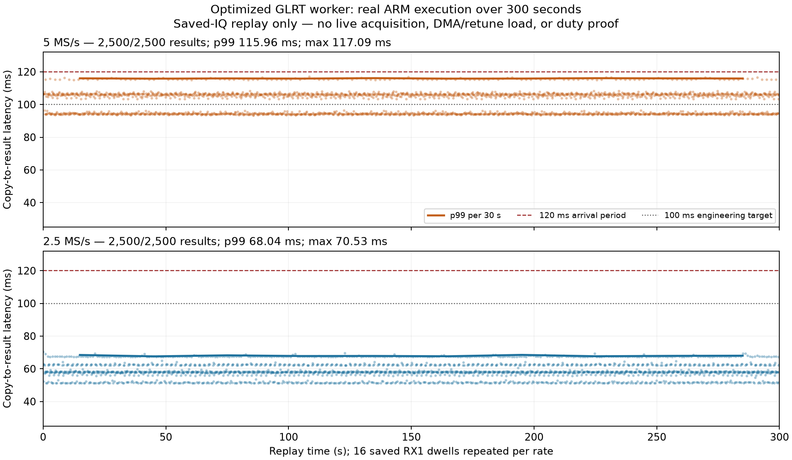

# RX1 GLRT: optimized ARM worker, 300-second replay

2026-09-08. Implementation commit `4544f0dc`. **Not deployed; unchanged live
scanner duty remains unverified.** No RF was collected. No FPGA, kernel,
flashed firmware, production daemon or installed library was changed.

## Outcome

The optimized worker completes a real **300-second saved-IQ replay at each
scanner rate**, with one full 120 ms RX1 dwell arriving every 120 ms. Both runs
deliver **2,500/2,500 results**, with zero drops/skips and desktop numerical
agreement. Every observed copy-to-result latency is below 120 ms.

| Optimized worker, 300 s | 2.5 MS/s | 5 MS/s |
| --- | ---: | ---: |
| Delivered results | 2,500 / 2,500 | 2,500 / 2,500 |
| CPU p99 | 54.63 ms | 98.26 ms |
| Worker wall-time p99 | 63.47 ms | 107.63 ms |
| Copy-to-result median | 58.12 ms | 104.88 ms |
| Copy-to-result p99 | **68.04 ms** | **115.96 ms** |
| Maximum copy-to-result | 70.53 ms | 117.09 ms |
| Results exceeding 120 ms | 0 | 0 |
| Maximum occupied worker slots | 1 | 1 |
| Maximum parent IQ-copy time | 5.42 ms | 9.80 ms |

The 5 MS/s result improves the previous timing checkpoint, but its **2.91 ms
worst-observed headroom** is not enough to promise behavior under acquisition
load. Its p99 headroom is only 4.04 ms. The engineering target of 100 ms
copy-to-result latency, leaving 20 ms margin, is not met: 1,408/2,500 of the
5 MS/s results exceed 100 ms. None of the 2.5 MS/s results do.

These are **300 seconds of worker execution, not new 300-second RF captures**.
The figure's latency is not acquisition duty. Actual scanner duty must continue
to be calculated from retained valid samples and the acquisition counter span.

## What changed and why

Selected-slice ARM profiling found the largest 5 MS/s confirmation costs in
coarse search (about 24 ms mean CPU) and CFO refinement (about 19 ms). The new
default-off `LEO_PRESENCE_CONDITIONED_BLOCK_ROTATION=1` factors each local CFO
phasor into a directly computed block anchor and one of 32 within-block phasors.
This removes most repeated trigonometric calls in the conditioned search.

All frequency bins, samples, frames and correlation summation terms remain.
Anchors are recomputed directly every 32 samples; there is no long recursive
oscillator and no phase continuity inferred across retunes. Multiplication
changes FP64 rounding, so equivalence is tested at the original numerical
tolerances, not described as bit identity. Original uint64 source counters and
separately retained fractional offsets are unchanged.

The combined experiment also enables the existing bounded-magnitude shortcut.
Final GLRT-ceiling and tone-estimator magnitudes retain their original libc
path. Both execution shortcuts remain off by default. The tested detector uses
amplitude ranking, diverse-symbol GLRT scoring and one blind fractional
confirmation after screening the six 20 ms slices of each 120 ms dwell.
No threshold, search coverage, immutable public contract or golden fixture was
changed in this checkpoint.

The profiling executable builder now accepts explicit linker options and
dependency identities, matching the existing library/worker builders. A real
FFTW-linked executable test verifies the binary and dependency hashes and runs
the result, rather than merely checking command construction.

## Paired confirmation experiment

Four variants process the same 16 saved selected slices, five repetitions each,
on the actual ARM: **320 executions**, with forward/reverse variant order
alternated per slice. This measures the confirmation stage, not the full worker.

| Mean confirmation wall time | 2.5 MS/s | 5 MS/s |
| --- | ---: | ---: |
| Baseline | 40.71 ms | 67.93 ms |
| Magnitude shortcut only | 40.06 ms | 67.06 ms |
| Block rotation only | 38.93 ms | 64.58 ms |
| Combined | **38.48 ms** | **63.77 ms** |

The combined mean 5 MS/s saving is **4.17 ms, about 6.1%**. Candidate and nuisance
outputs match the baseline desktop implementation. ARM stage CPU accounting
has visible roughly 10 ms quantization; small differences between individual
stage means should not be treated as precise causal measurements. Tail
percentiles from different stages are not additive.

A separate 30-second baseline worker run immediately before the optimized
5 MS/s long run delivered all 250 results, but six exceeded 120 ms. Its
copy-to-result p99 was 127.74 ms and maximum 128.10 ms. Different run durations
and tail variability prevent attributing that entire p99 difference to the
optimization. A second 30-second baseline at 2.5 MS/s is retained as well.

## Numerical and component verification

- **1,440 full-dwell executions**: baseline, block-only and combined variants
  each process the previously opened 480-case synthetic cohort. Every numerical
  result and screen field is compared, excluding execution timings only.
  Zero numerical or decision-policy mismatches at `rtol=1e-9`, `atol=1e-10`.
  This is execution qualification, **not a new detection holdout**.
- **64 desktop full-dwell executions** compare baseline and combined versions
  on all 32 saved replay dwells. Their full outputs agree, their worker fields
  agree with the original frozen manifests, and IQ hashes remain unchanged.
- **960 final component tests pass**, no failures/errors/skips: 813 numerical,
  worker and frame-result tests, plus 147 acquisition-port/request/frame-codec
  tests. Coverage includes clipped CFO grids, off-grid endpoints, short input,
  invalid compile flags, both rates/edges, full-scale controls, workspace reuse,
  fractional binding, delayed events and the optimized real isolated worker.
- **16 ASan/UBSan/leak-instrumented processes pass**, covering 32 full dwells
  and 192 confirmations. Saved IQ, fractional pilot-plus-tone, zero and
  full-scale alternating inputs match an uninstrumented baseline using the
  same builtin FFT backend. External FFTW and ARM instructions are not covered
  by this sanitizer statement. Every process exits zero with empty stderr.
- Changed Python formatting, Ruff and whitespace checks pass. An earlier
  97-test optimization run is retained separately, not substituted for the
  final regression coverage.

The short-burst and saved-RF association limits from the
[fresh holdout checkpoint](2026_09_08_arm_presence_holdout_checkpoint.md) remain.
Faster execution does not turn an unconfirmed slice or dwell into proof of
signal absence. Runtime classification remains disabled/unqualified.

## Hardware handling and retained harness failure

Only the verified locally USB-attached `winbond-db620818a328172c` spare is used,
through physical LAN **192.168.1.14**, with its pinned SSH identity and shared
advisory ownership lock. The USB identity, disabled capture buffers and absence
of another network client are rechecked around the runs. Production `.20` and
`.21`, excluded hardware, and the FPGA canary are not used.

The parent and worker run at nice 10 with inherited affinity. The worker has no
IIO handle and drops privileges. Built-in CPU, memory and wall-time limits bound
execution. Exact cross-build FFTW is copied into a newly created RAM directory
and selected only for these processes; the installed library is untouched.

After the successful 5 MS/s long run, the local orchestration script tried to
reuse an exclusive-create `summary.json` filename. It stopped with
`FileExistsError` **after** saving the raw output and successful verification.
The original recipe, execution result and stale one-run summary are retained.
The continuation revalidates idle hardware and all payload hashes, then runs
only the previously unrun 2.5 MS/s cases. The 5 MS/s run is not restarted or
replaced. Use the retained **combined-summary.json**, not the original partial
summary, for final accounting.

All uploaded files are hash-checked before and after execution. Only those
enumerated temporary uploads and their empty RAM directory are removed; local
copies remain available. The initial profiling-builder API rejection, which
occurred before radio access, is also documented by its retained recipe.

## What the archive can and cannot reproduce

A read-only audit through the storage component inspects all four frozen source
manifests and confirms their original hashes. All are V2 valid-IQ manifests.
They retain exact visit/transition counters, 131,072-sample configured blocks,
eight kernel buffers, aggregate writer pressure and session-level UTC brackets.
They do **not** retain each original IIO block's host arrival timestamp or the
original delayed-event delivery sequence. Sweep shards concatenate valid IQ;
they are not raw DMA/refill traces.

Therefore the earlier plan's literal original-arrival replay cannot be obtained
from these manifests alone. The correct next experiment is a **modeled block
replay** using exact saved valid intervals, explicit gap treatment and declared
jitter/delayed-event schedules. It must not be labeled an observed original
arrival timeline or supplied invented transition IQ as if it were captured.

The current 300-second runs repeat 16 distinct dwells per rate and burst-deliver
32,768-sample chunks per dwell. They include the pool copy and worker IPC, but
not the acquisition SDK's additional dual-RX history collection, actual IIO
refills, retuning, metadata transport or RF/IRQ/network contention. Setup and
loading precede the replay clock; first processed dwells are included. These
limitations remain despite zero observed drops.

## Next steps toward unchanged duty

1. Feed paced, non-dwell-aligned dual-RX blocks through the **actual acquisition
   SDK**, including delayed hop events, modeled jitter and gaps. Measure its
   history-copy cost, callback tails, backlog, result completeness and source
   binding with the optimized worker. Retain explicit modeled-versus-observed
   timing provenance.
2. Resolve short-burst/slice/CFO misses and qualify positive evidence without
   assigning unsupported absence labels. Do not buy sensitivity by adding
   unbudgeted confirmation work.
3. Complete userspace artifact attestation, packaging and rollback checks, then
   obtain explicit authorization for bounded disabled/enabled live comparisons
   on an allowed idle spare. Verify unchanged valid-duty accounting, IQ
   continuity, retune timing and libiio result delivery before promotion.

The [receipt and losslessly retained evidence](evidence/2026_09_08_arm_presence_300s/receipt.json)
include recipes, raw execution results, build/dependency identities, manifests,
tests, the read-only archive audit and figure. No IQ or executable is committed.
This is a local development checkpoint, not a remote-main merge or deployment.
The complete realtime classification goal remains active.
