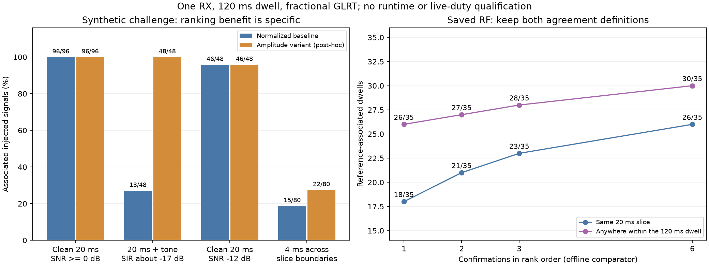
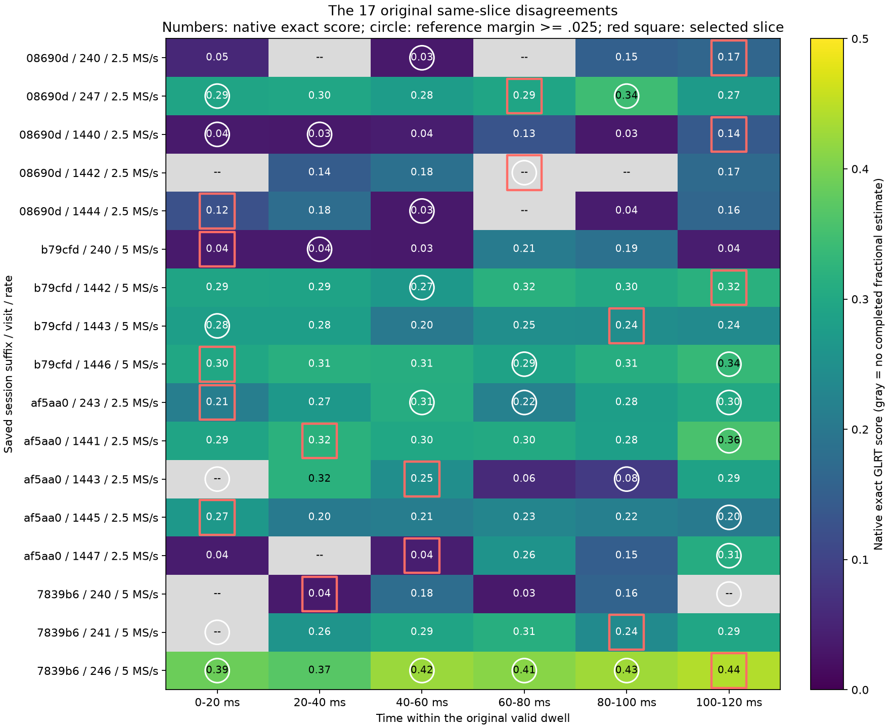

# Whole-dwell GLRT: decision challenge and RF failure diagnosis

2026-09-08. **Offline development evidence, not a qualified or deployed
classifier.** RX1 only; both recording RX streams remain unchanged. No radio
was accessed, no RF collected, and no FPGA, kernel, flashed firmware, production
service, installed dependency, or remote branch changed in this checkpoint.

## Outcome and implementation decision

The new amplitude-weighted ranking option fixes a specific synthetic failure:
pilot-plus-strong-tone associations increase from **13/48 to 48/48**, using the
same whole-dwell fold, FFTs and one fractional confirmation. It does **not**
improve the saved RF cohort's reference association. It therefore remains
opt-in development code, not a replacement for the default worker.

The RF investigation also corrects an overly pessimistic interpretation of
the previous comparison. A missing reference acquisition in the selected
20 ms slice is not proof that the lightweight result is wrong. Of 35 dwells
with reference evidence somewhere in their 120 ms span, the one-confirmation
baseline matches **18/35 in the same slice** and **26/35 somewhere within the
dwell**. Both metrics are retained; the latter is additional development
evidence, not a retroactive pass of the original experiment.



The goal remains unfinished. In particular, short-burst coverage, fresh
classification qualification, 5 MS/s ARM headroom, original-arrival/load
replay, runtime/UI publication and live unchanged-duty verification remain
open. The previous [network integration checkpoint](2026_09_08_scanner_glrt_network_checkpoint.md)
is transport evidence, not evidence that these scientific/runtime gates passed.

## Frozen experiment and limits

The [protocol](../config/analysis/arm-presence-decision-challenge-v1.json)
was recorded before generating its IQ or scoring its metadata-selected RF
cohort. It covers 2.5 and 5 MS/s, both edges, RX1, six 20 ms slices, a 512-bin
hybrid point/area screen, and one blind fractional GLRT confirmation. The
candidate must complete fractional estimation and meet both exact score
**0.175** and exact-minus-control margin **0.025**. The absolute threshold
was a hypothesis from earlier development data, not an enabled runtime policy.
Margin-only results are retained as a separate comparator.

The 528 synthetic cases use a continuous frame-relative pilot model evaluated
at fractional sample times, independently of interpolation of the detector's
sampled template. Local time never substitutes for a uint64 device counter.
Tests compare the independently generated first frame to the published-symbol
template at both rates and edges. This is a pilot-only baseband model, not
validation of analog filtering, payload, propagation or satellite identity.

The frozen frequency draw spans +/-420 kHz, whereas native blind acquisition
is bounded to +/-400 kHz. Some controls are therefore outside its supported
search range. The primary-positive seeds happen to lie inside it; this study
does not extend the supported range. Reused seeds and edge/rate variants are
dependent cases, not hundreds of independent trials for a binomial confidence
claim.

For pilot-plus-tone cases, pilot/noise SNR is 0 dB, but the tone amplitude is
8000 against complex-noise RMS about 1131: approximately **17 dB INR**, or
**-17 dB pilot/tone SIR**. The tone and pilot have the same carrier offset.
These are strong, coherent cochannel-interference tests, not ordinary clean
0 dB examples or coverage of arbitrary tone/pilot frequency separations.

## Synthetic results and an invalid negative-control assumption

| Associated injected signal | Normalized baseline | Amplitude option |
| --- | ---: | ---: |
| Clean 20 ms, SNR 0 or 12 dB | 96/96 | 96/96 |
| 20 ms plus strong cochannel tone | 13/48 | 48/48 |
| Combined primary positives | 109/144 | 144/144 |
| Clean 20 ms, SNR -12 dB | 46/48 | 46/48 |
| 4 ms bursts across slice boundaries, SNR +/-6 dB | 15/80 | 22/80 |

All 35 baseline pilot-plus-tone misses selected a slice outside the injected
signal. Every case selecting the signal slice passed confirmation. An offline
ablation multiplied each normalized projection score by its centered
projection norm raised to exponent 0, 0.5 or 1. Selection used only IQ and
screen statistics; all-six confirmations and truth were consulted afterwards.
Both nonzero exponents recovered all 48 tone cases. Exponent 1 also helped
boundary cases slightly and was implemented in C. Actual C one-confirmation
outputs reproduce the ablation's window/flag/association choices on all 528
opened cases. This is post-hoc development, not fresh holdout validation.

The original protocol labelled 32 symbol-rolled pilot signals as negatives.
That was not a valid hard-negative assumption for an unknown-epoch detector:
rolling 17 symbols produces a predicted timing shift of **74.8 microseconds**
(187 samples at 2.5 MS/s, 374 at 5 MS/s). The 30 accepted controls recover this
shift with residual between -0.179 and +0.442 samples in the baseline. A local
known-pilot match after that shift is not an ordinary noise false alarm.

Consequently:

- The **original failed gate and its 30/256 labelled-negative flags remain
  unchanged** in the retained outputs. We do not repair the label after looking
  at results and declare a held-out pass.
- The separate [label audit](evidence/2026_09_08_arm_presence_decision/control-label-audit.json)
  reports **0/224 flags** on the actual nonpilot controls at the proposed
  threshold, for both rankers. These include white/colored noise, tones,
  pulsed tones, chirps and clipped tones. This is not operational false-alarm
  probability; randomized payload/pilot-like interference still needs testing.
- Weak boundary-burst recovery prevents an absence claim. Screening all six
  slices does not mean that a short signal anywhere in them is reliably found.

## Saved RF: reference acquisition is also incomplete

Four previously unopened complete scans were selected using metadata only:

| Session | Rate | Recording start, UTC |
| --- | --- | --- |
| `scan-hop-cbd6954a5508690d` | 2.5 MS/s | 2026-09-08 14:00:03.728270 |
| `scan-hop-7d7bc31311b79cfd` | 5 MS/s | 2026-09-08 13:40:04.276129 |
| `scan-hop-44105201bdaf5aa0` | 2.5 MS/s | 2026-09-08 13:20:03.769097 |
| `scan-hop-b89eba51117839b6` | 5 MS/s | 2026-09-08 13:02:20.673911 |

Each supplies visits 240-247 and 1440-1447, giving all eight edges in each
sweep, **64 dwells** and **384 fresh reference windows**. The comparison uses
an eight-candidate fractional acquisition search per reference slice, without
seeding the lightweight worker from that search. A reference-positive slice
has a candidate with margin >=0.025; that is not independent Starlink truth.
There are 35 reference-positive dwells and 29 unresolved RF dwells.

Archive access uses the public read-only analysis input adapter rooted at
`/srv/bulk/leo`. Sources, original counters, RX, rate, edge, manifest and IQ
digests are retained. Later comparisons reuse these references only after
checking exact inventory, source manifests and every dwell's IQ/geometry/counter
identity. Those replays are explicitly development on an opened cohort.

| One-confirmation RF result | Baseline | Amplitude option |
| --- | ---: | ---: |
| Flags in reference-positive dwells | 28/35 | 27/35 |
| Timing/CFO associated in the same slice | 18/35 | 18/35 |
| Timing/CFO associated somewhere within the dwell | 26/35 | 26/35 |
| Flags in unresolved RF | 2/29 | 1/29 |

Fewer unresolved flags must not be called fewer false alarms. The amplitude
option loses one flag and adds no reference associations: no demonstrated RF
gain justifies promoting it.

Sixteen of the 17 original same-slice disagreements have no positive reference
candidate in the selected slice. The remaining case has incomplete native
fractional estimation and a weak reference exact score of about 0.096. The
figure below makes the mismatch visible: some dwells have strong native scores
throughout, while the blind reference finds evidence in only one or two slices.
Other rows have genuine poor window selection or failed acquisition.



Within-dwell association uses the existing 2 microsecond circular timing and
8 kHz CFO tolerances. At these rates, each 20 ms slice is exactly 15 frame
periods, so the slice-start offset cancels in the circular comparison. It still
assumes sufficiently stable timing/CFO over 120 ms; it does not prove transmitter
identity, same-slice presence or absence. No absolute device counter is cast
to floating point.

The diagnostic executes six native confirmations in rank order, then computes
prefix comparisons. Its first result must exactly reproduce the one-confirmation
run; otherwise the tool fails. It changes no worker budget or decision policy.

| Offline confirmation prefix | Flags / 35 | Same-slice associations / 35 | Within-dwell associations / 35 | Unresolved flags / 29 |
| --- | ---: | ---: | ---: | ---: |
| 1 | 28 | 18 | 26 | 2 |
| 2 | 29 | 21 | 27 | 3 |
| 3 | 29 | 23 | 28 | 3 |
| 6 | 33 | 26 | 30 | 5 |

As an additional post-hoc check, imposing the same 0.175 exact threshold on
reference candidates leaves 31 reference-positive dwells. The baseline flags
28/31 and associates 26/31 within the dwell; the all-six comparator flags 31/31
and associates 30/31. This does not replace the original denominator or qualify
a new threshold. Simply increasing confirmation count has limited demonstrated
benefit and substantial compute implications.

## Code, tests and runtime status

`LEO_PRESENCE_RANK_AMPLITUDE_WEIGHTED=1` stores the already-computed centered
projection norm and applies it after normalized correlation. There is no extra
IQ traversal, fold, FFT or confirmation. Template normalization, fractional
confirmation and the default detector are unchanged. The extra statistic is
private workspace/diagnostic state, not a new published wire field.

Local implementation commit: `b6b6bf4c869d589ca272a1b5c1cd6a580566506a`.
The [execution receipt](evidence/2026_09_08_arm_presence_decision/receipt.json)
retains the commands, explicit failures and open qualification gates.

| Verification | Result |
| --- | --- |
| Focused analysis, worker and frame-result regressions | 442 passed, no skips |
| Included ranker tests | 140 passed |
| Independent NumPy amplitude-score oracle | Both rates/edges, full-range CI16; epochs and IQ unchanged |
| Actual worker IPC/result conversion | Both normalized and amplitude variants tested |
| ASan/UBSan/leak-checked dwell executable | 12 processes, 24 full-dwell executions, 144 confirmations; no diagnostics |
| Cortex-A9/NEON userspace worker cross-build | Passed; not executed on ARM in this checkpoint |
| Changed Python Ruff and whitespace checks | Passed |

The sanitizer cases cover both rates/edges, strong-tone injected pilots, zero
input and CI16 extrema, with two executions per process. The external FFTW
dependency is not itself an instrumented build. An initial batch stopped when
the report helper refused to overwrite its result file; its first completed
record and build receipt are retained separately. The corrected batch writes
once after all cases into a new directory. This was a harness failure, not a
hidden detector sanitizer failure.

There is **no new ARM timing claim**. The previous full-dwell saved-data ARM
run still measures 64.54/113.47 ms CPU p99 at 2.5/5 MS/s, with 126.62 ms
copy-to-result p99 at 5 MS/s and an unresolved cold-start tail. Scalar ranking
overhead may be small, but cross-compilation and desktop tests cannot prove
runtime headroom or unchanged live recording duty.

## Reproduction and next decisions

From this worktree, with its Python environment, `PYTHONPATH=src:.` and an
explicit FFTW installation:

```text
python -m tools.presence_decision_challenge NEW_OUTPUT --fftw-prefix PREFIX
python -m tools.prototype_presence_rank_energy OPENED_CONTROLS NEW_ABLATION_OUTPUT
python -m tools.presence_decision_challenge NEW_OUTPUT --fftw-prefix PREFIX --rank-amplitude
python -m tools.evaluate_presence_decision_rf ARCHIVE NEW_OUTPUT --fftw-prefix PREFIX
python -m tools.evaluate_presence_decision_rf ARCHIVE NEW_OUTPUT --fftw-prefix PREFIX --reference-run OPENED_RF --all-windows
```

For the amplitude RF replay add `--rank-amplitude`. Outputs must be new paths
outside archives. Original scoring freezes, raw numerical results, summaries,
build receipts, sanitizer records and JUnit are retained in the
[evidence directory](evidence/2026_09_08_arm_presence_decision/artifact-manifest.json).
The original tool hashes remain as executed; later source changes add label
auditing, identity validation, diagnostics and formatting rather than rewriting
those original rows. No IQ or executable binary is included in the report.
The [reproduction audit](evidence/2026_09_08_arm_presence_decision/reproduction-audit.json)
regenerated all 528 current-source IQ/truth identities, checked all 528 actual-C
amplitude choices against the independent ablation, and confirmed the diagnostic
reproduces all 64 original RF rows exactly before adding its extra comparisons.

Next: freeze a genuinely new challenge with non-timing-equivalent randomized
pilot/payload controls and diverse interference, then test the unchanged and
amplitude options on it. Preserve same-slice and within-dwell RF agreement
separately. Prioritize the three strong-reference dwells missed by the baseline
over adding confirmations indiscriminately. Use stage-profiled, saved-data ARM
tests to resolve 5 MS/s headroom and startup before production composition and
authorized live unchanged-duty verification. No positive or absence policy is
enabled by this report; merge/deployment and the full goal remain pending.
