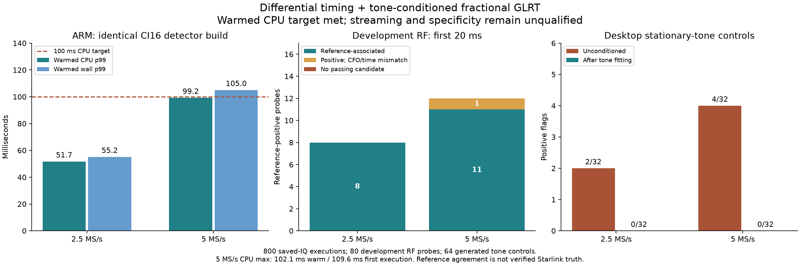

# Single-RX ARM presence: better timing proposals and bounded tone handling

Date: 2026-09-08. Status: **implementation in progress; not deployed or
qualified for streaming**. All radio execution used saved IQ on an idle spare.
No RF collection, FPGA, flashed-firmware, kernel, or production configuration
changes were made. Production acquisition was checked active after the work.

## Outcome

One consistent native build now flags all **20/20 reference-positive development
probes** and associates **19/20** with the reference timing/CFO. Its warmed ARM
p99 detector CPU is **51.7 ms at 2.5 MS/s and 99.2 ms at 5 MS/s**, including CI16
conversion. All **800 ARM outputs** match the corresponding desktop candidates
and tone-fit diagnostics within the frozen numerical tolerances.

This is not a release pass. The 5 MS/s warmed maximum is 102.1 ms, first-execution
maximum is 109.6 ms, and the pooled first/warmed p99 is **100.014 ms**. The warmed
target is narrowly met, not a hard deadline guarantee. Fresh holdout, independent
specificity, whole-visit coverage, worker scheduling, iiOD integration, and live
shadow verification remain incomplete.

## Why the proposal changed

The [previous power checkpoint](2026_09_08_arm_presence_power_checkpoint.md)
met an isolated CPU target but associated only 9/12 positive 5 MS/s development
probes. It missed two timing proposals and selected one different CFO alias.

The new proposal uses the lag product `x[k+4] * conjugate(x[k])`. A digital CFO
rotation multiplies this product by a constant phase, so the **magnitude** of
its template correlation is CFO-invariant. Unlike power alone, it retains local
complex structure useful for timing acquisition.

The detector folds the full 20 ms probe, using independently rounded physical
frame starts, and FFT-correlates its mean-centered lag products with the pilot
template. Up to eight local timing neighborhoods are proposed. Original-rate
correlation magnitude plus **0.5 times signed power correlation** ranks them;
the selected timing is locally refined before blind CFO acquisition. The
weight was explored on development data, not selected on an untouched holdout.

Two-frame CFO acquisition now uses **all pilot symbols**, rather than alternating
symbols. This recovers the previously missed CFO association at 5 MS/s visit
1685. Final exact/control fractional GLRT still uses the available full 20 ms.
The frequency-search band and reference-association tolerances were not narrowed.

The following alternatives were examined and retained as development evidence:

- Lag products at lags 1, 2, 4, and 8; power-only lag zero; native and projected
  timing grids. A 4096-bin lag grid missed timing evidence at 5 MS/s; 8192 bins
  were retained there. The 2.5 MS/s grid uses 4096 bins.
- Differential magnitude alone versus the joint differential/power ranking.
- One or two retained candidates and full versus staged local refinement.
  Staging evaluates the eight centers first and refines the selected center.
- CFO inferred directly from lag-correlation phase. This was **not adopted**:
  errors reached about 544 kHz across retained reference-timing matches. Magnitude
  invariance does not make phase an accurate CFO prior in these captures.

See the saved [differential experiment](figures/2026_09_08_arm_presence_differential/wide-differential/results.json),
[native variants](figures/2026_09_08_arm_presence_differential/wide-native/results.json),
and [staged variant](figures/2026_09_08_arm_presence_differential/wide-staged/results.json).

## Quality accounting: detection is not identification

The 80 development probes are first-20ms RX1 excerpts from complete eight-target
sweeps 10, 70, 140, 210, and 280 in two archived 300 s scans. They span both edges
and all four channels, but **are not independent holdout scans**.

| Rate | Reference-positive probes | Positive flags on those probes | Reference-associated | All positive flags among 40 RF probes |
|---|---:|---:|---:|---:|
| 2.5 MS/s | 8 | 8 | 8 | 12 |
| 5 MS/s | 12 | 12 | 11 | 19 |

The additional four/seven RF flags are unresolved: they are neither established
false alarms nor established new Starlink detections. The dense fractional
reference is a numerical comparison, not independent signal truth. Association
still requires circular timing within 2 microseconds and tracking CFO within
8 kHz; these criteria were not relaxed to turn a mismatch into a pass.

The remaining mismatch is 5 MS/s visit 562. The native candidate has timing
approximately 4966.6933 samples, CFO -171745.914 Hz, and margin 0.264656. The
reference has timing approximately 4966.4266 samples, acquired CFO -58020.146 Hz,
tracking CFO +55172.325 Hz, and margin 0.187846. Timing is close, but CFO differs
substantially. The reference itself makes a large acquired-to-tracking correction.
Neither result should be forced to match the other without independent evidence.

## Stationary-tone nuisance experiment

A separate optional preprocessing model fits one stationary sinusoid:

1. A 4096/8192-point snapshot FFT measures the strongest three-bin spectral
   fraction. Below 2%, the working signal is unchanged.
2. Whole-probe lag correlations at 256, 4096, and 16384 samples refine frequency,
   resolving each ambiguity relative to the previous estimate.
3. A whole-probe complex least-squares amplitude is fitted. Subtraction is
   applied only when its fitted power exceeds 1% of the original probe power.

The thresholds and procedure are explicit in the frozen experimental policy.
They are not a generally validated interference classifier. **Original input IQ
is never modified**, but when a tone fit is applied, final fractional GLRT uses
the conditioned working signal. New nuisance diagnostics explicitly report this;
existing result/profile layouts and wire schemas remain unchanged.

| Desktop experiment | 2.5 MS/s raw → conditioned flags | 5 MS/s raw → conditioned flags |
|---|---:|---:|
| Generated tone controls, 32 per rate | 2 → 0 | 4 → 0 |
| Positive RF plus added tone, 8 / 12 examples | 8 → 8 | 8 → 12 |
| Unmodified development RF, 40 per rate | 12 → 12 | 19 → 19 |

Thus **six false flags were removed among 64 controls**, not 64 false flags.
Four 5 MS/s detections obscured by an added tone were recovered. The one CFO
association mismatch remains. A fit was applied to 10/40 unmodified 2.5 MS/s
probes, mostly near DC, and 0/40 unmodified 5 MS/s probes. Preserving detection
counts does not prove that all real signal components were preserved.

These [tone experiment results](figures/2026_09_08_arm_presence_differential/tone-nuisance/results.json)
are desktop development evidence. Broader colored-noise, nonstationary and
multi-tone interference, wrong-pilot controls, and untouched RF remain required.

## Runtime optimizations and actual ARM measurements

The initial tone-conditioned 5 MS/s smoke cases took roughly 108-133 ms wall.
Three separately configured optimizations were tested without shortening the
probe or changing score thresholds:

1. **Iterative FP64 radix-2 FFT:** identical root tables and butterflies, removing
   recursive calls and repeated intermediate copies. Mixed radix-2/5 transforms
   retain the original path. The sampled 5 MS/s cases saved roughly 13-15 ms wall.
2. **Blocked FP64 tone fit:** a reusable 256-sample oscillator basis, one phase
   rotation per block, and independent accumulators. Numerical parity held;
   the measured ARM improvement was small and insufficient on its own.
3. **Exact CI16 integer products:** energy and lag sums use widening NEON integer
   products on ARM, with a scalar int64 fallback. Products are widened before
   addition to avoid the `INT16_MIN` square-pair overflow. With at most 100000
   complex samples, sums remain below 2^48 and convert exactly to FP64. This is
   an arithmetic optimization, **not integer epoch estimation**; fractional
   timing, tone fitting, and final GLRT remain double precision.

The final executable SHA-256 is
`6db8fecfb02389a04998e366b74c7748fd8456995833ba84da3ce39b84125367`.
The [build receipt](figures/2026_09_08_arm_presence_differential/leo-native-presence-tone-ci16-arm-20260908.build.json)
pins source hashes, GCC 7.3.1, and compiler flags. The same executable produced
all 800 measurements, not a mixture of faster and higher-quality variants.

Target: spare serial `104000b29905000e17000800065934759d`, LAN `192.168.1.15`,
two Cortex-A9 cores with NEON. Serial and pinned SSH identity were checked;
IIO receive buffers were disabled before and after replay. The excluded radio
was not accessed. One worker ran at nice 19, unpinned; CPU frequency and free-core
capacity were not established. No radio software was installed or enabled at boot.

Each of 80 CI16 probes ran ten times. One first execution per probe is separate;
the following warmed statistics use 360 executions per rate:

| Rate | CPU p50 | CPU p95 | CPU p99 | CPU max | Wall p99 | Wall max |
|---|---:|---:|---:|---:|---:|---:|
| 2.5 MS/s | 42.0 ms | 50.2 ms | 51.7 ms | 55.0 ms | 55.2 ms | 57.0 ms |
| 5 MS/s | 86.1 ms | 96.4 ms | 99.2 ms | 102.1 ms | 105.0 ms | 106.7 ms |

First-execution CPU maxima were 60.0/109.6 ms. Maximum observed process RSS was
6060/10284 KiB. Initialization and file IO are excluded; CI16 conversion is
included. CPU accounting is coarse (roughly 10 ms), so zero-valued stage timings
do not imply free work. These repeated samples do not establish worst-case
latency, streaming headroom, or independent detection statistics.

The [raw output](figures/2026_09_08_arm_presence_differential/arm-wide.txt) was
hashed on the radio and after transfer, then verified against the
[input manifest](figures/2026_09_08_arm_presence_differential/wide-ci16-inputs.json)
and [matching desktop results](figures/2026_09_08_arm_presence_differential/wide-native-ci16/results.json).
The [summary](figures/2026_09_08_arm_presence_differential/arm-wide-summary.json)
records the verifier identity. Verification covers input hashes, counters,
rate/edge, iteration inventory, candidate ordering, fractional timing, CFO,
scores, gate decisions, and nuisance-fit metadata.

## Tests and checkpoint decision

- 446 focused numerical, configuration, serialization, and evidence-verifier
  tests passed; two additional report-accounting tests passed.
- The unchanged full-grid FP32 scientific baseline, using the optional iterative
  FFT, passed all 40 frozen probes three times after the new paths were added.
- ASan/UBSan passed 120 saved probes for each of the iterative, blocked, and
  final CI16 detector builds, including both floating-container and CI16 inputs.
- Sixty exact integer-lag checks passed on the ARM itself, including full-scale
  extrema, sample tails, and shifted input alignment. Portable checks also
  compare directly with independent NumPy int64 calculations.
- All 36 iterative/blocked/CI16 ARM smoke outputs and all 800 final cohort
  outputs matched their corresponding desktop candidates and nuisance metadata.
- Ruff and whitespace checks passed. The figure was rendered and inspected.

**Decision:** continue implementation, not deployment. Warmed isolated CPU
feasibility is now demonstrated on this broader development cohort, with little
5 MS/s margin. Quality and all-visit scheduling are not qualified. The next
work should freeze the selected candidate, evaluate untouched scans and temporal
coverage, and exercise an isolated bounded worker with 300 s paced saved-IQ
streams. Additional exact coarse-stage optimizations may provide needed margin.
Only then proceed through versioned iiOD/host integration and explicitly
authorized bounded live shadow checks. The full implement/test/deploy/verify
objective remains active.

## Reproduction

Use the implementation worktree with `PYTHONPATH=src:.` and
`OPENBLAS_NUM_THREADS=1`. Archive access remains read-only through public storage
ports. Raw IQ and executable binaries are intentionally excluded from Git.

- `evaluate_native_presence_differential.py`: frozen lag/projection experiments.
- `evaluate_presence_tone_nuisance.py`: frozen nuisance/control experiments.
- `evaluate_native_presence_budgets.py INPUT_DIRECTORY NEW_OUTPUT --protocol
  config/analysis/arm-presence-native-tone-ci16-v1.json`: build and replay the
  final named detector on a frozen CI16 manifest.
- `summarize_native_presence_arm.py INPUTS DESKTOP RAW NEW_SUMMARY --variant
  diff4_staged_tone_ci16 --format 2 --repeats 10`: verify the 800 saved ARM outputs.
- `report_native_presence_differential.py EVIDENCE_DIRECTORY NEW_PNG`: render
  the figure from the saved summary, reference accounting, and tone controls.

Earlier smoke outputs, frozen protocols, and optimization comparison receipts
are retained beside the figure, including failed runtime attempts. The current
branch includes freshly fetched remote main `29be8492`; this checkpoint does
not claim a remote merge, release deployment, or live RF verification.
