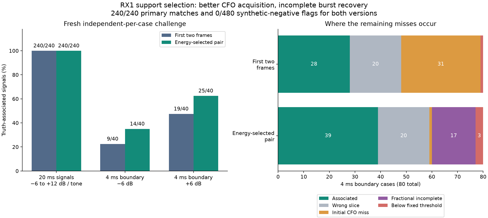
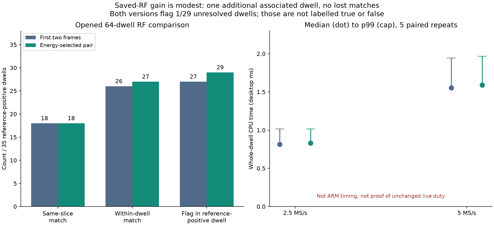

# RX1 GLRT: choose acquisition frames where the burst is

2026-09-08. Implementation **`dd8d5f76`**. **Default-off desktop experiment;
not deployed, not live RF, and not proof of unchanged scanner duty.**

## Outcome

Choosing two adjacent acquisition frames by observed energy improves fresh
4 ms boundary-burst association from **28/80 to 39/80**. Both versions retain
**240/240 primary signals**, including 20 ms signals at −6 dB and pilot-plus-tone
cases, and flag **0/480 synthetic negatives** across two challenges. The existing
64-dwell saved-RF comparison gains **one** within-dwell reference association,
from **26/35 to 27/35**, without losing an existing association.

This is a useful but limited improvement. On the new boundary challenge,
initial-CFO misses among still-unassociated, overlapping cases fall from 31 to
1, exposing fractional refinement as the next bottleneck. Twenty cases still
select a slice containing no burst. No absence claim is justified.

## Diagnosis and implementation

The earlier [holdout](2026_09_08_arm_presence_holdout_checkpoint.md) contains
32 boundary cases whose selected 20 ms slice catches the burst near its end.
All 32 have initial CFO errors exceeding 8 kHz. In contrast, all 27 cases with
the burst near the selected slice's beginning have initial CFO errors within
that bound. Five tail cases nevertheless become associated after final CFO
correction; an initial CFO miss is not necessarily a final miss.

The configured fine-CFO acquisition and integer epoch lattice use only the
first two frames. A slice can therefore contain a real burst while these stages
operate on noise before it. Final GLRT scoring later in the slice cannot
reliably repair a bad acquisition and incomplete fractional estimate.

`LEO_PRESENCE_ENERGY_SUPPORT=1` is a new **explicit, default-off** experiment:

1. Keep the existing six-slice ranker and one blind confirmation per dwell.
2. After tone removal and coarse epoch selection, sum received power in each
   eligible complete frame. Select the adjacent pair with largest combined
   energy, using the earliest pair on ties. No truth, reference CFO, or GLRT
   score selects the pair.
3. Use that pair for fine-CFO acquisition, conditioned CFO refinement and the
   two-frame integer epoch lattice. Retain the original sample indexing; do not
   copy/rebase IQ or shift the reported epoch to the selected frame.
4. Keep final fractional GLRT scoring over its original interval, including the
   existing alternating known-symbol regions. Retain all fractional-completion
   guards and score thresholds.

Only configurations with two fine frames and two epoch frames accept the flag.
Frame eligibility reserves two samples for the local epoch lattice; subsequent
sampling bounds checks remain in place. Candidate support survives candidate
reordering and does not leak into the public final-score operation or later
dwells. Public result structures, frame contracts and scanner geometry do not
change. RX1 alone is analyzed; this experiment does not alter either recorded
IQ stream.

The **two CFO FFTs and configured confirmation budget** remain the same. This
is not a claim of zero extra computation: selecting support adds a power pass,
and successful fractional refinement can execute final scoring where the old
path stopped early. Runtime and duty must be measured separately.

## Fresh challenges and limitations

The [frozen 576-case protocol](../config/analysis/arm-presence-energy-support-challenge-v1.json)
uses distinct per-case seeds, both sample rates and both edges. It compares the
same optimized arithmetic used by the latest package with and without energy
support. Each variant sees identical IQ; comparisons are paired. Unlike the
previous challenge, different geometries/SNRs do not reuse the same seed.

| Fresh synthetic cases | First two frames | Energy-selected pair |
| --- | ---: | ---: |
| Primary association, 20 ms including interference | 240/240 | 240/240 |
| 4 ms boundary association, −6 dB | 9/40 | 14/40 |
| 4 ms boundary association, +6 dB | 19/40 | 25/40 |
| All boundary associations | 28/80 | 39/80 |
| Flagged boundary cases not associated with truth | 5 | 0 |
| Structured nonpilot false flags | 0/256 | 0/256 |
| Additional nuisance false flags | 0/224 | 0/224 |

There are **13 boundary gains and 2 losses**, not 11 gains with no regression.
The earlier holdout also had 28 baseline associations, coincidentally; these
are different cases and are not a replay of that holdout.

The additional, separately frozen 224 cases cover white and colored noise,
single and double tones, pulsed tones, chirps and clipped tones. Rolled known
pilots are not relabelled as negative. All 800 case seeds are distinct. The
negative cases model specific nuisance distributions; **0/480 is not an
operational false-alarm probability**. The positive eight-tone pilot model does
not represent every analog filter, multipath channel, payload or satellite.

Thresholds remain exact score ≥0.175 and exact-minus-control margin ≥0.025,
with complete fractional estimation. Truth association requires circular timing
within 2 µs and final CFO within 8 kHz. No threshold was tuned after scoring.

The revised boundary outcomes partition into 39 associated, 20 wrong-slice,
17 fractional-incomplete, 3 below-threshold and 1 initial-CFO-miss cases.
The diagnostic checks association first, then overlap, initial CFO, fractional
completion and thresholds; it is a failure partition, not independent counts
of every possible defect.

## Saved RF and desktop cost

The existing four-session, 64-dwell cohort is reused through the public
read-only archive adapter. Source manifests, exact device counters, RX, edges
and IQ hashes are checked. All 64 original baseline numerical results reproduce
at the unchanged `rtol=1e-9`, `atol=1e-10`. References never seed the detector.

| RF comparison | First two frames | Energy-selected pair |
| --- | ---: | ---: |
| Same-slice reference association | 18/35 | 18/35 |
| Within-dwell reference association | 26/35 | 27/35 |
| Flags in reference-positive dwells | 27/35 | 29/35 |
| Flags in unresolved dwells | 1/29 | 1/29 |

The additional association is `scan-hop-44105201bdaf5aa0`, visit **1447**.
These are opened comparison data, not independent Starlink identity truth.
A flag without association is not promoted to a verified detection; unresolved
RF is not labelled negative.

Five recurring, alternating-order executions per variant/dwell yield 640 timed
calls after 128 initial scientific executions. Numerical outputs must reproduce
on every repeat. These are desktop CPU measurements, not ARM estimates:

| Whole-dwell CPU time | First two frames | Energy-selected pair |
| --- | ---: | ---: |
| 2.5 MS/s median | 0.814 ms | 0.830 ms |
| 2.5 MS/s p99 | 1.016 ms | 1.016 ms |
| 5 MS/s median | 1.552 ms | 1.591 ms |
| 5 MS/s p99 | 1.943 ms | 1.968 ms |

Do not scale these values into an ARM deadline promise. The previous package's
5 MS/s worker wall p99 was already approximately 117 ms against 120 ms arrivals.
This variant is cross-built for Cortex-A9/NEON but **has not run on ARM**.

## Verification and remaining work

**461 selected tests pass:** 439 analysis/generator regressions and 22 tests
of the new worker variant, including real worker IPC and fractional result-frame
conversion. The worker-only selection deselects 121 other cases; it does not
claim they were rerun. Eight ASan/UBSan/leak-checked processes verify 16 full
dwells and 96 confirmations at both rates/edges, including zero IQ and terminal
bursts. The instrumented builtin FFT backend matches its uninstrumented peer;
external FFTW is not thereby instrumented. Ruff, formatting and whitespace pass.

The initial wider regression found 16 failures: an unconditional profiling
clock made the disabled, seeded path report nonzero coarse-work time. The fix
guards that clock with the experiment flag; no assertion or tolerance changes.
All 576 generated IQ identities and both variants' numerical results reproduce
after the fix. The original failed test output, initial fresh run and final
replay remain in the evidence; the replay is not counted as another holdout.

Next priorities are to diagnose fractional refinement's actual symbol support
in the 17 CFO-correct failures, and improve weak-burst slice ranking without
adding confirmations. In particular, a full frame can contain burst energy
while its early 64-symbol epoch-refinement region does not; that is a testable
hypothesis, not yet the established cause of all 17 failures. Then measure the
complete revised worker on ARM before any live detector-off/on duty comparison.

No radio was accessed, no RF was collected, and no FPGA, kernel, flashed
firmware, installed package or production service changed. Nothing was pushed,
merged remotely or deployed. The SDK still uses an unqualified decision policy.
Live RF authorization and the full unchanged-duty requirement remain open.

[Comparison, raw results, build identities, tests and reproduction recipes](evidence/2026_09_08_arm_presence_energy_support/index.json)
retain 36 hash-checked non-IQ/non-executable artifacts and two PNG figures.
