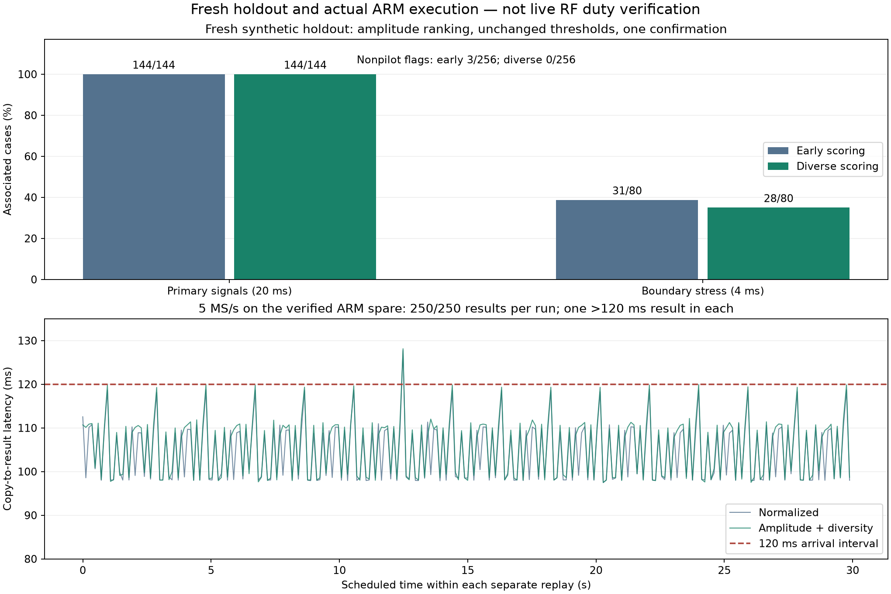

# RX1 GLRT: fresh holdout and actual ARM execution

2026-09-08. Implementation checkpoint `6b516b02`. **Not deployed; unchanged
live scanner duty is not yet verified.** No RF was collected and no FPGA,
kernel, flashed firmware, production service or installed library was changed.

## Outcome

The revised amplitude-ranked, symbol-diverse GLRT passes a **fresh, frozen
480-case synthetic challenge**: 144/144 primary signals associated and 0/256
nonpilot flags. The earlier scorer produces three nonpilot flags on these same
new cases. Neither result establishes an operational false-alarm probability.

The hardware access dependency is resolved for one allowed spare. Physical USB
console inspection binds `winbond-db620818a328172c` to **192.168.1.14** and its
SSH public key. The benchmark then uses that physical LAN address, not the
ambiguous USB-network route. Capture buffers are disabled before/after the runs.

Four **30-second saved-IQ ARM worker replays**, now explicitly at **120 ms
arrival spacing**, deliver **1,000/1,000 results**, with zero skips/drops and
desktop numerical agreement. At 5 MS/s the revised scorer's copy-to-result
p99 is **119.88 ms**, with a **128.14 ms maximum**: this is insufficient margin
to promise unchanged duty under live acquisition load.

The [receipt and evidence](evidence/2026_09_08_arm_presence_holdout/receipt.json)
retain frozen protocols, failed launches, raw results, manifests, build
identities, tests and reproduction recipes. No IQ or executable is committed.

## Fresh detector challenge

The [holdout protocol](../config/analysis/arm-presence-structured-holdout-v1.json)
keeps the previous model, score/margin thresholds, both rates/edges and
one blind fractional confirmation per dwell. Only the seeds and declared
comparison variants change. Seeds are disjoint from the prior development
challenge and unit-test examples. The complete inventory and source identities
are frozen before waveform generation or scoring. No threshold or detector
code is tuned after opening this holdout.

| Amplitude-ranked detector | Nonpilot flags / 256 | Primary associations / 144 | Boundary associations / 80 |
| --- | ---: | ---: | ---: |
| Original early-symbol scoring | 3 | 144 | 31 |
| Diverse-symbol scoring | **0** | **144** | 28 |

The primary signals last 20 ms, including pilot-plus-tone cases. Boundary
stress signals last 4 ms and straddle a slice boundary. The revised method
loses three boundary associations and produces five unassociated boundary
flags; its primary-case success must not be generalized to all short bursts.
There is no clipping in any generated case. Reused seeds across geometries,
SNRs and windows make counts dependent, not independent FAR trials.

This closes the narrow fresh-synthetic-challenge gate left by the
[post-hoc development report](2026_09_08_arm_presence_structured_checkpoint.md).
It does **not** close short-burst sensitivity, saved-RF slice/CFO acquisition
misses, independent RF identification or absence-classification gates.

## ARM benchmark and exact scope

The replay uses the first 16 complete saved dwells per rate in the existing
frozen corpus order, selected independently of detector outcomes: 32 distinct
dwells total. The full original 120 ms RX1 IQ and exact device counters are
retained. Each run repeats its 16-dwell set to submit 250 jobs in 30 seconds.

The real isolated worker consumes the shared-memory pool, processes both
channel edges, and returns its evidence. All recovered candidate fields,
fractional offsets, selected windows, screen diagnostics and source identities
match the matching desktop build within unchanged tolerances. This is actual
ARM execution, not a cross-build or a desktop-to-ARM runtime estimate.

| Rate | Worker | CPU p99 | Copy-to-result p99 | Maximum | Results |
| --- | --- | ---: | ---: | ---: | ---: |
| 2.5 MS/s | Normalized | 61.09 ms | 69.28 ms | 70.67 ms | 250/250 |
| 2.5 MS/s | Amplitude + diversity | 62.80 ms | 70.67 ms | 71.54 ms | 250/250 |
| 5 MS/s | Normalized | 103.42 ms | 118.72 ms | 127.74 ms | 250/250 |
| 5 MS/s | Amplitude + diversity | 108.62 ms | 119.88 ms | 128.14 ms | 250/250 |

Each 5 MS/s run has one result exceeding 120 ms. That does not itself prove
lost acquisition duty: the worker is asynchronous and no result was dropped in
these runs. It does show that a hard per-dwell deadline has not been met. Queue
capacity alone cannot establish sustainable operation under live I/O load.

At 5 MS/s the revised worker's median screen and confirmation CPU costs are
**28.34 ms and 69.99 ms**, respectively; their p99 values are 28.76 and 80.00 ms.
The normalized screen costs 23.19 ms median. These are stage measurements, not
an additive tail calculation. Maximum parent-side IQ copy is 10.22 ms for the
revised worker. Its remaining p99 headroom to 120 ms is only 0.12 ms.

Important boundaries:

- This is **30 seconds per run, not a 300-second capture**. A full-duration
  original-arrival/load replay and authorized live duty comparison remain.
- 32,768-sample chunks are delivered in a burst per dwell. The original DMA,
  retune, packet and metadata timeline is not reproduced.
- Parent and child use `nice 10` with inherited CPU affinity. No active RF/IRQ
  acquisition workload runs on this spare. This is not a pinned-core or
  worst-case-contention test.
- Worker setup and input loading precede the replay clock. First processed
  dwells are included; this is not an end-to-end cold scanner startup test.
- The normalized and revised workers are separate sequential runs, not a
  randomized thermal/load experiment. Prior `.15` measurements used different
  hardware/workloads; do not infer a precise optimization speedup from them.
- This test exercises the worker IPC, not the complete live iiOD/libiio frame
  transport under RF load. Earlier transport evidence remains separate.

## Hardware handling and launch failures

Only the currently USB-attached `db620` spare was accessed. `.20` and `.21`
remain production-radio candidates and were not benchmarked; `.15`, the `.18`
FPGA canary and the excluded serial were not used.

USB gadget serial, physical `eth0` address and SSH public key were inspected
through the exact USB console. The radio generates volatile Dropbear keys on
first SSH contact; the network key was accepted only after matching it to the
console. An isolated known-hosts file was used, leaving the existing trust
store unchanged. Console login was closed; the host tty was left raw to avoid
echoing radio output back as input. No console break, reset or firmware update
was sent.

The initial launch wrapper used unavailable `timeout`; the second retained
`taskset`, also unavailable on this image. Both rejected batches returned 127
before any detector ran. The successful recipe uses the replay program's
built-in watchdog and existing `nice`, without a core-affinity claim.

The installed FFTW library differs from the cross-build dependency. The exact
cross-build library was therefore copied into a new RAM-only scratch directory
and selected with a process-local library path. Installed files and daemons
were not replaced. The complete uploaded payload was hash-checked before and
after execution, then only those enumerated temporary files and their empty
directory were removed. Copies and evidence remain locally reproducible.

## Implementation and tests

The changes are limited to research runners, their frozen configuration and
component-owned tests. Runtime classifier defaults, scientific scoring code,
public persisted contracts, IQ capture timing and metadata layouts are unchanged.

- The structured runner now selects explicit, reviewed ranker/diversity flags;
  original variants retain their early-scoring behavior.
- The worker replay accepts either the original 126 ms period or explicit
  120 ms spacing. It reports that period, sizes its timing inventory for 2,500
  jobs at 300 seconds, and rejects unreviewed periods.
- The verifier checks the declared period and expected job count. Historical
  126 ms evidence still reproduces unchanged; it cannot silently pass as a
  120 ms run.
- **729 tests pass**, zero failures/errors/skips in the final selected suite.
  Tests cover the detector, fractional arithmetic, worker IPC, frame conversion,
  pacing, malformed inputs and replay verification. Ruff and whitespace pass.
  No golden numerical fixture or tolerance was relaxed.

## Next work toward unchanged duty

1. Profile and reduce the roughly 70–80 ms confirmation cost on the verified
   spare, using saved IQ and unchanged fractional-result checks. Also examine
   the revised screen's measured extra CPU cost. A practical target is at least
   20 ms of **copy-to-result** headroom at 5 MS/s, not merely average CPU below
   120 ms.
2. Resolve slice-selection/CFO misses and short-burst sensitivity without
   assuming that an unconfirmed dwell is empty. Test extra work against the
   same ARM budget before expanding confirmation coverage.
3. Run full-duration replay with original arrivals and representative load;
   finish userspace packaging/rollback verification, then obtain explicit RF
   authorization for a bounded disabled/enabled live duty comparison.

The overall goal remains active. Classification is disabled by default and
this checkpoint is neither a production deployment nor a remote-main merge.
