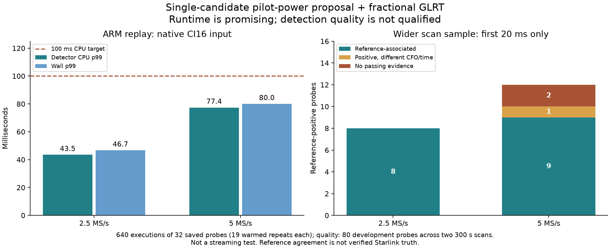

# Single-RX ARM presence: a fast proposal, with unresolved quality failures

Date: 2026-09-08. Status: **implementation in progress, not deployed or qualified
for live streaming**. No RF collection, FPGA, flashed-firmware, kernel, or
production configuration changes. Production acquisition remained active.

## Outcome

The new single-candidate pilot-power proposal followed by fractional GLRT takes
**43.5/77.4 ms warmed p99 detector CPU** at 2.5/5 MS/s when replaying native CI16
samples on the idle ARM spare. This includes CI16 conversion into the numerical
workspace. It does not include the future collector, shared-buffer handoff,
result transport, or concurrent DMA/network contention.

That is a useful measured feasibility result, but **not a release pass**. A
broader development cohort recovers reference-associated evidence on 8/8
positive probes at 2.5 MS/s and 9/12 at 5 MS/s. Two 5 MS/s timing proposals miss
reference evidence, and another selects a different CFO alias. Both lower-edge
tone controls still cause positive flags. The detector must remain advisory.

## What changed

The unchanged full-grid baseline still exists. These are separately configured
research detectors, not a silent replacement for scientific GLRT:

1. Fold the original-rate sample powers across the available frames in the
   20 ms probe. Each frame start is independently rounded from its physical
   period; rounded periods are never accumulated.
2. Correlate the folded power with mean-centered Qin pilot-template power.
   Digital CFO rotation leaves magnitude squared invariant. This is a useful
   timing proposal, not proof of Starlink specificity.
3. Optionally project both folded phase grids to 4096 bins for a smaller
   circular FFT correlation. Locally refine selected peaks against original-rate
   folded power, including the circular seam. This projection is approximate;
   it does not resample the IQ used for final confirmation.
4. Perform blind CFO acquisition across the supported band. The short fine FFT
   uses 4096/8192 points, with its actual 610.3515625 Hz bins correctly labeled.
   Follow with a bounded conditioned search and a fractional timing lattice.
5. Confirm against exact/control pilots using original-rate IQ over the full
   available 20 ms, with the existing FP64 fractional interpolation. Two-frame
   acquisition does not shorten this final confirmation.

One- and two-candidate variants are explicit. The latter costs more even when
its second hypothesis is unproductive. Legacy acquire/verify ranking scores
are omitted only for the power-proposal detector; final exact/control GLRT is
not omitted. No hard power threshold was fitted to these examples.

Cached coarse templates and finer stage profiling were added. Existing native
result layouts remain unchanged; profiling uses a separate API and replay
schema. The normal baseline wire format is preserved. The optional
`-fcx-limited-range` build omits complex overflow-recovery work for the library's
bounded finite inputs; it does not enable general fast-math or reassociation.

## Failed approaches retained as evidence

On the original small C0 cohort, the full-grid GLRT2 reference has eight
positive 5 MS/s RF probes and **zero** positive 2.5 MS/s RF probes.

| Acquisition variant | 5 MS/s reference probes associated |
|---|---:|
| Full-grid profile baseline | 8/8 |
| Four-frame reduced acquisition | 3/8 |
| Compact four-frame / sparse-anchor acquisition | 1/8 |
| Two-frame sparse timing/anchor grid, narrow refinement | 0/8 |
| Three-frame sparse timing/anchor grid, narrow refinement | 0/8 |
| Pilot-power proposals, all tested native variants | 8/8 |

Passing strong synthetic pilot tests did not predict real-probe performance for
the reduced-grid variants. They are not viable deployment defaults. The NumPy
power-projection development experiment recovered the strongest timing on 8/8
examples at 4096 bins but only 7/8 at 2048; neither set is an untouched holdout.

Frozen protocols, source-bound builds, and results are in
[budget-v1](figures/2026_09_08_arm_presence_power/budget-v1/protocol.json),
[power-v1](figures/2026_09_08_arm_presence_power/power-v1/protocol.json), and
[project-v1](figures/2026_09_08_arm_presence_power/project-v1/protocol.json).

## ARM measurements

Target: serial `104000b29905000e17000800065934759d`, LAN `192.168.1.15`,
Cortex-A9 ARMv7 with two online cores and NEON. The serial and pinned SSH key
were checked, and IIO buffers were disabled before and after each replay batch.
The excluded radio was not accessed. Runs used one process at nice 19 without
affinity. CPU frequency/free-core capacity were not established.

The measured single-candidate executable SHA-256 is
`ad590046a615f1b3b4582f9f1483758c40da839f38ca797fb632bc2bb24adaeb`.
Its [build receipt](figures/2026_09_08_arm_presence_power/leo-native-presence-project4096_power1_f2-arm-20260908.build.json)
records GCC 7.3.1, flags, and exact source hashes. Later development-wrapper
changes do not retrospectively change that build identity.

### Native CI16: 32 RF probes, 20 executions each

The original archived samples were losslessly converted from their replay
container to CI16; non-integral or out-of-range data is rejected, not quantized.
These 640 executions matched all corresponding desktop candidate outputs.
One first execution per probe is reported separately; the table below uses the
remaining 19 executions, or 304 warmed measurements per rate.

| Rate | CPU p50 | CPU p95 | CPU p99 | CPU max | Wall p99 | Wall max |
|---|---:|---:|---:|---:|---:|---:|
| 2.5 MS/s | 35.9 ms | 42.4 ms | **43.5 ms** | 46.1 ms | 46.7 ms | 47.5 ms |
| 5 MS/s | 67.9 ms | 74.0 ms | **77.4 ms** | 78.7 ms | 80.0 ms | 83.5 ms |

First-execution CPU maxima were 50.1/80.0 ms. Initialization/template planning
and file IO are excluded. CPU accounting has roughly 10 ms stage granularity
on this ARM; zero-duration stages do not mean free computation. These are
repeated saved probes, not independent timing trials or a worst-case guarantee.
See the [verified CI16 summary](figures/2026_09_08_arm_presence_power/arm-ci16-summary.json).

An additional 800 executions of 40 preconverted probes, including eight
synthetic controls, also matched desktop outputs. Warmed p99 CPU was
45.3/81.2 ms, and p99 wall time was 48.8/84.0 ms. See the
[preconverted summary](figures/2026_09_08_arm_presence_power/arm-preconverted-summary.json).

The projected **two-candidate** version still took approximately 118-131 ms
wall time on the two 5 MS/s smoke probes; it does not meet the 100 ms CPU target
there. Before projection, single-candidate power search took about 110-119 ms
wall, and two-candidate power search approximately 149-154 ms with the limited
complex-range build. These are smoke measurements, not matched distributions.
The raw [earlier stage receipts](figures/2026_09_08_arm_presence_power/prior-arm-smokes.json)
and [projection smoke outputs](figures/2026_09_08_arm_presence_power/projected-arm-smoke.json)
are retained, including the still-expensive full-grid profile.

## Broader development quality

Before new scoring, the [wide protocol](../config/analysis/arm-presence-wide-development-v1.json)
selected complete eight-target sweeps 10, 70, 140, 210, and 280 in each original
development scan: 80 first-20ms probes spanning the two 300 s recordings. These
do not overlap C0 visits 1200-1215. They are broader development data, not a new
independent holdout. The selected RX remains RX1.

Every probe received an eight-candidate fractional reference. A native positive
must match a positive reference within 2 microseconds of circular frame phase
and 8 kHz of tracking CFO to count as reference-associated. Reference-negative
RF remains unresolved, not confirmed absent signal.

| Method | 2.5 MS/s associated | 5 MS/s associated |
|---|---:|---:|
| Full-power proposal, full-frame refinement, two candidates | 8/8 | 10/12 |
| Full-power proposal, short refinement, one or two candidates | 8/8 | 9/12 |
| 4096-bin proposal, short refinement, one or two candidates | 8/8 | 9/12 |
| 4096-bin proposal, four-frame refinement, two candidates | 8/8 | 9/12 |

Eight positives are too few to establish 2.5 MS/s sensitivity. At 5 MS/s the
single-candidate method flags 10/12 reference-positive probes but associates
only 9/12; those are distinct metrics. It also flags three of the 28 unresolved
probes. Those extras are not automatically false alarms or new satellites.

Specific failed associations for the fast projected variant:

- Visit 562, 5 MS/s: proposal epoch 3693 versus reference 4966. Reference
  margin is about 0.188; the proposed candidate margin is about 0.003.
- Visit 564: proposal epoch 4213 versus reference approximately 2560.66.
  Reference margin is about 0.146; proposed margin is about 0.003.
- Visit 1685: timing agrees near epoch 3626, but tracking CFO is approximately
  -338.207 kHz rather than -110.900 kHz. The detector is positive (margin
  0.364); a CFO alias prevents association. Full-frame refinement recovers this
  association, but shorter two- and four-frame variants do not.

The two-candidate version does not recover those failures in this cohort.
Simply paying for another timing peak is therefore not yet justified.

The fast projected method also flags both lower-edge tone controls, one at
each rate. Four Gaussian controls and the two upper-edge tone controls were
not flagged. This tiny control set is not a false-alarm-rate estimate and
**does establish that the method is not Starlink-specific**. Do not tune a
threshold solely to reject these already-seen examples.

See [wide inputs and references](figures/2026_09_08_arm_presence_power/wide-inputs/inputs.json),
[projected results](figures/2026_09_08_arm_presence_power/wide-project-v1/results.json),
and [unprojected results](figures/2026_09_08_arm_presence_power/wide-power-v1/results.json).
Raw IQ and executable binaries are intentionally excluded from Git.

## Tests and checkpoint decision

- **269 focused tests passed**, including baseline/FP32 regressions, projected
  and native circular correlation, digital CFO invariance, circular-seam
  refinement, partial-frame support, blind CFO boundaries, full-window
  fractional score parity, CI16 serialization, and replay identity validation.
- The unchanged full-grid FP32 detector passed all 40 frozen probes three
  times after the new research paths were added, preserving original
  fractional-oracle decisions and tolerances.
- ASan/UBSan passed all 40 frozen probes for the projected two-candidate desktop
  executable. This does not instrument ARM execution or establish all possible
  runtime/input safety properties.
- All 24 projected ARM smoke outputs and 1,440 repeated ARM outputs matched
  their respective desktop variant candidates. The verifier checks input
  hashes, exact counters, rate/edge, inventory, sequence, timing/CFO/score
  tolerances, and gate decisions.
- Ruff and whitespace checks passed. No published IQ/hop/analysis contracts
  were modified; no live collector, IIO result extension, or deployment exists.

**Decision:** the one-candidate saved-IQ benchmark meets its numerical CPU
target on the measured cohort. Quality, fresh holdout, full-120ms temporal
coverage, and streaming/system-contention qualification remain incomplete.
The complete implement/test/deploy/verify objective remains active.

Next work should target the two missed timing proposals and CFO ambiguity,
with explicit interference controls and additional temporal coverage. Freeze
any revised algorithm before opening fresh holdouts. Do not weaken association
criteria, relabel misses, assume cache reuse works, or deploy merely because
the current single-candidate benchmark is fast. After quality qualification,
continue with the bounded worker, paced 300 s replays, versioned iiOD/host
integration, and explicitly authorized live shadow checks.

## Reproduction

Use the implementation worktree's Python environment with `PYTHONPATH=src:.`
and a single numerical thread. Archive access uses the public read-only store;
the CLI archive argument is the storage root `/srv/bulk/leo`, not its internal
`scanner-hop-recordings` namespace. A first attempt with the wrong root and
insufficient read permissions failed before scoring; the successful run used
the existing archive-owning account, without changing archive permissions.

The tools expose bounded, reproducible commands:

- `freeze_native_presence_development.py ARCHIVE NEW_OUTPUT` freezes the wider
  cohort and dense references before variant scoring.
- `evaluate_native_presence_budgets.py INPUTS NEW_OUTPUT --protocol PROTOCOL`
  builds and replays a frozen variant set. Output directories are exclusive.
- `summarize_native_presence_arm.py INPUTS_JSON DESKTOP_JSON RAW_TEXT NEW_JSON
  --variant project4096_power1_f2 --format 1` verifies preconverted replays;
  use `--format 2` with the saved CI16 input manifest for CI16 results.
- `report_native_presence_power.py EVIDENCE_DIRECTORY NEW_PNG` reproduces the
  figure from the saved CI16 summary and wide-development results.

ARM batches used the pinned executable on saved probes with `20 --profile`,
each preceded by its input SHA-256. Raw-output digests were verified after
transfer; both raw texts, manifests, build sidecars, summaries, and verifier
source identity are retained beside the figure. Temporary artifacts are still
under owned `/tmp/leo-presence-*` experiment directories for subsequent bounded
work. Nothing was installed in the radio root filesystem or enabled at boot.
