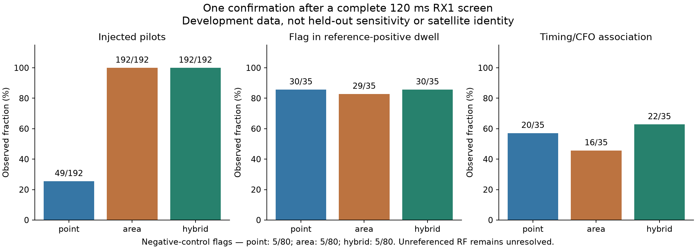
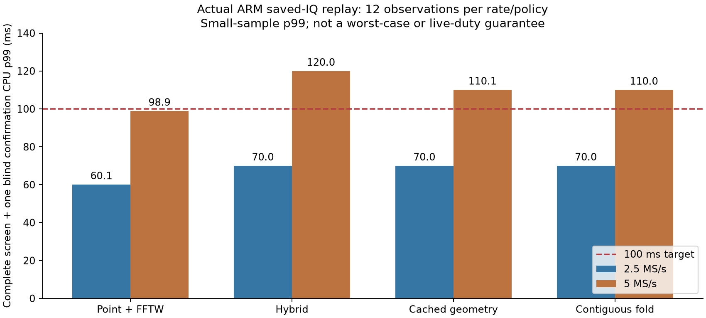

# Whole-dwell screening: FFTW, fractional-shift controls, and shared-fold selection

2026-09-08. **Implemented research improvements; not a qualified or deployed
scanner classifier.** All new execution used saved or synthetic IQ. Production
acquisition, FPGA, kernel and flashed firmware were unchanged. The active goal
still requires actual LIBIIO integration and verified unchanged capture duty.

## Outcome

The native detector now has an optional FP64 FFTW backend. A complete 120 ms
point-interpolated screen followed by one blind fractional GLRT confirmation
measures 98.9 ms p99 CPU at 5 MS/s on a small ARM replay. This improves the
earlier approximately 110 ms result, without changing the reviewed numerical
tolerances. However, new controls expose a serious window-selection weakness:
that policy detects only 49 of 192 strong injected-pilot cases when allowed
one confirmation. Confirming all six intervals detects all 192.

An area-averaged projection repairs this particular injected-pilot failure but
loses historical associations. The new **hybrid screen** shares one full-cell
IQ fold, evaluates both projections, and selects the projection whose best
window has the largest score ratio to its second-best window. It retains both
screens' scores, ordering, timing estimates, contrasts and selection in private
diagnostics. Ties choose point interpolation; the denominator floor is 1e-30.
No GLRT threshold, fractional confirmation or CFO search was changed.

Hybrid top-one confirmation detects all 192 injected-pilot cases, flags 30/35
reference-positive historical dwells, and associates 22/35 with the historical
timing/CFO reference, versus 20/35 for the point screen. It still falsely flags
5/80 negative controls. Final 5 MS/s mean CPU is 99.2 ms, but p99 remains
110.0 ms: **the 100 ms tail target still fails.** These are separate quality
and runtime failures, not a deployment pass.

## What was compared

All historical evaluations reuse the previously examined 96 RX1 dwells from
four scans, with both rates and all eight channel edges. These are development
data, not a fresh holdout. Each evaluation executes 384 complete dwells across
blind/seeded modes and two timing-grid settings per rate. The headline
comparison uses a 512-bin screen, blind confirmation, and the canonical timing
workspace settings of 2048/4096 bins at 2.5/5 MS/s. Blind mode does not use that
extra timing workspace. All 1,152 blind confirmation windows continue to match
the eight fields persisted by the original frozen numerical reference.

| One-confirmation policy | Injected-pilot flags | Flag in reference-positive dwell | Reference-associated dwell | Flags in 61 unresolved RF dwells | Negative-control flags |
|---|---:|---:|---:|---:|---:|
| Point interpolation | 49/192 | 30/35 | 20/35 | 11 | 5/80 |
| Area average | 192/192 | 29/35 | 16/35 | 8 | 5/80 |
| Shared-fold hybrid | 192/192 | 30/35 | 22/35 | 9 | 5/80 |

The distinction between columns matters. A flag somewhere in a reference-
positive dwell need not match the reference candidate. The 61 other dwells
are unresolved RF evidence, not verified negatives. Neither reference
agreement nor these injections independently establishes Starlink identity.
Adjacent intervals and repeated seeds are dependent; these counts must not be
presented as independent-trial confidence bounds or operational sensitivity.

### Synthetic controls

The frozen control configuration generates 272 complete 120 ms dwells across
both rates, both edges and four seeds. There are 192 pilot/pilot-plus-tone cases,
placing a strong pilot separately in every one of the six temporal intervals,
with a 0.35-sample fractional delay. The 80 negatives cover white noise, colored
noise, a stationary tone, two tones and a pulsed tone. Generation, clipping
counts, scores, failed decisions and every interval's confirmation are saved.

These pilots are deliberately strong: the hybrid-selected positive exact
scores exceed 0.99. This is a regression test for losing an obvious signal
through proposal resampling, **not a weak-signal sensitivity measurement**.
Short bursts crossing interval boundaries, wider delay/CFO sweeps and weaker
signals still require qualification.

Point interpolation is a proposal approximation, not an antialias filter.
Area projection integrates piecewise-constant native folded cells over each
output-bin interval. The strong fractional-shift control failures and their
recovery support resampling sensitivity as a practical issue; they do not
prove that this is the sole cause of every historical miss. Area averaging is
a different statistic, not an exact optimization or ideal low-pass filter.

### Remaining specificity problem

All three top-one policies accept three two-tone and two pulsed-tone controls
at the existing research margin of 0.025. Several two-tone cases have a strong
spectral peak but a negligible fitted stationary-tone power fraction, so the
nuisance fit is not applied. A stationary model also cannot completely remove
a pulsed envelope. The raw failures remain in the evidence, with no threshold
relaxation or replacement of scientific fixtures.

A post-hoc absolute-score sweep is a useful *next hypothesis*: additionally
requiring exact score >=0.175 retains 30/35 historical reference-positive flags
and 22/35 associations while rejecting the five known control false flags.
It reduces unresolved RF flags from nine to three. At 0.20 one reference-
positive flag is lost; at 0.25 three associations are lost. This is selection
on already-opened development data, **not a calibrated gate**. No such threshold
was installed or enabled. Fresh controls and a predeclared operating range are
needed before judging this direction.

## ARM runtime and exact optimizations

FFTW uses fixed double-precision arrays and `FFTW_ESTIMATE` plans constructed
at setup. No FFT planner search, wisdom import, allocation or FFT threading is
introduced into steady-state detector execution. Caller IQ is immutable. The
builtin backend remains the default; FFTW is explicitly selected at build time.
See the [FFTW API](https://www.fftw.org/fftw3_doc/Complex-One_002dDimensional-DFTs.html)
and [planner flags](https://www.fftw.org/fftw3_doc/Planner-Flags.html).

The hybrid initially cost 114.1 ms mean / 120.0 ms p99 CPU at 5 MS/s. Two exact
execution changes reduce its mean to 99.2 ms:

1. Precompute area-overlap geometry at setup and cache each projected value
   for centering and normalization, instead of calculating it twice.
2. Traverse full-cell folds contiguously instead of loading a redundant sparse
   group-index vector. Preserve widening int64 products, frame order, support
   counts and scalar tails; the sparse point-only comparator remains available.

All non-timing outputs are identical across the initial and both optimized
hybrid implementations on 384 historical and 272 synthetic executions per
variant, including both proposal diagnostics and complete candidate structures.

| Final hybrid, one confirmation | CPU mean | CPU p99 / maximum | Wall p99 / maximum |
|---|---:|---:|---:|
| 2.5 MS/s, blind | 60.0 ms | 70.0 / 70.0 ms | 62.9 / 62.9 ms |
| 5 MS/s, blind | 99.2 ms | 110.0 / 110.0 ms | 107.5 / 107.6 ms |
| 2.5 MS/s, seeded | 50.0 ms | 50.0 / 50.0 ms | 52.5 / 52.6 ms |
| 5 MS/s, seeded | 87.4 ms | 90.0 / 90.0 ms | 89.7 / 89.8 ms |

Unrounded measurements are retained. CPU clocks are visibly quantized on this
ARM, and each rate/mode contains only 12 observations: four distinct archived
dwells repeated three times. Neither p99 nor maximum is a worst-case guarantee.
Setup, template construction and file loading are excluded from these warmed
measurements. They are not original-arrival replay or live IIO streaming tests.
The seeded variant is not a quality-equivalent substitute: at the canonical
grids it flags only 27/35 reference-positive dwells and associates 19/35.

## Verification and provenance

- The focused final component suite passes 876 tests; two additional owned
  report-accounting tests pass. Coverage includes original and FFTW numerical
  paths, independent projection oracles (including bins narrower than native
  cells), shared-fold parity, invalid geometry, exact zero/tie behavior,
  immutable inputs, diagnostic invalidation, worker/pool, codec and host binding.
- Each of four ARM policies has 48 saved-IQ executions / 288 confirmations.
  The final hybrid matches both its desktop build and the original hybrid
  desktop outputs under the existing tolerances. Both screens' order, epochs,
  selection, contrast and scores are checked, not only the selected result.
- Twelve additional full-range CI16 ARM executions / 72 confirmations match
  desktop, exercising the contiguous NEON path at both rates and large counters.
- Final ASan/UBSan execution with leak detection passes 16 complete dwell runs
  / 96 confirmations. Candidate outputs match desktop and screen diagnostics
  are exact. The external FFTW library itself was not sanitizer-instrumented.
- FFTW-specific pytest dependencies are explicitly marked and require
  `FFTW_PREFIX`; missing installations are not silently skipped.
- Source/compiler/dependency hashes, build commands, compressed results and
  failed policies are preserved in the [evidence directory](evidence/2026_09_08_arm_presence_screen_quality/).
  No raw IQ or executable binaries are committed.

ARM replay used only the identity-attested idle spare
`104000b29905000e17000800065934759d` at `192.168.1.15`, with receive buffers
checked disabled before and after each invocation. The excluded serial was
not accessed. Programs never opened IIO or performed new RF collection.

The radio already contained FFTW 3.3.10; nothing was installed there. Its actual
library hash is `1331a476804e5812490f15c18f4b087859552716fb5933413606482642d61a19`.
The cross-link staging library differs bytewise; ABI/runtime identity and
numerical replay were checked against the actual radio library, not assumed
from the staging path. Desktop FFTW was built in temporary storage from the
official 3.3.10 archive after matching its SHA-256 to the local Buildroot hash:
`56c932549852cddcfafdab3820b0200c7742675be92179e59e6215b340e26467`.
Any release making this dependency mandatory still needs packaging/license review.

Final ARM executable SHA-256:
`2d42063e66b1406d973f9a089caccf7aca48940534fa3f8923f66c2266262f28`.
Retrieved saved-IQ output matches the remote hash
`d105709d8bc4f057dd5e7e30f714d2736e62a7d3399e74af0e702f0b85e6f88e`.

## Decision and next work

Keep these improvements and failures as opt-in, reproducible experiments.
Do not deploy or claim unchanged duty from mean CPU or a small replay p99.
The complete requested end state remains unfinished.

Next qualify a whole-dwell decision, including the absolute-score hypothesis,
on newly frozen controls and saved scans; address remaining timing cost without
discarding difficult intervals. In parallel as engineering work, extend the
existing collector/worker from 20 ms probes to 120 ms dwells and connect it to
the negotiated LIBIIO envelope using saved/synthetic inputs. Classifier enablement
must remain gated on quality and original-arrival streaming replay. The final
metadata-only drain, host/UI integration and explicitly authorized live
disabled/enabled duty comparison are still required. No remote push or deployment
is claimed here.

## Reproduction

Use `PYTHONDONTWRITEBYTECODE=1 PYTHONPATH=src:. OPENBLAS_NUM_THREADS=1` and the
project Python environment. All output directories must be new and outside
archive storage.

- `python -m tools.qualify_presence_dwell_controls OUTPUT --fftw-prefix PREFIX`
  compares the default point screen; add `--area-screen` or `--hybrid-screen`
  for the separately identified experiments.
- `python -m tools.evaluate_presence_dwell FROZEN_COHORT OUTPUT --multires
  --integer-fold --fftw-prefix PREFIX --hybrid-screen` executes the saved-IQ
  cohort and checks every blind confirmation against frozen persisted fields.
- Build ARM replay with `build_dwell_presence(..., executable=True)` and
  `fftw_options(STAGING_PREFIX, runtime_rpath=False)`; exact commands and
  definitions are recorded in each build receipt. Run only saved inputs on an
  attested idle spare; preserve guards, resource limits and output hashes.
- `python -m tools.report_presence_dwell_screen EVIDENCE NEW_FIGURE_DIRECTORY`
  regenerates the two figures and the distinction-aware quality summary.
