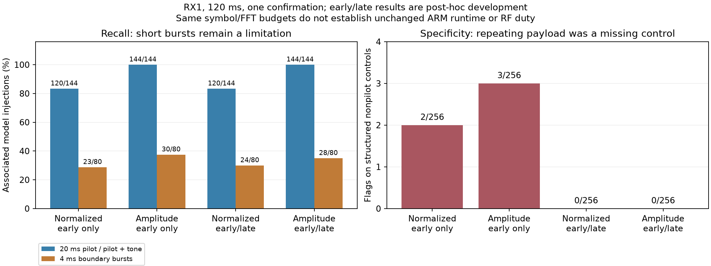

# RX1 GLRT: structured interference and known-symbol diversity

2026-09-08. **Offline development, not a deployed or qualified classifier.**
Implementation: `0026006e`. No new RF, FPGA/kernel/flashed-firmware changes,
production deployment or remote-main changes.

## Outcome

A fresh structured-interference challenge found **2/256 nonpilot flags** with
normalized ranking and **3/256** with amplitude-weighted ranking. Both failed
the frozen zero-false-flag challenge gate. Amplitude ranking recovered all
**144/144 primary pilot injections**, versus **120/144** for normalized ranking.

A default-off final-GLRT experiment alternates between two known-symbol regions.
On the now-opened challenge it removes those false flags without losing primary
associations. The existing 64-dwell RF comparison retains **26/35 within-dwell
reference associations** for both rankers. This is promising development
evidence, not a fresh pass or proof of operational false-alarm probability.

The [receipt and compressed evidence](evidence/2026_09_08_arm_presence_structured/receipt.json)
retain failed initial gates, ablations, source identities, RF comparisons,
timing, builds and tests. No IQ or executable binary is committed.

## New challenge and its limits

The [frozen protocol](../config/analysis/arm-presence-structured-challenge-v1.json)
contains 480 cases, both rates/edges, RX1, 512-bin screening, and one blind
fractional confirmation per 120 ms dwell:

- **256 nonpilot cases:** independent random QPSK or 16-QAM states, repeating a
  random frame or changing between frames, at 0 and 12 dB signal/noise ratio.
- **144 primary positives:** 96 clean 20 ms known-pilot injections and 48
  pilot-plus-tone cases. The latter have 0 dB pilot/noise SNR, 17 dB tone INR,
  and tone/pilot separations of -180, 0 and +220 kHz.
- **80 stress positives:** 4 ms bursts across 20 ms slice boundaries, at
  -6 and +6 dB SNR.

CFO stays within +/-360 kHz and epochs are fractional. The model evaluates
symbol states at local fractional frame time, without interpolation of the
detector's sampled template. Nonpilot symbols are not cyclic rolls or phase
rotations of known pilots. Independent sample-equation tests validate the model.

This eight-subcarrier baseband model is not a complete analog receiver,
channel, payload, multipath or satellite simulation. Reused seeds across
rates/edges/SNR make cases dependent; counts are not operational false-alarm
probabilities. Earlier invalid rolled-pilot labels remain documented in the
[previous report](2026_09_08_arm_presence_decision_checkpoint.md).

The decision hypothesis remains exact score >=0.175 and exact-minus-control
margin >=0.025, with complete fractional estimation. No threshold was retuned.

## What the implementation changes

`LEO_PRESENCE_GLRT_SYMBOL_DIVERSITY=1` is **off by default**. Final scoring uses
symbols 2–65 in even-numbered frames and 152–215 in odd-numbered frames. These
are contiguous 64-symbol regions spanning approximately 8.8–290.4 and
668.8–950.4 microseconds within a frame. Their GLRT spectra combine as before.
Nonadjacent regions are not concatenated and treated as adjacent symbols.

Each region uses its actual known template, sample positions and CFO rotation.
The final partial frame falls back to the original early region when necessary;
fractional interpolation support guards remain intact. Acquisition and the
epoch lattice are unchanged, including configurations with larger epoch-frame
budgets. Private rotation-cache validity covers both regions and invalidates on
changed CFO or fractional offset.

The 64-symbol-per-frame and FFT counts, confirmation budget, RX selection,
public structures, exact uint64/fractional timing separation and recorded IQ
remain unchanged. This is a **different statistic**, not an exact numerical
optimization. Filling a second rotation region can cost CPU despite unchanged
symbol/FFT counts. No classification policy is enabled.

## Results, including regressions

| Detector | Nonpilot flags / 256 | Primary associations / 144 | Boundary associations / 80 |
| --- | ---: | ---: | ---: |
| Normalized, early only | 2 | 120 | 23 |
| Amplitude, early only | 3 | 144 | 30 |
| Normalized + diversity | 0 | 120 | 24 |
| Amplitude + diversity | 0 | 144 | 28 |

The first two rows are the initial frozen comparison. Diversity rows are
**post-hoc development on opened data**. All 480 regenerated IQ/truth identities
match the original rows; selected window, acquisition CFO, fractional epoch and
epoch-lattice values remain unchanged. The final-source rebuild reproduces all
prototype numerical outputs, excluding execution timings.

Amplitude plus diversity passes the original bounded gate only on this opened
data. It loses two boundary associations versus amplitude alone and produces
one unassociated boundary flag. Short-burst recovery still prevents absence
claims. A fresh independent challenge is required before promotion.

The RF comparison uses the previous four sessions and 64 visits. The public
read-only adapter verifies manifests, IQ hashes, RX and exact counters. All
64 original normalized first results reproduce before comparisons. References
remain incomplete comparison evidence, not independent Starlink truth.

| RF metric | Normalized | Amplitude | Normalized + diversity | Amplitude + diversity |
| --- | ---: | ---: | ---: | ---: |
| Flags in 35 reference-positive dwells | 28 | 27 | 28 | 27 |
| Same-slice associations / 35 | 18 | 18 | 18 | 18 |
| Within-dwell associations / 35 | 26 | 26 | 26 | 26 |
| Flags in 29 unresolved dwells | 2 | 1 | 3 | 1 |

The extra unresolved normalized flag cannot be labelled true or false. Three
strong-reference misses remain: `7d7bc31311b79cfd/240`, `44105201bdaf5aa0/1447`
and `b89eba51117839b6/240`. Earlier all-window diagnostics find accepted evidence
in other slices. One selected slice has timing matching a reference elsewhere
in its dwell but a different acquisition CFO. Final-score specificity does not
resolve time-window selection or acquisition failures.

## Runtime evidence and tests

Five recurring calls per artifact/dwell alternate artifact order after each
scientific first run. Repeated numerical outputs must match their first result.
These are **1,280 paired desktop executions** on 64 RF dwells, not a new cohort,
original-arrival replay or live capture load.

| 5 MS/s desktop CPU | Normalized | Amplitude | Normalized + diversity | Amplitude + diversity |
| --- | ---: | ---: | ---: | ---: |
| Median | 1.738 ms | 1.769 ms | 1.778 ms | 1.743 ms |
| p99 | 2.018 ms | 2.013 ms | 2.013 ms | 2.035 ms |

The cost change is small and mixed. It proves neither a free improvement nor
ARM headroom. Last measured 5 MS/s ARM timings remain 113.47 ms CPU p99 and
126.62 ms copy-to-result p99. There is no new ARM or unchanged-duty claim.

- **613 component tests pass**, including independent direct-FFT/fractional-
  sampling oracles, cached/uncached paths, short-buffer fallback, original
  regressions and actual worker IPC/frame conversion for all four combinations.
- **16 instrumented processes pass:** 32 dwells, 192 confirmations, no
  ASan/UBSan/leak diagnostics, and numerical agreement with the corresponding
  uninstrumented builtin FFT backend. External FFTW itself is not instrumented.
- Both diversity workers cross-build for Cortex-A9/NEON using the existing
  userspace toolchain. No firmware source or image changes.
- Changed Python Ruff and whitespace pass. No golden fixtures, numerical
  tolerances or dependency requirements were relaxed.

An initial RF read without the `leo` group could not enumerate protected
sessions. The existing same-user/`leo`-group read procedure completed; no
archive permissions or contents were changed.

## Next gates and current hardware scope

1. Freeze a genuinely new challenge for amplitude plus diversity, retaining
   stronger structured interferers and short-burst stress. Do not reinterpret
   this opened-cohort ablation as qualification.
2. Isolate missed RF stages: slice ranking, candidate timing and CFO acquisition's
   fixed frame support. Test bounded alternatives before adding confirmations.
3. Hardware is restricted by the latest relayed user instruction to `.20`, `.21`
   or a currently locally USB-attached radio, with exact identity/ownership
   checks. **Do not use `.15`**; its SSH-key issue is no longer a dependency.
   Preserve excluded serial `104000bac4950008230026001b440a003a` and the active
   `.18` FPGA canary. Local USB descriptors confirm two Winbond-serial radios
   and `1040007c4a94000211000b009186843ef2`; the latter has an R18 mapping in
   existing firmware reports and is not selected. Candidate spare:
   `winbond-db620818a328172c`, pending current role/LAN/ownership verification.
   Both `.20` and `.21` fail their saved SSH host-key checks before authentication;
   expected reboot key regeneration is context, not independent identity proof.
   No trust entry was replaced and no remote command ran.
4. Finish ARM saved-IQ timing, original-arrival/load replay, userspace release/
   rollback checks and explicitly authorized live disabled/enabled duty tests.
   New options and runtime classification remain disabled. The goal is unfinished.

Follow-up: the [fresh holdout and actual ARM checkpoint](2026_09_08_arm_presence_holdout_checkpoint.md)
closes the fresh synthetic gate, verifies an allowed USB spare over its LAN
interface, and measures 120 ms-paced worker execution. Live unchanged duty
remains unverified.
