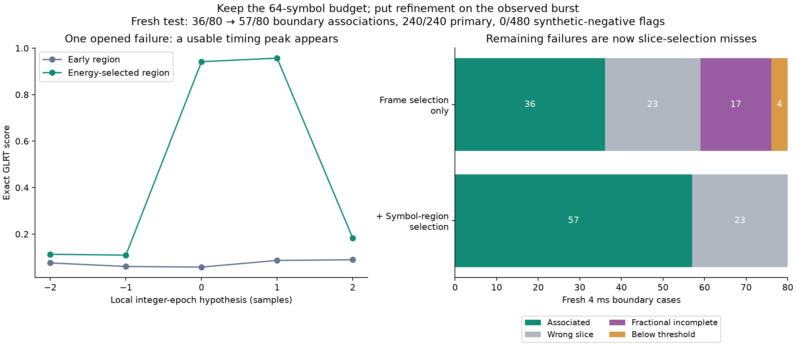
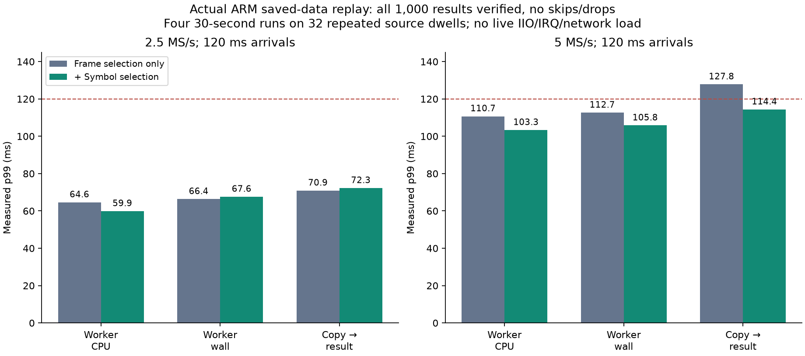

# RX1 GLRT: put timing refinement on burst-bearing symbols

2026-09-08. Implementation **`8cb029b7`**. **Default-off; actual ARM saved-IQ
execution verified, but no live RF, deployed classifier, or unchanged-duty claim.**

## Outcome

The remaining fractional-refinement weakness had a concrete temporal cause:
choosing a frame containing burst energy does not ensure that its **early
64-symbol region** contains the burst. Selecting the stronger early/late region
within the same two-frame budget recovers all 17 investigated failures, with
independent direct-FFT and actual blind native-C agreement.

A genuinely fresh comparison improves 4 ms boundary-burst association from
**36/80 to 57/80**, including **40/40 at +6 dB**. Both versions retain **240/240
primary signals** and produce **0/480 synthetic-negative flags**. Saved-RF
within-dwell reference agreement stays at **27/35**.

Four 30-second saved-IQ ARM replays return **1,000/1,000 verified results** with
no skips/drops. At 5 MS/s the revised worker's wall p99 is **105.82 ms**, and
copy-to-result p99 is **114.38 ms** against 120 ms arrivals. This is encouraging
worker-only evidence, not proof that live acquisition fits the remaining margin.

## Diagnosis, then bounded implementation

The [preceding energy-support checkpoint](2026_09_08_arm_presence_energy_support_checkpoint.md)
left 17 boundary cases with initial CFO within 8 kHz of truth but an incomplete
fractional estimate. None had tone removal applied. Regenerated IQ identities
match their original saved rows. An independent direct 512-point FFT of the
64 symbol correlations reproduces both their exact and control five-cell
integer-epoch grids at `rtol=1e-9`, `atol=1e-10`.

For each selected acquisition frame, compare received energy in symbols 2–65
and 152–215. Freeze the stronger region at the coarse epoch before evaluating
the five timing hypotheses. All 17 cases choose late support in at least one
frame, regain a bracketed peak, and pass the unchanged fractional/score/truth
association checks. The actual **blind whole-dwell C implementation** recovers
the same 17 cases and matches the independently calculated grids. This is
opened-case diagnosis, not a fresh sensitivity estimate.

`LEO_PRESENCE_ENERGY_SYMBOL_SUPPORT=1` implements the change and requires
`LEO_PRESENCE_ENERGY_SUPPORT=1`. Both remain default-off. It:

- Keeps one confirmation, two CFO acquisition frames and two epoch frames.
- Keeps **one contiguous 64-symbol region per frame**; it does not maximize
  over extra GLRT evaluations or concatenate nonadjacent symbols.
- Uses actual template indices and local sample positions for the chosen
  region. The region remains fixed across the timing hypotheses.
- Preserves final fractional GLRT's existing support and alternating-region
  statistic. No truth/CFO seed, IQ rebasing, integer-counter conversion or
  recorded-IQ modification is introduced.
- Carries region choices with each candidate and resets them for later work.
  Cached/uncached paths and the public final-score operation remain covered.

The extra region-energy pass and rotation setup cost CPU, and recovered cases
can now execute final scoring that previously aborted. An unchanged configured
FFT/symbol budget does **not** mean identical execution time.

## Fresh synthetic and saved-RF results

The [576-case protocol](../config/analysis/arm-presence-symbol-support-challenge-v1.json)
and separately frozen 224 nuisance cases use 800 distinct seeds, disjoint from
the preceding challenges. Variants see identical IQ. Rates are 2.5/5 MS/s,
both channel edges, RX1 only; confirmation is blind. No threshold changed:
complete fractional estimation, exact score ≥0.175, margin ≥0.025, with truth
association within 2 µs circular epoch and 8 kHz final CFO.

| Fresh comparison | Frame selection only | + Symbol-region selection |
| --- | ---: | ---: |
| Primary association: 20 ms, −6 to +12 dB / pilot-plus-tone | 240/240 | 240/240 |
| Boundary association: 4 ms, −6 dB | 9/40 | 17/40 |
| Boundary association: 4 ms, +6 dB | 27/40 | 40/40 |
| Total boundary association | 36/80 | 57/80 |
| Unassociated boundary flags | 0 | 0 |
| Structured nonpilot false flags | 0/256 | 0/256 |
| Other nuisance false flags | 0/224 | 0/224 |

There are **21 gains and no losses** in the paired boundary comparison. The
frame-only baseline differs from the earlier 39/80 because these are new draws.
All 23 remaining failures select a 20 ms slice containing no injected burst;
all occur at −6 dB. Thus 57/57 overlap-selected cases associate in this bounded
test, but overall boundary sensitivity is **57/80**, not 100%.

Structured negatives use independently generated QPSK/16-QAM states. Additional
controls cover white/colored noise, tones, double/pulsed tones, chirps and
clipped tones. These models do not cover every analog channel or interferer.
**0/480 is not an operational false-alarm probability**, and missed/unconfirmed
input must not become an absence claim.

The existing four-session, 64-dwell RF cohort is read through the read-only
archive adapter. All input identities and original frame-only outputs verify.
Both methods yield 18/35 same-slice and 27/35 within-dwell reference matches,
29/35 flags in reference-positive dwells, and 1/29 flags in unresolved dwells.
No reference association is gained or lost. This opened corpus is comparison
evidence, not independent Starlink identity truth.

## Actual ARM timing, with limits

Only the currently USB-attached `winbond-db620818a328172c` spare is used, via
physical Ethernet **192.168.1.14**, not USB networking. USB path, exact serial,
pinned SSH key, Ethernet MAC/address, shared ownership lock, inactive receive
buffers, network clients and competing benchmark processes are checked around
execution. Production `.20`/`.21`, `.15`, the `.18` canary and excluded serials
are untouched.

The first 16 saved complete dwells per rate in the existing frozen corpus order
are repeated at 120 ms arrivals. Each 30-second run submits 250 dwells. The
real worker consumes the shared-memory pool; all fractional candidate fields,
screen diagnostics and source identities match the corresponding desktop build.
The pool never has more than one occupied slot in these runs.

| Revised worker metric | 2.5 MS/s | 5 MS/s |
| --- | ---: | ---: |
| Worker CPU p99 | 59.89 ms | 103.35 ms |
| Worker wall p99 | 67.62 ms | 105.82 ms |
| Maximum worker wall | 68.37 ms | 106.22 ms |
| Copy-to-result p99 | 72.25 ms | 114.38 ms |
| Maximum copy-to-result | 73.09 ms | 114.68 ms |
| Results | 250/250 | 250/250 |

The two frame-only comparison runs also return 250/250 each. The 5 MS/s CPU
p99 still exceeds the ≤100 ms development target. CPU-clock granularity,
sequential execution, inherited affinity and repeated source dwells limit tail
and speedup claims. The paired desktop CPU differences are small; concurrent
desktop work inflated some wall-time tails, so those are not ARM estimates.

Inputs arrive in bursts of 32,768-sample chunks, not the original DMA/retune
timeline. No IIO/IRQ/network acquisition load or complete SDK producer is
running. These are **four 30-second replays, not a new 300-second RF capture**.
Setup/loading precede the replay clock. Result latency itself is not lost RF
duty; conversely, keeping up here does not prove unchanged live duty.

## Tests, cleanup and next work

**488 selected tests pass:** 466 analysis/generator regressions and 22 tests of
the new worker variant, including IPC and fractional frame conversion. The
worker selection deselects 143 other cases; no rerun of those is claimed.
Direct-FFT tests cover both rates/edges, cached/uncached execution, early/late
bursts and 2 ms terminal support. Eight ASan/UBSan/leak-checked processes verify
16 dwells and 96 confirmations against the same uninstrumented builtin FFT
backend. External FFTW itself is not instrumented. Ruff, formatting and
whitespace pass; golden fixtures and tolerances are unchanged.

The eight uploaded RAM-only benchmark files and their private directory were
removed after exact inventory/hash and idle checks. Original host artifacts
remain available. Installed iiOD, FFTW and core-library hashes are unchanged.
Cleanup reports no retained scratch or errors; the radio lock is released.
No firmware, FPGA, kernel, installed package, production service or RF state
was changed. No new listener or receive buffer was opened.

The goal is **not complete**. Current SDK collection still passes a null
decision policy, and the existing public session mode requires `unavailable`
verdicts. Numerical recovery does not automatically enable positive labels.
Next work should connect a reviewed positive-only policy through a
compatibility-safe contract/profile path, preserving unknown rather than
absence; then verify the revised worker under the full SDK producer workload
and explicitly authorized detector-off/on RF comparisons. Weak-slice ranking
remains the measured sensitivity opportunity, without increasing confirmations.

Nothing is pushed, remotely merged or deployed by this checkpoint.
[Raw evidence, builds, protocols, diagnostics, ARM receipts and recipes](evidence/2026_09_08_arm_presence_symbol_support/index.json)
retain 147 hash-checked non-IQ/non-executable artifacts and two PNG figures.
