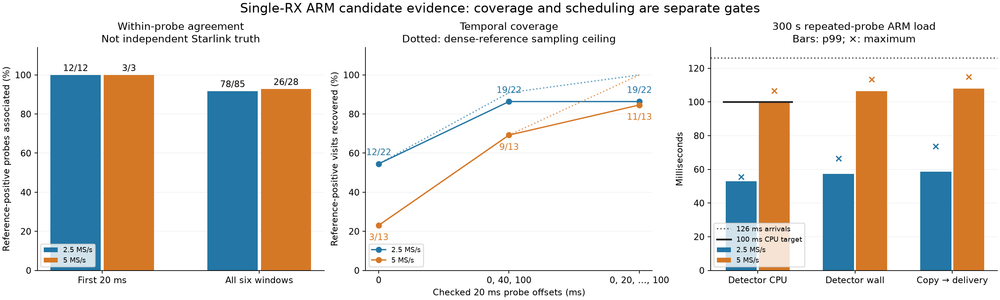

# Single-RX ARM worker: held-out coverage and 300-second paced loads

Date: 2026-09-08. Status: **worker prototype implemented and tested; not
integrated into iiOD or deployed**. All radio experiments used saved IQ or
synthetic zeros on an idle spare. No RF collection, FPGA, flashed-firmware,
kernel, or production-configuration changes occurred.

Goal update received after these experiments: the final product must classify
scanner dwells and carry the result in LIBIIO frame data without reducing
scanner duty. This checkpoint is a reusable numerical/worker foundation, not
that completed product. The [revised plan](../docs/architecture/arm-single-rx-presence-plan.md)
requires whole-dwell classification qualification and a negotiated frame-data
extension; a separate result connection and a 0.5-point duty allowance are no
longer the intended end state.

## Outcome

The isolated native worker completed **2,381 checks at each sample rate** in
separate 300 s paced loads. All **4,762 results matched desktop** within the
previously frozen numerical tolerances. Neither run skipped a probe, lost a
result, or accumulated an end-of-run backlog.

CPU p99 was **53.0 ms at 2.5 MS/s and 100.32 ms at 5 MS/s**. Consequently,
the strict 100 ms CPU gate **still fails at 5 MS/s**. Good observed throughput
at 126 ms spacing does not erase that failure or establish live acquisition
headroom. A preceding short smoke also exposed a 206 ms wall-time execution;
the longer run does not make that observation disappear.

Fresh held-out data separately show that a first-window negative cannot
describe an entire visit: reference evidence was present in the first 20 ms
of only **15 of 35 visits** that had reference evidence somewhere in their
six-window tiling. The detector associated all 15 reference-positive first
windows, but that is neither whole-visit coverage nor proof of Starlink identity.

## Held-out experiment

The detector was frozen at implementation commit `4efa904f`. The four scans
were selected from metadata before opening their IQ, excluding the previously
examined development and historical holdout sessions. No numerical detector
code was changed during this checkpoint.

| Scan | Rate | Recorded creation time, UTC |
|---|---:|---|
| `scan-hop-43cc401e05cbe425` | 5 MS/s | 2026-09-08 04:22:45 |
| `scan-hop-2c7a4d21e9d2a576` | 2.5 MS/s | 2026-09-08 04:40:03 |
| `scan-hop-db578e8636677ae0` | 5 MS/s | 2026-09-08 05:02:56 |
| `scan-hop-228b5ad75bb549f3` | 2.5 MS/s | 2026-09-08 05:20:03 |

Each scan contributes complete eight-target sweeps 20, 140, and 260, using
RX1 only. Six non-overlapping 20 ms windows at offsets 0 through 100 ms tile
each selected visit: **96 visits and 576 probes**. Each probe is compared with
the eight-candidate dense fractional reference. Reference association retains
the existing circular timing tolerance of 2 microseconds and CFO tolerance
of 8 kHz; neither was relaxed.

| Rate | Reference-positive probes | Native flags on those probes | Reference-associated | Additional unresolved RF flags |
|---|---:|---:|---:|---:|
| 2.5 MS/s | 85 | 80 | 78 | 57 |
| 5 MS/s | 28 | 26 | 26 | 56 |

Across all windows there are seven missed reference-positive probes and two
additional timing/CFO association failures. The 113 additional RF flags are
**unresolved**, not established false alarms and not established new Starlink
detections. The dense reference itself is numerical evidence, not independent
signal truth. Repeated windows within four scans are statistically dependent.

### Timing of the check matters

The following counts use visits with dense-reference evidence somewhere in
their six-window tiling as the denominator. They count native **reference
associations**, not arbitrary positive flags in those visits.

| Checked offsets, ms | 2.5 MS/s associated visits | 5 MS/s associated visits |
|---|---:|---:|
| 0 | 12/22 | 3/13 |
| 0, 40, 100 | 19/22 | 9/13 |
| 0, 20, 40, 60, 80, 100 | 19/22 | 11/13 |

Even the dense reference at offsets 0, 40, and 100 covers only 20/22 and 9/13
of the reference-positive visits. Some loss therefore comes from sampling time,
before considering the lightweight detector. Running three or six probes also
requires more compute; this offline comparison does **not** qualify those
schedules on ARM. A rotating single-probe offset remains a future experiment.

The [freeze](figures/2026_09_08_arm_presence_worker/freeze.json),
[input inventory](figures/2026_09_08_arm_presence_worker/inputs.json),
[results](figures/2026_09_08_arm_presence_worker/results.json), and
[verified summary](figures/2026_09_08_arm_presence_worker/holdout-summary.json)
retain the complete selection and accounting. Raw IQ is excluded from Git.

## Worker implementation

The scanner owns the collector and process boundary; the existing native
numerical library remains independent of IIO, HTTP, storage, and PostgreSQL.

- Three preallocated CI16 slots separate filling, ready, and in-use storage.
  The current implementation reserves the 5 MS/s maximum at both rates:
  **1,234,944 bytes**, including the bounded 64-result ring and bookkeeping.
- The collector copies only the configured RX and valid sample interval. It
  accepts split or strided blocks without retaining their source buffer.
  Counter gaps abort an incomplete probe; full slots reject detector work
  without overwriting in-use samples or waiting for the worker.
- The worker is a separate native process. It closes unrelated inherited
  descriptors, receives only shared memory, a notification pipe, and read-only
  template data, and creates one numerical workspace per edge before readiness.
- When launched as root on ARM, it drops supplementary groups and changes to
  UID/GID 65534, with `no_new_privs`. It has bounded CPU, address space, and wall
  lifetime. Parent-exit signaling is reapplied after credential changes.
- Results carry the original request identity, fractional candidate evidence,
  and tone-conditioning diagnostics. Failure is unknown, never a negative
  detection. Full result retention drops explicitly counted evidence rather
  than blocking the worker or capture.

This is a private same-build IPC layout, not a new published wire contract.
There is not yet an iiOD collector adapter, session controller, result-read
command, host persistence adapter, or advisory UI integration.

## Actual ARM qualification

The target was spare serial `104000b29905000e17000800065934759d` at
`192.168.1.15`, using its pinned SSH identity. The excluded radio was not
accessed. Receive buffers were checked disabled before, between, and after
experiments. Binaries and data stayed in owned temporary storage.

The native parent first passed ten zero-input jobs at each rate. A 16-job
recorded-probe smoke preserved all numerical outputs but observed an upper-edge
job with 153.4 ms CPU and 206.1 ms wall latency. Its queue reached two occupied
slots and recovered without dropping work. The cause of that isolated tail is
not established; it remains in the saved smoke receipt.

The longer experiment repeatedly cycles through all 48 held-out first-window
probes at each rate, submitting one every 126 ms for 300 s. Inputs are loaded
before pacing. Original source counters and visits remain attached to each
probe; the sequence number identifies the repeated workload iteration.
**This is not an original 300 s scan replay.** It does not reproduce DMA block
arrivals, receive interrupts, dual-RX forwarding, retune metadata delays, or
network acquisition contention.

| Rate | CPU p50 | CPU p95 | CPU p99 | CPU max | Wall p99 | Wall max | Copy-to-delivery p99 / max |
|---|---:|---:|---:|---:|---:|---:|---:|
| 2.5 MS/s | 44.8 ms | 51.0 ms | 53.0 ms | 55.5 ms | 57.3 ms | 66.4 ms | 58.6 / 73.7 ms |
| 5 MS/s | 85.5 ms | 95.8 ms | 100.32 ms | 106.6 ms | 106.4 ms | 113.3 ms | 107.8 / 114.9 ms |

Both long runs submitted and recovered all 2,381 jobs, with maximum observed
slot occupancy one. Maximum submission lateness was 2.02/1.35 ms at 2.5/5 MS/s;
maximum copy duration was 2.08/3.46 ms. The result-reader polling interval adds
to measured delivery latency. Worker CPU timings include CI16 conversion but
exclude initialization and parent work. CPU accounting is coarse on this ARM.

The worker ran as a single thread at nice 19, unpinned across the two CPUs.
A mid-run 5 MS/s process inspection showed 19,260 KiB RSS high water, no
effective capabilities, and `no_new_privs=1`. This is an observation during the
run, not a terminal peak-memory measurement. The parent's preloaded test corpus
is additional memory and is not part of the proposed production collector.

The [execution receipt](figures/2026_09_08_arm_presence_worker/execution-receipt.json)
pins the parent/worker identities, source hashes, target checks, and matching
radio/local output hashes. The
[2.5 MS/s](figures/2026_09_08_arm_presence_worker/paced-2500000-summary.json) and
[5 MS/s](figures/2026_09_08_arm_presence_worker/paced-5000000-summary.json)
verifiers check every sequence, source counter, channel/edge, candidate,
fractional offset, CFO, score, gate, and tone-fit diagnostic against desktop.

## Tests and decision

- 500 focused native, holdout, worker, verifier, and report-accounting/rendering
  tests passed. These use synthetic data or saved report
  evidence, not hidden radio or database dependencies.
- Worker tests cover strong fractional pilot evidence at both rates, both
  edge workspaces, exact counters above 2^53, immutable caller IQ, split/strided
  input, guards, gaps, duplicates, queue and result overflow, stale identities,
  malformed/writable templates, incomplete-probe EOF, stalls, crashes, and
  parent death. Process handles are used for exact-child cleanup.
- Desktop and ARM smoke tests exercise a native parent and native worker,
  rather than relying on Python being available on the radio.
- ASan/UBSan-instrumented desktop parent and worker completed eight saved-IQ
  jobs at each rate without diagnostics; all 16 outputs matched desktop.
  These sanitizer timings are not ARM performance measurements.
- Freshly fetched remote main `29be8492` is already an ancestor of the
  implementation branch. Production acquisition was checked active; no
  production service or radio configuration was changed.

**Decision: continue implementation; do not deploy yet.** The bounded worker
handoff and repeated-probe throughput now have concrete evidence. The strict
5 MS/s CPU target still misses, and the full C4/C5 capture integration gates
remain open. Next: profile the persistent worker for additional timing margin,
exercise original counter/block/metadata arrival patterns through the capture
adapter, then qualify versioned iiOD/host/UI transport and lifecycle behavior.
Any new live RF verification requires explicit authorization and stays bounded.

The revised realtime frame-carried dwell-classification objective remains
unfinished. This report
does not claim a remote merge, production deployment, live duty measurement,
whole-visit absence detector, or independent Starlink identification.

## Reproduction

Use `PYTHONPATH=src:.`, `OPENBLAS_NUM_THREADS=1`, and the implementation Python
environment. Archive access is read-only through the public analysis-source
adapter; generated output directories must be new and outside archive storage.

1. `tools/freeze_native_presence_holdout.py ARCHIVE NEW_OUTPUT` freezes and
   scores the metadata-selected cohort. The already-opened cohort is no longer
   an untouched holdout for any future algorithm tuning.
2. `tools/summarize_presence_holdout.py INPUT_DIRECTORY NEW_SUMMARY` verifies
   identity and separates per-probe agreement from temporal coverage.
3. `tools/qualify_presence_worker.py prepare INPUT_DIRECTORY NEW_PACK RATE`
   packages every first-window probe at that rate, without selecting on score.
4. Cross-build the pinned worker and the native parent fixture. Run the parent
   as `PARENT WORKER TEMPLATE_FILE PACK_FILE 300000` on the attested idle spare.
   This invocation never opens IIO or a receive buffer.
5. `tools/qualify_presence_worker.py verify MANIFEST RAW NEW_SUMMARY 300000`
   verifies all outputs and reports timing without rounding a missed gate away.
6. `tools/report_presence_worker.py EVIDENCE_DIRECTORY NEW_PNG` renders the
   coverage and runtime figure from saved verified summaries.
