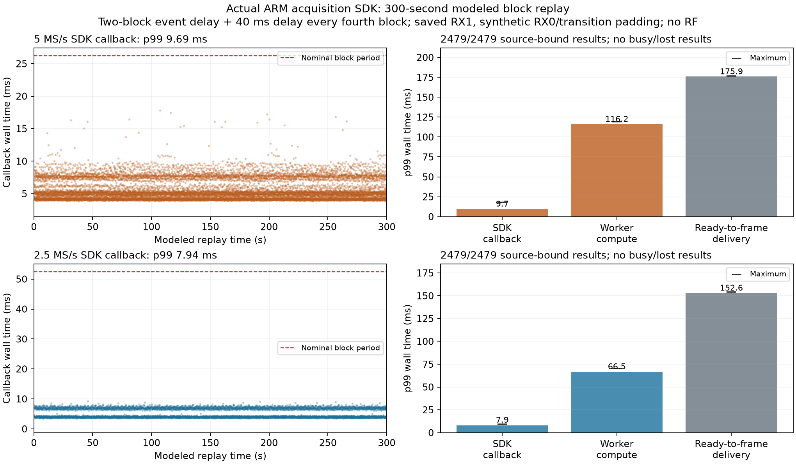

# Scanner GLRT: actual acquisition SDK under modeled block load

2026-09-08. Implementation `4a336c0f`. **Saved-IQ ARM verification, not live RF
or a deployment.** No FPGA, kernel, flashed firmware, installed library or
production service changed. Detector thresholds and default enablement did not
change. The complete realtime classification/unchanged-duty goal remains open.

## Outcome

The real acquisition SDK, isolated optimized worker and LGC1 frame codec run
together on the verified ARM spare for **300 seconds at each rate**, with
131,072-sample dual-RX blocks, two-block-late hop events, and a modeled 40 ms
delay on every fourth block. Both runs deliver **2,479/2,479 results** with exact
source binding and numerical agreement. No result is busy, failed, incomplete
or missing. No measured SDK callback exceeds the nominal block interval.

| 300 s delayed-event/burst test | 2.5 MS/s | 5 MS/s |
| --- | ---: | ---: |
| Results / scheduled complete visits | 2,479 / 2,479 | 2,479 / 2,479 |
| Blocks | 5,722 | 11,443 |
| Nominal block interval | 52.43 ms | 26.21 ms |
| SDK callback median | 4.29 ms | 5.06 ms |
| SDK callback p99 | **7.94 ms** | **9.69 ms** |
| Maximum SDK callback | 9.28 ms | 17.84 ms |
| Callbacks exceeding nominal block interval | 0 | 0 |
| Worker wall-time p99 | 66.52 ms | 116.18 ms |
| Maximum worker wall time | 70.26 ms | 119.18 ms |
| Input-ready callback to result-frame p99 | 152.63 ms | 175.88 ms |
| Maximum input-ready callback to frame | 153.87 ms | 176.36 ms |
| SDK open/worker-ready setup, before replay clock | 83.45 ms | 121.51 ms |

The result count is deliberate, not lost work: the model schedules
`floor(300000 / 121) = 2479` complete visits, each containing 120 ms valid IQ and
1 ms **synthetic** transition padding. It waits through the remaining 41 ms
without registering another partial visit. Neither this modeled schedule nor
its implied valid-time fraction is a measurement of scanner duty.

## Why this test was necessary

The [worker-only replay](2026_09_08_arm_presence_300s_checkpoint.md) did not
include the SDK's dual-RX history collection and additional pool copy. The new
runner uses only the public `scanner_glrt.h` API. It does not access private
pool structures or replace the collector, worker or frame codec with mocks.

It measures SDK visit registration, block ingestion, result collection and
frame encoding on the producer side while the real numerical worker executes
asynchronously. At 5 MS/s the combined workload raises observed worker wall
p99 from 107.63 ms in the previous worker-only run to **116.18 ms** here.
Different schedules and source materialization prevent attributing that entire
difference to a particular SDK function, but the earlier run was clearly not
a complete workload measurement.

The producer's construction of a test block is measured separately. In the
5 MS/s long run its median is 3.00 ms, p99 5.09 ms and maximum 13.28 ms; this
synthetic-source cost is **not** reported as SDK callback cost or real DMA cost.
Formatting/flushing the research JSON output is also outside the SDK callback
timer, while its effect on subsequent arrivals remains observable. Individual
stage maxima/percentiles must not be added as if they occurred together.

## Three different timing quantities

1. **SDK callback:** time synchronously spent in the acquisition-facing API.
   This consumes the producer's per-block processing budget. Its 5 MS/s
   worst observed duration leaves 8.37 ms of the nominal 26.21 ms block period
   for other work, not proof that actual IIO/network overhead fits that margin.
2. **Worker compute:** asynchronous full-dwell screening and confirmation.
   It must sustain the incoming job rate without exhausting the bounded pool;
   it does not run as a blocking 100 ms callback in the capture loop.
3. **Input-ready to result frame:** elapsed time from the later of valid-IQ
   arrival and hop-event availability to the carrier/drain frame containing
   that result. It includes collection, computation and waiting for a later
   frame. A 176 ms result latency therefore does not mean a 176 ms acquisition
   stall or a lost dwell. Complete result inventory is checked independently.

Every fourth block is deliberately delivered 40 ms late. At 5 MS/s that delay
crosses a nominal 26.21 ms boundary and creates back-to-back work. The recorded
`arrival_lateness_ms` is relative to each requested jittered timestamp; part of
the following block's lateness is inherent in this model, not an unexplained
failure to honor the requested schedule. It must not be interpreted as measured
RF sample loss. Actual block counters remain ordered and complete.

## Frozen workload and source fidelity

- RX1 uses the same hash-checked 16 saved full dwells per rate as the previous
  qualified numerical replay. These are excerpts from disjoint sweep locations,
  repeated in frozen order; they are not a continuous new 300-second RF source.
- RX0 contains a synthetic, distinct sentinel. Invalid transition intervals
  contain separately identified synthetic sentinels. None is represented as
  captured IQ or used as signal-absence truth.
- Replay counters start at `2^53 + 217`. Original source counters and visit
  identities are retained separately. Modeled offsets are formed using integer
  arithmetic; fractional epoch offsets stay separate throughout frame encoding.
- Non-dwell-aligned 131,072-sample blocks cross visit and transition boundaries.
  The SDK must extract exactly the valid RX1 interval even when hop metadata is
  observed two block deliveries later.
- The verifier decodes the actual public metadata contract, checks all carrier
  and FINAL sequence numbers, unchanged opaque legacy bytes, source association,
  receiver/rate/channel/edge, search coverage and every serialized scientific
  measurement against the pinned full-dwell reference. Counters must be exact;
  floating-point comparisons retain `rtol=1e-9`, `atol=1e-10`.
- Setup and input loading precede the replay clock. First processed visits are
  included. The final result drain is metadata-only and opens no extra input.

The model is necessary because the audited stored manifests lack individual
IIO-block host arrival times. This experiment is explicitly not original-arrival
replay. The 1 ms padding is not an assertion that actual hardware retunes take
only 1 ms.

## Short tests, gating and safety

Six 15-second ARM cases precede the long runs: enabled normal and delayed/burst
cases at both rates, plus disabled delayed/burst baselines. Each schedules 123
visits. All four enabled short cases deliver every result; disabled runs produce
no classification frames. Their SDK-off callback scaffolding takes less than
0.006 ms, establishing a producer-only baseline, not a live scanner baseline.

The frozen recipe permits the 300-second cases only if prior numerical/frame
checks pass and no prior callback exceeds the nominal block interval. Both
long cases satisfy the same checks. Across enabled short and long runs,
**5,450/5,450 result records** are verified. These repeated inputs are not
independent statistical detection trials.

Only currently USB-attached `winbond-db620818a328172c`, accessed over physical
LAN **192.168.1.14**, is used. The shared radio lock, USB identity, pinned SSH
identity, inactive capture buffers and absence of another network client are
checked around the runs. Production `.20`/`.21`, excluded hardware and the FPGA
canary are not used. The parent and worker use nice 10 with inherited affinity;
no pinned-core or worst-case IRQ-contention claim is made.

The actual SDK and its worker have bounded memory/process lifetimes. The worker
drops privileges and has no IIO handle. SDK, worker, exact FFTW dependency,
templates and packs are uploaded to a new RAM directory and hash-checked before
and after execution. Only those enumerated temporary files and their empty
directory are removed. Installed firmware/libraries remain untouched; local
copies are retained.

## Tests and retained failure

**185 component tests pass**, zero failures/errors/skips. The 38 new replay
tests exercise both rates, normal/late/burst/disabled modes, fractional positive
controls, source counters above 2^53, strict result verification, missing FINAL,
mutated source/geometry/timing/candidate evidence, invalid CLI parameters and
actual build/dependency hashes. Existing SDK/worker/request/frame tests continue
to cover cancellation, gaps, unavailable history and worker failures.

Four additional **ASan/UBSan/leak-instrumented SDK processes and four instrumented
workers** produce 32 verified result records using normal and delayed/burst
synthetic packs at both rates. All exit zero with empty stderr. This uses the
builtin numerical backend; ARM instructions and external FFTW are not covered
by that sanitizer statement. Formatting, Ruff and whitespace checks pass.

The first desktop test attempt reports six passes and 32 fixture setup errors:
new test templates and worker files inherited group-write permissions. The
SDK's trusted-file check correctly refused startup. The fixture now explicitly
uses 0600 templates and a 0755 worker; the guard was not weakened. Startup
rejections now include the SDK error code in stderr. The failed JUnit and later
passing runs are retained; no detector tolerance or golden fixture changed.

## Remaining requirements

This closes the **modeled acquisition-SDK load** checkpoint. It does not prove
the requested unchanged live duty: the actual IIO refill, iiOD provider lock,
network path, IRQ contention and hardware retune timing are absent. The complete
provider/network/host path has separate offline integration tests, not a live
combined measurement. Result delivery under modeled load is not scientific
qualification of every dwell.

The next implementation step is a small userspace release bundle and startup
attestation: real worker/template/SDK/FFTW/daemon hashes, matched compiled
algorithm/configuration identities, explicit opt-in and verified rollback.
The current provider compares configured identity strings; those strings alone
do not prove that deployed files match. Test-only `12`/`34` identities in this
replay must never become release identities.

After packaging checks, obtain explicit authorization for bounded GLRT-off/on
RF comparisons at both rates on an allowed idle spare. Compare device-counter
valid-duty accounting, missing samples/overflows, retune timing, complete libiio
result delivery and cleanup. Keep short-burst/CFO/slice sensitivity and positive
decision qualification explicit; unconfirmed input must not become an absence
label. Runtime classification remains disabled/unqualified until those gates.

[Execution receipt, raw data and reproducible recipes](evidence/2026_09_08_scanner_glrt_sdk_replay/receipt.json)
are retained with the figure. No IQ or executable is committed. Nothing from
this checkpoint was pushed, merged into remote main or deployed.
