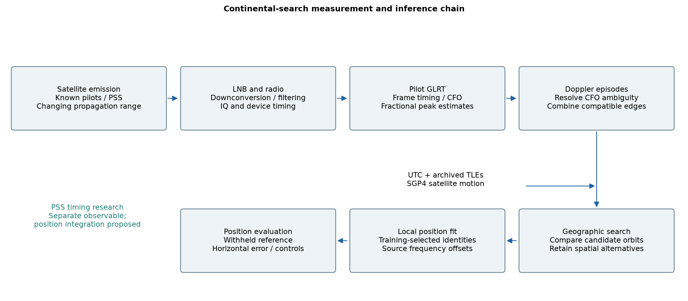
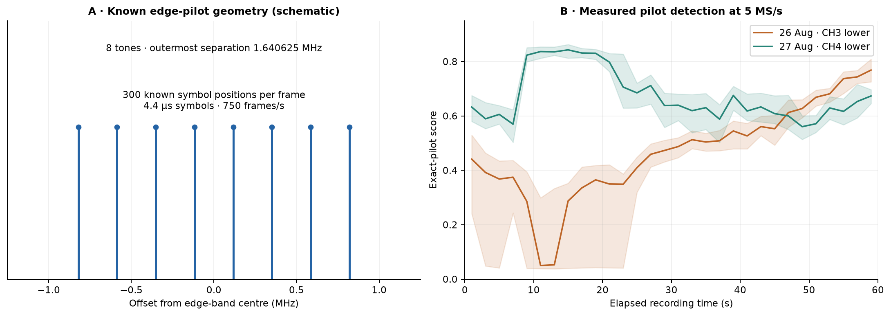
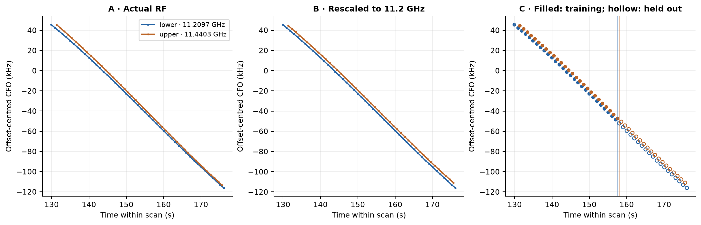
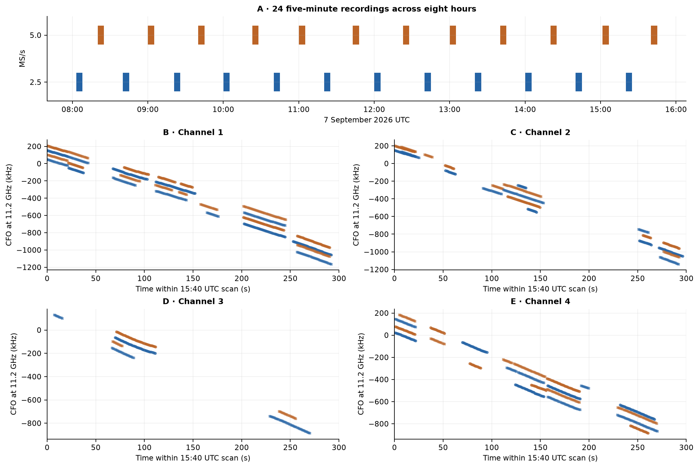
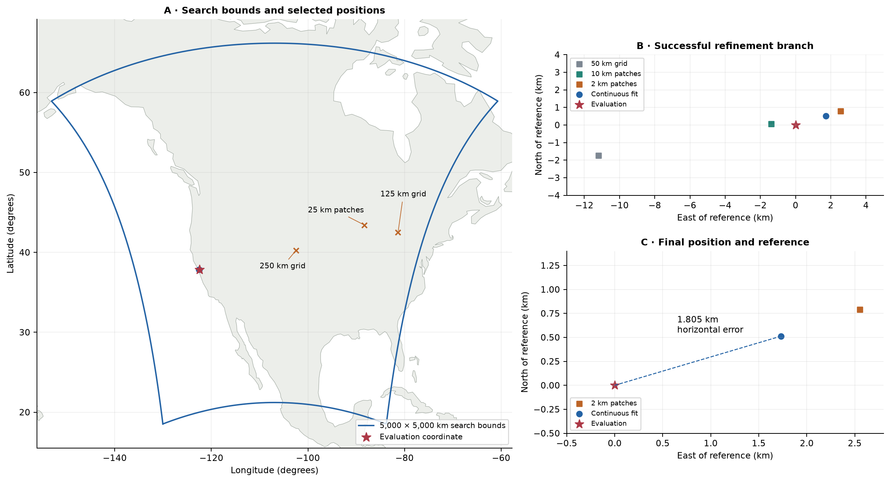
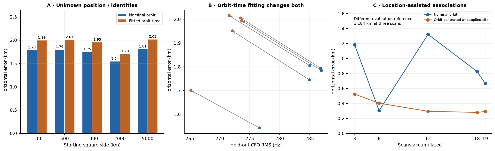
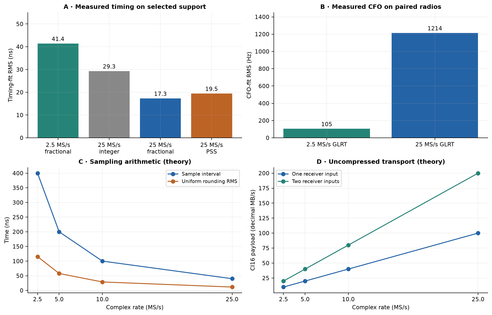

# Continental-Scale Receiver Localization from Starlink Doppler Measurements

**1.8 km continental localization and a 1.2 km location-assisted comparison**

Research manuscript · 8 September 2026

## Abstract

Low Earth orbit communications signals offer an opportunistic source of geographic
information through their changing Doppler frequency. Extracting a receiver
position from these signals requires separating satellite motion from oscillator
offsets, identifying plausible transmitting satellites, and resolving geographically
separated solutions. This paper evaluates an offline method using predictable
Starlink-compatible pilot emissions, generalized likelihood ratio detection,
frequency-trajectory association, archived orbital elements, and joint geographic
and satellite-catalogue search. The dataset comprises 24 five-minute scans at
2.5 and 5 million complex samples per second, collected across eight hours and
containing 502 radio-frequency episodes. A search over a 5,000 × 5,000 km region,
without supplying receiver coordinates or satellite identities to inference,
produces **1.805 km horizontal error**. A separate three-scan fit produces
**1.184 km error** when a supplied receiver coordinate assists satellite selection;
its evaluation reference also differs, preventing a direct accuracy comparison.
Coarse searches can miss the supported region, and fitted orbit-time corrections
reduce frequency residuals while increasing position error. Separate timing
experiments demonstrate sub-sample precision but do not establish a corresponding
improvement in continental positioning. The results support one retrospective
continental localization experiment; worldwide performance, altitude accuracy, and
calibrated confidence regions remain unestablished. Sample-rate and FPGA processing
tradeoffs are assessed in terms of usable bandwidth, continuity, information, and
the measurements needed to validate a positioning benefit.

**Keywords:** satellite Doppler; signals of opportunity; Starlink; receiver
localization; generalized likelihood ratio test; orbital association.

## 1. Introduction and motivation

A moving satellite changes the frequency of its signal at a terrestrial receiver.
The time dependence of this Doppler shift reflects the satellite's orbit and the
receiver's location. A receiver can therefore search for the geographic position
whose predicted satellite motion best explains its measured frequency histories.
This approach is attractive when communications signals are available but the
receiver cannot obtain a conventional navigation message from them.

The central difficulty is ambiguity. A short frequency track can be consistent with
multiple satellites and locations. Unknown oscillators contribute frequency offsets
and drift; orbital predictions have error; recordings contain gaps; and several
signals may overlap. Recovering a smooth track is consequently only one stage of
localization. The position estimator must also distinguish competing geographic
and satellite explanations and recognize when the evidence is insufficient.

Published waveform research identifies predictable pilot and synchronization
structure in the Starlink Ku-band downlink, enabling acquisition without decoding
user traffic. In particular, known edge-pilot symbols provide a narrowband reference
for correlation and frequency measurement [1]. Frame-timing research also documents
clock adjustments and drift that complicate direct conversion of precise arrival
timing into an absolute propagation range [2]. These observations motivate treating
waveform detection, frequency measurement, satellite association, and receiver
position as distinct inference problems.

This paper evaluates the software package in this repository as a chain from
recorded samples to Earth-referenced latitude and longitude. Its contributions are
an experimental continental search with unknown receiver position and satellite
identity, tests of geographic sampling and orbit-model sensitivity, and an account
of the measurement and implementation limits relevant to further improvement.
“Continental-scale” refers to the initial search area; it does not imply a worldwide
search or a validated error bound for receivers throughout a continent.



**Figure 1. Continental-search measurement and inference chain.** Predictable transmitted structure
supports pilot detection and frequency tracking after reception and sampling.
Recorded time and archived orbital elements connect frequency histories to
candidate geographic positions. In this continental experiment, the evaluation
coordinate enters only after position inference. Primary synchronization sequence (PSS) timing is a separate
research observable whose integration into this position solver is proposed.
This is a conceptual diagram, not a measured performance figure.

## 2. Signal and measurement model

### 2.1. Transmitted structure and receiver chain

The useful waveform is organized into approximately 240 MHz channels using
orthogonal frequency-division multiplexing (OFDM), in which closely spaced tones
carry symbols in parallel. The package's edge-pilot template describes eight tones
and 300 known four-state quadrature amplitude modulation (4QAM) symbol positions
per frame. Frames repeat at 750 Hz, with a nominal period of 1.333333 ms; an OFDM
symbol lasts 4.4 µs. The tones are separated by 234.375 kHz and span 1.640625 MHz
between their outermost centres. Their shared predictable pattern establishes
waveform compatibility, not a unique spacecraft identity [1].

A low-noise block downconverter (LNB) amplifies the received signal and translates
it from Ku band to an intermediate frequency (IF). The receiver chain uses a
9.75 GHz LNB local oscillator: for example, a channel-3 lower-edge centre at
11.2096875 GHz becomes 1.4596875 GHz. A Pluto software-defined radio filters and
translates a selected slice to complex baseband. Its in-phase and quadrature (IQ)
samples preserve the slice's amplitude and phase. The positioning scans visit the
lower and upper edges of four RF channels at 2.5 or 5 MS/s; MS/s denotes millions
of complex samples per second. These are narrow slices, not full-channel recordings.



**Figure 2. Known waveform structure and detection evidence.** (a) Schematic tone
positions in the edge-pilot template; heights indicate tone locations, not measured
power. (b) Measured exact-pilot detector scores from two selected 60 s recordings
at 5 MS/s, on channel 3 and channel 4 lower edges. Lines show two-second medians;
bands show the 10th–90th percentiles. Both recordings use receiver input RX1, but
channel, gain, bandwidth, and observation time differ. The comparison demonstrates
detectable pilot structure without isolating a single cause of the score difference.

### 2.2. Doppler and frequency offsets

For a stationary receiver at Earth-fixed position $x$, let $r_s(t)$ and $v_s(t)$
denote the predicted Earth-fixed position and velocity of candidate satellite $s$.
At reference frequency $f_0$, the Doppler model is

$$
D_s(t;x)=-\frac{f_0}{c}
\frac{(r_s(t)-x)^T v_s(t)}{\|r_s(t)-x\|},
\qquad f_0=11.2\ \mathrm{GHz},
\tag{1}
$$

where $c$ is the speed of light. The vector fraction is range rate: recession gives
negative Doppler in this convention. Position and velocity must share an Earth-fixed
frame, including the contribution of Earth's rotation to velocity.

A measured carrier-frequency offset (CFO) is the received frequency difference
from the receiver's nominal signal reference. CFO includes Doppler and unresolved
transmitter/receiver oscillator terms. Measurements from source segment $i$ at RF
centre $f_{\mathrm{RF},i}$ are rescaled before comparison:

$$
z_i(t)=\frac{f_0}{f_{\mathrm{RF},i}}f_i(t)
      =D_{s_i}(t;x)+b_i+\epsilon_i(t).
\tag{2}
$$

Here $f_i(t)$ is measured CFO, $s_i$ is a candidate satellite assignment, $b_i$ is
a constant local frequency offset, and $\epsilon_i$ includes measurement error and
unmodelled drift, channel effects, and orbital error. Fitting $b_i$ deliberately
removes absolute-frequency information; geographic information must survive in
the changing shape of the track.

### 2.3. Measurement resolution

Under an ideal known-signal model with additive white noise, timing standard
deviation scales as $1/(\beta\sqrt{E/N_0})$, where $\beta$ is the signal's centred
root-mean-square bandwidth, $E$ is integrated known-signal energy, and $N_0$ is
noise spectral density [1, 2]. Increasing sample rate without increasing useful
known-signal bandwidth does not provide the same benefit as increasing bandwidth.
The RF carrier centre is not the applicable bandwidth when carrier phase is unknown.

For a phase-stable tone observed over duration $T$, ideal frequency precision scales
as $1/(T\sqrt{E/N_0})$. The grouped pilot detector used here does not maintain phase
over every frame in its entire observation window, so this ideal scaling is not
a calibrated bound on its CFO error. Empirically, nominal-orbit position fits have
approximately 277–287 Hz held-out CFO root-mean-square (RMS) residuals across the five
starting regions. At 11.2 GHz, 285 Hz corresponds to 7.63 m/s if interpreted entirely
as line-of-sight Doppler. That conversion does not assign the residual to satellite
velocity error or provide a position-error bound.

## 3. Positioning methodology

### 3.1. Sample continuity and pilot acquisition

The recording system stores signed 16-bit I and Q components (CI16), requiring
four bytes per complex sample per receiver input. Device sample counters establish
observed adjacency, while recording metadata preserve missing intervals, tuning
boundaries, and a bracket on first-sample Coordinated Universal Time (UTC).
The bracket records the earliest and latest plausible first-sample times; its
width is an uncertainty interval, not a measured timing standard deviation.
Each analyzed window must contain all its samples. Concatenating retained buffers
while omitting elapsed gaps compresses the time axis and can fabricate Doppler
slopes or resets; interpolation cannot reconstruct unrecorded samples.

Each complete 20 ms IQ window is searched for frame alignment and CFO using a
generalized likelihood ratio test (GLRT). The test scores agreement with known
pilot symbols while accounting for nuisance signal parameters. A control template
shifts the symbol sequence by 17 positions. Acceptance requires the exact-template
score to exceed the control by a specified margin; a spectral power peak alone is
insufficient. The GLRT64 variant uses 64 known symbol positions per frame and
combines bounded groups and frame powers without requiring uninterrupted phase
throughout the window. A 10 ms window stride is used where continuity permits,
so adjacent measurements can share half their samples.

Frame alignment, or epoch, is first acquired on the sample grid. Fractional timing
estimates a peak between samples by fitting its local score surface, accepting only
a bracketed, downward-curving maximum. Direct rescoring can evaluate that fractional
coordinate using band-limited IQ interpolation. This estimates alignment relative
to the waveform template; it does not establish a satellite transmit timestamp.
Detection score, recovered known-symbol quality, frame timing, and carrier-phase
stability are separate quality measurements.

### 3.2. Frequency trajectories and channel association

Detections linked in time and frequency form tracklets. Compatible tracklets are
consolidated into an RF episode, a candidate signal trajectory within one channel.
An episode can contain multiple source segments from different edges or receiver
inputs, each retaining its own offset. These objects represent signal evidence,
not confirmed satellites. Line searches and bounded polynomial models identify
trajectory support; linear, quadratic, and cubic descriptions admit successively
more temporal curvature.

The repeated-symbol measurement has a CFO ambiguity period

$$
\Delta f_{\mathrm{alias}}=\frac{1}{4.4\ \mu\mathrm{s}}
 =227{,}272.727\ldots\ \mathrm{Hz}.
\tag{3}
$$

It differs from subcarrier spacing and is independent of analog-to-digital
converter (ADC) sample rate. Integer
shifts by this period reconcile equivalent frequency hypotheses; they do not add
Doppler information. A frequency branch change must not automatically become a
physical acceleration or transmitter switch.

Lower- and upper-edge trajectories are rescaled by their actual RF centres before
their shapes are compared. Compatible edges can share a trajectory with independent
constant offsets. Duplicate observations are excluded from episode consolidation.
This combines frequency shape, not carrier-coherent timing across the approximately
230 MHz separation between channel edges.



**Figure 3. A measured lower/upper edge pair.** The vertical axes show CFO after
removing each source's constant training offset. (a) At actual RF centres, different
Doppler scale factors remain. (b) Rescaling to 11.2 GHz permits comparison of their
slopes. (c) Filled observations form the first 60% training partition; hollow
observations form the last 40% prediction partition. Vertical lines mark each
source's split. The pairing is selected from RF trajectory evidence without using
the receiver evaluation coordinate or catalogue identity.

For $N$ independent frequency measurements with standard deviation $\sigma_f$
spread approximately uniformly over duration $T$, a linear rate fit has standard
error approximately $\sqrt{12}\sigma_f/(\sqrt{N}T)$. Overlapping windows, shared
oscillators, and receiver replicas violate that independence assumption. Longer
actual temporal support can be more informative than denser overlapping windows.

### 3.3. Orbital prediction and geographic acquisition

A two-line element set (TLE) specifies an approximate satellite orbit. The estimator
admits archived Starlink catalogues collected at least five seconds before each
scan, with orbit-element reference epochs preceding the recording. Simplified
General Perturbations 4 (SGP4) propagates each candidate orbit; a coordinate transform
converts its output into Earth-fixed position and velocity. NORAD catalogue numbers
identify candidate space objects, but a fitted assignment does not decode an identity
from the radio signal.

At each candidate geographic position, the search compares every episode's normalized
CFO shape with admitted visible satellites and an explicit unassigned alternative.
The latter allows an observation to remain unexplained by the catalogue. Source
offsets are learned from training samples; no free source slope or curvature is
allowed to absorb the geographic Doppler differences. The satellite prior uses the
full admitted catalogue count rather than the local visible count, avoiding an
artificial preference for locations with fewer visible candidates.

For computational economy, regional scoring retains at most six observations from
each source's training partition and six from its held-out partition. Geographic
selection uses training scores only. The scores combine episode evidence and are
not calibrated location probabilities. Several spatial peaks are retained for finer
sampling. A local optimizer cannot recover a distant mode that the regional search
never sampled, making whole-region grid spacing a material resolution constraint.

### 3.4. Continuous position fitting

Local refinement freezes satellite hypotheses selected on training data and fits
one stationary receiver position plus the source offsets in Eq. (2). It restores
the full observation density, fitting only the training partition and predicting
the held-out partition. Height is either fixed at zero or estimated with a
zero-centred quadratic penalty $(h/1\ \mathrm{km})^2$ and bounds from −500 to
+5,000 m. This 1 km prior scale regularizes fitted height $h$ relative to the
reference ellipsoid, not local ground level.

A model variation adds one orbit-time correction per satellite/TLE snapshot group,
with penalty $\sum_g(\Delta t_g/0.5\ \mathrm{s})^2$ and a ±2 s bound on each
group's correction $\Delta t_g$. This parameter lets the candidate satellite be
slightly ahead of or behind its nominal orbital schedule. Such changes can imitate
part of the effect of moving the receiver, so lower frequency residuals alone
cannot establish a better position.

## 4. Experimental setup and evaluation protocol

### 4.1. Recordings

The continental experiment uses 24 completed five-minute scans collected on
7 September 2026 across an eight-hour calendar window. Each scan alternates among
eight targets: the lower and upper edges of four channels. The usable dwell on a
target is 120 ms. The dataset contains twelve scans at each of 2.5 and 5 MS/s,
and 502 consolidated RF episodes. Episodes have median duration 17.34 s and maximum
duration 53.82 s; they are interrupted observations, not uninterrupted five-minute
passes of identified satellites.

**Table 1. Receiver and positioning dataset parameters.** Calendar coverage and
within-scan duty use different denominators. CI16 width describes storage, not the
ADC's effective analog resolution.

| Parameter | Value |
|---|---:|
| LNB oscillator | 9.75 GHz |
| Recorded targets | Four channels × two edges |
| Complex sample rates | 12 scans at 2.5 MS/s; 12 at 5 MS/s |
| Nominal duration per scan | 300 s |
| Valid target visits | 57,288 × 120 ms |
| Retained dwell time | 6,874.56 s ≈ 1.91 h |
| Median usable duty within scans | 95.4444% |
| Retained dwell / eight-hour window | 23.87% |
| Median / maximum first-sample UTC bracket width | 1.334 / 1.924 ms |
| RF episodes | 502 |
| Median / maximum episode duration | 17.34 / 53.82 s |
| Sample storage | CI16, four bytes per complex sample per input |



**Figure 4. Recording schedule and representative frequency trajectories.**
(a) Each bar marks a five-minute scan at its recorded UTC and sample rate; the
spaces between scans are not continuous RF coverage. (b–e) Actual trajectories
from the 15:40 UTC scan, with 36 consolidated episodes. Blue/orange indicate
lower/upper edges and dots/crosses indicate receiver inputs RX0/RX1. Frequency is
normalized to 11.2 GHz. Multiple paths and their local offsets remain visible;
connected support does not establish one spacecraft or phase continuity.

### 4.2. Experiments and reference coordinates

The continental search estimates receiver coordinates and satellite assignments
within a square of side 5,000 km centred at 43.6914344°, −106.8991205°. Four
additional starts use 100, 500, 1,000, and 2,000 km squares centred at
37.8044°, −122.2712°. The squares are defined in spherical azimuthal-equidistant
map coordinates; physical Doppler uses an ellipsoidal Earth model. All five starts
reuse the same RF recordings and therefore are not independent accuracy trials.

A location-assisted comparison uses a supplied receiver coordinate to select
satellite candidates before fitting position. Each included scan contributes the
longest passing episode for each distinct candidate, excluding simultaneous
cross-channel conflicts assigned to the same satellite. Requiring at least three
candidates leaves 19 eligible scans. Pooled fits accumulate these scans into one
position estimate; a calibration variant also fits satellite timing at the supplied
coordinate. This experiment measures performance conditional on location assistance.

**Table 2. Supplied information and evaluation references.** The two reference
coordinates are 1,290.27 m apart. The assisted benchmark's error is measured in a
local horizontal tangent plane; continental error is great-circle separation.

| Experiment | Information supplied to estimation | Position reference |
|---|---|---|
| Continental and regional searches | Geographic bounds, recorded UTC, causal TLEs, stationary receiver, height model; no receiver coordinate or location-assisted identities | 37.8490428024417°, −122.48567437412359°; evaluation only, no reference altitude |
| Location-assisted pooled position | Satellite candidates selected at supplied site; local height fixed about the site reference | 37.858988°, −122.478103°, altitude −29 m; used for association and evaluation |
| Location-calibrated pooled position | Same assistance plus orbit timing fitted at supplied site | Same assisted reference |
| Receiver timing comparisons | Selected paired recordings and timing-track support | Timing-curve residuals; no absolute range or receiver-position truth |

### 4.3. Evaluation boundaries

The first 60% of each source's observations are training and the last 40% are held
out for prediction. Receiver coordinates, satellite mixtures, offsets, and fitted
parameters are selected without those held-out CFO values. Inference files are
saved and hashed before the continental evaluator reads the reference coordinate.
The reference was nevertheless available during development discussions. This is
retrospective research with a software boundary separating inference from the
answer, not a personally blinded or preregistered prospective trial.

RF extraction, trajectory membership, and edge associations use complete within-scan
support before the split. Held-out prediction is therefore conditional on that
retrospective extraction. Adaptive search patches also use their parent run's full
training history. These evaluations do not demonstrate decisions made using only
data available at a real-time decision point. A complete time-ordered replay on
recordings held out from method development is needed for that claim.

Control experiments shift UTC by −600 and +600 s and repeat the 1,000 km search.
The tests probe whether apparently convincing geographic scores can occur under
wrong timing. No calibrated false-fix rate or 95% containment region is inferred
from these controls or the five starts.

## 5. Results

### 5.1. Continental acquisition and final position

Whole-region grids at 250 km and 125 km spacing select positions 1,743.95 km and
3,498.69 km from the evaluation coordinate. Refining the 125 km branch in local
patches retains a 2,926.68 km error. An independent 50 km grid over the entire region
finds a position 11.34 km from the reference; subsequent 10 km and 2 km patches give
1.38 km and 2.67 km, respectively. These outcomes show that refinement can preserve
a missed geographic solution and that a closer grid point need not win a
training-only score at the next resolution.

Continuous nominal-orbit fitting with estimated height yields latitude
**37.853649440°**, longitude **−122.465961367°**, and horizontal error
**1,805.014 m**. The fitted ellipsoidal height is approximately −265 m; no reference
altitude is available to validate it. The local solution contains 493 episodes,
1,069 source segments, and 22,694 observations, with 269 provisional satellite
identifiers across 279 satellite/TLE snapshot groups. These are model assignments,
not 269 independently confirmed transmitting satellites.



**Figure 5. Continental search, refinement, and final horizontal position.**
(a) Declared 5,000 km search boundary and selected grid positions; orange crosses
identify the failed coarse branch. The land backdrop uses Natural Earth polygons.
(b) The successful 50 km whole-region search and its 10 km and 2 km refinements.
(c) Continuous fit relative to the withheld evaluation coordinate. Local axes are
small-angle east/north display coordinates; the stated 1.805 km error is recomputed
as great-circle separation. The line connects an estimate and its reference; it
is not a confidence interval. The 10 km grid point is closer than the final fit,
but choosing it using evaluation error would disclose the answer to selection.

### 5.2. Position, orbit-model, and assistance comparisons

**Table 3. Positioning results and control outcomes.** RMS denotes the square root
of the mean squared frequency residual. Rows share recordings or fitted inputs and
do not form independent samples from a common accuracy distribution.

| Experiment / model | Horizontal error | Training CFO RMS | Held-out CFO RMS |
|---|---:|---:|---:|
| Continental, nominal orbit, zero fixed height | 2,179 m | 124.9 Hz | 283.4 Hz |
| Continental, nominal orbit, estimated height | **1,805 m** | 124.7 Hz | 285.0 Hz |
| Continental, fitted orbit time, zero fixed height | 2,356 m | 115.7 Hz | 270.1 Hz |
| Continental, fitted orbit time, estimated height | 2,016 m | 115.5 Hz | 271.5 Hz |
| Four other starts, nominal orbit, estimated height | 1,543–1,795 m | — | 276.6–287.0 Hz |
| Location-assisted nominal fit, three scans | **1,184 m** | — | — |
| Location-assisted nominal fit, nineteen scans | 669 m | — | — |
| Location-calibrated fit, nineteen scans | 292 m | — | — |
| 1,000 km search, UTC shifted −600 s | 655 km | — | — |
| 1,000 km search, UTC shifted +600 s | 418 km | — | — |

The maximum fitted orbit-time correction in the continental estimated-height model
is 0.533 s. Adding that freedom reduces held-out CFO RMS by approximately 13.5 Hz
while increasing horizontal error by approximately 211 m. Orbit-time fitting
worsens position for all five starting regions (Figure 6). Improved agreement
with measured frequency is therefore insufficient evidence of improved location.

The location-assisted benchmark gives 1.184 km at three scans, 304 m at six,
1.324 km at twelve, and 669 m at nineteen. More data do not monotonically reduce
error. Its three-scan value is a conditional result against a different reference
from the continental experiment, not a second measurement of continental accuracy.
Calibration at the supplied site further reduces the nineteen-scan error to 292 m,
but that calibration uses location information unavailable in an unknown-position
experiment.



**Figure 6. Geographic initialization, orbit fitting, and location assistance.**
(a) Five search bounds applied to the same dataset. (b) Each arrow adds orbit-time
fitting: movement left improves held-out frequency prediction, while movement up
worsens position. (c) Pooled fits using location-assisted satellite assignments;
the orange curve also calibrates orbit timing at that supplied location. Panel c
uses a different reference coordinate from panels a–b. Lines connect cumulative
fits, not independent trials; none of the panels estimates a confidence radius.

Both wrong-time controls produce sharp geographic peaks despite errors of hundreds
of kilometres. Their failure establishes that peak sharpness alone is not an
integrity test. The experiment does not yet provide a rule with a measured
probability of rejecting an incorrect fix.

### 5.3. Trajectory quality and measurement correlation

Across 502 episodes, model selection chooses 80 linear, 212 quadratic, and 210 cubic
descriptions. Among 387 accepted upper/lower links, 338 predict held-out observations
better with a shared cubic than separate cubics; the median shared/separate RMS
ratio is 0.582. The fitted model's formal rate-precision gain is 1.43×. These
conditional results support combining compatible trajectory shape without treating
correlated receiver or edge observations as fully independent information.

A simulation uses one recorded scan's satellite geometry while treating identities
and orbits as exact. Twenty trials with independent 100 Hz frequency noise give a
median horizontal error of 925 m. Twenty trials holding noise constant for five
consecutive samples give 1,528 m. These are simulated outcomes under one geometry,
not observed receiver accuracies or an allocation of the real error among causes.
They demonstrate that correlation alone can materially degrade the local solution.

## 6. Discussion: resolution and implementation tradeoffs

### 6.1. From measurement precision to position accuracy

Linearizing Eq. (2) about a candidate location gives

$$
\delta z=J_x\delta x+J_n\delta n+\epsilon,
\qquad
I_x=J_x^T WJ_x-J_x^TWJ_n(J_n^TWJ_n)^{-1}J_n^TWJ_x.
\tag{4}
$$

Here $\delta z$ is observed frequency minus the candidate prediction, $J_x$ maps
position displacement to frequency changes, and $J_n$ maps changes in nuisance
parameters such as source offsets, clock terms, and orbit corrections. $W$ is an
assumed inverse error covariance. The second expression is the local information
remaining for position after fitting nuisance parameters. Its subtracted term
removes information those parameters can also explain. An inverse, when defined,
is conditional on correct identities, local linearization, and the assumed error
model; it excludes distant spatial alternatives and unmodelled bias.

**Table 4. Measured limitations and theoretical or engineering implications.**
These terms are correlated and incompletely calibrated. They cannot be combined
into an additive or root-sum-square position-error budget.

| Stage | Empirical evidence | Resolution constraint / required measurement |
|---|---|---|
| Emission and received bandwidth | Eight pilot tones span 1.640625 MHz | Timing information depends on useful known-signal bandwidth and energy, not sample rate alone |
| Sampling and fractional timing | Selected 2.5 MS/s track: timing RMS falls from 112.65 to 21.74 ns | Integer rounding is removable; peak interpolation and channel bias remain |
| Continuity and UTC | Scan UTC brackets reach 1.924 ms; paired 25 MS/s captures retain about 61% of their timelines | Device adjacency does not calibrate UTC, oscillator rate, or phase through a retune |
| Temporal support and correlation | Episodes have median duration 17.34 s; correlated-noise simulation degrades position | More overlapping probes do not provide proportionally more independent information |
| Geographic acquisition | Coarse grids miss by thousands of kilometres | Local fitting cannot recover an unsampled distant solution |
| Clock, orbit, and position ambiguity | Orbit-time fitting lowers CFO residuals but worsens all five positions | Nuisance freedom can remove geographic information or absorb model bias |
| Earth-frame approximation | Rotation time approximated by UTC; polar motion neglected | Quantify frame, signal-travel-time, and propagation-model effects before precision claims |
| Integrity and reference uncertainty | Wrong-time searches have sharp wrong peaks; references differ by 1.290 km | Independently document reference uncertainty and validate rejection and containment rates |
| Sample rate and transport | CI16 at 25 MS/s requires 100 MB/s per input | Measure usable duty, retained bandwidth, and downstream accuracy under controlled conditions |
| FPGA PSS tracking | Proposed; no accelerator performance or position benefit measured | Compare fixed-point output with software and measure resources, loss, latency, and reacquisition |

The continental solution retains kilometre-scale error after continuous optimization.
The timing experiments described below use separate recordings and do not establish
how their improvements change that error. Improving measurement precision must
be accompanied by validation of clock, orbit, identity, and geometry assumptions.

### 6.2. Measured timing and CFO at different sample rates

At 2.5 MS/s, integer frame timing advances in 400 ns steps. Reprocessing 652 epochs
from a selected continuous timing track with log-parabolic peak interpolation lowers
quadratic timing-fit RMS from 112.65 to 21.74 ns, an 80.7% reduction. The corresponding
timing-derived frequency-change rate changes by only 0.138%. The acquired CFO is
held fixed in this comparison, and the interpolated fractional coordinate is not
directly rescored. Different interpolators differ by approximately 28 ns at the
median and 44 ns at the 95th percentile, demonstrating sensitivity beyond integer
sample spacing.

PSS processing correlates the portion of the known primary synchronization sequence
inside the recorded band over candidate CFOs, folds repeated evidence modulo the
1.333 ms frame period, and follows consistent timing peaks. In five preselected
recording pairs using separate radios at 25 and 2.5 MS/s, independent PSS acquisition
finds tracks in three pairs, with quadratic block-median RMS of 0.217–0.378 µs.
This statistic is the RMS residual after fitting a quadratic to median timing
estimates from 250 ms blocks advanced by 125 ms. Adjacent blocks overlap and
therefore are not independent observations.
The other two pairs yield no primary track. Their 25 MS/s recordings retain
60.47–61.07% of logical time, with 16–21 gaps per 60 s capture. These percentages
describe the measured configurations, not an intrinsic ceiling on 25 MS/s recording.

A selected recording pair supports a detailed GLRT/PSS comparison. PSS supplies
133 window times; GLRT independently searches epoch and CFO in each window.
Eighty-nine windows pass both detection and fractional-peak checks, while 19 fail
the detection margin and 25 have unsuitable fractional peak geometry. On retained
support, 25 MS/s fractional GLRT has 17.3 ns quadratic timing RMS and PSS has 19.5 ns;
the paired 2.5 MS/s fractional GLRT has 41.4 ns across 242 points in the common
interval. Direct CFO-fit RMS is 1,214 Hz at 25 MS/s and 105 Hz at 2.5 MS/s. Thus
better timing in this comparison does not imply better direct frequency estimation.



**Figure 7. Measurements and sample-rate design arithmetic.** (a–b) Selected paired
recordings: timing and CFO residuals use different units and represent different
observables. The 25 MS/s methods use 89 retained windows; the low-rate timing series
has 242 points. Separate radios, unequal support, and PSS-selected scheduling prevent
a controlled sample-rate-only comparison. (c–d) Theoretical sample spacing, uniform
integer-rounding RMS, and uncompressed CI16 payload demand. These calculations are
not measured throughput, ranging precision, or position accuracy.

Timing curvature can be converted to an equivalent frequency-change rate using
$\dot f=-f_{\mathrm{RF}}d^2\tau/dt^2$ in a physical-delay convention, where $\tau$
is measured timing drift. The selected GLRT and PSS magnitudes differ by 0.91 Hz/s.
Clock drift can contribute to $\tau$, and IQ mixing conventions can reverse displayed
signs. A template-relative frequency proxy is not calibrated physical Doppler.
For $N$ independent timing observations, each with standard deviation $\sigma_\tau$
and spread approximately uniformly over duration $T$, the standard error of the
second derivative in a quadratic fit scales as
$\sqrt{720}\sigma_\tau/(\sqrt{N}T^2)$. Gaps, clustered observations, overlapping
windows, and correlated errors require using the actual sampling geometry and
covariance. Duration and continuity therefore matter beyond the density of samples.

### 6.3. Bandwidth, transport, and FPGA tracking

Uniform rounding to samples at complex rate $f_s$ has RMS
$1/(\sqrt{12}f_s)$: 115.47 ns at 2.5 MS/s and 11.55 ns at 25 MS/s.
This is a rounding model, not a physical lower bound; fractional timing can improve
on it. A 40 ns sample interval corresponds to 12 m of light travel, but neither
sample spacing nor a 17.3 ns timing residual establishes an absolute propagation
range. That also requires transmit timing, frame-cycle resolution, and calibrated
receiver/channel delays. Transmitter timing adjustments further complicate
opportunistic pseudorange, a travel-time-derived distance containing clock bias [2].

CI16 payload demand scales as $4f_s$ bytes/s per receiver input: 10, 20, 40, and
100 MB/s at 2.5, 5, 10, and 25 MS/s, respectively. Two inputs double those rates.
Retaining 300 s at 25 MS/s requires 30 GB per input before compression or overhead.
The 10 MS/s case is design arithmetic, not a measured positioning experiment.
Increasing sample rate helps if it admits useful known-signal bandwidth, reduces
avoidable discretization, or supports better interpolation. Oversampling an unchanged
filtered band does not multiply independent information. The recorded 25 MHz slice
is still far narrower than a full 240 MHz channel. The AD9361 specifies up to
56 MHz tunable channel bandwidth, so full-channel reception requires a different
RF design and transport qualification [3].

A field-programmable gate array (FPGA) can process known signals as samples arrive,
reducing the volume sent to a host processor. A plausible division places filtering,
decimation, bounded correlation, timing-peak statistics, and device-counter tagging
in the FPGA, while retaining multi-candidate association and orbital fitting on
the host. Selected raw windows should remain available to audit compact outputs.
This is a proposed architecture; hardware resources, clock speed, power, and its
positioning benefit have not been measured.

Acquisition and tracking have different workloads. A 110-tap direct PSS correlator
evaluated at every 25 MS/s sample requires approximately 2.75 billion complex
multiply-accumulates/s per CFO hypothesis and receiver input. A ±2 µs corridor around
an acquired epoch contains approximately 101 sample shifts; evaluating them at
750 frame opportunities/s requires approximately 8.33 million operations/s per
hypothesis. These are direct arithmetic counts, not synthesized resource estimates.
Frequency banks, fractional interpolation, parallel modes, and reacquisition change
the cost. Fixed-point precision and saturation must be compared with a floating-point
reference before interpreting hardware timing estimates scientifically.

The selected-window GLRT experiment processes 133 twenty-millisecond windows in
52.47 s with four CPU workers. Summed verified-read time is 39.66 worker-seconds,
which overlaps across workers and is not a fraction of elapsed time. This provides
a limited processing measurement, not a continuous PSS or FPGA benchmark. Profiling
must separate sample reading, verification, correlation, tracking, and geographic
search before deciding which acceleration yields usable positioning information.

## 7. Conclusions and future work

The package demonstrates **1.805 km horizontal error** in one retrospective search
over a **5,000 × 5,000 km region** using Starlink-compatible Doppler observations
without supplying receiver coordinates or satellite identities to inference.
A separate **1.184 km three-scan result** uses location-assisted satellite selection
and a different evaluation reference. These results describe distinct experimental
conditions rather than a shared continental accuracy distribution.

The principal limitations are geographic ambiguity, short and correlated trajectory
support, and coupled clock/orbit/position errors. Fine timing is measurable, but its
integration into continental positioning and the benefit of higher sample rates or
FPGA acceleration remain to be demonstrated. The evidence does not establish
worldwide coverage, validated altitude, a 95% confidence region, or an operational
position service.

The next experiment should freeze the complete processing and fix/reject rules and
replay held-out recordings in time order, exposing each stage only to observations
available by the simulated decision time. It should retain failed starts, evaluate
wrong-time and null controls, and document the uncertainty of one consistent
position reference. Controlled decimations of the same archived native IQ can
separate sample-rate effects from different RF chains and time support. Clock and
orbit models should be tested on disjoint data, with sensitivity to geometry and
catalogue age reported explicitly. FPGA PSS tracking should first reproduce a
frozen software reference under injected timing shifts, gaps, and saturation; PSS
should enter the position estimator only after convention, clock, and covariance
validation. The criterion for adoption is improved position accuracy and integrity
on untouched evaluation data.

## References

1. W. Qin, M. L. Psiaki, J. R. Bowman, and T. E. Humphreys,
   [“Pilots and Other Predictable Elements of the Starlink Ku-Band Downlink,”](https://arxiv.org/abs/2602.02627)
   arXiv:2602.02627, 2026.
2. W. Qin, A. M. Graff, Z. L. Clements, Z. M. Komodromos, and T. E. Humphreys,
   [“Timing Properties of the Starlink Ku-Band Downlink,”](https://rnl.ae.utexas.edu/wp-content/uploads/qin_starlink_timing_properties.pdf)
   author-hosted preprint.
3. Analog Devices, [“AD9361: RF Agile Transceiver,”](https://www.analog.com/en/products/ad9361.html)
   product documentation, accessed 8 September 2026.
4. Natural Earth, [“1:110m Land,”](https://www.naturalearthdata.com/downloads/110m-physical-vectors/110m-land/)
   public-domain geographic data; the archived file and its provenance are recorded
   in the figure manifest.

## Appendix A. Data provenance and reproduction

This paper publishes a new presentation of committed experimental evidence; it does
not report newly collected RF or a new run of the continental estimator. The evidence
snapshot is commit `e24387b0eedfde687cd8c4fab528c9ac56ec3387`. Recording identifiers
provide audit references rather than scientific method names. The figure generator
reads committed summaries and extracted RF observations, independently checks the
coordinate/error consistency of 42 evaluated runs and local fits, and renders all
seven figures without reading raw radio IQ.

The [data summary](figures/2026_09_08_starlink_doppler_paper/data-summary.json)
records both position references, selected source tracks, observation counts, search
branches, and the continental solution. The
[manifest](figures/2026_09_08_starlink_doppler_paper/manifest.json) hashes every numerical
input, source map, figure, and the paper. The map uses archived Natural Earth
polygons; the local position panels use explicitly labelled approximate display
coordinates. No generated imagery substitutes for experimental measurements.

Supporting experimental records are the
[continental search and evaluation](2026_09_07_blind_regional_doppler_positioning.md),
[scan measurements and assisted position fitting](2026_09_07_eight_hour_scan_tracking_and_positioning.md),
[receiver pilot-quality comparison](2026_08_27_170330_capture_quality.md),
[fractional timing experiment](2026_09_02_7fea_glrt_fractional_epoch_prototype.md),
[paired-rate PSS acquisition](2026_09_02_five_paired_native25_pss_vs_2p5_glrt.md), and
[selected-window GLRT/PSS comparison](2026_09_03_0181_native25_fractional_glrt.md).
The [source inventory](figures/2026_09_07_continental_positioning_synthesis/source-report-index.md)
provides the broader measurement lineage. These records supply implementation and
audit detail; the experiment definitions and interpretation are stated in this paper.

From the repository root, in the configured Python environment:

```bash
PYTHONPATH=src OPENBLAS_NUM_THREADS=1 python tools/report_starlink_doppler_paper.py
PYTHONPATH=src OPENBLAS_NUM_THREADS=1 python -m pytest -q \
  tests/analysis/test_starlink_doppler_paper.py
```

These checks validate publication artifacts, numerical consistency, source hashes,
and figure decoding. They do not rerun RF extraction or the geographic search. The
[published regional verification receipt](figures/2026_09_07_continental_positioning_synthesis/regional-verification.json)
records checks of 22 sealed replays, 20 local fits, and 13 source-study figures,
with 528 large intermediate arrays explicitly omitted from Git. Its scope must not
be interpreted as a raw-data replay of this paper.

## Appendix B. Continental search branches

Grid spacing is a numerical search parameter, not a guaranteed position error.
Times below are archived CPU replay measurements and exclude RF collection. The
125 km branch remains distant after local refinement; the 50 km branch begins with
an independent sweep of the entire search region.

| Search stage | Locations evaluated | Horizontal error | CPU replay time |
|---|---:|---:|---:|
| Whole region, 250 km spacing | 400 | 1,743.95 km | 106.0 s |
| Whole region, 125 km spacing | 1,600 | 3,498.69 km | 304.3 s |
| Eight 25 km patches from 125 km grid | 935 | 2,926.68 km | 151.5 s |
| Independent whole region, 50 km spacing | 10,000 | 11.34 km | 1,477.7 s |
| Eight 10 km patches from 50 km grid | 935 | 1.38 km | 135.4 s |
| Three 2 km patches | 351 | 2.67 km | 60.8 s |
| Continuous nominal-orbit fit with estimated height | Continuous | 1.805 km | Seven fit iterations |
