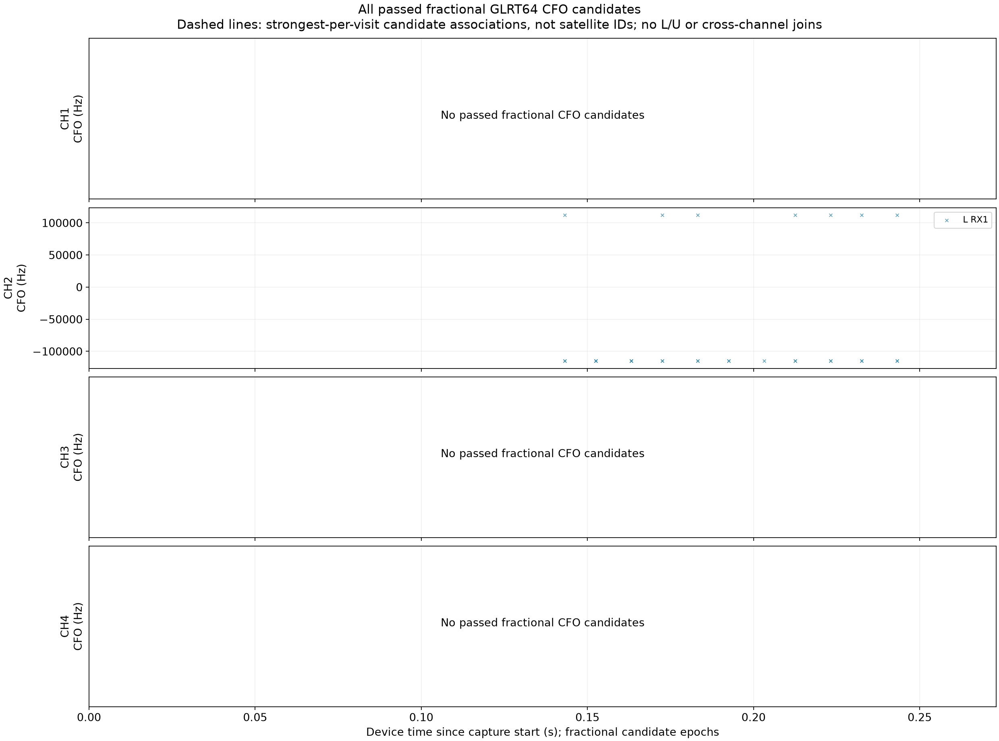
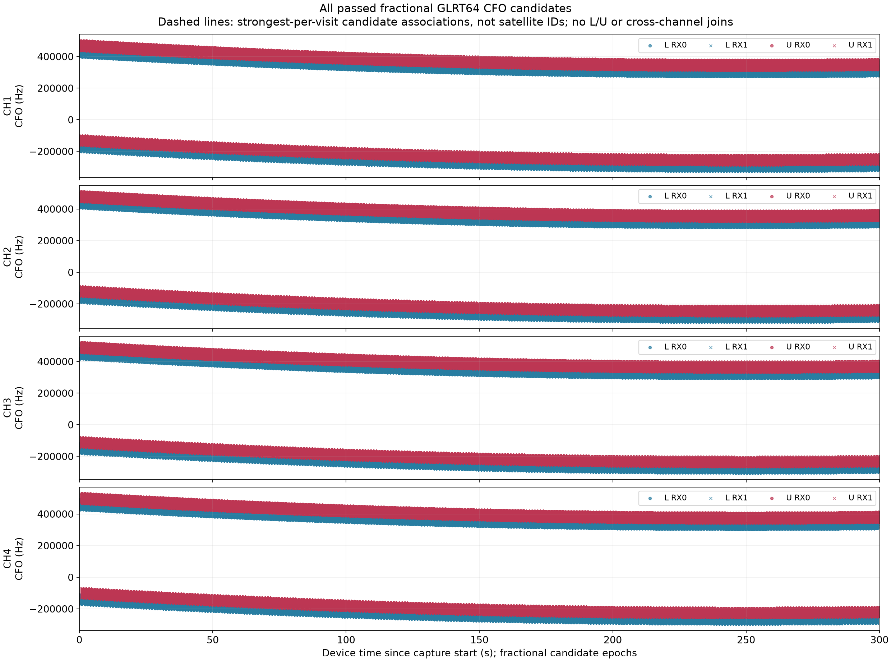

# Adaptive scanner: actual-time figures and read-only analysis progress

2026-09-09. **Implemented and verified locally; not merged into remote main or
deployed.** Adaptive/shadow metrics now feed coverage, fractional GLRT response,
and CFO candidate PNGs through an additive read-only API and the existing React
scanner panel. The default remains fixed scanning with classification disabled.

No radio, new RF, FPGA, kernel, flashed firmware, installed radio library or
production service was accessed/changed. No numerical detector threshold,
scientific fixture, or golden tolerance changed. This is desktop presentation
and integration evidence, not detector sensitivity or acquisition-duty evidence.

## What is connected

The CLI renders an overview after all actual-visit metrics are sealed. A render
failure leaves the metrics intact; retry renders without repeating IQ analysis.
`--metrics-only` omits rendering. `--maximum-seconds` is a metrics budget checked
between visits; a running visit and subsequent overview rendering can exceed
that budget. The existing shared low-priority analysis lease remains in use.

The reader distinguishes four states: not started, partial checkpoints, a sealed
metrics manifest, and published figures. It does not infer a running or queued
worker from files. Partial progress is explicitly a file-inventory count, not a
claim that the numerical contents were checked by that HTTP request.

GET/HEAD routes are additive:

- `/api/v1/scanner/adaptive-sessions/{session_id}/analysis`
- `/api/v1/scanner/adaptive-sessions/{session_id}/analysis/{artifact}.png`

The PNG request requires source/configuration and artifact digests. The status
path reads bounded metadata and checks inventory; it never reads IQ, decompresses
visit products, runs GLRT, or generates figures. Each PNG response verifies its
bytes against the published digest. A same-size corrupt PNG may pass a metadata
snapshot but must fail the artifact read. Errors are sanitized; missing and
corrupt/unavailable products remain distinct.

Overview publication verifies all sealed visit products, publishes three
bounded PNGs, then atomically publishes their manifest. Existing differing
products cannot be overwritten. Readers reject changed binding, malformed
inventories, linked files, altered digests, invalid PNG headers and incomplete
publication. Failed final publication can reuse identical PNGs on retry.

The UI polls every 15 seconds without overlapping requests, aborts when leaving
a capture, rejects stale/misbound responses and displays lazy-loaded local PNGs
with loading/error states. Capture, on-radio evidence, dense-analysis progress,
and worker liveness are not conflated. The immutable history V1 contract retains
its original `analysis_state` field; the new independent analysis endpoint is
the authority used by this panel. Old fixed-session routes remain unchanged.

## Scientific presentation

- Coverage uses actual retained 120 ms intervals at exact relative device times.
  Cancelled/incomplete starts are outlined, and unobserved gaps remain gaps.
- GLRT plots select complete fractionally rescored winners, not integer-score
  winners. Integer anchors and separately retained fractional offsets are
  preserved; absolute sample counters are never converted to floating epochs.
- CFO scatters retain **all passed fractional candidates**, with separate lower/
  upper colors and RX markers. Marker opacity is equal, not an SNR encoding.
  Empty panels state that no fractional CFO candidates passed; they do not
  assert signal absence.
- Dashed associations use one strongest passed candidate per actual visit/RX,
  separately for each target and receiver. Existing bounded linear/quadratic
  fitting is reused. These are candidate hypotheses, not satellite counts,
  identities, phase-continuous tracks, lower/upper joins or cross-channel joins.

### A real defect found by full-span verification

The initial renderer reused the fixed fitter's negative-tail-derived high-score
gate after filtering its inputs to passed candidates. With no negative tail,
that gate becomes infinity, so even perfect synthetic tracks produced no fits.
A new constant-CFO multi-visit regression fails on that initial implementation.

The adaptive passed-only path now explicitly uses its configured fractional
margin gate for both fitting gates. This reuses the admission threshold already
applied to those candidates; it is not a new detection confidence or false-alarm
claim. Fixed-scan calibration and the numerical detector are unchanged. The
association configuration digest changes accordingly. Regression tests cover
the default gate and an alternate configured gate.

The failed regression and initial zero-association benchmark are retained.
Corrected artifacts were generated in fresh owned fixture directories; old
metrics and first-attempt evidence were not deleted or overwritten.

## Saved-IQ end-to-end checks

The four rate/edge parity cases from the preceding checkpoint were reopened
through public readers. Two additional cases select the first reference-positive
dwell per rate from the already-opened development corpus, solely to exercise
nonempty plots. They are **not a new holdout or sensitivity estimate**.

| Additional positive smoke | Original scan / visit | Channel | Passed fractional candidates |
| --- | --- | --- | ---: |
| 2.5 MS/s | `scan-hop-228b5ad75bb549f3` / 161 | CH2L | 30 |
| 5 MS/s | `scan-hop-43cc401e05cbe425` / 167 | CH4U | 1 |

Both additional cases pass the actual IQ codec, numerical analyzer, CLI resume,
metrics publication and PNG API. All persisted numerical fields match their
direct products. Each contains only one saved signal-bearing RX1 dwell; RX0,
other fixture visits and receipt/UTC metadata are synthetic. A single saved
dwell correctly produces no multi-dwell association.

All six finalized cases then traverse the corrected renderer and API. Twelve
CLI invocations (render plus repeat per case) report zero newly analyzed visits;
metrics manifests remain byte-identical. All eighteen returned PNG digests and
decoded dimensions verify. Ten HTTP status requests per short case took
2.2–23.5 ms on this desktop. These are 1–8-visit fixtures, not full-scan HTTP
latency measurements. Process startup plus render took approximately 2.5–2.7 s;
repeat verification took approximately 2.0–2.2 s.

This figure is a presentation smoke test, not a new satellite identification.
The negative/positive frequency groups are candidate evidence within one
120 ms saved dwell; no multi-dwell trajectory is inferred here.

## Full-length scaling

Four tests project full 300 s synthetic receipts: both sample rates and both
shadow/adaptive modes, at the maximum 16 candidates per probe, all passing.
They verify every passed point, actual target/time, fractional anchor and
analytic CFO, with less than 30 MB of compact plot arrays. This is not the total
Python process memory requirement and does not allocate or analyze full RF IQ.

A separate 5 MS/s shadow stress test writes, seals, rereads, renders and publishes
2,291 complete synthetic visits spanning 300.130164 s, with **806,432 passed
candidates**. Its 460 returned linear/quadratic association hypotheses are
bounded fit alternatives/segments, not 460 simulated or observed satellites.

| Desktop stress stage | Measured result |
| --- | ---: |
| Generate/write synthetic metrics and finalize | 80.57 s |
| Verify streamed metrics, fit and render three PNGs | 38.04 s |
| Reverify metrics and publish overview | 15.09 s |
| Reopen binding and read status, ten requests | 139–217 ms |
| Verify/read an artifact in an open job | 16–77 ms |
| Compressed visit metrics | 12.04 MB |
| Peak process RSS | 242.8 MiB |

The reopen/status benchmark includes binding validation and inventory but
excludes capture-manifest lookup, HTTP and browser rendering. Timing is from one
desktop execution with other local tests running, not an ARM estimate or an
isolated performance-tail qualification.

Every dense point is retained in this stress plot; overplotting is intentional.
The synthetic polynomial tracks and constant per-target offsets exercise the
renderer, not a physical satellite model or a lower/upper correction method.

These presentation costs are separate from the preceding checkpoint's measured
dense-IQ analysis cost (seconds per 120 ms dwell). That throughput gap remains.
No automatic every-20-minute dense dispatch or silent sparse substitute was
introduced. Opening the UI does not start analysis.

## Final checks and release state

- **718 Python tests pass**, zero failures/errors/skips, covering adaptive/fixed
  policy, recording, metrics, storage, CLI, history/API and new overview paths.
- **139 web tests pass**, including stale selection, polling, invalid scientific
  bindings, unavailable products and PNG errors. TypeScript and Vite build pass.
- Ruff, formatting, whitespace and six-module Python-3.12 mypy checks pass.
- Existing Starlette/httpx, pytest JUnit-property, jsdom canvas/WebGL and Vite
  bundle-size warnings remain visible. No dependency or test tolerance was
  altered to hide them. The initial Ruff line-length failure is retained too.

The fresh remote-main fetch remains `29be8492`, an ancestor of parent checkpoint
`b802c49a`. No remote push, merge or deployment was performed. The existing
interface guidance kept this work inside the scanner's React/Python architecture;
no hosted-site migration or new dependency was introduced. Component/ASGI tests
and direct PNG inspection are not deployed-browser verification.

The [evidence index](evidence/2026_09_09_adaptive_overview/index.json) records
source hashes, exact commands, receipts, failed attempts, timing and PNGs. IQ
and executable binaries are excluded. Raw owned fixtures remain under
`/tmp/leo-adaptive-overview.HLsKuK`.

Next: qualify the frozen lightweight detector/policy on independent saved IQ,
exercise the exact integrated 300 s ARM producer at both rates, address dense
analysis capacity before automatic dispatch, then obtain bounded live-RF
authorization and perform compatible merge/deployment, real recording/UI and
rollback verification. The full scanner goal remains active.
