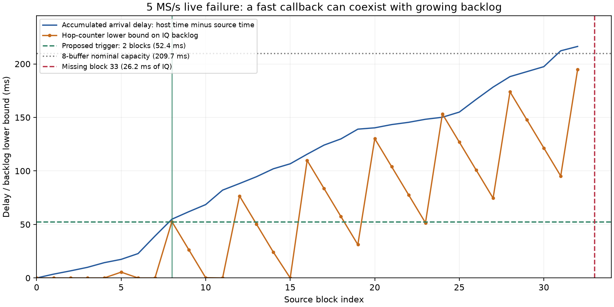

# Radio18 live scanner qualification: startup and capture-pressure corrections

2026-09-09. Work-in-progress checkpoint. This is not a remote merge,
production deployment, or a declaration that adaptive detection is qualified.

The revised source-pressure build subsequently completed a real **300-second
5 MS/s capture at 94.4688% duty with zero IQ loss**. It screened **26.63% of
dwells**, explicitly shedding the rest as unavailable. This is successful
capture protection, not every-dwell detector qualification. The same build also
completed **300 seconds in adaptive mode at 2.5 MS/s, 94.1583% duty and 100%
screening coverage**. All saved IQ in both runs was reread and verified.
No qualifying positives were detected: these are streaming and scheduling
mechanics results, not positive-signal sensitivity or adaptive allocation gains.

## Scope

Only physically USB-attested serial `1040007c4a94000211000b009186843ef2`
at Ethernet `192.168.1.18` is used. USB port is `3-11`; radio traffic uses
Ethernet. PPU's shared serial lock, exact local/remote identity, idle buffers,
absence of competing clients, strict task-specific SSH pin, bundle hashes and
release-local host runtime are checked. `.14` and production radios are not
contacted. Installed iiOD is restored and checked after each owned canary.

The prior authorized maintenance restored released v0.49 and two receivers;
see [its checkpoint](2026_09_09_radio18_v49_2r2t_checkpoint.md).
**This startup correction changes userspace only**, not firmware, kernel,
FPGA or bootloader. The scanner still records both RX and classifies only RX1.

The authorized matrix is six nominal 300-second captures. Diagnostic RF also
counts toward its 30-minute limit; a request to extend the allowance is not
itself approval. Runs are immediate canaries with cadence-slot labels, not
claims of scheduled production execution. No production service is restarted.

## First live baseline

The original protected bundle, detector disabled, completed at 2.5 MS/s:

| Measurement | Result |
| --- | ---: |
| Source-counter span | 300.116398 s |
| Complete dual-RX visits | 2,387 |
| Retained valid IQ time | 286.440 s |
| Valid duty | 95.4429% |
| Missing samples / overflow / hop-event gaps | 0 / 0 / 0 |
| Mean retune, excluding startup | 4.31787 ms |
| Mean scheduler lateness, excluding startup | 0.41165 ms |
| Configured post-retune guard | 1.000 ms |

Session `scan-hop-58dbfc3f396cd056` has sealed manifest
`sha256:cb56692f40909f9fffa38289e205e51699215e31f8b8a479008a688862bb3029`.
Every retained compressed IQ object was reread and verified. The actual scanner
history route returned this recording; disabled GLRT correctly returned 404.
This is an ASGI check against the actual stores, not a deployed browser check.

Settings match the deployed scanner: 120 ms valid dwells, 1 ms guard,
131,072-sample blocks, eight kernel buffers, eight read-ahead visits,
64-visit storage queue, manual gain 40 dB, and rate-specific bandwidth/IF.

## Failure and measured cause

The first detector-enabled attempt failed before publishing a complete scan:
the first declared valid dwell started before the first IQ frame delivered to
the host. Two bounded diagnostic reproductions measured missing prefixes of
28,057 samples (11.2228 ms) and 11,277 samples (4.5108 ms), respectively.
Later frames were contiguous. These are real coverage failures, not a reason
to discard validation or silently pad samples. All owned processes and volatile
companions were cleaned up, and stock service/buffer readback was verified.

The provider started the hop scheduler when opening the buffer, before knowing
that an IQ frame could actually be accepted. The fix arms the existing state
machine at buffer-open and starts hopping once, at the first usable frame.
An unusable/discarded initial frame does not start it; cancellation before that
frame never starts it. The observed logs do not establish gain-sampler discard
as the specific cause, so no such attribution is made.

One separate 12.732204-second cancelled diagnostic preserved valid IQ at
94.2491% duty but emitted an explicit GLRT publication error: the fixed-hop
receipt lists retained complete visits while the detector inventory includes
a started partial final visit. No missing classification is converted into a
negative. That cancellation publication limitation remains open; the fixed V1
contract has not been relaxed. Adaptive binding separately accounts for started
events and bounds actual searches by delivered source IQ.

## Implementation and desktop verification

- libiio `a427e170b5a659b72b5177e058f01a17de6f4654`: deferred first-frame
  activation and provider/session tests. The new provider test first failed
  against the prior implementation, then passed with the correction.
- PPU `1460291`: bounded coverage diagnostics with component tests; incomplete
  IQ remains rejected. Its selected persistent-hop tests pass (51 tests).
- Actual provider tests cover both rates, detector off/on, fixed/adaptive,
  skipped first frame, cancellation before IQ, worker failure and pressure.
- Production TCP/provider/host/store/API regression: **28 tests pass**, including
  four full 300-second simulated source spans and cancellation cases.
- Installed host runtime/lifecycle regression: **57 tests pass**.

The first TCP test invocation accidentally imported ambient system libiio and
failed at setup. The corrected invocation calls PPU's public metadata-runtime
verifier before importing IIO; it retains exact-path/hash checks. No global
loader override, test skip or relaxed expectation was introduced.

The rebuilt nine-payload ARM bundle totals 3,467,936 bytes. Its identities are:

| Item | SHA-256 |
| --- | --- |
| Bundle manifest | `8b06b2246c090f0776de1f220a8eab9371a8f6ab25dae6a038247052cf3df8f9` |
| Algorithm/build | `04e8099570e0224633eeb0c513de7acc76a5f42e56b3eb000bbfb88dcb95a7bf` |
| Configuration | `b34276d4c9308155a4c78868d2b7807b1612e6a72d18b8f509451759ecc5152a` |
| iiOD executable | `4430ac29513d585fc60573851a1875bd774c39976f5249c64ccc1c77260166bc` |

The numerical settings are unchanged; the build identity changes with provider
source and private runtime paths. Previous scientific qualification is not
silently relabeled as an independent evaluation of this new artifact.

## First post-fix live result

Session `scan-hop-f4303bac2380691b` completed with a 300.0766576-second source
span, 2,362 complete dual-RX dwells, **94.4558% duty**, no missing samples or
overflows, and a verified full-IQ reread. All 2,362 source-bound detector records
arrived with zero drops, successful final drain, no publication warning and
successful real-store API checks. PPU verified owned cleanup and restoration.

Every result screened all six temporal slices. None passed the positive-only
gate; all carry `unavailable / incomplete_search`. This reason is also used for
completed bounded searches without a qualifying positive, so it must not be
interpreted as CPU skipping or signal absence. 1,444 results contain fractional
confirmation measurements. Their worker CPU p99 is 88.06 ms; wall p99 is
92.47 ms. These are confirmed-result statistics, not all-callback timing.

The mean retune was 5.47241 ms, scheduler lateness 0.57152 ms and guard 1 ms,
excluding startup. Retune p99 was 11.76984 ms. Compared with the earlier baseline,
duty is **0.9871 percentage points lower**. The provider build changed and runs
were sequential, so this does not isolate GLRT causally. It is nevertheless
**not a passed unchanged-duty gate**, even though it exceeds the 90% target.
The 5 MS/s disabled/enabled pair uses the same post-fix provider artifact.

## Remaining verification

The post-fix 5 MS/s detector-disabled attempt failed about 260 seconds into RF
with `EILSEQ` (errno 84), followed by missing server-attested terminal recovery.
It did **not** publish a complete scan. About 2.1 GiB of partial compressed IQ
remains local, without a sealed recording receipt; it is not promoted into
valid analysis input. The error can originate in counter continuity, counter
readback or tandem event/status consistency. The existing lifecycle deleted
its owned daemon log before the experiment collected it, so the precise branch
of that baseline failure is not established. This is not evidence of a GLRT
overload: GLRT was disabled.

Owned cleanup, stock iiOD health, exact serial/USB/LAN identity and idle buffers
were verified after the failure. A kernel-log snapshot contains no explanation.
The next originally planned 5 MS/s detector-enabled case retained the first 16
and last 64 metadata blocks, at most 16 status reads, and the owned daemon's
final log before cleanup. No input samples, thresholds, rates, guards, daemon
bytes or metadata checks changed for that observation. It failed after about
1.1 seconds of source acquisition. Its log establishes a **131,072-sample gap**,
or **26.2144 ms of missing IQ**, with terminal reason 7 (counter discontinuity).
The last delivered block ended at counter 168551945856; the next attempted
block began at 168552076928. That exact one-block hole was rejected, not padded.
No successful 5 MS/s A/B result is claimed. Both failed scans remain unpublished.

## Source-backlog protection prototype

The trace accumulated **216.314 ms** of host-arrival delay relative to source
time over the first 33 delivered blocks. Eight configured buffers represent
209.7152 ms at this rate, although neither plotted curve is a direct buffer
occupancy measurement. The newest hop timestamp independently gives a lower
bound on how far actual RF has progressed beyond delivered IQ. That bound had
already reached 52.641 ms at block 8, then reached 194.808 ms at block 32.

The largest metadata callback was only **13.0165 ms**, below the existing
20.9715 ms (80% of a source block) pressure threshold. That callback omits
network-send and other acquisition work. Thus individual callbacks can look
healthy while end-to-end delivery falls behind. The fixed-trace replay predicts
an earlier trigger; it does not establish the counterfactual resulting duty.

Local libiio commit `4323b93a17ff2a0e8954fc5ffd9367a40540bebe` adds an advisory
trigger within the existing explicit capture-protection build:

- Before copying/collecting GLRT input, suspend checks when fresh attested hop
  metadata proves delivery is at least **two blocks behind** (52.429 ms at
  5 MS/s, 104.858 ms at 2.5 MS/s).
- Keep that source-pressure latch across frames without a fresh hop. A stale
  timestamp is not recovery evidence.
- Clear the source latch only on a fresh hop at or below **one block** of
  observed lag, then require the existing **four healthy callbacks** before
  resuming. Retain callback, queue-age and worker-watchdog protection as well.
- Emit existing unavailable/UNKNOWN records; never fabricate IQ, positives or
  absence. This uses existing counter metadata, with no new IIO reads or waits.

The regression first failed on the old implementation despite zero callback
cost. Both-rate tests now pass at exact high/low boundaries, one sample below
the high threshold and above the low threshold, counters above 2^53,
no-fresh-event recovery, unchanged input IQ, and
existing worker/pressure/cancellation paths. An initial test mistakenly supplied
only one allowed visit while introducing a second recovery event; correcting
that fixture inventory preserved the intended recovery assertions.

All four provider mode/protection builds pass; the protected provider also
passes ASan/UBSan. The actual TCP/provider/host/store/API suite passes **28
tests**, including four full 300-second simulated source spans. These desktop
tests do not qualify RF duty or detector quality. The trigger cannot shed a disabled detector's work,
so the separately failed detector-off baseline still needs qualification.

The next ARM candidate cross-builds from that committed source. A **new V3
configuration description** records the source-lag watermarks and fresh-hop
recovery requirement; the previous V2 descriptions and published wire contracts
are unchanged. The nine payloads total 3,467,936 bytes. Manifest SHA-256 is
`19c3650480a8386b12384b0f9a0c5d49e237b04ad98f474d3e703d3f820ddd7c`,
algorithm/build SHA-256 is
`3a2b6f66a39f197f8544be8a7af635122d762fc3bf2c649ee4c8937d1490b41c`,
and configuration SHA-256 is
`7119b7116309835f308c5db23acb23b0e98f098fdf4c853caf8e4f0bb83424f8`.
That build receipt establishes cross-compilation, not ARM execution. Subsequent
live verification must have its own receipts for these exact identities.
Earlier bundles and failed attempts remain intact. No worker CPU priority,
firmware or FPGA change was made.

## Revised 5 MS/s live canary: full-span capture, reduced detector coverage

The exact source-pressure bundle above was then staged through PPU on `.18`.
It completed session `scan-hop-b942e80eef1c49f7`, manifest
`sha256:eb07f040e7b15a9b55f1174db057bd52156d29a2478fbe6fcabff538e15181eb`.

| Measurement | Result |
| --- | ---: |
| Source-counter span | 300.0355504 s |
| Complete dual-RX dwells | 2,362 |
| Valid IQ time / duty | 283.440 s / 94.4688% |
| Missing samples / overflows / event gaps | 0 / 0 / 0 |
| Source-bound detector records / dropped records | 2,362 / 0 |
| Full six-slice screenings | 629 (26.63%) |
| Zero-coverage unavailable checks | 1,733 (73.37%) |
| Of those, pressure/incomplete search / worker busy | 1,709 / 24 |
| Fractional confirmation measurements | 364 |
| Positive classifications | 0 |

All saved IQ was reread and hash-verified. Real-store history and GLRT API
responses passed, with no classifier publication warning. These are ASGI
route checks, not a deployed-browser claim. PPU verified owned process exit,
removal of its volatile files, alternate-port closure, stock iiOD health,
idle buffers and exact local-USB/LAN identity. No production service changed.

Screening continued throughout the recording: successive 30-second intervals
contained 61, 59, 64, 66, 61, 65, 64, 62, 63 and 64 fully screened dwells,
roughly 25–28% of each interval's visits. This is a bounded intermittent check,
not proof that every dwell can be processed in real time. There were no
positive detections, so sensitivity and adaptive allocation benefit cannot be
inferred from this unlabelled RF input.

Among the 364 confirmed results, worker CPU mean/p99/max was
152.17/193.91/199.60 ms and wall mean/p99/max was 170.70/211.07/226.11 ms.
The 100 ms worker target is **not met**. These are confirmed-result timings,
not the latency of skipped records or all provider callbacks. The mean retune
was 5.44841 ms, mean scheduler lateness 0.57812 ms and guard exactly 1 ms;
retune p99/max was 17.646/25.430 ms.

This one run demonstrates preservation of continuous IQ under the revised
admission policy. It does not establish zero performance effect versus a
matched baseline, nor guarantee no future loss. The earlier 5 MS/s disabled
baseline remains failed. The following 2.5 MS/s adaptive-mode canary is a
separate result, not a matched baseline for this 5 MS/s fixed-mode run.
Full provenance and receipts are in the
[live evidence index](evidence/2026_09_09_radio18_live_startup/source-pressure-live.json).

## Revised 2.5 MS/s adaptive live canary: full screening, balanced exploration

The identical V3 bundle completed session `scan-hop-d17d972a809ca343`, manifest
`sha256:f324e4ca7c4ce6279668509eefd5e720ddf36d4ebb9ae5c25800c4b1f9235988`.
RF began around 22:35:49 UTC and ended around 22:40:53 UTC on September 9.

| Measurement | Result |
| --- | ---: |
| Attested source-counter span | 300.005296 s |
| Complete dual-RX dwells | 2,354 |
| Valid IQ time / duty | 282.480 s / 94.1583% |
| Unreceived tail / unclassified samples / device event drops | 0 / 0 / 0 |
| Source-bound detector records / dropped records | 2,354 / 0 |
| Full six-slice screenings | 2,354 (100%) |
| Fractional confirmation measurements | 1,449 |
| Positive classifications | 0 |
| Warm-up / none-active choices | 24 / 2,330 |

The terminal receipt is completed and source-span-attested, full-IQ reread and
hash verification passed, and the history, detail and GLRT routes all returned
the matching sealed manifest through the actual local stores. There was no
classifier publication warning. PPU verified the owned daemon's exit,
alternate-port closure and stock endpoint health; original radio settings,
receive-buffer closure and inactive fastlock were attested. No production
service or firmware changed.

Every selected target follows `CH1L CH2L CH3L CH4L CH1U CH2U CH3U CH4U`.
CH1L/CH2L receive 295 visits each; the other six receive 294. The first 24
choices give three warm-up visits to each target. With no positive detection,
the active mask stays zero, and all subsequent decisions use `none_active`:
**balanced exploration continues rather than starving a target**. There are
no weighted or fault-fallback choices in this run.

The quiet mask eventually reaches 255, based on separate completed
evaluated-no-detection scheduling hints. This is consistent with the
[positive-only feedback design](2026_09_09_adaptive_scanner_policy_checkpoint.md),
not a public absence assertion. All published results remain
`unavailable / incomplete_search`; that public reason alone cannot distinguish
a completed bounded miss from incomplete fractional work. Failed/skipped work
is UNKNOWN and must not count as an evaluated miss. This run does not exercise
real-signal active-target weighting, detection cooldown retention, or
reacquisition after a satellite returns.

Among the 1,449 fractional confirmation measurements, worker CPU mean/p99/max
was **77.42/88.31/90.59 ms**, and wall mean/p99/max was
**85.30/92.20/96.15 ms**. These meet the 100 ms target in this observed subset;
they are not a worst-case guarantee for other input or an all-callback budget.
Mean retune was 5.65718 ms, mean scheduler lateness 0.78842 ms and guard 1 ms.
Retune p99/max was 11.78046/16.70280 ms.

The [adaptive live evidence index](evidence/2026_09_09_radio18_live_startup/source-pressure-adaptive-live.json)
archives 21 allowlisted receipts and recipes, including a public-record audit
of every choice and screening mask, plus final conservative RF accounting.

## Remaining gates and next useful work

The startup-corrected provider also passed ASan/UBSan with leak checking; as in
the prior sanitizer scope, the provider and SDK are instrumented, not the
separately executed numerical worker/FFTW. Existing deployment validators and
systemd template tests pass (49 tests); this does not test a new deployed release.

1. **Detector efficiency at 5 MS/s:** the protected fixed-mode run preserves
   capture but screens only 26.63% of dwells. First profile saved, representative
   positive/negative/ambiguous IQ through the exact worker to reduce its
   confirmed CPU tail. Keep capture-first skipping and explicit coverage; do
   not lower decision thresholds simply to meet runtime. Any deliberate
   every-Nth policy must be tested for reacquisition latency and sensitivity.
2. **Matched live streaming comparison:** the earlier 5 MS/s disabled baseline
   failed and the old 2.5 MS/s baseline is not an identical-binary randomized
   A/B trial. No unchanged-duty gate has passed. A fresh bounded same-build
   off/on comparison and a 5 MS/s adaptive canary require new RF authority.
3. **Useful adaptive behavior:** establish a working signal feed and positive
   evidence before claiming RF sensitivity, weighted allocation benefit,
   cooldown persistence or recovery. Existing synthetic/held-out checks are
   separate from these unlabelled live scans; use saved IQ for further work.
4. **Failure evidence:** fixed-mode cancellation still has a partial-final-visit
   classifier inventory mismatch, and hard counter faults lack a complete
   host terminal recovery receipt. Preserve IQ and explicit failure products;
   do not relax published V1 continuity or source-binding requirements.
5. **Release integration:** package and seal exact companion dependencies,
   update explicit PPU/native pins and validators with tests, preserve
   default-off behavior, then perform dependency-ordered remote integration,
   opt-in deployment, deployed-UI and rollback checks. Existing deployment
   tests passing does not qualify a new release artifact.

Receiver input is not independently established as a working Starlink LNB.
Unlabelled RF can qualify streaming mechanics, but cannot prove sensitivity,
absence, or adaptive allocation benefit. Exact release packaging/sealing and
dependency pins, remote-main merges, opt-in deployment, deployed UI and rollback
checks remain open. Raw local evidence is retained separately from credentials.
The [first evidence snapshot](evidence/2026_09_09_radio18_live_startup/index-065.json)
archives 65 allowlisted receipts and recipes with source/archive hashes;
credentials, firmware backups, executables and raw IQ are excluded.
The [follow-up evidence index](evidence/2026_09_09_radio18_live_startup/source-pressure-followup.json)
adds the saved source-gap trace, owned daemon log, new provider regressions,
independent trace replay/figure and exact new ARM build/configuration receipts.
Its RF ledger conservatively counts whole attempt wall times and diagnostic
preflight-to-postflight intervals: at most **1,008 seconds** consumed and at
least **792 seconds** remaining from the original 1,800-second allowance,
before the two new source-pressure live tests. The final ledger includes their
entire enclosing durations rounded up (329 and 323 seconds): **at most 1,660
seconds consumed**, leaving at least 140 seconds within the original allowance.
Those bounds include setup, cleanup and IQ verification, not just RF.
**RF collection is stopped; another full 300-second canary needs new
authorization.** No extension approval is assumed. All changes remain local;
nothing in this checkpoint was merged to remote main or deployed.
